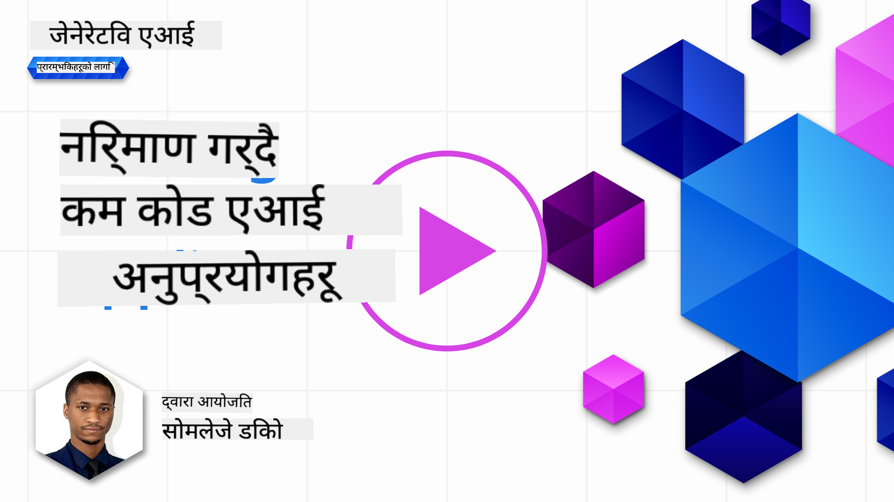
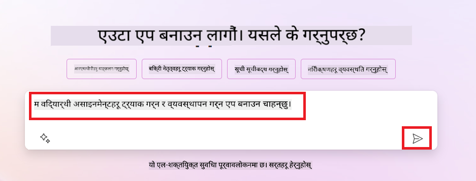
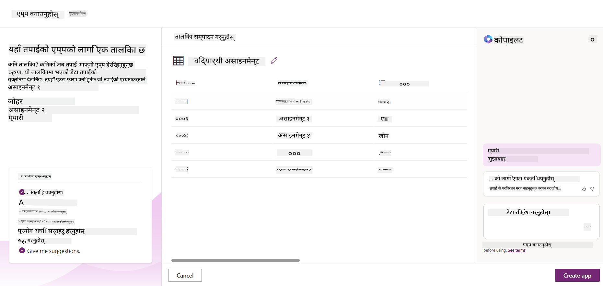
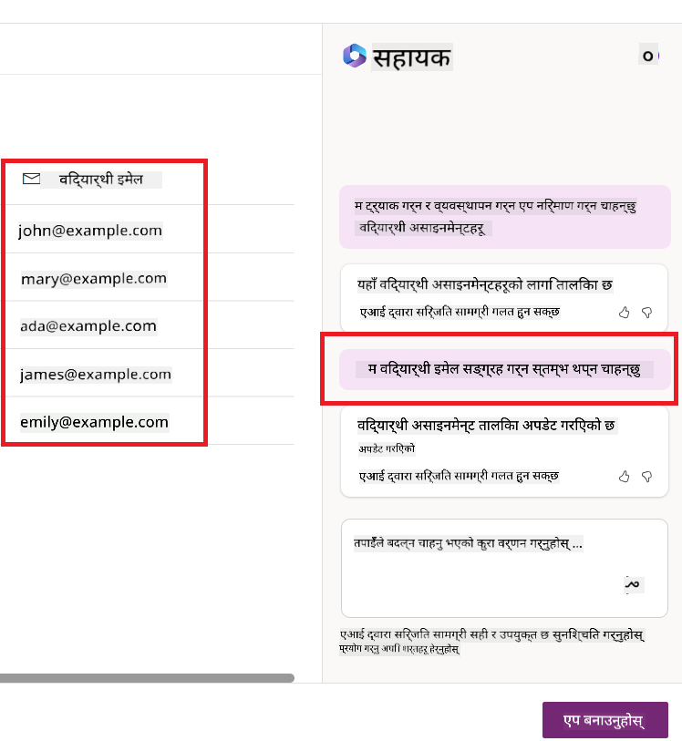
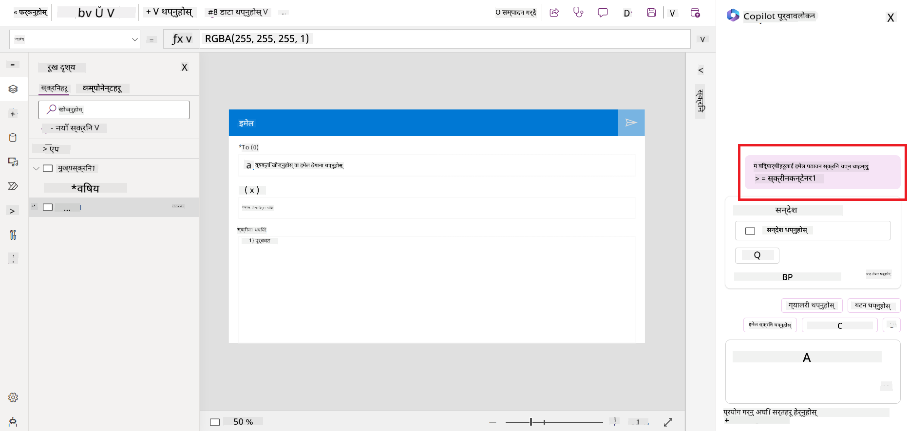
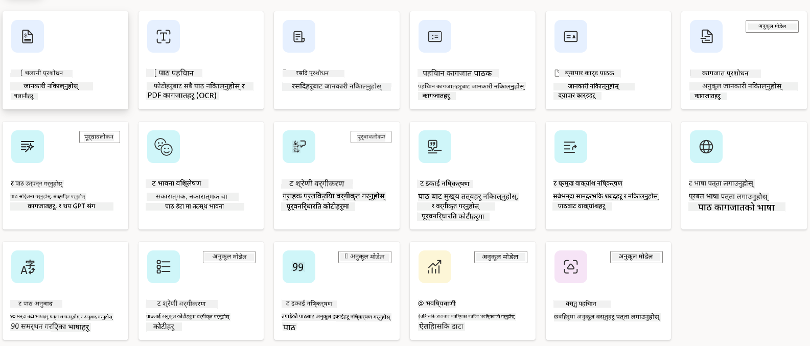
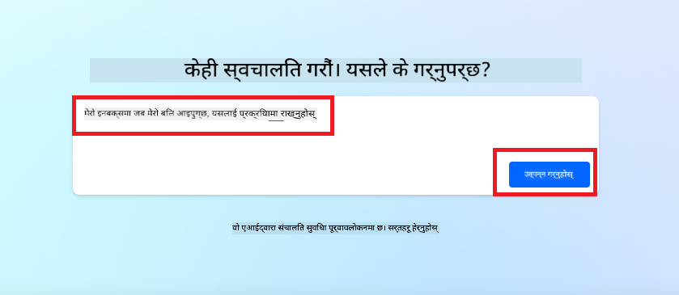
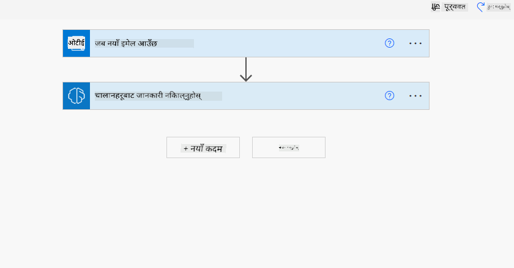
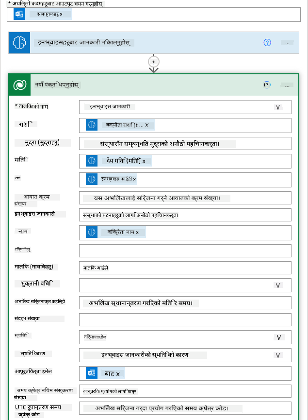
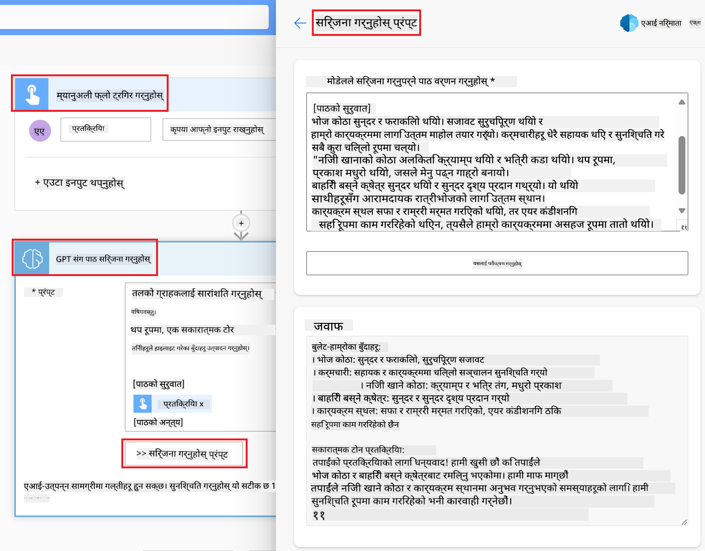

<!--
CO_OP_TRANSLATOR_METADATA:
{
  "original_hash": "f5ff3b6204a695a117d6f452403c95f7",
  "translation_date": "2025-06-25T18:26:21+00:00",
  "source_file": "10-building-low-code-ai-applications/README.md",
  "language_code": "ne"
}
-->
# लो कोड एआई अनुप्रयोग निर्माण

> _(यो पाठको भिडियो हेर्न माथिको तस्विरमा क्लिक गर्नुहोस्)_

## परिचय

अब हामीले तस्विर उत्पन्न गर्ने अनुप्रयोग कसरी निर्माण गर्ने सिकेका छौं, लो कोडको बारेमा कुरा गरौं। जेनेरेटिभ एआईलाई लो कोड लगायत विभिन्न क्षेत्रहरुमा प्रयोग गर्न सकिन्छ, तर लो कोड के हो र हामी यसमा कसरी एआई थप्न सक्छौं?

अनुप्रयोग र समाधान निर्माण पारम्परिक विकासकर्ताहरू र गैर-विकासकर्ताहरूको लागि लो कोड विकास प्लेटफर्मको प्रयोग मार्फत सजिलो भएको छ। लो कोड विकास प्लेटफर्महरूले तपाईंलाई थोरै वा कुनै कोड बिना अनुप्रयोग र समाधान निर्माण गर्न सक्षम बनाउँछ। यो एक दृश्य विकास वातावरण प्रदान गरेर हासिल गरिन्छ जसले तपाईंलाई अनुप्रयोग र समाधान निर्माण गर्नका लागि घटकहरूलाई ड्र्याग र ड्रप गर्न सक्षम बनाउँछ। यसले तपाईंलाई कम स्रोतहरू र छिटो अनुप्रयोग र समाधान निर्माण गर्न सक्षम बनाउँछ। यस पाठमा, हामी लो कोड कसरी प्रयोग गर्ने र पावर प्लेटफर्म प्रयोग गरेर एआईसँग लो कोड विकासलाई कसरी सुधार गर्ने भन्नेमा गहिराईमा जाँदैछौं।

पावर प्लेटफर्मले संस्थाहरूलाई आफ्नो टोलीलाई सहज लो कोड वा नो कोड वातावरण मार्फत आफ्नो समाधान निर्माण गर्न सशक्त बनाउने अवसर प्रदान गर्दछ। यस वातावरणले समाधान निर्माणको प्रक्रियालाई सरल बनाउँछ। पावर प्लेटफर्मको साथमा, समाधानहरू महिनाहरू वा वर्षहरू सट्टा दिन वा हप्तामा निर्माण गर्न सकिन्छ। पावर प्लेटफर्म पाँच प्रमुख उत्पादनहरू: पावर एप्स, पावर अटोमेट, पावर बीआई, पावर पेज र कोपाइलट स्टुडियो समावेश गर्दछ।

यस पाठले समेट्छ:

- पावर प्लेटफर्ममा जेनेरेटिभ एआईको परिचय
- कोपाइलटको परिचय र कसरी प्रयोग गर्ने
- पावर प्लेटफर्ममा अनुप्रयोग र फ्लो निर्माण गर्न जेनेरेटिभ एआईको प्रयोग
- एआई बिल्डरको साथ पावर प्लेटफर्ममा एआई मोडेलहरू बुझ्न

## सिकाइ लक्ष्यहरू

यस पाठको अन्त्यमा, तपाईं सक्षम हुनुहुनेछ:

- पावर प्लेटफर्ममा कोपाइलट कसरी काम गर्छ बुझ्न।

- हाम्रो शिक्षा स्टार्टअपको लागि विद्यार्थी असाइनमेन्ट ट्र्याकर एप निर्माण गर्न।

- एआईलाई प्रयोग गरेर इनभ्वाइसबाट जानकारी निकाल्ने इनभ्वाइस प्रोसेसिङ फ्लो निर्माण गर्न।

- GPT एआई मोडेलको साथ टेक्स्ट सिर्जना गर्दा उत्तम अभ्यासहरू लागू गर्न।

यस पाठमा तपाईंले प्रयोग गर्ने उपकरणहरू र प्रविधिहरू:

- **पावर एप्स**, विद्यार्थी असाइनमेन्ट ट्र्याकर एपको लागि, जसले डेटा ट्र्याक, व्यवस्थापन र अन्तरक्रिया गर्न अनुप्रयोगहरू निर्माण गर्न लो कोड विकास वातावरण प्रदान गर्दछ।

- **डेटाभर्स**, विद्यार्थी असाइनमेन्ट ट्र्याकर एपको डेटा भण्डारण गर्न जहाँ डेटाभर्सले एपको डेटा भण्डारण गर्न लो कोड डेटा प्लेटफर्म प्रदान गर्दछ।

- **पावर अटोमेट**, इनभ्वाइस प्रोसेसिङ फ्लोको लागि जहाँ तपाईं इनभ्वाइस प्रोसेसिङ प्रक्रिया स्वचालित गर्न वर्कफ्लो निर्माण गर्न लो कोड विकास वातावरण पाउनुहुन्छ।

- **एआई बिल्डर**, इनभ्वाइस प्रोसेसिङ एआई मोडेलको लागि जहाँ तपाईं हाम्रो स्टार्टअपको लागि इनभ्वाइसहरू प्रक्रिया गर्न पूर्वनिर्मित एआई मोडेलहरू प्रयोग गर्नुहुन्छ।

## पावर प्लेटफर्ममा जेनेरेटिभ एआई

लो कोड विकास र अनुप्रयोगलाई जेनेरेटिभ एआईसँग सुधार गर्नु पावर प्लेटफर्मको प्रमुख ध्यान क्षेत्र हो। लक्ष्य सबैलाई एआई-संचालित अनुप्रयोग, साइट, ड्यासबोर्ड निर्माण गर्न र एआईको साथ प्रक्रियाहरू स्वचालित गर्न सक्षम बनाउनु हो, _कुनै डेटा विज्ञान विशेषज्ञता आवश्यक बिना_। यो लक्ष्य पावर प्लेटफर्ममा लो कोड विकास अनुभवमा कोपाइलट र एआई बिल्डरको रूपमा जेनेरेटिभ एआईलाई एकीकृत गरेर हासिल गरिन्छ।

### यो कसरी काम गर्छ?

कोपाइलट एक एआई सहायक हो जसले तपाईंलाई प्राकृतिक भाषामा संवादात्मक चरणहरूको श्रृंखलामा तपाईंको आवश्यकताहरू वर्णन गरेर पावर प्लेटफर्म समाधानहरू निर्माण गर्न सक्षम बनाउँछ। उदाहरणको लागि, तपाईं आफ्नो एआई सहायकलाई तपाईंको अनुप्रयोगले प्रयोग गर्ने क्षेत्रहरू के हो भनी निर्देशन दिन सक्नुहुन्छ र यसले अनुप्रयोग र अन्तर्निहित डेटा मोडेल दुवै निर्माण गर्नेछ वा तपाईं पावर अटोमेटमा फ्लो सेट अप कसरी गर्ने भनी निर्दिष्ट गर्न सक्नुहुन्छ।

तपाईं आफ्नो अनुप्रयोग स्क्रिनहरूमा सुविधाको रूपमा कोपाइलट संचालित कार्यक्षमता प्रयोग गर्न सक्नुहुन्छ ताकि प्रयोगकर्ताहरू संवादात्मक अन्तरक्रियाहरू मार्फत अन्तर्दृष्टि पत्ता लगाउन सकून्।

एआई बिल्डर पावर प्लेटफर्ममा उपलब्ध लो कोड एआई क्षमता हो जसले तपाईंलाई प्रक्रियाहरू स्वचालित गर्न र परिणामहरूको भविष्यवाणी गर्न एआई मोडेलहरू प्रयोग गर्न सक्षम बनाउँछ। एआई बिल्डरको साथमा तपाईं आफ्नो डेटा डेटाभर्स वा विभिन्न क्लाउड डेटा स्रोतहरू जस्तै SharePoint, OneDrive वा Azure मा जडान गर्ने एप्स र फ्लोमा एआई ल्याउन सक्नुहुन्छ।

कोपाइलट सबै पावर प्लेटफर्म उत्पादनहरूमा उपलब्ध छ: पावर एप्स, पावर अटोमेट, पावर बीआई, पावर पेज र पावर भर्चुअल एजेन्टहरू। एआई बिल्डर पावर एप्स र पावर अटोमेटमा उपलब्ध छ। यस पाठमा, हामी हाम्रो शिक्षा स्टार्टअपको लागि समाधान निर्माण गर्न पावर एप्स र पावर अटोमेटमा कोपाइलट र एआई बिल्डर कसरी प्रयोग गर्ने भन्नेमा ध्यान केन्द्रित गर्नेछौं।

### पावर एप्समा कोपाइलट

पावर प्लेटफर्मको भागको रूपमा, पावर एप्सले डेटा ट्र्याक, व्यवस्थापन र अन्तरक्रिया गर्न अनुप्रयोगहरू निर्माण गर्न लो कोड विकास वातावरण प्रदान गर्दछ। यो स्केलेबल डेटा प्लेटफर्म र क्लाउड सेवाहरू र अन-प्रिमाइस डेटा जडान गर्ने क्षमता भएको एप विकास सेवाहरूको एक सुट हो। पावर एप्सले तपाईंलाई ब्राउजरहरू, ट्याब्लेटहरू, र फोनहरूमा चल्ने अनुप्रयोगहरू निर्माण गर्न अनुमति दिन्छ, र सहकर्मीहरूसँग साझा गर्न सकिन्छ। पावर एप्सले प्रयोगकर्ताहरूलाई सरल इन्टरफेसको साथमा एप विकासमा सहज बनाउँछ, ताकि प्रत्येक व्यवसाय प्रयोगकर्ता वा प्रो विकासकर्ता कस्टम एप्स निर्माण गर्न सकून्। जेनेरेटिभ एआईको साथमा कोपाइलटको माध्यमबाट एप विकास अनुभव पनि सुधार गरिएको छ।

पावर एप्समा कोपाइलट एआई सहायक सुविधा तपाईंलाई तपाईंलाई कस्तो प्रकारको एप चाहिन्छ र तपाईंको एपले के जानकारी ट्र्याक, सङ्कलन, वा देखाउन चाहन्छ भनी वर्णन गर्न सक्षम बनाउँछ। कोपाइलटले त्यसपछि तपाईंको वर्णनको आधारमा प्रतिक्रियात्मक क्यानभास एप उत्पन्न गर्दछ। तपाईं त्यसपछि आफ्नो आवश्यकताहरू पूरा गर्न एप अनुकूलित गर्न सक्नुहुन्छ। एआई कोपाइलटले तपाईंलाई ट्र्याक गर्न चाहेको डेटा भण्डारण गर्न आवश्यक क्षेत्रहरू भएको डेटाभर्स टेबल सुझाव दिन्छ र केही नमूना डेटा। हामी यस पाठमा पछि डेटाभर्स के हो र तपाईं पावर एप्समा यसलाई कसरी प्रयोग गर्न सक्नुहुन्छ हेर्नेछौं। तपाईं त्यसपछि संवादात्मक चरणहरूको माध्यमबाट एआई कोपाइलट सहायक सुविधाको प्रयोग गरेर टेबललाई आफ्नो आवश्यकताहरू पूरा गर्न अनुकूलित गर्न सक्नुहुन्छ। यो सुविधा पावर एप्स होम स्क्रिनबाट सजिलै उपलब्ध छ।

### पावर अटोमेटमा कोपाइलट

पावर प्लेटफर्मको भागको रूपमा, पावर अटोमेटले प्रयोगकर्ताहरूलाई अनुप्रयोगहरू र सेवाहरू बीच स्वचालित वर्कफ्लोहरू सिर्जना गर्न अनुमति दिन्छ। यसले संचार, डेटा सङ्कलन, र निर्णय स्वीकृतिहरू जस्ता दोहोरिने व्यवसाय प्रक्रियाहरू स्वचालित गर्न मद्दत गर्छ। यसको सरल इन्टरफेसले प्रत्येक प्राविधिक दक्षता भएका प्रयोगकर्ताहरूलाई (सुरुवातकर्तादेखि अनुभवी विकासकर्ताहरूसम्म) काम कार्यहरू स्वचालित गर्न अनुमति दिन्छ। वर्कफ्लो विकास अनुभव पनि जेनेरेटिभ एआईको माध्यमबाट कोपाइलटसँग सुधार गरिएको छ।

पावर अटोमेटमा कोपाइलट एआई सहायक सुविधा तपाईंलाई तपाईंलाई कस्तो प्रकारको फ्लो चाहिन्छ र तपाईंको फ्लोले के कार्यहरू प्रदर्शन गर्न चाहन्छ भनी वर्णन गर्न सक्षम बनाउँछ। कोपाइलटले त्यसपछि तपाईंको वर्णनको आधारमा फ्लो उत्पन्न गर्दछ। तपाईं त्यसपछि आफ्नो आवश्यकताहरू पूरा गर्न फ्लो अनुकूलित गर्न सक्नुहुन्छ। एआई कोपाइलटले तपाईंलाई स्वचालित गर्न चाहेको कार्यलाई प्रदर्शन गर्न आवश्यक कार्यहरू सुझाव दिन्छ। हामी यस पाठमा पछि फ्लो के हो र तपाईं पावर अटोमेटमा यसलाई कसरी प्रयोग गर्न सक्नुहुन्छ हेर्नेछौं। तपाईं त्यसपछि संवादात्मक चरणहरूको माध्यमबाट एआई कोपाइलट सहायक सुविधाको प्रयोग गरेर कार्यहरूलाई आफ्नो आवश्यकताहरू पूरा गर्न अनुकूलित गर्न सक्नुहुन्छ। यो सुविधा पावर अटोमेट होम स्क्रिनबाट सजिलै उपलब्ध छ।

## असाइनमेन्ट: हाम्रो स्टार्टअपको लागि विद्यार्थी असाइनमेन्ट र इनभ्वाइसहरू व्यवस्थापन गर्नुहोस्, कोपाइलटको प्रयोग गरेर

हाम्रो स्टार्टअपले विद्यार्थीहरूलाई अनलाइन पाठ्यक्रमहरू प्रदान गर्दछ। स्टार्टअप छिटो बढेको छ र अब यसको पाठ्यक्रमहरूको मागलाई पूरा गर्न संघर्ष गर्दैछ। स्टार्टअपले तपाईंलाई पावर प्लेटफर्म विकासकर्ता रूपमा भर्ती गरेको छ ताकि उनीहरूलाई विद्यार्थी असाइनमेन्ट र इनभ्वाइसहरू व्यवस्थापन गर्न मद्दत गर्न लो कोड समाधान निर्माण गर्न मद्दत गर्न सकून्। उनीहरूको समाधानले उनीहरूलाई एप मार्फत विद्यार्थी असाइनमेन्टहरू ट्र्याक र व्यवस्थापन गर्न मद्दत गर्न सक्षम हुनुपर्छ र वर्कफ्लो मार्फत इनभ्वाइस प्रोसेसिङ प्रक्रियालाई स्वचालित गर्न सक्षम हुनुपर्छ। तपाईंलाई समाधान विकास गर्न जेनेरेटिभ एआई प्रयोग गर्न अनुरोध गरिएको छ।

जब तपाईं कोपाइलटको प्रयोग गरेर सुरु गर्दै हुनुहुन्छ, तपाईं [पावर प्लेटफर्म कोपाइलट प्रम्प्ट लाइब्रेरी](https://github.com/pnp/powerplatform-prompts?WT.mc_id=academic-109639-somelezediko) प्रयोग गर्न सक्नुहुन्छ प्रम्प्टहरूका साथमा सुरु गर्न। यो लाइब्रेरीमा तपाईंले कोपाइलटको साथमा अनुप्रयोगहरू र फ्लोहरू निर्माण गर्न प्रयोग गर्न सक्ने प्रम्प्टहरूको सूची समावेश गर्दछ। तपाईंले लाइब्रेरीमा प्रम्प्टहरू प्रयोग गरेर कोपाइलटलाई तपाईंको आवश्यकताहरू कसरी वर्णन गर्ने विचार प्राप्त गर्न सक्नुहुन्छ।

### हाम्रो स्टार्टअपको लागि विद्यार्थी असाइनमेन्ट ट्र्याकर एप निर्माण गर्नुहोस्

हाम्रो स्टार्टअपका शिक्षकहरूले विद्यार्थी असाइनमेन्टहरू ट्र्याक गर्न संघर्ष गर्दैछन्। उनीहरूले असाइनमेन्टहरू ट्र्याक गर्न स्प्रेडशीट प्रयोग गर्दै आएका छन् तर विद्यार्थीहरूको संख्या बढेको कारणले यसलाई व्यवस्थापन गर्न कठिन भएको छ। उनीहरूले तपाईंलाई असाइनमेन्टहरू ट्र्याक र व्यवस्थापन गर्न मद्दत गर्ने एप निर्माण गर्न अनुरोध गरेका छन्। एपले उनीहरूलाई नयाँ असाइनमेन्टहरू थप्न, असाइनमेन्टहरू हेर्न, असाइनमेन्टहरू अद्यावधिक गर्न र असाइनमेन्टहरू हटाउन सक्षम बनाउनुपर्छ। एपले शिक्षकहरू र विद्यार्थीहरूलाई ग्रेड गरिएको असाइनमेन्टहरू र ग्रेड नगरिएको असाइनमेन्टहरू हेर्न सक्षम बनाउनुपर्छ।

तपाईंले पावर एप्समा कोपाइलटको प्रयोग गरेर तलका चरणहरू पालना गर्दै एप निर्माण गर्नुहुनेछ:

1. [पावर एप्स](https://make.powerapps.com?WT.mc_id=academic-105485-koreyst) होम स्क्रिनमा जानुहोस्।

1. होम स्क्रिनमा रहेको पाठ क्षेत्र प्रयोग गरेर तपाईं निर्माण गर्न चाहेको एप वर्णन गर्नुहोस्। उदाहरणका लागि, **_म विद्यार्थी असाइनमेन्टहरू ट्र्याक र व्यवस्थापन गर्न एप निर्माण गर्न चाहन्छु_**। एआई कोपाइलटलाई प्रम्प्ट पठाउन **सेन्ड** बटनमा क्लिक गर्नुहोस्।

1. एआई कोपाइलटले तपाईंलाई ट्र्याक गर्न चाहेको डेटा भण्डारण गर्न आवश्यक क्षेत्रहरू भएको डेटाभर्स टेबल सुझाव दिन्छ र केही नमूना डेटा। तपाईं त्यसपछि संवादात्मक चरणहरूको माध्यमबाट एआई कोपाइलट सहायक सुविधाको प्रयोग गरेर टेबललाई आफ्नो आवश्यकताहरू पूरा गर्न अनुकूलित गर्न सक्नुहुन्छ।

   > **महत्वपूर्ण**: डेटाभर्स पावर प्लेटफर्मको लागि अन्तर्निहित डेटा प्लेटफर्म हो। यो एपको डेटा भण्डारण गर्न लो कोड डेटा प्लेटफर्म हो। यो पूर्ण रूपमा व्यवस्थापन गरिएको सेवा हो जसले डेटा माइक्रोसफ्ट क्लाउडमा सुरक्षित रूपमा भण्डारण गर्दछ र तपाईंको पावर प्लेटफर्म वातावरण भित्र प्रावधान गरिएको छ। यसमा डेटा वर्गीकरण, डेटा वंशावली, सूक्ष्म पहुँच नियन्त्रण, र थप जस्ता निर्मित डेटा शासन क्षमताहरू छन्। तपाईं डेटाभर्सको बारेमा [यहाँ](https://docs.microsoft.com/powerapps/maker/data-platform/data-platform-intro?WT.mc_id=academic-109639-somelezediko) थप जान्न सक्नुहुन्छ।

   

1. शिक्षकहरू असाइनमेन्ट पेश गरेका विद्यार्थीहरूलाई उनीहरूको असाइनमेन्टको प्रगतिको बारेमा अपडेट राख्न इमेल पठाउन चाहन्छन्। तपाईं विद्यार्थी इमेल भण्डारण गर्न टेबलमा नयाँ क्षेत्र थप्न कोपाइलट प्रयोग गर्न सक्नुहुन्छ। उदाहरणका लागि, तपाईं निम्न प्रम्प्ट प्रयोग गरेर टेबलमा नयाँ क्षेत्र थप्न सक्नुहुन्छ: **_म विद्यार्थी इमेल भण्डारण गर्न स्तम्भ थप्न चाहन्छु_**। एआई कोपाइलटलाई प्रम्प्ट पठाउन **सेन्ड** बटनमा क्लिक गर्नुहोस्।

1. एआई कोपाइलटले नयाँ क्षेत्र उत्पन्न गर्नेछ र तपाईं त्यसपछि क्षेत्रलाई आफ्नो आवश्यकताहरू पूरा गर्न अनुकूलित गर्न सक्नुहुन्छ।

1. टेबल समाप्त भएपछि, एप निर्माण गर्न **क्रिएट एप** बटनमा क्लिक गर्नुहोस्।

1. एआई कोपाइलटले तपाईंको वर्णनको आधारमा प्रतिक्रियात्मक क्यानभास एप उत्पन्न गर्नेछ। तपाईं त्यसपछि एपलाई आफ्नो आवश्यकताहरू पूरा गर्न अनुकूलित गर्न सक्नुहुन्छ।

1. शिक्षकहरूले विद्यार्थीहरूलाई इमेल पठाउनको लागि, तपाईं एपमा नयाँ स्क्रिन थप्न कोपाइलट प्रयोग गर्न सक्नुहुन्छ। उदाहरणका लागि, तपाईं एपमा नयाँ स्क्रिन थप्न निम्न प्रम्प्ट प्रयोग गर्न सक्नुहुन्छ: **_म विद्यार्थीहरूलाई इमेल पठाउन स्क्रिन थप्न चाहन्छु_**। एआई कोपाइलटलाई प्रम्प्ट पठाउन **सेन्ड** बटनमा क्लिक गर्नुहोस्।

1. एआई कोपाइलटले नयाँ स्क्रिन उत्पन्न गर्नेछ र तपाईं त्यसपछि स्क्रिनलाई आफ्नो आवश्यकताहरू पूरा गर्न अनुकूलित गर्न सक्नुहुन्छ।

1. एप समाप्त भएपछि, एप बचत गर्न **सेभ** बटनमा क्लिक गर्नुहोस्।

1. शिक्षकहरूसँग एप साझा गर्न, **सेयर** बटनमा क्लिक गर्नुहोस् र त्यसपछि पुन: **सेयर** बटनमा क्लिक गर्नुहोस्। तपाईं त्यसपछि शिक्षकहरूसँग एप साझा गर्न उनीहरूको इमेल ठेगानाहरू प्रविष्ट गरेर साझा गर्न सक्नुहुन्छ।

> **तपाईंको गृहकार्य**: तपाईंले निर्माण गरेको एप राम्रो सुरुवात हो तर सुधार गर्न सकिन्छ। इमेल सुविधाको साथमा, शिक्षकहरूले विद्यार्थीहरूलाई इमेल पठाउन केवल म्यानुअली उनीहरूको इमेल टाइप गरेर पठाउन सक्छन्। के तपाईं शिक्षकहरूले असाइनमेन्ट पेश गर्दा विद्यार्थीहरूलाई स्वचालित रूपमा इमेल पठाउन सक्षम हुने स्वचालन निर्माण गर्न कोपाइलट प्रयोग गर्न सक्नुहुन्छ? तपाईंको संकेत सही प्रम्प्टको साथमा तपाईं पावर अटोमेटमा कोपाइलट प्रयोग गरेर यो निर्माण गर्न सक्नुहुन्छ।

### हाम्रो स्टार्टअपको लागि इनभ्वाइस जानकारी तालिका निर्माण गर्नुहोस्

हाम्रो स्टार्टअपको वित्त टोलीले इनभ्वाइसहरू ट्र्याक गर्न संघर्ष गर्दैछ। उनीहरूले इनभ्वाइसहरू ट्र्याक गर्न स्प्रेडशीट प्रयोग गर्दै आएका छन् तर इनभ्वाइसहरूको संख्या बढेको कारणले यसलाई व्यवस्थापन गर्न कठिन भएको छ। उनीहरूले तपाईंलाई प्राप्त गरेका इनभ्वाइसहरूको जानकारी भण्डारण, ट्र्याक र व्यवस्थापन गर्न मद्दत गर्ने तालिका निर्माण गर्न अनुरोध गरेका छन्। तालिकालाई स्वचालन निर्माण गर्न प्रयोग गर्नुपर्छ जसले सबै इनभ्वाइस जानकारी निकाल्नेछ र तालिकामा भण्डारण गर्नेछ। तालिकाले वित्त टोलीलाई भुक्तानी भएका इनभ्वाइसहरू र भुक्तानी नगरिएका इनभ्वाइसहरू हेर्न सक्षम बनाउनुपर्छ।

पावर प्लेटफर्मसँग डेटाभर्स नामक अन्तर्निहित डेटा प्लेटफर्म छ जसले तपाईंलाई तपाईंको अनुप्रयोगहरू र समाधानहरूको डेटा भण्डारण गर्न सक्षम
एक पाठ। - **भाव विश्लेषण**: यो मोडेलले पाठमा सकारात्मक, नकारात्मक, तटस्थ, वा मिश्रित भावना पत्ता लगाउँछ। - **बिजनेस कार्ड रिडर**: यो मोडेलले बिजनेस कार्डबाट जानकारी निकाल्छ। - **पाठ मान्यता**: यो मोडेलले चित्रबाट पाठ निकाल्छ। - **वस्तु पहिचान**: यो मोडेलले चित्रबाट वस्तुहरू पत्ता लगाउँछ र निकाल्छ। - **कागजात प्रशोधन**: यो मोडेलले फारमबाट जानकारी निकाल्छ। - **चलानी प्रशोधन**: यो मोडेलले चलानीबाट जानकारी निकाल्छ। कस्टम AI मोडेलहरू प्रयोग गरेर तपाईं आफ्नो मोडेललाई AI Builder मा ल्याउन सक्नुहुन्छ ताकि यसले कुनै पनि AI Builder कस्टम मोडेल जस्तै काम गर्न सक्दछ, तपाईंको आफ्नै डाटाको प्रयोग गरेर मोडेललाई प्रशिक्षण दिने अनुमति दिन्छ। तपाईं यी मोडेलहरूलाई प्रक्रियाहरू स्वचालित गर्न र Power Apps र Power Automate दुवैमा परिणामहरू भविष्यवाणी गर्न प्रयोग गर्न सक्नुहुन्छ। आफ्नो मोडेल प्रयोग गर्दा केही सीमितताहरू लागु हुन्छन्। यी [सीमितताहरू](https://learn.microsoft.com/ai-builder/byo-model#limitations?WT.mc_id=academic-105485-koreyst) मा थप पढ्नुहोस्। 

## कार्य #2 - हाम्रो स्टार्टअपको लागि चलानी प्रशोधन फ्लो बनाउनुहोस्

वित्त टोलीले चलानीहरू प्रशोधन गर्न संघर्ष गरिरहेको छ। उनीहरूले चलानीहरू ट्र्याक गर्न स्प्रेडशीट प्रयोग गरिरहेका छन् तर चलानीहरूको संख्या बढेसँगै यसलाई व्यवस्थापन गर्न गाह्रो भएको छ। उनीहरूले तपाईंलाई AI प्रयोग गरेर चलानीहरू प्रशोधन गर्न मद्दत गर्ने कार्यप्रवाह निर्माण गर्न अनुरोध गरेका छन्। कार्यप्रवाहले उनीहरूलाई चलानीहरूबाट जानकारी निकाल्न र Dataverse तालिकामा जानकारी भण्डारण गर्न सक्षम पार्नु पर्छ। कार्यप्रवाहले उनीहरूलाई वित्त टोलीलाई निकालिएको जानकारीसहित इमेल पठाउन सक्षम पार्नु पर्छ। अब तपाईंलाई थाहा छ कि AI Builder के हो र किन तपाईंले यसलाई प्रयोग गर्नु पर्छ, आउनुहोस् हेर्नुहोस् कि तपाईं AI Builder मा चलानी प्रशोधन AI मोडेल कसरी प्रयोग गर्न सक्नुहुन्छ, जुन हामीले पहिले कभर गरेका थियौं, वित्त टोलीलाई चलानीहरू प्रशोधन गर्न मद्दत गर्ने कार्यप्रवाह निर्माण गर्न। AI Builder मा चलानी प्रशोधन AI मोडेल प्रयोग गरेर वित्त टोलीलाई चलानीहरू प्रशोधन गर्न मद्दत गर्ने कार्यप्रवाह निर्माण गर्न, तलका चरणहरू पालना गर्नुहोस्:

1. [Power Automate](https://make.powerautomate.com?WT.mc_id=academic-105485-koreyst) होम स्क्रिनमा जानुहोस्।
2. होम स्क्रिनमा तपाईं निर्माण गर्न चाहने कार्यप्रवाह वर्णन गर्न पाठ क्षेत्र प्रयोग गर्नुहोस्। उदाहरणको लागि, **_मेरो मेलबक्समा आउँदा चलानी प्रशोधन गर्नुहोस्_**। AI Copilot लाई प्रॉम्प्ट पठाउन **पठाउनुहोस्** बटनमा क्लिक गर्नुहोस्। 
3. AI Copilot ले तपाईंले स्वचालित गर्न चाहने कार्य प्रदर्शन गर्न आवश्यक कार्यहरू सुझाव दिनेछ। तपाईं **अर्को** बटनमा क्लिक गरेर अर्को चरणहरूमा जान सक्नुहुन्छ।
4. अर्को चरणमा, Power Automate ले तपाईंलाई फ्लोको लागि आवश्यक कनेक्शनहरू सेट अप गर्न प्रॉम्प्ट गर्नेछ। तपाईं समाप्त भएपछि, फ्लो सिर्जना गर्न **फ्लो सिर्जना गर्नुहोस्** बटनमा क्लिक गर्नुहोस्।
5. AI Copilot ले फ्लो सिर्जना गर्नेछ र त्यसपछि तपाईंले फ्लोलाई आफ्नो आवश्यकताहरू अनुसार अनुकूलित गर्न सक्नुहुन्छ।
6. फ्लोको ट्रिगर अद्यावधिक गर्नुहोस् र **फोल्डर** लाई फ्लो स्टोर गरिने फोल्डरमा सेट गर्नुहोस्। उदाहरणको लागि, तपाईं फोल्डरलाई **इनबक्स** मा सेट गर्न सक्नुहुन्छ। **उन्नत विकल्पहरू देखाउनुहोस्** मा क्लिक गर्नुहोस् र **केवल अट्याचमेन्टसहित** लाई **हो** मा सेट गर्नुहोस्। यसले सुनिश्चित गर्नेछ कि फ्लो केवल फोल्डरमा अट्याचमेन्टसहित इमेल प्राप्त हुँदा मात्र चल्छ।
7. फ्लोबाट निम्न कार्यहरू हटाउनुहोस्: **HTML to text**, **Compose**, **Compose 2**, **Compose 3** र **Compose 4** किनकि तपाईंले ती प्रयोग गर्ने छैनन्।
8. फ्लोबाट **Condition** कार्य हटाउनुहोस् किनकि तपाईंले यो प्रयोग गर्ने छैनन्। यो निम्न स्क्रीनशट जस्तै देखिनु पर्छ: 
9. **एक कार्य थप्नुहोस्** बटनमा क्लिक गर्नुहोस् र **Dataverse** खोज्नुहोस्। **नयाँ पङ्क्ति थप्नुहोस्** कार्य चयन गर्नुहोस्।
10. **चलानीहरूबाट जानकारी निकाल्नुहोस्** कार्यमा, **चलानी फाइल** लाई इमेलबाट **अट्याचमेन्ट सामग्री** मा निर्देश गर्नुहोस्। यसले सुनिश्चित गर्नेछ कि फ्लो चलानी अट्याचमेन्टबाट जानकारी निकाल्छ।
11. तपाईंले पहिले सिर्जना गरेको **तालिका** चयन गर्नुहोस्। उदाहरणको लागि, तपाईं **चलानी जानकारी** तालिका चयन गर्न सक्नुहुन्छ। पछिल्लो कार्यबाट गतिशील सामग्री चयन गर्नुहोस् निम्न क्षेत्रहरू भर्नको लागि: - ID - Amount - Date - Name - Status - **Status** लाई **Pending** मा सेट गर्नुहोस्। - Supplier Email - **जब नयाँ इमेल आउँछ** ट्रिगरबाट **From** गतिशील सामग्री प्रयोग गर्नुहोस्। 
12. फ्लो समाप्त भएपछि, फ्लो बचत गर्न **बचत गर्नुहोस्** बटनमा क्लिक गर्नुहोस्। तपाईंले ट्रिगरमा निर्दिष्ट गरेको फोल्डरमा चलानीसहित इमेल पठाएर फ्लो परीक्षण गर्न सक्नुहुन्छ।

> **तपाईंको गृहकार्य**: तपाईंले निर्माण गरेको फ्लो राम्रो सुरुवात हो, अब तपाईंले हाम्रो वित्त टोलीलाई उनीहरूको चलानीको वर्तमान स्थिति अपडेट गर्न आपूर्तिकर्तालाई इमेल पठाउन सक्षम बनाउने स्वचालन कसरी निर्माण गर्न सक्नुहुन्छ सोच्न आवश्यक छ। तपाईंको संकेत: फ्लो चलानीको स्थिति परिवर्तन हुँदा चल्नु पर्छ।

## Power Automate मा पाठ उत्पादन AI मोडेल प्रयोग गर्नुहोस्

AI Builder मा GPT AI मोडेलको साथ पाठ सिर्जना गर्नुहोस् तपाईंलाई प्रॉम्प्टको आधारमा पाठ उत्पादन गर्न सक्षम बनाउँछ र यो Microsoft Azure OpenAI सेवाबाट संचालित छ। यस क्षमताको साथ, तपाईं GPT (Generative Pre-Trained Transformer) प्रविधिलाई तपाईंको एपहरू र फ्लोहरूमा समाहित गर्न सक्नुहुन्छ विभिन्न स्वचालित फ्लोहरू र सूचनात्मक एप्लिकेशनहरू निर्माण गर्न।

GPT मोडेलहरू विशाल मात्रामा डाटामा व्यापक प्रशिक्षणबाट गुज्रन्छन्, जसले गर्दा उनीहरूले प्रॉम्प्ट प्रदान गर्दा मानव भाषाजस्तै पाठ उत्पादन गर्न सक्षम बनाउँछन्। कार्यप्रवाह स्वचालनसँग एकीकृत हुँदा, GPT जस्ता AI मोडेलहरूलाई कार्यहरूको विस्तृत श्रृंखला सरल बनाउन र स्वचालित गर्न प्रयोग गर्न सकिन्छ।

उदाहरणको लागि, तपाईं विभिन्न प्रयोग केसहरूको लागि स्वचालित रूपमा पाठ उत्पादन गर्न फ्लोहरू निर्माण गर्न सक्नुहुन्छ, जस्तै: इमेलका ड्राफ्टहरू, उत्पादन विवरणहरू, र थप। तपाईं मोडेललाई विभिन्न एपहरूका लागि पाठ उत्पादन गर्न पनि प्रयोग गर्न सक्नुहुन्छ, जस्तै च्याटबोटहरू र ग्राहक सेवा एपहरू जसले ग्राहक सेवा एजेन्टहरूलाई ग्राहकको सोधपुछमा प्रभावकारी र कुशलतापूर्वक प्रतिक्रिया दिन सक्षम बनाउँछ।

Power Automate मा यो AI मोडेल कसरी प्रयोग गर्ने सिक्न, [AI Builder र GPT संग बुद्धिमत्ता थप्नुहोस्](https://learn.microsoft.com/training/modules/ai-builder-text-generation/?WT.mc_id=academic-109639-somelezediko) मोड्युलमा जानुहोस्।

## उत्कृष्ट कार्य! तपाईंको सिकाइ जारी राख्नुहोस्

यो पाठ पूरा गरेपछि, हाम्रो [Generative AI Learning संग्रह](https://aka.ms/genai-collection?WT.mc_id=academic-105485-koreyst) हेर्नुहोस् तपाईंको Generative AI ज्ञान स्तरवृद्धि गर्न जारी राख्न!

पाठ 11 मा जानुहोस् जहाँ हामी [Function Calling संग Generative AI एकीकृत गर्ने](../11-integrating-with-function-calling/README.md?WT.mc_id=academic-105485-koreyst) हेर्नेछौं!

**अस्वीकरण**:  
यो दस्तावेज एआई अनुवाद सेवा [Co-op Translator](https://github.com/Azure/co-op-translator) प्रयोग गरेर अनुवाद गरिएको हो। हामी यथार्थताको लागि प्रयास गर्दछौं, कृपया सचेत रहनुहोस् कि स्वचालित अनुवादहरूले त्रुटिहरू वा अशुद्धताहरू समावेश गर्न सक्छ। यसको मातृभाषामा रहेको मूल दस्तावेजलाई आधिकारिक स्रोत मान्नुपर्छ। महत्वपूर्ण जानकारीको लागि, पेशेवर मानव अनुवाद सिफारिस गरिन्छ। यस अनुवादको प्रयोगबाट उत्पन्न कुनै पनि गलतफहमी वा गलत व्याख्या को लागी हामी जिम्मेवार छैनौं।