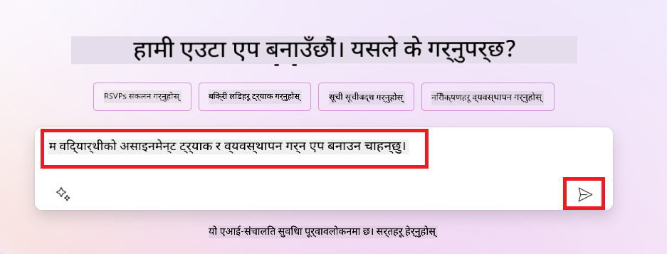
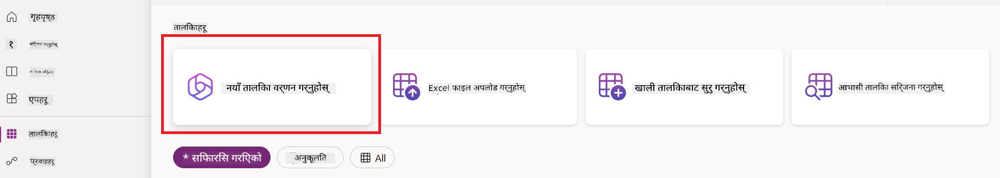
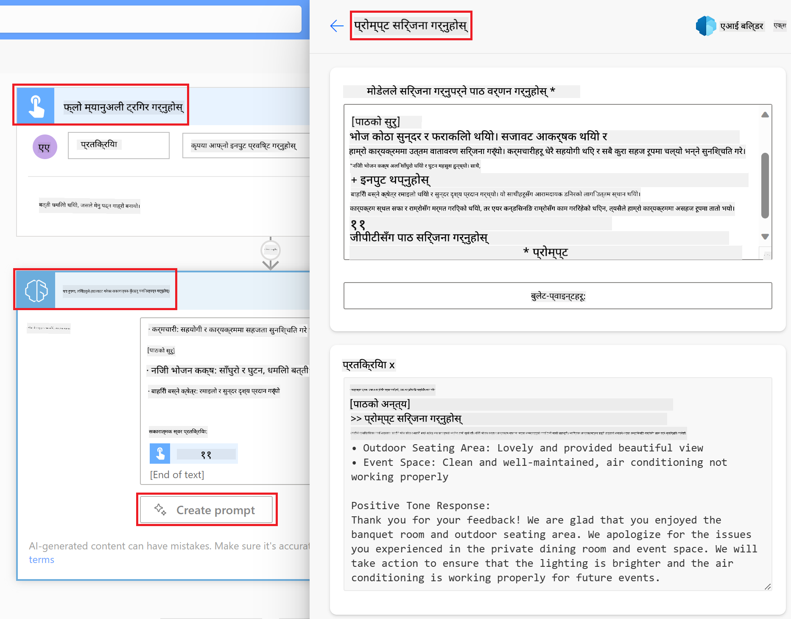

<!--
CO_OP_TRANSLATOR_METADATA:
{
  "original_hash": "846ac8e3b7dcfb697d3309fec05f0fea",
  "translation_date": "2025-10-17T13:55:42+00:00",
  "source_file": "10-building-low-code-ai-applications/README.md",
  "language_code": "ne"
}
-->
# कम कोड एआई एप्लिकेसन निर्माण

> _(माथिको तस्बिरमा क्लिक गरेर यो पाठको भिडियो हेर्नुहोस्)_

## परिचय

अब हामीले तस्बिर उत्पादन गर्ने एप्लिकेसन निर्माण गर्न सिकिसकेपछि, कम कोडको कुरा गरौं। जेनेरेटिभ एआई विभिन्न क्षेत्रहरूमा प्रयोग गर्न सकिन्छ, जसमा कम कोड पनि समावेश छ। तर कम कोड भनेको के हो र यसमा एआई कसरी थप्न सकिन्छ?

कम कोड विकास प्लेटफर्महरूको प्रयोगले परम्परागत विकासकर्ताहरू र गैर-विकासकर्ताहरूका लागि एप्स र समाधानहरू निर्माण गर्न सजिलो बनाएको छ। कम कोड विकास प्लेटफर्महरूले एप्स र समाधानहरू निर्माण गर्न थोरै वा कुनै कोडको आवश्यकता पर्दैन। यसले दृश्य विकास वातावरण प्रदान गरेर एप्स र समाधानहरू निर्माण गर्नका लागि कम्पोनेन्टहरू तान्न र छोड्न सक्षम बनाउँछ। यसले एप्स र समाधानहरू छिटो र कम स्रोतहरूमा निर्माण गर्न सक्षम बनाउँछ। यस पाठमा, हामी कम कोडको प्रयोग कसरी गर्ने र एआईको प्रयोग गरेर कम कोड विकासलाई कसरी सुधार गर्ने भन्नेमा गहिरो रूपमा छलफल गर्नेछौं।

पावर प्लेटफर्मले संस्थाहरूलाई आफ्ना टिमहरूलाई सहज कम-कोड वा नो-कोड वातावरणमार्फत आफ्नै समाधानहरू निर्माण गर्न सशक्त बनाउने अवसर प्रदान गर्दछ। यो वातावरणले समाधान निर्माणको प्रक्रियालाई सरल बनाउँछ। पावर प्लेटफर्मको प्रयोगले समाधानहरू महिनौं वा वर्षको सट्टा केही दिन वा हप्तामा निर्माण गर्न सकिन्छ। पावर प्लेटफर्म पाँच प्रमुख उत्पादनहरूमा विभाजित छ: पावर एप्स, पावर अटोमेट, पावर बीआई, पावर पेजेस र कोपाइलट स्टुडियो।

यो पाठले समेट्छ:

- पावर प्लेटफर्ममा जेनेरेटिभ एआईको परिचय
- कोपाइलटको परिचय र यसको प्रयोग कसरी गर्ने
- पावर प्लेटफर्ममा एप्स र फ्लोहरू निर्माण गर्न जेनेरेटिभ एआईको प्रयोग
- एआई बिल्डरको साथ पावर प्लेटफर्ममा एआई मोडेलहरूको समझ

## सिक्ने लक्ष्यहरू

यो पाठको अन्त्यसम्ममा, तपाईं सक्षम हुनुहुनेछ:

- पावर प्लेटफर्ममा कोपाइलट कसरी काम गर्छ भन्ने बुझ्न।

- हाम्रो शिक्षा स्टार्टअपका लागि विद्यार्थी असाइनमेन्ट ट्र्याकर एप निर्माण गर्न।

- इनभ्वाइस प्रोसेसिङ फ्लो निर्माण गर्न जसले इनभ्वाइसबाट जानकारी निकाल्न एआई प्रयोग गर्छ।

- GPT एआई मोडेलको साथ टेक्स्ट सिर्जना गर्दा उत्तम अभ्यासहरू लागू गर्न।

यो पाठमा तपाईंले प्रयोग गर्ने उपकरणहरू र प्रविधिहरू:

- **पावर एप्स**, विद्यार्थी असाइनमेन्ट ट्र्याकर एपका लागि, जसले डेटा ट्र्याक, व्यवस्थापन र अन्तरक्रिया गर्न एप्स निर्माण गर्न कम-कोड विकास वातावरण प्रदान गर्छ।

- **डेटाभर्स**, विद्यार्थी असाइनमेन्ट ट्र्याकर एपका लागि डेटा भण्डारण गर्न, जहाँ डेटाभर्सले एपको डेटा भण्डारण गर्न कम-कोड डेटा प्लेटफर्म प्रदान गर्छ।

- **पावर अटोमेट**, इनभ्वाइस प्रोसेसिङ फ्लोका लागि, जहाँ तपाईंले इनभ्वाइस प्रोसेसिङ प्रक्रिया स्वचालित गर्न वर्कफ्लो निर्माण गर्न कम-कोड विकास वातावरण पाउनुहुनेछ।

- **एआई बिल्डर**, इनभ्वाइस प्रोसेसिङ एआई मोडेलका लागि, जहाँ तपाईंले हाम्रो स्टार्टअपका लागि इनभ्वाइसहरू प्रक्रिया गर्न प्रिबिल्ट एआई मोडेलहरू प्रयोग गर्नुहुनेछ।

## पावर प्लेटफर्ममा जेनेरेटिभ एआई

कम-कोड विकास र एप्लिकेसनलाई जेनेरेटिभ एआईसँग सुधार गर्नु पावर प्लेटफर्मको प्रमुख ध्यान क्षेत्र हो। लक्ष्य भनेको सबैलाई डेटा विज्ञानको विशेषज्ञता बिना एआई-संचालित एप्स, साइटहरू, ड्यासबोर्डहरू निर्माण गर्न र प्रक्रियाहरू स्वचालित गर्न सक्षम बनाउनु हो। यो लक्ष्य पावर प्लेटफर्ममा कम-कोड विकास अनुभवमा जेनेरेटिभ एआईलाई कोपाइलट र एआई बिल्डरको रूपमा एकीकृत गरेर प्राप्त गरिन्छ।

### यो कसरी काम गर्छ?

कोपाइलट एक एआई सहायक हो जसले तपाईंलाई प्राकृतिक भाषाको प्रयोग गरेर संवादात्मक चरणहरूको श्रृंखलामा तपाईंको आवश्यकताहरू वर्णन गरेर पावर प्लेटफर्म समाधानहरू निर्माण गर्न सक्षम बनाउँछ। उदाहरणका लागि, तपाईं आफ्नो एआई सहायकलाई तपाईंको एपले कुन क्षेत्रहरू प्रयोग गर्ने भनेर बताउन निर्देशन दिन सक्नुहुन्छ, र यसले एप र अन्तर्निहित डेटा मोडेल दुवै निर्माण गर्नेछ। वा तपाईं पावर अटोमेटमा फ्लो सेटअप कसरी गर्ने भनेर निर्दिष्ट गर्न सक्नुहुन्छ।

तपाईं आफ्नो एप स्क्रिनहरूमा कोपाइलट संचालित कार्यक्षमताहरू प्रयोग गर्न सक्नुहुन्छ ताकि प्रयोगकर्ताहरू संवादात्मक अन्तरक्रियाहरू मार्फत अन्तर्दृष्टि पत्ता लगाउन सकून्।

एआई बिल्डर पावर प्लेटफर्ममा उपलब्ध कम-कोड एआई क्षमता हो जसले तपाईंलाई प्रक्रियाहरू स्वचालित गर्न र परिणामहरूको भविष्यवाणी गर्न मद्दत गर्न एआई मोडेलहरू प्रयोग गर्न सक्षम बनाउँछ। एआई बिल्डरको साथ, तपाईं आफ्नो एप्स र फ्लोहरूमा एआई ल्याउन सक्नुहुन्छ जुन डेटाभर्स वा विभिन्न क्लाउड डेटा स्रोतहरू, जस्तै SharePoint, OneDrive वा Azureसँग जडान हुन्छ।

कोपाइलट पावर प्लेटफर्मका सबै उत्पादनहरूमा उपलब्ध छ: पावर एप्स, पावर अटोमेट, पावर बीआई, पावर पेजेस र पावर भर्चुअल एजेन्ट्स। एआई बिल्डर पावर एप्स र पावर अटोमेटमा उपलब्ध छ। यस पाठमा, हामी हाम्रो शिक्षा स्टार्टअपका लागि समाधान निर्माण गर्न पावर एप्स र पावर अटोमेटमा कोपाइलट र एआई बिल्डरको प्रयोग कसरी गर्ने भन्नेमा ध्यान केन्द्रित गर्नेछौं।

### पावर एप्समा कोपाइलट

पावर प्लेटफर्मको भागको रूपमा, पावर एप्सले डेटा ट्र्याक, व्यवस्थापन र अन्तरक्रिया गर्न एप्स निर्माण गर्न कम-कोड विकास वातावरण प्रदान गर्छ। यो एप विकास सेवाहरूको एक सूट हो जसले स्केलेबल डेटा प्लेटफर्म र क्लाउड सेवाहरू र अन-प्रिमाइस डेटा जडान गर्ने क्षमता प्रदान गर्छ। पावर एप्सले ब्राउजर, ट्याब्लेट र फोनमा चल्ने एप्स निर्माण गर्न अनुमति दिन्छ, र सहकर्मीहरूसँग साझा गर्न सकिन्छ। पावर एप्सले प्रयोगकर्ताहरूलाई सरल इन्टरफेसको साथ एप विकासमा सहज बनाउँछ, ताकि प्रत्येक व्यवसाय प्रयोगकर्ता वा प्रो विकासकर्ताले कस्टम एप्स निर्माण गर्न सकून्। एप विकास अनुभवलाई कोपाइलटको माध्यमबाट जेनेरेटिभ एआईले पनि सुधार गरेको छ।

पावर एप्समा कोपाइलट एआई सहायक सुविधाले तपाईंलाई तपाईंको एपको प्रकार र तपाईंको एपले ट्र्याक, सङ्कलन वा देखाउन चाहेको जानकारी वर्णन गर्न सक्षम बनाउँछ। कोपाइलटले तपाईंको वर्णनको आधारमा उत्तरदायी क्यानभास एप निर्माण गर्छ। त्यसपछि तपाईं आफ्नो आवश्यकताहरू पूरा गर्न एपलाई अनुकूलित गर्न सक्नुहुन्छ। एआई कोपाइलटले तपाईंलाई ट्र्याक गर्न चाहेको डेटा भण्डारण गर्न आवश्यक क्षेत्रहरू भएको डेटाभर्स टेबल पनि सुझाव दिन्छ र केही नमूना डेटा प्रदान गर्छ। हामी यस पाठमा पछि डेटाभर्स के हो र तपाईंले यसलाई पावर एप्समा कसरी प्रयोग गर्न सक्नुहुन्छ भन्ने कुरा हेर्नेछौं। त्यसपछि तपाईं संवादात्मक चरणहरूको माध्यमबाट एआई कोपाइलट सहायक सुविधाको प्रयोग गरेर टेबललाई अनुकूलित गर्न सक्नुहुन्छ। यो सुविधा पावर एप्सको होम स्क्रिनबाट सजिलै उपलब्ध छ।

### पावर अटोमेटमा कोपाइलट

पावर प्लेटफर्मको भागको रूपमा, पावर अटोमेटले प्रयोगकर्ताहरूलाई एप्लिकेसन र सेवाहरू बीच स्वचालित वर्कफ्लोहरू सिर्जना गर्न अनुमति दिन्छ। यसले संचार, डेटा सङ्कलन र निर्णय अनुमोदन जस्ता दोहोरिने व्यापार प्रक्रियाहरू स्वचालित गर्न मद्दत गर्छ। यसको सरल इन्टरफेसले प्रत्येक प्राविधिक दक्षता भएका प्रयोगकर्ताहरू (सुरुवातकर्तादेखि अनुभवी विकासकर्तासम्म) लाई कार्यहरू स्वचालित गर्न अनुमति दिन्छ। वर्कफ्लो विकास अनुभवलाई कोपाइलटको माध्यमबाट जेनेरेटिभ एआईले पनि सुधार गरेको छ।

पावर अटोमेटमा कोपाइलट एआई सहायक सुविधाले तपाईंलाई तपाईंको फ्लोको प्रकार र तपाईंको फ्लोले प्रदर्शन गर्न चाहेको कार्यहरू वर्णन गर्न सक्षम बनाउँछ। कोपाइलटले तपाईंको वर्णनको आधारमा फ्लो निर्माण गर्छ। त्यसपछि तपाईं आफ्नो आवश्यकताहरू पूरा गर्न फ्लोलाई अनुकूलित गर्न सक्नुहुन्छ। एआई कोपाइलटले तपाईंलाई स्वचालित गर्न चाहेको कार्य प्रदर्शन गर्न आवश्यक कार्यहरू पनि सुझाव दिन्छ। हामी यस पाठमा पछि फ्लोहरू के हुन् र तपाईंले पावर अटोमेटमा कसरी प्रयोग गर्न सक्नुहुन्छ भन्ने कुरा हेर्नेछौं। त्यसपछि तपाईं संवादात्मक चरणहरूको माध्यमबाट एआई कोपाइलट सहायक सुविधाको प्रयोग गरेर कार्यहरू अनुकूलित गर्न सक्नुहुन्छ। यो सुविधा पावर अटोमेटको होम स्क्रिनबाट सजिलै उपलब्ध छ।

## असाइनमेन्ट: हाम्रो स्टार्टअपका लागि विद्यार्थी असाइनमेन्ट र इनभ्वाइस व्यवस्थापन गर्नुहोस्, कोपाइलटको प्रयोग गरेर

हाम्रो स्टार्टअपले विद्यार्थीहरूलाई अनलाइन कोर्सहरू प्रदान गर्छ। स्टार्टअप तीव्र रूपमा बढेको छ र अब यसको कोर्सहरूको माग पूरा गर्न संघर्ष गरिरहेको छ। स्टार्टअपले तपाईंलाई पावर प्लेटफर्म विकासकर्ता रूपमा नियुक्त गरेको छ ताकि तपाईंले उनीहरूलाई विद्यार्थी असाइनमेन्ट र इनभ्वाइस व्यवस्थापन गर्न मद्दत गर्न कम कोड समाधान निर्माण गर्न सकून्। उनीहरूको समाधानले विद्यार्थी असाइनमेन्टहरू ट्र्याक र व्यवस्थापन गर्न एप्सको माध्यमबाट मद्दत गर्नुपर्छ र इनभ्वाइस प्रोसेसिङ प्रक्रियालाई वर्कफ्लोको माध्यमबाट स्वचालित गर्नुपर्छ। तपाईंलाई जेनेरेटिभ एआई प्रयोग गरेर समाधान विकास गर्न भनिएको छ।

जब तपाईं कोपाइलटको प्रयोग सुरु गर्दै हुनुहुन्छ, तपाईं [पावर प्लेटफर्म कोपाइलट प्रम्प्ट लाइब्रेरी](https://github.com/pnp/powerplatform-prompts?WT.mc_id=academic-109639-somelezediko) प्रयोग गर्न सक्नुहुन्छ। यो लाइब्रेरीमा प्रम्प्टहरूको सूची समावेश छ जुन तपाईंले कोपाइलटको साथ एप्स र फ्लोहरू निर्माण गर्न प्रयोग गर्न सक्नुहुन्छ। तपाईं लाइब्रेरीमा भएका प्रम्प्टहरू प्रयोग गरेर कोपाइलटलाई आफ्नो आवश्यकताहरू कसरी वर्णन गर्ने भन्ने विचार पनि प्राप्त गर्न सक्नुहुन्छ।

### हाम्रो स्टार्टअपका लागि विद्यार्थी असाइनमेन्ट ट्र्याकर एप निर्माण गर्नुहोस्

हाम्रो स्टार्टअपका शिक्षकहरू विद्यार्थी असाइनमेन्टहरू ट्र्याक गर्न संघर्ष गरिरहेका छन्। उनीहरूले असाइनमेन्टहरू ट्र्याक गर्न स्प्रेडशीट प्रयोग गरिरहेका छन् तर विद्यार्थीहरूको संख्या बढेसँगै यो व्यवस्थापन गर्न गाह्रो भएको छ। उनीहरूले तपाईंलाई असाइनमेन्टहरू ट्र्याक र व्यवस्थापन गर्न मद्दत गर्ने एप निर्माण गर्न भनेका छन्। एपले उनीहरूलाई नयाँ असाइनमेन्टहरू थप्न, असाइनमेन्टहरू हेर्न, असाइनमेन्टहरू अपडेट गर्न र असाइनमेन्टहरू मेटाउन सक्षम बनाउनु पर्छ। एपले शिक्षकहरू र विद्यार्थीहरूलाई ग्रेड गरिएको असाइनमेन्टहरू र ग्रेड नगरिएका असाइनमेन्टहरू हेर्न सक्षम बनाउनु पर्छ।

तपाईंले तलका चरणहरू पालना गर्दै पावर एप्समा कोपाइलटको प्रयोग गरेर एप निर्माण गर्नुहुनेछ:

1. [पावर एप्स](https://make.powerapps.com?WT.mc_id=academic-105485-koreyst) होम स्क्रिनमा जानुहोस्।

1. होम स्क्रिनमा रहेको टेक्स्ट क्षेत्रमा तपाईं निर्माण गर्न चाहनुभएको एप वर्णन गर्नुहोस्। उदाहरणका लागि, **_म विद्यार्थी असाइनमेन्टहरू ट्र्याक र व्यवस्थापन गर्न एप निर्माण गर्न चाहन्छु_**। प्रम्प्टलाई एआई कोपाइलटमा पठाउन **Send** बटनमा क्लिक गर्नुहोस्।

1. एआई कोपाइलटले तपाईंलाई ट्र्याक गर्न चाहनुभएको डेटा भण्डारण गर्न आवश्यक क्षेत्रहरू भएको डेटाभर्स टेबल सुझाव दिनेछ र केही नमूना डेटा प्रदान गर्नेछ। त्यसपछि तपाईं संवादात्मक चरणहरूको माध्यमबाट एआई कोपाइलट सहायक सुविधाको प्रयोग गरेर टेबललाई अनुकूलित गर्न सक्नुहुन्छ।

   > **महत्वपूर्ण**: डेटाभर्स पावर प्लेटफर्मको अन्तर्निहित डेटा प्लेटफर्म हो। यो एपको डेटा भण्डारण गर्न कम-कोड डेटा प्लेटफर्म हो। यो पूर्ण रूपमा व्यवस्थापन गरिएको सेवा हो जसले माइक्रोसफ्ट क्लाउडमा डेटा सुरक्षित रूपमा भण्डारण गर्छ र तपाईंको पावर प्लेटफर्म वातावरणभित्र प्रावधान गरिएको छ। यसमा डेटा वर्गीकरण, डेटा वंशावली, सूक्ष्म पहुँच नियन्त्रण र अन्य जस्ता निर्मित डेटा शासन क्षमताहरू छन्। डेटाभर्सको बारेमा थप जान्न तपाईं [यहाँ](https://docs.microsoft.com/powerapps/maker/data-platform/data-platform-intro?WT.mc_id=academic-109639-somelezediko) जान सक्नुहुन्छ।

   

1. शिक्षकहरू असाइनमेन्टहरू पेश गरेका विद्यार्थीहरूलाई उनीहरूको असाइनमेन्टहरूको प्रगतिको बारेमा अपडेट राख्न इमेल पठाउन चाहन्छन्। तपाईं टेबलमा विद्यार्थी इमेल भण्डारण गर्न नयाँ क्षेत्र थप्न कोपाइलट प्रयोग गर्न सक्नुहुन्छ। उदाहरणका लागि, तपाईं निम्न प्रम्प्ट प्रयोग गर्न सक्नुहुन्छ: **_म विद्यार्थी इमेल भण्डारण गर्न स्तम्भ थप्न चाहन्छु_**। प्रम्प्टलाई एआई कोपाइलटमा पठाउन **Send** बटनमा क्लिक गर्नुहोस्।

1. एआई कोपाइलटले नयाँ क्षेत्र निर्माण गर्नेछ र त्यसपछि तपाईं क्षेत्रलाई आफ्नो आवश्यकताहरू पूरा गर्न अनुकूलित गर्न सक्नुहुन्छ।

1. टेबल तयार भएपछि, **Create app** बटनमा क्लिक गरेर एप निर्माण गर्नुहोस्।

1. एआई कोपाइलटले तपाईंको वर्णनको आधारमा उत्तरदायी क्यानभास एप निर्माण गर्नेछ। त्यसपछि तपाईं एपलाई आफ्नो आवश्यकताहरू पूरा गर्न अनुकूलित गर्न सक्नुहुन्छ।

1. शिक्षकहरूले विद्यार्थीहरूलाई इमेल पठाउन, तपाईं एपमा नयाँ स्क्रिन थप्न कोपाइलट प्रयोग गर्न सक्नुहुन्छ। उदाहरणका लागि, तपाईं निम्न प्रम्प्ट प्रयोग गर्न सक्नुहुन्छ: **_म विद्यार्थीहरूलाई इमेल पठाउन स्क्रिन थप्न चाहन्छु_**। प्रम्प्टलाई एआई कोपाइलटमा पठाउन **Send** बटनमा क्लिक गर्नुहोस्।

1. एआई कोपाइलटले नयाँ स्क्रिन निर्माण गर्नेछ र त्यसपछि तपाईं स्क्रिनलाई आफ्नो आवश्यकताहरू पूरा गर्न अनुकूलित गर्न सक्नुहुन्छ।

1. एप तयार भएपछि, **Save** बटनमा क्लिक गरेर एपलाई सुरक्षित गर्नुहोस्।

1. शिक्षकहरूसँग एप साझा गर्न, **Share** बटनमा क्लिक गर्नुहोस् र त्यसपछि फेरि **Share** बटनमा क्लिक गर्नुहोस्। तपाईं शिक्षकहरूको इमेल ठेगाना प्रविष्ट गरेर एप साझा गर्न सक्नुहुन्छ।

> **तपाईंको गृहकार्य**: तपाईंले निर्माण गर्नुभएको एप राम्रो सुरुवात हो तर सुधार गर्न सकिन्छ। इमेल सुविधाको साथ, शिक्षकहरूले विद्यार्थीहरूलाई इमेल पठाउन म्यानुअल रूपमा उनीहरूको इमेल टाइप गर्नुपर्छ। के तपाईं कोपाइलट प्रयोग गरेर स्वचालन निर्माण गर्न सक्नुहुन्छ जसले शिक्षकहरूलाई विद्यार्थीहरूले असाइनमेन्ट पेश गर्दा स्वचालित रूपमा इमेल पठाउन सक्षम बनाउँछ? तपाईंको संकेत सही प्रम्प्टको साथ तपाईं पावर अटोमेटमा कोपाइलट प्रयोग गरेर यो निर्माण गर्न सक्नुहुन्छ।

### हाम्रो स्टार्टअपका लागि इनभ्वाइस जानकारी टेबल निर्माण गर्नुहोस्

हाम्रो स्टार्टअपको वित्त टिम इनभ्वाइसहरू ट्र्याक गर्न संघर्ष गरिरहेको छ। उनीहरूले इनभ्वाइसहरू ट्र्याक गर्न स्प्रेडशीट प्रयोग गरिरहेका छन् तर इनभ्वाइसहरूको संख्या बढेसँगै यो व्यवस्थापन गर्न गाह्रो भएको छ। उनीहरूले तपाईंलाई इनभ्वाइसहरू प्राप्त गरेको जानकारी भण्डारण, ट्र्याक र व्यवस्थापन गर्न मद्दत गर्ने टेबल निर्माण गर्न भनेका छन्। टेबलले इनभ्वाइस जानकारी निकालेर टेबलमा भण्डारण गर्ने स्वचालन निर्माण गर्न प्रयोग गरिनुपर्छ। टेबलले वित्त टिमलाई तिर्न सकिएको इनभ्वाइसहरू र तिर्न नसकिएको इनभ्वाइसहरू हेर्न सक्षम बनाउनु पर्छ।

पावर प्लेटफर्ममा डेटाभर्स नामक अन्तर्निहित डेटा प्लेटफर्म छ जसले तपाईंलाई तपाईंको एप्स र समाधानहरूको डेटा भण्डारण गर्न सक्षम बनाउँछ। डेटाभर्सले एपको डेटा भण्डारण गर्न कम-कोड डेटा प्लेटफर्म प्रदान गर्छ। यो पूर्ण रूपमा व्यवस्थापन गरिएको सेवा हो जसले माइक्रोसफ्ट क्लाउडमा डेटा सुरक्षित रूपमा भण्डारण गर्छ र
किन हाम्रो स्टार्टअपले Dataverse प्रयोग गर्नुपर्छ? Dataverse भित्रका मानक र अनुकूल तालिकाहरूले तपाईंको डाटाका लागि सुरक्षित र क्लाउड-आधारित भण्डारण विकल्प प्रदान गर्छ। तालिकाहरूले विभिन्न प्रकारका डाटा भण्डारण गर्न अनुमति दिन्छन्, जसरी तपाईंले एउटै Excel वर्कबुकमा धेरै वर्कशीटहरू प्रयोग गर्न सक्नुहुन्छ। तपाईं आफ्नो संगठन वा व्यवसायको आवश्यकताअनुसार डाटा भण्डारण गर्न तालिकाहरू प्रयोग गर्न सक्नुहुन्छ। Dataverse प्रयोग गर्दा हाम्रो स्टार्टअपले पाउने केही फाइदाहरू:

- **सजिलो व्यवस्थापन**: मेटाडाटा र डाटा दुवै क्लाउडमा भण्डारण गरिन्छ, त्यसैले तिनीहरू कसरी भण्डारण वा व्यवस्थापन गरिन्छ भन्ने विवरणमा चिन्ता लिनु पर्दैन। तपाईं आफ्नो एप्स र समाधानहरू निर्माण गर्न ध्यान दिन सक्नुहुन्छ।

- **सुरक्षित**: Dataverse ले तपाईंको डाटाका लागि सुरक्षित र क्लाउड-आधारित भण्डारण विकल्प प्रदान गर्छ। तपाईंले तालिकामा कसले पहुँच गर्न सक्छ र कसरी पहुँच गर्न सक्छ भन्ने कुरा भूमिका आधारित सुरक्षा प्रयोग गरेर नियन्त्रण गर्न सक्नुहुन्छ।

- **धनी मेटाडाटा**: डाटा प्रकार र सम्बन्धहरू Power Apps भित्र प्रत्यक्ष रूपमा प्रयोग गरिन्छ।

- **तर्क र मान्यता**: तपाईंले व्यवसाय नियमहरू, गणना गरिएका फिल्डहरू, र मान्यता नियमहरू प्रयोग गरेर व्यवसायिक तर्क लागू गर्न र डाटा शुद्धता कायम राख्न सक्नुहुन्छ।

अब तपाईंलाई Dataverse के हो र किन यो प्रयोग गर्नुपर्छ भन्ने थाहा भयो, अब हामी हेर्नेछौं कि तपाईंले हाम्रो वित्त टोलीको आवश्यकताहरू पूरा गर्न Dataverse मा तालिका बनाउन Copilot कसरी प्रयोग गर्न सक्नुहुन्छ।

> **Note** : तपाईंले यो तालिका अर्को खण्डमा स्वचालन निर्माण गर्न प्रयोग गर्नुहुनेछ, जसले सबै इनभ्वाइस जानकारी निकालेर तालिकामा भण्डारण गर्नेछ।

Copilot प्रयोग गरेर Dataverse मा तालिका बनाउन, तलका चरणहरू पालना गर्नुहोस्:

1. [Power Apps](https://make.powerapps.com?WT.mc_id=academic-105485-koreyst) को होम स्क्रिनमा जानुहोस्।

2. बाँया नेभिगेसन बारमा, **Tables** चयन गर्नुहोस् र त्यसपछि **Describe the new Table** मा क्लिक गर्नुहोस्।

3. **Describe the new Table** स्क्रिनमा, तपाईंले बनाउन चाहनुभएको तालिकाको वर्णन गर्न पाठ क्षेत्र प्रयोग गर्नुहोस्। उदाहरणका लागि, **_म इनभ्वाइस जानकारी भण्डारण गर्न तालिका बनाउन चाहन्छु_**। **Send** बटनमा क्लिक गरेर AI Copilot लाई प्रम्प्ट पठाउनुहोस्।

4. AI Copilot ले तपाईंलाई आवश्यक डाटा ट्र्याक गर्नका लागि फिल्डहरू भएको Dataverse तालिका सुझाव दिनेछ र केही नमूना डाटा पनि प्रदान गर्नेछ। त्यसपछि तपाईंले AI Copilot सहायक सुविधाको प्रयोग गरेर संवादात्मक चरणहरू मार्फत तालिकालाई आफ्नो आवश्यकताअनुसार अनुकूलित गर्न सक्नुहुन्छ।

5. वित्त टोलीले आपूर्तिकर्तालाई उनीहरूको इनभ्वाइसको वर्तमान स्थिति अद्यावधिक गर्न इमेल पठाउन चाहन्छ। तपाईंले तालिकामा आपूर्तिकर्ताको इमेल भण्डारण गर्न नयाँ फिल्ड थप्न Copilot प्रयोग गर्न सक्नुहुन्छ। उदाहरणका लागि, तपाईंले निम्न प्रम्प्ट प्रयोग गर्न सक्नुहुन्छ: **_म आपूर्तिकर्ताको इमेल भण्डारण गर्न स्तम्भ थप्न चाहन्छु_**। **Send** बटनमा क्लिक गरेर AI Copilot लाई प्रम्प्ट पठाउनुहोस्।

6. AI Copilot ले नयाँ फिल्ड उत्पन्न गर्नेछ र त्यसपछि तपाईंले फिल्डलाई आफ्नो आवश्यकताअनुसार अनुकूलित गर्न सक्नुहुन्छ।

7. तालिका तयार भएपछि, **Create** बटनमा क्लिक गरेर तालिका बनाउनुहोस्।

## Power Platform मा AI Builder का AI मोडेलहरू

AI Builder Power Platform मा उपलब्ध कम-कोड AI क्षमता हो, जसले तपाईंलाई प्रक्रियाहरू स्वचालित गर्न र परिणामहरूको पूर्वानुमान गर्न AI मोडेलहरू प्रयोग गर्न सक्षम बनाउँछ। AI Builder को साथ, तपाईं Dataverse वा SharePoint, OneDrive, Azure जस्ता विभिन्न क्लाउड डाटा स्रोतहरूसँग जडान भएका एप्स र फ्लोहरूमा AI ल्याउन सक्नुहुन्छ।

## पूर्वनिर्मित AI मोडेलहरू बनाम अनुकूलित AI मोडेलहरू

AI Builder ले दुई प्रकारका AI मोडेलहरू प्रदान गर्दछ: पूर्वनिर्मित AI मोडेलहरू र अनुकूलित AI मोडेलहरू। पूर्वनिर्मित AI मोडेलहरू Microsoft द्वारा तालिम प्राप्त र Power Platform मा उपलब्ध तयार-प्रयोग AI मोडेलहरू हुन्। यीले तपाईंलाई आफ्नै मोडेलहरू निर्माण, तालिम, र प्रकाशन नगरी एप्स र फ्लोहरूमा बुद्धिमत्ता थप्न मद्दत गर्छन्। 

Power Platform मा उपलब्ध केही पूर्वनिर्मित AI मोडेलहरू:

- **मुख्य वाक्यांश निकाल्ने**: यो मोडेलले पाठबाट मुख्य वाक्यांशहरू निकाल्छ।
- **भाषा पहिचान**: यो मोडेलले पाठको भाषा पत्ता लगाउँछ।
- **भाव विश्लेषण**: यो मोडेलले पाठमा सकारात्मक, नकारात्मक, तटस्थ, वा मिश्रित भावना पत्ता लगाउँछ।
- **व्यवसाय कार्ड रिडर**: यो मोडेलले व्यवसाय कार्डबाट जानकारी निकाल्छ।
- **पाठ पहिचान**: यो मोडेलले छविबाट पाठ निकाल्छ।
- **वस्तु पहिचान**: यो मोडेलले छविबाट वस्तुहरू पत्ता लगाउँछ र निकाल्छ।
- **कागजात प्रशोधन**: यो मोडेलले फारमहरूबाट जानकारी निकाल्छ।
- **इनभ्वाइस प्रशोधन**: यो मोडेलले इनभ्वाइसबाट जानकारी निकाल्छ।

अनुकूलित AI मोडेलहरूको साथ, तपाईंले आफ्नो मोडेल AI Builder मा ल्याउन सक्नुहुन्छ ताकि यो कुनै पनि AI Builder अनुकूलित मोडेल जस्तै कार्य गर्न सक्छ। यसले तपाईंलाई आफ्नै डाटाको प्रयोग गरेर मोडेललाई तालिम दिन अनुमति दिन्छ। 

## कार्य #२ - हाम्रो स्टार्टअपका लागि इनभ्वाइस प्रशोधन फ्लो निर्माण गर्नुहोस्

वित्त टोली इनभ्वाइस प्रशोधन गर्न संघर्ष गरिरहेको छ। उनीहरूले इनभ्वाइस ट्र्याक गर्न स्प्रेडशीट प्रयोग गर्दै आएका छन्, तर इनभ्वाइसहरूको संख्या बढेसँगै यो व्यवस्थापन गर्न गाह्रो भएको छ। उनीहरूले तपाईंलाई AI प्रयोग गरेर इनभ्वाइस प्रशोधन गर्न मद्दत गर्ने वर्कफ्लो निर्माण गर्न भनेका छन्। 

अब तपाईंलाई AI Builder के हो र किन यो प्रयोग गर्नुपर्छ भन्ने थाहा भयो, अब हामी हेर्नेछौं कि AI Builder मा इनभ्वाइस प्रशोधन AI मोडेल प्रयोग गरेर वित्त टोलीलाई इनभ्वाइस प्रशोधन गर्न मद्दत गर्ने वर्कफ्लो कसरी निर्माण गर्ने।

वित्त टोलीलाई इनभ्वाइस प्रशोधन गर्न मद्दत गर्ने वर्कफ्लो निर्माण गर्न, तलका चरणहरू पालना गर्नुहोस्:

1. [Power Automate](https://make.powerautomate.com?WT.mc_id=academic-105485-koreyst) को होम स्क्रिनमा जानुहोस्।

2. होम स्क्रिनमा रहेको पाठ क्षेत्र प्रयोग गरेर तपाईंले निर्माण गर्न चाहनुभएको वर्कफ्लो वर्णन गर्नुहोस्। उदाहरणका लागि, **_मेरो मेलबक्समा इनभ्वाइस आउँदा प्रशोधन गर्नुहोस्_**। **Send** बटनमा क्लिक गरेर AI Copilot लाई प्रम्प्ट पठाउनुहोस्।

   

3. AI Copilot ले तपाईंले स्वचालित गर्न चाहनुभएको कार्य गर्न आवश्यक कार्यहरू सुझाव दिनेछ। तपाईं **Next** बटनमा क्लिक गरेर अर्को चरणहरू हेर्न सक्नुहुन्छ।

4. अर्को चरणमा, Power Automate ले फ्लोका लागि आवश्यक जडानहरू सेटअप गर्न तपाईंलाई प्रोत्साहित गर्नेछ। 

5. AI Copilot ले फ्लो उत्पन्न गर्नेछ र त्यसपछि तपाईंले फ्लोलाई आफ्नो आवश्यकताअनुसार अनुकूलित गर्न सक्नुहुन्छ।

6. फ्लोको ट्रिगर अद्यावधिक गर्नुहोस् र **Folder** लाई इनभ्वाइसहरू भण्डारण गरिने फोल्डरमा सेट गर्नुहोस्। उदाहरणका लागि, तपाईंले फोल्डरलाई **Inbox** मा सेट गर्न सक्नुहुन्छ। **Show advanced options** मा क्लिक गर्नुहोस् र **Only with Attachments** लाई **Yes** मा सेट गर्नुहोस्। 

7. फ्लोबाट निम्न कार्यहरू हटाउनुहोस्: **HTML to text**, **Compose**, **Compose 2**, **Compose 3** र **Compose 4**।

8. **Condition** कार्य फ्लोबाट हटाउनुहोस्। 

   

9. **Add an action** बटनमा क्लिक गर्नुहोस् र **Dataverse** खोज्नुहोस्। **Add a new row** कार्य चयन गर्नुहोस्।

10. **Extract Information from invoices** कार्यमा, **Invoice File** लाई इमेलबाट **Attachment Content** मा अद्यावधिक गर्नुहोस्। 

11. तपाईंले पहिले बनाएको **Table** चयन गर्नुहोस्। उदाहरणका लागि, **Invoice Information** तालिका चयन गर्नुहोस्। 

    - ID
    - Amount
    - Date
    - Name
    - Status - **Status** लाई **Pending** मा सेट गर्नुहोस्।
    - Supplier Email - **When a new email arrives** ट्रिगरबाट **From** गतिशील सामग्री प्रयोग गर्नुहोस्।

    

12. फ्लो तयार भएपछि, **Save** बटनमा क्लिक गरेर फ्लो सुरक्षित गर्नुहोस्। 

> **तपाईंको गृहकार्य**: तपाईंले निर्माण गरेको फ्लो राम्रो सुरुवात हो, अब तपाईंले हाम्रो वित्त टोलीलाई आपूर्तिकर्तालाई उनीहरूको इनभ्वाइसको वर्तमान स्थिति अद्यावधिक गर्न इमेल पठाउन सक्षम बनाउने स्वचालन कसरी निर्माण गर्ने सोच्नुपर्छ। संकेत: फ्लो इनभ्वाइसको स्थिति परिवर्तन हुँदा चल्नुपर्छ।

## Power Automate मा Text Generation AI मोडेल प्रयोग गर्नुहोस्

AI Builder मा उपलब्ध Create Text with GPT AI मोडेलले प्रम्प्टको आधारमा पाठ उत्पन्न गर्न सक्षम बनाउँछ। 

GPT मोडेलहरूले ठूलो मात्रामा डाटामा व्यापक तालिम प्राप्त गर्छन्, जसले गर्दा तिनीहरूले प्रम्प्ट दिइएको बेला मानव भाषाजस्तै पाठ उत्पादन गर्न सक्षम बनाउँछन्। 

उदाहरणका लागि, तपाईंले विभिन्न प्रयोगका लागि स्वचालित रूपमा पाठ उत्पन्न गर्ने फ्लोहरू निर्माण गर्न सक्नुहुन्छ, जस्तै: इमेलका मस्यौदा, उत्पादन विवरणहरू, आदि। 

Power Automate मा यो AI मोडेल प्रयोग गर्न, [Add intelligence with AI Builder and GPT](https://learn.microsoft.com/training/modules/ai-builder-text-generation/?WT.mc_id=academic-109639-somelezediko) मोड्युल हेर्नुहोस्।

## उत्कृष्ट काम! आफ्नो सिकाइ जारी राख्नुहोस्

यो पाठ पूरा गरेपछि, हाम्रो [Generative AI Learning collection](https://aka.ms/genai-collection?WT.mc_id=academic-105485-koreyst) हेर्नुहोस् र आफ्नो Generative AI ज्ञानलाई अझ स्तरवृद्धि गर्नुहोस्!

Lesson 11 मा जानुहोस्, जहाँ हामी [Generative AI लाई Function Calling सँग एकीकृत गर्ने](../11-integrating-with-function-calling/README.md?WT.mc_id=academic-105485-koreyst) बारे हेर्नेछौं!

---

**अस्वीकरण**:  
यो दस्तावेज AI अनुवाद सेवा [Co-op Translator](https://github.com/Azure/co-op-translator) प्रयोग गरेर अनुवाद गरिएको छ। हामी शुद्धताको लागि प्रयास गर्छौं, तर कृपया ध्यान दिनुहोस् कि स्वचालित अनुवादमा त्रुटिहरू वा अशुद्धताहरू हुन सक्छ। यसको मूल भाषा मा रहेको मूल दस्तावेजलाई आधिकारिक स्रोत मानिनुपर्छ। महत्वपूर्ण जानकारीको लागि, व्यावसायिक मानव अनुवाद सिफारिस गरिन्छ। यस अनुवादको प्रयोगबाट उत्पन्न हुने कुनै पनि गलतफहमी वा गलत व्याख्याको लागि हामी जिम्मेवार हुने छैनौं।