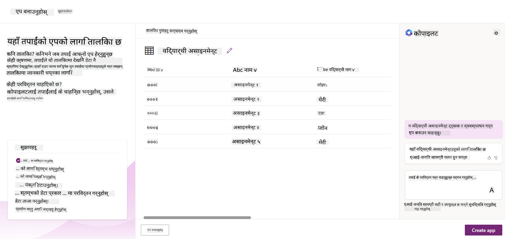
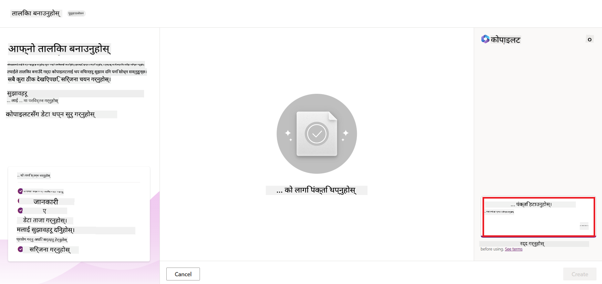
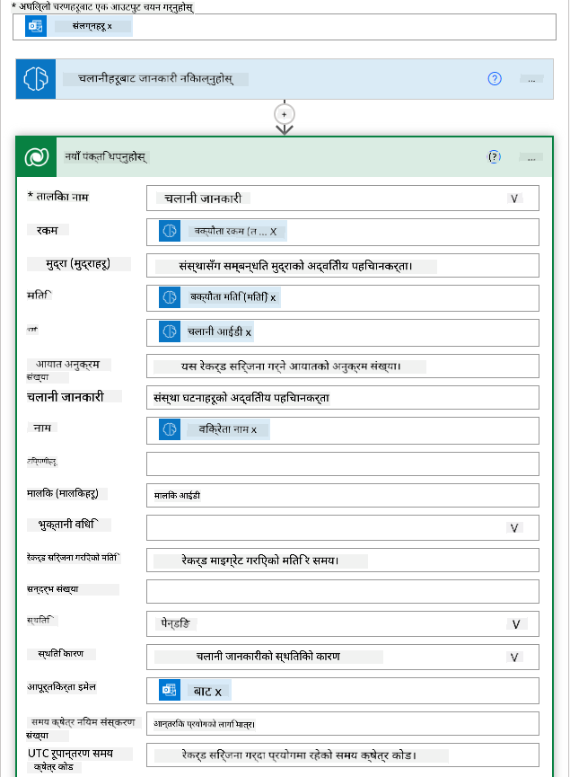

<!--
CO_OP_TRANSLATOR_METADATA:
{
  "original_hash": "f5ff3b6204a695a117d6f452403c95f7",
  "translation_date": "2025-07-09T13:52:07+00:00",
  "source_file": "10-building-low-code-ai-applications/README.md",
  "language_code": "ne"
}
-->
# कम कोड AI अनुप्रयोगहरू निर्माण गर्ने

> _(यो पाठको भिडियो हेर्न माथिको तस्बिरमा क्लिक गर्नुहोस्)_

## परिचय

अब हामीले छवि निर्माण गर्ने अनुप्रयोगहरू कसरी बनाउने भनेर सिकिसकेपछि, कम कोडको बारेमा कुरा गरौं। जनरेटिभ AI विभिन्न क्षेत्रहरूमा प्रयोग गर्न सकिन्छ जसमा कम कोड पनि पर्छ, तर कम कोड के हो र हामी यसमा AI कसरी थप्न सक्छौं?

परम्परागत विकासकर्ता र गैर-विकासकर्ताहरूका लागि कम कोड विकास प्लेटफर्महरूको प्रयोगले अनुप्रयोग र समाधानहरू बनाउनु सजिलो भएको छ। कम कोड विकास प्लेटफर्महरूले तपाईंलाई थोरै वा कुनै कोड बिना नै अनुप्रयोग र समाधानहरू बनाउन सक्षम बनाउँछन्। यो दृश्य विकास वातावरण प्रदान गरेर सम्भव हुन्छ जसले तपाईंलाई कम्पोनेन्टहरू ड्र्याग र ड्रप गरेर अनुप्रयोग र समाधानहरू बनाउन अनुमति दिन्छ। यसले तपाईंलाई छिटो र कम स्रोतसाधनमा अनुप्रयोग र समाधानहरू बनाउन सक्षम बनाउँछ। यस पाठमा, हामी कम कोड कसरी प्रयोग गर्ने र Power Platform प्रयोग गरेर AI सँग कम कोड विकासलाई कसरी सुधार गर्ने भन्ने विषयमा गहिराइमा जान्छौं।

Power Platform ले संस्थाहरूलाई आफ्ना टोलीहरूलाई सहज कम-कोड वा नो-कोड वातावरण मार्फत आफ्नै समाधानहरू बनाउन सशक्त बनाउने अवसर प्रदान गर्दछ। यस वातावरणले समाधान निर्माण प्रक्रियालाई सरल बनाउँछ। Power Platform सँग समाधानहरू महिना वा वर्षको सट्टा दिन वा हप्तामा निर्माण गर्न सकिन्छ। Power Platform पाँच मुख्य उत्पादनहरू मिलेर बनेको छ: Power Apps, Power Automate, Power BI, Power Pages र Copilot Studio।

यस पाठले समेट्छ:

- Power Platform मा जनरेटिभ AI को परिचय  
- Copilot को परिचय र यसको प्रयोग कसरी गर्ने  
- Power Platform मा अनुप्रयोग र फ्लोहरू बनाउन जनरेटिभ AI को प्रयोग  
- AI Builder सँग Power Platform मा AI मोडेलहरूको बुझाइ  

## सिकाइका लक्ष्यहरू

यस पाठको अन्त्यसम्म, तपाईं सक्षम हुनुहुनेछ:

- Power Platform मा Copilot कसरी काम गर्छ बुझ्न।

- हाम्रो शिक्षा स्टार्टअपका लागि विद्यार्थी असाइनमेन्ट ट्र्याकर एप बनाउने।

- AI प्रयोग गरेर इनभ्वाइसबाट जानकारी निकाल्ने इनभ्वाइस प्रोसेसिङ फ्लो बनाउने।

- GPT AI मोडेल प्रयोग गर्दा उत्तम अभ्यासहरू लागू गर्ने।

यस पाठमा तपाईंले प्रयोग गर्ने उपकरण र प्रविधिहरू:

- **Power Apps**, विद्यार्थी असाइनमेन्ट ट्र्याकर एपका लागि, जुन कम-कोड विकास वातावरण प्रदान गर्छ जसले डेटा ट्र्याक, व्यवस्थापन र अन्तरक्रिया गर्न एपहरू बनाउन मद्दत गर्छ।

- **Dataverse**, विद्यार्थी असाइनमेन्ट ट्र्याकर एपको डेटा भण्डारणका लागि, जहाँ Dataverse ले एपको डेटा भण्डारण गर्न कम-कोड डेटा प्लेटफर्म प्रदान गर्छ।

- **Power Automate**, इनभ्वाइस प्रोसेसिङ फ्लोका लागि, जहाँ तपाईंले इनभ्वाइस प्रोसेसिङ प्रक्रिया स्वचालित बनाउन वर्कफ्लोहरू बनाउन कम-कोड विकास वातावरण पाउनुहुनेछ।

- **AI Builder**, इनभ्वाइस प्रोसेसिङ AI मोडेलका लागि, जहाँ तपाईंले हाम्रो स्टार्टअपका लागि इनभ्वाइसहरू प्रोसेस गर्न पूर्वनिर्मित AI मोडेलहरू प्रयोग गर्नुहुनेछ।

## Power Platform मा जनरेटिभ AI

कम-कोड विकास र अनुप्रयोगलाई जनरेटिभ AI द्वारा सुधार गर्नु Power Platform को मुख्य केन्द्रबिन्दु हो। लक्ष्य भनेको सबैलाई AI-संचालित एप, साइट, ड्यासबोर्डहरू बनाउन र AI सँग प्रक्रिया स्वचालित गर्न सक्षम बनाउनु हो, _कुनै डेटा विज्ञान विशेषज्ञता आवश्यक नपर्ने गरी_। यो लक्ष्य Power Platform मा Copilot र AI Builder को रूपमा जनरेटिभ AI लाई कम-कोड विकास अनुभवमा एकीकृत गरेर प्राप्त गरिन्छ।

### यो कसरी काम गर्छ?

Copilot एक AI सहायक हो जसले तपाईंलाई प्राकृतिक भाषामा संवादात्मक चरणहरूमा आफ्नो आवश्यकताहरू वर्णन गरेर Power Platform समाधानहरू बनाउन सक्षम बनाउँछ। उदाहरणका लागि, तपाईं आफ्नो AI सहायकलाई भन्न सक्नुहुन्छ कि तपाईंको एपले कुन फील्डहरू प्रयोग गर्नेछ र यसले एप र आधारभूत डेटा मोडेल दुवै सिर्जना गर्नेछ, वा तपाईं Power Automate मा फ्लो कसरी सेटअप गर्ने भनेर निर्दिष्ट गर्न सक्नुहुन्छ।

तपाईंले Copilot संचालित सुविधाहरूलाई आफ्नो एप स्क्रिनहरूमा प्रयोग गरेर प्रयोगकर्ताहरूलाई संवादात्मक अन्तरक्रियाबाट जानकारी पत्ता लगाउन सक्षम बनाउन सक्नुहुन्छ।

AI Builder Power Platform मा उपलब्ध कम-कोड AI क्षमता हो जसले तपाईंलाई AI मोडेलहरू प्रयोग गरेर प्रक्रिया स्वचालित गर्न र परिणामहरू पूर्वानुमान गर्न मद्दत गर्छ। AI Builder सँग तपाईंले Dataverse वा विभिन्न क्लाउड डेटा स्रोतहरू जस्तै SharePoint, OneDrive वा Azure मा जडान भएका एप र फ्लोहरूमा AI ल्याउन सक्नुहुन्छ।

Copilot सबै Power Platform उत्पादनहरूमा उपलब्ध छ: Power Apps, Power Automate, Power BI, Power Pages र Power Virtual Agents। AI Builder Power Apps र Power Automate मा उपलब्ध छ। यस पाठमा, हामी Power Apps र Power Automate मा Copilot र AI Builder कसरी प्रयोग गर्ने भन्नेमा केन्द्रित हुनेछौं र हाम्रो शिक्षा स्टार्टअपका लागि समाधान बनाउनेछौं।

### Power Apps मा Copilot

Power Platform को भागको रूपमा, Power Apps ले डेटा ट्र्याक, व्यवस्थापन र अन्तरक्रिया गर्न एपहरू बनाउन कम-कोड विकास वातावरण प्रदान गर्छ। यो एप विकास सेवाहरूको एक समूह हो जसमा स्केलेबल डेटा प्लेटफर्म र क्लाउड सेवा तथा अन-प्रिमाइसिस डेटा जडान गर्ने क्षमता छ। Power Apps ले तपाईंलाई ब्राउजर, ट्याब्लेट र फोनमा चल्ने एपहरू बनाउन अनुमति दिन्छ र सहकर्मीहरूसँग साझा गर्न सकिन्छ। Power Apps ले सरल इन्टरफेसमार्फत प्रयोगकर्ताहरूलाई एप विकासमा सहज बनाउँछ, जसले प्रत्येक व्यवसाय प्रयोगकर्ता वा प्राविधिक विकासकर्ताले अनुकूलित एपहरू बनाउन सक्छ। जनरेटिभ AI मार्फत Copilot ले एप विकास अनुभवलाई अझ राम्रो बनाउँछ।

Power Apps मा Copilot AI सहायक सुविधाले तपाईंलाई कुन प्रकारको एप चाहिन्छ र तपाईंको एपले कुन जानकारी ट्र्याक, सङ्कलन वा देखाउनेछ भनेर वर्णन गर्न सक्षम बनाउँछ। त्यसपछि Copilot ले तपाईंको वर्णनको आधारमा प्रतिक्रियाशील Canvas एप सिर्जना गर्छ। तपाईं त्यसपछि आफ्नो आवश्यकताअनुसार एपलाई अनुकूलित गर्न सक्नुहुन्छ। AI Copilot ले Dataverse तालिका पनि सिर्जना र सुझाव दिन्छ जसमा तपाईंले ट्र्याक गर्न चाहेको डेटा भण्डारण गर्न आवश्यक फील्डहरू र केही नमूना डेटा हुन्छ। हामी यस पाठमा पछि Dataverse के हो र Power Apps मा यसलाई कसरी प्रयोग गर्ने भन्ने कुरा हेर्नेछौं। तपाईं AI Copilot सहायक सुविधाको माध्यमबाट संवादात्मक चरणहरूमा तालिकालाई अनुकूलित गर्न सक्नुहुन्छ। यो सुविधा Power Apps को होम स्क्रिनबाट सजिलै उपलब्ध छ।

### Power Automate मा Copilot

Power Platform को भागको रूपमा, Power Automate ले प्रयोगकर्ताहरूलाई अनुप्रयोग र सेवाहरू बीच स्वचालित वर्कफ्लोहरू सिर्जना गर्न अनुमति दिन्छ। यसले सञ्चार, डेटा सङ्कलन र निर्णय स्वीकृतिहरू जस्ता दोहोरिने व्यवसाय प्रक्रियाहरू स्वचालित गर्न मद्दत गर्छ। यसको सरल इन्टरफेसले सबै प्राविधिक दक्षताका प्रयोगकर्ताहरू (शुरुआतीदेखि अनुभवी विकासकर्तासम्म) लाई कामका कार्यहरू स्वचालित गर्न सक्षम बनाउँछ। जनरेटिभ AI मार्फत Copilot ले वर्कफ्लो विकास अनुभवलाई पनि सुधार गर्छ।

Power Automate मा Copilot AI सहायक सुविधाले तपाईंलाई कुन प्रकारको फ्लो चाहिन्छ र तपाईंको फ्लोले के कार्यहरू गर्नुपर्छ भनेर वर्णन गर्न सक्षम बनाउँछ। त्यसपछि Copilot ले तपाईंको वर्णनको आधारमा फ्लो सिर्जना गर्छ। तपाईं त्यसपछि आफ्नो आवश्यकताअनुसार फ्लोलाई अनुकूलित गर्न सक्नुहुन्छ। AI Copilot ले तपाईंले स्वचालित गर्न चाहेको कार्य पूरा गर्न आवश्यक कार्यहरू पनि सुझाव दिन्छ। हामी यस पाठमा पछि फ्लोहरू के हुन् र Power Automate मा कसरी प्रयोग गर्ने भन्ने कुरा हेर्नेछौं। तपाईं AI Copilot सहायक सुविधाको माध्यमबाट संवादात्मक चरणहरूमा कार्यहरू अनुकूलित गर्न सक्नुहुन्छ। यो सुविधा Power Automate को होम स्क्रिनबाट सजिलै उपलब्ध छ।

## असाइनमेन्ट: हाम्रो स्टार्टअपका लागि विद्यार्थी असाइनमेन्ट र इनभ्वाइसहरू व्यवस्थापन गर्नुहोस्, Copilot प्रयोग गरेर

हाम्रो स्टार्टअपले विद्यार्थीहरूलाई अनलाइन कोर्सहरू प्रदान गर्दछ। स्टार्टअप छिटो बढिरहेको छ र यसको कोर्सहरूको माग पूरा गर्न संघर्ष गरिरहेको छ। स्टार्टअपले तपाईंलाई Power Platform विकासकर्ताको रूपमा नियुक्त गरेको छ ताकि उनीहरूलाई विद्यार्थी असाइनमेन्ट र इनभ्वाइसहरू व्यवस्थापन गर्न मद्दत गर्ने कम कोड समाधान बनाउन सकियोस्। उनीहरूको समाधानले विद्यार्थी असाइनमेन्टहरू ट्र्याक र व्यवस्थापन गर्न एपमार्फत मद्दत गर्नुपर्छ र इनभ्वाइस प्रोसेसिङ प्रक्रिया वर्कफ्लोमार्फत स्वचालित गर्न सक्नुपर्छ। तपाईंलाई जनरेटिभ AI प्रयोग गरेर समाधान विकास गर्न भनिएको छ।

Copilot प्रयोग गर्न सुरु गर्दा, तपाईं [Power Platform Copilot Prompt Library](https://github.com/pnp/powerplatform-prompts?WT.mc_id=academic-109639-somelezediko) प्रयोग गर्न सक्नुहुन्छ। यस पुस्तकालयमा Copilot सँग एप र फ्लोहरू बनाउन प्रयोग गर्न सकिने प्रॉम्प्टहरूको सूची छ। तपाईंले आफ्नो आवश्यकताहरू Copilot लाई कसरी वर्णन गर्ने भन्ने विचार लिन पनि यस पुस्तकालयका प्रॉम्प्टहरू प्रयोग गर्न सक्नुहुन्छ।

### हाम्रो स्टार्टअपका लागि विद्यार्थी असाइनमेन्ट ट्र्याकर एप बनाउने

हाम्रो स्टार्टअपका शिक्षकहरू विद्यार्थी असाइनमेन्टहरू ट्र्याक गर्न संघर्ष गरिरहेका छन्। उनीहरूले असाइनमेन्टहरू ट्र्याक गर्न स्प्रेडशीट प्रयोग गरिरहेका थिए तर विद्यार्थीहरूको संख्या बढेसँगै यो व्यवस्थापन गर्न गाह्रो भएको छ। उनीहरूले तपाईंलाई यस्तो एप बनाउन भनेका छन् जसले विद्यार्थी असाइनमेन्टहरू ट्र्याक र व्यवस्थापन गर्न मद्दत गर्छ। एपले नयाँ असाइनमेन्टहरू थप्न, असाइनमेन्टहरू हेर्न, अपडेट गर्न र मेटाउन सक्षम हुनुपर्छ। एपले शिक्षक र विद्यार्थीहरूलाई ग्रेड गरिएका र नग्रेड गरिएका असाइनमेन्टहरू हेर्न पनि सक्षम बनाउनु पर्छ।

तपाईंले Power Apps मा Copilot प्रयोग गरेर तलका चरणहरू पालना गर्दै एप बनाउनु हुनेछ:

1. [Power Apps](https://make.powerapps.com?WT.mc_id=academic-105485-koreyst) को होम स्क्रिनमा जानुहोस्।

1. होम स्क्रिनमा रहेको टेक्स्ट क्षेत्र प्रयोग गरेर तपाईंले बनाउने एपको वर्णन गर्नुहोस्। उदाहरणका लागि, **_म विद्यार्थी असाइनमेन्टहरू ट्र्याक र व्यवस्थापन गर्न एप बनाउन चाहन्छु_**। AI Copilot लाई प्रॉम्प्ट पठाउन **Send** बटनमा क्लिक गर्नुहोस्।

1. AI Copilot ले तपाईंले ट्र्याक गर्न चाहेको डेटा भण्डारण गर्न आवश्यक फील्डहरू सहित Dataverse तालिका र केही नमूना डेटा सुझाव दिनेछ। तपाईं AI Copilot सहायक सुविधाको माध्यमबाट संवादात्मक चरणहरूमा तालिकालाई अनुकूलित गर्न सक्नुहुन्छ।

   > **महत्त्वपूर्ण**: Dataverse Power Platform को आधारभूत डेटा प्लेटफर्म हो। यो एपको डेटा भण्डारण गर्न कम-कोड डेटा प्लेटफर्म हो। यो पूर्ण रूपमा व्यवस्थापन गरिएको सेवा हो जसले Microsoft Cloud मा डेटा सुरक्षित रूपमा भण्डारण गर्छ र तपाईंको Power Platform वातावरण भित्र प्रावधान गरिएको हुन्छ। यसमा डेटा वर्गीकरण, डेटा लाइनिएज, सूक्ष्म पहुँच नियन्त्रण जस्ता निर्मित डेटा शासन क्षमताहरू छन्। तपाईं Dataverse बारे थप [यहाँ](https://docs.microsoft.com/powerapps/maker/data-platform/data-platform-intro?WT.mc_id=academic-109639-somelezediko) जान्न सक्नुहुन्छ।

   

1. शिक्षकहरूले असाइनमेन्ट बुझाएका विद्यार्थीहरूलाई इमेल पठाउन चाहन्छन् ताकि उनीहरूलाई असाइनमेन्ट प्रगतिको जानकारी दिन सकियोस्। तपाईं Copilot प्रयोग गरेर तालिकामा विद्यार्थी इमेल भण्डारण गर्न नयाँ फील्ड थप्न सक्नुहुन्छ। उदाहरणका लागि, तपाईं निम्न प्रॉम्प्ट प्रयोग गर्न सक्नुहुन्छ: **_म विद्यार्थी इमेल भण्डारण गर्न एउटा स्तम्भ थप्न चाहन्छु_**। AI Copilot लाई प्रॉम्प्ट पठाउन **Send** बटनमा क्लिक गर्नुहोस्।

1. AI Copilot ले नयाँ फील्ड सिर्जना गर्नेछ र तपाईं त्यसलाई आफ्नो आवश्यकताअनुसार अनुकूलित गर्न सक्नुहुन्छ।

1. तालिका तयार भएपछि, एप सिर्जना गर्न **Create app** बटनमा क्लिक गर्नुहोस्।

1. AI Copilot ले तपाईंको वर्णनको आधारमा प्रतिक्रियाशील Canvas एप सिर्जना गर्नेछ। तपाईं त्यसलाई आफ्नो आवश्यकताअनुसार अनुकूलित गर्न सक्नुहुन्छ।

1. शिक्षकहरूले विद्यार्थीहरूलाई इमेल पठाउन नयाँ स्क्रिन थप्न Copilot प्रयोग गर्न सक्नुहुन्छ। उदाहरणका लागि, तपाईं निम्न प्रॉम्प्ट प्रयोग गर्न सक्नुहुन्छ: **_म विद्यार्थीहरूलाई इमेल पठाउन एउटा स्क्रिन थप्न चाहन्छु_**। AI Copilot लाई प्रॉम्प्ट पठाउन **Send** बटनमा क्लिक गर्नुहोस्।

1. AI Copilot ले नयाँ स्क्रिन सिर्जना गर्नेछ र तपाईं त्यसलाई आफ्नो आवश्यकताअनुसार अनुकूलित गर्न सक्नुहुन्छ।

1. एप तयार भएपछि, **Save** बटनमा क्लिक गरेर एप सुरक्षित गर्नुहोस्।

1. शिक्षकहरूसँग एप साझा गर्न, **Share** बटनमा क्लिक गर्नुहोस् र फेरि **Share** मा क्लिक गर्नुहोस्। त्यसपछि शिक्षकहरूको इमेल ठेगाना प्रविष्ट गरेर एप साझा गर्न सकिन्छ।

> **तपाईंको गृहकार्य**: तपाईंले बनाएको एप राम्रो सुरुवात हो तर अझ सुधार गर्न सकिन्छ। इमेल सुविधाले शिक्षकहरूलाई विद्यार्थीहरूलाई म्यानुअली इमेल टाइप गरेर मात्र पठाउन दिन्छ। के तपाईं Copilot प्रयोग गरेर यस्तो स्वचालन बनाउन सक्नुहुन्छ जसले शिक्षकहरूलाई विद्यार्थीहरूले असाइनमेन्ट बुझाएपछि स्वचालित रूपमा इमेल पठाउन सक्षम बनाओस्? तपाईंको संकेत हो कि सही प्रॉम्प्ट प्रयोग गरेर तपाईं Power Automate मा Copilot प्रयोग गरी यो बनाउन सक्नुहुन्छ।

### हाम्रो स्टार्टअपका लागि इनभ्वाइस जानकारी तालिका बनाउने

हाम्रो स्टार्टअपको वित्त टोली इनभ्वाइसहरू ट्र्याक गर्न संघर्ष गरिरहेको छ। उनीहरूले इनभ्वाइसहरू ट्र्याक गर्न स्प्रेडशीट प्रयोग गरिरहेका थिए तर इनभ्वाइसहरूको संख्या बढेसँगै यो व्यवस्थापन गर्न गाह्रो भएको छ। उनीहरूले तपाईंलाई यस्तो तालिका बनाउन भनेका छन् जसले प्राप्त इनभ्वाइसहरूको जानकारी भण्डारण, ट्र्याक र व्यवस्थापन गर्न मद्दत गर्छ। तालिका प्रयोग गरेर सबै इनभ्वाइस जानकारी निकाल्ने र तालिकामा भण्डारण गर्ने स्वचालन निर्माण गर्नुपर्छ। तालिकाले वित्त टोलीलाई तिरेका र नतिरेका इनभ्वाइसहरू हेर्न पनि सक्षम बनाउनु पर्छ।

Power Platform सँग Dataverse नामक आधारभूत डेटा प्लेटफर्म छ जसले तपाईंलाई तपाईंका एप र समाधानहरूको डेटा भण्डारण गर्न सक्षम बनाउँछ। Dataverse ले एपको डेटा भण्डारण गर्न कम-कोड डेटा प्लेटफर्म प्रदान गर्छ। यो पूर्ण रूपमा व्यवस्थापन गरिएको सेवा हो जसले Microsoft Cloud मा डेटा सुरक्षित रूपमा भण्डारण गर्छ र तपाईंको Power Platform वातावरण भित्र प्रावधान गरिएको हुन्छ। यसमा डेटा वर्गीकरण, डेटा लाइनिएज, सूक्ष्म पहुँच नियन्त्रण जस्ता निर्मित डेटा शासन क्षमताहरू छन्। तपाईं Dataverse बारे थप [यहाँ](https://docs.microsoft.com/powerapps/maker/data-platform/data-platform-intro?WT.mc_id=academic-109639-somelezediko) जान्न सक्नुहुन्छ।

हाम्रो स्टार्टअपका लागि Dataverse किन प्रयोग गर्ने? Dataverse भित्रका मानक र अनुकूलित तालिकाहरूले तपाईंको डेटा सुरक्षित र क्लाउड-आधारित भण्डारण विकल्प प्रदान गर्छन्। तालिकाहरूले तपाईंलाई विभिन्न प्रकारका डेटा भण्डारण गर्न अनुमति दिन्छन्, जस्तै तपाईंले एउटै Excel वर्कबुकमा धेरै वर्कशीटहरू प्रयोग गर्नुहुन्छ। तपाईं तालिकाहरूलाई तपाईंको संगठन वा व्यवसाय आवश्यकताहरू अनुसार डेटा भण्डारण गर्न प्रयोग गर्न सक्नुहुन्छ। Dataverse प्रयोग गर्दा हाम्रो स्टार्टअपले पाउने केही फाइदाहरूमा समावेश छन् तर सीमित छैनन्:
- **सजिलो व्यवस्थापन**: मेटाडाटा र डाटा दुवै क्लाउडमा सुरक्षित गरिन्छ, त्यसैले तपाईंलाई कसरी तिनीहरू भण्डारण वा व्यवस्थापन गरिन्छ भन्ने कुरामा चिन्ता लिनु पर्दैन। तपाईं आफ्नो एप्स र समाधानहरू निर्माणमा ध्यान केन्द्रित गर्न सक्नुहुन्छ।

- **सुरक्षित**: Dataverse ले तपाईंको डाटाका लागि सुरक्षित र क्लाउड-आधारित भण्डारण विकल्प प्रदान गर्दछ। तपाईंले आफ्नो तालिकामा डाटामा कसले पहुँच पाउने र कसरी पहुँच पाउने भन्ने कुरा भूमिका आधारित सुरक्षा प्रयोग गरेर नियन्त्रण गर्न सक्नुहुन्छ।

- **धनी मेटाडाटा**: डाटा प्रकारहरू र सम्बन्धहरू Power Apps भित्रै सिधै प्रयोग गरिन्छ।

- **तर्क र प्रमाणीकरण**: तपाईं व्यवसाय नियमहरू, गणना गरिएका फिल्डहरू, र प्रमाणीकरण नियमहरू प्रयोग गरेर व्यवसायिक तर्क लागू गर्न र डाटाको शुद्धता कायम राख्न सक्नुहुन्छ।

अब तपाईंलाई थाहा भयो कि Dataverse के हो र किन प्रयोग गर्ने, आउनुहोस् हेरौं कसरी Copilot प्रयोग गरेर Dataverse मा तालिका सिर्जना गर्ने जसले हाम्रो वित्त टोलीका आवश्यकताहरू पूरा गर्छ।

> **Note** : तपाईंले यो तालिका अर्को खण्डमा प्रयोग गर्नुहुनेछ जसले सबै इनभ्वाइस जानकारी निकालेर तालिकामा भण्डारण गर्ने स्वचालन निर्माण गर्न मद्दत गर्नेछ।

Copilot प्रयोग गरेर Dataverse मा तालिका सिर्जना गर्न तलका चरणहरू पालना गर्नुहोस्:

1. [Power Apps](https://make.powerapps.com?WT.mc_id=academic-105485-koreyst) होम स्क्रिनमा जानुहोस्।

2. बाँया नेभिगेसन बारमा, **Tables** चयन गर्नुहोस् र त्यसपछि **Describe the new Table** मा क्लिक गर्नुहोस्।

3. **Describe the new Table** स्क्रिनमा, तपाईं सिर्जना गर्न चाहनुभएको तालिकाको वर्णन गर्न टेक्स्ट क्षेत्र प्रयोग गर्नुहोस्। उदाहरणका लागि, **_म इनभ्वाइस जानकारी भण्डारण गर्न तालिका सिर्जना गर्न चाहन्छु_**। AI Copilot लाई प्रॉम्प्ट पठाउन **Send** बटनमा क्लिक गर्नुहोस्।

4. AI Copilot ले तपाईंले ट्र्याक गर्न चाहनुभएको डाटा भण्डारण गर्न आवश्यक फिल्डहरू सहित Dataverse तालिका र केही नमूना डाटा सुझाव दिनेछ। त्यसपछि तपाईं AI Copilot सहायक सुविधाको माध्यमबाट संवादात्मक चरणहरू प्रयोग गरी तालिका आफ्नो आवश्यकताअनुसार अनुकूलित गर्न सक्नुहुन्छ।

5. वित्त टोलीले आपूर्तिकर्तालाई इनभ्वाइसको वर्तमान स्थिति अपडेट गर्न इमेल पठाउन चाहन्छ। तपाईं Copilot प्रयोग गरेर तालिकामा आपूर्तिकर्ताको इमेल भण्डारण गर्न नयाँ फिल्ड थप्न सक्नुहुन्छ। उदाहरणका लागि, तपाईं निम्न प्रॉम्प्ट प्रयोग गर्न सक्नुहुन्छ: **_म आपूर्तिकर्ता इमेल भण्डारण गर्न स्तम्भ थप्न चाहन्छु_**। AI Copilot लाई प्रॉम्प्ट पठाउन **Send** बटनमा क्लिक गर्नुहोस्।

6. AI Copilot ले नयाँ फिल्ड सिर्जना गर्नेछ र तपाईं त्यसलाई आफ्नो आवश्यकताअनुसार अनुकूलित गर्न सक्नुहुन्छ।

7. तालिका तयार भएपछि, तालिका सिर्जना गर्न **Create** बटनमा क्लिक गर्नुहोस्।

## Power Platform मा AI मोडेलहरू AI Builder सँग

AI Builder Power Platform मा उपलब्ध एक कम-कोड AI क्षमता हो जसले तपाईंलाई AI मोडेलहरू प्रयोग गरेर प्रक्रिया स्वचालन गर्न र परिणामहरू पूर्वानुमान गर्न मद्दत गर्दछ। AI Builder सँग तपाईंले Dataverse वा विभिन्न क्लाउड डाटा स्रोतहरू जस्तै SharePoint, OneDrive वा Azure मा रहेको डाटासँग जडान भएका एप्स र फ्लोहरूमा AI ल्याउन सक्नुहुन्छ।

## पूर्वनिर्मित AI मोडेलहरू र कस्टम AI मोडेलहरू

AI Builder ले दुई प्रकारका AI मोडेलहरू प्रदान गर्दछ: पूर्वनिर्मित AI मोडेलहरू र कस्टम AI मोडेलहरू। पूर्वनिर्मित AI मोडेलहरू Microsoft द्वारा प्रशिक्षित र Power Platform मा उपलब्ध तयार-प्रयोग AI मोडेलहरू हुन्। यीले तपाईंलाई डाटा सङ्कलन, मोडेल निर्माण, प्रशिक्षण र प्रकाशन नगरीकनै तपाईंका एप्स र फ्लोहरूमा बुद्धिमत्ता थप्न मद्दत गर्छन्। तपाईं यी मोडेलहरू प्रयोग गरेर प्रक्रिया स्वचालन र परिणाम पूर्वानुमान गर्न सक्नुहुन्छ।

Power Platform मा उपलब्ध केही पूर्वनिर्मित AI मोडेलहरू:

- **Key Phrase Extraction**: यो मोडेलले पाठबाट मुख्य वाक्यांशहरू निकाल्छ।
- **Language Detection**: यो मोडेलले पाठको भाषा पत्ता लगाउँछ।
- **Sentiment Analysis**: यो मोडेलले पाठमा सकारात्मक, नकारात्मक, तटस्थ वा मिश्रित भावना पत्ता लगाउँछ।
- **Business Card Reader**: यो मोडेलले व्यवसाय कार्डबाट जानकारी निकाल्छ।
- **Text Recognition**: यो मोडेलले छविबाट पाठ निकाल्छ।
- **Object Detection**: यो मोडेलले छविबाट वस्तुहरू पत्ता लगाउँछ र निकाल्छ।
- **Document processing**: यो मोडेलले फारमहरूबाट जानकारी निकाल्छ।
- **Invoice Processing**: यो मोडेलले इनभ्वाइसबाट जानकारी निकाल्छ।

कस्टम AI मोडेलहरूसँग तपाईं आफ्नो मोडेल AI Builder मा ल्याउन सक्नुहुन्छ जसले AI Builder कस्टम मोडेल जस्तै काम गर्छ, र तपाईंले आफ्नो डाटाबाट मोडेललाई प्रशिक्षण दिन सक्नुहुन्छ। यी मोडेलहरू Power Apps र Power Automate दुवैमा प्रक्रिया स्वचालन र परिणाम पूर्वानुमान गर्न प्रयोग गर्न सकिन्छ। आफ्नै मोडेल प्रयोग गर्दा केही सीमितताहरू लागु हुन्छन्। यी सीमितताहरूको बारेमा थप पढ्न [limitations](https://learn.microsoft.com/ai-builder/byo-model#limitations?WT.mc_id=academic-105485-koreyst) हेर्नुहोस्।

## असाइनमेन्ट #2 - हाम्रो स्टार्टअपका लागि इनभ्वाइस प्रोसेसिंग फ्लो बनाउनुहोस्

वित्त टोली इनभ्वाइसहरू प्रोसेस गर्न संघर्ष गरिरहेको छ। उनीहरूले इनभ्वाइसहरू ट्र्याक गर्न स्प्रेडशीट प्रयोग गरिरहेका थिए तर इनभ्वाइसहरूको संख्या बढेसँगै यो व्यवस्थापन गर्न गाह्रो भएको छ। उनीहरूले तपाईंलाई AI प्रयोग गरेर इनभ्वाइसहरू प्रोसेस गर्न मद्दत गर्ने वर्कफ्लो बनाउन भनेका छन्। वर्कफ्लोले इनभ्वाइसबाट जानकारी निकालेर Dataverse तालिकामा भण्डारण गर्न सक्षम हुनुपर्छ। साथै, वर्कफ्लोले वित्त टोलीलाई निकालिएको जानकारीसहित इमेल पठाउन पनि सक्षम हुनुपर्छ।

अब तपाईंलाई थाहा भयो कि AI Builder के हो र किन प्रयोग गर्ने, आउनुहोस् हेरौं कसरी Invoice Processing AI Model प्रयोग गरेर वित्त टोलीलाई इनभ्वाइस प्रोसेस गर्न मद्दत गर्ने वर्कफ्लो बनाउने।

Invoice Processing AI Model प्रयोग गरेर वित्त टोलीलाई मद्दत गर्ने वर्कफ्लो बनाउन तलका चरणहरू पालना गर्नुहोस्:

1. [Power Automate](https://make.powerautomate.com?WT.mc_id=academic-105485-koreyst) होम स्क्रिनमा जानुहोस्।

2. होम स्क्रिनमा रहेको टेक्स्ट क्षेत्रमा तपाईं बनाउने वर्कफ्लोको वर्णन गर्नुहोस्। उदाहरणका लागि, **_जब मेरो मेलबक्समा इनभ्वाइस आउँछ तब प्रोसेस गर_**। AI Copilot लाई प्रॉम्प्ट पठाउन **Send** बटनमा क्लिक गर्नुहोस्।

   

3. AI Copilot ले तपाईंले स्वचालित गर्न चाहनुभएको कार्यका लागि आवश्यक क्रियाकलापहरू सुझाव दिनेछ। अर्को चरणहरू हेर्न **Next** बटनमा क्लिक गर्नुहोस्।

4. अर्को चरणमा, Power Automate ले फ्लोका लागि आवश्यक कनेक्शनहरू सेटअप गर्न अनुरोध गर्नेछ। सकिएपछि, फ्लो सिर्जना गर्न **Create flow** बटनमा क्लिक गर्नुहोस्।

5. AI Copilot ले फ्लो सिर्जना गर्नेछ र तपाईं त्यसलाई आफ्नो आवश्यकताअनुसार अनुकूलित गर्न सक्नुहुन्छ।

6. फ्लोको ट्रिगर अपडेट गरी **Folder** सेट गर्नुहोस् जहाँ इनभ्वाइसहरू भण्डारण हुनेछन्। उदाहरणका लागि, **Inbox** सेट गर्न सक्नुहुन्छ। **Show advanced options** मा क्लिक गरी **Only with Attachments** लाई **Yes** मा सेट गर्नुहोस्। यसले सुनिश्चित गर्छ कि फ्लो केवल त्यस्तो इमेलमा चल्छ जसमा अट्याचमेन्ट हुन्छ।

7. फ्लोबाट तलका क्रियाकलापहरू हटाउनुहोस्: **HTML to text**, **Compose**, **Compose 2**, **Compose 3**, र **Compose 4** किनभने तपाईंले तिनीहरू प्रयोग गर्नुहुने छैन।

8. फ्लोबाट **Condition** क्रियाकलाप पनि हटाउनुहोस् किनभने तपाईंले यसलाई प्रयोग गर्नुहुने छैन। यसले तलको स्क्रिनसट जस्तो देखिनुपर्छ:

   

9. **Add an action** बटनमा क्लिक गरी **Dataverse** खोज्नुहोस्। **Add a new row** क्रियाकलाप चयन गर्नुहोस्।

10. **Extract Information from invoices** क्रियाकलापमा, **Invoice File** लाई इमेलबाट आएको **Attachment Content** मा सेट गर्नुहोस्। यसले फ्लोलाई इनभ्वाइस अट्याचमेन्टबाट जानकारी निकाल्न सक्षम बनाउँछ।

11. पहिले सिर्जना गरेको **Table** चयन गर्नुहोस्। उदाहरणका लागि, **Invoice Information** तालिका चयन गर्न सक्नुहुन्छ। तलका फिल्डहरू भर्न अघिल्लो क्रियाकलापबाट डायनामिक कन्टेन्ट चयन गर्नुहोस्:

    - ID  
    - Amount  
    - Date  
    - Name  
    - Status - **Status** लाई **Pending** मा सेट गर्नुहोस्।  
    - Supplier Email - **When a new email arrives** ट्रिगरबाट **From** डायनामिक कन्टेन्ट प्रयोग गर्नुहोस्।

    

12. फ्लो तयार भएपछि, **Save** बटनमा क्लिक गरी फ्लो सुरक्षित गर्नुहोस्। त्यसपछि, ट्रिगरमा निर्दिष्ट गरेको फोल्डरमा इनभ्वाइस सहितको इमेल पठाएर फ्लो परीक्षण गर्न सक्नुहुन्छ।

> **तपाईंको गृहकार्य**: तपाईंले अहिले बनाएको फ्लो राम्रो सुरुवात हो, अब सोच्नुहोस् कसरी यस्तो स्वचालन बनाउन सकिन्छ जसले हाम्रो वित्त टोलीलाई आपूर्तिकर्तालाई इनभ्वाइसको वर्तमान स्थिति अपडेट गर्न इमेल पठाउन सक्षम बनाओस्। तपाईंको संकेत: फ्लो इनभ्वाइसको स्थिति परिवर्तन हुँदा चल्नुपर्छ।

## Power Automate मा Text Generation AI Model प्रयोग गर्नुहोस्

AI Builder मा रहेको Create Text with GPT AI Model ले प्रॉम्प्टको आधारमा पाठ उत्पन्न गर्न सक्षम बनाउँछ र यो Microsoft Azure OpenAI Service द्वारा सञ्चालित छ। यस क्षमताले तपाईंलाई GPT (Generative Pre-Trained Transformer) प्रविधि आफ्नो एप्स र फ्लोहरूमा समावेश गर्न मद्दत गर्दछ जसले विभिन्न स्वचालित फ्लोहरू र सूचनात्मक अनुप्रयोगहरू निर्माण गर्न सकिन्छ।

GPT मोडेलहरू ठूलो मात्रामा डाटामा व्यापक प्रशिक्षण प्राप्त गर्छन् जसले प्रॉम्प्ट दिँदा मानव भाषासँग मिल्दोजुल्दो पाठ उत्पादन गर्न सक्षम बनाउँछ। वर्कफ्लो स्वचालनसँग एकीकृत हुँदा, GPT जस्ता AI मोडेलहरूलाई विभिन्न कार्यहरू सजिलो र स्वचालित बनाउन प्रयोग गर्न सकिन्छ।

उदाहरणका लागि, तपाईं फ्लोहरू निर्माण गर्न सक्नुहुन्छ जसले स्वचालित रूपमा विभिन्न प्रयोगका लागि पाठ उत्पन्न गर्छ, जस्तै: इमेलको ड्राफ्ट, उत्पादन विवरणहरू, र थप। तपाईं मोडेललाई च्याटबोट र ग्राहक सेवा एप्स जस्ता विभिन्न एप्सका लागि पनि प्रयोग गर्न सक्नुहुन्छ जसले ग्राहक सेवा एजेन्टहरूलाई ग्राहकको प्रश्नहरू प्रभावकारी र छिटो जवाफ दिन सक्षम बनाउँछ।

Power Automate मा यो AI मोडेल कसरी प्रयोग गर्ने जान्नको लागि [Add intelligence with AI Builder and GPT](https://learn.microsoft.com/training/modules/ai-builder-text-generation/?WT.mc_id=academic-109639-somelezediko) मोड्युल हेर्नुहोस्।

## राम्रो काम! आफ्नो सिकाइ जारी राख्नुहोस्

यो पाठ पूरा गरेपछि, हाम्रो [Generative AI Learning collection](https://aka.ms/genai-collection?WT.mc_id=academic-105485-koreyst) मा जानुहोस् र आफ्नो Generative AI ज्ञानलाई अझ उचाइमा पुर्‍याउनुहोस्!

पाठ ११ मा जानुहोस् जहाँ हामी [Generative AI लाई Function Calling सँग कसरी एकीकृत गर्ने](../11-integrating-with-function-calling/README.md?WT.mc_id=academic-105485-koreyst) हेरौं!

**अस्वीकरण**:  
यो दस्तावेज AI अनुवाद सेवा [Co-op Translator](https://github.com/Azure/co-op-translator) प्रयोग गरी अनुवाद गरिएको हो। हामी शुद्धताका लागि प्रयासरत छौं, तर कृपया ध्यान दिनुहोस् कि स्वचालित अनुवादमा त्रुटि वा अशुद्धता हुनसक्छ। मूल दस्तावेज यसको मूल भाषामा नै अधिकारिक स्रोत मानिनुपर्छ। महत्वपूर्ण जानकारीका लागि व्यावसायिक मानव अनुवाद सिफारिस गरिन्छ। यस अनुवादको प्रयोगबाट उत्पन्न कुनै पनि गलतफहमी वा गलत व्याख्याका लागि हामी जिम्मेवार छैनौं।