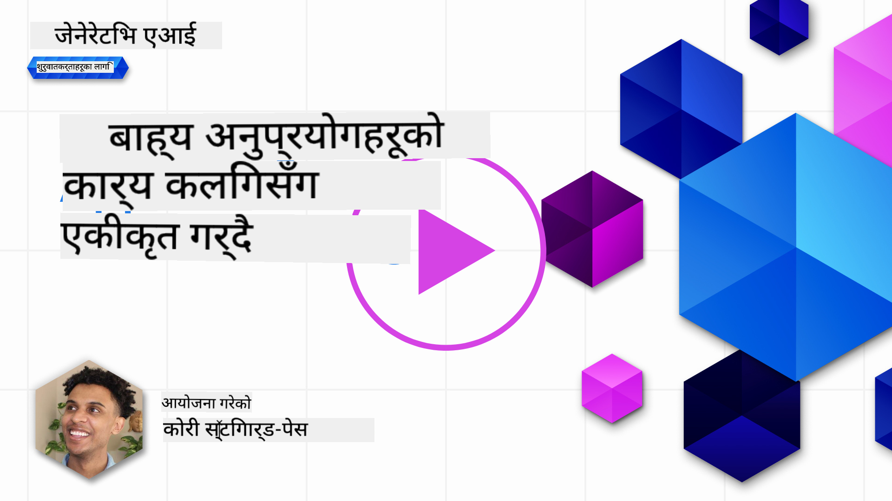
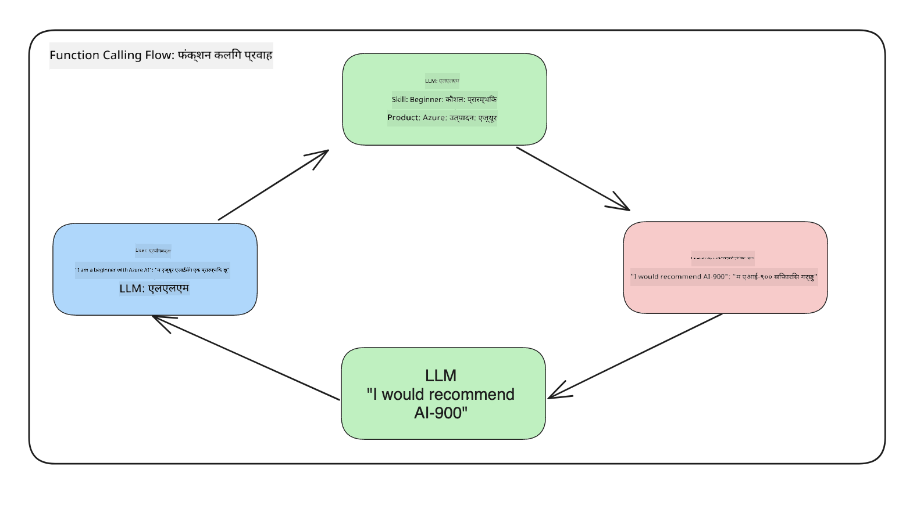
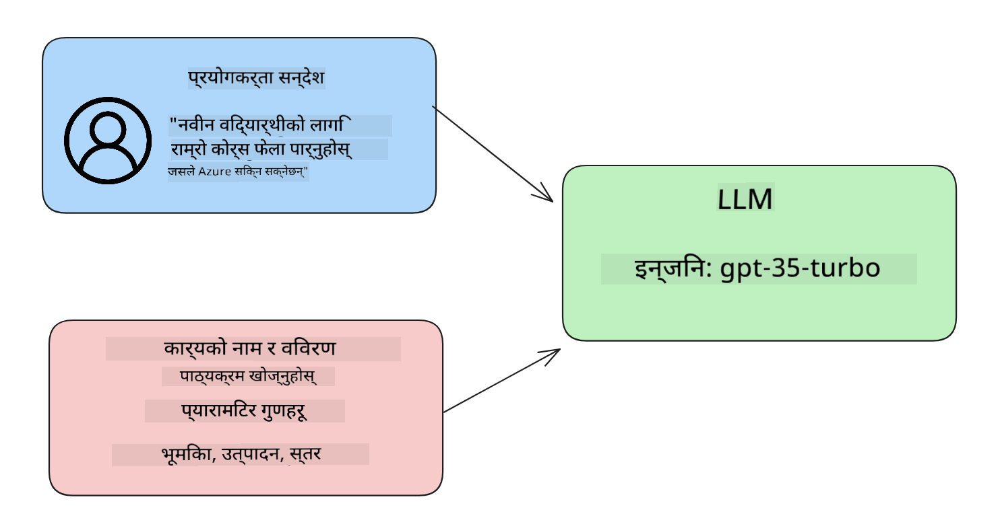

<!--
CO_OP_TRANSLATOR_METADATA:
{
  "original_hash": "77a48a201447be19aa7560706d6f93a0",
  "translation_date": "2025-05-19T21:25:34+00:00",
  "source_file": "11-integrating-with-function-calling/README.md",
  "language_code": "ne"
}
-->
# Function Calling सँग एकीकृत गर्नुहोस्

[](https://aka.ms/gen-ai-lesson11-gh?WT.mc_id=academic-105485-koreyst)

तपाईंले अघिल्लो पाठहरूमा धेरै कुरा सिक्नुभएको छ। तथापि, हामी अझ सुधार गर्न सक्छौं। केही कुराहरू जसलाई हामी सम्बोधन गर्न सक्छौं ती हुन् कसरी हामीलाई एक सुसंगत प्रतिक्रिया ढाँचा प्राप्त गर्न सकिन्छ जसले प्रतिक्रियालाई डाउनस्ट्रीममा काम गर्न सजिलो बनाउँछ। साथै, हामी हाम्रो अनुप्रयोगलाई अझ समृद्ध बनाउन अन्य स्रोतहरूबाट डेटा थप्न चाहन सक्छौं।

उपरोक्त समस्याहरू यो अध्यायले सम्बोधन गर्न खोजिरहेको छ।

## परिचय

यस पाठले समेट्नेछ:

- Function Calling के हो र यसको प्रयोग के हो भनेर व्याख्या गर्नुहोस्।
- Azure OpenAI प्रयोग गरेर Function Call सिर्जना गर्नुहोस्।
- Function Call लाई अनुप्रयोगमा कसरी एकीकृत गर्ने।

## सिकाइ लक्ष्यहरू

यस पाठको अन्त्यमा, तपाईं सक्षम हुनुहुनेछ:

- Function Calling को उद्देश्य व्याख्या गर्नुहोस्।
- Azure OpenAI सेवा प्रयोग गरेर Function Call सेटअप गर्नुहोस्।
- तपाईंको अनुप्रयोगको प्रयोग केसको लागि प्रभावकारी Function Call डिजाइन गर्नुहोस्।

## परिदृश्य: हाम्रो च्याटबटलाई Function हरूसँग सुधार गर्दै

यस पाठको लागि, हामी हाम्रो शिक्षा स्टार्टअपको लागि एउटा सुविधा निर्माण गर्न चाहन्छौं जसले प्रयोगकर्ताहरूलाई प्राविधिक पाठ्यक्रमहरू खोज्न च्याटबट प्रयोग गर्न अनुमति दिन्छ। हामी तिनीहरूको सीप स्तर, वर्तमान भूमिका र चासोको प्रविधिको आधारमा पाठ्यक्रमहरू सिफारिस गर्नेछौं।

यो परिदृश्य पूरा गर्न, हामी प्रयोग गर्नेछौं:

- प्रयोगकर्तालाई च्याट अनुभव सिर्जना गर्न `Azure OpenAI`।
- प्रयोगकर्ताको अनुरोधको आधारमा पाठ्यक्रमहरू खोज्न मद्दत गर्न `Microsoft Learn Catalog API`।
- प्रयोगकर्ताको क्वेरीलाई लिई API अनुरोध गर्न Function पठाउन `Function Calling`।

सुरु गर्न, हामी पहिले Function Calling किन प्रयोग गर्ने भन्ने कुरा हेरौं:

## Function Calling किन

Function Calling भन्दा पहिले, LLM बाट प्रतिक्रिया असंरचित र असंगत थियो। विकासकर्ताहरूलाई प्रतिक्रिया भिन्नताको ह्यान्डल गर्न जटिल प्रमाणीकरण कोड लेख्न आवश्यक थियो। प्रयोगकर्ताहरू "स्टकहोमको वर्तमान मौसम के हो?" जस्ता उत्तरहरू प्राप्त गर्न सक्दैनथे। किनभने मोडेलहरू डेटा प्रशिक्षित भएको समयमा सीमित थिए।

Azure OpenAI सेवाको Function Calling ले निम्न सीमाहरूलाई पार गर्नको लागि सुविधा हो:

- **सुसंगत प्रतिक्रिया ढाँचा**। यदि हामी प्रतिक्रिया ढाँचालाई राम्रोसँग नियन्त्रण गर्न सक्छौं भने हामी प्रतिक्रिया अन्य प्रणालीहरूमा सजिलैसँग एकीकृत गर्न सक्छौं।
- **बाह्य डेटा**। च्याट प्रसङ्गमा अनुप्रयोगको अन्य स्रोतहरूबाट डेटा प्रयोग गर्ने क्षमता।

## परिदृश्य मार्फत समस्या चित्रण गर्दै

> यदि तपाईं तलको परिदृश्य चलाउन चाहनुहुन्छ भने हामी तपाईंलाई [समावेश गरिएको नोटबुक](../../../11-integrating-with-function-calling/python/aoai-assignment.ipynb) प्रयोग गर्न सिफारिस गर्छौं। तपाईंले बस पढ्न पनि सक्नुहुन्छ किनभने हामी समस्या चित्रण गर्ने प्रयास गर्दैछौं जहाँ Function हरूले समस्या समाधान गर्न मद्दत गर्न सक्छ।

हामी एउटा उदाहरणलाई हेरौं जसले प्रतिक्रिया ढाँचा समस्यालाई चित्रण गर्दछ:

मानौं हामी विद्यार्थीहरूको डेटा डेटाबेस बनाउन चाहन्छौं ताकि हामी तिनीहरूलाई सही पाठ्यक्रम सिफारिस गर्न सकौं। तल हामीसँग विद्यार्थीहरूको दुई विवरणहरू छन् जसले समावेश गरेको डेटामा धेरै मिल्दोजुल्दो छ।

1. हाम्रो Azure OpenAI स्रोतमा जडान सिर्जना गर्नुहोस्:

   ```python
   import os
   import json
   from openai import AzureOpenAI
   from dotenv import load_dotenv
   load_dotenv()

   client = AzureOpenAI(
   api_key=os.environ['AZURE_OPENAI_API_KEY'],  # this is also the default, it can be omitted
   api_version = "2023-07-01-preview"
   )

   deployment=os.environ['AZURE_OPENAI_DEPLOYMENT']
   ```

   तल केही Python कोड छ जसले हाम्रो Azure OpenAI सँगको जडानलाई कन्फिगर गर्दछ जहाँ हामी `api_type`, `api_base`, `api_version` and `api_key`.

1. Creating two student descriptions using variables `student_1_description` and `student_2_description` सेट गर्छौं।

   ```python
   student_1_description="Emily Johnson is a sophomore majoring in computer science at Duke University. She has a 3.7 GPA. Emily is an active member of the university's Chess Club and Debate Team. She hopes to pursue a career in software engineering after graduating."

   student_2_description = "Michael Lee is a sophomore majoring in computer science at Stanford University. He has a 3.8 GPA. Michael is known for his programming skills and is an active member of the university's Robotics Club. He hopes to pursue a career in artificial intelligence after finishing his studies."
   ```

   हामी माथिका विद्यार्थी विवरणहरूलाई LLM मा पठाउन चाहन्छौं ताकि डेटा पार्स गर्न सकौं। यो डेटा पछि हाम्रो अनुप्रयोगमा प्रयोग गर्न सकिन्छ र API मा पठाउन वा डेटाबेसमा भण्डारण गर्न सकिन्छ।

1. हामी दुई समान प्रॉम्प्टहरू सिर्जना गरौं जसमा हामी LLM लाई कुन जानकारीमा चासो राख्छौं भनेर निर्देशन दिन्छौं:

   ```python
   prompt1 = f'''
   Please extract the following information from the given text and return it as a JSON object:

   name
   major
   school
   grades
   club

   This is the body of text to extract the information from:
   {student_1_description}
   '''

   prompt2 = f'''
   Please extract the following information from the given text and return it as a JSON object:

   name
   major
   school
   grades
   club

   This is the body of text to extract the information from:
   {student_2_description}
   '''
   ```

   माथिका प्रॉम्प्टहरूले LLM लाई जानकारी निकाल्न र JSON ढाँचामा प्रतिक्रिया फिर्ता गर्न निर्देशन दिन्छ।

1. प्रॉम्प्टहरू सेटअप गरेपछि र Azure OpenAI सँग जडान गरेपछि, हामी अब `openai.ChatCompletion`. We store the prompt in the `messages` variable and assign the role to `user` प्रयोग गरेर LLM मा प्रॉम्प्टहरू पठाउनेछौं। यसले च्याटबटमा लेखिएको प्रयोगकर्ताबाट आएको सन्देशको नक्कल गर्दछ।

   ```python
   # response from prompt one
   openai_response1 = client.chat.completions.create(
   model=deployment,
   messages = [{'role': 'user', 'content': prompt1}]
   )
   openai_response1.choices[0].message.content

   # response from prompt two
   openai_response2 = client.chat.completions.create(
   model=deployment,
   messages = [{'role': 'user', 'content': prompt2}]
   )
   openai_response2.choices[0].message.content
   ```

अब हामी दुवै अनुरोधहरू LLM मा पठाउन सक्छौं र प्राप्त प्रतिक्रियालाई `openai_response1['choices'][0]['message']['content']`.

1. Lastly, we can convert the response to JSON format by calling `json.loads` जस्तै फेला पारेर जाँच गर्न सक्छौं:

   ```python
   # Loading the response as a JSON object
   json_response1 = json.loads(openai_response1.choices[0].message.content)
   json_response1
   ```

   प्रतिक्रिया 1:

   ```json
   {
     "name": "Emily Johnson",
     "major": "computer science",
     "school": "Duke University",
     "grades": "3.7",
     "club": "Chess Club"
   }
   ```

   प्रतिक्रिया 2:

   ```json
   {
     "name": "Michael Lee",
     "major": "computer science",
     "school": "Stanford University",
     "grades": "3.8 GPA",
     "club": "Robotics Club"
   }
   ```

   यद्यपि प्रॉम्प्टहरू समान छन् र विवरणहरू मिल्दोजुल्दो छन्, हामी `Grades` property formatted differently, as we can sometimes get the format `3.7` or `3.7 GPA` for example.

   This result is because the LLM takes unstructured data in the form of the written prompt and returns also unstructured data. We need to have a structured format so that we know what to expect when storing or using this data

So how do we solve the formatting problem then? By using functional calling, we can make sure that we receive structured data back. When using function calling, the LLM does not actually call or run any functions. Instead, we create a structure for the LLM to follow for its responses. We then use those structured responses to know what function to run in our applications.



We can then take what is returned from the function and send this back to the LLM. The LLM will then respond using natural language to answer the user's query.

## Use Cases for using function calls

There are many different use cases where function calls can improve your app like:

- **Calling External Tools**. Chatbots are great at providing answers to questions from users. By using function calling, the chatbots can use messages from users to complete certain tasks. For example, a student can ask the chatbot to "Send an email to my instructor saying I need more assistance with this subject". This can make a function call to `send_email(to: string, body: string)`

- **Create API or Database Queries**. Users can find information using natural language that gets converted into a formatted query or API request. An example of this could be a teacher who requests "Who are the students that completed the last assignment" which could call a function named `get_completed(student_name: string, assignment: int, current_status: string)`

- **Creating Structured Data**. Users can take a block of text or CSV and use the LLM to extract important information from it. For example, a student can convert a Wikipedia article about peace agreements to create AI flashcards. This can be done by using a function called `get_important_facts(agreement_name: string, date_signed: string, parties_involved: list)`

## Creating Your First Function Call

The process of creating a function call includes 3 main steps:

1. **Calling** the Chat Completions API with a list of your functions and a user message.
2. **Reading** the model's response to perform an action i.e. execute a function or API Call.
3. **Making** another call to Chat Completions API with the response from your function to use that information to create a response to the user.



### Step 1 - creating messages

The first step is to create a user message. This can be dynamically assigned by taking the value of a text input or you can assign a value here. If this is your first time working with the Chat Completions API, we need to define the `role` and the `content` of the message.

The `role` can be either `system` (creating rules), `assistant` (the model) or `user` (the end-user). For function calling, we will assign this as `user` र एउटा उदाहरण प्रश्नको मूल्यहरू देख्छौं।

```python
messages= [ {"role": "user", "content": "Find me a good course for a beginner student to learn Azure."} ]
```

विभिन्न भूमिकाहरू असाइन गरेर, यो LLM लाई स्पष्ट बनाइन्छ कि यो प्रणालीले केहि भनिरहेको छ वा प्रयोगकर्ताले, जसले LLM लाई निर्माण गर्न सक्ने वार्तालाप इतिहास निर्माण गर्न मद्दत गर्दछ।

### चरण 2 - Function हरू सिर्जना गर्दै

अर्को, हामी एउटा Function र उक्त Function का प्यारामिटरहरू परिभाषित गर्नेछौं। हामी यहाँ एउटा मात्र Function प्रयोग गर्नेछौं जसलाई `search_courses` but you can create multiple functions.

> **Important** : Functions are included in the system message to the LLM and will be included in the amount of available tokens you have available.

Below, we create the functions as an array of items. Each item is a function and has properties `name`, `description` and `parameters` भनिन्छ:

```python
functions = [
   {
      "name":"search_courses",
      "description":"Retrieves courses from the search index based on the parameters provided",
      "parameters":{
         "type":"object",
         "properties":{
            "role":{
               "type":"string",
               "description":"The role of the learner (i.e. developer, data scientist, student, etc.)"
            },
            "product":{
               "type":"string",
               "description":"The product that the lesson is covering (i.e. Azure, Power BI, etc.)"
            },
            "level":{
               "type":"string",
               "description":"The level of experience the learner has prior to taking the course (i.e. beginner, intermediate, advanced)"
            }
         },
         "required":[
            "role"
         ]
      }
   }
]
```

हामी प्रत्येक Function उदाहरणलाई तल थप विवरणमा वर्णन गरौं:

- `name` - The name of the function that we want to have called.
- `description` - This is the description of how the function works. Here it's important to be specific and clear.
- `parameters` - A list of values and format that you want the model to produce in its response. The parameters array consists of items where the items have the following properties:
  1.  `type` - The data type of the properties will be stored in.
  1.  `properties` - List of the specific values that the model will use for its response
      1. `name` - The key is the name of the property that the model will use in its formatted response, for example, `product`.
      1. `type` - The data type of this property, for example, `string`.
      1. `description` - Description of the specific property.

There's also an optional property `required` - required property for the function call to be completed.

### Step 3 - Making the function call

After defining a function, we now need to include it in the call to the Chat Completion API. We do this by adding `functions` to the request. In this case `functions=functions`.

There is also an option to set `function_call` to `auto`. This means we will let the LLM decide which function should be called based on the user message rather than assigning it ourselves.

Here's some code below where we call `ChatCompletion.create`, note how we set `functions=functions` and `function_call="auto"` र यसरी LLM लाई हामीले प्रदान गरेको Function हरू कहिले कल गर्ने छनौट दिने:

```python
response = client.chat.completions.create(model=deployment,
                                        messages=messages,
                                        functions=functions,
                                        function_call="auto")

print(response.choices[0].message)
```

अहिले फर्कने प्रतिक्रिया यस्तो देखिन्छ:

```json
{
  "role": "assistant",
  "function_call": {
    "name": "search_courses",
    "arguments": "{\n  \"role\": \"student\",\n  \"product\": \"Azure\",\n  \"level\": \"beginner\"\n}"
  }
}
```

यहाँ हामीले Function `search_courses` was called and with what arguments, as listed in the `arguments` property in the JSON response.

The conclusion the LLM was able to find the data to fit the arguments of the function as it was extracting it from the value provided to the `messages` parameter in the chat completion call. Below is a reminder of the `messages` मूल्य देख्न सक्छौं:

```python
messages= [ {"role": "user", "content": "Find me a good course for a beginner student to learn Azure."} ]
```

जसरी तपाईं देख्न सक्नुहुन्छ, `student`, `Azure` and `beginner` was extracted from `messages` and set as input to the function. Using functions this way is a great way to extract information from a prompt but also to provide structure to the LLM and have reusable functionality.

Next, we need to see how we can use this in our app.

## Integrating Function Calls into an Application

After we have tested the formatted response from the LLM, we can now integrate this into an application.

### Managing the flow

To integrate this into our application, let's take the following steps:

1. First, let's make the call to the OpenAI services and store the message in a variable called `response_message`।

   ```python
   response_message = response.choices[0].message
   ```

1. अब हामी Microsoft Learn API लाई पाठ्यक्रमहरूको सूची प्राप्त गर्न कल गर्ने Function परिभाषित गर्नेछौं:

   ```python
   import requests

   def search_courses(role, product, level):
     url = "https://learn.microsoft.com/api/catalog/"
     params = {
        "role": role,
        "product": product,
        "level": level
     }
     response = requests.get(url, params=params)
     modules = response.json()["modules"]
     results = []
     for module in modules[:5]:
        title = module["title"]
        url = module["url"]
        results.append({"title": title, "url": url})
     return str(results)
   ```

   कसरी हामी अब एउटा वास्तविक Python Function सिर्जना गर्छौं जसले `functions` variable. We're also making real external API calls to fetch the data we need. In this case, we go against the Microsoft Learn API to search for training modules.

Ok, so we created `functions` variables and a corresponding Python function, how do we tell the LLM how to map these two together so our Python function is called?

1. To see if we need to call a Python function, we need to look into the LLM response and see if `function_call` मा परिचित Function नामहरूमा म्याप गर्दछ र निर्दिष्ट गरिएको Function कल गर्दछ। तल तपाईले उल्लेखित जाँच कसरी गर्न सक्नुहुन्छ:

   ```python
   # Check if the model wants to call a function
   if response_message.function_call.name:
    print("Recommended Function call:")
    print(response_message.function_call.name)
    print()

    # Call the function.
    function_name = response_message.function_call.name

    available_functions = {
            "search_courses": search_courses,
    }
    function_to_call = available_functions[function_name]

    function_args = json.loads(response_message.function_call.arguments)
    function_response = function_to_call(**function_args)

    print("Output of function call:")
    print(function_response)
    print(type(function_response))


    # Add the assistant response and function response to the messages
    messages.append( # adding assistant response to messages
        {
            "role": response_message.role,
            "function_call": {
                "name": function_name,
                "arguments": response_message.function_call.arguments,
            },
            "content": None
        }
    )
    messages.append( # adding function response to messages
        {
            "role": "function",
            "name": function_name,
            "content":function_response,
        }
    )
   ```

   यी तीन लाइनहरूले, हामीले Function नाम, तर्कहरू निकाल्ने र कल गर्ने सुनिश्चित गर्दछ:

   ```python
   function_to_call = available_functions[function_name]

   function_args = json.loads(response_message.function_call.arguments)
   function_response = function_to_call(**function_args)
   ```

   हाम्रो कोड चलाउँदा तलको आउटपुट हो:

   **आउटपुट**

   ```Recommended Function call:
   {
     "name": "search_courses",
     "arguments": "{\n  \"role\": \"student\",\n  \"product\": \"Azure\",\n  \"level\": \"beginner\"\n}"
   }

   Output of function call:
   [{'title': 'Describe concepts of cryptography', 'url': 'https://learn.microsoft.com/training/modules/describe-concepts-of-cryptography/?
   WT.mc_id=api_CatalogApi'}, {'title': 'Introduction to audio classification with TensorFlow', 'url': 'https://learn.microsoft.com/en-
   us/training/modules/intro-audio-classification-tensorflow/?WT.mc_id=api_CatalogApi'}, {'title': 'Design a Performant Data Model in Azure SQL
   Database with Azure Data Studio', 'url': 'https://learn.microsoft.com/training/modules/design-a-data-model-with-ads/?
   WT.mc_id=api_CatalogApi'}, {'title': 'Getting started with the Microsoft Cloud Adoption Framework for Azure', 'url':
   'https://learn.microsoft.com/training/modules/cloud-adoption-framework-getting-started/?WT.mc_id=api_CatalogApi'}, {'title': 'Set up the
   Rust development environment', 'url': 'https://learn.microsoft.com/training/modules/rust-set-up-environment/?WT.mc_id=api_CatalogApi'}]
   <class 'str'>
   ```

1. अब हामी अपडेट गरिएको सन्देश `messages` LLM मा पठाउनेछौं ताकि हामी API JSON ढाँचामा प्रतिक्रिया सट्टा प्राकृतिक भाषामा प्रतिक्रिया प्राप्त गर्न सकौं।

   ```python
   print("Messages in next request:")
   print(messages)
   print()

   second_response = client.chat.completions.create(
      messages=messages,
      model=deployment,
      function_call="auto",
      functions=functions,
      temperature=0
         )  # get a new response from GPT where it can see the function response


   print(second_response.choices[0].message)
   ```

   **आउटपुट**

   ```python
   {
     "role": "assistant",
     "content": "I found some good courses for beginner students to learn Azure:\n\n1. [Describe concepts of cryptography] (https://learn.microsoft.com/training/modules/describe-concepts-of-cryptography/?WT.mc_id=api_CatalogApi)\n2. [Introduction to audio classification with TensorFlow](https://learn.microsoft.com/training/modules/intro-audio-classification-tensorflow/?WT.mc_id=api_CatalogApi)\n3. [Design a Performant Data Model in Azure SQL Database with Azure Data Studio](https://learn.microsoft.com/training/modules/design-a-data-model-with-ads/?WT.mc_id=api_CatalogApi)\n4. [Getting started with the Microsoft Cloud Adoption Framework for Azure](https://learn.microsoft.com/training/modules/cloud-adoption-framework-getting-started/?WT.mc_id=api_CatalogApi)\n5. [Set up the Rust development environment](https://learn.microsoft.com/training/modules/rust-set-up-environment/?WT.mc_id=api_CatalogApi)\n\nYou can click on the links to access the courses."
   }

   ```

## असाइनमेन्ट

Azure OpenAI Function Calling को तपाईंको सिकाइ जारी राख्नको लागि तपाईले निर्माण गर्न सक्नुहुन्छ:

- Function का थप प्यारामिटरहरू जसले सिक्न चाहनेहरूलाई थप पाठ्यक्रमहरू फेला पार्न मद्दत गर्न सक्छ।
- अर्को Function Call सिर्जना गर्नुहोस् जसले सिक्न चाहनेको जस्तै तिनीहरूको मातृभाषा जस्ता थप जानकारी लिन्छ
- जब Function Call र/वा API कलले कुनै उपयुक्त पाठ्यक्रम फिर्ता गर्दैन तब त्रुटि ह्यान्डलिङ सिर्जना गर्नुहोस्

सुझाव: [Learn API सन्दर्भ दस्तावेज](https://learn.microsoft.com/training/support/catalog-api-developer-reference?WT.mc_id=academic-105485-koreyst) पृष्ठ अनुसरण गर्नुहोस् यो डेटा कसरी र कहाँ उपलब्ध छ हेर्न।

## राम्रो काम! यात्रा जारी राख्नुहोस्

यो पाठ पूरा गरेपछि, हाम्रो [Generative AI Learning संग्रह](https://aka.ms/genai-collection?WT.mc_id=academic-105485-koreyst) जाँच गर्नुहोस् ताकि तपाईं आफ्नो Generative AI ज्ञानलाई अझ उचाइमा पुर्याउन सक्नुहुन्छ!

पाठ 12 मा जानुहोस्, जहाँ हामी [AI अनुप्रयोगहरूको लागि UX डिजाइन कसरी गर्ने](../12-designing-ux-for-ai-applications/README.md?WT.mc_id=academic-105485-koreyst) हेर्नेछौं!

**अस्वीकरण**:  
यो दस्तावेज AI अनुवाद सेवा [Co-op Translator](https://github.com/Azure/co-op-translator) प्रयोग गरी अनुवाद गरिएको छ। हामी शुद्धताका लागि प्रयास गर्छौं, तर कृपया ध्यान दिनुहोस् कि स्वचालित अनुवादमा त्रुटिहरू वा अशुद्धताहरू हुन सक्छ। यसको मूल भाषामा रहेको दस्तावेजलाई आधिकारिक स्रोत मान्नुपर्छ। महत्वपूर्ण जानकारीको लागि, पेशेवर मानव अनुवाद सिफारिस गरिन्छ। यस अनुवादको प्रयोगबाट उत्पन्न हुने कुनै पनि गलतफहमी वा गलत व्याख्याका लागि हामी जिम्मेवार हुनेछैनौं।