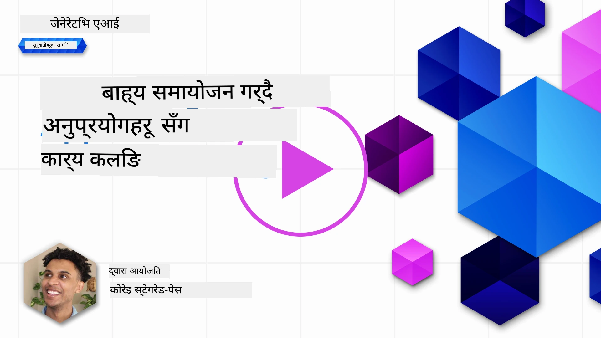
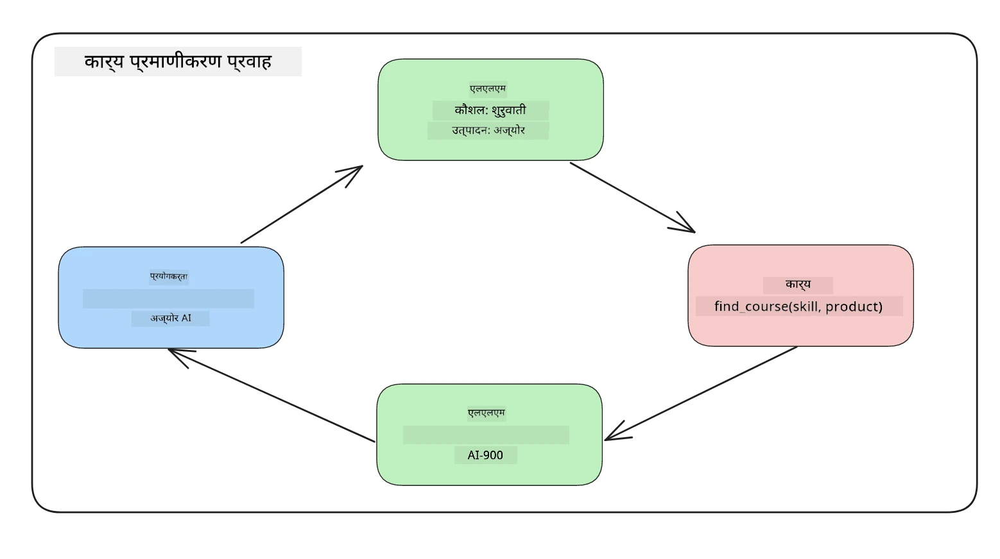
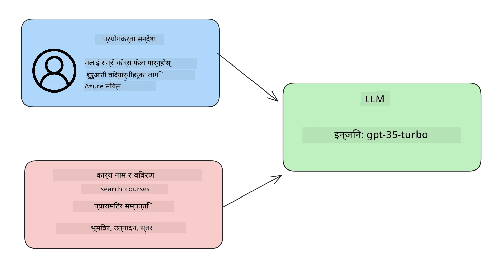

# फङ्क्सन कलिङसँग एकीकरण

[](https://youtu.be/DgUdCLX8qYQ?si=f1ouQU5HQx6F8Gl2)

अहिलेसम्म तपाईंले अघिल्ला पाठहरूमा राम्ररी सिक्नुभएको छ। तर, हामी अझ सुधार गर्न सक्छौँ। केही कुराहरू हामी सम्बोधन गर्न सक्छौँ जस्तो कि कसरी हामी उत्तरलाई थप सुसंगत फारम्याटमा ल्याउन सक्छौँ जसले गर्दा उत्तरलाई तलतिर सजिलो काम गर्न सकिन्छ। साथै, हामी हाम्रो अनुप्रयोगलाई अझ धनी बनाउन अन्य स्रोतहरूबाट डेटा थप्न सक्छौँ।

माथि उल्लिखित समस्याहरू यस अध्यायले सम्बोधन गर्न खोजिरहेको छ।

## परिचय

यो पाठले समेट्नेछ:

- फङ्क्सन कलिङ के हो र यसको प्रयोग केसहरूको व्याख्या गर्नु।
- Azure OpenAI प्रयोग गरेर फङ्क्सन कल सिर्जना गर्नु।
- कसरि फङ्क्सन कललाई अनुप्रयोगमा एकीकृत गर्ने।

## सिकाइ लक्ष्यहरू

यस पाठको अन्त्यसम्म, तपाईं सक्षम हुनुहुनेछ:

- फङ्क्सन कलिङ प्रयोग गर्ने उद्देश्य बुझाउनु।
- Azure OpenAI सेवा प्रयोग गरेर फङ्क्सन कल सेटअप गर्नु।
- तपाईंको अनुप्रयोगको प्रयोग केसको लागि प्रभावकारी फङ्क्सन कल डिजाइन गर्नु।

## परिस्थिति: हाम्रो च्याटबटलाई फङ्क्सनहरूसँग सुधार गर्दै

यस पाठका लागि, हामी हाम्रो शिक्षा स्टार्टअपको लागि यस्तो सुविधा बनाउन चाहन्छौं जसले प्रयोगकर्ताहरूलाई च्याटबट मार्फत प्राविधिक पाठ्यक्रमहरू पत्ता लगाउन सकून्। हामी उनीहरूको सीप स्तर, वर्तमान भूमिका र रुचिको प्रविधि अनुसार पाठ्यक्रम सिफारिस गर्नेछौँ।

यस परिस्थिति पूरा गर्न, हामी तलको संयोजन प्रयोग गर्नेछौँ:

- `Azure OpenAI` प्रयोग गरी प्रयोगकर्ताको लागि च्याट अनुभव सिर्जना गर्ने।
- `Microsoft Learn Catalog API` प्रयोग गरी प्रयोगकर्ताको अनुरोध अनुसार पाठ्यक्रमहरू फेला पार्ने।
- `Function Calling` प्रयोग गरी प्रयोगकर्ताको प्रश्नलाई फङ्क्सनमा पठाएर API अनुरोध गर्ने।

सुरु गर्न, हेरौं किन हामी फङ्क्सन कलिङ प्रयोग गर्न चाहन्छौं:

## किन फङ्क्सन कलिङ

फङ्क्सन कलिङअघि, LLM बाट आउने उत्तरहरू असंरचित र असंगत हुन्थे। विकासकर्ताहरूले प्रत्येक उत्तरको विविधता सम्हाल्न जटिल प्रमाणीकरण कोड लेख्नुपर्ने हुन्थ्यो। प्रयोगकर्ताहरूले "स्टकहोममा वर्तमान मौसम कस्तो छ?" जस्ता प्रश्नहरूको उत्तर पाउन सक्दैनथे। यसको कारण मोडेलहरू तिनले तालिम पाएको समयसम्मको डेटामा सीमित थिए।

फङ्क्सन कलिङ Azure OpenAI सेवाको एउटा सुविधा हो जुन निम्न सीमाहरू पार गर्न डिजाइन गरिएको हो:

- **सुसंगत उत्तर फारम्याट**। यदि हामी उत्तरको फारम्याट राम्रोसँग नियन्त्रण गर्न सक्छौँ भने, हामी सजिलैसँग उत्तरलाई अन्य प्रणालीहरूसँग एकीकृत गर्न सक्छौँ।
- **बाह्य डेटा**। च्याट सन्दर्भमा अनुप्रयोगका अन्य स्रोतका डेटा प्रयोग गर्ने क्षमता।

## समस्यालाई परिदृश्यबाट देखाउँदै

> तल दिइएको परिदृश्य चलाउन तपाईंलाई हामी [सहितको नोटबुक](./python/aoai-assignment.ipynb?WT.mc_id=academic-105485-koreyst) प्रयोग गर्न सिफारिस गर्छौं। तपाईं केवल पढेर पनि समस्या देख्न सक्नुहुन्छ जहाँ फङ्क्सनहरूले समस्या समाधान गर्न मद्दत गर्न सक्छ।

जाँचौं एउटा उदाहरण जसले उत्तर फारम्याटको समस्या देखाउँछ:

मानौं हामीलाई विद्यार्थीको डेटा भण्डारण गर्न डाटाबेस बनाउनुछ जसले हामीलाई सही पाठ्यक्रम सिफारिस गर्न सहयोग गर्छ। तल दुई विद्यार्थी विवरणहरू छन् जुन डेटा दृष्टिले निकै समान छन्।

1. हाम्रो Azure OpenAI स्रोतमा कनेक्शन सिर्जना गर्नुहोस्:

   ```python
   import os
   import json
   from openai import OpenAI
   from dotenv import load_dotenv
   load_dotenv()

   # Responses API Azure OpenAI (Microsoft Foundry) v1 अन्तर्गत सेवा दिइन्छ
   # अन्त बिन्दु, त्यसैले हामी OpenAI क्लाइन्टलाई <your-endpoint>/openai/v1/ मा संकेत गर्छौं।
   endpoint = os.environ['AZURE_OPENAI_ENDPOINT']
   client = OpenAI(
   api_key=os.environ['AZURE_OPENAI_API_KEY'],
   base_url=f"{endpoint.rstrip('/')}/openai/v1/",
   )

   deployment=os.environ['AZURE_OPENAI_DEPLOYMENT']
   ```

   तल Azure OpenAI सँग हाम्रो कनेक्शन कन्फिगर गर्ने केही Python कोड छ। किनभने हामी v1 एन्डपोइन्ट प्रयोग गरिरहेका छौं, हामीले मात्र `api_key` र `base_url` सेट गर्नुपर्छ (`api_version` आवश्यक छैन)।

1. दुई विद्यार्थी विवरणहरू `student_1_description` र `student_2_description` नामका भेरिएबलहरू प्रयोग गरी सिर्जना गर्नुहोस्।

   ```python
   student_1_description="Emily Johnson is a sophomore majoring in computer science at Duke University. She has a 3.7 GPA. Emily is an active member of the university's Chess Club and Debate Team. She hopes to pursue a career in software engineering after graduating."

   student_2_description = "Michael Lee is a sophomore majoring in computer science at Stanford University. He has a 3.8 GPA. Michael is known for his programming skills and is an active member of the university's Robotics Club. He hopes to pursue a career in artificial intelligence after finishing his studies."
   ```

   माथि दिइएका विद्यार्थी विवरणहरूलाई LLM मा पठाएर डेटा पार्स गर्न चाहन्छौं। यो डेटा पछि हाम्रो अनुप्रयोगमा प्रयोग गर्न वा API मार्फत पठाउन वा डेटाबेसमा भण्डारण गर्न सकिन्छ।

1. दुई समान प्रॉम्प्टहरू सिर्जना गरौं जसले LLM लाई हामीलाई के जानकारी चाहिन्छ भनेर निर्देशन दिन्छ:

   ```python
   prompt1 = f'''
   Please extract the following information from the given text and return it as a JSON object:

   name
   major
   school
   grades
   club

   This is the body of text to extract the information from:
   {student_1_description}
   '''

   prompt2 = f'''
   Please extract the following information from the given text and return it as a JSON object:

   name
   major
   school
   grades
   club

   This is the body of text to extract the information from:
   {student_2_description}
   '''
   ```

   माथिका प्रॉम्प्टहरूले LLM लाई सूचना निकाल्न र JSON फारम्याटमा उत्तर फर्काउन निर्देशन दिन्छ।

1. प्रॉम्प्टहरू र Azure OpenAI सँग कनेक्शन सेट गरेपछि, अब हामी `client.responses.create` प्रयोग गरी प्रॉम्प्टहरू LLM मा पठाउनेछौँ। प्रॉम्प्टलाई `input` भेरिएबलमा राखिन्छ र भुमिका `user` मा राखिन्छ। यो प्रयोगकर्ताबाट च्याटबटलाई पठाइएको सन्देशको अनुकरण हो।

   ```python
   # प्रम्प्ट एकबाट प्रतिक्रिया
   openai_response1 = client.responses.create(
   model=deployment,
   input = [{'role': 'user', 'content': prompt1}],
   store=False,
   )
   openai_response1.output_text

   # प्रम्प्ट दुईबाट प्रतिक्रिया
   openai_response2 = client.responses.create(
   model=deployment,
   input = [{'role': 'user', 'content': prompt2}],
   store=False,
   )
   openai_response2.output_text
   ```

अब हामी दुबै अनुरोधहरू LLM मा पठाउन सक्छौं र प्राप्त उत्तरलाई `openai_response1.output_text` जस्ता तरिकाले जाँच्न सक्छौं।

1. अन्ततः, हामीले `json.loads` कल गरेर उत्तरलाई JSON फारम्याटमा रूपान्तरण गर्न सक्छौं:

   ```python
   # प्रतिक्रियालाई JSON वस्तु रूपमा लोड गर्दैछ।
   json_response1 = json.loads(openai_response1.output_text)
   json_response1
   ```

   उत्तर 1:

   ```json
   {
     "name": "Emily Johnson",
     "major": "computer science",
     "school": "Duke University",
     "grades": "3.7",
     "club": "Chess Club"
   }
   ```

   उत्तर 2:

   ```json
   {
     "name": "Michael Lee",
     "major": "computer science",
     "school": "Stanford University",
     "grades": "3.8 GPA",
     "club": "Robotics Club"
   }
   ```

   यद्यपि प्रॉम्प्टहरू समान छन् र विवरणहरू समान छन्, तर हामी `Grades` गुणको मानहरू फरक-फरक रूपमा देख्छौं, कहिलेकाहीं `3.7` वा `3.7 GPA` जस्तो फारम्याट पाइन्छ।

   यो परिणाम हुन्छ किनकि LLM ले लेखिएको प्रॉम्प्टको रूपमा असंरचित डेटा लिन्छ र असंरचित डेटा फर्काउँछ। हामीसँग संरचित फारम्याट हुनु आवश्यक छ ताकि हामीलाई थाहा होस् कि यो डेटा भण्डारण गर्दा वा प्रयोग गर्दा के अपेक्षा गर्ने।

त भने यो फारम्याट समस्या कसरी समाधान गर्ने? फङ्क्सन कलिङ प्रयोग गरेर, हामी सुनिश्चित गर्न सक्छौं कि हामीलाई संरचित डेटा मात्र प्राप्त हुन्छ। फङ्क्सन कलिङ गर्दा, LLM ले वास्तवमा कुनै फङ्क्सन कल वा चलाउँदैन। यसको सट्टामा, हामी LLM लाई यसको प्रतिक्रियामा अनुसरण गर्न संरचना बनाउँछौं। त्यसपछि ती संरचित प्रतिक्रियाहरुलाई प्रयोग गरी हाम्रो अनुप्रयोगमा कुन फङ्क्सन चलाउने थाहा हुन्छ।



हामी फङ्क्सनबाट फर्केका कुरा फेरि LLM लाई पठाउन सक्छौं। LLM तब प्राकृतिक भाषामा प्रयोगकर्ताको प्रश्नलाई जवाफ दिनेछ।

## फङ्क्सन कल प्रयोगका केसहरू

फङ्क्सन कलहरूले तपाईंको अनुप्रयोगलाई सुधार गर्न सक्ने धेरै फरक केसहरू छन् जस्तै:

- **बाह्य उपकरणहरू कल गर्ने**। च्याटबटहरू प्रयोगकर्ताबाट प्रश्नहरूको उत्तर दिन उत्कृष्ट छन्। फङ्क्सन कलिङ प्रयोग गरेर, च्याटबटहरूले प्रयोगकर्ताको सन्देशबाट केही कार्यहरू पूरा गर्न सक्छन्। उदाहरणका लागि, विद्यार्थीले च्याटबटलाई भन्न सक्छ "मेरो विषय शिक्षकलाई एउटा इमेल पठाउ कि म यस विषयमा थप सहायता चाहन्छु"। यसले `send_email(to: string, body: string)` नामक फङ्क्सन कल गर्न सक्छ।

- **API वा डाटाबेस क्वेरीहरू बनाउने**। प्रयोगकर्ताले प्राकृतिक भाषामा सूचना खोज्न सक्छन् जुन फारम्याटेड क्वेरी वा API अनुरोधमा रूपान्तरण हुन्छ। उदाहरणका लागि, शिक्षकले प्रश्न गर्न सक्छन् "अन्तिम असाइनमेन्ट पूरा गरेका विद्यार्थीहरू को थिए?" जसले `get_completed(student_name: string, assignment: int, current_status: string)` नामक फङ्क्सन कल गर्न सक्छ।

- **संरचित डेटा सिर्जना गर्ने**। प्रयोगकर्ताले कुनै पाठ वा CSV ब्लक लिएर LLM लाई महत्वपूर्ण जानकारी निकाल्न प्रयोग गर्न सक्छन्। उदाहरणका लागि, विद्यार्थीले शान्ति सम्झौताहरूको विकिपिडियाको लेखलाई AI फ्लैशकार्डहरू बनाउन रूपान्तरण गर्न सक्छ। यसका लागि `get_important_facts(agreement_name: string, date_signed: string, parties_involved: list)` नामक फङ्क्सन प्रयोग गर्न सकिन्छ।

## तपाईंको पहिलो फङ्क्सन कल बनाउने

फङ्क्सन कल बनाउन प्रक्रिया तीन मुख्य चरणमा हुन्छ:

1. आफ्नो फङ्क्सनहरूको सूची (उपकरणहरू) र प्रयोगकर्ताको सन्देश सहित Responses API कल गर्ने।
2. मोडेलको उत्तर पढेर कुनै कार्य गर्न अर्थात फङ्क्सन वा API कल सञ्चालन गर्ने।
3. फङ्क्सनबाट आएको उत्तर लिएर पुनः Responses API कल गर्ने र त्यो जानकारीलाई प्रयोगकर्तालाई जवाफ दिन प्रयोग गर्ने।



### चरण 1 - सन्देशहरू सिर्जना गर्ने

पहिलो चरणमा प्रयोगकर्ताको सन्देश सिर्जना गर्नु हो। यो गतिशील रूपमा पाठ इनपुटको मान लिएर सेट गर्न सकिन्छ अथवा तपाईं यहाँ मान दिइ राख्न सक्नुहुन्छ। यदि यो तपाईंको पहिलो पटक Responses API सँग काम गर्दै हुनुहुन्छ भने, हामीले सन्देशको `role` र `content` परिभाषित गर्नुपर्छ।

`role` हुनसक्छ `system` (नियमहरू सिर्जना गर्दै), `assistant` (मोडेल) वा `user` (अन्तिम प्रयोगकर्ता)। फङ्क्सन कलिङका लागि, हामी यसलाई `user` र एक उदाहरण प्रश्नको रूपमा सेट गर्नेछौं।

```python
messages= [ {"role": "user", "content": "Find me a good course for a beginner student to learn Azure."} ]
```

विभिन्न भूमिकाहरू सेट गर्दा, LLM लाई स्पष्ट हुन्छ कि यो सिस्टमले केही भनिरहेको हो वा प्रयोगकर्ताले, जसले कुराकानी इतिहास बनाउन LLM लाई मद्दत गर्छ।

### चरण 2 - फङ्क्सनहरू सिर्जना गर्ने

अब हामी एउटा फङ्क्सन र त्यसको प्यारामिटरहरू परिभाषित गर्नेछौँ। यहाँ हामी `search_courses` नामक एक मात्रै फङ्क्सन प्रयोग गर्नेछौँ तर तपाईं धेरै फङ्क्सनहरू बनाउन सक्नुहुन्छ।

> **महत्त्वपूर्ण** : फङ्क्सनहरू LLM लाई पठाइने सिस्टम सन्देशमा समावेश गरिन्छ र तपाईंको उपलब्ध टोकनहरूमा गणना गरिन्छ।

तल हाम्रा फङ्क्सनहरू array को रूपमा सिर्जना गरिएको छ। हरेक वस्तु flat Responses API फारम्याटमा एउटा उपकरण हो, जसमा `type`, `name`, `description` र `parameters` गुणहरू हुन्छन्:

```python
functions = [
   {
      "type":"function",
      "name":"search_courses",
      "description":"Retrieves courses from the search index based on the parameters provided",
      "parameters":{
         "type":"object",
         "properties":{
            "role":{
               "type":"string",
               "description":"The role of the learner (i.e. developer, data scientist, student, etc.)"
            },
            "product":{
               "type":"string",
               "description":"The product that the lesson is covering (i.e. Azure, Power BI, etc.)"
            },
            "level":{
               "type":"string",
               "description":"The level of experience the learner has prior to taking the course (i.e. beginner, intermediate, advanced)"
            }
         },
         "required":[
            "role"
         ]
      }
   }
]
```

अब हामी प्रत्येक फङ्क्सन उदाहरणको व्याख्या गर्न जाउँ:

- `name` - कल गर्न चाहिएको फङ्क्सनको नाम।
- `description` - यो फङ्क्सन कसरी काम गर्छ भन्ने स्पष्ट र विशिष्ट विवरण।
- `parameters` - ती मानहरूको सूची र फारम्याट जुन मोडेलले यसको प्रतिक्रियामा उत्पादन गर्नुपर्छ। parameters array मा वस्तुहरू हुन्छन् जसमा तलका गुणहरू हुन्छन्:
  1.  `type` - डाटाको प्रकार जसमा गुणहरू भण्डारण गरिन्छ।
  1.  `properties` - मोडेलले यसको प्रतिक्रियामा प्रयोग गर्ने विशिष्ट मानहरूको सूची
      1. `name` - फारम्याटेड उत्तरमा यो गुणको नाम, उदाहरणको लागि, `product`.
      1. `type` - यसको डाटा प्रकार, उदाहरणका लागि, `string`.
      1. `description` - त्यहि विशेष गुणको विवरण।

एउटा वैकल्पिक गुण `required` पनि हुन्छ - फङ्क्सन कल पूरा गर्न आवश्यक गुण।

### चरण 3 - फङ्क्सन कल गर्ने

फङ्क्सन परिभाषित गरेपछि, हामीले यसलाई Responses API कलमा समावेश गर्न आवश्यक छ। यो `tools` लाई `functions` सेट गरेर गर्दछौं।

एउटा विकल्प `tool_choice` लाई `auto` मा सेट गर्ने पनि हुन्छ। यसको अर्थ हामीले मोडेललाई नै निर्णय गर्न दिनेछौं कि प्रयोगकर्ताको सन्देश अनुसार कुन फङ्क्सन कल गर्नुपर्छ।

तलको केही कोडमा हामी `client.responses.create` कल गर्छौं, ध्यान दिनुहोस् `tools=functions` र `tool_choice="auto"` सेट गरिएको छ जसले LLM लाई उपलब्ध फङ्क्सनहरू कल गर्ने स्वतन्त्रता दिन्छ:

```python
response = client.responses.create(model=deployment,
                                        input=messages,
                                        tools=functions,
                                        tool_choice="auto",
                                        store=False)

print(response.output)
```

फर्कने उत्तरमा अब `response.output` भित्र `function_call` वस्तु समावेश छ जस यसरी देखिन्छ:

```json
{
  "type": "function_call",
  "name": "search_courses",
  "call_id": "call_abc123",
  "arguments": "{\n  \"role\": \"student\",\n  \"product\": \"Azure\",\n  \"level\": \"beginner\"\n}"
}
```

यहाँ हामी देख्न सक्छौं कि `search_courses` फङ्क्सन कसरी कल भयो र कुन तर्कहरू `arguments` गुणमा JSON प्रतिक्रियामा सूचीबद्ध छन्।

LLM ले तथ्यहरू `input` प्यारामिटरमा दिइएको मानबाट निकालेर फङ्क्सनका तर्कहरूमा मेल खाने डेटा पत्ता लगायो भन्ने निष्कर्ष निकालिएको छ। तल `messages` मानको सम्झना:

```python
messages= [ {"role": "user", "content": "Find me a good course for a beginner student to learn Azure."} ]
```

जस्तै देखिन्छ, `student`, `Azure` र `beginner` लाई `messages` बाट निकालेर फङ्क्सनको इनपुट सेट गरिएको छ। यसरी फङ्क्सन प्रयोग गरेर सूचना निकाल्न सकिन्छ र LLM लाई संरचना पनि दिन सकिन्छ जसले पुनः प्रयोगयोग्य कार्यक्षमतामा मद्दत गर्छ।

अब हेरौं यी कुरा हाम्रो अनुप्रयोगमा कसरी प्रयोग गर्ने।

## फङ्क्सन कलहरूलाई अनुप्रयोगमा एकीकृत गर्नु

LLM बाट फर्म्याट गरिएको उत्तर परीक्षण गरेपछि, अब हामी यसलाई अनुप्रयोगमा एकीकृत गर्न सक्छौं।

### प्रवाह व्यवस्थापन

यसलाई हाम्रो अनुप्रयोगमा एकीकृत गर्न, आउनुहोस् तलका चरणहरू अपनाउँ:

1. पहिले, OpenAI सेवाहरूलाई कल गरौं र उत्तरको `output` बाट फङ्क्सन कल वस्तुहरू निकालौं।

   ```python
   response_items = response.output
   tool_calls = [item for item in response_items if item.type == "function_call"]
   ```

1. अब हामी Microsoft Learn API कल गर्ने फङ्क्सन परिभाषित गर्नेछौँ जसले पाठ्यक्रमहरूको सूची ल्याउँछ:

   ```python
   import requests

   def search_courses(role, product, level):
     url = "https://learn.microsoft.com/api/catalog/"
     params = {
        "role": role,
        "product": product,
        "level": level
     }
     response = requests.get(url, params=params)
     modules = response.json()["modules"]
     results = []
     for module in modules[:5]:
        title = module["title"]
        url = module["url"]
        results.append({"title": title, "url": url})
     return str(results)
   ```

   ध्यान दिनुहोस् हामीले साँच्चिकै Python फङ्क्सन बनायौं जुन `functions` भेरिएबलमा परिचय गराइएका फङ्क्सन नामहरूलाई म्याप गर्छ। साथै हामी आवश्यक डेटा ल्याउन बाह्य API कल गर्दैछौँ। यस अवस्थामा Microsoft Learn API मार्फत तालिम मोड्युलहरू खोज्दैछौँ।

ठीक छ, हामीले `functions` नामक भेरिएबल बनायौं र त्यति सँगै Python फङ्क्सन पनि, अब कसरी LLM लाई यी दुईलाई म्याप गरी Python फङ्क्सन कल गराउने थाहा दिन्छौं?

1. Python फङ्क्सन कल आवश्यक पर्छ कि पर्दैन भनेर हेर्न LLM उत्तरमा `function_call` वस्तु छ कि छैन हेर्नुपर्छ र त्यस फङ्क्सनलाई कल गर्नुपर्छ। तल यस जाँच गर्ने तरिका:

   ```python
   # मोडेलले एउटा फङ्सन कल गर्न चाहन्छ कि छैन जाँच गर्नुहोस्
   if tool_calls:
    for tool_call in tool_calls:
     print("Recommended Function call:")
     print(tool_call.name)
     print()

     # फङ्सन कल गर्नुहोस्।
     function_name = tool_call.name

     available_functions = {
             "search_courses": search_courses,
     }
     function_to_call = available_functions[function_name]

     function_args = json.loads(tool_call.arguments)
     function_response = function_to_call(**function_args)

     print("Output of function call:")
     print(function_response)
     print(type(function_response))

     # फङ्सन कल र यसको परिणामलाई वार्तालापमा फिर्ता थप्नुहोस्।
     # मोडेलको function_call वस्तु यसको आउटपुटभन्दा पहिले जोडिनुपर्छ।
     messages.append(tool_call)  # सहायकको function_call वस्तु
     messages.append( # फङ्सन परिणाम
         {
             "type": "function_call_output",
             "call_id": tool_call.call_id,
             "output": function_response,
         }
     )
   ```

   यी तीन लाइनहरूले फङ्क्सन नाम, तर्कहरू निकाल्छन् र फङ्क्सन कल गर्छन्:

   ```python
   function_to_call = available_functions[function_name]

   function_args = json.loads(tool_call.arguments)
   function_response = function_to_call(**function_args)
   ```

   तल हाम्रा कोड चलाउँदा आएको आउटपुट:

   **आउटपुट**

   ```Recommended Function call:
   {
     "name": "search_courses",
     "arguments": "{\n  \"role\": \"student\",\n  \"product\": \"Azure\",\n  \"level\": \"beginner\"\n}"
   }

   Output of function call:
   [{'title': 'Describe concepts of cryptography', 'url': 'https://learn.microsoft.com/training/modules/describe-concepts-of-cryptography/?
   WT.mc_id=api_CatalogApi'}, {'title': 'Introduction to audio classification with TensorFlow', 'url': 'https://learn.microsoft.com/en-
   us/training/modules/intro-audio-classification-tensorflow/?WT.mc_id=api_CatalogApi'}, {'title': 'Design a Performant Data Model in Azure SQL
   Database with Azure Data Studio', 'url': 'https://learn.microsoft.com/training/modules/design-a-data-model-with-ads/?
   WT.mc_id=api_CatalogApi'}, {'title': 'Getting started with the Microsoft Cloud Adoption Framework for Azure', 'url':
   'https://learn.microsoft.com/training/modules/cloud-adoption-framework-getting-started/?WT.mc_id=api_CatalogApi'}, {'title': 'Set up the
   Rust development environment', 'url': 'https://learn.microsoft.com/training/modules/rust-set-up-environment/?WT.mc_id=api_CatalogApi'}]
   <class 'str'>
   ```

1. अब हामी अपडेट गरिएको सन्देश `messages` LLM लाई पठाउनेछौँ ताकि हामी API JSON फार्म्याटको सट्टा प्राकृतिक भाषामा उत्तर प्राप्त गर्न सकूँ।

   ```python
   print("Messages in next request:")
   print(messages)
   print()

   second_response = client.responses.create(
      input=messages,
      model=deployment,
      tool_choice="auto",
      tools=functions,
      temperature=0,
      store=False,
         )  # मोडेलबाट नयाँ प्रतिक्रिया प्राप्त गर्नुहोस् जहाँ यसले फङ्क्सन प्रतिक्रिया देख्न सक्छ


   print(second_response.output_text)
   ```

   **आउटपुट**

   ```text
   I found some good courses for beginner students to learn Azure:

   1. [Describe concepts of cryptography](https://learn.microsoft.com/training/modules/describe-concepts-of-cryptography/?WT.mc_id=api_CatalogApi)
   2. [Introduction to audio classification with TensorFlow](https://learn.microsoft.com/training/modules/intro-audio-classification-tensorflow/?WT.mc_id=api_CatalogApi)
   3. [Design a Performant Data Model in Azure SQL Database with Azure Data Studio](https://learn.microsoft.com/training/modules/design-a-data-model-with-ads/?WT.mc_id=api_CatalogApi)
   4. [Getting started with the Microsoft Cloud Adoption Framework for Azure](https://learn.microsoft.com/training/modules/cloud-adoption-framework-getting-started/?WT.mc_id=api_CatalogApi)
   5. [Set up the Rust development environment](https://learn.microsoft.com/training/modules/rust-set-up-environment/?WT.mc_id=api_CatalogApi)

   You can click on the links to access the courses.
   ```

## कार्यभार

Azure OpenAI Function Calling को सिकाइ जारी राख्न तपाईं निम्न निर्माण गर्न सक्नुहुन्छ:

- फङ्क्सनका अन्य प्यारामिटरहरू थप्नुहोस् जसले सिक्नेहरूलाई थप पाठ्यक्रमहरू पत्ता लगाउन मद्दत गर्नेछ।

- सिक्ने व्यक्तिको स्वदेशी भाषा जस्ता थप जानकारी लिन अर्को फंक्शन कल सिर्जना गर्नुहोस्
- फंक्शन कल र/वा API कलले कुनै उपयुक्त कोर्सहरू फिर्ता नगरेको अवस्थामा त्रुटि ह्यान्डलिंग सिर्जना गर्नुहोस्

संकेत: यो डेटा कहाँ र कसरी उपलब्ध छ हेर्न [Learn API reference documentation](https://learn.microsoft.com/training/support/catalog-api-developer-reference?WT.mc_id=academic-105485-koreyst) पृष्ठ पालना गर्नुहोस्।

## शानदार काम! यात्रा जारी राख्नुहोस्

यो पाठ पूरा गरेपछि, हाम्रो [Generative AI Learning collection](https://aka.ms/genai-collection?WT.mc_id=academic-105485-koreyst) हेर्नुहोस् र आफ्नो Generative AI ज्ञान बढाउँदै जानुहोस्!

पाठ १२ मा जानुहोस्, जहाँ हामी [AI अनुप्रयोगका लागि UX कसरी डिजाइन गर्ने](../12-designing-ux-for-ai-applications/README.md?WT.mc_id=academic-105485-koreyst) हेर्नेछौं!

---

<!-- CO-OP TRANSLATOR DISCLAIMER START -->
**अस्वीकरण**:
यो दस्तावेज़ AI अनुवाद सेवा [Co-op Translator](https://github.com/Azure/co-op-translator) प्रयोग गरेर अनुवाद गरिएको हो। हामी सही हुन प्रयास गर्छौं, तर कृपया जानकार हुनुस् कि स्वचालित अनुवादमा त्रुटिहरू वा अशुद्धताहरू हुन सक्छन्। मूल दस्तावेज़ यसको मूल भाषामा आधिकारिक स्रोत मानिनुपर्छ। महत्वपूर्ण जानकारीका लागि व्यावसायिक मानव अनुवाद सिफारिस गरिन्छ। यस अनुवादको प्रयोगबाट उत्पन्न कुनै पनि गलत बुझाइ वा त्रुटिको लागि हामी जिम्मेवार छैनौं।
<!-- CO-OP TRANSLATOR DISCLAIMER END -->