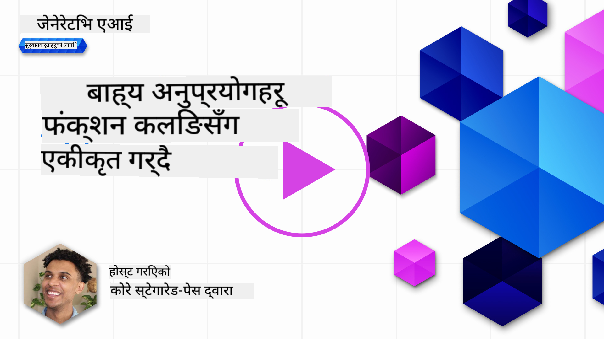

<!--
CO_OP_TRANSLATOR_METADATA:
{
  "original_hash": "77a48a201447be19aa7560706d6f93a0",
  "translation_date": "2025-07-09T14:29:26+00:00",
  "source_file": "11-integrating-with-function-calling/README.md",
  "language_code": "ne"
}
-->
# function calling सँग एकीकरण

[](https://aka.ms/gen-ai-lesson11-gh?WT.mc_id=academic-105485-koreyst)

तपाईंले अघिल्ला पाठहरूमा धेरै कुरा सिक्नुभएको छ। तर, हामी अझ सुधार गर्न सक्छौं। केही कुरा हामीले सम्बोधन गर्न सक्छौं भनेको कसरी हामीले प्रतिक्रिया ढाँचालाई अझ सुसंगत बनाउन सक्छौं जसले प्रतिक्रिया पछि काम गर्न सजिलो बनाउँछ। साथै, हामीले हाम्रो एप्लिकेशनलाई अझ समृद्ध बनाउन अन्य स्रोतहरूबाट डेटा थप्न पनि चाहन सक्छौं।

माथि उल्लिखित समस्याहरू यस अध्यायले सम्बोधन गर्न खोजेको विषयहरू हुन्।

## परिचय

यस पाठले समेट्नेछ:

- function calling के हो र यसको प्रयोगका केसहरू के-के हुन् भन्ने व्याख्या।
- Azure OpenAI प्रयोग गरेर function call कसरी बनाउने।
- function call लाई एप्लिकेशनमा कसरी एकीकृत गर्ने।

## सिकाइका लक्ष्यहरू

यस पाठको अन्त्यसम्म, तपाईं सक्षम हुनुहुनेछ:

- function calling प्रयोग गर्ने उद्देश्य व्याख्या गर्न।
- Azure OpenAI सेवा प्रयोग गरेर Function Call सेटअप गर्न।
- तपाईंको एप्लिकेशनको प्रयोग केसका लागि प्रभावकारी function calls डिजाइन गर्न।

## परिदृश्य: functions सँग हाम्रो chatbot सुधार गर्दै

यस पाठका लागि, हामी हाम्रो शिक्षा स्टार्टअपका लागि एउटा यस्तो सुविधा बनाउने चाहन्छौं जसले प्रयोगकर्ताहरूलाई टेक्निकल कोर्सहरू खोज्न chatbot प्रयोग गर्न दिन्छ। हामी उनीहरूको सीप स्तर, वर्तमान भूमिका र रुचि भएको प्रविधि अनुसार कोर्सहरू सिफारिस गर्नेछौं।

यो परिदृश्य पूरा गर्न, हामी निम्न संयोजन प्रयोग गर्नेछौं:

- `Azure OpenAI` प्रयोग गरेर प्रयोगकर्ताका लागि च्याट अनुभव सिर्जना गर्ने।
- `Microsoft Learn Catalog API` प्रयोगकर्ताको अनुरोध अनुसार कोर्सहरू खोज्न मद्दत गर्ने।
- `Function Calling` प्रयोगकर्ताको सोधाइ लिएर API अनुरोध गर्न function मा पठाउने।

सुरु गर्न, हामी किन function calling प्रयोग गर्न चाहन्छौं भनेर हेरौं:

## किन Function Calling

function calling अघि, LLM बाट प्राप्त प्रतिक्रियाहरू असंरचित र असंगत हुन्थे। विकासकर्ताहरूले प्रत्येक प्रतिक्रिया भिन्नता सम्हाल्न जटिल मान्यकरण कोड लेख्नुपर्ने हुन्थ्यो। प्रयोगकर्ताहरूले "स्टकहोमको वर्तमान मौसम कस्तो छ?" जस्ता प्रश्नको जवाफ पाउन सक्दैनथे। किनभने मोडेलहरू केवल तालिम लिएको डाटाको समयसम्म सीमित थिए।

Function Calling Azure OpenAI सेवाको एउटा सुविधा हो जसले निम्न सीमाहरू पार गर्न मद्दत गर्छ:

- **सुसंगत प्रतिक्रिया ढाँचा**। यदि हामी प्रतिक्रिया ढाँचामा राम्रो नियन्त्रण गर्न सक्छौं भने, हामी सजिलै प्रतिक्रिया अन्य प्रणालीहरूमा एकीकृत गर्न सक्छौं।
- **बाह्य डेटा**। एप्लिकेशनका अन्य स्रोतहरूबाट डेटा च्याट सन्दर्भमा प्रयोग गर्ने क्षमता।

## परिदृश्य मार्फत समस्याको चित्रण

> तलको परिदृश्य चलाउन चाहनुहुन्छ भने [सहितको नोटबुक](../../../11-integrating-with-function-calling/python/aoai-assignment.ipynb) प्रयोग गर्न सिफारिस गरिन्छ। तपाईं केवल पढ्न पनि सक्नुहुन्छ किनभने हामी एउटा समस्या देखाउन खोज्दैछौं जहाँ functions ले समस्या समाधान गर्न सक्छ।

अब प्रतिक्रिया ढाँचाको समस्या देखाउने उदाहरण हेरौं:

मानौं हामी विद्यार्थीहरूको डेटा भण्डारण गर्न एउटा डाटाबेस बनाउन चाहन्छौं ताकि उनीहरूलाई उपयुक्त कोर्स सिफारिस गर्न सकियोस्। तल दुई विद्यार्थी विवरणहरू छन् जुन डाटामा धेरै समान छन्।

1. Azure OpenAI स्रोतसँग जडान बनाउनुहोस्:

   ```python
   import os
   import json
   from openai import AzureOpenAI
   from dotenv import load_dotenv
   load_dotenv()

   client = AzureOpenAI(
   api_key=os.environ['AZURE_OPENAI_API_KEY'],  # this is also the default, it can be omitted
   api_version = "2023-07-01-preview"
   )

   deployment=os.environ['AZURE_OPENAI_DEPLOYMENT']
   ```

   तल केही Python कोड छ जसले Azure OpenAI सँग जडान सेटअप गर्छ जहाँ `api_type`, `api_base`, `api_version` र `api_key` सेट गरिएको छ।

1. दुई विद्यार्थी विवरणहरू `student_1_description` र `student_2_description` भेरिएबलहरू प्रयोग गरेर बनाउनुहोस्।

   ```python
   student_1_description="Emily Johnson is a sophomore majoring in computer science at Duke University. She has a 3.7 GPA. Emily is an active member of the university's Chess Club and Debate Team. She hopes to pursue a career in software engineering after graduating."

   student_2_description = "Michael Lee is a sophomore majoring in computer science at Stanford University. He has a 3.8 GPA. Michael is known for his programming skills and is an active member of the university's Robotics Club. He hopes to pursue a career in artificial intelligence after finishing his studies."
   ```

   माथिका विद्यार्थी विवरणहरू LLM लाई पठाएर डेटा पार्स गर्न चाहन्छौं। यो डेटा पछि हाम्रो एप्लिकेशनमा प्रयोग गर्न वा API मा पठाउन वा डाटाबेसमा भण्डारण गर्न सकिन्छ।

1. दुई समान प्रॉम्प्टहरू बनाऔं जसमा हामी LLM लाई कुन जानकारी चाहिन्छ भनेर निर्देशन दिन्छौं:

   ```python
   prompt1 = f'''
   Please extract the following information from the given text and return it as a JSON object:

   name
   major
   school
   grades
   club

   This is the body of text to extract the information from:
   {student_1_description}
   '''

   prompt2 = f'''
   Please extract the following information from the given text and return it as a JSON object:

   name
   major
   school
   grades
   club

   This is the body of text to extract the information from:
   {student_2_description}
   '''
   ```

   माथिका प्रॉम्प्टहरूले LLM लाई जानकारी निकाल्न र JSON ढाँचामा प्रतिक्रिया फर्काउन निर्देशन दिन्छ।

1. प्रॉम्प्टहरू र Azure OpenAI सँग जडान सेट गरेपछि, अब हामी `openai.ChatCompletion` प्रयोग गरेर प्रॉम्प्टहरू LLM लाई पठाउनेछौं। हामी प्रॉम्प्टलाई `messages` भेरिएबलमा राख्छौं र भूमिका `user` राख्छौं। यसले प्रयोगकर्ताबाट च्याटबटमा सन्देश लेखिएको जस्तो अनुकरण गर्छ।

   ```python
   # response from prompt one
   openai_response1 = client.chat.completions.create(
   model=deployment,
   messages = [{'role': 'user', 'content': prompt1}]
   )
   openai_response1.choices[0].message.content

   # response from prompt two
   openai_response2 = client.chat.completions.create(
   model=deployment,
   messages = [{'role': 'user', 'content': prompt2}]
   )
   openai_response2.choices[0].message.content
   ```

अब हामी दुबै अनुरोधहरू LLM लाई पठाउन सक्छौं र प्राप्त प्रतिक्रियालाई यसरी हेर्न सक्छौं `openai_response1['choices'][0]['message']['content']`।

1. अन्तमा, हामी प्रतिक्रिया JSON ढाँचामा रूपान्तरण गर्न `json.loads` कल गर्न सक्छौं:

   ```python
   # Loading the response as a JSON object
   json_response1 = json.loads(openai_response1.choices[0].message.content)
   json_response1
   ```

   प्रतिक्रिया 1:

   ```json
   {
     "name": "Emily Johnson",
     "major": "computer science",
     "school": "Duke University",
     "grades": "3.7",
     "club": "Chess Club"
   }
   ```

   प्रतिक्रिया 2:

   ```json
   {
     "name": "Michael Lee",
     "major": "computer science",
     "school": "Stanford University",
     "grades": "3.8 GPA",
     "club": "Robotics Club"
   }
   ```

   यद्यपि प्रॉम्प्टहरू समान छन् र विवरणहरू पनि मिल्दोजुल्दो छन्, हामीले `Grades` सम्पत्तिको मान फरक ढाँचामा देख्छौं, जस्तै कहिलेकाहीं `3.7` वा `3.7 GPA`।

   यो परिणाम किनभने LLM ले असंरचित डेटा (लेखिएको प्रॉम्प्ट) लिन्छ र असंरचित डेटा नै फर्काउँछ। हामीलाई संरचित ढाँचामा डेटा चाहिन्छ ताकि हामीलाई थाहा होस् डेटा भण्डारण वा प्रयोग गर्दा के अपेक्षा गर्ने।

त्यसैले, हामीले ढाँचाको समस्या कसरी समाधान गर्ने? function calling प्रयोग गरेर, हामी सुनिश्चित गर्न सक्छौं कि हामीलाई संरचित डेटा प्राप्त हुन्छ। function calling प्रयोग गर्दा, LLM ले कुनै function कल वा चलाउँदैन। बरु, हामी LLM लाई यसको प्रतिक्रियाका लागि अनुसरण गर्न संरचना बनाउँछौं। त्यसपछि ती संरचित प्रतिक्रियाहरू प्रयोग गरेर हामी हाम्रो एप्लिकेशनमा कुन function चलाउने थाहा पाउँछौं।


हामी function बाट फर्किएको कुरा लिएर फेरि LLM लाई पठाउन सक्छौं। LLM तब प्रयोगकर्ताको सोधाइको जवाफ दिन प्राकृतिक भाषा प्रयोग गरेर प्रतिक्रिया दिनेछ।

## function calls प्रयोग गर्ने प्रयोग केसहरू

धेरै विभिन्न प्रयोग केसहरू छन् जहाँ function calls ले तपाईंको एप्लिकेशन सुधार गर्न सक्छ जस्तै:

- **बाह्य उपकरणहरू कल गर्ने**। च्याटबटहरू प्रयोगकर्ताका प्रश्नहरूको जवाफ दिन राम्रो हुन्छन्। function calling प्रयोग गरेर, च्याटबटले प्रयोगकर्ताका सन्देशहरू प्रयोग गरेर केही कार्यहरू पूरा गर्न सक्छ। उदाहरणका लागि, विद्यार्थीले च्याटबटलाई भन्न सक्छ "मेरो शिक्षकलाई इमेल पठाउनुहोस् कि मलाई यस विषयमा थप सहयोग चाहिन्छ"। यसले `send_email(to: string, body: string)` function call गर्न सक्छ।

- **API वा डाटाबेस क्वेरीहरू बनाउने**। प्रयोगकर्ताहरू प्राकृतिक भाषामा जानकारी खोज्न सक्छन् जुन फर्म्याट गरिएको क्वेरी वा API अनुरोधमा रूपान्तरण हुन्छ। उदाहरणका लागि, शिक्षकले सोध्न सक्छन् "अन्तिम असाइनमेन्ट पूरा गरेका विद्यार्थीहरू को-को हुन्?" जसले `get_completed(student_name: string, assignment: int, current_status: string)` function call गर्न सक्छ।

- **संरचित डेटा सिर्जना गर्ने**। प्रयोगकर्ताले कुनै पाठ वा CSV ब्लक लिएर LLM प्रयोग गरेर महत्वपूर्ण जानकारी निकाल्न सक्छन्। उदाहरणका लागि, विद्यार्थीले शान्ति सम्झौताबारे विकिपिडिया लेखलाई AI फ्ल्यासकार्ड बनाउन रूपान्तरण गर्न सक्छ। यसका लागि `get_important_facts(agreement_name: string, date_signed: string, parties_involved: list)` function प्रयोग गर्न सकिन्छ।

## तपाईंको पहिलो Function Call बनाउने

function call बनाउने प्रक्रिया ३ मुख्य चरणहरूमा हुन्छ:

1. तपाईंका functions को सूची र प्रयोगकर्ताको सन्देश सहित Chat Completions API कल गर्ने।
2. मोडेलको प्रतिक्रिया पढेर कुनै कार्य गर्ने, जस्तै function वा API call चलाउने।
3. function बाट प्राप्त प्रतिक्रियासहित फेरि Chat Completions API कल गरेर प्रयोगकर्तालाई जवाफ दिने।


### चरण १ - सन्देशहरू बनाउने

पहिलो चरण हो प्रयोगकर्ताको सन्देश बनाउने। यो गतिशील रूपमा टेक्स्ट इनपुटको मान लिएर सेट गर्न सकिन्छ वा यहाँ मान दिन सकिन्छ। यदि तपाईं पहिलो पटक Chat Completions API सँग काम गर्दै हुनुहुन्छ भने, हामीले सन्देशको `role` र `content` परिभाषित गर्नुपर्छ।

`role` हुन सक्छ `system` (नियम बनाउने), `assistant` (मोडेल) वा `user` (अन्तिम प्रयोगकर्ता)। function calling का लागि हामी यसलाई `user` राख्नेछौं र एउटा उदाहरण प्रश्न दिनेछौं।

```python
messages= [ {"role": "user", "content": "Find me a good course for a beginner student to learn Azure."} ]
```

विभिन्न भूमिकाहरू असाइन गर्दा LLM लाई स्पष्ट हुन्छ कि यो सिस्टमले कुरा गरिरहेको हो वा प्रयोगकर्ताले, जसले संवाद इतिहास बनाउन मद्दत गर्छ।

### चरण २ - functions बनाउने

अर्को, हामी function र त्यसका प्यारामिटरहरू परिभाषित गर्नेछौं। यहाँ हामी एउटा मात्र function `search_courses` बनाउनेछौं तर तपाईं धेरै functions बनाउन सक्नुहुन्छ।

> **महत्त्वपूर्ण** : functions LLM लाई पठाइने सिस्टम सन्देशमा समावेश हुन्छन् र तपाईंको उपलब्ध टोकनहरूको गणनामा समावेश हुन्छन्।

तल functions लाई वस्तुहरूको एरेको रूपमा बनाइएको छ। प्रत्येक वस्तु function हो र यसमा `name`, `description` र `parameters` हुन्छन्:

```python
functions = [
   {
      "name":"search_courses",
      "description":"Retrieves courses from the search index based on the parameters provided",
      "parameters":{
         "type":"object",
         "properties":{
            "role":{
               "type":"string",
               "description":"The role of the learner (i.e. developer, data scientist, student, etc.)"
            },
            "product":{
               "type":"string",
               "description":"The product that the lesson is covering (i.e. Azure, Power BI, etc.)"
            },
            "level":{
               "type":"string",
               "description":"The level of experience the learner has prior to taking the course (i.e. beginner, intermediate, advanced)"
            }
         },
         "required":[
            "role"
         ]
      }
   }
]
```

अब प्रत्येक function को विवरण तल दिइएको छ:

- `name` - function को नाम जुन हामी कल गर्न चाहन्छौं।
- `description` - function कसरी काम गर्छ भन्ने विवरण। यहाँ स्पष्ट र विशिष्ट हुनु महत्त्वपूर्ण छ।
- `parameters` - मानहरूको सूची र ढाँचा जुन मोडेलले आफ्नो प्रतिक्रियामा उत्पादन गर्नेछ। parameters एरेमा वस्तुहरू हुन्छन् जसमा निम्न गुणहरू हुन्छन्:
  1. `type` - गुणहरूको डेटा प्रकार।
  1. `properties` - विशिष्ट मानहरूको सूची जुन मोडेलले आफ्नो प्रतिक्रियामा प्रयोग गर्नेछ।
      1. `name` - गुणको नाम जुन मोडेलले आफ्नो फर्म्याट गरिएको प्रतिक्रियामा प्रयोग गर्नेछ, जस्तै `product`।
      1. `type` - यस गुणको डेटा प्रकार, जस्तै `string`।
      1. `description` - विशिष्ट गुणको विवरण।

वैकल्पिक `required` गुण पनि हुन्छ - function call पूरा गर्न आवश्यक गुणहरू।

### चरण ३ - function call गर्ने

function परिभाषित गरेपछि, अब यसलाई Chat Completion API कलमा समावेश गर्नुपर्छ। हामी यसलाई `functions` अनुरोधमा थप्छौं। यस अवस्थामा `functions=functions`।

`function_call` लाई `auto` मा सेट गर्ने विकल्प पनि छ। यसको अर्थ LLM लाई प्रयोगकर्ताको सन्देशको आधारमा कुन function कल गर्ने निर्णय गर्न दिन्छौं।

तलको कोडमा `ChatCompletion.create` कल गरिएको छ, जहाँ `functions=functions` र `function_call="auto"` सेट गरिएको छ जसले LLM लाई functions कल गर्ने निर्णय दिन्छ:

```python
response = client.chat.completions.create(model=deployment,
                                        messages=messages,
                                        functions=functions,
                                        function_call="auto")

print(response.choices[0].message)
```

अब फर्किएको प्रतिक्रिया यसरी देखिन्छ:

```json
{
  "role": "assistant",
  "function_call": {
    "name": "search_courses",
    "arguments": "{\n  \"role\": \"student\",\n  \"product\": \"Azure\",\n  \"level\": \"beginner\"\n}"
  }
}
```

यहाँ देख्न सकिन्छ कि function `search_courses` कल गरिएको छ र कुन arguments सँग, जुन JSON प्रतिक्रियाको `arguments` गुणमा छ।

निष्कर्ष यो हो कि LLM ले function को arguments फिट गर्न डेटा फेला पारेको छ किनभने यसले `messages` प्यारामिटरमा दिएको मानबाट डेटा निकालिरहेको छ। तल `messages` को मान सम्झना गरौं:

```python
messages= [ {"role": "user", "content": "Find me a good course for a beginner student to learn Azure."} ]
```

जस्तै देखिन्छ, `student`, `Azure` र `beginner` `messages` बाट निकालिएको र function को इनपुटको रूपमा सेट गरिएको छ। functions यसरी प्रयोग गर्दा प्रॉम्प्टबाट जानकारी निकाल्न मात्र होइन, LLM लाई संरचना दिन र पुन: प्रयोगयोग्य कार्यक्षमता बनाउन पनि राम्रो तरिका हो।

अब हामीले यो हाम्रो एप्लिकेशनमा कसरी प्रयोग गर्ने हेर्नुपर्छ।

## एप्लिकेशनमा Function Calls एकीकृत गर्ने

LLM बाट प्राप्त संरचित प्रतिक्रिया परीक्षण गरेपछि, अब यसलाई एप्लिकेशनमा एकीकृत गर्न सक्छौं।

### प्रवाह व्यवस्थापन

यसलाई एप्लिकेशनमा एकीकृत गर्न, तलका चरणहरू लिनुहोस्:

1. पहिले, OpenAI सेवामा कल गरेर सन्देशलाई `response_message` नामक भेरिएबलमा भण्डारण गरौं।

   ```python
   response_message = response.choices[0].message
   ```

1. अब Microsoft Learn API कल गर्ने function परिभाषित गरौं जसले कोर्सहरूको सूची ल्याउँछ:

   ```python
   import requests

   def search_courses(role, product, level):
     url = "https://learn.microsoft.com/api/catalog/"
     params = {
        "role": role,
        "product": product,
        "level": level
     }
     response = requests.get(url, params=params)
     modules = response.json()["modules"]
     results = []
     for module in modules[:5]:
        title = module["title"]
        url = module["url"]
        results.append({"title": title, "url": url})
     return str(results)
   ```

   यहाँ हामीले Python function बनाएका छौं जुन `functions` भेरिएबलमा उल्लेखित function नामसँग मेल खान्छ। हामी वास्तविक बाह्य API कलहरू पनि गर्दैछौं। यस अवस्थामा, Microsoft Learn API सँग प्रशिक्षण मोड्युलहरू खोज्न जाँदैछौं।

ठीक छ, हामीले `functions` भेरिएबल र Python function बनायौं, अब LLM लाई कसरी यी दुईलाई मिलाएर Python function कल गर्ने भनेर कसरी बताउने?

1. Python function कल गर्नुपर्ने हो कि होइन हेर्न LLM प्रतिक्रिया जाँच्नुपर्छ कि `function_call` छ कि छैन र त्यस function लाई कल गर्नुपर्छ। तल कसरी जाँच गर्ने देखाइएको छ:

   ```python
   # Check if the model wants to call a function
   if response_message.function_call.name:
    print("Recommended Function call:")
    print(response_message.function_call.name)
    print()

    # Call the function.
    function_name = response_message.function_call.name

    available_functions = {
            "search_courses": search_courses,
    }
    function_to_call = available_functions[function_name]

    function_args = json.loads(response_message.function_call.arguments)
    function_response = function_to_call(**function_args)

    print("Output of function call:")
    print(function_response)
    print(type(function_response))


    # Add the assistant response and function response to the messages
    messages.append( # adding assistant response to messages
        {
            "role": response_message.role,
            "function_call": {
                "name": function_name,
                "arguments": response_message.function_call.arguments,
            },
            "content": None
        }
    )
    messages.append( # adding function response to messages
        {
            "role": "function",
            "name": function_name,
            "content":function_response,
        }
    )
   ```

   यी तीन लाइनहरूले function नाम, arguments निकाल्छन् र function कल गर्छन्:

   ```python
   function_to_call = available_functions[function_name]

   function_args = json.loads(response_message.function_call.arguments)
   function_response = function_to_call(**function_args)
   ```

   तल हाम्रो कोड चलाउँदा प्राप्त आउटपुट छ:

   **आउटपुट**

   ```Recommended Function call:
   {
     "name": "search_courses",
     "arguments": "{\n  \"role\": \"student\",\n  \"product\": \"Azure\",\n  \"level\": \"beginner\"\n}"
   }

   Output of function call:
   [{'title': 'Describe concepts of cryptography', 'url': 'https://learn.microsoft.com/training/modules/describe-concepts-of-cryptography/?
   WT.mc_id=api_CatalogApi'}, {'title': 'Introduction to audio classification with TensorFlow', 'url': 'https://learn.microsoft.com/en-
   us/training/modules/intro-audio-classification-tensorflow/?WT.mc_id=api_CatalogApi'}, {'title': 'Design a Performant Data Model in Azure SQL
   Database with Azure Data Studio', 'url': 'https://learn.microsoft.com/training/modules/design-a-data-model-with-ads/?
   WT.mc_id=api_CatalogApi'}, {'title': 'Getting started with the Microsoft Cloud Adoption Framework for Azure', 'url':
   'https://learn.microsoft.com/training/modules/cloud-adoption-framework-getting-started/?WT.mc_id=api_CatalogApi'}, {'title': 'Set up the
   Rust development environment', 'url': 'https://learn.microsoft.com/training/modules/rust-set-up-environment/?WT.mc_id=api_CatalogApi'}]
   <class 'str'>
   ```

1. अब हामी अपडेट गरिएको सन्देश `messages` LLM लाई पठाउनेछौं ताकि हामी API JSON फर्म्याटको सट्टा प्राकृतिक भाषा प्रतिक्रिया प्राप्त गर्न सकौं।

   ```python
   print("Messages in next request:")
   print(messages)
   print()

   second_response = client.chat.completions.create(
      messages=messages,
      model=deployment,
      function_call="auto",
      functions=functions,
      temperature=0
         )  # get a new response from GPT where it can see the function response


   print(second_response.choices[0].message)
   ```

   **आउटपुट**

   ```python
   {
     "role": "assistant",
     "content": "I found some good courses for beginner students to learn Azure:\n\n1. [Describe concepts of cryptography] (https://learn.microsoft.com/training/modules/describe-concepts-of-cryptography/?WT.mc_id=api_CatalogApi)\n2. [Introduction to audio classification with TensorFlow](https://learn.microsoft.com/training/modules/intro-audio-classification-tensorflow/?WT.mc_id=api_CatalogApi)\n3. [Design a Performant Data Model in Azure SQL Database with Azure Data Studio](https://learn.microsoft.com/training/modules/design-a-data-model-with-ads/?WT.mc_id=api_CatalogApi)\n4. [Getting started with the Microsoft Cloud Adoption Framework for Azure](https://learn.microsoft.com/training/modules/cloud-adoption-framework-getting-started/?WT.mc_id=api_CatalogApi)\n5. [Set up the Rust development environment](https://learn.microsoft.com/training/modules/rust-set-up-environment/?WT.mc_id=api_CatalogApi)\n\nYou can click on the links to access the courses."
   }

   ```

## असाइनमेन्ट

Azure OpenAI Function Calling सिकाइ जारी राख्न तपाईंले निम्न बनाउन सक्नुहुन्छ:

- function का थप प्यारामिटरहरू जसले सिक्नेहरूलाई थप कोर्सहरू खोज्न मद्दत गर्छ।
- अर्को function call बनाउने जसले सिक्नेको मातृभाषा जस्ता थप जानकारी लिन्छ।
- function call र/वा API call ले उपयुक्त कोर्स फिर्ता नगरेमा त्रुटि ह्यान्डलिङ गर्ने।
## उत्कृष्ट काम! यात्रा जारी राख्नुहोस्

यो पाठ पूरा गरेपछि, हाम्रो [Generative AI Learning संग्रह](https://aka.ms/genai-collection?WT.mc_id=academic-105485-koreyst) हेर्नुहोस् र आफ्नो Generative AI ज्ञान अझ बढाउनुहोस्!

पाठ १२ मा जानुहोस्, जहाँ हामी [AI अनुप्रयोगहरूको लागि UX कसरी डिजाइन गर्ने](../12-designing-ux-for-ai-applications/README.md?WT.mc_id=academic-105485-koreyst) भन्ने कुरा हेर्नेछौं!

**अस्वीकरण**:  
यो दस्तावेज AI अनुवाद सेवा [Co-op Translator](https://github.com/Azure/co-op-translator) प्रयोग गरी अनुवाद गरिएको हो। हामी शुद्धताका लागि प्रयासरत छौं भने पनि, कृपया ध्यान दिनुहोस् कि स्वचालित अनुवादमा त्रुटि वा अशुद्धता हुन सक्छ। मूल दस्तावेज यसको मूल भाषामा नै अधिकारिक स्रोत मानिनु पर्छ। महत्वपूर्ण जानकारीका लागि व्यावसायिक मानव अनुवाद सिफारिस गरिन्छ। यस अनुवादको प्रयोगबाट उत्पन्न कुनै पनि गलतफहमी वा गलत व्याख्याका लागि हामी जिम्मेवार छैनौं।