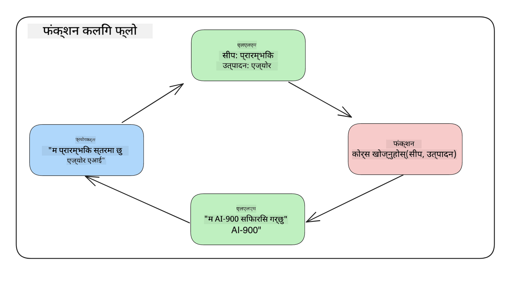
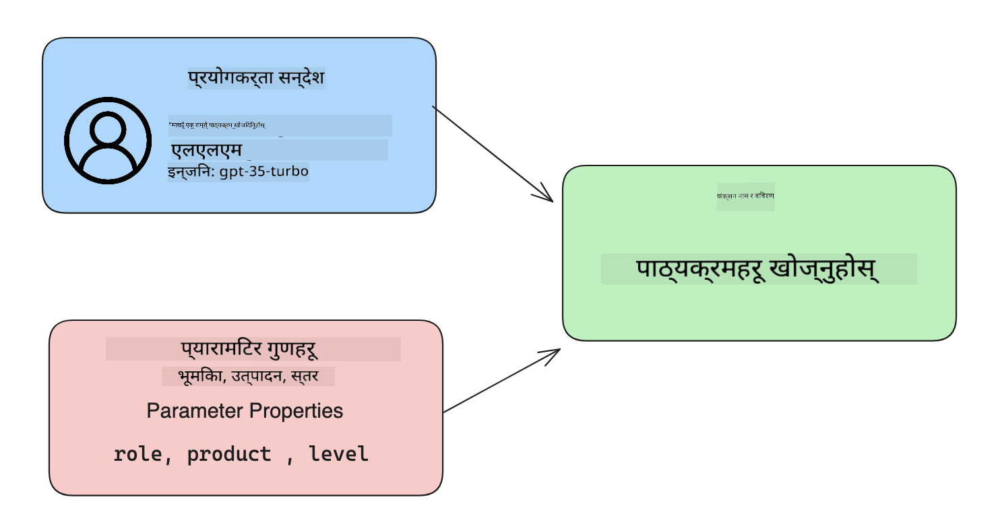

<!--
CO_OP_TRANSLATOR_METADATA:
{
  "original_hash": "f6f84f9ef2d066cd25850cab93580a50",
  "translation_date": "2025-10-17T13:56:50+00:00",
  "source_file": "11-integrating-with-function-calling/README.md",
  "language_code": "ne"
}
-->
# फङ्क्सन कलिङसँग एकीकृत गर्दै

[](https://youtu.be/DgUdCLX8qYQ?si=f1ouQU5HQx6F8Gl2)

तपाईंले अघिल्लो पाठहरूमा धेरै कुरा सिक्नुभएको छ। तर, हामी अझै सुधार गर्न सक्छौं। केही कुराहरू जुन हामी सम्बोधन गर्न सक्छौं, ती हुन्: कसरी हामी प्रतिक्रियाको ढाँचा थप सुसंगत बनाउन सक्छौं ताकि प्रतिक्रियालाई सजिलैसँग प्रयोग गर्न सकियोस्। साथै, हामी हाम्रो एप्लिकेसनलाई अझ समृद्ध बनाउन अन्य स्रोतहरूबाट डेटा थप्न चाहन सक्छौं।

माथि उल्लेखित समस्याहरूलाई यो अध्यायले सम्बोधन गर्न खोजिरहेको छ।

## परिचय

यो पाठले समेट्नेछ:

- फङ्क्सन कलिङ के हो र यसको प्रयोगका केसहरू व्याख्या गर्ने।
- Azure OpenAI प्रयोग गरेर फङ्क्सन कल सिर्जना गर्ने।
- फङ्क्सन कललाई एप्लिकेसनमा कसरी एकीकृत गर्ने।

## सिक्ने लक्ष्यहरू

यो पाठको अन्त्यसम्ममा, तपाईं सक्षम हुनुहुनेछ:

- फङ्क्सन कलिङको प्रयोगको उद्देश्य व्याख्या गर्ने।
- Azure OpenAI सेवा प्रयोग गरेर फङ्क्सन कल सेटअप गर्ने।
- तपाईंको एप्लिकेसनको प्रयोग केसका लागि प्रभावकारी फङ्क्सन कल डिजाइन गर्ने।

## परिदृश्य: हाम्रो च्याटबटलाई फङ्क्सनहरूसँग सुधार गर्दै

यस पाठको लागि, हामी हाम्रो शिक्षा स्टार्टअपको लागि एउटा सुविधा निर्माण गर्न चाहन्छौं जसले प्रयोगकर्ताहरूलाई प्राविधिक पाठ्यक्रमहरू खोज्न च्याटबट प्रयोग गर्न अनुमति दिन्छ। हामी तिनीहरूको सीप स्तर, वर्तमान भूमिका र रुचिको प्रविधिमा फिट हुने पाठ्यक्रमहरू सिफारिस गर्नेछौं।

यो परिदृश्य पूरा गर्न, हामी निम्नको संयोजन प्रयोग गर्नेछौं:

- `Azure OpenAI` प्रयोगकर्ताको लागि च्याट अनुभव सिर्जना गर्न।
- `Microsoft Learn Catalog API` प्रयोगकर्ताको अनुरोधको आधारमा पाठ्यक्रमहरू खोज्न मद्दत गर्न।
- `Function Calling` प्रयोगकर्ताको सोधपुछलाई फङ्क्सनमा पठाउन र API अनुरोध गर्न।

सुरु गर्न, हामी किन फङ्क्सन कलिङ प्रयोग गर्न चाहन्छौं भन्ने कुरा हेरौं:

## किन फङ्क्सन कलिङ

फङ्क्सन कलिङ अघि, LLM बाट प्रतिक्रियाहरू असंरचित र असंगत थिए। विकासकर्ताहरूले प्रत्येक प्रतिक्रियाको भिन्नता ह्यान्डल गर्न जटिल मान्यताको कोड लेख्नुपर्ने थियो। प्रयोगकर्ताहरूले "स्टकहोमको वर्तमान मौसम के हो?" जस्ता उत्तरहरू प्राप्त गर्न सक्दैनथे। यो किनभने मोडेलहरू तिनीहरूको डेटा प्रशिक्षित गरिएको समयसम्म सीमित थिए।

Azure OpenAI सेवाको फङ्क्सन कलिङले निम्न सीमाहरूलाई पार गर्न मद्दत गर्दछ:

- **सुसंगत प्रतिक्रिया ढाँचा**। यदि हामी प्रतिक्रियाको ढाँचालाई राम्रोसँग नियन्त्रण गर्न सक्छौं भने हामी प्रतिक्रियालाई अन्य प्रणालीहरूसँग सजिलै एकीकृत गर्न सक्छौं।
- **बाह्य डेटा**। च्याट सन्दर्भमा एप्लिकेसनको अन्य स्रोतहरूबाट डेटा प्रयोग गर्ने क्षमता।

## परिदृश्य मार्फत समस्या चित्रण गर्दै

> यदि तपाईं तलको परिदृश्य चलाउन चाहनुहुन्छ भने हामीले समावेश गरेको [नोटबुक](./python/aoai-assignment.ipynb?WT.mc_id=academic-105485-koreyst) प्रयोग गर्न सिफारिस गर्दछौं। तपाईं केवल पढ्न पनि सक्नुहुन्छ किनभने हामी फङ्क्सनहरूले समस्या समाधान गर्न कसरी मद्दत गर्न सक्छ भन्ने कुरा चित्रण गर्न खोजिरहेका छौं।

आउनुहोस्, प्रतिक्रियाको ढाँचाको समस्यालाई चित्रण गर्ने उदाहरण हेरौं:

मानौं हामी विद्यार्थीहरूको डेटा डेटाबेस सिर्जना गर्न चाहन्छौं ताकि हामी तिनीहरूलाई सही पाठ्यक्रम सिफारिस गर्न सकौं। तल हामीसँग दुई विद्यार्थीहरूको विवरणहरू छन् जसले समावेश गरेको डेटा धेरै समान छ।

1. हाम्रो Azure OpenAI स्रोतसँग जडान सिर्जना गर्नुहोस्:

   ```python
   import os
   import json
   from openai import AzureOpenAI
   from dotenv import load_dotenv
   load_dotenv()

   client = AzureOpenAI(
   api_key=os.environ['AZURE_OPENAI_API_KEY'],  # this is also the default, it can be omitted
   api_version = "2023-07-01-preview"
   )

   deployment=os.environ['AZURE_OPENAI_DEPLOYMENT']
   ```

   तलको कोडले Azure OpenAI सँग जडानको लागि `api_type`, `api_base`, `api_version` र `api_key` सेट गर्दछ।

1. दुई विद्यार्थी विवरणहरू `student_1_description` र `student_2_description` प्रयोग गरेर सिर्जना गर्नुहोस्।

   ```python
   student_1_description="Emily Johnson is a sophomore majoring in computer science at Duke University. She has a 3.7 GPA. Emily is an active member of the university's Chess Club and Debate Team. She hopes to pursue a career in software engineering after graduating."

   student_2_description = "Michael Lee is a sophomore majoring in computer science at Stanford University. He has a 3.8 GPA. Michael is known for his programming skills and is an active member of the university's Robotics Club. He hopes to pursue a career in artificial intelligence after finishing his studies."
   ```

   हामी माथिका विद्यार्थी विवरणहरूलाई LLM मा पठाउन चाहन्छौं ताकि डेटा पार्स गर्न सकियोस्। यो डेटा पछि हाम्रो एप्लिकेसनमा प्रयोग गर्न सकिन्छ र API मा पठाउन वा डेटाबेसमा भण्डारण गर्न सकिन्छ।

1. दुई समान प्रम्प्टहरू सिर्जना गरौं जसमा हामी LLM लाई हामीलाई चाहिएको जानकारीको बारेमा निर्देशन दिन्छौं:

   ```python
   prompt1 = f'''
   Please extract the following information from the given text and return it as a JSON object:

   name
   major
   school
   grades
   club

   This is the body of text to extract the information from:
   {student_1_description}
   '''

   prompt2 = f'''
   Please extract the following information from the given text and return it as a JSON object:

   name
   major
   school
   grades
   club

   This is the body of text to extract the information from:
   {student_2_description}
   '''
   ```

   माथिका प्रम्प्टहरूले LLM लाई जानकारी निकाल्न निर्देशन दिन्छ र JSON ढाँचामा प्रतिक्रिया फर्काउन भन्छ।

1. प्रम्प्टहरू सेटअप गरेपछि र Azure OpenAI सँग जडान गरेपछि, हामी अब प्रम्प्टहरूलाई LLM मा पठाउनेछौं `openai.ChatCompletion` प्रयोग गरेर। हामी प्रम्प्टलाई `messages` भेरिएबलमा भण्डारण गर्छौं र `user` लाई भूमिका असाइन गर्छौं। यो च्याटबटमा प्रयोगकर्ताबाट सन्देश लेखिएको जस्तो देखाउनको लागि हो।

   ```python
   # response from prompt one
   openai_response1 = client.chat.completions.create(
   model=deployment,
   messages = [{'role': 'user', 'content': prompt1}]
   )
   openai_response1.choices[0].message.content

   # response from prompt two
   openai_response2 = client.chat.completions.create(
   model=deployment,
   messages = [{'role': 'user', 'content': prompt2}]
   )
   openai_response2.choices[0].message.content
   ```

अब हामी दुवै अनुरोधहरूलाई LLM मा पठाउन सक्छौं र प्राप्त प्रतिक्रियालाई `openai_response1['choices'][0]['message']['content']` जस्तै फेला पारेर जाँच गर्न सक्छौं।

1. अन्ततः, हामी `json.loads` कल गरेर प्रतिक्रियालाई JSON ढाँचामा रूपान्तरण गर्न सक्छौं:

   ```python
   # Loading the response as a JSON object
   json_response1 = json.loads(openai_response1.choices[0].message.content)
   json_response1
   ```

   प्रतिक्रिया 1:

   ```json
   {
     "name": "Emily Johnson",
     "major": "computer science",
     "school": "Duke University",
     "grades": "3.7",
     "club": "Chess Club"
   }
   ```

   प्रतिक्रिया 2:

   ```json
   {
     "name": "Michael Lee",
     "major": "computer science",
     "school": "Stanford University",
     "grades": "3.8 GPA",
     "club": "Robotics Club"
   }
   ```

   यद्यपि प्रम्प्टहरू समान छन् र विवरणहरू समान छन्, हामीले `Grades` सम्पत्तिको मानहरू फरक ढाँचामा देख्छौं, जस्तै कहिलेकाहीं `3.7` वा `3.7 GPA` प्राप्त गर्न सक्छौं।

   यो परिणाम LLM ले असंरचित डेटा (लेखिएको प्रम्प्टको रूपमा) लिन्छ र असंरचित डेटा फर्काउँछ। हामीसँग संरचित ढाँचा हुनुपर्छ ताकि हामीले यो डेटा भण्डारण गर्दा वा प्रयोग गर्दा के अपेक्षा गर्न सकिन्छ भन्ने थाहा पाउन सकियोस्।

त्यसपछि हामीले ढाँचाको समस्यालाई कसरी समाधान गर्ने? फङ्क्सन कलिङ प्रयोग गरेर, हामीले संरचित डेटा फिर्ता प्राप्त गर्ने सुनिश्चित गर्न सक्छौं। फङ्क्सन कलिङ प्रयोग गर्दा, LLM ले वास्तवमा कुनै फङ्क्सनहरू कल वा चलाउँदैन। यसको सट्टा, हामीले LLM लाई यसको प्रतिक्रियाको लागि पालना गर्न संरचना सिर्जना गर्छौं। त्यसपछि हामी ती संरचित प्रतिक्रियाहरूलाई हाम्रो एप्लिकेसनमा कुन फङ्क्सन चलाउने भनेर थाहा पाउन प्रयोग गर्छौं।



हामीले फङ्क्सनबाट फिर्ता आएको कुरा लिई LLM मा पठाउन सक्छौं। त्यसपछि LLM ले प्रयोगकर्ताको सोधपुछको उत्तर दिन प्राकृतिक भाषामा प्रतिक्रिया दिनेछ।

## फङ्क्सन कल प्रयोग गर्ने प्रयोग केसहरू

फङ्क्सन कलले तपाईंको एप्लिकेसनलाई सुधार गर्न सक्ने धेरै विभिन्न प्रयोग केसहरू छन् जस्तै:

- **बाह्य उपकरणहरू कल गर्दै**। च्याटबटहरू प्रयोगकर्ताहरूको प्रश्नहरूको उत्तर प्रदान गर्न उत्कृष्ट छन्। फङ्क्सन कलिङ प्रयोग गरेर, च्याटबटहरूले प्रयोगकर्ताहरूको सन्देशहरू प्रयोग गरेर निश्चित कार्यहरू पूरा गर्न सक्छन्। उदाहरणका लागि, विद्यार्थीले च्याटबटलाई "मेरो प्रशिक्षकलाई इमेल पठाउनुहोस् कि मलाई यो विषयमा थप सहयोग चाहिन्छ" भन्न सक्छ। यसले `send_email(to: string, body: string)` नामक फङ्क्सन कल गर्न सक्छ।

- **API वा डेटाबेस क्वेरीहरू सिर्जना गर्दै**। प्रयोगकर्ताहरू प्राकृतिक भाषाको प्रयोग गरेर जानकारी फेला पार्न सक्छन् जुन ढाँगिएको क्वेरी वा API अनुरोधमा रूपान्तरण हुन्छ। यसको उदाहरण शिक्षकले "पछिल्लो असाइनमेन्ट पूरा गरेका विद्यार्थीहरू को हुन्?" भनेर सोध्न सक्छन् जसले `get_completed(student_name: string, assignment: int, current_status: string)` नामक फङ्क्सन कल गर्न सक्छ।

- **संरचित डेटा सिर्जना गर्दै**। प्रयोगकर्ताहरूले पाठको ब्लक वा CSV लिई LLM प्रयोग गरेर यसबाट महत्त्वपूर्ण जानकारी निकाल्न सक्छन्। उदाहरणका लागि, विद्यार्थीले शान्ति सम्झौताहरूको बारेमा विकिपिडिया लेखलाई AI फ्ल्यासकार्डहरू सिर्जना गर्न रूपान्तरण गर्न सक्छ। यो `get_important_facts(agreement_name: string, date_signed: string, parties_involved: list)` नामक फङ्क्सन प्रयोग गरेर गर्न सकिन्छ।

## तपाईंको पहिलो फङ्क्सन कल सिर्जना गर्दै

फङ्क्सन कल सिर्जना गर्ने प्रक्रिया 3 मुख्य चरणहरू समावेश गर्दछ:

1. **कल गर्दै** Chat Completions API लाई तपाईंको फङ्क्सनहरूको सूची र प्रयोगकर्ताको सन्देशसँग।
2. **पढ्दै** मोडेलको प्रतिक्रिया कार्य गर्न, जस्तै फङ्क्सन वा API कल चलाउनु।
3. **बनाउँदै** अर्को Chat Completions API कल फङ्क्सनबाट प्राप्त प्रतिक्रियासँग प्रयोगकर्तालाई प्रतिक्रिया सिर्जना गर्न।



### चरण 1 - सन्देशहरू सिर्जना गर्दै

पहिलो चरण प्रयोगकर्ताको सन्देश सिर्जना गर्नु हो। यो पाठ इनपुटको मान लिँदै गतिशील रूपमा असाइन गर्न सकिन्छ वा तपाईं यहाँ मान असाइन गर्न सक्नुहुन्छ। यदि यो पहिलो पटक हो जब तपाईं Chat Completions API सँग काम गर्दै हुनुहुन्छ भने, हामीले सन्देशको `role` र `content` परिभाषित गर्नुपर्छ।

`role` `system` (नियमहरू सिर्जना गर्दै), `assistant` (मोडेल) वा `user` (अन्तिम प्रयोगकर्ता) हुन सक्छ। फङ्क्सन कलिङको लागि, हामी यसलाई `user` को रूपमा असाइन गर्नेछौं र एउटा उदाहरण प्रश्न।

```python
messages= [ {"role": "user", "content": "Find me a good course for a beginner student to learn Azure."} ]
```

विभिन्न भूमिकाहरू असाइन गरेर, यो LLM लाई स्पष्ट बनाइन्छ कि यो प्रणालीले केही भनिरहेको छ वा प्रयोगकर्ताले, जसले LLM लाई निर्माण गर्न वार्तालाप इतिहास बनाउन मद्दत गर्दछ।

### चरण 2 - फङ्क्सनहरू सिर्जना गर्दै

अर्को, हामी फङ्क्सन र त्यो फङ्क्सनको प्यारामिटरहरू परिभाषित गर्नेछौं। हामी यहाँ केवल एउटा फङ्क्सन प्रयोग गर्नेछौं जसलाई `search_courses` भनिन्छ तर तपाईं धेरै फङ्क्सनहरू सिर्जना गर्न सक्नुहुन्छ।

> **महत्त्वपूर्ण** : फङ्क्सनहरू LLM लाई प्रणाली सन्देशमा समावेश गरिन्छ र तपाईंको उपलब्ध टोकनहरूको रकममा समावेश गरिनेछ।

तल, हामी फङ्क्सनहरूलाई वस्तुहरूको एरेको रूपमा सिर्जना गर्छौं। प्रत्येक वस्तु एउटा फङ्क्सन हो र `name`, `description` र `parameters` सम्पत्तिहरू छन्:

```python
functions = [
   {
      "name":"search_courses",
      "description":"Retrieves courses from the search index based on the parameters provided",
      "parameters":{
         "type":"object",
         "properties":{
            "role":{
               "type":"string",
               "description":"The role of the learner (i.e. developer, data scientist, student, etc.)"
            },
            "product":{
               "type":"string",
               "description":"The product that the lesson is covering (i.e. Azure, Power BI, etc.)"
            },
            "level":{
               "type":"string",
               "description":"The level of experience the learner has prior to taking the course (i.e. beginner, intermediate, advanced)"
            }
         },
         "required":[
            "role"
         ]
      }
   }
]
```

आउनुहोस्, प्रत्येक फङ्क्सन उदाहरणलाई तल थप विस्तृत रूपमा वर्णन गरौं:

- `name` - हामीले कल गर्न चाहेको फङ्क्सनको नाम।
- `description` - फङ्क्सन कसरी काम गर्छ भन्ने विवरण। यहाँ स्पष्ट र विशिष्ट हुनु महत्त्वपूर्ण छ।
- `parameters` - मोडेलले आफ्नो प्रतिक्रियाको लागि उत्पादन गर्न चाहेको मानहरू र ढाँचाको सूची। parameters एरे वस्तुहरूको समावेश गर्दछ जहाँ वस्तुहरूमा निम्न सम्पत्तिहरू छन्:
  1.  `type` - सम्पत्तिहरू भण्डारण गरिने डेटा प्रकार।
  1.  `properties` - मोडेलले आफ्नो प्रतिक्रियाको लागि प्रयोग गर्ने विशिष्ट मानहरूको सूची।
      1. `name` - मोडेलले आफ्नो ढाँगिएको प्रतिक्रियामा प्रयोग गर्ने सम्पत्तिको नामको कुञ्जी, उदाहरणका लागि, `product`।
      1. `type` - यो सम्पत्तिको डेटा प्रकार, उदाहरणका लागि, `string`।
      1. `description` - विशिष्ट सम्पत्तिको विवरण।

त्यहाँ वैकल्पिक सम्पत्ति `required` पनि छ - फङ्क्सन कल पूरा गर्न आवश्यक सम्पत्ति।

### चरण 3 - फङ्क्सन कल गर्दै

फङ्क्सन परिभाषित गरेपछि, हामी अब यसलाई Chat Completion API कलमा समावेश गर्नुपर्छ। हामी यो `functions` अनुरोधमा थपेर गर्छौं। यस अवस्थामा `functions=functions`।

त्यहाँ `function_call` लाई `auto` सेट गर्ने विकल्प पनि छ। यसको मतलब हामी LLM लाई प्रयोगकर्ताको सन्देशको आधारमा कुन फङ्क्सन कल गर्नुपर्छ भन्ने निर्णय गर्न दिनेछौं।

तलको कोडमा हामी `ChatCompletion.create` कल गर्छौं, ध्यान दिनुहोस् हामीले `functions=functions` र `function_call="auto"` सेट गर्छौं र यसरी LLM लाई हामीले प्रदान गरेका फङ्क्सनहरू कहिले कल गर्ने निर्णय गर्ने अधिकार दिन्छौं:

```python
response = client.chat.completions.create(model=deployment,
                                        messages=messages,
                                        functions=functions,
                                        function_call="auto")

print(response.choices[0].message)
```

अब फर्किएको प्रतिक्रिया यस्तो देखिन्छ:

```json
{
  "role": "assistant",
  "function_call": {
    "name": "search_courses",
    "arguments": "{\n  \"role\": \"student\",\n  \"product\": \"Azure\",\n  \"level\": \"beginner\"\n}"
  }
}
```

यहाँ हामी देख्न सक्छौं कि फङ्क्सन `search_courses` कल गरिएको थियो र कुन तर्कहरूसँग, JSON प्रतिक्रियामा `arguments` सम्पत्तिमा सूचीबद्ध गरिएको छ।

निष्कर्षमा, LLM ले प्रतिक्रियाको लागि फङ्क्सनका तर्कहरू फिट गर्न डेटा फेला पार्न सक्षम थियो किनभने यो `messages` प्यारामिटरमा प्रदान गरिएको मानबाट निकाल्दै थियो। तल `messages` मानको सम्झना छ:

```python
messages= [ {"role": "user", "content": "Find me a good course for a beginner student to learn Azure."} ]
```

जस्तो देखिन्छ, `student`, `Azure` र `beginner` `messages` बाट निकालिएको थियो र फङ्क्सनमा इनपुटको रूपमा सेट गरिएको थियो। यस तरिकाले फङ्क्सनहरू प्रयोग गर्नु प्रम्प्टबाट जानकारी निकाल्नको लागि मात्र होइन तर LLM लाई संरचना प्रदान गर्न र पुन: प्रयोग गर्न सकिने कार्यक्षमता प्राप्त गर्नको लागि पनि उत्कृष्ट तरिका हो।

अब, हामीले यो हाम्रो एप्लिकेसनमा कसरी प्रयोग गर्न सक्छौं भन्ने कुरा हेर्न आवश्यक छ।

## एप्लिकेसनमा फङ्क्सन कलहरू एकीकृत गर्दै

LLM बाट ढाँगिएको प्रतिक्रिया परीक्षण गरेपछि, हामी अब यसलाई हाम्रो एप्लिकेसनमा एकीकृत गर्न सक्छौं।

### फ्लो व्यवस्थापन गर्दै

यसलाई हाम्रो एप्लिकेसनमा एकीकृत गर्न, निम्न चरणहरू लिनुहोस्:

1. पहिलो, OpenAI सेवाहरूमा कल गर्नुहोस् र सन्देशलाई `response_message` नामक भेरिएबलमा भण्डारण गर्नुहोस्।

   ```python
   response_message = response.choices[0].message
   ```

1. अब हामी फङ्क्सन परिभाषित गर्नेछौं जसले Microsoft Learn API लाई पाठ्यक्रमहरूको सूची प्राप्त गर्न कल गर्नेछ:

   ```python
   import requests

   def search_courses(role, product, level):
     url = "https://learn.microsoft.com/api/catalog/"
     params = {
        "role": role,
        "product": product,
        "level": level
     }
     response = requests.get(url, params=params)
     modules = response.json()["modules"]
     results = []
     for module in modules[:5]:
        title = module["title"]
        url = module["url"]
        results.append({"title": title, "url": url})
     return str(results)
   ```

   ध्यान दिनुहोस् हामी अब `functions` भेरिएबलमा परिचय गराइएका फङ्क्सन नामहरूमा म्याप गर्ने वास्तविक Python फङ्क्सन सिर्जना गर्छौं। हामीले आवश्यक डेटा प्राप्त गर्न बाह्य API कलहरू पनि गरिरहेका छौं। यस अवस्थामा, हामी प्रशिक्षण मोड्युलहरू खोज्न Microsoft Learn API मा जान्छौं।

ठिक छ, त्यसोभए हामीले `functions` भेरिएबल र त्यससँग सम्बन्धित Python फङ्क्सन सिर्जना गर्यौं, हामीले कसरी LLM लाई यी दुईलाई म्याप गर्ने भनेर बताउने ताकि हाम्रो Python फङ्क्सन कल गरियोस्?

1. हामीले Python फङ्क्सन कल गर्न आवश्यक छ कि छैन भनेर हेर्न, हामीले LLM प्रतिक्रियामा `function_call` भाग छ कि छैन भनेर हेर्नुपर्छ र निर्दिष्ट गरिएको फङ्क्सन कल गर्नुपर्छ। तल तपाईंले उल्लेख गरिएको जाँच कसरी गर्न सक्नुहुन्छ:

   ```python
   # Check if the model wants to call a function
   if response_message.function_call.name:
    print("Recommended Function call:")
    print(response_message.function_call.name)
    print()

    # Call the function.
    function_name = response_message.function_call.name

    available_functions = {
            "search_courses": search_courses,
    }
    function_to_call = available_functions[function_name]

    function_args = json.loads(response_message.function_call.arguments)
    function_response = function_to_call(**function_args)

    print("Output of function call:")
    print(function_response)
    print(type(function_response))


    # Add the assistant response and function response to the messages
    messages.append( # adding assistant response to messages
        {
            "role": response_message.role,
            "function_call": {
                "name": function_name,
                "arguments": response_message.function_call.arguments,
            },
            "content": None
        }
    )
    messages.append( # adding function response to messages
        {
            "role": "function",
            "name": function_name,
            "content":function_response,
        }
    )
   ```

   यी तीन लाइनहरूले सुनिश्चित गर्छन् कि हामी फङ्क्सन नाम, तर्कहरू निकाल्छौं र कल गर्छौं:

   ```python
   function_to_call = available_functions[function_name]

   function_args = json.loads(response_message.function_call.arguments)
   function_response = function_to_call(**function_args)
   ```

   तल हाम्रो कोड चलाउँदा प्राप्त आउटपुट छ:

   **आउटपुट**

   ```Recommended Function call:
   {
     "name": "search_courses",
     "arguments": "{\n  \"role\": \"student\",\n  \"product\": \"Azure\",\n  \"level\": \"beginner\"\n}"
   }

   Output of function call:
   [{'title': 'Describe concepts of cryptography', 'url': 'https://learn.microsoft.com/training/modules/describe-concepts-of-cryptography/?
   WT.mc_id=api_CatalogApi'}, {'title': 'Introduction to audio classification with TensorFlow', 'url': 'https://learn.microsoft.com/en-
   us/training/modules/intro-audio-classification-tensorflow/?WT.mc_id=api_CatalogApi'}, {'title': 'Design a Performant Data Model in Azure SQL
   Database with Azure Data Studio', 'url': 'https://learn.microsoft.com/training/modules/design-a-data-model-with-ads/?
   WT.mc_id=api_CatalogApi'}, {'title': 'Getting started with the Microsoft Cloud Adoption Framework for Azure', 'url':
   'https://learn.microsoft.com/training/modules/cloud-adoption-framework-getting-started/?WT.mc_id=api_CatalogApi'}, {'title': 'Set up the
   Rust development environment', 'url': 'https://learn.microsoft.com/training/modules/rust-set-up-environment/?WT.mc_id=api_CatalogApi'}]
   <class 'str'>
   ```

1. अब हामी अपडेट गरिएको सन्देश, `messages` लाई LLM मा पठाउनेछौं ताकि हामी API JSON ढाँगिएको प्रतिक्रियाको सट्टा प्राकृतिक भाषाको प्रतिक्रिया प्राप्त गर्न सकौं।

   ```python
   print("Messages in next request:")
   print(messages)
   print()

   second_response = client.chat.completions.create(
      messages=messages,
      model=deployment,
      function_call="auto",
      functions=functions,
      temperature=0
         )  # get a new response from GPT where it can see the function response


   print(second_response.choices[0].message)
   ```

   **आउटपुट**

   ```python
   {
     "role": "assistant",
     "content": "I found some good courses for beginner students to learn Azure:\n\n1. [Describe concepts of cryptography] (https://learn.microsoft.com/training/modules/describe-concepts-of-cryptography/?WT.mc_id=api_CatalogApi)\n2. [Introduction to audio classification with TensorFlow](https://learn.microsoft.com/training/modules/intro-audio-classification-tensorflow/?WT.mc_id=api_CatalogApi)\n3. [Design a Performant Data Model in Azure SQL Database with Azure Data Studio](https://learn.microsoft.com/training/modules/design-a-data-model-with-ads/?WT.mc_id=api_CatalogApi)\n4. [Getting started with the Microsoft Cloud Adoption Framework for Azure](https://learn.microsoft.com/training/modules/cloud-adoption-framework-getting-started/?WT.mc_id=api_CatalogApi)\n5. [Set up the Rust development environment](https://learn.microsoft.com/training/modules/rust-set-up-environment/?WT.mc_id=api_CatalogApi)\n\nYou can click on the links to access the courses."
   }

   ```

## असाइनमेन्ट

Azure OpenAI फङ्क्सन कलिङको तपाईंको सिकाइलाई जारी राख्न तपाईं निर्माण गर्न सक्नुहुन्छ:

- फङ्क्सनका थप प्यारामिटरहरू जसले सिक्न चाहनेहरूलाई थप पाठ्यक्रमहरू फेला पार्न मद्दत गर्न सक्छ।
- अर्को फङ्क्सन कल सिर्जना गर्नुहोस् जसले सिक्न चाहनेहरूको बारेमा थप जानकारी लिन्छ जस्तै तिनीहरूको मातृभाषा।
- फङ्सन कल र/वा API कलले कुनै उपयुक्त पाठ्यक्रमहरू फिर्ता नगरेको अवस्थामा त्रुटि ह्यान्डलिङ सिर्जना गर्नुहोस्

सूचना: यो डेटा कहाँ र कसरी उपलब्ध छ हेर्न [Learn API reference documentation](https://learn.microsoft.com/training/support/catalog-api-developer-reference?WT.mc_id=academic-105485-koreyst) पृष्ठलाई अनुसरण गर्नुहोस्।

## उत्कृष्ट काम! यात्रा जारी राख्नुहोस्

यो पाठ पूरा गरेपछि, हाम्रो [Generative AI Learning collection](https://aka.ms/genai-collection?WT.mc_id=academic-105485-koreyst) हेर्नुहोस् र आफ्नो Generative AI ज्ञानलाई अझ स्तरवृद्धि गर्नुहोस्!

पाठ १२ मा जानुहोस्, जहाँ हामी [AI एप्लिकेसनहरूको लागि UX डिजाइन](../12-designing-ux-for-ai-applications/README.md?WT.mc_id=academic-105485-koreyst) कसरी गर्ने भन्ने कुरा हेर्नेछौं!

---

**अस्वीकरण**:  
यो दस्तावेज़ AI अनुवाद सेवा [Co-op Translator](https://github.com/Azure/co-op-translator) प्रयोग गरेर अनुवाद गरिएको छ। हामी शुद्धताको लागि प्रयास गर्छौं, तर कृपया ध्यान दिनुहोस् कि स्वचालित अनुवादमा त्रुटिहरू वा अशुद्धताहरू हुन सक्छ। यसको मूल भाषा मा रहेको दस्तावेज़लाई आधिकारिक स्रोत मानिनुपर्छ। महत्वपूर्ण जानकारीको लागि, व्यावसायिक मानव अनुवाद सिफारिस गरिन्छ। यस अनुवादको प्रयोगबाट उत्पन्न हुने कुनै पनि गलतफहमी वा गलत व्याख्याको लागि हामी जिम्मेवार हुने छैनौं।