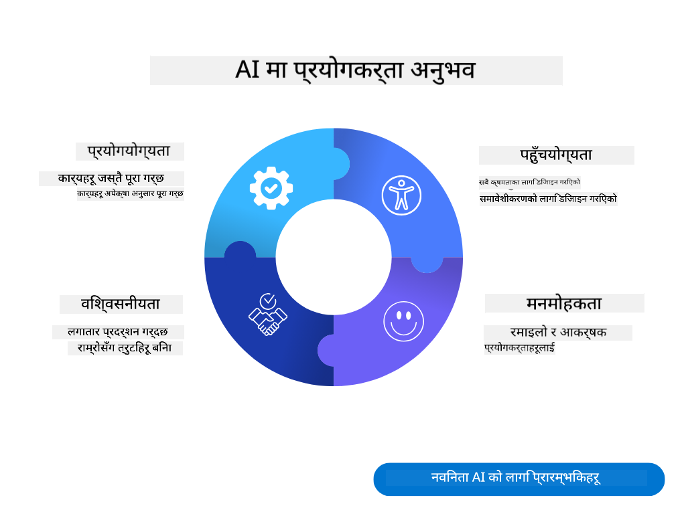
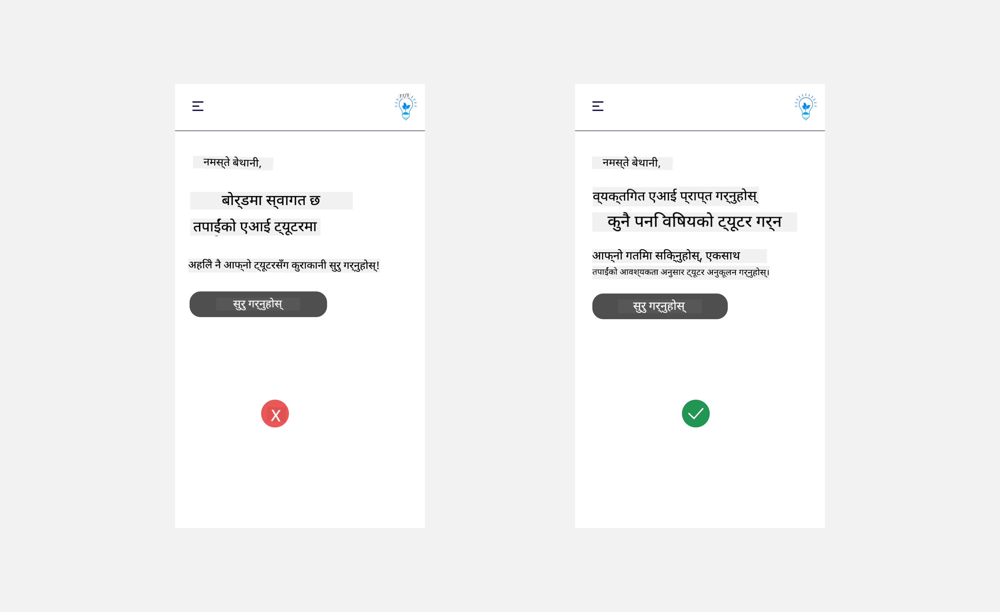
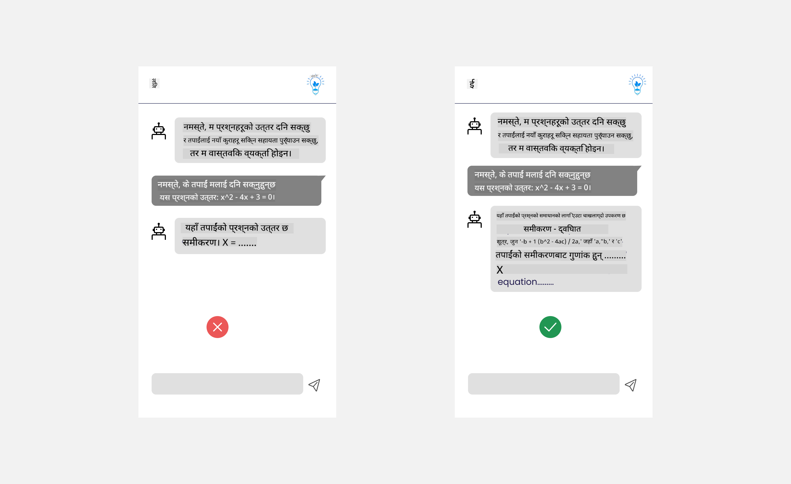
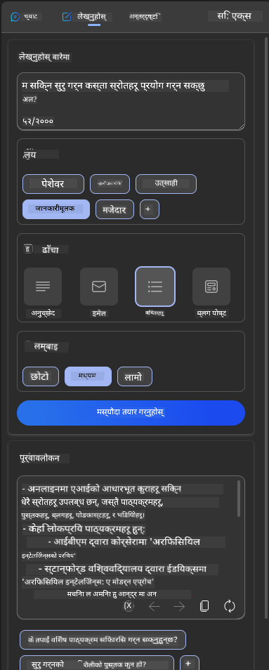
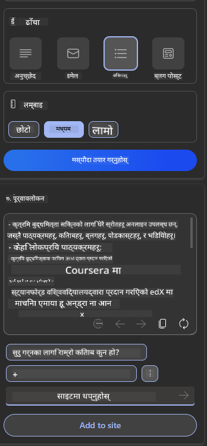
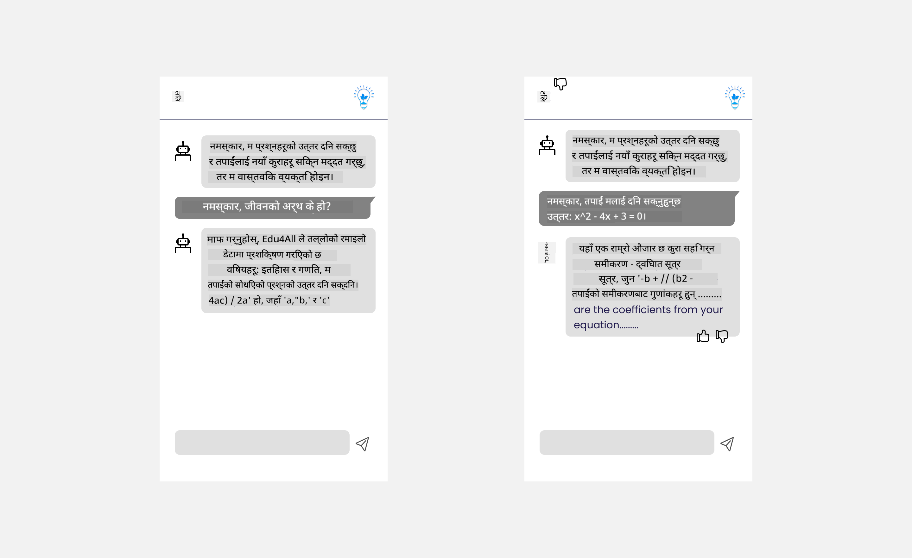

<!--
CO_OP_TRANSLATOR_METADATA:
{
  "original_hash": "ec385b41ee50579025d50cc03bfb3a25",
  "translation_date": "2025-06-25T20:17:39+00:00",
  "source_file": "12-designing-ux-for-ai-applications/README.md",
  "language_code": "ne"
}
-->
# एआई अनुप्रयोगहरूको लागि UX डिजाइन

> _(यो पाठको भिडियो हेर्न माथिको चित्रमा क्लिक गर्नुहोस्)_

प्रयोगकर्ता अनुभव एप्स निर्माण गर्दा एक अत्यन्त महत्त्वपूर्ण पक्ष हो। प्रयोगकर्ताहरूले तपाईंको एप्सलाई कार्यहरू कुशलतापूर्वक गर्न प्रयोग गर्न सक्नुपर्छ। कुशल हुनु एक कुरा हो तर तपाईंले एप्सलाई सबैले प्रयोग गर्न सक्ने बनाउन पनि डिजाइन गर्नुपर्छ, जसले तिनीहरूलाई _उपलब्ध_ बनाउँछ। यो अध्यायले यस क्षेत्रमा ध्यान केन्द्रित गर्नेछ ताकि तपाईंले अन्ततः एक यस्तो एप्स डिजाइन गर्नुहोस् जुन मानिसहरूले प्रयोग गर्न सकून् र चाहून्।

## परिचय

प्रयोगकर्ता अनुभव भनेको प्रयोगकर्ताले एक विशेष उत्पादन वा सेवा, चाहे सिस्टम, उपकरण, वा डिजाइनसँग कसरी अन्तरक्रिया गर्छ र प्रयोग गर्छ भन्ने हो। एआई अनुप्रयोगहरू विकास गर्दा, विकासकर्ताहरूले प्रयोगकर्ता अनुभव प्रभावकारी मात्र नभई नैतिक पनि सुनिश्चित गर्न ध्यान दिन्छन्। यस पाठमा, हामी प्रयोगकर्ता आवश्यकताहरू सम्बोधन गर्ने कृत्रिम बुद्धिमत्ता (एआई) अनुप्रयोगहरू कसरी निर्माण गर्ने भन्ने कभर गर्छौं।

पाठले निम्न क्षेत्रहरू समेट्नेछ:

- प्रयोगकर्ता अनुभवको परिचय र प्रयोगकर्ता आवश्यकताहरूको समझ
- विश्वास र पारदर्शिताका लागि एआई अनुप्रयोगहरू डिजाइन गर्दै
- सहकार्य र प्रतिक्रिया लागि एआई अनुप्रयोगहरू डिजाइन गर्दै

## सिकाइ लक्ष्यहरू

यो पाठ लिएको पछि, तपाईं सक्षम हुनुहुनेछ:

- प्रयोगकर्ता आवश्यकताहरू पूरा गर्ने एआई अनुप्रयोगहरू कसरी निर्माण गर्ने बुझ्न।
- विश्वास र सहकार्यलाई प्रोत्साहित गर्ने एआई अनुप्रयोगहरू डिजाइन गर्न।

### पूर्व शर्त

केही समय लिई [प्रयोगकर्ता अनुभव र डिजाइन सोच](https://learn.microsoft.com/training/modules/ux-design?WT.mc_id=academic-105485-koreyst)बारे थप पढ्नुहोस्।

## प्रयोगकर्ता अनुभवको परिचय र प्रयोगकर्ता आवश्यकताहरूको समझ

हाम्रो काल्पनिक शिक्षा स्टार्टअपमा, हामीसँग दुई प्राथमिक प्रयोगकर्ताहरू छन्, शिक्षक र विद्यार्थी। प्रत्येक प्रयोगकर्ताको अद्वितीय आवश्यकताहरू छन्। प्रयोगकर्ता-केंद्रित डिजाइनले प्रयोगकर्तालाई प्राथमिकता दिन्छ, उत्पादनहरू उनीहरूको लागि सान्दर्भिक र लाभदायक सुनिश्चित गर्दै।

अनुप्रयोगले राम्रो प्रयोगकर्ता अनुभव प्रदान गर्न **उपयोगी, विश्वसनीय, पहुँचयोग्य र रमणीय** हुनुपर्छ।

### प्रयोगयोग्यता

उपयोगी हुनु भनेको अनुप्रयोगको कार्यक्षमता यसको उद्देश्य मिल्नुपर्छ, जस्तै ग्रेडिङ प्रक्रिया स्वचालित गर्नु वा पुनरावलोकनको लागि फ्ल्यासकार्डहरू उत्पन्न गर्नु। ग्रेडिङ प्रक्रिया स्वचालित गर्ने अनुप्रयोगले पूर्वनिर्धारित मापदण्डको आधारमा विद्यार्थीहरूको कार्यलाई सही र कुशलतापूर्वक अंक दिन सक्षम हुनुपर्छ। यसैगरी, पुनरावलोकन फ्ल्यासकार्डहरू उत्पन्न गर्ने अनुप्रयोगले आफ्नो डाटाको आधारमा सान्दर्भिक र विविध प्रश्नहरू सिर्जना गर्न सक्षम हुनुपर्छ।

### विश्वसनीयता

विश्वसनीय हुनु भनेको अनुप्रयोगले आफ्नो कार्य निरन्तर र त्रुटिबिना प्रदर्शन गर्न सक्षम हुनु हो। यद्यपि, एआई पनि मानिसहरू जस्तै पूर्ण छैन र त्रुटिहरूको लागि प्रवृत्त हुन सक्छ। अनुप्रयोगहरूले त्रुटिहरू वा अप्रत्याशित परिस्थितिहरू सामना गर्न सक्छन् जसले मानव हस्तक्षेप वा सुधार आवश्यक हुन्छ। तपाईं कसरी त्रुटिहरूलाई व्यवस्थापन गर्नुहुन्छ? यस पाठको अन्तिम खण्डमा, हामी सहकार्य र प्रतिक्रियाको लागि एआई प्रणालीहरू र अनुप्रयोगहरू कसरी डिजाइन गरिन्छ भन्ने कभर गर्नेछौं।

### पहुँचयोग्यता

पहुंचयोग्य हुनु भनेको विभिन्न क्षमताहरू भएका प्रयोगकर्ताहरूलाई, अपाङ्गता भएका व्यक्तिहरू सहित, कुनै पनि छुट्न नदिई प्रयोगकर्ता अनुभव विस्तार गर्नु हो। पहुँचयोग्यता दिशानिर्देशहरू र सिद्धान्तहरू पालना गरेर, एआई समाधानहरू सबै प्रयोगकर्ताहरूको लागि बढी समावेशी, प्रयोगयोग्य र लाभदायक बन्छ।

### रमणीय

रमणीय हुनु भनेको अनुप्रयोग प्रयोग गर्न रमाइलो हुनु हो। आकर्षक प्रयोगकर्ता अनुभवले प्रयोगकर्तामा सकारात्मक प्रभाव पार्न सक्छ, उनलाई अनुप्रयोगमा फर्कन प्रोत्साहित गर्दै र व्यवसाय राजस्व बढाउँदै।

हरेक चुनौतीलाई एआईले समाधान गर्न सक्दैन। एआई तपाईंको प्रयोगकर्ता अनुभवलाई बढाउन आउँछ, चाहे म्यानुअल कार्यहरू स्वचालित गर्ने होस्, वा प्रयोगकर्ता अनुभवहरूलाई व्यक्तिगत बनाउने होस्।

## विश्वास र पारदर्शिताका लागि एआई अनुप्रयोगहरू डिजाइन गर्दै

एआई अनुप्रयोगहरू डिजाइन गर्दा विश्वास निर्माण गर्नु महत्त्वपूर्ण हुन्छ। विश्वासले प्रयोगकर्तालाई यो विश्वास दिलाउँछ कि अनुप्रयोगले काम सम्पन्न गर्नेछ, परिणामहरू निरन्तर रूपमा दिनेछ र परिणामहरू प्रयोगकर्ताले चाहेको हुनेछ। यस क्षेत्रमा एक जोखिम अविश्वास र अतिविश्वास हो। अविश्वास तब हुन्छ जब प्रयोगकर्ताले एआई प्रणालीमा थोरै वा कुनै विश्वास राख्दैन, यसले तपाईंको अनुप्रयोगलाई अस्वीकार गर्न प्रयोगकर्तालाई नेतृत्व गर्छ। अतिविश्वास तब हुन्छ जब प्रयोगकर्ताले एआई प्रणालीको क्षमतालाई अधिक अनुमान गर्छ, प्रयोगकर्ताहरूलाई एआई प्रणालीलाई धेरै विश्वास गर्ने बनाउँछ। उदाहरणको लागि, ग्रेडिङ प्रणालीमा अतिविश्वासको अवस्थामा शिक्षकले केही कागजातहरूलाई प्रमाणित नगरी ग्रेडिङ प्रणालीले राम्रोसँग काम गर्ने सुनिश्चित गर्न सक्छ। यसले विद्यार्थीहरूको लागि अन्यायपूर्ण वा गलत ग्रेडहरू, वा प्रतिक्रिया र सुधारका अवसरहरू गुमाउन सक्छ।

विश्वासलाई डिजाइनको केन्द्रमा राख्न दुई तरिकाहरू स्पष्टीकरणता र नियन्त्रण हुन्।

### स्पष्टीकरणता

जब एआईले भविष्यका पुस्तालाई ज्ञान प्रदान गर्ने निर्णयहरूमा सहयोग गर्छ, शिक्षक र अभिभावकहरूले एआई निर्णयहरू कसरी बनाइन्छ भन्ने बुझ्न महत्त्वपूर्ण हुन्छ। यो स्पष्टीकरणता हो - एआई अनुप्रयोगहरूले निर्णयहरू कसरी बनाउँछन् भन्ने बुझ्न। स्पष्टीकरणको लागि डिजाइन गर्दा एआई अनुप्रयोगले के गर्न सक्छ भन्ने उदाहरणहरूको विवरण थप्न समावेश हुन्छ। उदाहरणको लागि, "एआई शिक्षकसँग सुरु गर्नुहोस्"को सट्टा, प्रणालीले प्रयोग गर्न सक्छ: "पुनरावलोकनलाई सजिलो बनाउन तपाईंको नोट्सलाई एआई प्रयोग गरेर संक्षेप गर्नुहोस्।"

एआईले प्रयोगकर्ता र व्यक्तिगत डाटालाई कसरी प्रयोग गर्छ भन्ने अर्को उदाहरण हो। उदाहरणको लागि, विद्यार्थी व्यक्तित्व भएका प्रयोगकर्तासँग उनीहरूको व्यक्तित्वको आधारमा सीमाहरू हुन सक्छ। एआईले प्रश्नहरूको उत्तर प्रकट गर्न सक्षम नहुन सक्छ तर प्रयोगकर्तालाई समस्या कसरी समाधान गर्न सकिन्छ भन्ने सोच्न मार्गदर्शन गर्न सक्छ।

स्पष्टीकरणताको अन्तिम महत्त्वपूर्ण भाग स्पष्टीकरणहरूको सरलीकरण हो। विद्यार्थी र शिक्षकहरू एआई विशेषज्ञ नहुन सक्छन्, त्यसैले अनुप्रयोगले के गर्न सक्छ वा सक्दैन भन्ने स्पष्टीकरणहरू सरल र बुझ्न सजिलो हुनुपर्छ।

### नियन्त्रण

जनरेटिव एआईले एआई र प्रयोगकर्ताबीच सहकार्य सिर्जना गर्छ, जहाँ उदाहरणका लागि प्रयोगकर्ताले विभिन्न परिणामहरूको लागि प्रॉम्प्टहरू संशोधन गर्न सक्छ। साथै, एक पटक आउटपुट उत्पन्न भएपछि, प्रयोगकर्ताहरूले परिणामहरू संशोधित गर्न सक्षम हुनुपर्छ, तिनीहरूलाई नियन्त्रणको भावना दिँदै। उदाहरणको लागि, Bing प्रयोग गर्दा, तपाईं आफ्नो प्रॉम्प्टलाई ढाँचा, स्वर र लम्बाइको आधारमा अनुकूलित गर्न सक्नुहुन्छ। साथै, तपाईं आफ्नो आउटपुटमा परिवर्तनहरू थप्न र आउटपुटलाई तल देखाइएअनुसार संशोधित गर्न सक्नुहुन्छ:

Bingमा प्रयोगकर्तालाई अनुप्रयोगमा नियन्त्रण दिन अनुमति दिने अर्को सुविधा भनेको एआईले प्रयोग गर्ने डाटामा सामेल हुने र बहिष्कृत हुने क्षमता हो। विद्यालय अनुप्रयोगको लागि, विद्यार्थीले आफ्नो नोट्स र शिक्षकको स्रोतहरूलाई पुनरावलोकन सामग्रीको रूपमा प्रयोग गर्न चाहन सक्छ।

> एआई अनुप्रयोगहरू डिजाइन गर्दा, यसको क्षमताहरूको अवास्तविक अपेक्षाहरू सेट नगरी प्रयोगकर्ताहरूले अतिविश्वास नगर्ने सुनिश्चित गर्न उद्देश्यपूर्णता महत्त्वपूर्ण छ। यो गर्नको एक तरिका भनेको प्रॉम्प्टहरू र परिणामहरू बीच घर्षण सिर्जना गर्नु हो। प्रयोगकर्तालाई सम्झाउँदै, यो एआई हो र साथी मानव होइन

## सहकार्य र प्रतिक्रियाको लागि एआई अनुप्रयोगहरू डिजाइन गर्दै

पहिले उल्लेख गरिए अनुसार, जनरेटिव एआईले प्रयोगकर्ता र एआईबीच सहकार्य सिर्जना गर्छ। अधिकांश संलग्नताहरू एक प्रयोगकर्ताले प्रॉम्प्ट इनपुट गर्ने र एआईले आउटपुट उत्पन्न गर्ने साथ हुन्छ। यदि आउटपुट गलत छ भने के हुन्छ? त्रुटिहरू भएमा अनुप्रयोगले कसरी व्यवस्थापन गर्छ? के एआईले प्रयोगकर्तालाई दोष दिन्छ वा त्रुटिलाई स्पष्ट गर्न समय लिन्छ?

एआई अनुप्रयोगहरू प्रतिक्रिया प्राप्त गर्न र दिन निर्माण गर्नुपर्छ। यसले एआई प्रणालीलाई सुधार गर्न मात्र मद्दत गर्दैन तर प्रयोगकर्ताहरूसँग विश्वास पनि निर्माण गर्छ। प्रतिक्रिया लूपलाई डिजाइनमा समावेश गर्नुपर्छ, उदाहरणको लागि आउटपुटमा एक साधारण थम्स अप वा डाउन हुन सक्छ।

यसलाई व्यवस्थापन गर्ने अर्को तरिका भनेको प्रणालीको क्षमताहरू र सीमाहरू स्पष्ट रूपमा संचार गर्नु हो। जब प्रयोगकर्ताले एआई क्षमताहरू भन्दा परको केही अनुरोध गर्दा त्रुटि गर्छ, यो व्यवस्थापन गर्ने तरिका पनि हुनुपर्छ, तल देखाइए अनुसार।

अनुप्रयोगहरूसँग प्रणाली त्रुटिहरू सामान्य छन् जहाँ प्रयोगकर्ताले एआईको दायरा बाहिरको जानकारीको साथ सहयोग आवश्यक हुन सक्छ वा अनुप्रयोगले प्रयोगकर्ताले सारांश उत्पन्न गर्न सक्ने प्रश्नहरू/विषयहरूको सीमा हुन सक्छ। उदाहरणको लागि, इतिहास र गणितमा सीमित विषयहरूको डाटामा प्रशिक्षित एआई अनुप्रयोगले भूगोलको वरिपरि प्रश्नहरू व्यवस्थापन गर्न सक्षम नहुन सक्छ। यसलाई कम गर्न, एआई प्रणालीले यस्तो प्रतिक्रिया दिन सक्छ: "माफ गर्नुहोस्, हाम्रो उत्पादनलाई निम्न विषयहरूमा डाटाको साथ प्रशिक्षित गरिएको छ....., म तपाईंले सोधेको प्रश्नको उत्तर दिन सक्षम छैन।"

एआई अनुप्रयोगहरू पूर्ण छैनन्, त्यसैले तिनीहरू गल्ती गर्न बाध्य छन्। तपाईंको अनुप्रयोगहरू डिजाइन गर्दा, तपाईंले प्रयोगकर्ताहरूबाट प्रतिक्रिया र त्रुटि व्यवस्थापनको लागि ठाउँ सिर्जना गर्न सुनिश्चित गर्नुपर्छ जसले सरल र सजिलैसँग बुझ्न योग्य हो।

## असाइनमेन्ट

तपाईंले अहिलेसम्म निर्माण गरेका कुनै पनि एआई एप्सलाई लिनुहोस्, तपाईंको एप्समा तलका चरणहरू कार्यान्वयन गर्ने विचार गर्नुहोस्:

- **रमणीय:** तपाईं आफ्नो एप्सलाई कसरी अधिक रमणीय बनाउन सक्नुहुन्छ भन्ने विचार गर्नुहोस्। के तपाईं हरेक ठाउँमा स्पष्टीकरणहरू थप्दै हुनुहुन्छ? के तपाईं प्रयोगकर्तालाई अन्वेषण गर्न प्रोत्साहित गर्दै हुनुहुन्छ? तपाईंको त्रुटि सन्देशहरूलाई कसरी शब्द गर्दै हुनुहुन्छ?

- **प्रयोगयोग्यता:** वेब एप्स निर्माण गर्दै। सुनिश्चित गर्नुहोस् कि तपाईंको एप्सलाई माउस र किबोर्ड दुवैद्वारा नेभिगेट गर्न सकिन्छ।

- **विश्वास र पारदर्शिता:** एआईलाई पूर्ण रूपमा र यसको आउटपुटलाई विश्वास नगर्नुहोस्, प्रक्रियामा आउटपुटलाई प्रमाणित गर्न मानवलाई कसरी थप्ने विचार गर्नुहोस्। विश्वास र पारदर्शिता हासिल गर्न अन्य तरिकाहरू विचार गर्नुहोस् र कार्यान्वयन गर्नुहोस्।

- **नियन्त्रण:** प्रयोगकर्तालाई उनीहरूले अनुप्रयोगलाई प्रदान गर्ने डाटाको नियन्त्रण दिनुहोस्। एआई अनुप्रयोगमा डाटा सङ्कलनमा सामेल हुने र बहिष्कृत हुने तरिका कार्यान्वयन गर्नुहोस्।

## आफ्नो सिकाइ जारी राख्नुहोस्!

यो पाठ पूरा गरेपछि, हाम्रो [जनरेटिव एआई सिकाइ संग्रह](https://aka.ms/genai-collection?WT.mc_id=academic-105485-koreyst) जाँच गर्नुहोस् ताकि तपाईंको जनरेटिव एआई ज्ञानलाई स्तरवृद्धि गर्न जारी राख्न सक्नुहोस्!

पाठ १३मा जानुहोस्, जहाँ हामी [एआई अनुप्रयोगहरूलाई सुरक्षित गर्ने](../13-securing-ai-applications/README.md?WT.mc_id=academic-105485-koreyst) कसरी हेर्नेछौं!

**अस्वीकरण**:  
यो दस्तावेज AI अनुवाद सेवा [Co-op Translator](https://github.com/Azure/co-op-translator) प्रयोग गरी अनुवाद गरिएको हो। हामी शुद्धताको लागि प्रयास गर्छौं, तर कृपया थाहा पाउनुहोस् कि स्वचालित अनुवादहरूमा त्रुटिहरू वा अशुद्धताहरू हुन सक्छ। यसको मौलिक भाषामा रहेको मूल दस्तावेजलाई आधिकारिक स्रोत मानिनुपर्छ। महत्वपूर्ण जानकारीको लागि, पेशेवर मानव अनुवाद सिफारिस गरिन्छ। यस अनुवादको प्रयोगबाट उत्पन्न हुने कुनै पनि गलतफहमी वा गलत व्याख्याको लागि हामी जिम्मेवार हुने छैनौं।