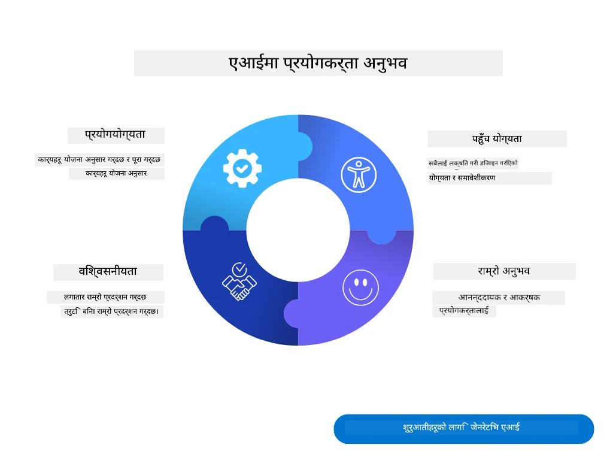
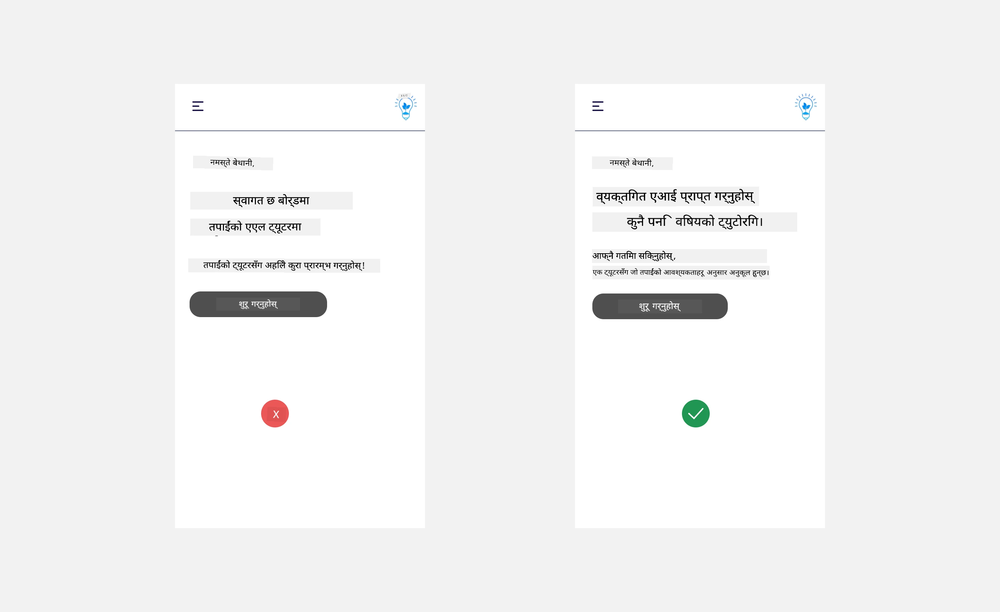
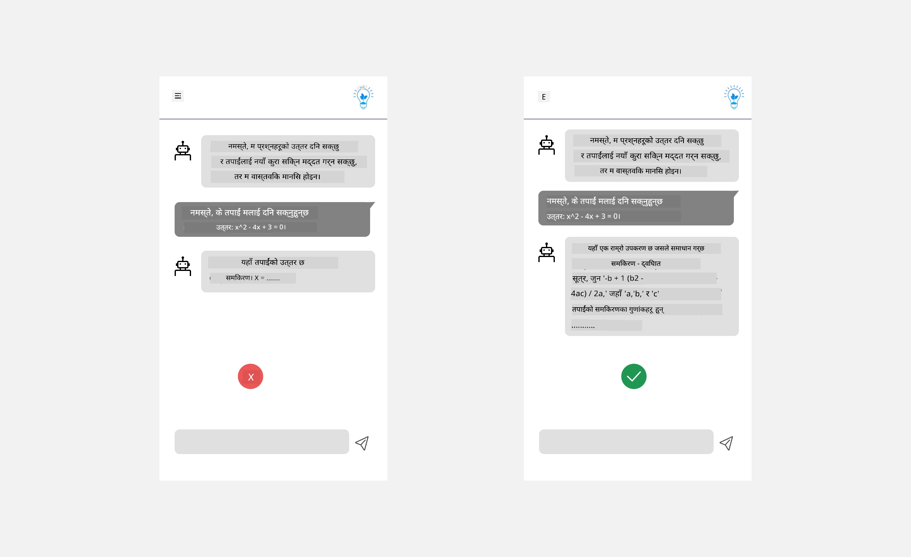
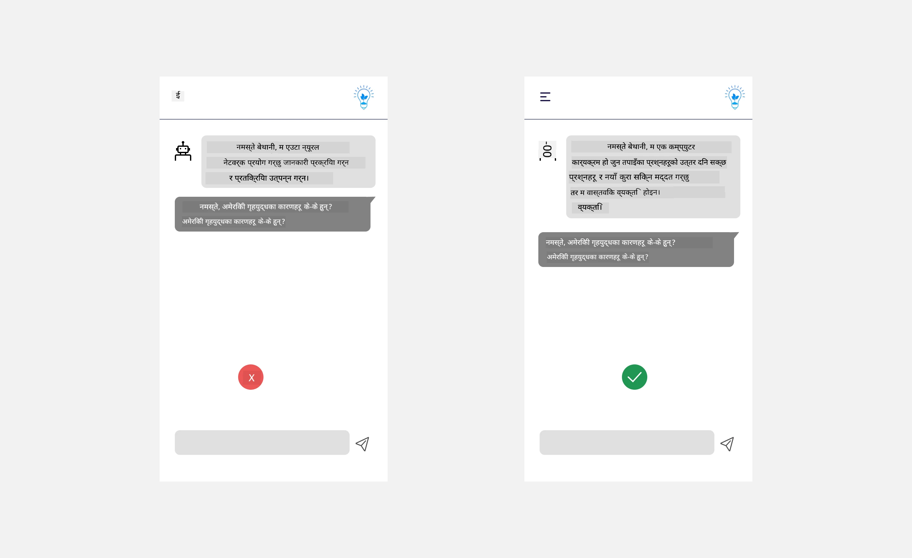
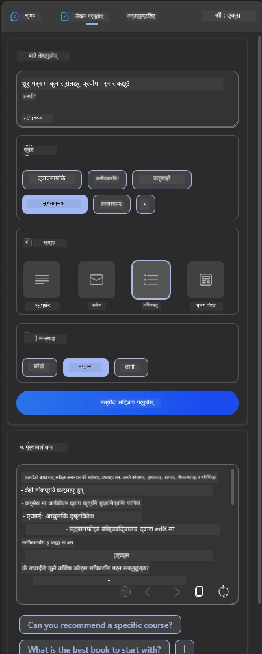
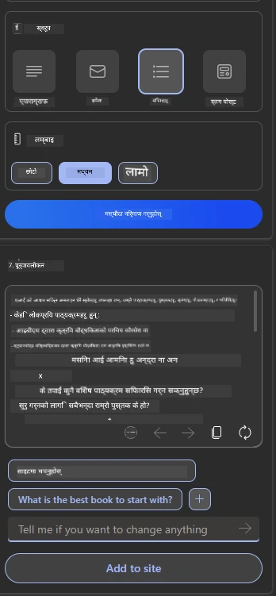
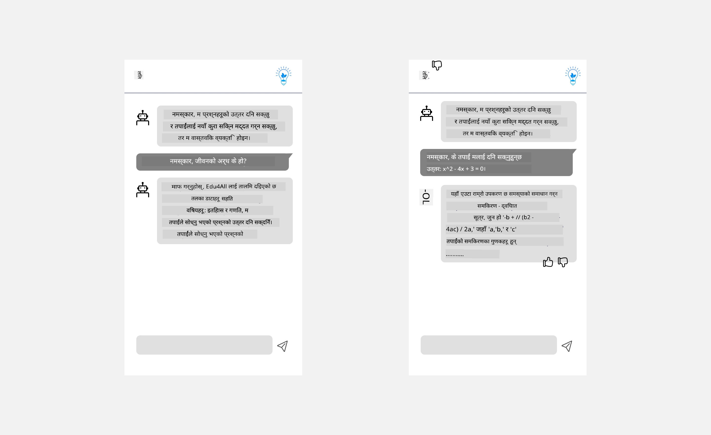

# AI अनुप्रयोगहरूको लागि UX डिजाइन गर्दै

> _(यो पाठको भिडियो हेर्न माथिको छवि क्लिक गर्नुहोस्)_

प्रयोगकर्ता अनुभव अनुप्रयोगहरू निर्माण गर्दा एक अत्यन्त महत्त्वपूर्ण पक्ष हो। प्रयोगकर्ताहरूले तपाईंको अनुप्रयोगलाई कुशलतापूर्वक कार्यहरू गर्न सक्षम हुनुपर्छ। कुशल हुनु एक कुरा हो तर तपाईंले अनुप्रयोगहरू यस्तो डिजाइन गर्नुपर्छ जसले सबैले प्रयोग गर्न सकून्, ताकि तिनीहरू _सुगम_ बनून्। यो अध्याय यस क्षेत्रमा केन्द्रित हुनेछ ताकि तपाईं इच्छित र प्रयोगकर्ताले प्रयोग गर्ने अनुप्रयोग डिजाइन गर्न सक्नुहोस्।

## परिचय

प्रयोगकर्ता अनुभव भनेको प्रयोगकर्ताले कुनै विशेष उत्पादन वा सेवा जस्तै प्रणाली, उपकरण वा डिजाइनसँग कसरी अन्तरक्रिया गर्छ र प्रयोग गर्छ भन्ने हो। AI अनुप्रयोगहरू विकास गर्दा, विकासकर्ता मात्र प्रयोगकर्ता अनुभव प्रभावकारी बनाउने ध्यान दिनुको साथै नैतिक पनि हुनु आवश्यक छ। यस पाठमा, हामी प्रयोगकर्ताको आवश्यकतालाई सम्बोधन गर्ने कृत्रिम बुद्धिमत्ता (AI) अनुप्रयोगहरू कसरी निर्माण गर्ने भनेर चर्चा गर्नेछौं।

यो पाठमा तलका क्षेत्रहरू समेटिनेछन्:

- प्रयोगकर्ता अनुभव र प्रयोगकर्ता आवश्यकताहरूको परिचय
- विश्वास र पारदर्शिताका लागि AI अनुप्रयोगहरू डिजाइन गर्दै
- सहकार्य र फिडब्याकका लागि AI अनुप्रयोगहरू डिजाइन गर्दै

## सिकाइ लक्ष्यहरू

यो पाठ पछि, तपाईं सक्षम हुनुहुनेछ:

- प्रयोगकर्ताको आवश्यकताहरू पूरा गर्ने AI अनुप्रयोगहरू निर्माण कसरी गर्ने बुझ्न।
- विश्वास र सहकार्य प्रवर्द्धन गर्ने AI अनुप्रयोगहरू डिजाइन गर्ने।

### पूर्व आवश्यकताहरू

केही समय लगाएर [प्रयोगकर्ता अनुभव र डिजाइन सोच्न](https://learn.microsoft.com/training/modules/ux-design?WT.mc_id=academic-105485-koreyst) सम्बन्धी थप पढ्नुहोस्।

## प्रयोगकर्ता अनुभवको परिचय र प्रयोगकर्ता आवश्यकताहरू बुझ्ने

हाम्रो कल्पित शिक्षा स्टार्टअपमा, हामीसँग दुई प्रमुख प्रयोगकर्ताहरू छन्: शिक्षक र विद्यार्थी। यी दुई प्रयोगकर्ताहरूका फरक फरक आवश्यकताहरू छन्। प्रयोगकर्ता केन्द्रित डिजाइनले प्रयोगकर्तालाई प्राथमिकता दिन्छ जसले सुनिश्चित गर्छ कि उत्पादनहरू लक्षित प्रयोगकर्ताका लागि सान्दर्भिक र लाभदायक छन्।

अनुप्रयोगले **उपयोगी, भरोसायोग्य, सुलभ र रमाइलो** हुनुपर्छ राम्रो प्रयोगकर्ता अनुभव प्रदान गर्नका लागि।

### प्रयोगयोग्यता

उपयोगी हुनु भनेको अनुप्रयोगको कार्यक्षमता यसको अभिप्रेत उद्देश्यसँग मेल खानु हो, जस्तै ग्रेडिङ प्रक्रिया स्वचालित गर्नु वा पुनरावृत्तिका लागि फ्ल्याशकार्डहरू उत्पादन गर्नु। ग्रेडिङ प्रक्रिया स्वचालित गर्ने अनुप्रयोगले पूर्वनिर्धारित मापदण्डहरू आधारमा विद्यार्थीको काममा सही र कुशल अंक प्रदान गर्न सक्षम हुनुपर्छ। त्यसैगरी, पुनरावृत्ति फ्ल्याशकार्ड उत्पादन गर्ने अनुप्रयोगले यसको डाटाका आधारमा सान्दर्भिक र विविध प्रश्नहरू सिर्जना गर्न सक्षम हुनुपर्छ।

### भरोसायोग्य हुनु

भरोसायोग्य हुनु भनेको अनुप्रयोगले आफ्नो काम लगातार र त्रुटिरहित रूपमा गर्न सक्नु हो। यद्यपि, AI पनि मानिसझैँ पूर्ण हुँदैन र त्रुटिहरू हुन सक्छ। अनुप्रयोगहरूले त्रुटि वा अनपेक्षित अवस्थामा मानिसको हस्तक्षेप वा सुधार आवश्यक पर्न सक्छ। तपाईं कसरी त्रुटि सम्हाल्नुहुन्छ? यस पाठको अन्त्यमा हामी सहकार्य र फिडब्याकका लागि AI प्रणाली र अनुप्रयोगहरू कसरी डिजाइन गरिएको छ भनी छलफल गर्नेछौं।

### सुलभता

सुलभ हुनु भनेको विभिन्न क्षमताका प्रयोगकर्तासम्म प्रयोगकर्ता अनुभव विस्तार गर्नु हो, जसमा अपाङ्गता भएका प्रयोगकर्ताहरू पनि समावेश छन्, जसले कसैले पनि बाहिर नछुटोस् भनेर सुनिश्चित गर्दछ। पहुँच सम्बन्धी मार्गनिर्देशन र सिद्धान्तहरू पालना गरेर, AI समाधानहरू सबै प्रयोगकर्ताका लागि थप समावेशी, प्रयोगयोग्य र लाभदायक हुन्छन्।

### रमाइलो हुनु

रमाइलो हुनुको अर्थ अनुप्रयोग प्रयोग गर्न रमाइलो हुनु हो। आकर्षक प्रयोगकर्ता अनुभवले प्रयोगकर्तामा सकारात्मक प्रभाव पार्न सक्छ, जसले उनीहरूलाई अनुप्रयोगमा पुनः फर्कन उत्प्रेरित गर्दछ र व्यापार आम्दानी बढाउँछ।

सबै चुनौतीहरू AI ले समाधान गर्न सक्दैन। AI ले तपाईंको प्रयोगकर्ता अनुभवलाई सकारात्मक बनाउन सहयोग गर्छ, जस्तै म्यानुअल कार्य स्वचालित बनाउने वा प्रयोगकर्ता अनुभवलाई निजीकृत गर्ने।

## विश्वास र पारदर्शिताका लागि AI अनुप्रयोगहरू डिजाइन गर्दै

विश्वास निर्माण गर्नु AI अनुप्रयोग डिजाइन गर्दा अत्यन्त आवश्यक छ। विश्वासले प्रयोगकर्तालाई विश्वास दिलाउँछ कि अनुप्रयोग कार्य पूरा गर्नेछ, परिणाम स्थिरता साथ प्रदान गर्नेछ र परिणाम प्रयोगकर्ताले चाहेको हो। यस क्षेत्रमा जोखिमहरू हुन् अविश्वास र बढी विश्वास। अविश्वास तब हुन्छ जब प्रयोगकर्ताको AI प्रणालीमा कम वा कुनै विश्वास हुँदैन, जसले अनुप्रयोग अस्वीकृत गर्ने गर्छ। बढी विश्वास तब हुन्छ जब प्रयोगकर्ताले AI प्रणालीको क्षमता बढी अनुमान गर्छ, जसले AI प्रणालीमा धेरै विश्वास गर्छ। उदाहरणका लागि, स्वचालित ग्रेडिङ प्रणालीको अधिक विश्वासले शिक्षकलाई केही कागजातहरू जाँच नगर्न सक्छ जुन सिस्टम ठीक काम गर्छ कि गर्दैन भनि सुनिश्चित गर्न। यसले विद्यार्थीहरूलाई अन्यायपूर्ण वा गलत ग्रेड दिन सक्छ, वा फिडब्याक र सुधारका अवसरहरू छुट्न सक्छ।

डिजाइनको केन्द्रमा विश्वास राख्न दुई तरिका छन्: व्याख्यात्मकता र नियन्त्रण।

### व्याख्यात्मकता

जब AI ले निर्णयहरू जानकारी दिन मद्दत गर्छ जस्तै भविष्यका पुस्तालाई ज्ञान प्रदान गर्नु, शिक्षक र अभिभावकहरूले कसरी AI निर्णयहरू लिन्छ भन्ने बुझ्न आवश्यक हुन्छ। यसलाई व्याख्यात्मकता भनिन्छ - AI अनुप्रयोगहरूले कसरी निर्णय लिन्छन् भन्ने बुझाइ। व्याख्यात्मकताका लागि डिजाइन गर्दा AI कसरी परिणाममा पुगेको हो भनी विवरण थपिन्छ। दर्शकहरूले यो बुझ्नु पर्छ कि परिणाम AI ले उत्पन्न गरेको हो, मानिसले होइन। उदाहरणका लागि, "अबै तपाईंको ट्यूटरसँग कुरा सुरु गर्नुहोस्" भन्ने साटो "तपाईंको आवश्यकताहरू अनुसार अनुकूल AI ट्यूटर प्रयोग गर्नुहोस् जसले तपाईंलाई तपाईंको गतिमा सिक्न मद्दत गर्छ" भन्न सकिन्छ।

अर्को उदाहरण हो AI ले प्रयोगकर्ता र व्यक्तिगत डाटा कसरी प्रयोग गर्छ। उदाहरणका लागि, विद्यार्थी पात्र भएको प्रयोगकर्ताको सीमितताहरू हुन सक्छन्। AI प्रश्नहरूको जवाफ खुलाउन सक्दैन तर प्रयोगकर्तालाई समस्या कसरी समाधान गर्ने सोच्न मार्गदर्शन गर्न सक्छ।

व्याख्यात्मकताको अन्तिम मुख्य भाग हो व्याख्याहरूलाई सरल बनाउनु। विद्यार्थी र शिक्षकहरू AI विशेषज्ञ नहुन सक्छन्, त्यसैले अनुप्रयोग के गर्न र के गर्न नसक्ने कुरा सरल र बुझ्न सजिलो हुनुपर्दछ।

### नियन्त्रण

जनरेटिभ AI ले AI र प्रयोगकर्ताबीच सहकार्य सिर्जना गर्छ, जहाँ प्रयोगकर्ताले विभिन्न परिणामका लागि प्रम्प्ट संशोधन गर्न सक्छ। साथै, परिणाम उत्पन्न भएपछि प्रयोगकर्ताले परिणामलाई संशोधित गर्ने विकल्प पाउनु पर्छ जसले नियन्त्रणको अनुभव दिन्छ। उदाहरणका लागि, Microsoft Copilot (पहिले Bing Chat) प्रयोग गर्दा, तपाईंले आफ्नो प्रम्प्ट स्वरूप, लय र लम्बाइका आधारमा परिमार्जन गर्न सक्नुहुन्छ। साथै, तपाईंले आफ्नो परिणाममा परिवर्तन थप्न र परिणाम संशोधित गर्न सक्नुहुन्छ जस्तै तल देखाइएको छ:

Microsoft Copilot मा अर्को सुविधा जुन प्रयोगकर्तालाई अनुप्रयोगमा नियन्त्रण दिन्छ भनेको AI ले प्रयोग गर्ने डाटामा सहभागी हुन वा नहुने विकल्प हो। स्कूल अनुप्रयोगका लागि, विद्यार्थीले आफ्नो नोटहरू साथै शिक्षकका स्रोतहरू पुनरावृत्तिका सामग्रीको रूपमा प्रयोग गर्न चाहन सक्छ।

> AI अनुप्रयोग डिजाइन गर्दा, प्रयोगकर्ताहरूले यसको क्षमता माथि अत्यधिक विश्वास नगर्न सुनिश्चित गर्ने हेतुले意, प्रयोगकर्तालाई यो AI हो र कुनै साथी मानिस होइन भनेर सम्झाउने गरि प्रम्प्ट र परिणामबीच घर्षण सिर्जना गर्नुपर्छ।

## सहकार्य र फिडब्याकका लागि AI अनुप्रयोगहरू डिजाइन गर्दै

पहिले भनिएझैं, जनरेटिभ AI प्रयोगकर्ता र AI बीच सहकार्य सिर्जना गर्छ। अधिकांश अन्तरक्रियाहरूमा प्रयोगकर्ताले प्रम्प्ट दिन्छ र AI ले परिणाम उत्पादन गर्छ। यदि परिणाम गलत छ भने के हुन्छ? अनुप्रयोगले त्रुटिहरू कसरी सम्हाल्छ? के AI प्रयोगकर्तालाई दोष दिन्छ वा त्रुटि व्याख्या गर्न समय लिन्छ?

AI अनुप्रयोगहरूले फिडब्याक लिन र दिन निर्माण गर्नुपर्छ। यसले AI प्रणाली सुधार गर्न मात्र होइन, प्रयोगकर्तासँग विश्वास पनि निर्माण गर्छ। डिजाइनमा फिडब्याक लूप समावेश हुनुपर्छ, जस्तै परिणाममा सरल थम्ब्स अप वा डाउन।

अर्को तरिका हो प्रणालीका क्षमता र सीमाहरू स्पष्ट रूपमा सञ्चार गर्नु। प्रयोगकर्ताले AI क्षमताभन्दा बाहिर केही माग्दा, यसलाई कसरी सम्हालिन्छ भनी थप उपाय हुनु पर्दछ, तल देखाइएको जस्तै।

प्रणाली त्रुटिहरू सामान्य छन् जहाँ प्रयोगकर्तालाई AI को क्षेत्र सन्दर्भ बाहिरको जानकारी सहयोग चाहिन्छ वा अनुप्रयोगले प्रयोगकर्ताले सिर्जना गर्न सक्ने प्रश्न/विषयहरूको संख्या सीमित छ। उदाहरणका लागि, इतिहास र गणितजस्ता सीमित विषयहरूमा डाटा प्रशिक्षण प्राप्त AI अनुप्रयोग भूगोल सम्बन्धी प्रश्नहरू सम्हाल्न नसक्छ। यसलाई कम गर्न AI प्रणालीले उत्तर दिन सक्छ: "माफ गर्नुहोस्, हाम्रो उत्पादन निम्न विषयहरूमा डाटाबाट प्रशिक्षण लिएको छ....., म तपाईंले सोध्नु भएको प्रश्नको उत्तर दिन सक्दिन।"

AI अनुप्रयोगहरू पूर्ण हुँदैनन्, त्यसैले तीले गल्ती गर्न सक्छन्। तपाईंको अनुप्रयोग डिजाइन गर्दा फिडब्याक र त्रुटि सम्हाल्ने ठाउँ सिर्जना गर्नुपर्छ जसले सरल र बुझ्न सजिलो हुन्छ।

## कार्य

अब सम्म बनाएका AI अनुप्रयोगहरूलाई लिएर तलका चरणहरू तपाईंको अनुप्रयोगमा कसरी लागू गर्ने भन्ने बारे विचार गर्नुहोस्:

- **रमाइलो:** तपाईंको अनुप्रयोगलाई कसरि अझ रमाइलो बनाउन सकिन्छ विचार गर्नुहोस्। के तपाईंले सबै ठाउँमा व्याख्या थप्दै हुनुहुन्छ? के तपाईं प्रयोगकर्तालाई अन्वेषण गर्न उत्प्रेरित गर्दै हुनुहुन्छ? तपाईंको त्रुटि सन्देशहरू कसरी शब्दहरूमा राखिरहनु भएको छ?

- **प्रयोगयोग्यता:** वेब अनुप्रयोग निर्माण गर्दै हुनुहुन्छ भने। सुनिश्चित गर्नुहोस् कि तपाईंको अनुप्रयोग माउस र किबोर्ड दुवैले चलाउन मिल्ने छ।

- **विश्वास र पारदर्शिता:** AI र यसको परिणामहरूलाई पूर्णरूपमा विश्वास नगर्नुहोस्, तपाईले कसरी मान्छेलाई परिणाम प्रमाणित गर्न प्रक्रिया मा जोड्ने बारे विचार गर्नुहोस्। साथै, विश्वास र पारदर्शिताका लागि अन्य तरिकाहरू लागू गर्ने कुरा पनि विचार गर्नुहोस्।

- **नियन्त्रण:** प्रयोगकर्तालाई अनुप्रयोगलाई प्रदान गर्ने डाटामा नियन्त्रण दिनुहोस्। AI अनुप्रयोगमा डेटा सङ्कलनमा सहभागी हुने वा नहुने उपाय लागू गर्नुहोस्।

<!-- ## [पाठ पछि क्विज](../../../12-designing-ux-for-ai-applications/quiz-url) -->

## आफ्नो सिकाइ जारी राख्नुहोस्!

यो पाठ पूरा गरेपछि, हाम्रो [जनरेटिभ AI सिकाइ संग्रह](https://aka.ms/genai-collection?WT.mc_id=academic-105485-koreyst) हेर्नुहोस् र आफ्नो जनरेटिभ AI ज्ञान अर्को स्तरमा पुर्याउनुहोस्!

पाठ 13 तिर जानुहोस्, जहाँ हामी AI अनुप्रयोगहरू सुरक्षित गर्ने तरिकाहरू हेर्नेछौं [securing AI applications](../13-securing-ai-applications/README.md?WT.mc_id=academic-105485-koreyst)!

---

<!-- CO-OP TRANSLATOR DISCLAIMER START -->
**अस्वीकरण**:
यो दस्तावेज़ AI अनुवाद सेवा [Co-op Translator](https://github.com/Azure/co-op-translator) प्रयोग गरेर अनुवाद गरिएको हो। हामी सही हुन प्रयास गर्छौं, तर कृपया जानकार हुनुस् कि स्वचालित अनुवादमा त्रुटिहरू वा अशुद्धताहरू हुन सक्छन्। मूल दस्तावेज़ यसको मूल भाषामा आधिकारिक स्रोत मानिनुपर्छ। महत्वपूर्ण जानकारीका लागि व्यावसायिक मानव अनुवाद सिफारिस गरिन्छ। यस अनुवादको प्रयोगबाट उत्पन्न कुनै पनि गलत बुझाइ वा त्रुटिको लागि हामी जिम्मेवार छैनौं।
<!-- CO-OP TRANSLATOR DISCLAIMER END -->