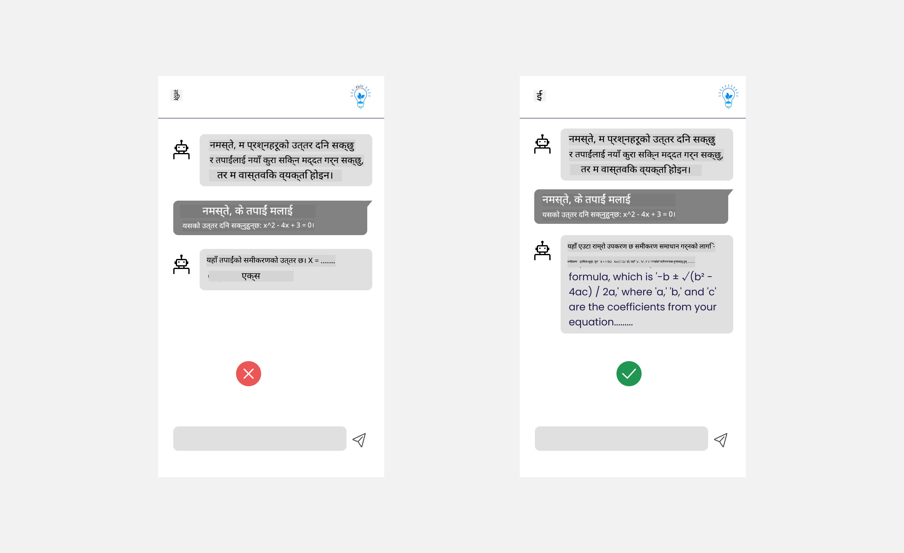
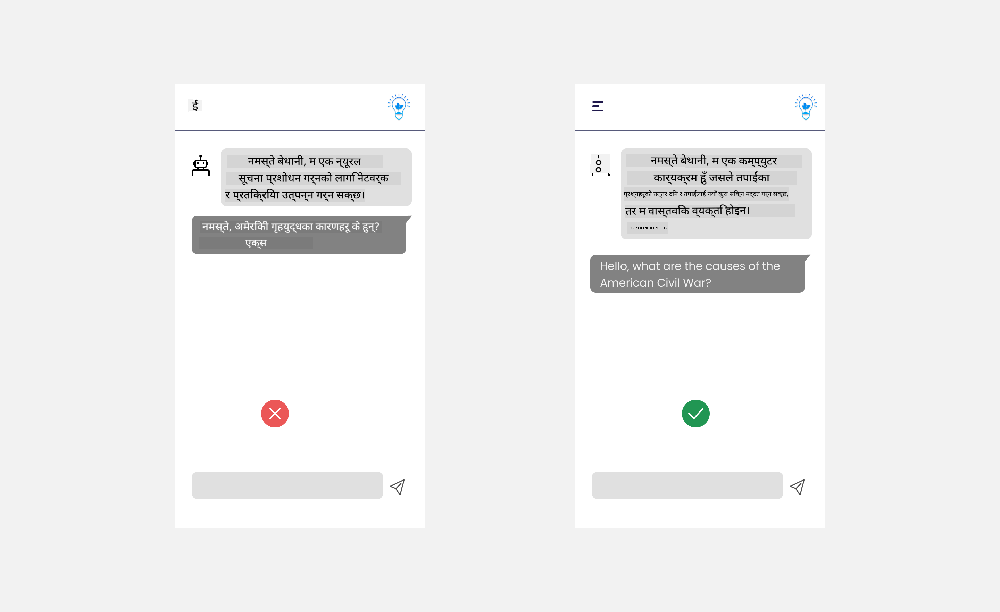
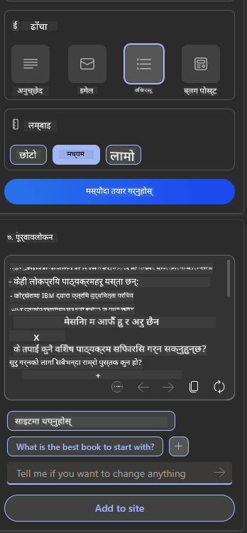

<!--
CO_OP_TRANSLATOR_METADATA:
{
  "original_hash": "ec385b41ee50579025d50cc03bfb3a25",
  "translation_date": "2025-07-09T14:54:29+00:00",
  "source_file": "12-designing-ux-for-ai-applications/README.md",
  "language_code": "ne"
}
-->
# AI अनुप्रयोगहरूको लागि UX डिजाइन

> _(यो पाठको भिडियो हेर्न माथिको तस्बिरमा क्लिक गर्नुहोस्)_

प्रयोगकर्ता अनुभव अनुप्रयोगहरू निर्माण गर्दा अत्यन्त महत्वपूर्ण पक्ष हो। प्रयोगकर्ताहरूले तपाईंको अनुप्रयोगलाई कार्यहरू प्रभावकारी रूपमा गर्न सक्ने गरी प्रयोग गर्न सक्नुपर्छ। प्रभावकारी हुनु एक कुरा हो तर तपाईंले अनुप्रयोगहरू यसरी डिजाइन गर्नुपर्छ कि सबैले सजिलै प्रयोग गर्न सकून्, अर्थात् _सुगम_ बनाउनु पर्छ। यो अध्यायले यस क्षेत्रमा ध्यान केन्द्रित गर्नेछ ताकि तपाईंले यस्तो अनुप्रयोग डिजाइन गर्न सक्नुहोस् जुन मानिसहरूले प्रयोग गर्न चाहन्छन् र प्रयोग गर्न सक्छन्।

## परिचय

प्रयोगकर्ता अनुभव भनेको प्रयोगकर्ताले कुनै विशेष उत्पादन वा सेवा, चाहे त्यो प्रणाली, उपकरण वा डिजाइन हो, कसरी अन्तरक्रिया गर्छ र प्रयोग गर्छ भन्ने हो। AI अनुप्रयोगहरू विकास गर्दा, विकासकर्ताहरूले मात्र प्रभावकारी प्रयोगकर्ता अनुभव सुनिश्चित गर्ने होइन, नैतिक पक्षमा पनि ध्यान दिन्छन्। यस पाठमा, हामी प्रयोगकर्ताका आवश्यकताहरू सम्बोधन गर्ने कृत्रिम बुद्धिमत्ता (AI) अनुप्रयोगहरू कसरी निर्माण गर्ने भन्ने कुरा सिक्नेछौं।

पाठले निम्न क्षेत्रहरू समेट्नेछ:

- प्रयोगकर्ता अनुभव र प्रयोगकर्ताका आवश्यकताहरू बुझ्ने परिचय
- विश्वास र पारदर्शिताका लागि AI अनुप्रयोगहरू डिजाइन गर्ने
- सहकार्य र प्रतिक्रिया का लागि AI अनुप्रयोगहरू डिजाइन गर्ने

## सिकाइका लक्ष्यहरू

यस पाठपछि, तपाईं सक्षम हुनुहुनेछ:

- प्रयोगकर्ताका आवश्यकताहरू पूरा गर्ने AI अनुप्रयोगहरू कसरी बनाउने बुझ्न।
- विश्वास र सहकार्य प्रवर्द्धन गर्ने AI अनुप्रयोगहरू डिजाइन गर्न।

### पूर्वआवश्यकता

केही समय निकालेर [प्रयोगकर्ता अनुभव र डिजाइन सोच](https://learn.microsoft.com/training/modules/ux-design?WT.mc_id=academic-105485-koreyst) बारे थप पढ्नुहोस्।

## प्रयोगकर्ता अनुभव र प्रयोगकर्ताका आवश्यकताहरू बुझ्ने परिचय

हाम्रो काल्पनिक शिक्षा स्टार्टअपमा दुई मुख्य प्रयोगकर्ता छन्, शिक्षक र विद्यार्थी। यी दुई प्रयोगकर्ताको फरक फरक आवश्यकताहरू छन्। प्रयोगकर्ता केन्द्रित डिजाइनले प्रयोगकर्तालाई प्राथमिकता दिन्छ र सुनिश्चित गर्छ कि उत्पादनहरू तिनीहरूका लागि सान्दर्भिक र लाभदायक छन्।

अनुप्रयोगले राम्रो प्रयोगकर्ता अनुभव प्रदान गर्नका लागि **उपयोगी, भरपर्दो, पहुँचयोग्य र रमाइलो** हुनुपर्छ।

### प्रयोगयोग्यता

उपयोगी हुनु भनेको अनुप्रयोगले आफ्नो उद्देश्य अनुसार काम गर्न सक्नु हो, जस्तै ग्रेडिङ प्रक्रिया स्वचालित बनाउनु वा पुनरावृत्तिका लागि फ्ल्यासकार्डहरू तयार पार्नु। ग्रेडिङ प्रक्रिया स्वचालित गर्ने अनुप्रयोगले पूर्वनिर्धारित मापदण्ड अनुसार विद्यार्थीहरूको कामलाई सही र प्रभावकारी रूपमा अंक दिन सक्नुपर्छ। त्यस्तै, पुनरावृत्तिका लागि फ्ल्यासकार्डहरू बनाउने अनुप्रयोगले सम्बन्धित र विविध प्रश्नहरू तयार पार्न सक्नुपर्छ।

### भरपर्दो

भरपर्दो हुनु भनेको अनुप्रयोगले आफ्नो काम निरन्तर र त्रुटि बिना गर्न सक्नु हो। तर, AI पनि मानिसझैं पूर्ण हुँदैन र त्रुटिहरू हुन सक्छन्। अनुप्रयोगहरूले त्रुटि वा अप्रत्याशित अवस्थाहरू सामना गर्न सक्छन् जसमा मानवीय हस्तक्षेप वा सुधार आवश्यक पर्न सक्छ। तपाईंले त्रुटिहरू कसरी व्यवस्थापन गर्नुहुन्छ? यस पाठको अन्तिम भागमा, हामी AI प्रणाली र अनुप्रयोगहरू कसरी सहकार्य र प्रतिक्रियाका लागि डिजाइन गरिन्छन् भन्ने कुरा छलफल गर्नेछौं।

### पहुँचयोग्यता

पहुँचयोग्य हुनु भनेको विभिन्न क्षमताका प्रयोगकर्ताहरू, जसमा अपाङ्गता भएका व्यक्तिहरू पनि समावेश छन्, लाई प्रयोगकर्ता अनुभव विस्तार गर्नु हो, जसले कसैलाई पनि बाहिर नछोडोस्। पहुँचयोग्यता दिशानिर्देश र सिद्धान्तहरू पालना गरेर, AI समाधानहरू सबै प्रयोगकर्ताका लागि थप समावेशी, प्रयोगयोग्य र लाभदायक बन्छन्।

### रमाइलो

रमाइलो हुनु भनेको अनुप्रयोग प्रयोग गर्न रमाइलो हुनु हो। आकर्षक प्रयोगकर्ता अनुभवले प्रयोगकर्तामा सकारात्मक प्रभाव पार्न सक्छ जसले उनीहरूलाई पुनः अनुप्रयोगमा फर्कन प्रोत्साहित गर्छ र व्यवसायको आम्दानी बढाउँछ।

हरेक चुनौती AI ले समाधान गर्न सक्दैन। AI तपाईंको प्रयोगकर्ता अनुभवलाई पूरक बनाउँछ, चाहे त्यो म्यानुअल कार्यहरू स्वचालित बनाउनु होस् वा प्रयोगकर्ता अनुभवलाई व्यक्तिगत बनाउनु होस्।

## विश्वास र पारदर्शिताका लागि AI अनुप्रयोगहरू डिजाइन गर्ने

AI अनुप्रयोगहरू डिजाइन गर्दा विश्वास निर्माण अत्यन्त महत्वपूर्ण हुन्छ। विश्वासले प्रयोगकर्तालाई यो सुनिश्चित गराउँछ कि अनुप्रयोगले काम पूरा गर्नेछ, परिणामहरू निरन्तर प्रदान गर्नेछ र ती परिणामहरू प्रयोगकर्ताको आवश्यकतासँग मेल खानेछन्। यस क्षेत्रमा जोखिम भनेको अविश्वास र अत्यधिक विश्वास हो। अविश्वास तब हुन्छ जब प्रयोगकर्ताले AI प्रणालीमा कम वा कुनै विश्वास गर्दैनन्, जसले अनुप्रयोग अस्वीकृत गर्न सक्छ। अत्यधिक विश्वास तब हुन्छ जब प्रयोगकर्ताले AI प्रणालीको क्षमता बढी अनुमान लगाउँछन्, जसले प्रणालीमा अत्यधिक भरोसा गर्न लगाउँछ। उदाहरणका लागि, स्वचालित ग्रेडिङ प्रणालीमा अत्यधिक विश्वास हुँदा शिक्षकले केही कागजातहरू जाँच नगर्न सक्छन् जसले विद्यार्थीहरूलाई अन्यायपूर्ण वा गलत ग्रेड दिन सक्छ, वा प्रतिक्रिया र सुधारका अवसरहरू गुम्न सक्छन्।

विश्वासलाई डिजाइनको केन्द्रमा राख्न दुई तरिका छन्: व्याख्यात्मकता र नियन्त्रण।

### व्याख्यात्मकता

जब AI ले निर्णयहरूमा सहयोग पुर्‍याउँछ, जस्तै भविष्यका पुस्तालाई ज्ञान दिनु, शिक्षक र अभिभावकहरूले AI निर्णयहरू कसरी गरिन्छ बुझ्न आवश्यक हुन्छ। यसलाई व्याख्यात्मकता भनिन्छ - AI अनुप्रयोगहरूले निर्णय कसरी गर्छन् बुझ्नु। व्याख्यात्मकताका लागि डिजाइन गर्दा AI अनुप्रयोगले के गर्न सक्छ भन्ने उदाहरणहरू थपिन्छन्। उदाहरणका लागि, "AI शिक्षकसँग सुरु गर्नुहोस्" भन्दा, प्रणालीले भन्न सक्छ: "AI प्रयोग गरेर सजिलो पुनरावृत्तिका लागि तपाईंका नोटहरू सारांश गर्नुहोस्।"

अर्को उदाहरण हो AI ले प्रयोगकर्ता र व्यक्तिगत डाटाको प्रयोग गर्ने तरिका। उदाहरणका लागि, विद्यार्थी व्यक्तित्व भएका प्रयोगकर्ताहरूलाई केही सीमितताहरू हुन सक्छन्। AI ले प्रश्नहरूको उत्तर खुलाउन नसक्न सक्छ तर प्रयोगकर्तालाई समस्या समाधान कसरी गर्ने सोच्न मार्गदर्शन गर्न सक्छ।

व्याख्यात्मकताको अन्तिम मुख्य भाग भनेको व्याख्याहरूलाई सरल बनाउनु हो। विद्यार्थी र शिक्षकहरू AI विशेषज्ञ नहुन सक्छन्, त्यसैले अनुप्रयोगले के गर्न सक्छ वा सक्दैन भन्ने व्याख्या सरल र बुझ्न सजिलो हुनुपर्छ।

### नियन्त्रण

जनरेटिभ AI ले AI र प्रयोगकर्ताबीच सहकार्य सिर्जना गर्छ, जहाँ प्रयोगकर्ताले विभिन्न परिणामका लागि प्रॉम्प्टहरू परिमार्जन गर्न सक्छ। थप रूपमा, एक पटक परिणाम उत्पन्न भएपछि, प्रयोगकर्ताले परिणामहरू परिमार्जन गर्न सक्नुपर्छ जसले उनीहरूलाई नियन्त्रणको अनुभूति दिन्छ। उदाहरणका लागि, Bing प्रयोग गर्दा तपाईंले आफ्नो प्रॉम्प्टलाई ढाँचा, स्वर र लम्बाइका आधारमा अनुकूलन गर्न सक्नुहुन्छ। साथै, तपाईंले आफ्नो आउटपुटमा परिवर्तन थप्न र परिमार्जन गर्न सक्नुहुन्छ, तल देखाइएको जस्तै:

Bing मा अर्को सुविधा जसले प्रयोगकर्तालाई अनुप्रयोगमा नियन्त्रण दिन्छ भनेको AI ले प्रयोग गर्ने डाटामा सहभागी हुन र बाहिर निस्कन सक्ने क्षमता हो। विद्यालय अनुप्रयोगका लागि, विद्यार्थीले आफ्नो नोटहरू साथै शिक्षकका स्रोतहरूलाई पुनरावृत्तिका सामग्रीको रूपमा प्रयोग गर्न चाहन सक्छ।

> AI अनुप्रयोगहरू डिजाइन गर्दा, प्रयोगकर्ताहरूले यसको क्षमतामा अत्यधिक विश्वास नगर्न र अवास्तविक अपेक्षा नबनाउन जानाजानी प्रयास गर्नु आवश्यक छ। यसको एउटा तरिका भनेको प्रॉम्प्ट र परिणामबीच केही अवरोध सिर्जना गर्नु हो। प्रयोगकर्तालाई सम्झाउनु कि यो AI हो, कुनै मानव होइन।

## सहकार्य र प्रतिक्रियाका लागि AI अनुप्रयोगहरू डिजाइन गर्ने

पहिले भनिएझैं, जनरेटिभ AI ले प्रयोगकर्ता र AI बीच सहकार्य सिर्जना गर्छ। अधिकांश अन्तरक्रियाहरूमा प्रयोगकर्ताले प्रॉम्प्ट दिन्छ र AI ले परिणाम उत्पन्न गर्छ। यदि परिणाम गलत भयो भने के हुन्छ? त्रुटि आएमा अनुप्रयोगले कसरी व्यवहार गर्छ? के AI प्रयोगकर्तालाई दोष दिन्छ वा त्रुटि व्याख्या गर्न समय लिन्छ?

AI अनुप्रयोगहरू प्रतिक्रिया लिन र दिन सक्षम हुनुपर्छ। यसले मात्र AI प्रणालीलाई सुधार गर्न मद्दत गर्दैन, प्रयोगकर्तासँग विश्वास पनि बनाउँछ। डिजाइनमा प्रतिक्रिया लूप समावेश गर्नुपर्छ, जस्तै परिणाममा सिधा थम्ब्स अप वा डाउन दिन सकिने सुविधा।

अर्को तरिका भनेको प्रणालीका क्षमताहरू र सीमाहरू स्पष्ट रूपमा सञ्चार गर्नु हो। जब प्रयोगकर्ताले AI क्षमताभन्दा बाहिर केही अनुरोध गर्छ, त्यसलाई कसरी व्यवस्थापन गर्ने तरिका पनि हुनुपर्छ, तल देखाइएको जस्तै।

प्रणाली त्रुटिहरू सामान्य हुन्छन् जहाँ प्रयोगकर्ताले AI को दायराभन्दा बाहिर जानकारी चाहन सक्छ वा अनुप्रयोगले प्रयोगकर्ताले कति प्रश्न/विषयहरूमा सारांश बनाउन सक्छ भन्ने सीमितता हुन सक्छ। उदाहरणका लागि, इतिहास र गणितमा मात्र तालिम प्राप्त AI अनुप्रयोग भूगोल सम्बन्धी प्रश्नहरू सम्हाल्न नसक्न सक्छ। यसलाई कम गर्न AI प्रणालीले यस्तो जवाफ दिन सक्छ: "माफ गर्नुहोस्, हाम्रो उत्पादन निम्न विषयहरूमा तालिम प्राप्त छ....., तपाईंले सोध्नुभएको प्रश्नको जवाफ दिन सक्दिन।"

AI अनुप्रयोगहरू पूर्ण हुँदैनन्, त्यसैले तिनीहरूले गल्ती गर्न सक्छन्। तपाईंको अनुप्रयोग डिजाइन गर्दा, प्रयोगकर्ताबाट प्रतिक्रिया लिन र त्रुटि व्यवस्थापन गर्न सजिलो र स्पष्ट तरिका बनाउनुपर्छ।

## कार्य

अहिलेसम्म तपाईंले बनाएका कुनै पनि AI अनुप्रयोगहरू लिएर, तलका कदमहरू तपाईंको अनुप्रयोगमा लागू गर्ने बारे विचार गर्नुहोस्:

- **रमाइलो:** तपाईंको अनुप्रयोगलाई कसरी अझ रमाइलो बनाउन सकिन्छ? के तपाईं सबै ठाउँमा व्याख्या थप्दै हुनुहुन्छ? के तपाईं प्रयोगकर्तालाई अन्वेषण गर्न प्रोत्साहित गर्दै हुनुहुन्छ? तपाईंका त्रुटि सन्देशहरू कसरी लेख्दै हुनुहुन्छ?

- **प्रयोगयोग्यता:** वेब अनुप्रयोग बनाउँदै हुनुहुन्छ भने, सुनिश्चित गर्नुहोस् कि तपाईंको अनुप्रयोग माउस र किबोर्ड दुवैबाट सजिलै नेभिगेट गर्न सकिन्छ।

- **विश्वास र पारदर्शिता:** AI र यसको परिणाममा पूर्ण विश्वास नगर्नुहोस्, परिणाम प्रमाणित गर्न मान्छे कसरी समावेश गर्ने भन्ने बारे विचार र कार्यान्वयन गर्नुहोस्। साथै, विश्वास र पारदर्शिता प्राप्त गर्ने अन्य तरिकाहरू पनि विचार र कार्यान्वयन गर्नुहोस्।

- **नियन्त्रण:** प्रयोगकर्तालाई अनुप्रयोगमा प्रदान गर्ने डाटामा नियन्त्रण दिनुहोस्। AI अनुप्रयोगमा प्रयोगकर्ताले डाटा सङ्कलनमा सहभागी हुन र बाहिर निस्कन सक्ने तरिका कार्यान्वयन गर्नुहोस्।

## आफ्नो सिकाइ जारी राख्नुहोस्!

यस पाठ पूरा गरेपछि, हाम्रो [जनरेटिभ AI सिकाइ संग्रह](https://aka.ms/genai-collection?WT.mc_id=academic-105485-koreyst) हेर्नुहोस् र आफ्नो जनरेटिभ AI ज्ञानलाई अझ उचाइमा पुर्‍याउनुहोस्!

पाठ १३ मा जानुहोस्, जहाँ हामी [AI अनुप्रयोगहरूको सुरक्षा](../13-securing-ai-applications/README.md?WT.mc_id=academic-105485-koreyst) कसरी गर्ने भन्ने कुरा हेर्नेछौं!

**अस्वीकरण**:  
यो दस्तावेज AI अनुवाद सेवा [Co-op Translator](https://github.com/Azure/co-op-translator) प्रयोग गरी अनुवाद गरिएको हो। हामी शुद्धताका लागि प्रयासरत छौं भने पनि, कृपया ध्यान दिनुहोस् कि स्वचालित अनुवादमा त्रुटि वा अशुद्धता हुन सक्छ। मूल दस्तावेज यसको मूल भाषामा नै अधिकारिक स्रोत मानिनु पर्छ। महत्वपूर्ण जानकारीका लागि व्यावसायिक मानव अनुवाद सिफारिस गरिन्छ। यस अनुवादको प्रयोगबाट उत्पन्न कुनै पनि गलतफहमी वा गलत व्याख्याका लागि हामी जिम्मेवार छैनौं।