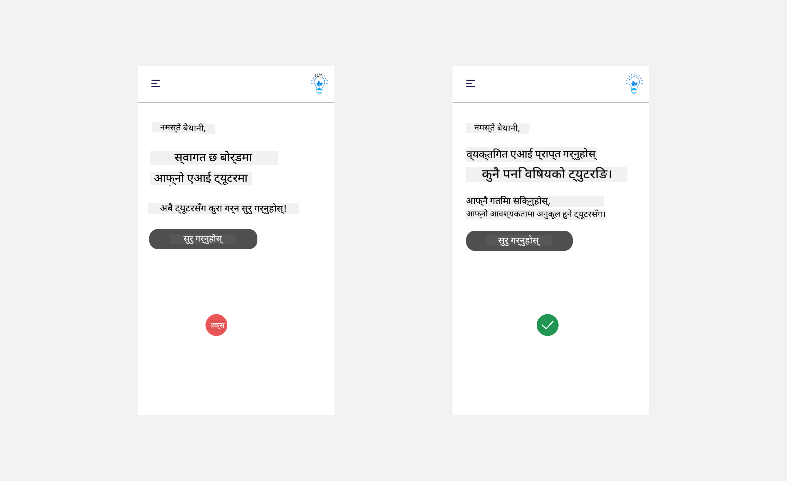

<!--
CO_OP_TRANSLATOR_METADATA:
{
  "original_hash": "747668e4c53d067369f06e9ec2e6313e",
  "translation_date": "2025-08-26T16:00:03+00:00",
  "source_file": "12-designing-ux-for-ai-applications/README.md",
  "language_code": "ne"
}
-->
# एआई एप्लिकेसनहरूको लागि यूएक्स डिजाइन गर्दै

> _(माथिको चित्रमा क्लिक गरेर यस पाठको भिडियो हेर्नुहोस्)_

प्रयोगकर्ता अनुभव (यूएक्स) एप्लिकेसन बनाउँदा धेरै महत्वपूर्ण पक्ष हो। प्रयोगकर्ताहरूले तपाईंको एप्लिकेसन सजिलै र प्रभावकारी रूपमा प्रयोग गर्न सक्नुपर्छ। प्रभावकारी हुनु एउटा कुरा हो, तर तपाईंले सबैका लागि प्रयोग गर्न मिल्ने गरी एप्लिकेसन डिजाइन गर्नुपर्छ, जसले गर्दा यो _समावेशी_ हुन्छ। यो अध्यायले यही क्षेत्रमा ध्यान केन्द्रित गर्छ ताकि तपाईंले अन्ततः सबैले प्रयोग गर्न सक्ने र चाहने एप्लिकेसन डिजाइन गर्नुहोस्।

## परिचय

प्रयोगकर्ता अनुभव भन्नाले प्रयोगकर्ताले कुनै विशेष उत्पादन वा सेवासँग कसरी अन्तरक्रिया गर्छ भन्ने कुरा जनाउँछ, चाहे त्यो सिस्टम, उपकरण वा डिजाइन होस्। एआई एप्लिकेसन विकास गर्दा, विकासकर्ताहरूले प्रयोगकर्ता अनुभव प्रभावकारी मात्र नभई नैतिक पनि होस् भन्नेमा ध्यान दिनुपर्छ। यस पाठमा, हामी प्रयोगकर्ताको आवश्यकता सम्बोधन गर्ने एआई एप्लिकेसन कसरी बनाउने भन्ने कुरा समेट्छौं।

यस पाठमा निम्न क्षेत्रहरू समेटिनेछन्:

- प्रयोगकर्ता अनुभवको परिचय र प्रयोगकर्ताको आवश्यकता बुझ्ने
- विश्वास र पारदर्शिताका लागि एआई एप्लिकेसन डिजाइन गर्ने
- सहकार्य र प्रतिक्रिया (फिडब्याक) का लागि एआई एप्लिकेसन डिजाइन गर्ने

## सिकाइका उद्देश्यहरू

यो पाठ लिएपछि, तपाईंले गर्न सक्नुहुन्छ:

- प्रयोगकर्ताको आवश्यकता पूरा गर्ने एआई एप्लिकेसन कसरी बनाउने भन्ने बुझ्ने
- विश्वास र सहकार्य बढाउने एआई एप्लिकेसन डिजाइन गर्ने

### पूर्वआवश्यकता

केही समय निकालेर [प्रयोगकर्ता अनुभव र डिजाइन सोच](https://learn.microsoft.com/training/modules/ux-design?WT.mc_id=academic-105485-koreyst) बारे थप पढ्नुहोस्।

## प्रयोगकर्ता अनुभवको परिचय र प्रयोगकर्ताको आवश्यकता बुझ्ने

हाम्रो काल्पनिक शिक्षा स्टार्टअपमा, दुई मुख्य प्रयोगकर्ता छन्, शिक्षक र विद्यार्थी। यी दुई प्रयोगकर्ताका फरक-फरक आवश्यकता छन्। प्रयोगकर्ता केन्द्रित डिजाइनले प्रयोगकर्तालाई प्राथमिकता दिन्छ, जसले उत्पादनहरू तिनीहरूका लागि सान्दर्भिक र लाभदायक बनाउँछ।

एप्लिकेसन **उपयोगी, भरपर्दो, पहुँचयोग्य र रमाइलो** हुनुपर्छ, जसले राम्रो प्रयोगकर्ता अनुभव दिन्छ।

### उपयोगिता

उपयोगी हुनुको अर्थ एप्लिकेसनले आफ्नो उद्देश्य अनुसारको कार्यक्षमता दिनु हो, जस्तै ग्रेडिङ प्रक्रिया स्वचालित बनाउने वा पुनरावृत्तिका लागि फ्ल्यासकार्डहरू बनाउने। ग्रेडिङ प्रक्रिया स्वचालित बनाउने एप्लिकेसनले पूर्वनिर्धारित मापदण्ड अनुसार विद्यार्थीको कामलाई सही र छिटो अंक दिन सक्नुपर्छ। त्यस्तै, पुनरावृत्तिका लागि फ्ल्यासकार्ड बनाउने एप्लिकेसनले आफ्ना डाटाका आधारमा सान्दर्भिक र विविध प्रश्नहरू बनाउन सक्नुपर्छ।

### भरपर्दो

भरपर्दो हुनुको अर्थ एप्लिकेसनले आफ्नो काम निरन्तर र बिना गल्ती गर्न सक्नुपर्छ। तर, एआई पनि मानिस जस्तै पूर्ण छैन र गल्ती हुन सक्छ। एप्लिकेसनहरूले कहिलेकाहीँ गल्ती वा अप्रत्याशित अवस्था सामना गर्न सक्छन्, जसमा मानवीय हस्तक्षेप वा सुधार आवश्यक पर्न सक्छ। गल्तीहरू कसरी व्यवस्थापन गर्ने? यस पाठको अन्तिम भागमा, हामी एआई सिस्टम र एप्लिकेसनहरू सहकार्य र प्रतिक्रियाका लागि कसरी डिजाइन गरिन्छ भन्ने कुरा समेट्नेछौं।

### पहुँचयोग्यता

पहुँचयोग्य हुनुको अर्थ विभिन्न क्षमता भएका प्रयोगकर्ताहरू, जसमा अपांगता भएका पनि पर्छन्, सबैका लागि प्रयोगकर्ता अनुभव विस्तार गर्नु हो। पहुँचसम्बन्धी मार्गदर्शन र सिद्धान्तहरू पालना गर्दा, एआई समाधानहरू अझ समावेशी, प्रयोग गर्न सजिलो र सबैका लागि लाभदायक हुन्छन्।

### रमाइलो

रमाइलो हुनुको अर्थ एप्लिकेसन प्रयोग गर्न आनन्ददायक हुनु हो। आकर्षक प्रयोगकर्ता अनुभवले प्रयोगकर्तामा सकारात्मक प्रभाव पार्न सक्छ, जसले गर्दा उनीहरू एप्लिकेसनमा फर्किन चाहन्छन् र व्यवसायको आम्दानी बढ्छ।

हरेक चुनौती एआईले समाधान गर्न सक्दैन। एआईले तपाईंको प्रयोगकर्ता अनुभवलाई सहयोग पुर्‍याउँछ, चाहे त्यो म्यानुअल काम स्वचालित बनाउने होस् वा प्रयोगकर्ता अनुभवलाई व्यक्तिगत बनाउने होस्।

## विश्वास र पारदर्शिताका लागि एआई एप्लिकेसन डिजाइन गर्दै

एआई एप्लिकेसन डिजाइन गर्दा विश्वास निर्माण गर्नु अत्यन्त महत्वपूर्ण छ। विश्वासले प्रयोगकर्तालाई एप्लिकेसनले काम गर्छ भन्ने आत्मविश्वास दिन्छ, निरन्तर परिणाम दिन्छ र ती परिणाम प्रयोगकर्तालाई आवश्यक पर्ने हुन्छन्। यहाँको जोखिम भनेको अविश्वास र अति विश्वास हो। अविश्वास तब हुन्छ जब प्रयोगकर्ताले एआई सिस्टममा कम वा कुनै विश्वास गर्दैन, जसले गर्दा प्रयोगकर्ताले तपाईंको एप्लिकेसन अस्वीकार गर्छ। अति विश्वास भनेको प्रयोगकर्ताले एआई सिस्टमको क्षमतालाई अत्यधिक आँकलन गर्दा हुन्छ, जसले गर्दा प्रयोगकर्ताले एआई सिस्टममा अत्यधिक विश्वास गर्छ। उदाहरणका लागि, ग्रेडिङ सिस्टममा अति विश्वास हुँदा शिक्षकले केही कागजहरू आफैं जाँच नगरीकनै ग्रेडिङ सिस्टम ठीक छ भनी मान्न सक्छन्। यसले विद्यार्थीका लागि अन्यायपूर्ण वा गलत ग्रेड आउन सक्छ, वा प्रतिक्रिया र सुधारका अवसर छुट्न सक्छन्।

विश्वासलाई डिजाइनको केन्द्रमा राख्नका लागि दुई उपाय छन्: व्याख्यात्मकता (explainability) र नियन्त्रण (control)।

### व्याख्यात्मकता

एआईले भविष्यका पुस्तालाई ज्ञान दिने निर्णयमा सहयोग गर्दा, शिक्षक र अभिभावकले एआईका निर्णय कसरी बनेका हुन् भन्ने बुझ्न आवश्यक छ। यही हो व्याख्यात्मकता - एआई एप्लिकेसनले निर्णय कसरी गर्छ भन्ने बुझाइ। व्याख्यात्मकताको लागि डिजाइन गर्दा, एआईले नतिजा कसरी ल्यायो भन्ने विवरण थप्नुपर्छ। दर्शकलाई थाहा हुनुपर्छ कि नतिजा एआईले बनाएको हो, मानिसले होइन। उदाहरणका लागि, "अब तपाईंको ट्युटरसँग च्याट गर्न सुरु गर्नुहोस्" भन्नुको सट्टा "आफ्नो आवश्यकता अनुसार अनुकूल हुने एआई ट्युटर प्रयोग गर्नुहोस्, जसले तपाईंलाई तपाईंको गतिमा सिक्न सहयोग गर्छ" भन्न सकिन्छ।

अर्को उदाहरण हो, एआईले प्रयोगकर्ता र व्यक्तिगत डाटा कसरी प्रयोग गर्छ। उदाहरणका लागि, विद्यार्थीको पर्सोना भएको प्रयोगकर्तामा केही सीमितता हुन सक्छ। एआईले प्रश्नको उत्तर खुलाउन नपाउने तर प्रयोगकर्तालाई समस्या समाधान गर्न सोच्न मार्गदर्शन गर्न सक्ने।

व्याख्यात्मकताको अन्तिम महत्वपूर्ण पक्ष भनेको व्याख्यालाई सरल बनाउनु हो। विद्यार्थी र शिक्षक सबै एआई विज्ञ नहुन सक्छन्, त्यसैले एप्लिकेसनले के गर्न सक्छ वा सक्दैन भन्ने व्याख्या सरल र बुझ्न सजिलो हुनुपर्छ।

### नियन्त्रण

जेनेरेटिभ एआईले प्रयोगकर्ता र एआईबीिच सहकार्य सिर्जना गर्छ, जहाँ प्रयोगकर्ताले फरक नतिजाका लागि प्रॉम्प्ट परिवर्तन गर्न सक्छ। साथै, नतिजा बनेपछि, प्रयोगकर्ताले नतिजा परिवर्तन गर्न सक्नुपर्छ, जसले उनीहरूलाई नियन्त्रणको अनुभूति दिन्छ। उदाहरणका लागि, Bing प्रयोग गर्दा, तपाईंले आफ्नो प्रॉम्प्टलाई ढाँचा, शैली र लम्बाइ अनुसार अनुकूल बनाउन सक्नुहुन्छ। साथै, तपाईंले आफ्नो नतिजामा परिवर्तन थप्न र नतिजा सम्पादन गर्न सक्नुहुन्छ, जस्तो तल देखाइएको छ:

Bing मा अर्को सुविधा भनेको प्रयोगकर्ताले एप्लिकेसनमा नियन्त्रण राख्न सक्ने, अर्थात् एआईले प्रयोग गर्ने डाटामा सहभागी हुने वा नहुने विकल्प दिनु हो। विद्यालय एप्लिकेसनमा, विद्यार्थीले आफ्ना नोट्स र शिक्षकका स्रोतहरू दुवैलाई पुनरावृत्तिका लागि प्रयोग गर्न चाहन सक्छन्।

> एआई एप्लिकेसन डिजाइन गर्दा, प्रयोगकर्ताले क्षमताबारे अवास्तविक अपेक्षा राखेर अति विश्वास नगरोस् भन्नका लागि उद्देश्यपूर्णता आवश्यक छ। यसको एउटा उपाय भनेको प्रॉम्प्ट र नतिजाबीच केही अवरोध सिर्जना गर्नु हो। प्रयोगकर्तालाई सम्झाइरहनुहोस्, यो एआई हो, मानिस होइन।

## सहकार्य र प्रतिक्रियाका लागि एआई एप्लिकेसन डिजाइन गर्दै

पहिले उल्लेख गरेझैं, जेनेरेटिभ एआईले प्रयोगकर्ता र एआईबीिच सहकार्य सिर्जना गर्छ। धेरैजसो अन्तरक्रिया भनेको प्रयोगकर्ताले प्रॉम्प्ट हाल्ने र एआईले नतिजा दिने हो। यदि नतिजा गलत आयो भने के गर्ने? एप्लिकेसनले गल्ती भएमा कसरी व्यवस्थापन गर्छ? के एआईले प्रयोगकर्तालाई दोष दिन्छ वा गल्तीको व्याख्या गर्छ?

एआई एप्लिकेसनमा प्रतिक्रिया (फिडब्याक) दिने र लिने सुविधा हुनुपर्छ। यसले एआई सिस्टम सुधार गर्न मात्र होइन, प्रयोगकर्तासँग विश्वास पनि बढाउँछ। डिजाइनमा प्रतिक्रिया चक्र (फिडब्याक लूप) समावेश गर्नुपर्छ, उदाहरणका लागि नतिजामा सिधै थम्ब्स अप वा डाउन दिने सुविधा।

अर्को उपाय भनेको सिस्टमका क्षमता र सीमितता स्पष्ट रूपमा जानकारी गराउनु हो। प्रयोगकर्ताले एआईको क्षमताभन्दा बाहिरको कुरा माग्दा, त्यसलाई व्यवस्थापन गर्ने उपाय पनि हुनुपर्छ, जस्तो तल देखाइएको छ।

सिस्टम गल्तीहरू एप्लिकेसनमा सामान्य हुन्छन्, जहाँ प्रयोगकर्तालाई एआईको दायराबाहिरको जानकारी चाहिन सक्छ वा एप्लिकेसनमा प्रयोगकर्ताले कति प्रश्न/विषयको सारांश बनाउन सक्छ भन्नेमा सीमा हुन सक्छ। उदाहरणका लागि, एआई एप्लिकेसनले सीमित विषय (जस्तै, इतिहास र गणित) मा मात्र तालिम पाएको छ भने, भूगोलसम्बन्धी प्रश्नहरूमा जवाफ दिन सक्दैन। यस्तो अवस्थामा, एआई सिस्टमले "माफ गर्नुहोस्, हाम्रो उत्पादनले निम्न विषयहरूमा मात्र तालिम पाएको छ....., तपाईंले सोध्नुभएको प्रश्नमा म जवाफ दिन सक्दिन" भन्ने जवाफ दिन सक्छ।

एआई एप्लिकेसनहरू पूर्ण छैनन्, त्यसैले गल्ती हुन सक्छ। तपाईंले एप्लिकेसन डिजाइन गर्दा, प्रयोगकर्ताबाट प्रतिक्रिया लिने र गल्ती व्यवस्थापन गर्ने ठाउँ राख्नुपर्छ, जसले गर्दा यो सरल र सजिलै बुझ्न मिल्ने होस्।

## अभ्यास

तपाईंले अहिलेसम्म बनाएका कुनै पनि एआई एप्लिकेसनमा तलका बुँदाहरू लागू गर्ने विचार गर्नुहोस्:

- **रमाइलो:** तपाईंको एप्लिकेसन अझ रमाइलो कसरी बनाउन सकिन्छ विचार गर्नुहोस्। के तपाईंले सबै ठाउँमा व्याख्या थपिरहनुभएको छ? के तपाईंले प्रयोगकर्तालाई अन्वेषण गर्न प्रोत्साहित गर्दै हुनुहुन्छ? तपाईंको गल्ती सन्देशहरू कस्तो भाषामा लेखिएको छ?

- **उपयोगिता:** वेब एप बनाउँदै हुनुहुन्छ भने, तपाईंको एप्लिकेसन माउस र किबोर्ड दुवैबाट नेभिगेट गर्न मिल्ने बनाउनुहोस्।

- **विश्वास र पारदर्शिता:** एआई र यसको नतिजामा पूर्ण विश्वास नगर्नुहोस्, नतिजा प्रमाणित गर्न मान्छे समावेश गर्ने उपाय विचार गर्नुहोस्। साथै, विश्वास र पारदर्शिता हासिल गर्ने अन्य उपायहरू पनि विचार र लागू गर्नुहोस्।

- **नियन्त्रण:** प्रयोगकर्तालाई एप्लिकेसनमा दिने डाटामा नियन्त्रण दिनुहोस्। प्रयोगकर्ताले एआई एप्लिकेसनमा डाटा संकलनमा सहभागी हुने वा नहुने विकल्प लागू गर्नुहोस्।

## आफ्नो सिकाइ जारी राख्नुहोस्!

यो पाठ पूरा गरेपछि, हाम्रो [Generative AI Learning collection](https://aka.ms/genai-collection?WT.mc_id=academic-105485-koreyst) हेर्नुहोस् र आफ्नो जेनेरेटिभ एआई ज्ञान अझ बढाउनुहोस्!

अब पाठ १३ मा जानुहोस्, जहाँ हामी [एआई एप्लिकेसन सुरक्षित गर्ने](../13-securing-ai-applications/README.md?WT.mc_id=academic-105485-koreyst) बारेमा हेर्नेछौं!

---

**अस्वीकरण**:  
यो दस्तावेज़ AI अनुवाद सेवा [Co-op Translator](https://github.com/Azure/co-op-translator) प्रयोग गरी अनुवाद गरिएको हो। हामी शुद्धताको लागि प्रयास गर्छौं, तर कृपया ध्यान दिनुहोस् कि स्वचालित अनुवादमा त्रुटि वा अशुद्धता हुन सक्छ। मूल भाषामा रहेको दस्तावेज़लाई नै आधिकारिक स्रोत मान्नुपर्छ। महत्वपूर्ण जानकारीको लागि, व्यावसायिक मानव अनुवाद सिफारिस गरिन्छ। यस अनुवादको प्रयोगबाट उत्पन्न हुने कुनै पनि गलत बुझाइ वा व्याख्याका लागि हामी जिम्मेवार हुने छैनौं।