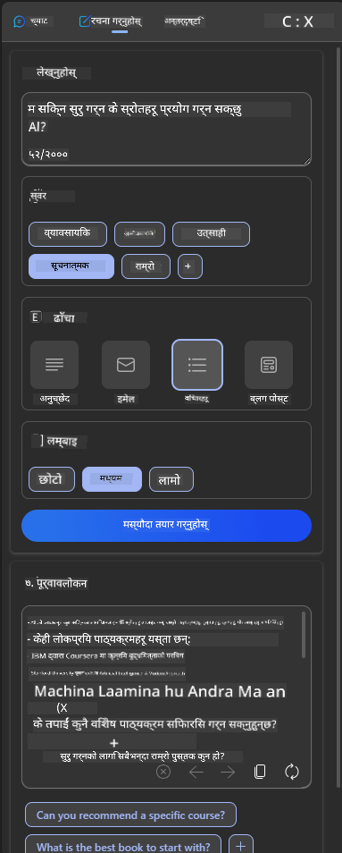
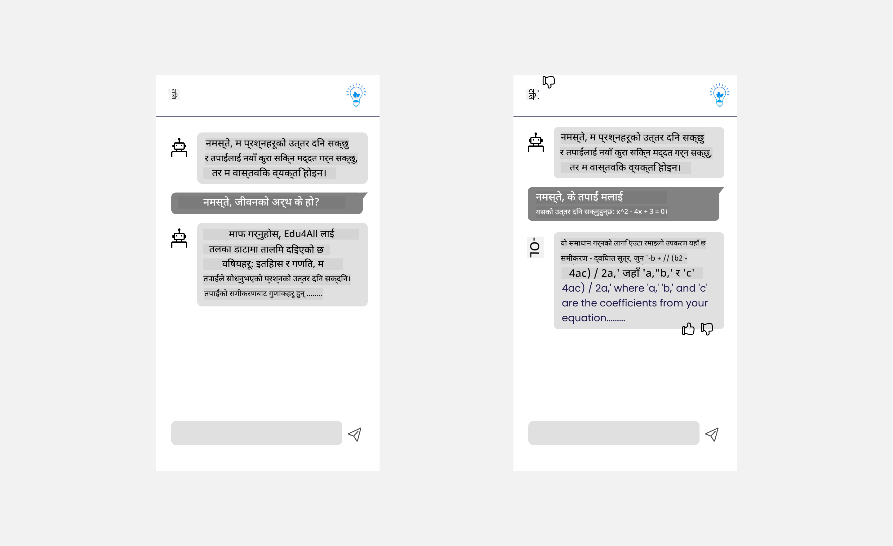

<!--
CO_OP_TRANSLATOR_METADATA:
{
  "original_hash": "78bbeed50fd4dc9fdee931f5daf98cb3",
  "translation_date": "2025-10-17T14:06:27+00:00",
  "source_file": "12-designing-ux-for-ai-applications/README.md",
  "language_code": "ne"
}
-->
# एआई एप्लिकेशनहरूको लागि UX डिजाइन

> _(माथिको चित्रमा क्लिक गरेर यस पाठको भिडियो हेर्नुहोस्)_

प्रयोगकर्ता अनुभव एप्लिकेशन निर्माणको एक अत्यन्त महत्त्वपूर्ण पक्ष हो। प्रयोगकर्ताहरूले तपाईंको एप्लिकेशनलाई प्रभावकारी तरिकाले प्रयोग गर्न सक्नुपर्छ। प्रभावकारी हुनु एउटा कुरा हो तर तपाईंले एप्लिकेशनलाई सबैले प्रयोग गर्न सक्ने गरी डिजाइन गर्नुपर्छ, जसले यसलाई _सुलभ_ बनाउँछ। यो अध्यायले यस क्षेत्रमा ध्यान केन्द्रित गर्नेछ ताकि तपाईंले यस्तो एप्लिकेशन डिजाइन गर्न सक्नुहोस् जुन मानिसहरूले प्रयोग गर्न चाहन्छन् र गर्न सक्छन्।

## परिचय

प्रयोगकर्ता अनुभव भनेको प्रयोगकर्ताले कुनै विशेष उत्पादन वा सेवा, चाहे त्यो प्रणाली, उपकरण वा डिजाइन हो,सँग कसरी अन्तरक्रिया गर्छ र प्रयोग गर्छ भन्ने हो। एआई एप्लिकेशनहरू विकास गर्दा, विकासकर्ताहरूले प्रयोगकर्ता अनुभव प्रभावकारी मात्र नभई नैतिक पनि सुनिश्चित गर्न ध्यान दिन्छन्। यस पाठमा, हामी प्रयोगकर्ता आवश्यकताहरू सम्बोधन गर्ने कृत्रिम बुद्धिमत्ता (AI) एप्लिकेशनहरू निर्माण गर्ने तरिकामा चर्चा गर्नेछौं।

पाठले निम्न क्षेत्रहरू समेट्नेछ:

- प्रयोगकर्ता अनुभव र प्रयोगकर्ता आवश्यकताहरूको समझको परिचय
- विश्वास र पारदर्शिताका लागि एआई एप्लिकेशनहरू डिजाइन गर्ने
- सहकार्य र प्रतिक्रिया प्राप्त गर्न एआई एप्लिकेशनहरू डिजाइन गर्ने

## सिकाइका लक्ष्यहरू

यस पाठ लिएपछि, तपाईं सक्षम हुनुहुनेछ:

- प्रयोगकर्ता आवश्यकताहरू पूरा गर्ने एआई एप्लिकेशनहरू निर्माण गर्ने तरिका बुझ्न।
- विश्वास र सहकार्यलाई प्रोत्साहन गर्ने एआई एप्लिकेशनहरू डिजाइन गर्न।

### पूर्वशर्त

थोरै समय निकालेर [प्रयोगकर्ता अनुभव र डिजाइन सोच](https://learn.microsoft.com/training/modules/ux-design?WT.mc_id=academic-105485-koreyst)बारे थप पढ्नुहोस्।

## प्रयोगकर्ता अनुभव र प्रयोगकर्ता आवश्यकताहरूको समझको परिचय

हाम्रो काल्पनिक शिक्षा स्टार्टअपमा, हामीसँग दुई प्राथमिक प्रयोगकर्ताहरू छन्, शिक्षक र विद्यार्थी। यी दुई प्रयोगकर्ताहरूको अनौठो आवश्यकताहरू छन्। प्रयोगकर्ता-केंद्रित डिजाइनले प्रयोगकर्तालाई प्राथमिकता दिन्छ, सुनिश्चित गर्दै उत्पादनहरू ती व्यक्तिहरूका लागि सान्दर्भिक र लाभदायक छन् जसका लागि यो बनाइएको हो।

एप्लिकेशनले **उपयोगी, भरपर्दो, सुलभ र रमाइलो** हुनुपर्छ ताकि राम्रो प्रयोगकर्ता अनुभव प्रदान गर्न सकियोस्।

### उपयोगिता

उपयोगी हुनु भनेको एप्लिकेशनले यसको उद्देश्यसँग मेल खाने कार्यक्षमता राख्नु हो, जस्तै ग्रेडिङ प्रक्रिया स्वचालित बनाउने वा पुनरावलोकनका लागि फ्ल्यासकार्डहरू उत्पन्न गर्ने। ग्रेडिङ प्रक्रिया स्वचालित बनाउने एप्लिकेशनले विद्यार्थीको कामलाई पूर्वनिर्धारित मापदण्डको आधारमा सही र प्रभावकारी रूपमा स्कोर दिन सक्षम हुनुपर्छ। त्यस्तै, पुनरावलोकन फ्ल्यासकार्डहरू उत्पन्न गर्ने एप्लिकेशनले यसको डाटाको आधारमा सान्दर्भिक र विविध प्रश्नहरू सिर्जना गर्न सक्षम हुनुपर्छ।

### भरपर्दो

भरपर्दो हुनु भनेको एप्लिकेशनले आफ्नो कार्य निरन्तर र त्रुटि बिना प्रदर्शन गर्न सक्षम हुनु हो। तर, एआई पनि मानिसहरू जस्तै पूर्ण छैन र त्रुटिहरूप्रति संवेदनशील हुन सक्छ। एप्लिकेशनहरूले त्रुटिहरू वा अप्रत्याशित परिस्थितिहरू सामना गर्न सक्छन् जसले मानव हस्तक्षेप वा सुधारको आवश्यकता पर्न सक्छ। त्रुटिहरू कसरी व्यवस्थापन गर्ने? यस पाठको अन्तिम खण्डमा, हामी एआई प्रणालीहरू र एप्लिकेशनहरू सहकार्य र प्रतिक्रियाका लागि कसरी डिजाइन गरिन्छ भन्ने कुरा समेट्नेछौं।

### सुलभता

सुलभ हुनु भनेको विभिन्न क्षमताहरू भएका प्रयोगकर्ताहरू, जसमा अपाङ्गता भएका व्यक्तिहरू पनि समावेश छन्,लाई प्रयोगकर्ता अनुभव विस्तार गर्नु हो, सुनिश्चित गर्दै कसैलाई पनि छुटाइँदैन। पहुँचयोग्यता दिशानिर्देश र सिद्धान्तहरू पालना गरेर, एआई समाधानहरू सबै प्रयोगकर्ताहरूका लागि थप समावेशी, प्रयोगयोग्य र लाभदायक बन्छन्।

### रमाइलो

रमाइलो हुनु भनेको एप्लिकेशन प्रयोग गर्न आनन्ददायक हुनु हो। आकर्षक प्रयोगकर्ता अनुभवले प्रयोगकर्तामा सकारात्मक प्रभाव पार्न सक्छ, उनीहरूलाई एप्लिकेशनमा फर्कन प्रोत्साहित गर्दै र व्यापार राजस्व बढाउँदै।

प्रत्येक चुनौती एआईले समाधान गर्न सक्दैन। एआईले तपाईंको प्रयोगकर्ता अनुभवलाई बढावा दिन्छ, चाहे म्यानुअल कार्यहरू स्वचालित बनाउने होस् वा प्रयोगकर्ता अनुभवलाई व्यक्तिगत बनाउने होस्।

## विश्वास र पारदर्शिताका लागि एआई एप्लिकेशनहरू डिजाइन गर्ने

एआई एप्लिकेशनहरू डिजाइन गर्दा विश्वास निर्माण गर्नु महत्त्वपूर्ण छ। विश्वासले प्रयोगकर्तालाई एप्लिकेशनले काम पूरा गर्नेछ, निरन्तर परिणामहरू प्रदान गर्नेछ र परिणामहरू प्रयोगकर्ताको आवश्यकतासँग मेल खानेछ भन्नेमा आत्मविश्वास दिलाउँछ। यस क्षेत्रमा जोखिम भनेको अविश्वास र अति विश्वास हो। अविश्वास तब हुन्छ जब प्रयोगकर्ताले एआई प्रणालीमा थोरै वा कुनै विश्वास गर्दैन, जसले प्रयोगकर्तालाई तपाईंको एप्लिकेशन अस्वीकार गर्न प्रेरित गर्दछ। अति विश्वास तब हुन्छ जब प्रयोगकर्ताले एआई प्रणालीको क्षमतालाई अति अनुमान गर्छ, जसले प्रयोगकर्ताहरूलाई एआई प्रणालीलाई धेरै विश्वास गर्न प्रेरित गर्दछ। उदाहरणका लागि, अटोमेटेड ग्रेडिङ प्रणालीको मामलामा अति विश्वासले शिक्षकलाई केही पेपरहरू प्रमाणित नगर्न प्रेरित गर्न सक्छ ताकि ग्रेडिङ प्रणाली राम्रोसँग काम गर्छ भन्ने सुनिश्चित गर्न सकियोस्। यसले विद्यार्थीहरूको लागि अन्यायपूर्ण वा गलत ग्रेडहरू, वा प्रतिक्रिया र सुधारका लागि गुमेका अवसरहरू निम्त्याउन सक्छ।

विश्वासलाई डिजाइनको केन्द्रमा राख्न सुनिश्चित गर्ने दुई तरिका भनेको व्याख्यात्मकता र नियन्त्रण हो।

### व्याख्यात्मकता

जब एआईले निर्णयहरू सूचित गर्न मद्दत गर्छ जस्तै भविष्यका पुस्ताहरूलाई ज्ञान प्रदान गर्ने, शिक्षक र अभिभावकहरूले एआई निर्णयहरू कसरी गरिन्छ भन्ने कुरा बुझ्न महत्त्वपूर्ण हुन्छ। यो व्याख्यात्मकता हो - एआई एप्लिकेशनहरूले निर्णय कसरी गर्छ भन्ने कुरा बुझ्न। व्याख्यात्मकताको लागि डिजाइन गर्दा एआईले आउटपुटमा कसरी पुगेको हो भन्ने कुरा हाइलाइट गर्ने विवरणहरू थप्न समावेश हुन्छ। दर्शकलाई थाहा हुनुपर्छ कि आउटपुट एआईले उत्पन्न गरेको हो र मानिसले होइन। उदाहरणका लागि, "तपाईंको ट्यूटरसँग अहिले कुराकानी सुरु गर्नुहोस्" भन्नुको सट्टा "एआई ट्यूटर प्रयोग गर्नुहोस् जसले तपाईंको आवश्यकताहरूमा अनुकूलन गर्छ र तपाईंलाई तपाईंको गति अनुसार सिक्न मद्दत गर्छ" भन्नुहोस्।

एआईले प्रयोगकर्ता र व्यक्तिगत डाटा कसरी प्रयोग गर्छ भन्ने अर्को उदाहरण हो। उदाहरणका लागि, विद्यार्थीको व्यक्तित्व भएको प्रयोगकर्ताले आफ्नो व्यक्तित्वको आधारमा सीमाहरू राख्न सक्छ। एआईले प्रश्नहरूको उत्तर खुलासा गर्न नसक्न सक्छ तर प्रयोगकर्तालाई समस्या समाधान गर्न कसरी सोच्न सकिन्छ भन्ने मार्गदर्शन गर्न मद्दत गर्न सक्छ।

व्याख्यात्मकताको अर्को महत्त्वपूर्ण भाग भनेको व्याख्याहरूलाई सरल बनाउनु हो। विद्यार्थी र शिक्षकहरू एआई विशेषज्ञ नहुन सक्छन्, त्यसैले एप्लिकेशनले के गर्न सक्छ वा गर्न सक्दैन भन्ने व्याख्याहरू सरल र बुझ्न सजिलो हुनुपर्छ।

### नियन्त्रण

जेनरेटिभ एआईले एआई र प्रयोगकर्ताबीच सहकार्य सिर्जना गर्छ, जहाँ उदाहरणका लागि प्रयोगकर्ताले विभिन्न परिणामहरूको लागि प्रम्प्टहरू परिमार्जन गर्न सक्छ। थप रूपमा, एकपटक आउटपुट उत्पन्न भएपछि, प्रयोगकर्ताहरूले परिणामहरू परिमार्जन गर्न सक्षम हुनुपर्छ जसले उनीहरूलाई नियन्त्रणको भावना दिन्छ। उदाहरणका लागि, Bing प्रयोग गर्दा, तपाईं आफ्नो प्रम्प्टलाई ढाँचा, स्वर र लम्बाइको आधारमा अनुकूलित गर्न सक्नुहुन्छ। थप रूपमा, तपाईं आफ्नो आउटपुटमा परिवर्तनहरू थप्न र आउटपुटलाई परिमार्जन गर्न सक्नुहुन्छ, जस्तै तल देखाइएको छ:

Bing मा अर्को सुविधा जसले प्रयोगकर्तालाई एप्लिकेशनमा नियन्त्रण दिन्छ भनेको एआईले प्रयोग गर्ने डाटामा सहभागी हुने र सहभागी नहुने क्षमता हो। स्कूल एप्लिकेशनको लागि, विद्यार्थीले आफ्नो नोटहरू साथै शिक्षकका स्रोतहरूलाई पुनरावलोकन सामग्रीको रूपमा प्रयोग गर्न चाहन सक्छ।

> एआई एप्लिकेशनहरू डिजाइन गर्दा, प्रयोगकर्ताहरूले अति विश्वास नगर्ने सुनिश्चित गर्न यसको क्षमताहरूको अवास्तविक अपेक्षाहरू सेट गर्दै जानबुझी डिजाइन गर्नु महत्त्वपूर्ण छ। यसको एउटा तरिका भनेको प्रम्प्ट र परिणामहरू बीच घर्षण सिर्जना गर्नु हो। प्रयोगकर्तालाई सम्झाउँदै कि यो एआई हो र मानिस होइन।

## सहकार्य र प्रतिक्रियाका लागि एआई एप्लिकेशनहरू डिजाइन गर्ने

पहिले उल्लेख गरिएझैं, जेनरेटिभ एआईले प्रयोगकर्ता र एआई बीच सहकार्य सिर्जना गर्छ। अधिकांश अन्तरक्रियाहरू प्रयोगकर्ताले प्रम्प्ट इनपुट गर्दै र एआईले आउटपुट उत्पन्न गर्दै हुन्छ। यदि आउटपुट गलत छ भने के हुन्छ? यदि त्रुटिहरू हुन्छन् भने एप्लिकेशनले कसरी व्यवस्थापन गर्छ? के एआईले प्रयोगकर्तालाई दोष दिन्छ वा त्रुटि व्याख्या गर्न समय लिन्छ?

एआई एप्लिकेशनहरू प्रतिक्रिया प्राप्त गर्न र दिनको लागि निर्माण गरिनुपर्छ। यसले एआई प्रणालीलाई सुधार गर्न मात्र मद्दत गर्दैन तर प्रयोगकर्ताहरूसँग विश्वास पनि निर्माण गर्छ। डिजाइनमा प्रतिक्रिया लूप समावेश गर्नुपर्छ, उदाहरणका लागि आउटपुटमा साधारण थम्स अप वा डाउन।

यसलाई व्यवस्थापन गर्ने अर्को तरिका भनेको प्रणालीको क्षमताहरू र सीमाहरू स्पष्ट रूपमा सञ्चार गर्नु हो। जब प्रयोगकर्ताले एआई क्षमताहरूभन्दा बाहिरको केही अनुरोध गर्दा त्रुटि गर्छ, यसलाई व्यवस्थापन गर्ने तरिका पनि हुनुपर्छ, जस्तै तल देखाइएको छ।

सिस्टम त्रुटिहरू एप्लिकेशनहरूसँग सामान्य हुन्छ जहाँ प्रयोगकर्ताले एआईको दायरा बाहिरको जानकारीको साथ सहायता आवश्यक पर्न सक्छ वा एप्लिकेशनले प्रयोगकर्ताले प्रश्न/विषयहरू उत्पन्न गर्न सक्ने सीमामा सीमा राख्न सक्छ। उदाहरणका लागि, इतिहास र गणित जस्ता सीमित विषयहरूमा डाटासँग प्रशिक्षित एआई एप्लिकेशनले भूगोलको वरिपरि प्रश्नहरू व्यवस्थापन गर्न सक्दैन। यसलाई कम गर्न, एआई प्रणालीले यस्तो प्रतिक्रिया दिन सक्छ: "माफ गर्नुहोस्, हाम्रो उत्पादनलाई निम्न विषयहरूमा डाटासँग प्रशिक्षित गरिएको छ....., म तपाईंले सोधेको प्रश्नको उत्तर दिन सक्षम छैन।"

एआई एप्लिकेशनहरू पूर्ण छैनन्, त्यसैले तिनीहरूले गल्ती गर्न बाध्य छन्। तपाईंको एप्लिकेशनहरू डिजाइन गर्दा, तपाईंले प्रयोगकर्ताहरूबाट प्रतिक्रिया र त्रुटि व्यवस्थापनको लागि सरल र सजिलै व्याख्या गर्न सकिने तरिकामा ठाउँ सिर्जना गर्न सुनिश्चित गर्नुपर्छ।

## असाइनमेन्ट

तपाईंले अहिलेसम्म निर्माण गरेका कुनै पनि एआई एपहरू लिनुहोस्, तपाईंको एपमा तलका चरणहरू कार्यान्वयन गर्ने विचार गर्नुहोस्:

- **रमाइलो:** तपाईं आफ्नो एपलाई कसरी थप रमाइलो बनाउन सक्नुहुन्छ भन्ने विचार गर्नुहोस्। के तपाईंले हरेक ठाउँमा व्याख्याहरू थप्दै हुनुहुन्छ? के तपाईंले प्रयोगकर्तालाई अन्वेषण गर्न प्रोत्साहित गर्दै हुनुहुन्छ? तपाईंको त्रुटि सन्देशहरू कसरी शब्दबद्ध गर्दै हुनुहुन्छ?

- **उपयोगिता:** वेब एप निर्माण गर्दै। सुनिश्चित गर्नुहोस् कि तपाईंको एप माउस र किबोर्ड दुवैद्वारा नेभिगेट गर्न सकिन्छ।

- **विश्वास र पारदर्शिता:** एआई र यसको आउटपुटलाई पूर्ण रूपमा विश्वास नगर्नुहोस्, तपाईंले आउटपुटलाई प्रमाणित गर्न प्रक्रियामा मानिसलाई कसरी थप्ने विचार गर्नुहोस्। साथै, विश्वास र पारदर्शिता प्राप्त गर्ने अन्य तरिकाहरू विचार गर्नुहोस् र कार्यान्वयन गर्नुहोस्।

- **नियन्त्रण:** प्रयोगकर्तालाई एप्लिकेशनमा प्रदान गर्ने डाटाको नियन्त्रण दिनुहोस्। एआई एप्लिकेशनमा डाटा सङ्कलनमा प्रयोगकर्ताले सहभागी हुने र सहभागी नहुने तरिका कार्यान्वयन गर्नुहोस्।

<!-- ## [पाठ-पछिको क्विज](../../../12-designing-ux-for-ai-applications/quiz-url) -->

## आफ्नो सिकाइ जारी राख्नुहोस्!

यस पाठ पूरा गरेपछि, हाम्रो [जेनरेटिभ एआई सिकाइ संग्रह](https://aka.ms/genai-collection?WT.mc_id=academic-105485-koreyst) हेर्नुहोस् र आफ्नो जेनरेटिभ एआई ज्ञानलाई स्तरवृद्धि गर्न जारी राख्नुहोस्!

पाठ १३ मा जानुहोस्, जहाँ हामी [एआई एप्लिकेशनहरू सुरक्षित गर्ने](../13-securing-ai-applications/README.md?WT.mc_id=academic-105485-koreyst)बारे हेर्नेछौं!

---

**अस्वीकरण**:  
यो दस्तावेज़ AI अनुवाद सेवा [Co-op Translator](https://github.com/Azure/co-op-translator) प्रयोग गरेर अनुवाद गरिएको छ। हामी शुद्धताको लागि प्रयास गर्छौं, तर कृपया ध्यान दिनुहोस् कि स्वचालित अनुवादहरूमा त्रुटिहरू वा अशुद्धताहरू हुन सक्छ। यसको मूल भाषा मा रहेको मूल दस्तावेज़लाई आधिकारिक स्रोत मानिनुपर्छ। महत्वपूर्ण जानकारीको लागि, व्यावसायिक मानव अनुवाद सिफारिस गरिन्छ। यस अनुवादको प्रयोगबाट उत्पन्न हुने कुनै पनि गलतफहमी वा गलत व्याख्याको लागि हामी जिम्मेवार हुनेछैनौं।