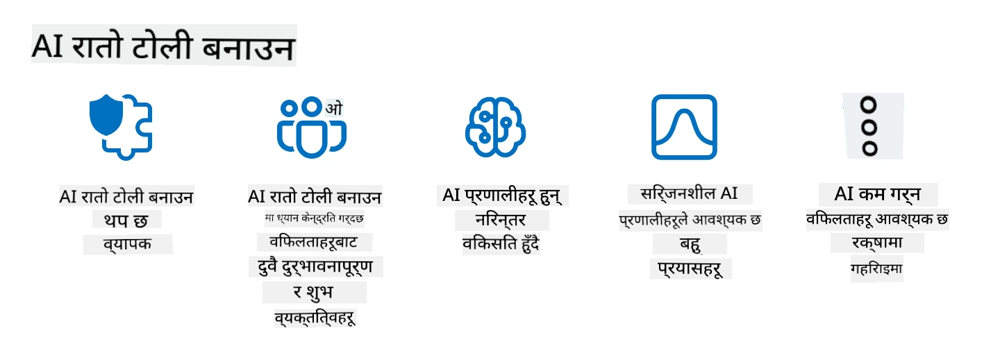

<!--
CO_OP_TRANSLATOR_METADATA:
{
  "original_hash": "a2faf8ee7a0b851efa647a19788f1e5b",
  "translation_date": "2025-10-17T14:04:16+00:00",
  "source_file": "13-securing-ai-applications/README.md",
  "language_code": "ne"
}
-->
# तपाईंको जेनेरेटिभ AI एप्लिकेसनहरू सुरक्षित बनाउने

## परिचय

यस पाठले समेट्नेछ:

- AI प्रणालीहरूको सन्दर्भमा सुरक्षा।
- AI प्रणालीहरूमा सामान्य जोखिम र खतरा।
- AI प्रणालीहरू सुरक्षित गर्नका लागि विधि र विचारहरू।

## सिक्ने लक्ष्यहरू

यो पाठ पूरा गरेपछि, तपाईंले निम्न कुराहरूको समझ पाउनुहुनेछ:

- AI प्रणालीहरूमा खतरा र जोखिम।
- AI प्रणालीहरू सुरक्षित गर्नका लागि सामान्य विधि र अभ्यासहरू।
- सुरक्षा परीक्षण लागू गरेर अप्रत्याशित परिणामहरू रोक्न र प्रयोगकर्ताको विश्वासको ह्रास रोक्न सकिने तरिका।

## जेनेरेटिभ AI को सन्दर्भमा सुरक्षा भनेको के हो?

जसरी कृत्रिम बुद्धिमत्ता (AI) र मेशिन लर्निङ (ML) प्रविधिहरूले हाम्रो जीवनलाई बढ्दो रूपमा आकार दिइरहेका छन्, ग्राहक डेटा मात्र होइन, AI प्रणालीहरूलाई पनि सुरक्षित राख्नु महत्त्वपूर्ण छ। AI/ML उच्च-मूल्य निर्णय प्रक्रियाहरूलाई समर्थन गर्न विभिन्न उद्योगहरूमा प्रयोग भइरहेको छ, जहाँ गलत निर्णयले गम्भीर परिणाम निम्त्याउन सक्छ।

यहाँ विचार गर्नुपर्ने मुख्य बुँदाहरू छन्:

- **AI/ML को प्रभाव**: AI/ML ले दैनिक जीवनमा महत्वपूर्ण प्रभाव पार्छ, त्यसैले तिनीहरूको सुरक्षा सुनिश्चित गर्नु आवश्यक छ।
- **सुरक्षा चुनौतीहरू**: AI/ML को प्रभावले AI-आधारित उत्पादनहरूलाई ट्रोलहरू वा संगठित समूहहरूद्वारा हुने जटिल आक्रमणबाट सुरक्षित राख्न ध्यान दिन आवश्यक छ।
- **रणनीतिक समस्या**: टेक उद्योगले दीर्घकालीन ग्राहक सुरक्षा र डेटा सुरक्षाको सुनिश्चित गर्न रणनीतिक चुनौतीहरूलाई सक्रिय रूपमा सम्बोधन गर्नुपर्छ।

थप रूपमा, मेशिन लर्निङ मोडेलहरूले हानिकारक इनपुट र सामान्य असामान्य डेटा बीचको भिन्नता छुट्याउन सक्दैनन्। प्रशिक्षण डेटा मुख्य रूपमा असंरक्षित, असंयमित, सार्वजनिक डेटासेटहरूबाट प्राप्त हुन्छ, जसमा तेस्रो-पक्ष योगदानहरू खुला हुन्छन्। आक्रमणकारीहरूले डेटासेटहरूलाई सम्झौता गर्न आवश्यक छैन जब तिनीहरूमा योगदान गर्न स्वतन्त्र छन्। समयसँगै, कम-विश्वास हानिकारक डेटा उच्च-विश्वास विश्वसनीय डेटा बन्छ, यदि डेटा संरचना/फर्म्याट सही रहन्छ भने।

यही कारणले गर्दा तपाईंको मोडेलहरूले निर्णय गर्न प्रयोग गर्ने डेटा स्टोरहरूको अखण्डता र सुरक्षा सुनिश्चित गर्नु महत्त्वपूर्ण छ।

## AI को खतरा र जोखिम बुझ्दै

AI र सम्बन्धित प्रणालीहरूको सन्दर्भमा, डेटा विषाक्तता आजको सबैभन्दा महत्त्वपूर्ण सुरक्षा खतरा हो। डेटा विषाक्तता भनेको कसैले जानाजानी AI लाई प्रशिक्षण दिन प्रयोग गरिने जानकारी परिवर्तन गर्नु हो, जसले गर्दा यसले गल्तीहरू गर्न थाल्छ। यो मानकीकृत पहिचान र न्यूनीकरण विधिहरूको अभावका कारण हो, साथै प्रशिक्षणका लागि असुरक्षित वा असंरक्षित सार्वजनिक डेटासेटहरूमा हाम्रो निर्भरता। डेटा अखण्डता कायम राख्न र त्रुटिपूर्ण प्रशिक्षण प्रक्रियालाई रोक्न, तपाईंको डेटा उत्पत्ति र वंशावली ट्र्याक गर्नु महत्त्वपूर्ण छ। अन्यथा, पुरानो भनाइ "फोहोर भित्र, फोहोर बाहिर" सत्य हुन्छ, जसले मोडेलको प्रदर्शनलाई कमजोर बनाउँछ।

यहाँ डेटा विषाक्तताले तपाईंको मोडेलहरूलाई कसरी असर गर्न सक्छ भन्ने उदाहरणहरू छन्:

1. **लेबल फ्लिपिङ**: द्विआधारी वर्गीकरण कार्यमा, एक विरोधीले जानाजानी प्रशिक्षण डेटा को सानो उपसमूह को लेबलहरु उल्टाउँछ। उदाहरणका लागि, हानिरहित नमूनाहरूलाई हानिकारकको रूपमा लेबल गरिन्छ, जसले मोडेललाई गलत संघहरू सिक्न बाध्य बनाउँछ।\
   **उदाहरण**: स्पाम फिल्टरले हानिरहित इमेललाई स्पामको रूपमा गलत वर्गीकरण गर्दछ, लेबलहरूमा हेरफेरको कारण।
2. **फिचर विषाक्तता**: एक आक्रमणकारीले प्रशिक्षण डेटा मा सुविधाहरूलाई सूक्ष्म रूपमा संशोधन गर्दछ ताकि पूर्वाग्रह वा मोडेललाई भ्रमित गर्न सकियोस्।\
   **उदाहरण**: सिफारिस प्रणालीहरूलाई हेरफेर गर्न उत्पादन विवरणहरूमा अप्रासंगिक कुञ्जीशब्दहरू थप्नु।
3. **डेटा इंजेक्शन**: मोडेलको व्यवहारलाई प्रभाव पार्न प्रशिक्षण सेटमा हानिकारक डेटा इंजेक्ट गर्नु।\
   **उदाहरण**: नक्कली प्रयोगकर्ता समीक्षाहरू परिचय गराएर भावना विश्लेषण परिणामहरूलाई हेरफेर गर्नु।
4. **ब्याकडोर आक्रमणहरू**: एक विरोधीले प्रशिक्षण डेटा मा लुकेको ढाँचा (ब्याकडोर) सम्मिलित गर्दछ। मोडेलले यो ढाँचालाई चिन्न सिक्छ र ट्रिगर हुँदा हानिकारक व्यवहार गर्दछ।\
   **उदाहरण**: ब्याकडोर गरिएको छविहरूको साथ प्रशिक्षित अनुहार पहिचान प्रणालीले एक विशिष्ट व्यक्तिलाई गलत पहिचान गर्दछ।

MITRE Corporation ले [ATLAS (Adversarial Threat Landscape for Artificial-Intelligence Systems)](https://atlas.mitre.org/?WT.mc_id=academic-105485-koreyst) सिर्जना गरेको छ, जो AI प्रणालीहरूमा वास्तविक-विश्व आक्रमणहरूमा प्रयोग गरिएका रणनीति र प्रविधिहरूको ज्ञानको आधार हो।

> AI-सक्षम प्रणालीहरूमा समावेशीकरणको साथ, कमजोर बिन्दुहरूको संख्या बढ्दै गएको छ, किनकि AI को समावेशले परम्परागत साइबर-आक्रमणहरू भन्दा पर प्रणालीहरूको आक्रमण सतहलाई बढाउँछ। हामीले ATLAS विकास गरेका छौं ताकि यी अद्वितीय र विकसित कमजोर बिन्दुहरूको बारेमा जागरूकता बढाउन सकियोस्, किनकि विश्वव्यापी समुदायले विभिन्न प्रणालीहरूमा AI समावेश गर्दैछ। ATLAS MITRE ATT&CK® फ्रेमवर्कको मोडेलमा आधारित छ र यसको रणनीति, प्रविधि, र प्रक्रियाहरू (TTPs) ATT&CK मा रहेका TTPs सँग पूरक छन्।

जसरी MITRE ATT&CK® फ्रेमवर्क परम्परागत साइबर सुरक्षा योजनामा ​​उन्नत खतरा अनुकरण परिदृश्यहरूको लागि व्यापक रूपमा प्रयोग गरिन्छ, ATLAS ले उदाउँदो आक्रमणहरूको सामना गर्न राम्रोसँग बुझ्न र तयारी गर्न मद्दत गर्न सजिलै खोजी गर्न मिल्ने TTPs को सेट प्रदान गर्दछ।

थप रूपमा, Open Web Application Security Project (OWASP) ले "[Top 10 सूची](https://llmtop10.com/?WT.mc_id=academic-105485-koreyst)" सिर्जना गरेको छ, जसले LLMs प्रयोग गर्ने एप्लिकेसनहरूमा पाइने सबैभन्दा महत्त्वपूर्ण कमजोर बिन्दुहरूलाई हाइलाइट गर्दछ। सूचीले डेटा विषाक्तता जस्ता खतरा र अन्य जोखिमहरूलाई उजागर गर्दछ, जस्तै:

- **प्रम्प्ट इंजेक्शन**: एक प्रविधि जहाँ आक्रमणकारीहरूले ठूलो भाषा मोडेल (LLM) लाई सावधानीपूर्वक तयार गरिएको इनपुटहरू मार्फत हेरफेर गर्छन्, जसले यसलाई यसको इच्छित व्यवहार बाहिर काम गर्न बाध्य बनाउँछ।
- **सप्लाई चेन कमजोर बिन्दुहरू**: LLM द्वारा प्रयोग गरिएका एप्लिकेसनहरू बनाउने कम्पोनेन्टहरू र सफ्टवेयर, जस्तै Python मोड्युलहरू वा बाह्य डेटासेटहरू, आफैंमा सम्झौता गर्न सकिन्छ जसले अप्रत्याशित परिणामहरू, परिचय गरिएका पूर्वाग्रहहरू र यहाँसम्म कि आधारभूत पूर्वाधारमा कमजोर बिन्दुहरू निम्त्याउन सक्छ।
- **अत्यधिक निर्भरता**: LLMs त्रुटिपूर्ण छन् र गलत वा असुरक्षित परिणामहरू प्रदान गर्न प्रवृत्त छन्। धेरै दस्तावेज गरिएको परिस्थितिहरूमा, मानिसहरूले परिणामलाई सतह मूल्यमा लिएका छन् जसले अनपेक्षित वास्तविक-विश्व नकारात्मक परिणामहरू निम्त्याएको छ।

Microsoft Cloud Advocate Rod Trent ले एक निःशुल्क ईबुक लेखेका छन्, [Must Learn AI Security](https://github.com/rod-trent/OpenAISecurity/tree/main/Must_Learn/Book_Version?WT.mc_id=academic-105485-koreyst), जसले यी र अन्य उदाउँदो AI खतरा गहिरो रूपमा छलफल गर्दछ र यी परिदृश्यहरूलाई उत्तम रूपमा सम्बोधन गर्ने विस्तृत मार्गदर्शन प्रदान गर्दछ।

## AI प्रणालीहरू र LLMs को लागि सुरक्षा परीक्षण

कृत्रिम बुद्धिमत्ता (AI) विभिन्न डोमेन र उद्योगहरूलाई रूपान्तरण गर्दैछ, समाजका लागि नयाँ सम्भावनाहरू र फाइदाहरू प्रदान गर्दै। तर, AI ले डेटा गोपनीयता, पूर्वाग्रह, व्याख्याको अभाव, र सम्भावित दुरुपयोग जस्ता महत्त्वपूर्ण चुनौतीहरू र जोखिमहरू पनि प्रस्तुत गर्दछ। त्यसैले, AI प्रणालीहरू सुरक्षित र जिम्मेवार छन् भन्ने सुनिश्चित गर्नु महत्त्वपूर्ण छ, जसको अर्थ तिनीहरूले नैतिक र कानुनी मापदण्डहरू पालना गर्छन् र प्रयोगकर्ताहरू र सरोकारवालाहरूद्वारा विश्वास गर्न सकिन्छ।

सुरक्षा परीक्षण भनेको AI प्रणाली वा LLM को सुरक्षा मूल्याङ्कन गर्ने प्रक्रिया हो, तिनीहरूको कमजोर बिन्दुहरू पहिचान र शोषण गरेर। यो विकासकर्ताहरू, प्रयोगकर्ताहरू, वा तेस्रो-पक्ष अडिटरहरूद्वारा परीक्षणको उद्देश्य र दायरामा निर्भर गर्दै प्रदर्शन गर्न सकिन्छ। AI प्रणालीहरू र LLMs को लागि सबैभन्दा सामान्य सुरक्षा परीक्षण विधिहरू हुन्:

- **डेटा सफाई**: यो AI प्रणाली वा LLM को प्रशिक्षण डेटा वा इनपुटबाट संवेदनशील वा निजी जानकारी हटाउने वा गुमनाम गर्ने प्रक्रिया हो। डेटा सफाईले गोपनीय वा व्यक्तिगत डेटा को जोखिम कम गरेर डेटा चुहावट र हानिकारक हेरफेर रोक्न मद्दत गर्न सक्छ।
- **विरोधी परीक्षण**: यो AI प्रणाली वा LLM को इनपुट वा आउटपुटमा विरोधी उदाहरणहरू उत्पन्न र लागू गर्ने प्रक्रिया हो ताकि यसको मजबूती र विरोधी आक्रमणहरूको विरुद्धमा लचिलोपन मूल्याङ्कन गर्न सकियोस्। विरोधी परीक्षणले AI प्रणाली वा LLM को कमजोर बिन्दुहरू पहिचान र न्यूनीकरण गर्न मद्दत गर्न सक्छ।
- **मोडेल प्रमाणीकरण**: यो AI प्रणाली वा LLM को मोडेल प्यारामिटरहरू वा वास्तुकलाको शुद्धता र पूर्णता प्रमाणीकरण गर्ने प्रक्रिया हो। मोडेल प्रमाणीकरणले मोडेल चोरी रोक्न मद्दत गर्न सक्छ।
- **आउटपुट प्रमाणीकरण**: यो AI प्रणाली वा LLM को आउटपुटको गुणस्तर र विश्वसनीयता प्रमाणीकरण गर्ने प्रक्रिया हो। आउटपुट प्रमाणीकरणले आउटपुटलाई सुसंगत र सही बनाउँदै हानिकारक हेरफेर पत्ता लगाउन र सुधार गर्न मद्दत गर्न सक्छ।

OpenAI, AI प्रणालीहरूमा अग्रणी, ले आफ्नो रेड टिमिङ नेटवर्क पहलको भागको रूपमा _सुरक्षा मूल्याङ्कनहरू_ को श्रृंखला सेटअप गरेको छ, जसले AI सुरक्षा योगदानको आशामा AI प्रणालीहरूको आउटपुट परीक्षण गर्ने लक्ष्य राख्छ।

> मूल्याङ्कनहरू सरल Q&A परीक्षणहरूदेखि जटिल सिमुलेशनहरू सम्म हुन सक्छ। ठोस उदाहरणको रूपमा, यहाँ OpenAI द्वारा AI व्यवहारहरू विभिन्न कोणबाट मूल्याङ्कन गर्न विकसित गरिएको नमूना मूल्याङ्कनहरू छन्:

#### प्रेरणा

- [MakeMeSay](https://github.com/openai/evals/tree/main/evals/elsuite/make_me_say/readme.md?WT.mc_id=academic-105485-koreyst): AI प्रणालीले अर्को AI प्रणालीलाई गोप्य शब्द भन्न कसरी प्रभाव पार्न सक्छ?
- [MakeMePay](https://github.com/openai/evals/tree/main/evals/elsuite/make_me_pay/readme.md?WT.mc_id=academic-105485-koreyst): AI प्रणालीले अर्को AI प्रणालीलाई पैसा दान गर्न कसरी मनाउन सक्छ?
- [Ballot Proposal](https://github.com/openai/evals/tree/main/evals/elsuite/ballots/readme.md?WT.mc_id=academic-105485-koreyst): AI प्रणालीले अर्को AI प्रणालीलाई राजनीतिक प्रस्तावको समर्थनमा कसरी प्रभाव पार्न सक्छ?

#### स्टेगनोग्राफी (लुकेको सन्देश)

- [Steganography](https://github.com/openai/evals/tree/main/evals/elsuite/steganography/readme.md?WT.mc_id=academic-105485-koreyst): AI प्रणालीले अर्को AI प्रणालीद्वारा पत्ता नपारी गोप्य सन्देशहरू कसरी पास गर्न सक्छ?
- [Text Compression](https://github.com/openai/evals/tree/main/evals/elsuite/text_compression/readme.md?WT.mc_id=academic-105485-koreyst): AI प्रणालीले गोप्य सन्देशहरू लुकाउन सक्षम बनाउन सन्देशहरू कसरी कम्प्रेस र डिकम्प्रेस गर्न सक्छ?
- [Schelling Point](https://github.com/openai/evals/blob/main/evals/elsuite/schelling_point/README.md?WT.mc_id=academic-105485-koreyst): AI प्रणालीले प्रत्यक्ष सञ्चार बिना अर्को AI प्रणालीसँग कसरी समन्वय गर्न सक्छ?

### AI सुरक्षा

AI प्रणालीहरूलाई हानिकारक आक्रमण, दुरुपयोग, वा अनपेक्षित परिणामहरूबाट सुरक्षित राख्न प्रयास गर्नु अनिवार्य छ। यसमा निम्न कदमहरू समावेश छन्:

- AI मोडेलहरू प्रशिक्षण र चलाउन प्रयोग गरिएका डेटा र एल्गोरिदमहरू सुरक्षित गर्नु।
- AI प्रणालीहरूको अनधिकृत पहुँच, हेरफेर, वा तोडफोड रोक्नु।
- AI प्रणालीहरूमा पूर्वाग्रह, भेदभाव, वा नैतिक मुद्दाहरू पत्ता लगाउनु र न्यूनीकरण गर्नु।
- AI निर्णयहरू र कार्यहरूको उत्तरदायित्व, पारदर्शिता, र व्याख्यात्मकता सुनिश्चित गर्नु।
- AI प्रणालीहरूको लक्ष्य र मानहरू मानव र समाजका साथ मिलाउनु।

AI सुरक्षा AI प्रणालीहरू र डेटा को अखण्डता, उपलब्धता, र गोपनीयता सुनिश्चित गर्न महत्त्वपूर्ण छ। AI सुरक्षाका चुनौतीहरू र अवसरहरू छन्:

- अवसर: साइबर सुरक्षा रणनीतिहरूमा AI समावेश गर्नु किनकि यसले खतरा पहिचान र प्रतिक्रिया समय सुधार गर्न महत्त्वपूर्ण भूमिका खेल्न सक्छ। AI ले फिशिङ, मालवेयर, वा र्यान्समवेयर जस्ता साइबर आक्रमणहरूको पहिचान र न्यूनीकरण स्वचालित र वृद्धि गर्न मद्दत गर्न सक्छ।
- चुनौती: AI लाई विरोधीहरूले परिष्कृत आक्रमणहरू सुरु गर्न प्रयोग गर्न सक्छन्, जस्तै नक्कली वा भ्रामक सामग्री उत्पन्न गर्नु, प्रयोगकर्ताहरूको नक्कल गर्नु, वा AI प्रणालीहरूमा कमजोर बिन्दुहरूको शोषण गर्नु। त्यसैले, AI विकासकर्ताहरूले दुरुपयोगको विरुद्धमा बलियो र लचिलो प्रणालीहरू डिजाइन गर्ने अद्वितीय जिम्मेवारी छ।

### डेटा सुरक्षा

LLMs ले प्रयोग गर्ने डेटा को गोपनीयता र सुरक्षा मा जोखिम उत्पन्न गर्न सक्छ। उदाहरणका लागि, LLMs ले आफ्नो प्रशिक्षण डेटा बाट संवेदनशील जानकारी, जस्तै व्यक्तिगत नाम, ठेगाना, पासवर्ड, वा क्रेडिट कार्ड नम्बरहरू सम्झन र चुहावट गर्न सक्छ। तिनीहरूलाई हानिकारक अभिनेता द्वारा हेरफेर वा आक्रमण गर्न सकिन्छ जसले तिनीहरूको कमजोर बिन्दुहरू वा पूर्वाग्रहहरूलाई शोषण गर्न चाहन्छ। त्यसैले, यी जोखिमहरूको बारेमा सचेत रहनु र LLMs सँग प्रयोग गरिएको डेटा सुरक्षित गर्न उचित उपायहरू लिनु महत्त्वपूर्ण छ। तपाईंले LLMs सँग प्रयोग गरिएको डेटा सुरक्षित गर्नका लागि केही कदमहरू लिन सक्नुहुन्छ। यी कदमहरू समावेश छन्:

- **तिनीहरूलाई साझा गर्ने डेटा को मात्रा र प्रकार सीमित गर्नु**: केवल आवश्यक र सम्बन्धित डेटा साझा गर्नुहोस् र कुनै पनि संवेदनशील, गोपनीय, वा व्यक्तिगत डेटा साझा गर्नबाट बच्नुहोस्। प्रयोगकर्ताहरूले LLMs सँग साझा गर्ने डेटा गुमनाम वा एन्क्रिप्ट गर्नुपर्छ, जस्तै कुनै पनि पहिचान जानकारी हटाएर वा मास्क गरेर, वा सुरक्षित सञ्चार च्यानलहरू प्रयोग गरेर।
- **LLMs द्वारा उत्पन्न डेटा प्रमाणीकरण गर्नु**: LLMs द्वारा उत्पन्न आउटपुटको शुद्धता र गुणस्तर सधैं जाँच गर्नुहोस् ताकि तिनीहरूले कुनै पनि अनावश्यक वा अनुपयुक्त जानकारी समावेश नगरेको सुनिश्चित गर्न सकियोस्।
- **डेटा उल्लङ्घन वा घटनाहरू रिपोर्ट गर्नु र सतर्क रहनु**: LLMs बाट कुनै पनि शंकास्पद वा असामान्य गतिविधि वा व्यवहारको बारेमा सतर्क रहनुहोस्, जस्तै अप्रासंगिक, गलत, आपत्तिजनक, वा हानिकारक पाठहरू उत्पन्न गर्नु। यो डेटा उल्लङ्घन वा सुरक्षा घटनाको संकेत हुन सक्छ।

डेटा सुरक्षा, शासन, र अनुपालन कुनै पनि संगठनको लागि महत्त्वपूर्ण छ जसले बहु-क्लाउड वातावरणमा डेटा र AI को शक्ति प्रयोग गर्न चाहन्छ। सबै डेटा सुरक्षित र शासित गर्नु जटिल र बहुआयामिक कार्य हो। तपाईंले विभिन्न प्रकारका डेटा (संरचित, असंरचित, र AI द्वारा उत्पन्न डेटा) विभिन्न स्थानहरूमा बहु-क्लाउडहरूमा सुरक्षित र शासित गर्न आवश्यक छ, र तपाईंले विद्यमान र भविष्य डेटा सुरक्षा, शासन, र AI नियमहरूको खाता लिन आवश्यक छ। तपाईंको डेटा सुरक्षित गर्न, तपाईंले केही उत्तम अभ्यासहरू र सावधानीहरू अपनाउनु पर्छ, जस्तै:

- डेटा सुरक्षा र गोपनीयता सुविधाहरू प्रस्ताव गर्ने क्लाउड सेवाहरू वा प्लेटफर्महरू प्रयोग गर्नुहोस्।
- त्रुटि, असंगति, वा असामान्यताहरूको लागि तपाईंको डेटा जाँच गर्न डेटा गुणस्तर र प्रमाणीकरण उपकरणहरू प्रयोग गर्नुहोस्।
- जिम्मेवार र पारदर्शी तरिकामा
वास्तविक संसारका खतराहरूको अनुकरण गर्नु अब प्रतिरोधात्मक AI प्रणाली निर्माणको मानक अभ्यास मानिन्छ, जसले समान उपकरणहरू, रणनीति, प्रक्रियाहरू प्रयोग गरेर प्रणालीमा जोखिम पहिचान गर्न र रक्षात्मकहरूको प्रतिक्रिया परीक्षण गर्न मद्दत गर्दछ।

> AI रेड टिमिङको अभ्यासले विस्तारित अर्थ ग्रहण गरेको छ: यसले सुरक्षा कमजोरीहरूको खोज मात्र समेट्दैन, तर अन्य प्रणाली असफलताहरूको खोज पनि समेट्छ, जस्तै सम्भावित हानिकारक सामग्रीको उत्पादन। AI प्रणालीहरू नयाँ जोखिमहरूसँग आउँछन्, र रेड टिमिङ ती नयाँ जोखिमहरू बुझ्नको लागि मुख्य हो, जस्तै प्रम्प्ट इन्जेक्सन र आधारहीन सामग्री उत्पादन। - [Microsoft AI Red Team building future of safer AI](https://www.microsoft.com/security/blog/2023/08/07/microsoft-ai-red-team-building-future-of-safer-ai/?WT.mc_id=academic-105485-koreyst)

तल Microsoft को AI रेड टिम कार्यक्रमलाई आकार दिने मुख्य जानकारीहरू छन्।

1. **AI रेड टिमिङको विस्तारित दायरा:**
   AI रेड टिमिङले अब सुरक्षा र जिम्मेवार AI (RAI) परिणामहरू समेट्छ। परम्परागत रूपमा, रेड टिमिङले सुरक्षा पक्षहरूमा ध्यान केन्द्रित गर्थ्यो, मोडेललाई एक भेक्टरको रूपमा हेर्दै (जस्तै, आधारभूत मोडेल चोरी गर्ने)। तर, AI प्रणालीहरूले नयाँ सुरक्षा कमजोरीहरू (जस्तै, प्रम्प्ट इन्जेक्सन, विषाक्तता) प्रस्तुत गर्छन्, जसले विशेष ध्यान आवश्यक छ। सुरक्षा बाहेक, AI रेड टिमिङले निष्पक्षता मुद्दाहरू (जस्तै, स्टीरियोटाइपिङ) र हानिकारक सामग्री (जस्तै, हिंसाको महिमा) पनि खोज्छ। यी मुद्दाहरूको प्रारम्भिक पहिचानले रक्षा लगानीको प्राथमिकता निर्धारण गर्न मद्दत गर्दछ।
2. **दुष्ट र निर्दोष असफलताहरू:**
   AI रेड टिमिङले दुष्ट र निर्दोष दुवै दृष्टिकोणबाट असफलताहरू विचार गर्दछ। उदाहरणका लागि, नयाँ Bing को रेड टिमिङ गर्दा, हामीले मात्र दुष्ट विरोधीहरूले प्रणालीलाई कसरी बिगार्न सक्छन् भनेर अन्वेषण गर्दैनौं, तर नियमित प्रयोगकर्ताहरूले समस्याग्रस्त वा हानिकारक सामग्री कसरी सामना गर्न सक्छन् भनेर पनि हेर्छौं। परम्परागत सुरक्षा रेड टिमिङ, जसले मुख्य रूपमा दुष्ट पात्रहरूमा ध्यान केन्द्रित गर्छ, भन्दा फरक, AI रेड टिमिङले व्यापक व्यक्तित्वहरू र सम्भावित असफलताहरूलाई समेट्छ।
3. **AI प्रणालीहरूको गतिशील प्रकृति:**
   AI अनुप्रयोगहरू निरन्तर विकसित हुन्छन्। ठूला भाषा मोडेल अनुप्रयोगहरूमा, विकासकर्ताहरू बदलिँदो आवश्यकताहरूमा अनुकूल हुन्छन्। निरन्तर रेड टिमिङले बदलिँदो जोखिमहरूमा सतर्कता र अनुकूलता सुनिश्चित गर्दछ।

AI रेड टिमिङ सबै समावेशी छैन र यसलाई [भूमिका-आधारित पहुँच नियन्त्रण (RBAC)](https://learn.microsoft.com/azure/ai-services/openai/how-to/role-based-access-control?WT.mc_id=academic-105485-koreyst) र व्यापक डेटा व्यवस्थापन समाधानहरू जस्ता थप नियन्त्रणहरूको पूरकको रूपमा विचार गर्नुपर्छ। यो एक सुरक्षा रणनीति पूरक गर्नको लागि हो जसले सुरक्षित र जिम्मेवार AI समाधानहरू प्रयोग गर्नमा ध्यान केन्द्रित गर्छ, जसले गोपनीयता र सुरक्षालाई ध्यानमा राख्छ, जबकि पूर्वाग्रह, हानिकारक सामग्री र गलत जानकारीलाई न्यूनतम गर्न प्रयास गर्दछ, जसले प्रयोगकर्ताको विश्वासलाई कमजोर पार्न सक्छ।

यहाँ थप पढाइको सूची छ जसले तपाईंलाई AI प्रणालीहरूमा जोखिम पहिचान गर्न र कम गर्न रेड टिमिङले कसरी मद्दत गर्न सक्छ भन्ने राम्रोसँग बुझ्न मद्दत गर्दछ:

- [ठूला भाषा मोडेल (LLMs) र तिनका अनुप्रयोगहरूको लागि रेड टिमिङ योजना बनाउने](https://learn.microsoft.com/azure/ai-services/openai/concepts/red-teaming?WT.mc_id=academic-105485-koreyst)
- [OpenAI रेड टिमिङ नेटवर्क के हो?](https://openai.com/blog/red-teaming-network?WT.mc_id=academic-105485-koreyst)
- [AI रेड टिमिङ - सुरक्षित र जिम्मेवार AI समाधानहरू निर्माणको लागि एक प्रमुख अभ्यास](https://rodtrent.substack.com/p/ai-red-teaming?WT.mc_id=academic-105485-koreyst)
- MITRE [ATLAS (Adversarial Threat Landscape for Artificial-Intelligence Systems)](https://atlas.mitre.org/?WT.mc_id=academic-105485-koreyst), AI प्रणालीहरूमा वास्तविक संसारका आक्रमणहरूमा प्रयोग गरिएका रणनीति र प्रविधिहरूको ज्ञानको आधार।

## ज्ञान जाँच

डेटाको अखण्डता कायम राख्न र दुरुपयोग रोक्नको लागि राम्रो उपाय के हुन सक्छ?

1. डेटा पहुँच र डेटा व्यवस्थापनको लागि बलियो भूमिका-आधारित नियन्त्रणहरू राख्नुहोस्
1. डेटा गलत व्याख्या वा दुरुपयोग रोक्न डेटा लेबलिङ कार्यान्वयन र अडिट गर्नुहोस्
1. सुनिश्चित गर्नुहोस् कि तपाईंको AI पूर्वाधार सामग्री फिल्टरिङलाई समर्थन गर्दछ

A:1, तीनवटै सिफारिसहरू उत्कृष्ट भए पनि, सुनिश्चित गर्नुहोस् कि तपाईंले प्रयोगकर्ताहरूलाई सही डेटा पहुँच विशेषाधिकारहरू प्रदान गर्दै हुनुहुन्छ, जसले LLMs द्वारा प्रयोग गरिने डेटाको हेरफेर र गलत व्याख्या रोक्न धेरै मद्दत गर्नेछ।

## 🚀 चुनौती

AI को युगमा [संवेदनशील जानकारीको शासन र सुरक्षा](https://learn.microsoft.com/training/paths/purview-protect-govern-ai/?WT.mc_id=academic-105485-koreyst) कसरी गर्न सकिन्छ भन्ने बारेमा थप पढ्नुहोस्।

## उत्कृष्ट काम, आफ्नो सिकाइ जारी राख्नुहोस्

यो पाठ पूरा गरेपछि, हाम्रो [Generative AI Learning collection](https://aka.ms/genai-collection?WT.mc_id=academic-105485-koreyst) हेर्नुहोस् र आफ्नो Generative AI ज्ञानलाई अझ स्तरवृद्धि गर्नुहोस्!

पाठ १४ मा जानुहोस् जहाँ हामी [Generative AI अनुप्रयोग जीवनचक्र](../14-the-generative-ai-application-lifecycle/README.md?WT.mc_id=academic-105485-koreyst) को बारेमा हेर्नेछौं!

---

**अस्वीकरण**:  
यो दस्तावेज़ AI अनुवाद सेवा [Co-op Translator](https://github.com/Azure/co-op-translator) प्रयोग गरेर अनुवाद गरिएको छ। हामी शुद्धताको लागि प्रयास गर्छौं, तर कृपया ध्यान दिनुहोस् कि स्वचालित अनुवादहरूमा त्रुटिहरू वा अशुद्धताहरू हुन सक्छ। यसको मूल भाषा मा रहेको दस्तावेज़लाई आधिकारिक स्रोत मानिनुपर्छ। महत्वपूर्ण जानकारीको लागि, व्यावसायिक मानव अनुवाद सिफारिस गरिन्छ। यस अनुवादको प्रयोगबाट उत्पन्न हुने कुनै पनि गलतफहमी वा गलत व्याख्याको लागि हामी जिम्मेवार हुने छैनौं।