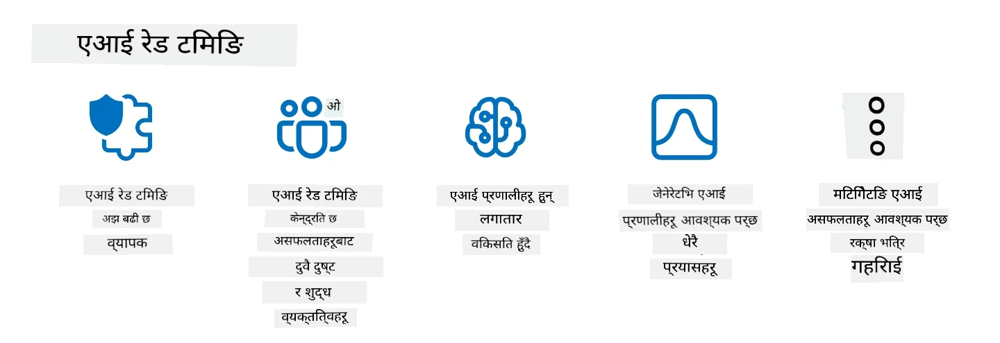

# तपाईँको जनरेटिभ AI अनुप्रयोगहरू सुरक्षा गर्ने

## परिचय

यस पाठले समेट्ने छ:

- AI प्रणालीहरूको सन्दर्भमा सुरक्षा।
- AI प्रणालीहरूमा सामान्य जोखिम र खतरा।
- AI प्रणालीहरूलाई सुरक्षित राख्नका लागि विधिहरू र विचारहरू।

## सिकाइका लक्ष्यहरू

यो पाठ पूरा गरेपछि, तपाईँसँग यी कुराहरूको बुझाइ हुनेछ:

- AI प्रणालीहरूमा खतरा र जोखिमहरू।
- AI प्रणालीहरू सुरक्षित राख्न सामान्य विधिहरू र अभ्यासहरू।
- सुरक्षा परीक्षण लागू गर्दा कसरी अप्रत्याशित परिणामहरू र प्रयोगकर्ता विश्वासको क्षय रोक्न सकिन्छ।

## जनरेटिभ AI को सन्दर्भमा सुरक्षा भनेको के हो?

कृत्रिम बुद्धिमत्ता (AI) र मेसिन लर्निङ (ML) प्रविधिहरूले हाम्रो जीवनलाई बढ्दो रूपमा आकार दिँदै गर्दा, ग्राहक डाटाबाहेक AI प्रणालीहरूको पनि सुरक्षा अत्यावश्यक छ। AI/ML उच्च-मूल्य निर्णय प्रक्रियाहरूमा प्रयोग हुँदैछ जहाँ गलत निर्णयले गम्भीर परिणामहरू निम्त्याउन सक्छ।

विचार गर्ने मुख्य बुँदाहरू यस्ता छन्:

- **AI/ML को प्रभाव**: AI/ML को दैनिक जीवनमा ठूलो प्रभाव छ र तीलाई सुरक्षित राख्नु आवश्यक छ।
- **सुरक्षा चुनौतीहरू**: AI/ML को प्रभावका कारण AI आधारित उत्पादनहरूलाई जटिल आक्रमणहरूबाट सुरक्षा गर्न आवश्यक छ, चाहे त्यो ट्रोलहरू द्वारा होस् या सङ्गठित समूहहरूले।
- **रणनीतिक समस्याहरू**: प्रविधि उद्योगले दीर्घकालीन ग्राहक सुरक्षा र डाटा सुरक्षा सुनिश्चित गर्न रणनीतिक चुनौतीहरूलाई सक्रिय रूपमा सम्बोधन गर्नुपर्छ।

थप रूपमा, मेसिन लर्निङ मोडेलहरूले दुर्भावनापूर्ण इनपुट र सामान्य असामान्य डाटा बीच पहिचान गर्न सक्दैनन्। प्रशिक्षण डाटा प्रायः अनियन्त्रित, अनमोडरेटेड सार्वजनिक डेटासेटहरूबाट आउँछ, जुन तेस्रो पक्षले वृहत योगदान गर्न सक्छन्। आक्रमणकारीहरूले डेटासेटलाई जोखिममा पार्न आवश्यक छैन जब उनीहरू स्वतन्त्ररूपमा योगदान गर्न सक्छन्। समयक्रममा कम विश्वासयोग्य दुर्भावनापूर्ण डाटा उच्च विश्वासयोग्य विश्वस्त डाटा बन्न सक्छ, यदि डाटा संरचना/ढाँचा सही भएमा।

त्यसैले तपाईँको मोडेलहरूले निर्णय गर्न प्रयोग गर्ने डाटाको अखण्डता र सुरक्षा सुनिश्चित गर्नु अत्यन्त जरुरी छ।

## AI को खतरा र जोखिमको बुझाइ

AI र सम्बन्धित प्रणालीहरूको सन्दर्भमा, डाटा पोइजनिङ सबैभन्दा महत्त्वपूर्ण सुरक्षा खतरा हो। डाटा पोइजनिङ भनेको कसैले जानसुझाएर AI प्रशिक्षणमा प्रयोग हुने जानकारी परिवर्तन गर्नु हो, जसले गल्तीहरू निम्त्याउँछ। यसमा मानकीकृत पहिचान र न्यूनीकरण विधिहरूको अभाव छ, साथै हामी अपरिचित वा अनियन्त्रित सार्वजनिक डेटासेटहरूमा निर्भर छौं। डाटाको अखण्डता कायम राख्न र दोषपूर्ण प्रशिक्षण प्रक्रियाबाट बच्न डाटा उत्पत्तिको ट्र्याकिङ महत्वपूर्ण छ। नत्र पुरानो भनाइ “ग्यारेज इन, ग्यारेज आउट” साँचो हुन्छ र मोडेल प्रदर्शन बिग्रन्छ।

डाटा पोइजनिङले तपाईँका मोडेलहरूलाई कसरी असर पुर्‍याउन सक्छ भन्ने केही उदाहरणहरू यसप्रकार छन्:

1. **लेबल फ्लिपिङ**: दुईवटा वर्गीकरण कार्यमा, एक विपक्षीले जानसुझाएर थोरै प्रशिक्षण डाटा कोसेलीको लेबल उल्टाइदिन्छ। उदाहरणका लागि, साधारण नमुना दुर्भावनापूर्ण भनेर लेबल गरिन्छ, जसले मोडेललाई गलत सम्बन्ध सिक्न लगाउँछ।\
   **उदाहरण**: स्प्याम फिल्टरले प्रामाणिक इमेललाई स्प्याम भनेर गलत वर्गीकरण गर्नु।
2. **फिचर पोइजनिङ**: आक्रमणकारीले प्रशिक्षण डेटामा फिचरहरू अलिकति परिवर्तन गरी पक्षपात वा भ्रम सिर्जना गर्छ।\
   **उदाहरण**: सिफारिस प्रणालीहरूलाई प्रभाव पार्न उत्पादन विवरणमा अप्रासंगिक कुञ्जीशब्दहरू थप्नु।
3. **डाटा इन्जेक्सन**: प्रशिक्षण सेटमा दुर्भावनापूर्ण डाटा राखेर मोडेलको व्यवहार प्रभाबित पार्नु।\
   **उदाहरण**: भावना विश्लेषणलाई विकृत गर्न नकली प्रयोगकर्ता समीक्षाहरू पेश गर्नु।
4. **ब्याकडोर आक्रमणहरू**: विपक्षीले छिपाएको पैटर्न (ब्याकडोर) प्रशिक्षण डाटामा समावेश गर्छ। मोडेलले उक्त पैटर्न सिक्छ र ट्रिगर हुँदा दुर्भावनापूर्ण व्यवहार देखाउँछ।\
   **उदाहरण**: ब्याकडोर गरिएका तस्वीरहरूसँग प्रशिक्षण गरिएको अनुहार परिचय प्रणालीले विशिष्ट व्यक्तिलाई गलत चिन्नु।

MITRE कर्पोरेशनले [ATLAS (कृत्रिम बुद्धिमत्ता प्रणालीहरुको विरोधी खतरा परिदृश्य)](https://atlas.mitre.org/?WT.mc_id=academic-105485-koreyst) तयार गरेको छ, जसले वास्तविक-विश्वमा AI प्रणालीहरूमा विपक्षीहरूले प्रयोग गर्ने रणनीतिहरू र प्रविधिहरूको ज्ञान प्रस्तुत गर्छ।

> AI-सक्षम प्रणालीहरूमा जोखिमहरू बढिरहेकाले, एआई समावेशीकरणले परम्परागत साइबर-आक्रमणहरूभन्दा बाहिरको आक्रमण सतहलाई विस्तार गरेको छ। हामीले यी अनौठा र विकासशील जोखिमहरूबारे जागरुकता बढाउन ATLAS विकास गरेका छौं, जबकि विश्व समुदायले विभिन्न प्रणालीहरूमा AI समावेश गर्दैछ। ATLAS MITRE ATT&CK® ढाँचाको आधारमा तयार गरिएको हो र यसको रणनीतिहरू, प्रविधिहरू, र प्रक्रियाहरू (TTPs) ATT&CK का पूरक हुन्।

MITRE ATT&CK® ढाँचाले परम्परागत साइबरसुरक्षामा उन्नत खतरा अनुकरण परिदृश्य योजना बनाउँदा व्यापक रूपमा प्रयोग गरिन्छ, त्यसैगरी ATLAS ले सजिलै खोजिने TTPs सेट प्रदान गर्छ जसले उदाउँदो आक्रमणहरूको रक्षा गर्न अधिक राम्रो बुझाइ र तयारी गर्न मद्दत गर्छ।

थप रूपमा, Open Web Application Security Project (OWASP) ले LLMs प्रयोग गर्ने अनुप्रयोगहरूमा पाइएका सबैभन्दा महत्वपूर्ण जोखिमहरूको "[शीर्ष १० सूची](https://llmtop10.com/?WT.mc_id=academic-105485-koreyst)" तयार पारेको छ। यस सूचिले उल्लेखित डाटा पोइजनिङ जस्ता खतरा मात्र होइन, यसका साथै अन्य जोखिमहरूलाई पनि हाइलाइट गर्छ:

- **प्रॉम्प्ट इन्जेक्सन**: जहाँ आक्रमणकारीहरूले Large Language Model (LLM) लाई सावधानीपूर्वक तयार गरिएका इनपुटहरूमार्फत छल गर्ने तरिका, जसले मोडेललाई यसको अपेक्षित व्यवहारभन्दा बाहिर काम गर्न लगाउँछ।
- **सप्लाई चेन कमजोरियाँ**: LLM द्वारा प्रयोग गरिने अनुप्रयोगका कम्पोनेन्ट र सफ्टवेयरहरू, जस्तै Python मोड्युलहरू वा बाह्य डेटासेटहरू, जोखिममा परे अचानक नतिजा, पक्षपातहरू र आधारभूत पूर्वाधारमा कमजोरीहरू निम्त्याउन सक्छन्।
- **अत्यधिक निर्भरता**: LLM हरू त्रुटिपूर्ण हुन सक्छन् र कहिलेकाहीं काल्पनिक जवाफहरू दिन सक्छन्, जसले गलत वा असुरक्षित नतिजा दिन सक्छ। धेरै प्रलेखित अवस्थामा मानिसहरूले यी नतिजाहरूलाई सत्य मान्दै नकरात्मक वास्तविक परिणामहरू भोगेका छन्।

माइक्रोसफ्ट क्लाउड एड्भोकेट रोड ट्रेन्टले एउटा निःशुल्क ईबुक लेखेका छन्, [Must Learn AI Security](https://github.com/rod-trent/OpenAISecurity/tree/main/Must_Learn/Book_Version?WT.mc_id=academic-105485-koreyst), जसले यी र अन्य उदाउँदो AI खतराहरूमा गहिरो रुपमा चर्चा गर्छ र यी अवस्थामा कसरी सामना गर्ने भन्ने विस्तृत मार्गदर्शन दिन्छ।

## AI प्रणालीहरू र LLMs को लागि सुरक्षा परीक्षण

कृत्रिम बुद्धिमत्ता (AI) विभिन्न क्षेत्र र उद्योगहरूमा रुपान्तरण गर्दैछ, समाजका लागि नयाँ सम्भावना र फाइदाहरू ल्याउँदै। यद्यपि AI ले महत्वपूर्ण चुनौती र जोखिमहरू पनि पुर्‍याउँछ, जस्तै डाटा गोपनीयता, पक्षपात, व्याख्येयताको अभाव, र दुरुपयोगको सम्भावना। त्यसैले AI प्रणालीहरूलाई सुरक्षित र जिम्मेवार बनाउन महत्वपूणर् छ, जसले नैतिक र कानुनी मापदण्डहरू पालना गर्ने र प्रयोगकर्ता तथा सरोकारवालाहरूले विश्वास गर्न सक्ने बनाउँछ।

सुरक्षा परीक्षण भनेको AI प्रणाली वा LLM को सुरक्षालाई मूल्यांकन गर्ने प्रक्रिया हो जसमा तिनीहरूका कमजोरीहरू पहिचान र परीक्षण गरिन्छ। यो विकासकर्ता, प्रयोगकर्ता वा तेस्रो-पक्षले परीक्षण गर्ने उद्देश्य र दायरा अनुसार गर्न सक्छ। AI प्रणालीहरू र LLM का लागि सामान्य सुरक्षा परीक्षण विधिहरू केलाउने गरिन्छन्:

- **डाटा सफाई**: प्रशिक्षण डाटा वा AI प्रणाली वा LLM को इनपुटबाट संवेदनशील वा व्यक्तिगत जानकारी हटाउने वा गोप्य बनाउने प्रक्रिया। डाटा सफाईले डाटा चुहावट र दुर्भावनापूर्ण हेरफेरलाई घटाएर सुरक्षा गर्दछ।
- **विरोधी परीक्षण**: AI प्रणाली वा LLM को इनपुट वा आउटपुटमा विरोधी उदाहरण सिर्जना गरी यसको मजबुती र सक्षमताको परीक्षण गर्ने प्रक्रिया। विरोधी परीक्षणले कमजोरीहरू पत्ता लगाउन र न्यूनीकरण गर्न मद्दत गर्दछ।
- **मोडेल प्रमाणीकरण**: AI प्रणाली वा LLM को मोडेल प्यारामिटर वा आर्किटेक्चरको सही र पूर्णता प्रमाणित गर्ने प्रक्रिया। मोडेल प्रमाणीकरणले मोडेल चोरी रोक्न र सुरक्षित राख्न मद्दत गर्दछ।
- **आउटपुट प्रमाणीकरण**: AI प्रणाली वा LLM को आउटपुटको गुणस्तर र विश्वसनीयता जाँच गर्ने प्रक्रिया। यसले दुर्भावनापूर्ण हेरफेर पत्ता लगाउन र सुधार गर्न मद्दत गर्दछ।

AI प्रणालीहरूमा नेतृत्व गर्ने OpenAI ले उनीहरूको रेड टीमिङ नेटवर्क पहल अन्तर्गत _सुरक्षा मूल्यांकनहरू_ को शृंखला सेट अप गरेको छ, जसले AI सुरक्षित बनाउन योगदान पुर्‍याउने आशामा आउटपुट परीक्षण गर्छ।

> मूल्यांकनहरू सरल प्रश्नोत्तर परीक्षणदेखि जटिल सिमुलेशनसम्म हुन सक्छन्। यहाँ OpenAI द्वारा विकास गरिएका AI व्यवहार मूल्यांकनका केही उदाहरणहरू छन्:

#### मनाउन सक्ने क्षमता

- [MakeMeSay](https://github.com/openai/evals/tree/main/evals/elsuite/make_me_say/readme.md?WT.mc_id=academic-105485-koreyst): AI प्रणालीले अर्को AI प्रणालीलाई गोप्य शब्द भन्न कसरी छल गर्न सक्छ?
- [MakeMePay](https://github.com/openai/evals/tree/main/evals/elsuite/make_me_pay/readme.md?WT.mc_id=academic-105485-koreyst): AI प्रणालीले अर्को AI प्रणालीलाई पैसा दान गर्न कसरी मनाउन सक्छ?
- [Ballot Proposal](https://github.com/openai/evals/tree/main/evals/elsuite/ballots/readme.md?WT.mc_id=academic-105485-koreyst): AI प्रणालीले अर्को AI प्रणालीलाई राजनीतिक प्रस्तावमा समर्थन जनाउन कसरी प्रभाव पार्न सक्छ?

#### छुपाएको सन्देश (Steganography)

- [Steganography](https://github.com/openai/evals/tree/main/evals/elsuite/steganography/readme.md?WT.mc_id=academic-105485-koreyst): AI प्रणालीले अर्को AI प्रणालीबाट पत्ता नलागी कसरी गोप्य सन्देश पठाउन सक्छ?
- [Text Compression](https://github.com/openai/evals/tree/main/evals/elsuite/text_compression/readme.md?WT.mc_id=academic-105485-koreyst): AI प्रणालीले कसरी सन्देशहरू कम्प्रेस र डिकम्प्रेस गरेर गोप्य सन्देश लुकाउन सक्छ?
- [Schelling Point](https://github.com/openai/evals/blob/main/evals/elsuite/schelling_point/README.md?WT.mc_id=academic-105485-koreyst): AI प्रणालीले अर्को AI प्रणालीसँग सिधा संवाद नगरी कसरी समन्वय गर्न सक्छ?

### AI सुरक्षा

हामीले AI प्रणालीहरूलाई दुर्भावनापूर्ण आक्रमण, दुरुपयोग वा अनपेक्षित परिणामहरूबाट सुरक्षा गर्ने लक्ष्य राख्नु जरुरी छ। यसमा समावेश छन् AI प्रणालीहरूको सुरक्षा, विश्वसनीयता र विश्वासनीयता सुनिश्चित गर्ने कदमहरू, जस्तै:

- AI मोडेलहरू प्रशिक्षण र सञ्चालन गर्न प्रयोग गरिने डाटा र एल्गोरिदमहरू सुरक्षित राख्नु
- AI प्रणालीहरूमा अनधिकृत पहुँच, हेरफेर वा तोडफोड रोक्नु
- AI प्रणालीहरूमा पक्षपात, भेदभाव, वा नैतिक मुद्दाहरू पत्ता लगाउन र न्यूनीकरण गर्न
- AI निर्णय र क्रियाहरूको जवाफदेहित्ता, पारदर्शिता, र व्याख्यायता सुनिश्चित गर्न
- AI प्रणालीहरूको लक्ष्य र मूल्यहरू मानव र समाजसँग मिल्ने गरी संयोजन गर्न

AI सुरक्षा महत्त्वपूर्ण छ किनकि यसले AI प्रणाली र डाटाको अखण्डता, उपलब्धता, र गोपनीयता सुनिश्चित गर्छ। AI सुरक्षा सम्बन्धी केही चुनौती र अवसरहरू यसप्रकार छन्:

- अवसर: साइबरसुरक्षा रणनीतिहरूमा AI समावेश गर्नाले खतरा पहिचान र प्रतिक्रिया समय सुधार गर्न महत्त्वपूर्ण भूमिका खेल्छ। AI ले साइबर आक्रमणहरू जस्तै फिशिङ, मालवेयर वा र्यान्समवेयरको पहिचान र न्यूनीकरण स्वचालित र वृद्धि गर्न मद्दत गर्न सक्छ।
- चुनौती: विपरित पक्षहरूले AI प्रयोग गरी जटिल आक्रमण गर्न सक्छन्, जस्तै झूटो वा भ्रामक सामग्री सिर्जना गर्नु, प्रयोगकर्ता नक्कली बनाउन, वा AI प्रणालीको कमजोरी फाइदा उठाउनु। त्यसैले AI विकासकर्ताहरूले दुरुपयोग विरुद्ध मजबुत र सक्षम प्रणाली डिजाइन गर्न विशेष जिम्मेवारी लिन्छन्।

### डाटा सुरक्षा

LLMs ले प्रयोग गरेको डाटा गोपनीयता र सुरक्षामा जोखिम ल्याउन सक्छ। उदाहरणका लागि, LLMs ले प्रशिक्षण डाटाबाट व्यक्तिगत नाम, ठेगाना, पासवर्ड वा क्रेडिट कार्ड नम्बर जस्ता संवेदनशील जानकारी सम्झन र चुहाउन सक्ने सम्भावना हुन्छ। तिनीहरूलाई दुर्भावनापूर्ण व्यक्तिहरूले पनि कमजोरिहरू वा पक्षपातको फाइदा उठाउन नियन्त्रण वा आक्रमण गर्न सक्छन्। त्यसैले यी जोखिमहरू बुझ्न र उपयुक्त उपायहरू अवलम्बन गर्न आवश्यक छ। LLMs सँग प्रयोग हुने डाटा सुरक्षित गर्न तपाईँ ले सक्छन:

- **LLMs सँग साझा गरिने डाटाको मात्रा र प्रकार सीमित गर्नु**: आवश्यक र सान्दर्भिक मात्र डाटा共享 गर्नुहोस्, संवेदनशील, गोप्य वा व्यक्तिगत डाटा नगर्नुहोस्। प्रयोगकर्ताले साझा गर्ने डाटा अनामिकरण वा इन्क्रिप्ट गरेर, पहिचान योग्य जानकारी हटाएर वा छोपेर सुरक्षित सम्पर्क माध्यम प्रयोग गर्नु पर्छ।
- **LLMs द्वारा उत्पादन गरिएको डाटा प्रमाणित गर्नु**: LLMs ले उत्पादन गरेको आउटपुटको शुद्धता र गुणस्तर सधैं जाँच्नुहोस ताकि अवाञ्छित वा अनुपयुक्त जानकारी नहोस्।
- **डाटा उल्लंघन वा घटनाहरू रिपोर्ट र सचेत गर्नु**: LLMs बाट असामान्य वा सन्दिग्ध गतिविधि/व्यवहार निगरानी गर्नुहोस्, जस्तो कि अप्रासंगिक, गलत, आपत्तिजनक वा हानिकारक पाठ उत्पादन। यो डाटा उल्लंघन वा सुरक्षा घटनाको सङ्केत हुन सक्छ।

डाटा सुरक्षा, शासन, र अनुपालन बहु-क्लाउड वातावरणमा डाटा र AI शक्तिको उपयोग गर्न चाहने कुनै पनि संस्थाको लागि अत्यावश्यक छ। आफ्नो सबै डाटालाई सुरक्षित राख्नु र शासन गर्नु जटिल र बहुआयामिक कार्य हो। तपाईँले विभिन्न प्रकारका डाटा (संरचित, असंरचित, र AI द्वारा उत्पन्न) लाई विभिन्न स्थानमा विभिन्न क्लाउडहरूमा सुरक्षित र शासन गर्नुपर्छ, साथै हाल र भविष्यका डाटा सुरक्षा, शासन, र AI नियमहरूलाई ध्यानमा राख्नुपर्छ। आफ्नो डाटा सुरक्षा गर्नका लागि केही उत्कृष्ट अभ्यास र सतर्कता अपनाउन आवश्यक छ, जस्तै:

- डाटा सुरक्षा र गोपनीयता सुविधाहरू प्रदान गर्ने क्लाउड सेवा वा प्लेटफर्महरू प्रयोग गर्नुहोस्।
- तपाईँको डाटामा त्रुटि, असंगतता, वा असामान्यता जाँच्न डाटा गुणस्तर र प्रमाणीकरण उपकरणहरू प्रयोग गर्नुहोस्।
- तपाईँको डाटालाई जिम्मेवार र पारदर्शी तरिकाले प्रयोग गर्न डाटा शासन र नैतिकता ढाँचाहरू प्रयोग गर्नुहोस्।

### वास्तविक संसारका खतरा नक्कल गर्नु - AI रेड टीमिङ

वास्तविक-विश्वको खतरा अनुकरण गर्नु अब दिगो AI प्रणालीहरू निर्माण गर्न मानक अभ्यासको रूपमा मानिन्छ, समान उपकरणहरू, रणनीतिहरू, प्रक्रियाहरू प्रयोग गरी प्रणालीहरूमा जोखिम पहिचान गर्न र रक्षाकर्ताहरूको प्रतिक्रियाको परीक्षण गर्न।

> AI रेड टीमिङ्ग अभ्यासले विस्तारित अर्थ लिन विकास गरेको छ: यसले मात्र सुरक्षा कमजोरीहरूको खोज मात्र समेट्दैन, तर अन्य प्रणाली असफलताहरूको जाँच पनि समेट्दछ, जस्तै सम्भावित हानिकारक सामग्रीको सृजना। AI प्रणालीहरू नयाँ जोखिमहरू ल्याउँछन्, र रेड टीमिङ्ग ती नयाँ जोखिमहरू बुझ्नको लागि केन्द्रभूत छ, जस्तै प्रॉम्प्ट इन्जेक्शन र आधारहीन सामग्री उत्पादन। - [Microsoft AI Red Team building future of safer AI](https://www.microsoft.com/security/blog/2023/08/07/microsoft-ai-red-team-building-future-of-safer-ai/?WT.mc_id=academic-105485-koreyst)

तल माइक्रोसफ्टको AI रेड टीम कार्यक्रमलाई आकार दिन प्रमुख दृष्टिकोणहरू छन्।

1. **AI रेड टीमिङको विस्तृत दायरा:**
   AI रेड टीमिङले अब सुरक्षा र जिम्मेवार AI (RAI) नतिजाहरू दुवै समेट्छ। परम्परागत रूपमा, रेड टीमिङले सुरक्षा पक्षहरूमा केन्द्रित हुन्थ्यो, मोडेललाई एक भेक्टरको रूपमा हेर्ने (जस्तै, मूल मोडेल चोरी गर्ने)। तर, AI प्रणालीहरूले नयाँ सुरक्षा जोखिमहरू ल्याउँछन् (जस्तै, प्रॉम्प्ट इन्जेक्शन, विषाक्तता), जसले विशेष ध्यान आवश्यक पर्छ। सुरक्षा बाहेक, AI रेड टीमिङले न्यायसंगतता (जस्तै, रूचिपूर्ण वर्गीकरण) र हानिकारक सामग्री (जस्तै, हिंसाको महिमाकरण) जाँच गर्दछ। यी मुद्दाहरूको प्रारम्भिक पहिचानले रक्षात्मक लगानी प्राथमिकता बनाउन अनुमति दिन्छ।
2. **दुष्ट र सौम्य असफलताहरू:**
   AI रेड टीमिङले असफलताहरूलाई दुष्ट र सौम्य दुवै दृष्टिकोणबाट विचार गर्छ। उदाहरणका लागि, नयाँ Bing को रेड टीमिङ गर्दा, हामीले केवल दुष्ट विरोधीहरूले प्रणालीलाई कसरी धोका दिन सक्छन् मात्र नभई नियमित प्रयोगकर्ताहरूले कसरी समस्या वा हानिकारक सामग्री सामना गर्न सक्छन् पनि अन्वेषण गर्छौं। परम्परागत सुरक्षा रेड टीमिङ, जुन मुख्य रूपमा दुष्ट खेलाडीहरूमा केन्द्रित हुन्छ, को विपरीत, AI रेड टीमिङले फराकिलो भूमिकाहरू र सम्भावित असफलताहरूलाई ध्यानमा राख्दछ।
3. **AI प्रणालीहरूको गतिशील प्रकृति:**
   AI अनुप्रयोगहरू लगातार विकास भइरहेका छन्। ठूलो भाषा मोडेल अनुप्रयोगहरूमा, विकासकर्ताहरू बदलिँदै गरेका आवश्यकताहरूमा अनुकूल हुन्छन्। निरन्तर रेड टीमिङले जोखिमहरूको सतर्कता र अनुकूलन सुनिश्चित गर्दछ।

AI रेड टीमिङ सबै समेट्ने छैन र थप नियन्त्रणहरू जस्तै [भूमिका-आधारित पहुँच नियन्त्रण (RBAC)](https://learn.microsoft.com/azure/ai-foundry/openai/how-to/role-based-access-control?WT.mc_id=academic-105485-koreyst) र व्यापक डाटा व्यवस्थापन समाधानहरूको अनुपूरक गतिबिधिको रूपमा विचार गर्नुपर्छ। यो सुरक्षित र जिम्मेवार AI समाधानहरू प्रयोग गर्ने सुरक्षा रणनीतिलाई पूरक बनाउन डिजाइन गरिएको छ जुन गोपनीयता र सुरक्षामा ध्यान दिन्छ र पक्षपात, हानिकारक सामग्री र गलत सूचनालाई कम गर्ने प्रयास गर्दछ जसले प्रयोगकर्ता विश्वासलाई कमजोर पार्न सक्छ।

तल थप पढ्नका लागि सूची छ जसले तपाईंलाई रेड टीमिङले कसरी तपाईंको AI प्रणालीहरूमा जोखिमहरू पहिचान र कम गर्न मद्दत गर्न सक्छ बुझ्न मद्दत पुर्याउँछ:

- [ठूला भाषा मोडेल (LLMs) र तिनका अनुप्रयोगहरूको रेड टीमिङ योजना](https://learn.microsoft.com/azure/ai-foundry/openai/concepts/red-teaming?WT.mc_id=academic-105485-koreyst)
- [OpenAI रेड टीमिङ नेटवर्क के हो?](https://openai.com/blog/red-teaming-network?WT.mc_id=academic-105485-koreyst)
- [AI रेड टीमिङ - सुरक्षित र जिम्मेवार AI समाधान निर्माणको लागि मुख्य अभ्यास](https://rodtrent.substack.com/p/ai-red-teaming?WT.mc_id=academic-105485-koreyst)
- MITRE को [ATLAS (Adversarial Threat Landscape for Artificial-Intelligence Systems)](https://atlas.mitre.org/?WT.mc_id=academic-105485-koreyst), वास्तविक-विश्वमा AI प्रणालीहरूमाथि आक्रमणमा प्रयोग हुने रणनीतिहरू र प्रविधिहरूको ज्ञानकोष।

## ज्ञान जाँच

डेटा अखण्डता कायम राख्ने र दुरुपयोग रोक्ने राम्रो तरिका के हुन सक्छ?

1. डाटा पहुँच र डाटा व्यवस्थापनका लागि बलियो भूमिका-आधारित नियन्त्रणहरू राख्नुहोस्
1. डाटा गलत प्रतिनिधित्व वा दुरुपयोग रोक्न डाटा लेबलिङ कार्यान्वयन र अडिट गर्नुहोस्
1. तपाईंको AI पूर्वाधार सामग्री फिल्टरिङ समर्थन गर्दछ भनेर सुनिश्चित गर्नुहोस्

A:1, ती तीनै सिफारिसहरू राम्रो भए तापनि, LLMहरूले प्रयोग गरेको डाटाको हेरफेर र गलत प्रतिनिधित्व रोक्न प्रयोगकर्ताहरूलाई उचित डाटा पहुँच अधिकारहरू दिइरहनु सबैभन्दा ठूलो मद्दत गर्नेछ।

## 🚀 चुनौती

तपाईं कसरी [संवेदनशील जानकारीलाई शासन र सुरक्षा गर्न सक्नुहुन्छ](https://learn.microsoft.com/training/paths/purview-protect-govern-ai/?WT.mc_id=academic-105485-koreyst) थाहा पाउन थप पढ्नुहोस्।

## उत्कृष्ट काम, तपाईंको सिकाइ जारी राख्नुहोस्

यो पाठ पूरा गरेपछि, हाम्रो [जनरेटिभ AI सिकाइ संग्रह](https://aka.ms/genai-collection?WT.mc_id=academic-105485-koreyst) मा जानुहोस् र तपाईंको जनरेटिभ AI ज्ञानलाई अझ माथि उठाउनुहोस्!

पाठ १४ मा जानुहोस् जहाँ हामी [जनरेटिभ AI अनुप्रयोग जीवचक्र](../14-the-generative-ai-application-lifecycle/README.md?WT.mc_id=academic-105485-koreyst) माथि हेर्नेछौं!

---

<!-- CO-OP TRANSLATOR DISCLAIMER START -->
**अस्वीकरण**:
यो दस्तावेज़ AI अनुवाद सेवा [Co-op Translator](https://github.com/Azure/co-op-translator) प्रयोग गरेर अनुवाद गरिएको हो। हामी सही हुन प्रयास गर्छौं, तर कृपया जानकार हुनुस् कि स्वचालित अनुवादमा त्रुटिहरू वा अशुद्धताहरू हुन सक्छन्। मूल दस्तावेज़ यसको मूल भाषामा आधिकारिक स्रोत मानिनुपर्छ। महत्वपूर्ण जानकारीका लागि व्यावसायिक मानव अनुवाद सिफारिस गरिन्छ। यस अनुवादको प्रयोगबाट उत्पन्न कुनै पनि गलत बुझाइ वा त्रुटिको लागि हामी जिम्मेवार छैनौं।
<!-- CO-OP TRANSLATOR DISCLAIMER END -->