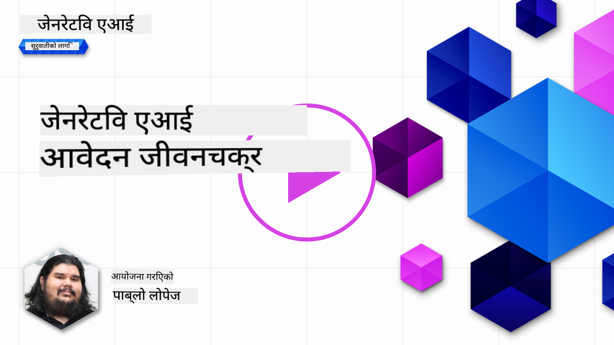
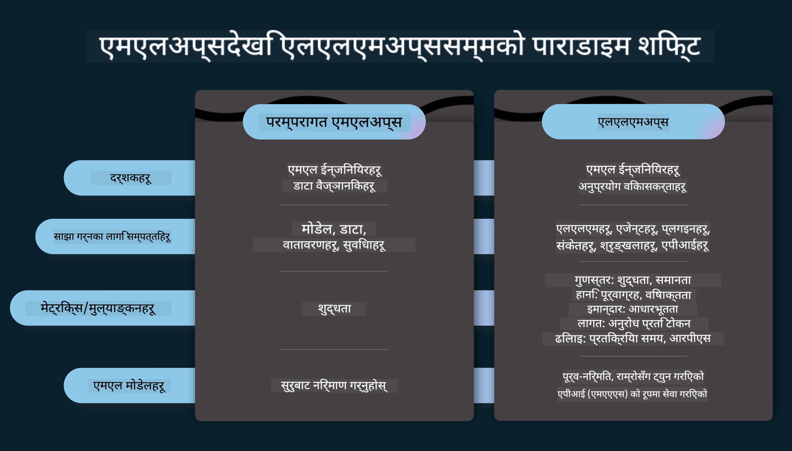
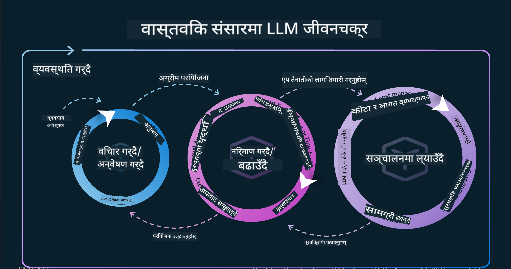
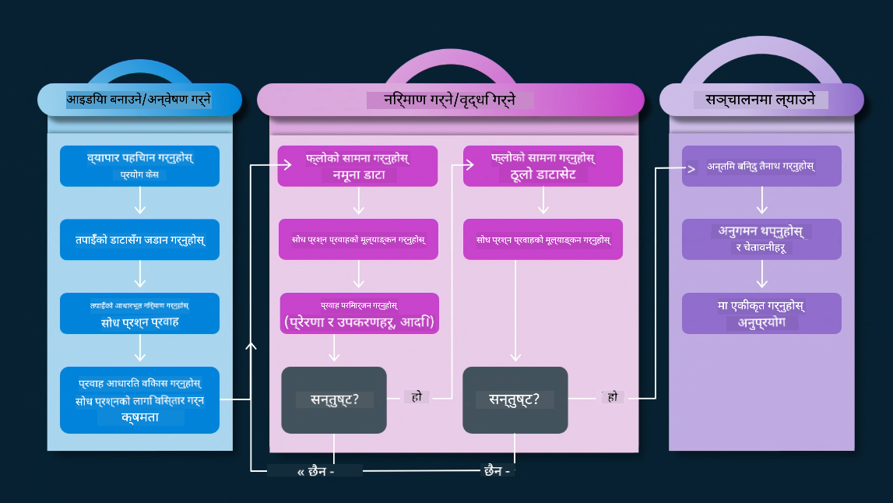
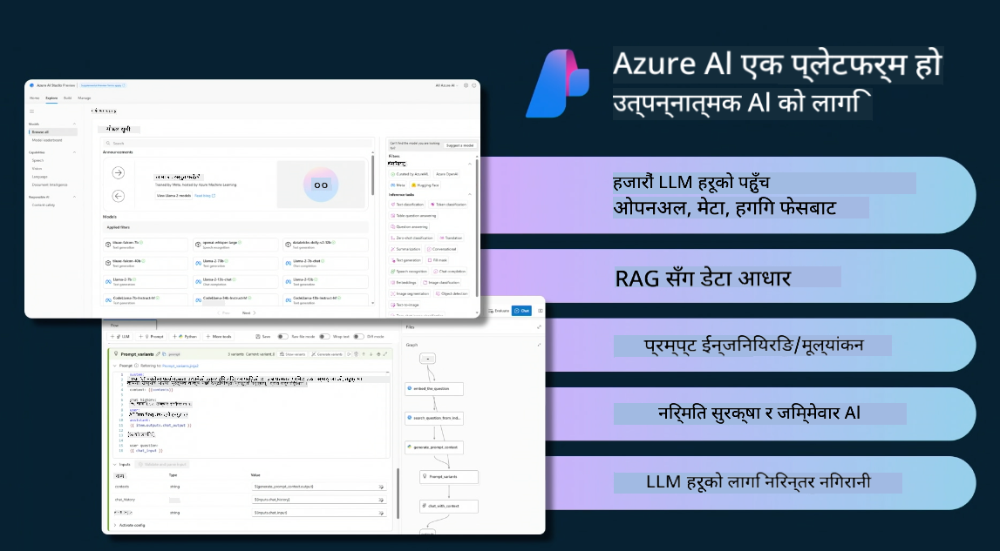
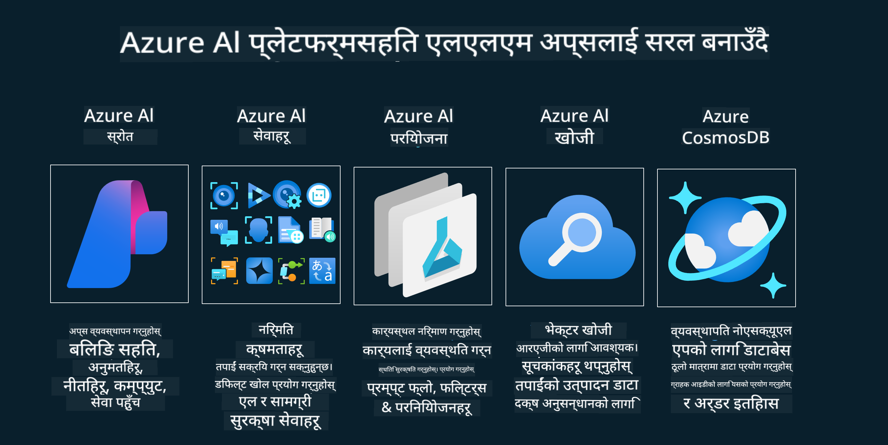
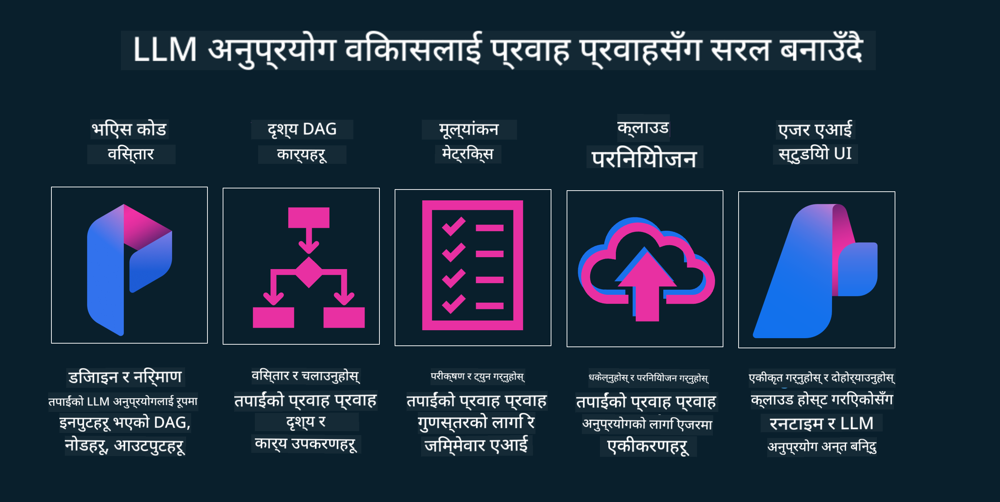

<!--
CO_OP_TRANSLATOR_METADATA:
{
  "original_hash": "27a5347a5022d5ef0a72ab029b03526a",
  "translation_date": "2025-05-19T23:24:37+00:00",
  "source_file": "14-the-generative-ai-application-lifecycle/README.md",
  "language_code": "ne"
}
-->

# जेनेरेटिभ एआई एप्लिकेशन जीवनचक्र

सबै एआई एप्लिकेशनहरूको लागि एक महत्त्वपूर्ण प्रश्न भनेको एआई सुविधाहरूको प्रासंगिकता हो, किनभने एआई एक छिटो विकसित हुँदै गरेको क्षेत्र हो। तपाईंको एप्लिकेशनलाई प्रासंगिक, भरपर्दो, र मजबुत राख्नका लागि तपाईंले यसलाई निरन्तर अनुगमन, मूल्याङ्कन, र सुधार गर्न आवश्यक छ। यहीँ जेनेरेटिभ एआई जीवनचक्रको भूमिका आउँछ।

जेनेरेटिभ एआई जीवनचक्रले तपाईंलाई जेनेरेटिभ एआई एप्लिकेशन विकास, परिनियोजन, र मर्मतका चरणहरूमा मार्गदर्शन गर्ने एउटा रूपरेखा हो। यसले तपाईंलाई तपाईंका लक्ष्यहरू परिभाषित गर्न, तपाईंको प्रदर्शन मापन गर्न, तपाईंका चुनौतीहरू पहिचान गर्न, र तपाईंका समाधानहरू कार्यान्वयन गर्न मद्दत गर्छ। यसले तपाईंलाई तपाईंको डोमेन र तपाईंका साझेदारहरूको नैतिक र कानुनी मापदण्डसँग तपाईंको एप्लिकेशनलाई मेल गर्न मद्दत गर्छ। जेनेरेटिभ एआई जीवनचक्रको पालना गरेर, तपाईंले सुनिश्चित गर्न सक्नुहुन्छ कि तपाईंको एप्लिकेशनले सधैं मूल्य प्रदान गरिरहेको छ र तपाईंका प्रयोगकर्ताहरूलाई सन्तुष्ट पारिरहेको छ।

## परिचय

यस अध्यायमा, तपाईं:

- MLOps बाट LLMOps सम्मको परिप्रेक्ष्य परिवर्तन बुझ्नुहुनेछ
- LLM जीवनचक्र
- जीवनचक्र उपकरण
- जीवनचक्र मेट्रिफिकेसन र मूल्याङ्कन

## MLOps बाट LLMOps सम्मको परिप्रेक्ष्य परिवर्तन बुझ्नुहोस्

LLMs कृत्रिम बुद्धिमत्ताको उपकरणको नयाँ साधन हुन्, ती एप्लिकेशनहरूको विश्लेषण र उत्पादन कार्यहरूमा अत्यन्त शक्तिशाली छन्, तर यस शक्तिले एआई र क्लासिक मेशिन लर्निङ कार्यहरूलाई कसरी सिधा पार्ने भन्नेमा केही परिणामहरू ल्याउँछ।

यसका साथ, हामीलाई यो उपकरणलाई गतिशील रूपमा अनुकूलन गर्न नयाँ परिप्रेक्ष्य आवश्यक छ, सही प्रोत्साहनहरूको साथ। हामी पुराना एआई एपहरूलाई "एमएल एप्स" र नयाँ एआई एप्सलाई "जेनएआई एप्स" वा केवल "एआई एप्स" भनेर वर्गीकृत गर्न सक्छौं, जुन समयमा प्रयोग भएका प्रविधि र प्रविधिहरूलाई प्रतिबिम्बित गर्दछ। यसले हाम्रो कथालाई धेरै तरिकामा परिवर्तन गर्छ, तलको तुलना हेर्नुहोस्।

LLMOps मा, हामी एप डेवलपर्समा बढी केन्द्रित छौं, एकीकरणहरूलाई प्रमुख बिन्दुको रूपमा प्रयोग गर्दै, "मोडल-एज-अ-सेवा" प्रयोग गर्दै र मेट्रिक्सका लागि तलका बिन्दुहरूमा विचार गर्दै।

- गुणस्तर: प्रतिक्रिया गुणस्तर
- हानि: जिम्मेवार एआई
- इमानदारी: प्रतिक्रिया आधार (अर्थपूर्ण छ? यो सही छ?)
- लागत: समाधान बजेट
- विलम्बता: टोकन प्रतिक्रियाको औसत समय

## LLM जीवनचक्र

पहिले, जीवनचक्र र संशोधनहरू बुझ्न, अर्को इन्फोग्राफिक नोट गरौं।

जसरी तपाईंले ध्यान दिनुभयो होला, यो MLOps का सामान्य जीवनचक्रहरू भन्दा फरक छ। LLMs सँग धेरै नयाँ आवश्यकताहरू छन्, जस्तै प्रम्प्टिङ, गुणस्तर सुधार गर्नका लागि विभिन्न प्रविधिहरू (फाइन-ट्यूनिङ, RAG, मेटा-प्रम्प्ट्स), जिम्मेवार AI सँग फरक मूल्याङ्कन र जिम्मेवारी, अन्तमा नयाँ मूल्याङ्कन मेट्रिक्स (गुणस्तर, हानि, इमानदारी, लागत र विलम्बता)।

उदाहरणका लागि, हामी कसरी विचार गर्छौं हेर्नुहोस्। उनीहरूको परिकल्पना सही हुन सक्छ कि भनेर परीक्षण गर्न विभिन्न LLMs संग प्रयोग गर्न प्रम्प्ट इन्जिनियरिङ प्रयोग गर्दै।

ध्यान दिनुहोस् कि यो रेखीय छैन, तर एकीकृत लूपहरू, पुनरावृत्त र एक समग्र चक्रसँग।

हामीले ती चरणहरूलाई कसरी अन्वेषण गर्न सक्छौं? जीवनचक्र कसरी निर्माण गर्न सकिन्छ भन्नेमा विस्तारमा जाऔं।

यो अलि जटिल देखिन सक्छ, पहिले तीन ठूला चरणहरूमा ध्यान केन्द्रित गरौं।

1. विचार/अन्वेषण: अन्वेषण, यहाँ हामी हाम्रो व्यापार आवश्यकताहरू अनुसार अन्वेषण गर्न सक्छौं। प्रोटोटाइपिङ, एक [PromptFlow](https://microsoft.github.io/promptflow/index.html?WT.mc_id=academic-105485-koreyst) सिर्जना गर्दै र हाम्रो परिकल्पनाको लागि पर्याप्त कुशल छ कि छैन भनेर परीक्षण गर्नुहोस्।
2. निर्माण/वृद्धि: कार्यान्वयन, अब, हामी ठूलो डेटासेटहरूको लागि मूल्याङ्कन गर्न थाल्छौं, फाइन-ट्यूनिङ र RAG जस्ता प्रविधिहरू कार्यान्वयन गर्छौं, हाम्रो समाधानको मजबुती जाँच गर्न। यदि यो छैन भने, यसलाई पुनः कार्यान्वयन गर्दै, हाम्रो प्रवाहमा नयाँ चरणहरू थप्दै वा डेटा पुनर्संरचना गर्दै, मद्दत गर्न सक्छ। हाम्रो प्रवाह र हाम्रो स्केल परीक्षण गरेपछि, यदि यो काम गर्छ र हाम्रो मेट्रिक्स जाँच गर्छ, यो अर्को चरणको लागि तयार छ।
3. सञ्चालन: एकीकरण, अब हाम्रो प्रणालीमा अनुगमन र चेतावनी प्रणालीहरू थप्दै, परिनियोजन र हाम्रो एप्लिकेशनमा एप्लिकेशन एकीकरण गर्दै।

त्यसपछि, व्यवस्थापनको समग्र चक्र छ, सुरक्षा, अनुपालन र शासनमा ध्यान केन्द्रित गर्दै।

बधाई छ, अब तपाईंको AI एप तयार छ र सञ्चालनमा छ। व्यावहारिक अनुभवको लागि, [Contoso Chat Demo](https://nitya.github.io/contoso-chat/?WT.mc_id=academic-105485-koreys) मा हेर्नुहोस्।

अब, हामीले के उपकरणहरू प्रयोग गर्न सक्छौं?

## जीवनचक्र उपकरण

उपकरणको लागि, माइक्रोसफ्टले [Azure AI Platform](https://azure.microsoft.com/solutions/ai/?WT.mc_id=academic-105485-koreys) र [PromptFlow](https://microsoft.github.io/promptflow/index.html?WT.mc_id=academic-105485-koreyst) प्रदान गर्दछ जसले तपाईंको चक्रलाई कार्यान्वयन गर्न र तयार पार्न सजिलो बनाउँछ।

[Azure AI Platform](https://azure.microsoft.com/solutions/ai/?WT.mc_id=academic-105485-koreys), तपाईंलाई [AI Studio](https://ai.azure.com/?WT.mc_id=academic-105485-koreys) प्रयोग गर्न अनुमति दिन्छ। एआई स्टुडियो एक वेब पोर्टल हो जसले तपाईंलाई मोडलहरू, नमूनाहरू र उपकरणहरू अन्वेषण गर्न अनुमति दिन्छ। तपाईंको स्रोतहरू, UI विकास प्रवाहहरू र कोड-फर्स्ट विकासको लागि SDK/CLI विकल्पहरू व्यवस्थापन गर्दै।

Azure AI, तपाईंलाई तपाईंको अपरेसनहरू, सेवाहरू, परियोजनाहरू, भेक्टर खोज र डेटाबेस आवश्यकताहरू व्यवस्थापन गर्नका लागि धेरै स्रोतहरू प्रयोग गर्न अनुमति दिन्छ।

प्रूफ-अफ-कन्सेप्ट (POC) बाट ठूलो मापन एप्लिकेसनहरू सम्म PromptFlow सँग निर्माण गर्नुहोस्:

- भिजुअल र कार्यात्मक उपकरणहरूका साथ VS Code बाट एपहरू डिजाइन र निर्माण गर्नुहोस्
- गुणस्तरीय एआईको लागि सजिलैसँग तपाईंका एपहरू परीक्षण र फाइन-ट्यून गर्नुहोस्।
- क्लाउडसँग एकीकृत गर्न Azure AI स्टुडियो प्रयोग गर्नुहोस्, छिटो एकीकृत गर्नका लागि पुश र परिनियोजन गर्नुहोस्।

## उत्कृष्ट! तपाईंको सिकाइ जारी राख्नुहोस्!

अद्भुत, अब हामीले [Contoso Chat App](https://nitya.github.io/contoso-chat/?WT.mc_id=academic-105485-koreyst) सँग अवधारणाहरू प्रयोग गर्न कसरी एप्लिकेसन संरचना गर्ने भन्ने बारेमा थप जान्नुहोस्, क्लाउड एड्भोकेसीले प्रदर्शनहरूमा ती अवधारणाहरू कसरी थप्छ। थप सामग्रीको लागि, हाम्रो [Ignite ब्रेकआउट सेसन](https://www.youtube.com/watch?v=DdOylyrTOWg) हेर्नुहोस्!

अब, पाठ १५ हेर्नुहोस्, [Retrieval Augmented Generation र Vector Databases](../15-rag-and-vector-databases/README.md?WT.mc_id=academic-105485-koreyst) ले जेनेरेटिभ एआईलाई कसरी असर गर्छ र थप आकर्षक एप्लिकेसनहरू बनाउन कसरी मद्दत गर्छ भनेर बुझ्न!

**अस्वीकरण**:  
यो दस्तावेज AI अनुवाद सेवा [Co-op Translator](https://github.com/Azure/co-op-translator) प्रयोग गरेर अनुवाद गरिएको हो। हामी शुद्धताको लागि प्रयास गर्छौं, तर कृपया सचेत रहनुहोस् कि स्वचालित अनुवादमा त्रुटिहरू वा अशुद्धताहरू हुन सक्छन्। यसको मौलिक भाषामा रहेको मूल दस्तावेजलाई आधिकारिक स्रोत मान्नुपर्छ। महत्वपूर्ण जानकारीको लागि, व्यावसायिक मानव अनुवाद सिफारिस गरिन्छ। यस अनुवादको प्रयोगबाट उत्पन्न हुने कुनै पनि गलतफहमी वा गलत व्याख्याका लागि हामी जिम्मेवार हुनेछैनौं।