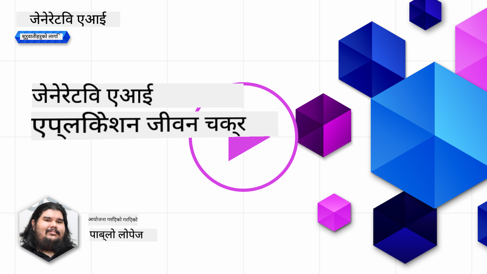
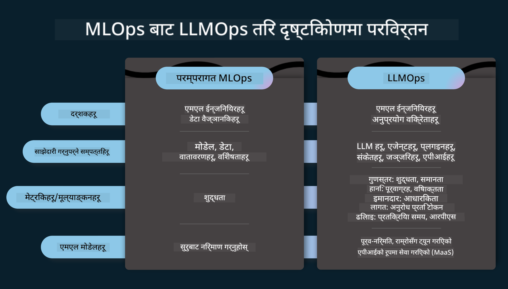
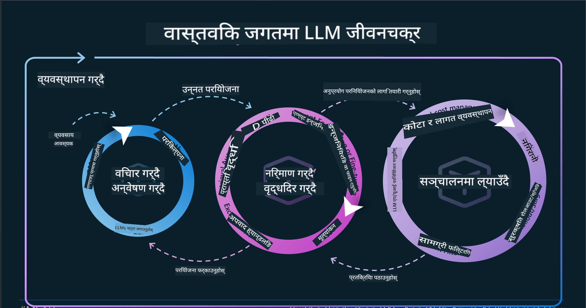
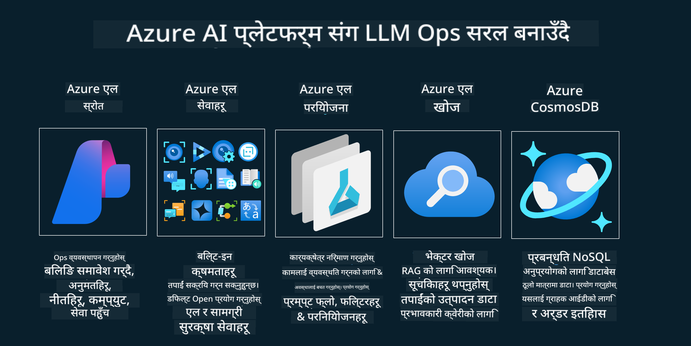
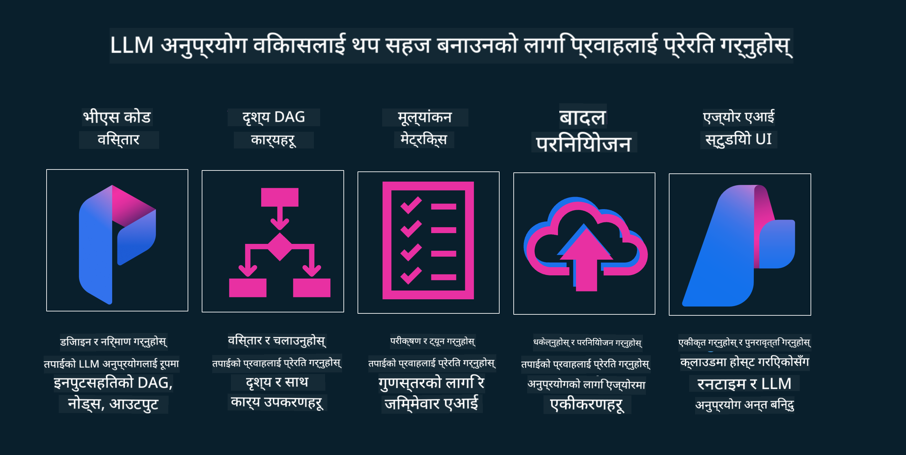

<!--
CO_OP_TRANSLATOR_METADATA:
{
  "original_hash": "b9d32511b27373a1b21b5789d4fda057",
  "translation_date": "2025-10-17T13:57:26+00:00",
  "source_file": "14-the-generative-ai-application-lifecycle/README.md",
  "language_code": "ne"
}
-->

# जेनेरेटिभ एआई एप्लिकेसन जीवनचक्र

सबै एआई एप्लिकेसनहरूको लागि महत्त्वपूर्ण प्रश्न भनेको एआई सुविधाहरूको सान्दर्भिकता हो, किनभने एआई एक छिटो विकसित हुने क्षेत्र हो। तपाईंको एप्लिकेसन सान्दर्भिक, भरपर्दो, र मजबुत रहोस् भन्ने सुनिश्चित गर्न, तपाईंले यसलाई निरन्तर निगरानी, मूल्याङ्कन, र सुधार गर्न आवश्यक छ। यहीँबाट जेनेरेटिभ एआई जीवनचक्रको भूमिका सुरु हुन्छ।

जेनेरेटिभ एआई जीवनचक्र एउटा फ्रेमवर्क हो जसले तपाईंलाई जेनेरेटिभ एआई एप्लिकेसन विकास, परिनियोजन, र मर्मतसम्भारको चरणहरूमा मार्गदर्शन गर्दछ। यसले तपाईंलाई तपाईंको लक्ष्यहरू परिभाषित गर्न, प्रदर्शन मापन गर्न, चुनौतीहरू पहिचान गर्न, र समाधानहरू कार्यान्वयन गर्न मद्दत गर्दछ। यसले तपाईंको एप्लिकेसनलाई तपाईंको क्षेत्र र सरोकारवालाहरूको नैतिक र कानुनी मापदण्डहरूसँग मिलाउन पनि मद्दत गर्दछ। जेनेरेटिभ एआई जीवनचक्रको पालना गरेर, तपाईं सुनिश्चित गर्न सक्नुहुन्छ कि तपाईंको एप्लिकेसन सधैं मूल्य प्रदान गर्दैछ र तपाईंका प्रयोगकर्ताहरूलाई सन्तुष्ट पार्दैछ।

## परिचय

यस अध्यायमा, तपाईं:

- MLOps बाट LLMOps मा भएको परिप्रेक्ष्य परिवर्तन बुझ्नुहोस्
- LLM जीवनचक्र
- जीवनचक्र उपकरणहरू
- जीवनचक्र मेट्रिक र मूल्याङ्कन

## MLOps बाट LLMOps मा भएको परिप्रेक्ष्य परिवर्तन बुझ्नुहोस्

LLMs कृत्रिम बुद्धिमत्ताको शस्त्रागारमा नयाँ उपकरण हुन्। यी एप्लिकेसनहरूको लागि विश्लेषण र उत्पादन कार्यहरूमा अत्यन्त शक्तिशाली छन्। तर, यस शक्तिले एआई र क्लासिक मेशिन लर्निङ कार्यहरूलाई कसरी सरल बनाउने भन्ने कुरामा केही परिणामहरू ल्याउँछ।

यससँगै, हामीलाई यो उपकरणलाई सही प्रोत्साहनका साथ गतिशील रूपमा अनुकूलन गर्न नयाँ परिप्रेक्ष्य आवश्यक छ। हामी पुराना एआई एप्सलाई "ML एप्स" र नयाँ एआई एप्सलाई "GenAI एप्स" वा "AI एप्स" भनेर वर्गीकृत गर्न सक्छौं, जुन समयको मुख्य प्रविधि र प्रविधिहरूलाई प्रतिबिम्बित गर्दछ। यसले हाम्रो कथालाई धेरै तरिकामा परिवर्तन गर्दछ। तलको तुलना हेर्नुहोस्।

LLMOps मा, हामी एप डेभलपर्समा बढी केन्द्रित छौं। एकीकरणलाई मुख्य बिन्दुको रूपमा प्रयोग गर्दै, "Models-as-a-Service" प्रयोग गर्दै, र मेट्रिक्सका लागि निम्न बिन्दुहरूमा विचार गर्दै:

- गुणस्तर: प्रतिक्रिया गुणस्तर
- हानि: जिम्मेवार एआई
- इमानदारी: प्रतिक्रिया आधारभूतता (अर्थपूर्ण छ? यो सही छ?)
- लागत: समाधान बजेट
- विलम्बता: टोकन प्रतिक्रिया औसत समय

## LLM जीवनचक्र

पहिले, जीवनचक्र र संशोधनहरू बुझ्न, तलको इन्फोग्राफिक नोट गरौं।

जस्तो तपाईंले नोट गर्न सक्नुहुन्छ, यो MLOps को सामान्य जीवनचक्रहरू भन्दा फरक छ। LLMs मा धेरै नयाँ आवश्यकताहरू छन्, जस्तै प्रम्प्टिङ, गुणस्तर सुधार गर्न विभिन्न प्रविधिहरू (Fine-Tuning, RAG, Meta-Prompts), जिम्मेवार एआईसँग सम्बन्धित मूल्याङ्कन र जिम्मेवारी, अन्ततः नयाँ मूल्याङ्कन मेट्रिक्स (गुणस्तर, हानि, इमानदारी, लागत र विलम्बता)।

उदाहरणका लागि, हामी कसरी विचार गर्छौं हेर्नुहोस्। विभिन्न LLMs प्रयोग गरेर प्रम्प्ट इन्जिनियरिङ प्रयोग गर्दै, उनीहरूको परिकल्पना सही हुन सक्छ कि छैन परीक्षण गर्न सम्भावनाहरू अन्वेषण गर्न।

नोट गर्नुहोस् कि यो रेखीय छैन, तर एकीकृत लूपहरू, पुनरावृत्तात्मक र समग्र चक्रसँग छ।

हामी ती चरणहरू कसरी अन्वेषण गर्न सक्छौं? अब हामी जीवनचक्र निर्माण गर्ने तरिकामा विस्तृत रूपमा जानौं।

यो अलि जटिल देखिन सक्छ, पहिलो तीन ठूला चरणहरूमा ध्यान केन्द्रित गरौं।

1. विचार/अन्वेषण: अन्वेषण, यहाँ हामी हाम्रो व्यापार आवश्यकताहरू अनुसार अन्वेषण गर्न सक्छौं। प्रोटोटाइपिङ, [PromptFlow](https://microsoft.github.io/promptflow/index.html?WT.mc_id=academic-105485-koreyst) सिर्जना गर्दै र हाम्रो परिकल्पनाको लागि पर्याप्त कुशल छ कि छैन परीक्षण गर्नुहोस्।
1. निर्माण/वृद्धि: कार्यान्वयन, अब, हामी ठूलो डेटासेटहरूको लागि मूल्याङ्कन गर्न सुरु गर्छौं। प्रविधिहरू कार्यान्वयन गर्दै, जस्तै Fine-tuning र RAG, हाम्रो समाधानको मजबुती जाँच गर्न। यदि यो पर्याप्त छैन भने, पुनः कार्यान्वयन गर्दै, हाम्रो प्रवाहमा नयाँ चरणहरू थप्दै वा डेटा पुनःसंरचना गर्दै, मद्दत गर्न सक्छ। हाम्रो प्रवाह र हाम्रो स्केल परीक्षण गरेपछि, यदि यो काम गर्छ र हाम्रो मेट्रिक्स जाँच गर्छ, यो अर्को चरणको लागि तयार छ।
1. सञ्चालन: एकीकरण, अब हाम्रो प्रणालीमा निगरानी र अलर्ट प्रणालीहरू थप्दै, परिनियोजन र हाम्रो एप्लिकेसनमा एकीकरण।

त्यसपछि, हामीसँग व्यवस्थापनको समग्र चक्र छ, सुरक्षा, अनुपालन र शासनमा ध्यान केन्द्रित गर्दै।

बधाई छ, अब तपाईंको एआई एप तयार छ र सञ्चालनमा छ। व्यावहारिक अनुभवको लागि, [Contoso Chat Demo](https://nitya.github.io/contoso-chat/?WT.mc_id=academic-105485-koreys) हेर्नुहोस्।

अब, हामी कुन उपकरणहरू प्रयोग गर्न सक्छौं?

## जीवनचक्र उपकरणहरू

उपकरणहरूको लागि, Microsoft ले [Azure AI Platform](https://azure.microsoft.com/solutions/ai/?WT.mc_id=academic-105485-koreys) र [PromptFlow](https://microsoft.github.io/promptflow/index.html?WT.mc_id=academic-105485-koreyst) प्रदान गर्दछ, जसले तपाईंको चक्रलाई कार्यान्वयन गर्न सजिलो र तयार बनाउँछ।

[Azure AI Platform](https://azure.microsoft.com/solutions/ai/?WT.mc_id=academic-105485-koreys) ले तपाईंलाई [AI Studio](https://ai.azure.com/?WT.mc_id=academic-105485-koreys) प्रयोग गर्न अनुमति दिन्छ। AI Studio एक वेब पोर्टल हो जसले तपाईंलाई मोडेलहरू, नमूनाहरू र उपकरणहरू अन्वेषण गर्न अनुमति दिन्छ। तपाईंको स्रोतहरू व्यवस्थापन गर्दै, UI विकास प्रवाहहरू र कोड-फर्स्ट विकासका लागि SDK/CLI विकल्पहरू।

Azure AI ले तपाईंलाई तपाईंको अपरेसनहरू, सेवाहरू, परियोजनाहरू, भेक्टर खोज र डेटाबेस आवश्यकताहरू व्यवस्थापन गर्न धेरै स्रोतहरू प्रयोग गर्न अनुमति दिन्छ।

Proof-of-Concept(POC) देखि ठूलो स्केल एप्लिकेसनहरू निर्माण गर्नुहोस् PromptFlow प्रयोग गरेर:

- VS Code बाट एप्स डिजाइन र निर्माण गर्नुहोस्, दृश्यात्मक र कार्यात्मक उपकरणहरूसँग
- गुणस्तरीय एआईका लागि तपाईंका एप्स परीक्षण र सुधार गर्नुहोस्, सजिलै।
- Azure AI Studio प्रयोग गरेर क्लाउडसँग एकीकृत र पुनरावृत्ति गर्नुहोस्, छिटो एकीकरणको लागि Push र Deploy गर्नुहोस्।

## उत्कृष्ट! तपाईंको सिकाइ जारी राख्नुहोस्!

अद्भुत, अब [Contoso Chat App](https://nitya.github.io/contoso-chat/?WT.mc_id=academic-105485-koreyst) मा कसरी हामीले अवधारणाहरू संरचना गरेका छौं हेर्नुहोस्, क्लाउड एड्भोकेसीले प्रदर्शनहरूमा ती अवधारणाहरू कसरी थप्छ। थप सामग्रीको लागि, हाम्रो [Ignite breakout session](https://www.youtube.com/watch?v=DdOylyrTOWg) हेर्नुहोस्!

अब, पाठ १५ हेर्नुहोस्, [Retrieval Augmented Generation and Vector Databases](../15-rag-and-vector-databases/README.md?WT.mc_id=academic-105485-koreyst) ले जेनेरेटिभ एआईलाई कसरी प्रभाव पार्छ र थप आकर्षक एप्लिकेसनहरू बनाउन मद्दत गर्दछ बुझ्न!

---

**अस्वीकरण**:  
यो दस्तावेज AI अनुवाद सेवा [Co-op Translator](https://github.com/Azure/co-op-translator) प्रयोग गरेर अनुवाद गरिएको छ। हामी शुद्धताको लागि प्रयास गर्छौं, तर कृपया ध्यान दिनुहोस् कि स्वचालित अनुवादमा त्रुटिहरू वा अशुद्धताहरू हुन सक्छ। यसको मूल भाषा मा रहेको मूल दस्तावेजलाई आधिकारिक स्रोत मानिनुपर्छ। महत्वपूर्ण जानकारीको लागि, व्यावसायिक मानव अनुवाद सिफारिस गरिन्छ। यस अनुवादको प्रयोगबाट उत्पन्न हुने कुनै पनि गलतफहमी वा गलत व्याख्याको लागि हामी जिम्मेवार हुनेछैनौं।