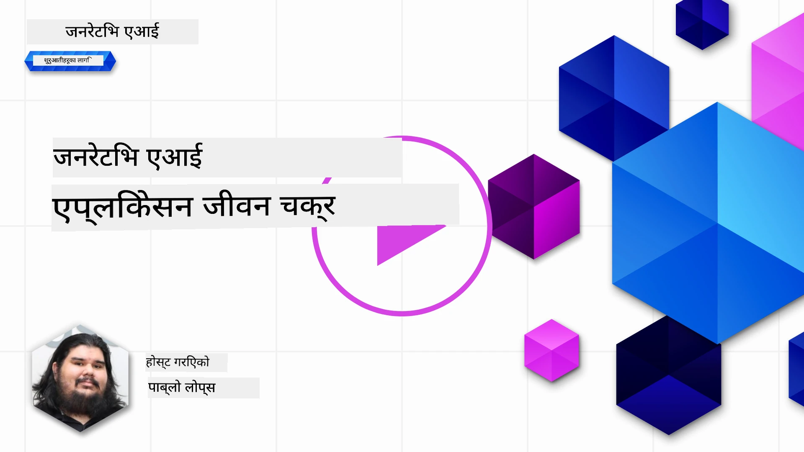
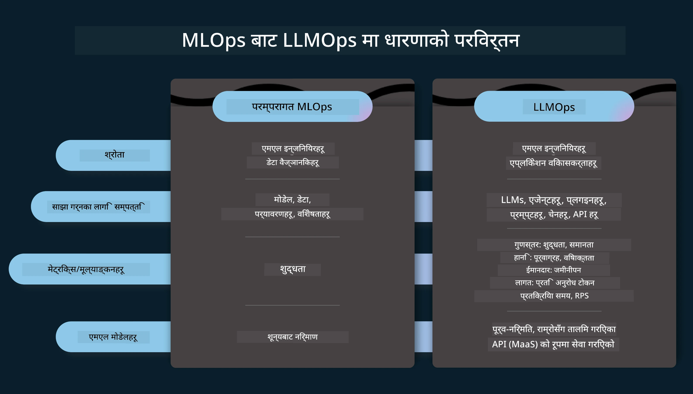
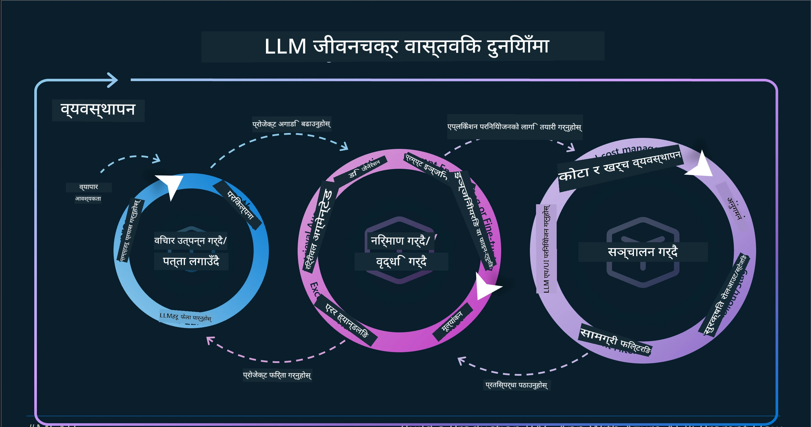
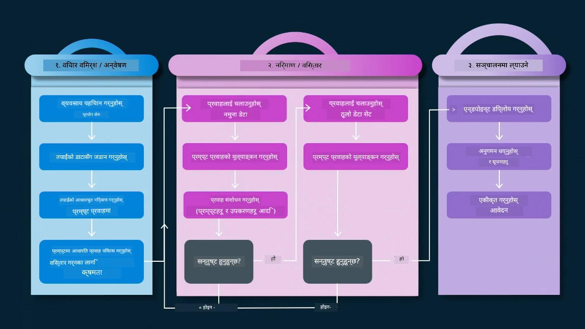
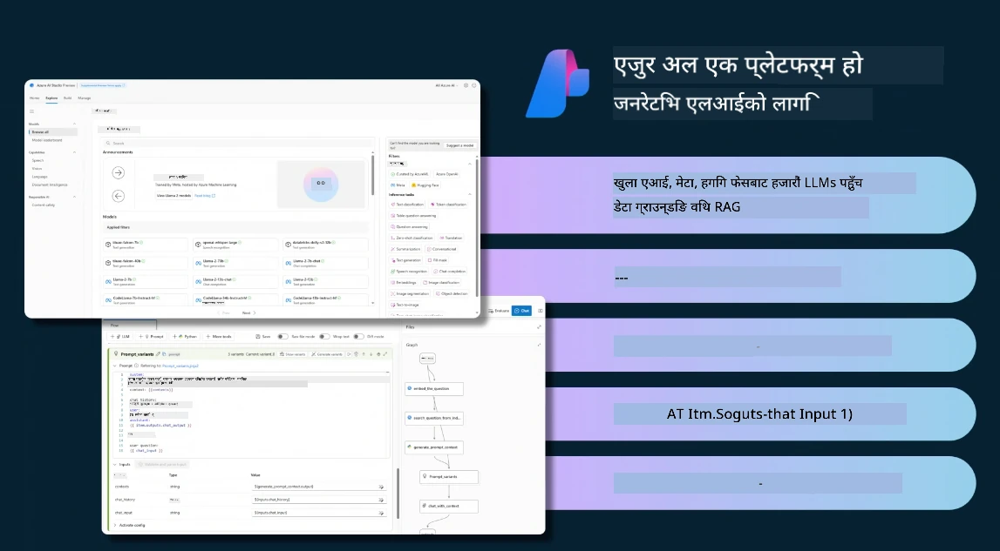
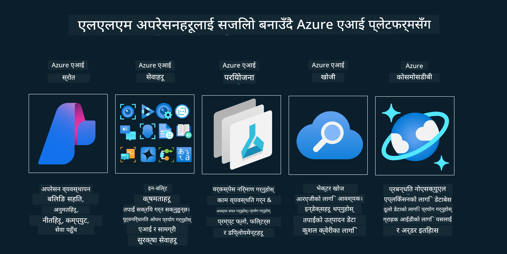
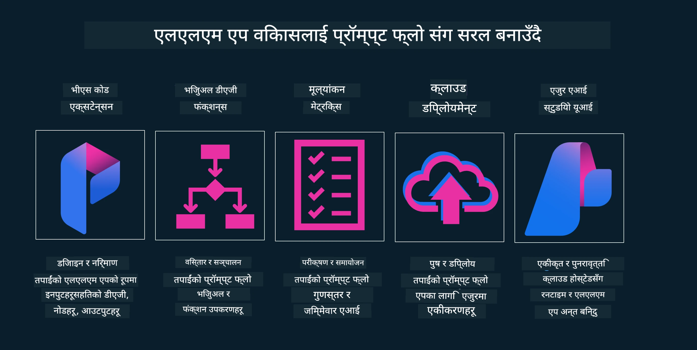

# जेनेरेटिभ AI अनुप्रयोग जीवनचक्र

सबै AI अनुप्रयोगहरूको लागि एक महत्वपूर्ण प्रश्न भनेको AI सुविधाहरूको प्रासंगिकता हो, किनकि AI छिटो परिवर्तन हुँदै गरेको क्षेत्र हो, तपाईंको अनुप्रयोग प्रासंगिक, भरपर्दो र मजबुत रहन सुनिश्चित गर्न, तपाईंले यसलाई निरन्तर अनुगमन, मूल्यांकन, र सुधार गर्न आवश्यक छ। यो त्यहीँबाट जेनेरेटिभ AI जीवनचक्र आउँछ।

जेनेरेटिभ AI जीवनचक्र एक रूपरेखा हो जसले तपाईंलाई जेनेरेटिभ AI अनुप्रयोग विकास, तैनाती, र मर्मतसम्भारका चरणहरू मार्फत मार्गदर्शन गर्दछ। यसले तपाईंलाई लक्ष्य परिभाषित गर्न, प्रदर्शन मापन गर्न, चुनौतीहरू पहिचान गर्न, र समाधानहरू लागू गर्न मद्दत गर्दछ। यसले तपाईंको अनुप्रयोगलाई तपाईंको डोमेन र सरोकारवालाहरूको नैतिक र कानुनी मापदण्डहरूसँग मेल खाने काम पुर्‍याउँछ। जेनेरेटिभ AI जीवनचक्रको पालना गरेर, तपाईंले सुनिश्चित गर्न सक्नुहुन्छ कि तपाईंको अनुप्रयोग सधैं मूल्य प्रदान गर्दैछ र तपाईंका प्रयोगकर्ताहरू सन्तुष्ट छन्।

## परिचय

यस अध्यायमा, तपाईं:

- MLOps बाट LLMOps मा अवधारणा परिवर्तनलाई बुझ्नुहुनेछ
- LLM जीवनचक्र
- जीवनचक्र उपकरणहरू
- जीवनचक्र मेट्रिफिकेशन र मूल्याङ्कन

## MLOps बाट LLMOps मा Paradigm Shift बुझ्नुहोस्

LLM हरू कृत्रिम बुद्धिमत्ताको नयाँ उपकरण हुन्, ती अनुप्रयोगहरूको विश्लेषण र सिर्जना कार्यहरूमा अत्यन्त शक्तिशाली छन्, यद्यपि यस शक्तिले AI र क्लासिक मेसिन लर्निङ कार्यहरू कसरी व्यवस्थित गर्नेमा केही प्रभाव पार्दछ।

यसका लागि, हामीलाई यो उपकरणलाई गतिशील तरिकाले मिलाउन नयाँ अवधारणा चाहिन्छ, सही प्रोत्साहनहरू सहित। हामी पुराना AI अनुप्रयोगहरूलाई "ML एप्स" र नयाँ AI एपहरूलाई "GenAI एप्स" वा "AI एप्स" भनिसक्न सक्छौं, जुन समयका लोकप्रिय प्रविधि र प्रविधिहरूलाई प्रतिबिम्बित गर्दछ। यसले हाम्रो कथालाई धेरै तरिकाले सार्दछ, तलको तुलना हेर्नुहोस्।

ध्यान दिनुहोस् कि LLMOps मा हामी एप विकासकर्तामा बढी केन्द्रित हुन्छौं, समाकलनलाई मुख्य बिन्दुको रूपमा प्रयोग गर्दै, "Models-as-a-Service" को प्रयोग गर्दै र मेट्रिक्सका लागि निम्न बुँदाहरूमा विचार गरिन्छ।

- गुणस्तर: जवाफको गुणस्तर
- हानि: जिम्मेवार AI
- सत्यनिष्ठा: जवाफको आधार (ठीक छ? सही छ?)
- लागत: समाधान बजेट
- विलम्बता: टोकन जवाफको औसत समय

## LLM जीवनचक्र

पहिले, जीवनचक्र र यसको परिवर्तनहरू बुझ्न, तलको इन्फोग्राफिकमा ध्यान दिनुहोस्।

जसरी तपाईंले नोट गर्न सक्नुहुन्छ, यो सामान्य MLOps जीवनचक्रहरूबाट फरक छ। LLM हरूमा थुप्रै नयाँ आवश्यकताहरू छन्, जस्तै प्रॉम्प्टिङ, गुणस्तर सुधारका लागि विभिन्न प्रविधिहरू (फाइन-ट्युनिङ, RAG, मेटा-प्रॉम्प्ट्स), जिम्मेवार AI सँग भिन्न मूल्यांकन र जिम्मेवारी, अन्ततः नयाँ मूल्यांकन मेट्रिक्सहरू (गुणस्तर, हानि, सत्यनिष्ठा, लागत र विलम्बता)।

उदाहरणको लागि, हेर्नुहोस् हामी कसरी विचार गर्छौं। विभिन्न LLM हरूसँग प्रयोग गर्न प्रॉम्प्ट इन्जिनियरिङ प्रयोग गरिन्छ, सम्भावनाहरू अन्वेषण गर्न र तिनीहरूको परिकल्पना सही हुन सक्छ कि छैन परीक्षण गर्न।

ध्यान दिनुहोस् कि यो रेखीय होइन, तर एकीकृत लूपहरू, पुनरावृत्तिमूलक र एक समग्र चक्रसँग।

हामी ती चरणहरू कसरी अन्वेषण गर्न सक्छौं? जीवनचक्र कसरी निर्माण गर्ने विवरणमा जाँदैछौं।

यो अलि जटिल लाग्न सक्छ, पहिले तीनठूलो चरणमा ध्यान केन्द्रित गरौं।

1. विचार/अन्वेषण: अन्वेषण, यहाँ हामी हाम्रो व्यापार आवश्यकताहरू अनुसार अन्वेषण गर्न सक्छौं। प्रोटोटाइपिङ, एक [PromptFlow](https://microsoft.github.io/promptflow/index.html?WT.mc_id=academic-105485-koreyst) सिर्जना गरी हाम्रो परिकल्पनाका लागि पर्याप्त प्रभावकारी छ कि छैन परीक्षण गर्दछौं।
1. निर्माण/बृद्धि: कार्यान्वयन, अब, हामी डाटा सेटको लागि मूल्यांकन सुरु गर्छौं, फाइन-ट्युनिङ र RAG जस्ता प्रविधिहरू लागू गर्दछौं, समाधानको मजबुती जाँच्न। यदि यो छैन भने, पुनः कार्यान्वयन गर्नु, नयाँ चरणहरू थप्नु वा डाटालाई पुनःसंरचनागर्नु सहायक हुन सक्छ। हाम्रो प्रवाह र आकार परीक्षण पछि, यदि यो काम गर्छ र हाम्रो मेट्रिक्स ठिक छ भने, यो अर्को चरणको लागि तयार हुन्छ।
1. सञ्चालन-योग्य बनाउँदै: एकीकरण, अब हाम्रो प्रणालीमा अनुगमन र सतर्कता प्रणालीहरू थप्दै, आवेदन तैनाती र समाकलन गर्दै।

त्यसपछि, सुरक्षा, अनुपालना र शासनमा केन्द्रित व्यवस्थापनको समग्र चक्र हुन्छ।

बधाई छ, अब तपाईंको AI एप तयार छ र सञ्चालनयोग्य छ। व्यावहारिक अनुभवको लागि, [Contoso Chat Demo](https://nitya.github.io/contoso-chat/?WT.mc_id=academic-105485-koreyst) हेर्नुहोस्।

अब, हामी कुन उपकरणहरू प्रयोग गर्न सक्छौं?

## जीवनचक्र उपकरणहरू

उपकरणका लागि, माइक्रोसफ्टले [Azure AI Platform](https://azure.microsoft.com/solutions/ai/?WT.mc_id=academic-105485-koreyst) र [PromptFlow](https://microsoft.github.io/promptflow/index.html?WT.mc_id=academic-105485-koreyst) प्रदान गर्दछ जसले तपाईंको जीवनचक्र सजिलो र तैनातीयोग्य बनाउँछ।

[Azure AI Platform](https://azure.microsoft.com/solutions/ai/?WT.mc_id=academic-105485-koreyst) ले तपाईंलाई [AI Studio](https://ai.azure.com/?WT.mc_id=academic-105485-koreyst) प्रयोग गर्न अनुमति दिन्छ। AI Studio एक वेब पोर्टल हो जसले मोडेलहरू, नमूनाहरू र उपकरणहरू अन्वेषण गर्न अनुमति दिन्छ। तपाईंका स्रोतहरू, UI विकास प्रवाहहरू र SDK/CLI विकल्पहरू कर्ड-प्रथम विकासका लागि व्यवस्थापन गर्न।

Azure AI ले तपाईंलाई धेरै स्रोतहरू प्रयोग गर्न अनुमति दिन्छ, तपाईंको सञ्चालन, सेवा, परियोजना, भेक्टर खोज र डाटाबेस आवश्यकताहरू व्यवस्थापन गर्ने।

Proof-of-Concept(POC) देखि ठूला स्तरका अनुप्रयोगहरू सम्म PromptFlow मार्फत निर्माण गर्नुहोस्:

- VS Code बाट दृश्यात्मक र कार्यात्मक उपकरणहरूसँग एप्स डिजाइन र निर्माण गर्नुहोस्
- सहजै गुणस्तरीय AI का लागि तपाईंको एप्स परिक्षण र फाइन-ट्युन गर्नुहोस्
- Azure AI Studio प्रयोग गरी क्लाउडमा एकीकरण र पुनरावृत्ति गर्नुहोस्, छिटो एकीकरणका लागि पुश र डिप्लॉय गर्नुहोस्

## उत्कृष्ट! तपाईंको सिकाइ जारी राख्नुहोस्!

शान्दार, अब [Contoso Chat App](https://nitya.github.io/contoso-chat/?WT.mc_id=academic-105485-koreyst) संग संरचनाबद्ध अनुप्रयोग कसरी प्रयोग गर्ने सिक्नुहोस्, ताकि Cloud Advocacy ले ती अवधारणाहरू प्रदर्शनहरूमा कसरी लागू गर्छ देख्न सक्नुहुन्छ। थप सामग्रीको लागि, हाम्रो [Ignite ब्रेकआउट सत्र!](https://www.youtube.com/watch?v=DdOylyrTOWg) हेर्नुहोस्।

अब, पाठ 15 हेर्नुहोस्, जसले [Retrieval Augmented Generation र Vector Databases](../15-rag-and-vector-databases/README.md?WT.mc_id=academic-105485-koreyst) लाई कसरी जेनेरेटिभ AI मा प्रभाव पार्छ भन्ने बुझ्न र अझ आकर्षक अनुप्रयोगहरू बनाउन मद्दत गर्दछ!

---

<!-- CO-OP TRANSLATOR DISCLAIMER START -->
**पक्षपोषण**:
यो दस्तावेज AI अनुवाद सेवा [Co-op Translator](https://github.com/Azure/co-op-translator) प्रयोग गरी अनुवाद गरिएको हो। हामी शुद्धताको प्रयास गर्छौं भनेपनि, कृपया सम्झनुहोस् कि स्वचालित अनुवादमा त्रुटि वा अशुद्धिहरू हुन सक्छन्। मूल दस्तावेज यसको स्थानीय भाषामा आधिकारिक स्रोत मानिनेछ। महत्त्वपूर्ण जानकारीको लागि व्यावसायिक मानवीय अनुवाद सल्लाह दिन्छौं। यस अनुवादको प्रयोगबाट उत्पन्न हुने कुनै पनि गलत बुझाइ वा व्याख्यामा हामी जिम्मेवार हौंैनौं।
<!-- CO-OP TRANSLATOR DISCLAIMER END -->