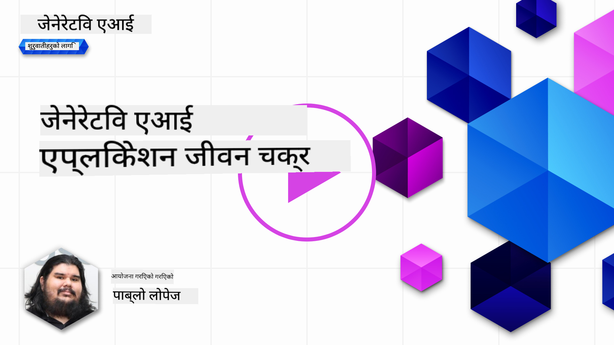
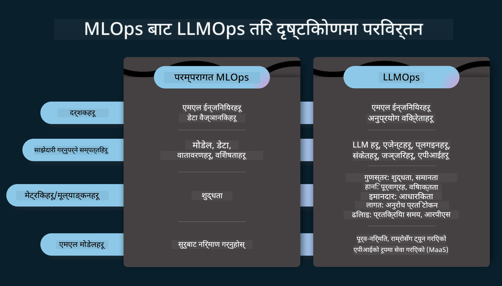
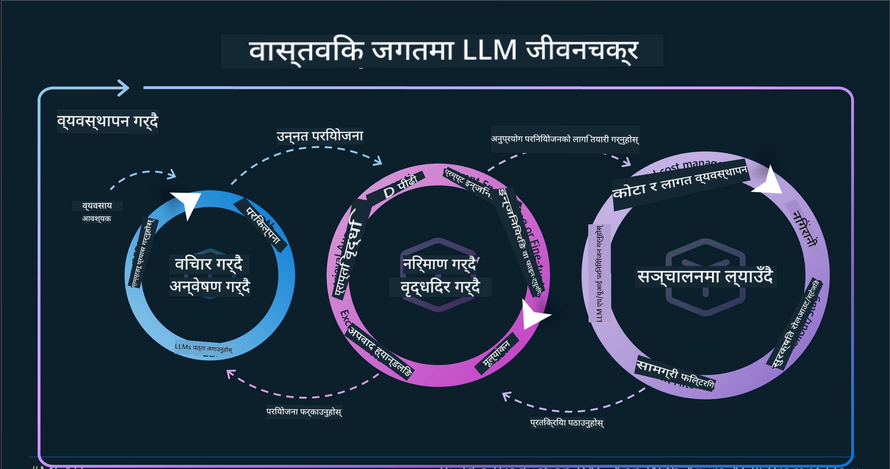
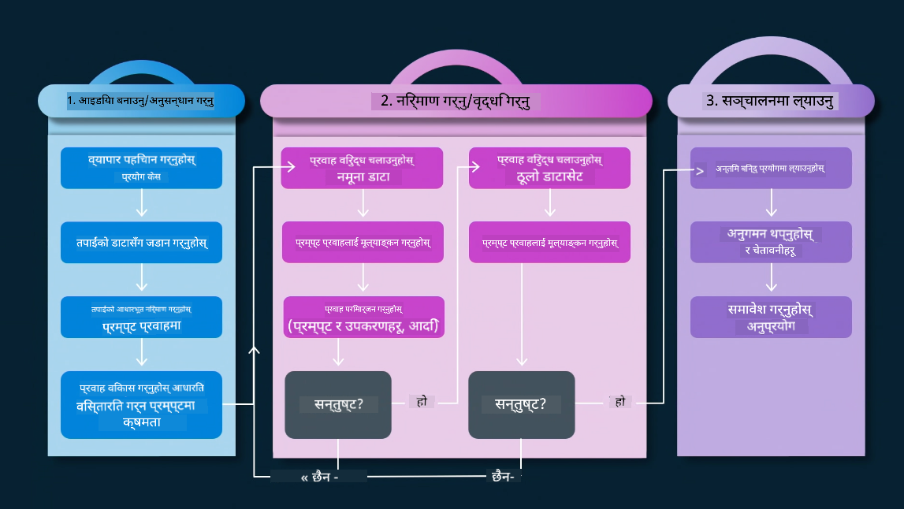
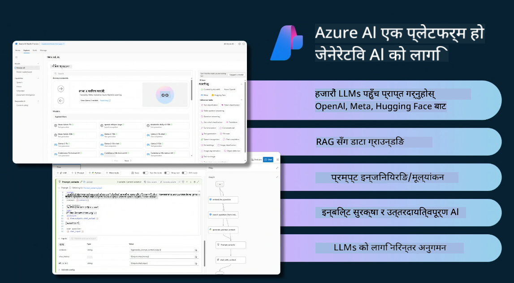
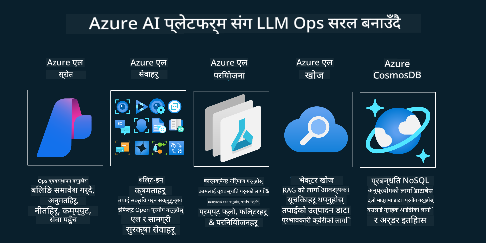
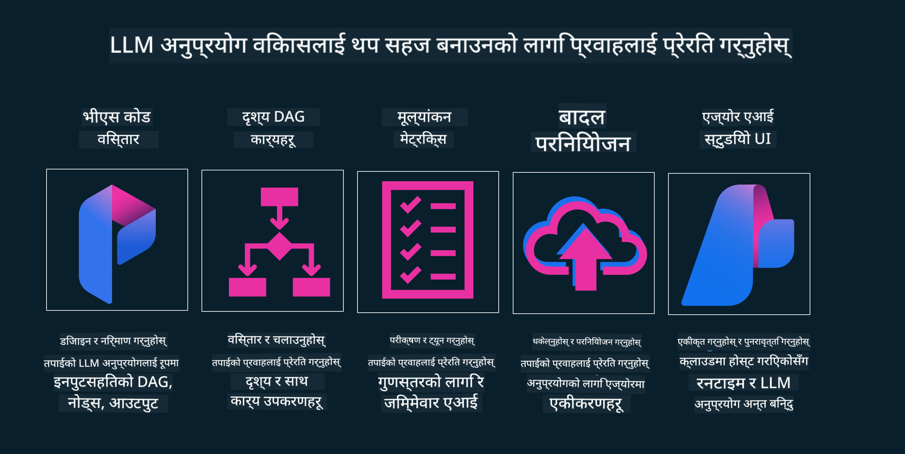

<!--
CO_OP_TRANSLATOR_METADATA:
{
  "original_hash": "27a5347a5022d5ef0a72ab029b03526a",
  "translation_date": "2025-06-25T22:00:17+00:00",
  "source_file": "14-the-generative-ai-application-lifecycle/README.md",
  "language_code": "ne"
}
-->

# जेनेरेटिभ एआई एप्लिकेशन जीवनचक्र

सबै एआई अनुप्रयोगहरूको लागि एक महत्वपूर्ण प्रश्न भनेको एआई सुविधाहरूको प्रासंगिकता हो, किनभने एआई एक छिटो विकास भइरहेको क्षेत्र हो, तपाईंको अनुप्रयोग प्रासंगिक, भरपर्दो, र बलियो रहोस् भनेर सुनिश्चित गर्न तपाईंले यसलाई निरन्तर अनुगमन, मूल्याङ्कन, र सुधार गर्न आवश्यक छ। यहीँ जेनेरेटिभ एआई जीवनचक्रको भूमिका आउँछ।

जेनेरेटिभ एआई जीवनचक्र एउटा ढाँचा हो जसले तपाईंलाई जेनेरेटिभ एआई एप्लिकेशन विकास, तैनाती, र मर्मतसम्भारको चरणहरूमा मार्गदर्शन गर्छ। यसले तपाईंलाई तपाईंको लक्ष्यहरू परिभाषित गर्न, तपाईंको प्रदर्शन मापन गर्न, तपाईंको चुनौतीहरू पहिचान गर्न, र तपाईंका समाधानहरू कार्यान्वयन गर्न मद्दत गर्दछ। यसले तपाईंको अनुप्रयोगलाई तपाईंको डोमेन र तपाईंका सरोकारवालाहरूको नैतिक र कानुनी मापदण्डहरूसँग पनि मिलाउन मद्दत गर्दछ। जेनेरेटिभ एआई जीवनचक्र पछ्याएर, तपाईंले तपाईंको अनुप्रयोगले सधैं मूल्य प्रदान गर्दै र तपाईंका प्रयोगकर्ताहरूलाई सन्तुष्ट बनाइरहेको छ भन्ने सुनिश्चित गर्न सक्नुहुन्छ।

## परिचय

यस अध्यायमा, तपाईं:

- MLOps बाट LLMOps मा भएको पाराडाइम शिफ्ट बुझ्नुहोस्
- LLM जीवनचक्र
- जीवनचक्र उपकरण
- जीवनचक्र मेट्रिफिकेशन र मूल्याङ्कन

## MLOps बाट LLMOps मा भएको पाराडाइम शिफ्ट बुझ्नुहोस्

LLM हरू कृत्रिम बुद्धिमत्ताको शस्त्रागारमा नयाँ उपकरण हुन्, तिनीहरू अनुप्रयोगहरूको लागि विश्लेषण र जेनेरेसन कार्यहरूमा अविश्वसनीय रूपमा शक्तिशाली छन्, यद्यपि यस शक्तिले एआई र क्लासिक मेसिन लर्निङ कार्यहरूलाई कसरी सरल बनाउँछ भन्ने कुरामा केही परिणामहरू छन्।

यसका साथ, हामीलाई यो उपकरणलाई गतिशील रूपमा अनुकूलन गर्न, सही प्रोत्साहनहरू सहित नयाँ पाराडाइमको आवश्यकता छ। हामी पुराना एआई एपहरूलाई "एमएल एपहरू" र नयाँ एआई एपहरूलाई "जेनेरेटिभ एआई एपहरू" वा केवल "एआई एपहरू" भनेर वर्गीकृत गर्न सक्छौं, जसले त्यस समयमा प्रयोग गरिएका मुख्य प्रविधि र प्रविधिहरूलाई प्रतिबिम्बित गर्दछ। यसले हाम्रो कथालाई धेरै तरिकामा सार्छ, निम्न तुलना हेर्नुहोस्।

ध्यान दिनुहोस् कि LLMOps मा, हामी अनुप्रयोग विकासकर्ताहरूमा बढी केन्द्रित छौं, एकीकरणहरूलाई प्रमुख बिन्दुको रूपमा प्रयोग गर्दै, "मोडेलहरू-ए-ए-सर्भिस" प्रयोग गर्दै र मेट्रिक्सको लागि निम्न बिन्दुहरूमा सोच्दै।

- गुणस्तर: प्रतिक्रिया गुणस्तर
- हानि: जिम्मेवार एआई
- इमानदारी: प्रतिक्रिया आधार (अर्थमा छ? यो सही छ?)
- लागत: समाधान बजेट
- विलम्बता: टोकन प्रतिक्रियाको औसत समय

## LLM जीवनचक्र

पहिले, जीवनचक्र र परिमार्जनहरू बुझ्नको लागि, अर्को इन्फोग्राफिक नोट गरौं।

जसरी तपाईंले नोट गर्न सक्नुहुन्छ, यो MLOps बाट सामान्य जीवनचक्रहरू भन्दा फरक छ। LLM हरूसँग धेरै नयाँ आवश्यकताहरू छन्, जस्तै प्रम्प्टिङ, गुणस्तर सुधार गर्नका लागि विभिन्न प्रविधिहरू (फाइन-ट्युनिङ, RAG, मेटा-प्रम्प्टहरू), जिम्मेवार एआईसँग विभिन्न मूल्याङ्कन र जिम्मेवारी, अन्ततः नयाँ मूल्याङ्कन मेट्रिक्स (गुणस्तर, हानि, इमानदारी, लागत र विलम्बता)।

उदाहरणका लागि, हामी कसरी विचार गर्छौं भनेर हेर्नुहोस्। विभिन्न LLM हरूसँग प्रयोग गर्न प्रम्प्ट इन्जिनियरिङ प्रयोग गरेर तिनीहरूको परिकल्पना सही हुन सक्छ कि भनेर परीक्षण गर्न सम्भावनाहरू अन्वेषण गर्नुहोस्।

ध्यान दिनुहोस् कि यो रेखीय होइन, तर एकीकृत लूपहरू, पुनरावृत्त र एक समग्र चक्रसँग छ।

हामी ती चरणहरू कसरी अन्वेषण गर्न सक्छौं? हामी जीवनचक्र कसरी निर्माण गर्न सक्छौं भन्ने विवरणमा जानुहोस्।

यो अलिकति जटिल देखिन सक्छ, सुरुमा तीन ठूला चरणहरूमा ध्यान केन्द्रित गरौं।

1. विचार गर्दै/अन्वेषण गर्दै: अन्वेषण, यहाँ हामी हाम्रो व्यापार आवश्यकताहरू अनुसार अन्वेषण गर्न सक्छौं। प्रोटोटाइपिङ, [PromptFlow](https://microsoft.github.io/promptflow/index.html?WT.mc_id=academic-105485-koreyst) सिर्जना गर्दै र हाम्रो परिकल्पनाका लागि पर्याप्त कुशल छ कि छैन परीक्षण गर्नुहोस्।
2. निर्माण गर्दै/वृद्धि गर्दै: कार्यान्वयन, अब, हामी ठूला डेटासेटहरूको लागि मूल्याङ्कन गर्न थाल्छौं, फाइन-ट्युनिङ र RAG जस्ता प्रविधिहरू कार्यान्वयन गर्न, हाम्रो समाधानको मजबूती जाँच गर्न। यदि यो गर्दैन भने, हाम्रो प्रवाहमा नयाँ चरणहरू थप्दै वा डेटा पुनर्संरचना गर्दै, पुन: कार्यान्वयन गर्न सक्छ। हाम्रो प्रवाह र हाम्रो स्केल परीक्षण गरेपछि, यदि यो काम गर्दछ र हाम्रो मेट्रिक्स जाँच गर्दछ, यो अर्को चरणको लागि तयार छ।
3. सञ्चालन गर्दै: एकीकरण, अब हाम्रो प्रणालीमा अनुगमन र अलर्ट प्रणालीहरू थप्दै, हाम्रो अनुप्रयोगमा तैनाती र अनुप्रयोग एकीकरण।

त्यसपछि, व्यवस्थापनको समग्र चक्र छ, सुरक्षा, अनुपालन र शासनमा ध्यान केन्द्रित गर्दै।

बधाई छ, अब तपाईंको एआई एप तयार छ र सञ्चालनमा छ। व्यावहारिक अनुभवको लागि, [Contoso Chat Demo](https://nitya.github.io/contoso-chat/?WT.mc_id=academic-105485-koreys) हेर्नुहोस्।

अब, हामी कुन उपकरणहरू प्रयोग गर्न सक्छौं?

## जीवनचक्र उपकरण

उपकरणहरूको लागि, माइक्रोसफ्टले [Azure AI Platform](https://azure.microsoft.com/solutions/ai/?WT.mc_id=academic-105485-koreys) र [PromptFlow](https://microsoft.github.io/promptflow/index.html?WT.mc_id=academic-105485-koreyst) प्रदान गर्दछ जसले तपाईंको चक्रलाई सजिलो र कार्यान्वयन गर्न तयार बनाउँछ।

[Azure AI Platform](https://azure.microsoft.com/solutions/ai/?WT.mc_id=academic-105485-koreys) ले तपाईंलाई [AI Studio](https://ai.azure.com/?WT.mc_id=academic-105485-koreys) प्रयोग गर्न अनुमति दिन्छ। एआई स्टुडियो एक वेब पोर्टल हो जसले तपाईंलाई मोडेलहरू, नमूनाहरू र उपकरणहरू अन्वेषण गर्न अनुमति दिन्छ। तपाईंका स्रोतहरू, UI विकास प्रवाहहरू र कोड-फर्स्ट विकासका लागि SDK/CLI विकल्पहरू व्यवस्थापन गर्दै।

Azure AI ले तपाईंलाई तपाईंको अपरेसनहरू, सेवाहरू, परियोजनाहरू, भेक्टर खोज र डाटाबेस आवश्यकताहरू व्यवस्थापन गर्न धेरै स्रोतहरू प्रयोग गर्न अनुमति दिन्छ।

प्रम्टफ्लोको साथ, Proof-of-Concept(POC) देखि ठूला स्केल अनुप्रयोगहरू निर्माण गर्नुहोस्:

- भिजुअल र कार्यात्मक उपकरणहरूसँग VS कोडबाट अनुप्रयोगहरू डिजाइन र निर्माण गर्नुहोस्
- गुणस्तरीय एआईका लागि तपाईंका अनुप्रयोगहरू सजिलै परीक्षण र फाइन-ट्यून गर्नुहोस्।
- क्लाउडसँग एकीकृत र पुनरावृत्ति गर्न Azure AI स्टुडियो प्रयोग गर्नुहोस्, छिटो एकीकरणका लागि पुश र डिप्लोय गर्नुहोस्।

## उत्कृष्ट! तपाईंको सिकाइ जारी राख्नुहोस्!

अद्भुत, अब [Contoso Chat App](https://nitya.github.io/contoso-chat/?WT.mc_id=academic-105485-koreyst) को साथ अवधारणाहरू प्रयोग गर्न अनुप्रयोग कसरी संरचना गर्ने भनेर थप जान्नुहोस्, क्लाउड एड्भोकेसीले प्रदर्शनहरूमा ती अवधारणाहरू कसरी थप्दछ जाँच गर्न। थप सामग्रीको लागि, हाम्रो [Ignite ब्रेकआउट सत्र](https://www.youtube.com/watch?v=DdOylyrTOWg) जाँच गर्नुहोस्!

अब, पाठ 15 जाँच गर्नुहोस्, जेनेरेटिभ एआईमा [Retrieval Augmented Generation र भेक्टर डाटाबेसहरू](../15-rag-and-vector-databases/README.md?WT.mc_id=academic-105485-koreyst) ले कसरी प्रभाव पार्छ र थप आकर्षक अनुप्रयोगहरू बनाउन मद्दत गर्दछ बुझ्न!

**अस्वीकरण**:  
यो कागजात AI अनुवाद सेवा [Co-op Translator](https://github.com/Azure/co-op-translator) प्रयोग गरेर अनुवाद गरिएको हो। हामी शुद्धताको लागि प्रयास गर्छौं, तर कृपया जानकार हुनुहोस् कि स्वचालित अनुवादमा त्रुटिहरू वा अशुद्धताहरू हुन सक्छन्। यसको मौलिक भाषामा रहेको मूल कागजातलाई आधिकारिक स्रोत मानिनुपर्छ। महत्वपूर्ण जानकारीको लागि, पेशेवर मानव अनुवाद सिफारिस गरिन्छ। यस अनुवादको प्रयोगबाट उत्पन्न कुनै पनि गलतफहमी वा गलत व्याख्याका लागि हामी जिम्मेवार हुनेछैनौं।