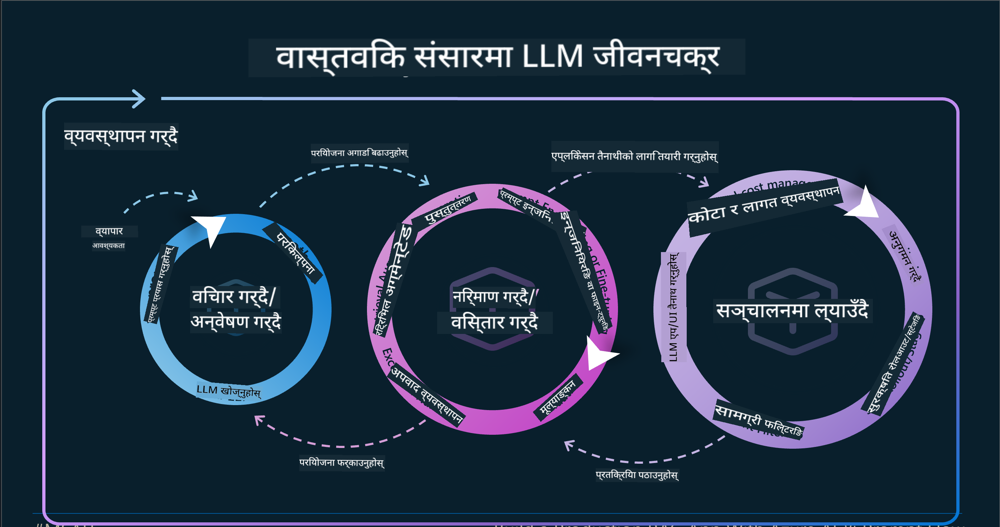
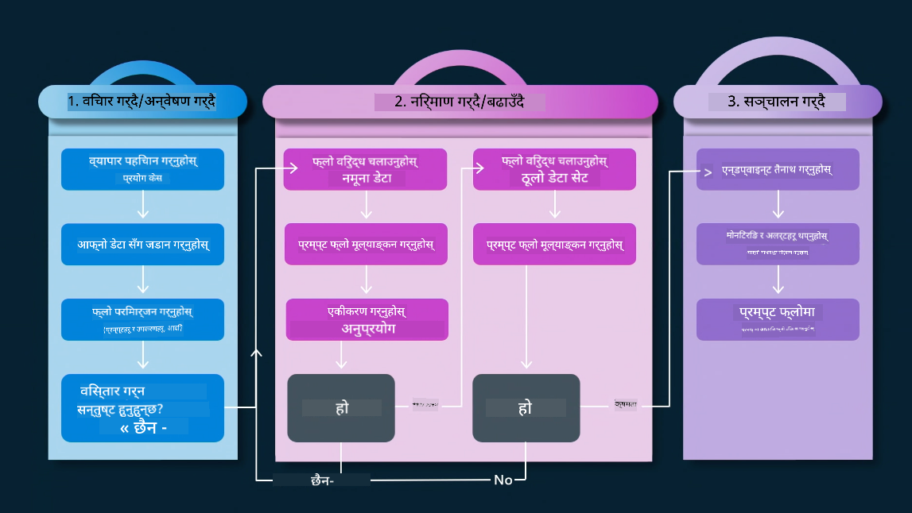
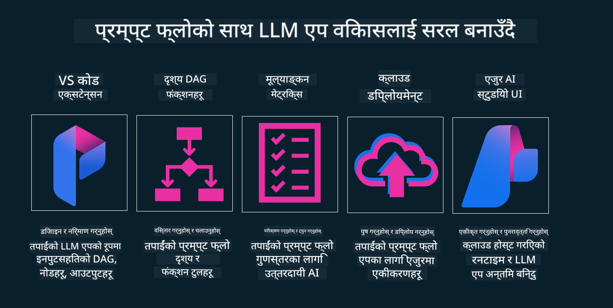

<!--
CO_OP_TRANSLATOR_METADATA:
{
  "original_hash": "27a5347a5022d5ef0a72ab029b03526a",
  "translation_date": "2025-07-09T15:51:16+00:00",
  "source_file": "14-the-generative-ai-application-lifecycle/README.md",
  "language_code": "ne"
}
-->

# जेनेरेटिभ AI एप्लिकेशन जीवनचक्र

सबै AI एप्लिकेशनहरूको लागि एउटा महत्वपूर्ण प्रश्न भनेको AI सुविधाहरूको सान्दर्भिकता हो, किनभने AI छिटो विकास हुँदै गरेको क्षेत्र हो। तपाईंको एप्लिकेशन सान्दर्भिक, भरपर्दो, र मजबुत रहोस् भनेर निरन्तर अनुगमन, मूल्याङ्कन, र सुधार गर्न आवश्यक हुन्छ। यहीँ जेनेरेटिभ AI जीवनचक्रको भूमिका हुन्छ।

जेनेरेटिभ AI जीवनचक्र एउटा रूपरेखा हो जसले तपाईंलाई जेनेरेटिभ AI एप्लिकेशन विकास, परिनियोजन, र मर्मतसम्भारका चरणहरूमा मार्गदर्शन गर्छ। यसले तपाईंलाई लक्ष्यहरू परिभाषित गर्न, प्रदर्शन मापन गर्न, चुनौतीहरू पहिचान गर्न, र समाधानहरू कार्यान्वयन गर्न मद्दत गर्छ। साथै, यसले तपाईंको एप्लिकेशनलाई तपाईंको डोमेन र सरोकारवालाहरूका नैतिक र कानुनी मापदण्डहरूसँग मेल खाने बनाउन सहयोग पुर्‍याउँछ। जेनेरेटिभ AI जीवनचक्रको पालना गरेर, तपाईंले सुनिश्चित गर्न सक्नुहुन्छ कि तपाईंको एप्लिकेशन सधैं मूल्य प्रदान गर्दैछ र प्रयोगकर्ताहरूलाई सन्तुष्ट पार्दैछ।

## परिचय

यस अध्यायमा, तपाईंले:

- MLOps बाट LLMOps तर्फको परिप्रेक्ष्य परिवर्तन बुझ्नुहुनेछ
- LLM जीवनचक्र
- जीवनचक्र उपकरणहरू
- जीवनचक्र मेट्रिफिकेशन र मूल्याङ्कन

## MLOps बाट LLMOps तर्फको परिप्रेक्ष्य परिवर्तन बुझ्नुहोस्

LLM हरू कृत्रिम बुद्धिमत्ताको नयाँ उपकरण हुन्, ती विश्लेषण र जेनेरेशन कार्यहरूमा अत्यन्त शक्तिशाली छन्, तर यस शक्तिले AI र क्लासिक मेशिन लर्निङ कार्यहरूलाई कसरी सहज बनाउने भन्ने कुरामा केही प्रभाव पार्छ।

यसका लागि, हामीलाई यो उपकरणलाई गतिशील रूपमा अनुकूलन गर्न नयाँ परिप्रेक्ष्य आवश्यक छ, सही प्रोत्साहनहरूसँग। हामी पुराना AI एप्लिकेशनहरूलाई "ML Apps" र नयाँ AI एप्लिकेशनहरूलाई "GenAI Apps" वा केवल "AI Apps" भनेर वर्गीकरण गर्न सक्छौं, जुन त्यस समयमा प्रयोग भएका प्रविधि र प्रविधिहरूलाई प्रतिबिम्बित गर्छ। यसले हाम्रो कथालाई धेरै तरिकाले परिवर्तन गर्छ, तलको तुलना हेर्नुहोस्।

ध्यान दिनुहोस् कि LLMOps मा, हामी एप्लिकेशन विकासकर्ताहरूमा बढी केन्द्रित छौं, एकीकरणहरूलाई मुख्य बिन्दुको रूपमा प्रयोग गर्दै, "Models-as-a-Service" प्रयोग गर्दै र मेट्रिक्सका लागि तलका बुँदाहरूमा सोच्दै।

- गुणस्तर: प्रतिक्रिया गुणस्तर
- हानि: जिम्मेवार AI
- इमान्दारी: प्रतिक्रिया आधार (साँच्चिकै छ? सही छ?)
- लागत: समाधान बजेट
- विलम्बता: टोकन प्रतिक्रियाको औसत समय

## LLM जीवनचक्र

पहिले, जीवनचक्र र त्यसमा भएका परिवर्तनहरू बुझ्न, तलको इन्फोग्राफिकमा ध्यान दिनुहोस्।

जसरी तपाईंले देख्न सक्नुहुन्छ, यो सामान्य MLOps जीवनचक्रहरूबाट फरक छ। LLM हरूमा धेरै नयाँ आवश्यकताहरू छन्, जस्तै प्रॉम्प्टिङ, गुणस्तर सुधारका विभिन्न प्रविधिहरू (फाइन-ट्युनिङ, RAG, मेटा-प्रॉम्प्टहरू), जिम्मेवार AI सँग सम्बन्धित मूल्याङ्कन र जिम्मेवारी, र अन्ततः नयाँ मूल्याङ्कन मेट्रिक्सहरू (गुणस्तर, हानि, इमान्दारी, लागत र विलम्बता)।

उदाहरणका लागि, हामी कसरी विचार गर्छौं हेर्नुहोस्। विभिन्न LLM हरूसँग प्रॉम्प्ट इन्जिनियरिङ प्रयोग गरेर सम्भावनाहरू अन्वेषण गर्ने र उनीहरूको हाइपोथेसिस सही हुन सक्छ कि छैन परीक्षण गर्ने।

ध्यान दिनुहोस् कि यो रेखीय होइन, तर एकीकृत लूपहरू, पुनरावृत्तिमूलक र समग्र चक्र सहित।

हामी ती चरणहरू कसरी अन्वेषण गर्न सक्छौं? जीवनचक्र कसरी निर्माण गर्ने भन्नेमा विस्तारमा जानुहोस्।

यो अलिकति जटिल देखिन सक्छ, पहिले तीन मुख्य चरणहरूमा ध्यान केन्द्रित गरौं।

1. विचार/अन्वेषण: अन्वेषण, यहाँ हामी हाम्रो व्यवसाय आवश्यकताहरू अनुसार अन्वेषण गर्न सक्छौं। प्रोटोटाइपिङ, [PromptFlow](https://microsoft.github.io/promptflow/index.html?WT.mc_id=academic-105485-koreyst) सिर्जना गर्ने र हाम्रो हाइपोथेसिसका लागि पर्याप्त प्रभावकारी छ कि छैन परीक्षण गर्ने।
2. निर्माण/वृद्धि: कार्यान्वयन, अब, हामी ठूलो डेटासेटहरूको लागि मूल्याङ्कन सुरु गर्छौं, फाइन-ट्युनिङ र RAG जस्ता प्रविधिहरू लागू गर्छौं, हाम्रो समाधानको मजबुती जाँच्न। यदि काम गर्दैन भने, पुनः कार्यान्वयन, नयाँ चरणहरू थप्ने वा डाटालाई पुनर्संरचना गर्नेले मद्दत गर्न सक्छ। हाम्रो फ्लो र स्केल परीक्षण गरेपछि, यदि काम गर्छ र मेट्रिक्सहरू ठीक छन् भने, यो अर्को चरणका लागि तयार हुन्छ।
3. सञ्चालन: एकीकरण, अब हाम्रो प्रणालीमा अनुगमन र चेतावनी प्रणालीहरू थप्ने, परिनियोजन र एप्लिकेशन एकीकरण गर्ने।

त्यसपछि, सुरक्षा, अनुपालन र शासनमा केन्द्रित व्यवस्थापनको समग्र चक्र हुन्छ।

बधाई छ, अब तपाईंको AI एप्लिकेशन तयार छ र सञ्चालनमा छ। व्यावहारिक अनुभवका लागि, [Contoso Chat Demo](https://nitya.github.io/contoso-chat/?WT.mc_id=academic-105485-koreys) हेर्नुहोस्।

अब, हामी कुन उपकरणहरू प्रयोग गर्न सक्छौं?

## जीवनचक्र उपकरणहरू

उपकरणहरूको लागि, Microsoft ले [Azure AI Platform](https://azure.microsoft.com/solutions/ai/?WT.mc_id=academic-105485-koreys) र [PromptFlow](https://microsoft.github.io/promptflow/index.html?WT.mc_id=academic-105485-koreyst) प्रदान गर्दछ जसले तपाईंको जीवनचक्रलाई सजिलो र छिटो कार्यान्वयन गर्न मद्दत गर्छ।

[Azure AI Platform](https://azure.microsoft.com/solutions/ai/?WT.mc_id=academic-105485-koreys) ले तपाईंलाई [AI Studio](https://ai.azure.com/?WT.mc_id=academic-105485-koreys) प्रयोग गर्न अनुमति दिन्छ। AI Studio एउटा वेब पोर्टल हो जसले तपाईंलाई मोडेलहरू, नमूनाहरू र उपकरणहरू अन्वेषण गर्न, स्रोतहरू व्यवस्थापन गर्न, UI विकास फ्लोहरू र SDK/CLI विकल्पहरू मार्फत कोड-प्रथम विकास गर्न मद्दत गर्छ।

Azure AI ले तपाईंलाई विभिन्न स्रोतहरू प्रयोग गरेर सञ्चालन, सेवा, परियोजना, भेक्टर खोज र डाटाबेस आवश्यकताहरू व्यवस्थापन गर्न अनुमति दिन्छ।

Proof-of-Concept(POC) देखि ठूलो स्केल एप्लिकेशनसम्म PromptFlow सँग निर्माण गर्नुहोस्:

- VS Code बाट एप्लिकेशन डिजाइन र निर्माण गर्नुहोस्, भिजुअल र कार्यात्मक उपकरणहरूसँग
- गुणस्तरीय AI का लागि सजिलैसँग एप्लिकेशनहरू परीक्षण र फाइन-ट्युन गर्नुहोस्।
- Azure AI Studio प्रयोग गरेर क्लाउडसँग एकीकरण र पुनरावृत्ति गर्नुहोस्, छिटो एकीकरणका लागि पुश र परिनियोजन गर्नुहोस्।

## राम्रो! आफ्नो सिकाइ जारी राख्नुहोस्!

अद्भुत, अब [Contoso Chat App](https://nitya.github.io/contoso-chat/?WT.mc_id=academic-105485-koreyst) सँग कसरी एप्लिकेशन संरचना गर्ने र क्लाउड एड्भोकेसीले ती अवधारणाहरू प्रदर्शनहरूमा कसरी थप्छ भनी सिक्नुहोस्। थप सामग्रीका लागि हाम्रो [Ignite ब्रेकआउट सेसन](https://www.youtube.com/watch?v=DdOylyrTOWg) हेर्नुहोस्।

अब, पाठ १५ हेर्नुहोस्, जसले [Retrieval Augmented Generation र Vector Databases](../15-rag-and-vector-databases/README.md?WT.mc_id=academic-105485-koreyst) ले जेनेरेटिभ AI मा कसरी प्रभाव पार्छ र एप्लिकेशनहरूलाई अझ आकर्षक बनाउँछ भन्ने बुझ्न मद्दत गर्नेछ!

**अस्वीकरण**:  
यो दस्तावेज AI अनुवाद सेवा [Co-op Translator](https://github.com/Azure/co-op-translator) प्रयोग गरी अनुवाद गरिएको हो। हामी शुद्धताका लागि प्रयासरत छौं भने पनि, कृपया ध्यान दिनुहोस् कि स्वचालित अनुवादमा त्रुटि वा अशुद्धता हुन सक्छ। मूल दस्तावेज यसको मूल भाषामा नै अधिकारिक स्रोत मानिनु पर्छ। महत्वपूर्ण जानकारीका लागि व्यावसायिक मानव अनुवाद सिफारिस गरिन्छ। यस अनुवादको प्रयोगबाट उत्पन्न कुनै पनि गलतफहमी वा गलत व्याख्याका लागि हामी जिम्मेवार छैनौं।