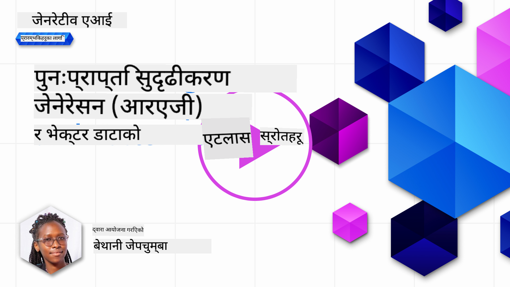
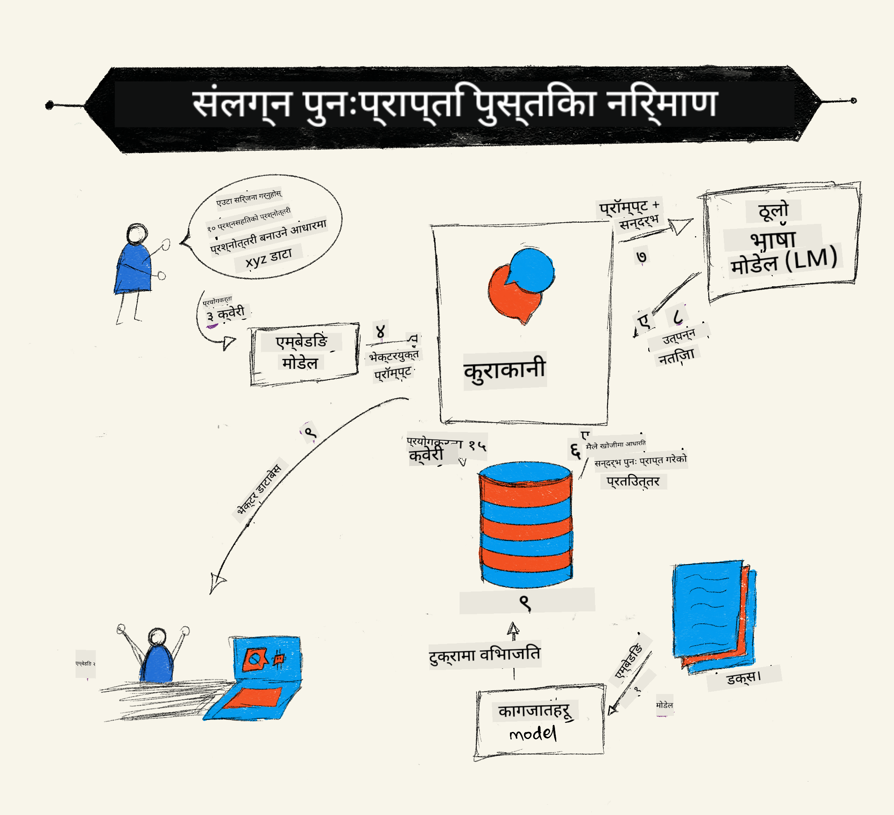
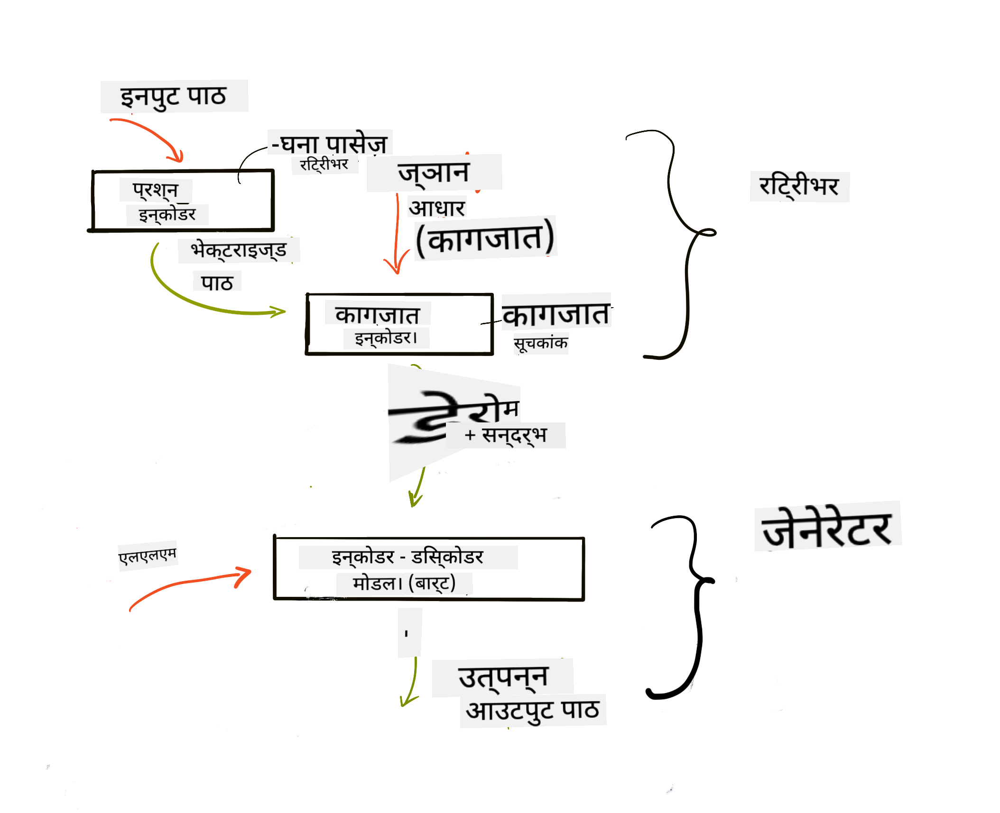
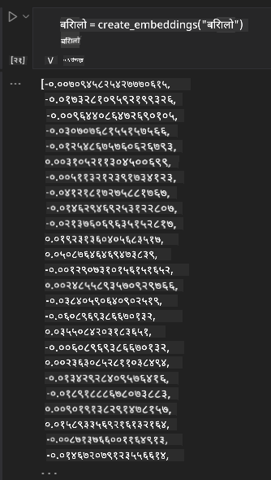

<!--
CO_OP_TRANSLATOR_METADATA:
{
  "original_hash": "b4b0266fbadbba7ded891b6485adc66d",
  "translation_date": "2025-10-17T13:54:21+00:00",
  "source_file": "15-rag-and-vector-databases/README.md",
  "language_code": "ne"
}
-->
# रिट्रिभल अग्मेन्टेड जेनेरेशन (RAG) र भेक्टर डाटाबेस

[](https://youtu.be/4l8zhHUBeyI?si=BmvDmL1fnHtgQYkL)

खोज अनुप्रयोगको पाठमा, हामीले संक्षेपमा तपाईंको आफ्नै डेटा ठूला भाषा मोडेल (LLMs) मा समाहित गर्ने तरिका सिक्यौं। यस पाठमा, हामी तपाईंको LLM अनुप्रयोगमा डेटा आधारभूत गर्ने अवधारणाहरू, प्रक्रिया मेकानिक्स, र डेटा भण्डारण गर्ने विधिहरू, जस्तै इम्बेडिङ्स र पाठ, थप गहिराइमा जान्छौं।

> **भिडियो चाँडै आउँदैछ**

## परिचय

यस पाठमा हामी निम्न विषयहरू समेट्नेछौं:

- RAG को परिचय, यो के हो र किन AI (कृत्रिम बुद्धिमत्ता) मा प्रयोग गरिन्छ।

- भेक्टर डाटाबेस के हो भन्ने बुझ्ने र हाम्रो अनुप्रयोगको लागि एउटा सिर्जना गर्ने।

- RAG लाई अनुप्रयोगमा समाहित गर्ने व्यावहारिक उदाहरण।

## सिक्ने लक्ष्यहरू

यस पाठ पूरा गरेपछि, तपाईं सक्षम हुनुहुनेछ:

- डेटा रिट्रिभल र प्रोसेसिङमा RAG को महत्त्व व्याख्या गर्न।

- RAG अनुप्रयोग सेटअप गर्न र तपाईंको डेटा LLM मा आधारभूत गर्न।

- LLM अनुप्रयोगहरूमा RAG र भेक्टर डाटाबेसको प्रभावकारी समाहित।

## हाम्रो परिदृश्य: हाम्रो आफ्नै डेटा प्रयोग गरेर LLM सुधार गर्ने

यस पाठको लागि, हामी हाम्रो आफ्नै नोटहरू शिक्षा स्टार्टअपमा थप्न चाहन्छौं, जसले च्याटबटलाई विभिन्न विषयहरूमा थप जानकारी प्राप्त गर्न अनुमति दिन्छ। हाम्रो नोटहरूको प्रयोग गरेर, सिक्नेहरूले राम्रोसँग अध्ययन गर्न र विभिन्न विषयहरू बुझ्न सक्नेछन्, जसले उनीहरूको परीक्षाको तयारीलाई सजिलो बनाउँछ। हाम्रो परिदृश्य सिर्जना गर्न, हामी निम्न प्रयोग गर्नेछौं:

- `Azure OpenAI:` च्याटबट सिर्जना गर्न प्रयोग गरिने LLM

- `AI for beginners' पाठ Neural Networks मा:` हाम्रो LLM लाई आधारभूत गर्ने डेटा

- `Azure AI Search` र `Azure Cosmos DB:` हाम्रो डेटा भण्डारण गर्न र खोज सूचक सिर्जना गर्न भेक्टर डाटाबेस

प्रयोगकर्ताहरूले आफ्नो नोटहरूबाट अभ्यास क्विजहरू सिर्जना गर्न, पुनरावलोकन फ्ल्यास कार्डहरू बनाउन र संक्षिप्त सारांशमा परिणत गर्न सक्नेछन्। सुरु गर्न, RAG के हो र यो कसरी काम गर्छ भन्ने कुरा हेरौं:

## रिट्रिभल अग्मेन्टेड जेनेरेशन (RAG)

एक LLM-संचालित च्याटबटले प्रयोगकर्ताको प्रॉम्प्टलाई प्रक्रिया गरेर प्रतिक्रिया उत्पन्न गर्छ। यो अन्तरक्रियात्मक रूपमा डिजाइन गरिएको छ र प्रयोगकर्ताहरूसँग विभिन्न विषयहरूमा संलग्न हुन्छ। तर, यसको प्रतिक्रियाहरू प्रदान गरिएको सन्दर्भ र यसको आधारभूत प्रशिक्षण डेटा सीमित हुन्छ। उदाहरणका लागि, GPT-4 को ज्ञान कटअफ सेप्टेम्बर 2021 हो, जसको अर्थ यो समयपछि भएका घटनाहरूको ज्ञान छैन। साथै, LLM हरूलाई प्रशिक्षण गर्न प्रयोग गरिएको डेटा गोपनीय जानकारी जस्तै व्यक्तिगत नोटहरू वा कम्पनीको उत्पादन म्यानुअल समावेश गर्दैन।

### RAG (रिट्रिभल अग्मेन्टेड जेनेरेशन) कसरी काम गर्छ



मानौं तपाईं आफ्नो नोटहरूबाट क्विजहरू सिर्जना गर्ने च्याटबट तैनात गर्न चाहनुहुन्छ, तपाईंलाई ज्ञान आधारसँग जडान आवश्यक हुनेछ। यहीँ RAG मद्दतमा आउँछ। RAG निम्न तरिकामा काम गर्छ:

- **ज्ञान आधार:** रिट्रिभल अघि, यी दस्तावेजहरूलाई इन्गेस्ट र प्रि-प्रोसेस गर्न आवश्यक छ, सामान्यतया ठूला दस्तावेजहरूलाई साना टुक्रामा तोड्ने, तिनीहरूलाई पाठ इम्बेडिङमा रूपान्तरण गर्ने र डाटाबेसमा भण्डारण गर्ने।

- **प्रयोगकर्ता प्रश्न:** प्रयोगकर्ताले प्रश्न सोध्छ।

- **रिट्रिभल:** जब प्रयोगकर्ताले प्रश्न सोध्छ, इम्बेडिङ मोडेलले हाम्रो ज्ञान आधारबाट सान्दर्भिक जानकारी रिट्रिभ गर्छ जसले प्रॉम्प्टमा समाहित गरिने थप सन्दर्भ प्रदान गर्छ।

- **अग्मेन्टेड जेनेरेशन:** LLM ले रिट्रिभ गरिएको डेटा आधारमा आफ्नो प्रतिक्रिया सुधार गर्छ। यसले उत्पन्न गरिएको प्रतिक्रियालाई केवल प्रि-ट्रेन गरिएको डेटा मात्र नभई थप सन्दर्भबाट सान्दर्भिक जानकारीमा आधारित बनाउँछ। रिट्रिभ गरिएको डेटा LLM को प्रतिक्रियालाई अग्मेन्ट गर्न प्रयोग गरिन्छ। त्यसपछि LLM ले प्रयोगकर्ताको प्रश्नको उत्तर फर्काउँछ।



RAG को आर्किटेक्चर ट्रान्सफर्मरहरू प्रयोग गरेर कार्यान्वयन गरिन्छ जसमा दुई भाग हुन्छन्: एक इन्कोडर र एक डिकोडर। उदाहरणका लागि, जब प्रयोगकर्ताले प्रश्न सोध्छ, इनपुट पाठ 'इन्कोड' गरेर शब्दहरूको अर्थ समेट्ने भेक्टरहरूमा परिणत गरिन्छ र भेक्टरहरू 'डिकोड' गरेर हाम्रो दस्तावेज सूचकमा परिणत गरिन्छ र प्रयोगकर्ता प्रश्नको आधारमा नयाँ पाठ उत्पन्न गरिन्छ। LLM ले आउटपुट उत्पन्न गर्न इन्कोडर-डिकोडर मोडेल दुवै प्रयोग गर्छ।

प्रस्तावित पेपर अनुसार RAG कार्यान्वयन गर्दा दुई दृष्टिकोणहरू छन्: [Retrieval-Augmented Generation for Knowledge intensive NLP (natural language processing software) Tasks](https://arxiv.org/pdf/2005.11401.pdf?WT.mc_id=academic-105485-koreyst):

- **_RAG-Sequence_** रिट्रिभ गरिएको दस्तावेजहरू प्रयोग गरेर प्रयोगकर्ता प्रश्नको लागि सबैभन्दा राम्रो सम्भावित उत्तर भविष्यवाणी गर्ने।

- **RAG-Token** दस्तावेजहरू प्रयोग गरेर अर्को टोकन उत्पन्न गर्ने, त्यसपछि तिनीहरूलाई प्रयोगकर्ता प्रश्नको उत्तर दिन रिट्रिभ गर्ने।

### किन RAG प्रयोग गर्ने? 

- **जानकारीको समृद्धता:** पाठ प्रतिक्रियाहरू अद्यावधिक र वर्तमान सुनिश्चित गर्छ। यसले आन्तरिक ज्ञान आधारमा पहुँच गरेर डोमेन-विशिष्ट कार्यहरूमा प्रदर्शन सुधार गर्छ।

- **सत्यापन योग्य डेटा** प्रयोग गरेर प्रयोगकर्ता प्रश्नहरूको सन्दर्भ प्रदान गरेर निर्माण घटाउँछ।

- **लागत प्रभावकारी:** LLM लाई फाइन-ट्यून गर्ने तुलनामा अधिक आर्थिक।

## ज्ञान आधार सिर्जना गर्ने

हाम्रो अनुप्रयोग हाम्रो व्यक्तिगत डेटा अर्थात् AI For Beginners पाठ्यक्रमको Neural Network पाठमा आधारित छ।

### भेक्टर डाटाबेस

पारम्परिक डाटाबेसको विपरीत, भेक्टर डाटाबेस एक विशेष डाटाबेस हो जुन इम्बेडेड भेक्टरहरू भण्डारण, व्यवस्थापन र खोज गर्न डिजाइन गरिएको हो। यसले दस्तावेजहरूको संख्यात्मक प्रतिनिधित्वहरू भण्डारण गर्छ। डेटा संख्यात्मक इम्बेडिङमा तोड्दा हाम्रो AI प्रणालीलाई डेटा बुझ्न र प्रक्रिया गर्न सजिलो बनाउँछ।

हामी हाम्रो इम्बेडिङहरू भेक्टर डाटाबेसमा भण्डारण गर्छौं किनभने LLM हरूसँग इनपुटको रूपमा स्वीकार गर्ने टोकनहरूको सीमा हुन्छ। तपाईं सम्पूर्ण इम्बेडिङहरू LLM मा पास गर्न सक्नुहुन्न, त्यसैले हामी तिनीहरूलाई टुक्रामा तोड्न आवश्यक छ र जब प्रयोगकर्ताले प्रश्न सोध्छ, प्रश्नसँग सबैभन्दा मिल्दोजुल्दो इम्बेडिङहरू प्रॉम्प्टसँगै फर्काइनेछ। टुक्रा बनाउँदा LLM मा पास गरिने टोकनहरूको लागत पनि घट्छ।

केही लोकप्रिय भेक्टर डाटाबेसहरूमा Azure Cosmos DB, Clarifyai, Pinecone, Chromadb, ScaNN, Qdrant र DeepLake समावेश छन्। तपाईं Azure CLI प्रयोग गरेर निम्न कमाण्डको साथ Azure Cosmos DB मोडेल सिर्जना गर्न सक्नुहुन्छ:

```bash
az login
az group create -n <resource-group-name> -l <location>
az cosmosdb create -n <cosmos-db-name> -r <resource-group-name>
az cosmosdb list-keys -n <cosmos-db-name> -g <resource-group-name>
```

### पाठबाट इम्बेडिङमा

हाम्रो डेटा भण्डारण गर्नु अघि, हामीले यसलाई भेक्टर इम्बेडिङमा रूपान्तरण गर्न आवश्यक छ। यदि तपाईं ठूला दस्तावेजहरू वा लामो पाठहरूसँग काम गर्दै हुनुहुन्छ भने, तपाईंले अपेक्षित प्रश्नहरूको आधारमा तिनीहरूलाई टुक्रा बनाउन सक्नुहुन्छ। टुक्रा बनाउने काम वाक्य स्तरमा वा अनुच्छेद स्तरमा गर्न सकिन्छ। टुक्रा बनाउँदा वरिपरिका शब्दहरूबाट अर्थ निकालिन्छ, तपाईंले टुक्रामा केही अन्य सन्दर्भ थप्न सक्नुहुन्छ, उदाहरणका लागि, दस्तावेज शीर्षक थपेर वा टुक्राको अघि वा पछि केही पाठ समावेश गरेर। तपाईं डेटा यसरी टुक्रा बनाउन सक्नुहुन्छ:

```python
def split_text(text, max_length, min_length):
    words = text.split()
    chunks = []
    current_chunk = []

    for word in words:
        current_chunk.append(word)
        if len(' '.join(current_chunk)) < max_length and len(' '.join(current_chunk)) > min_length:
            chunks.append(' '.join(current_chunk))
            current_chunk = []

    # If the last chunk didn't reach the minimum length, add it anyway
    if current_chunk:
        chunks.append(' '.join(current_chunk))

    return chunks
```

टुक्रा बनाइसकेपछि, हामी विभिन्न इम्बेडिङ मोडेलहरू प्रयोग गरेर हाम्रो पाठलाई इम्बेड गर्न सक्छौं। तपाईंले प्रयोग गर्न सक्ने केही मोडेलहरूमा word2vec, OpenAI को ada-002, Azure Computer Vision र अन्य धेरै समावेश छन्। प्रयोग गर्न मोडेल चयन गर्नु तपाईंले प्रयोग गरिरहेको भाषाहरू, इन्कोड गरिएको सामग्रीको प्रकार (पाठ/छवि/अडियो), इन्कोड गर्न सक्ने इनपुटको आकार र इम्बेडिङ आउटपुटको लम्बाइमा निर्भर गर्दछ।

OpenAI को `text-embedding-ada-002` मोडेल प्रयोग गरेर इम्बेड गरिएको पाठको उदाहरण:


## रिट्रिभल र भेक्टर खोज

जब प्रयोगकर्ताले प्रश्न सोध्छ, रिट्रिभरले यसलाई क्वेरी इन्कोडर प्रयोग गरेर भेक्टरमा रूपान्तरण गर्छ, त्यसपछि हाम्रो दस्तावेज खोज सूचकमा इनपुटसँग सम्बन्धित दस्तावेजहरूमा सान्दर्भिक भेक्टरहरूको खोजी गर्छ। एकपटक सकिएपछि, यो इनपुट भेक्टर र दस्तावेज भेक्टर दुवैलाई पाठमा रूपान्तरण गर्छ र LLM मार्फत पास गर्छ।

### रिट्रिभल

रिट्रिभल तब हुन्छ जब प्रणालीले खोज मापदण्डलाई सन्तुष्ट गर्ने दस्तावेजहरू सूचकबाट छिटो फेला पार्न प्रयास गर्छ। रिट्रिभरको लक्ष्य दस्तावेजहरू प्राप्त गर्नु हो जसले सन्दर्भ प्रदान गर्न र तपाईंको डेटा LLM मा आधारभूत गर्न प्रयोग गरिनेछ।

हाम्रो डाटाबेसमा खोज प्रदर्शन गर्नका लागि विभिन्न तरिकाहरू छन् जस्तै:

- **किवर्ड खोज** - पाठ खोजहरूको लागि प्रयोग गरिन्छ।

- **सामन्तिक खोज** - शब्दहरूको सामन्तिक अर्थ प्रयोग गर्छ।

- **भेक्टर खोज** - इम्बेडिङ मोडेलहरू प्रयोग गरेर दस्तावेजहरूलाई पाठबाट भेक्टर प्रतिनिधित्वमा रूपान्तरण गर्छ। रिट्रिभल प्रयोगकर्ता प्रश्नसँग सबैभन्दा नजिकको भेक्टर प्रतिनिधित्व भएका दस्तावेजहरूलाई क्वेरी गरेर गरिन्छ।

- **हाइब्रिड** - किवर्ड र भेक्टर खोज दुवैको संयोजन।

रिट्रिभलमा चुनौती तब आउँछ जब डाटाबेसमा क्वेरीसँग समान प्रतिक्रिया छैन, प्रणालीले त्यसपछि उपलब्ध सबैभन्दा राम्रो जानकारी फर्काउँछ। तर, तपाईंले सान्दर्भिकताको लागि अधिकतम दूरी सेटअप गर्ने वा किवर्ड र भेक्टर खोज दुवै संयोजन गर्ने हाइब्रिड खोज प्रयोग गर्न सक्नुहुन्छ। यस पाठमा हामी हाइब्रिड खोज प्रयोग गर्नेछौं, किवर्ड र भेक्टर खोज दुवैको संयोजन। हामी हाम्रो डेटा टुक्राहरू र इम्बेडिङहरू समावेश गर्ने स्तम्भहरू भएको डाटाफ्रेममा भण्डारण गर्नेछौं।

### भेक्टर समानता

रिट्रिभरले ज्ञान डाटाबेसमा नजिकैका इम्बेडिङहरूको खोजी गर्छ, सबैभन्दा नजिकको छिमेकी, किनभने तिनीहरू समान पाठहरू हुन्। प्रयोगकर्ताले क्वेरी सोध्दा, यो पहिले इम्बेड गरिन्छ र त्यसपछि समान इम्बेडिङहरूसँग मिलाइन्छ। विभिन्न भेक्टरहरू कति समान छन् भन्ने पत्ता लगाउन प्रयोग गरिने सामान्य मापन कजाइन समानता हो, जुन दुई भेक्टरहरू बीचको कोणमा आधारित छ।

हामी समानता मापन गर्न अन्य विकल्पहरू प्रयोग गर्न सक्छौं जस्तै युक्लिडियन दूरी, जुन भेक्टरको अन्त्य बिन्दुहरू बीचको सीधा रेखा हो, र डट प्रोडक्ट, जसले दुई भेक्टरका सम्बन्धित तत्वहरूको उत्पादनको योगलाई मापन गर्छ।

### खोज सूचक

रिट्रिभल गर्दा, हामीले खोज प्रदर्शन गर्नु अघि हाम्रो ज्ञान आधारको लागि खोज सूचक निर्माण गर्न आवश्यक छ। एक सूचकले हाम्रो इम्बेडिङहरू भण्डारण गर्नेछ र ठूलो डाटाबेसमा पनि सबैभन्दा समान टुक्राहरू छिटो रिट्रिभ गर्न सक्नेछ। हामी हाम्रो सूचक स्थानीय रूपमा निम्न तरिकाले सिर्जना गर्न सक्छौं:

```python
from sklearn.neighbors import NearestNeighbors

embeddings = flattened_df['embeddings'].to_list()

# Create the search index
nbrs = NearestNeighbors(n_neighbors=5, algorithm='ball_tree').fit(embeddings)

# To query the index, you can use the kneighbors method
distances, indices = nbrs.kneighbors(embeddings)
```

### पुनः रैंकिङ

एकपटक तपाईंले डाटाबेसलाई क्वेरी गरेपछि, तपाईंले सबैभन्दा सान्दर्भिकबाट परिणामहरू क्रमबद्ध गर्न आवश्यक हुन सक्छ। पुनः रैंकिङ LLM ले मेशिन लर्निङ प्रयोग गरेर खोज परिणामहरूको सान्दर्भिकता सुधार गर्छ। Azure AI Search प्रयोग गर्दा, पुनः रैंकिङ स्वचालित रूपमा तपाईंको लागि गरिन्छ। नजिकका छिमेकीहरू प्रयोग गरेर पुनः रैंकिङ कसरी काम गर्छ भन्ने उदाहरण:

```python
# Find the most similar documents
distances, indices = nbrs.kneighbors([query_vector])

index = []
# Print the most similar documents
for i in range(3):
    index = indices[0][i]
    for index in indices[0]:
        print(flattened_df['chunks'].iloc[index])
        print(flattened_df['path'].iloc[index])
        print(flattened_df['distances'].iloc[index])
    else:
        print(f"Index {index} not found in DataFrame")
```

## सबैलाई एकसाथ ल्याउँदै

अन्तिम चरण भनेको हाम्रो डेटा आधारभूत गर्न सक्ने प्रतिक्रियाहरू प्राप्त गर्न हाम्रो LLM समाहित गर्नु हो। हामी यसलाई निम्न तरिकाले कार्यान्वयन गर्न सक्छौं:

```python
user_input = "what is a perceptron?"

def chatbot(user_input):
    # Convert the question to a query vector
    query_vector = create_embeddings(user_input)

    # Find the most similar documents
    distances, indices = nbrs.kneighbors([query_vector])

    # add documents to query  to provide context
    history = []
    for index in indices[0]:
        history.append(flattened_df['chunks'].iloc[index])

    # combine the history and the user input
    history.append(user_input)

    # create a message object
    messages=[
        {"role": "system", "content": "You are an AI assistant that helps with AI questions."},
        {"role": "user", "content": history[-1]}
    ]

    # use chat completion to generate a response
    response = openai.chat.completions.create(
        model="gpt-4",
        temperature=0.7,
        max_tokens=800,
        messages=messages
    )

    return response.choices[0].message

chatbot(user_input)
```

## हाम्रो अनुप्रयोगको मूल्याङ्कन

### मूल्याङ्कन मापदण्डहरू

- प्रतिक्रिया आपूर्ति गर्ने गुणस्तर सुनिश्चित गर्दै यो प्राकृतिक, प्रवाहपूर्ण र मानव-जस्तो सुनिन्छ।

- डेटा आधारभूतता: प्रतिक्रिया आपूर्ति गरिएका दस्तावेजहरूबाट आएको छ कि छैन मूल्याङ्कन गर्ने।

- सान्दर्भिकता: प्रतिक्रिया सोधिएको प्रश्नसँग मेल खाएको छ र सम्बन्धित छ कि छैन मूल्याङ्कन गर्ने।

- प्रवाह - प्रतिक्रिया व्याकरणात्मक रूपमा अर्थपूर्ण छ कि छैन।

## RAG (रिट्रिभल अग्मेन्टेड जेनेरेशन) र भेक्टर डाटाबेस प्रयोग गर्ने प्रयोग केसहरू

फंक्शन कलहरूले तपाईंको अनुप्रयोग सुधार गर्न सक्ने धेरै विभिन्न प्रयोग केसहरू छन् जस्तै:

- प्रश्न र उत्तर: तपाईंको कम्पनी डेटा च्याटमा आधारभूत गर्दै जसले कर्मचारीहरूले प्रश्न सोध्न प्रयोग गर्न सक्ने।

- सिफारिस प्रणालीहरू: जहाँ तपाईं सबैभन्दा समान मानहरू मिल्ने प्रणाली सिर्जना गर्न सक्नुहुन्छ जस्तै चलचित्रहरू, रेस्टुरेन्टहरू र अन्य धेरै।

- च्याटबट सेवाहरू: तपाईं च्याट इतिहास भण्डारण गर्न सक्नुहुन्छ र प्रयोगकर्ता डेटा आधारमा कुराकानीलाई व्यक्तिगत बनाउन सक्नुहुन्छ।

- भेक्टर इम्बेडिङमा आधारित छवि खोज, छवि पहिचान र असामान्यता पत्ता लगाउन उपयोगी।

## सारांश

हामीले RAG को आधारभूत क्षेत्रहरू समेटेका छौं, हाम्रो अनुप्रयोगमा डेटा थप्ने, प्रयोगकर्ता क्वेरी र आउटपुट। RAG सिर्जना गर्नलाई सरल बनाउन, तपाईं Semanti Kernel, Langchain वा Autogen जस्ता फ्रेमवर्कहरू प्रयोग गर्न सक्नुहुन्छ।

## असाइनमेन्ट

रिट्रिभल अग्मेन्टेड जेनेरेशन (RAG) को सिकाइ जारी राख्न तपाईं निम्न निर्माण गर्न सक्नुहुन्छ:

- तपाईंको रोजाइको फ्रेमवर्क प्रयोग गरेर अनुप्रयोगको फ्रन्ट-एन्ड निर्माण गर्नुहोस्।

- LangChain वा Semantic Kernel मध्ये कुनै एक फ्रेमवर्क प्रयोग गरेर तपाईंको अनुप्रयोग पुनः सिर्जना गर्नुहोस्।

पाठ पूरा गर्नुभएकोमा बधाई छ 👏।

## सिकाइ यहाँ रोकिँदैन, यात्रा जारी राख्नुहोस्

यस पाठ पूरा गरेपछि, हाम्रो [Generative AI Learning collection](https://aka.ms/genai-collection?WT.mc_id=academic-105485-koreyst) हेर्नुहोस् र तपाईंको Generative AI ज्ञानलाई स्तरवृद्धि गर्न जारी राख्नुहोस्!

---

**अस्वीकरण**:  
यो दस्तावेज AI अनुवाद सेवा [Co-op Translator](https://github.com/Azure/co-op-translator) प्रयोग गरेर अनुवाद गरिएको छ। हामी शुद्धताको लागि प्रयास गर्छौं, तर कृपया ध्यान दिनुहोस् कि स्वचालित अनुवादमा त्रुटिहरू वा अशुद्धताहरू हुन सक्छ। यसको मूल भाषा मा रहेको दस्तावेजलाई आधिकारिक स्रोत मानिनुपर्छ। महत्वपूर्ण जानकारीको लागि, व्यावसायिक मानव अनुवाद सिफारिस गरिन्छ। यस अनुवादको प्रयोगबाट उत्पन्न हुने कुनै पनि गलतफहमी वा गलत व्याख्याको लागि हामी जिम्मेवार हुने छैनौं।