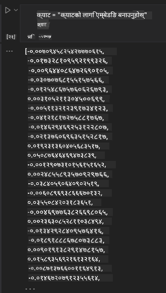

<!--
CO_OP_TRANSLATOR_METADATA:
{
  "original_hash": "e2861bbca91c0567ef32bc77fe054f9e",
  "translation_date": "2025-05-20T01:11:09+00:00",
  "source_file": "15-rag-and-vector-databases/README.md",
  "language_code": "ne"
}
-->
# रिट्रिवल अग्मेन्टेड जेनेरेशन (RAG) र भेक्टर डाटाबेसहरू

खोज अनुप्रयोग पाठमा, हामीले ठूलो भाषा मोडेलहरू (LLMs) मा तपाईंको आफ्नै डाटा कसरी समाहित गर्ने भनेर संक्षेपमा सिक्यौं। यस पाठमा, हामी तपाईंको LLM अनुप्रयोगमा तपाईंको डाटालाई आधार बनाउने अवधारणाहरू, प्रक्रियाको यान्त्रिकी, र डेटा भण्डारण गर्ने विधिहरू, जसमा दुवै इम्बेडिङ र पाठ समावेश छन्, थप गहिराइमा जान्छौं।

> **भिडियो चाँडै आउँदैछ**

## परिचय

यस पाठमा हामी निम्न कुराहरू समावेश गर्नेछौं:

- RAG को परिचय, यो के हो र AI (कृत्रिम बुद्धिमत्ता) मा किन प्रयोग गरिन्छ।

- भेक्टर डाटाबेसहरू के हुन् भनेर बुझ्नुहोस् र हाम्रो अनुप्रयोगको लागि एउटा सिर्जना गर्नुहोस्।

- RAG लाई अनुप्रयोगमा कसरी समाहित गर्ने भन्ने व्यावहारिक उदाहरण।

## सिकाइ लक्ष्यहरू

यस पाठ पूरा गरेपछि, तपाईं सक्षम हुनुहुनेछ:

- डाटा पुनःप्राप्ति र प्रशोधनमा RAG को महत्त्व व्याख्या गर्नुहोस्।

- RAG अनुप्रयोग सेटअप गर्नुहोस् र तपाईंको डाटालाई LLM मा आधार बनाउनुहोस्

- LLM अनुप्रयोगहरूमा RAG र भेक्टर डाटाबेसहरूको प्रभावकारी समाहित।

## हाम्रो परिदृश्य: हाम्रो LLMs लाई हाम्रो आफ्नै डाटासँग सुदृढ गर्दै

यस पाठको लागि, हामीले हाम्रो आफ्नै नोटहरू शिक्षाको स्टार्टअपमा थप्न चाहन्छौं, जसले च्याटबटलाई विभिन्न विषयहरूमा थप जानकारी प्राप्त गर्न अनुमति दिन्छ। हामीसँग भएका नोटहरूको प्रयोग गरेर, सिक्नेलाई उनीहरूको परीक्षाको तयारी गर्न सजिलो बनाउँदै विभिन्न विषयहरूलाई राम्रोसँग अध्ययन गर्न र बुझ्न सक्षम हुनेछन्। हाम्रो परिदृश्य सिर्जना गर्न, हामी प्रयोग गर्नेछौं:

- `Azure OpenAI:` हाम्रो च्याटबट सिर्जना गर्न हामीले प्रयोग गर्ने LLM

- `AI for beginners' lesson on Neural Networks`: यो डाटा हुनेछ जसमा हामी हाम्रो LLM लाई आधार बनाउँछौं

- `Azure AI Search` र `Azure Cosmos DB:` भेक्टर डाटाबेस हाम्रो डाटा भण्डारण गर्न र खोज सूचकांक सिर्जना गर्न

प्रयोगकर्ताहरूले आफ्ना नोटहरूबाट अभ्यास क्विजहरू, संशोधन फ्ल्यास कार्डहरू सिर्जना गर्न र यसलाई संक्षिप्त अवलोकनमा संक्षेप गर्न सक्षम हुनेछन्। सुरु गर्न, आउनुहोस् RAG के हो र कसरी काम गर्छ भनेर हेरौं:

## रिट्रिवल अग्मेन्टेड जेनेरेशन (RAG)

एक LLM संचालित च्याटबटले प्रयोगकर्ता संकेतहरूलाई प्रतिक्रिया उत्पन्न गर्न प्रक्रिया गर्छ। यसलाई अन्तरक्रियात्मक हुनको लागि डिजाइन गरिएको छ र विभिन्न विषयहरूमा प्रयोगकर्ताहरूसँग संलग्न हुन्छ। यद्यपि, यसको प्रतिक्रियाहरू प्रदान गरिएको सन्दर्भ र यसको आधारभूत प्रशिक्षण डाटामा सीमित छन्। उदाहरणका लागि, GPT-4 को ज्ञान कटअफ सेप्टेम्बर 2021 हो, यसको अर्थ, यस अवधिपछि भएका घटनाहरूको ज्ञान छैन। थप रूपमा, LLM हरूलाई तालिम दिन प्रयोग गरिएको डाटाले व्यक्तिगत नोटहरू वा कम्पनीको उत्पादन म्यानुअल जस्ता गोप्य जानकारीलाई बाहिर राख्छ।

### RAGs (रिट्रिवल अग्मेन्टेड जेनेरेशन) कसरी काम गर्छन्

मानौं तपाईं च्याटबटलाई आफ्नो नोटबाट क्विजहरू सिर्जना गर्न तैनाथ गर्न चाहनुहुन्छ, तपाईंलाई ज्ञान आधारमा जडान आवश्यक पर्नेछ। यहाँ RAG मद्दत गर्न आउँछ। RAG हरू यसरी सञ्चालन गर्छन्:

- **ज्ञान आधार:** पुनःप्राप्ति अघि, यी दस्तावेजहरूलाई सामान्यतया ठूला दस्तावेजहरूलाई साना टुक्राहरूमा तोडेर, तिनीहरूलाई पाठ इम्बेडिङमा रूपान्तरण गरेर र तिनीहरूलाई डाटाबेसमा भण्डारण गरेर निगल्न र पूर्व-प्रक्रिया गर्न आवश्यक छ।

- **प्रयोगकर्ता प्रश्न:** प्रयोगकर्ताले प्रश्न सोध्छ

- **पुनःप्राप्ति:** जब प्रयोगकर्ताले प्रश्न सोध्छ, इम्बेडिङ मोडेलले हाम्रो ज्ञान आधारबाट सान्दर्भिक जानकारी पुनःप्राप्ति गर्दछ जसलाई संकेतमा समाहित गरिने थप सन्दर्भ प्रदान गर्न।

- **अग्मेन्टेड जेनेरेशन:** LLM ले पुनःप्राप्त गरिएको डाटामा आधारित आफ्नो प्रतिक्रिया बढाउँछ। यसले उत्पन्न प्रतिक्रियालाई पूर्व-प्रशिक्षित डाटामा मात्र नभई थप गरिएको सन्दर्भबाट सान्दर्भिक जानकारीमा आधारित हुन अनुमति दिन्छ। पुनःप्राप्त गरिएको डाटा LLM को प्रतिक्रियाहरूलाई बढाउन प्रयोग गरिन्छ। त्यसपछि LLM ले प्रयोगकर्ताको प्रश्नको जवाफ फिर्ता गर्छ।

RAG हरूको लागि वास्तुकला ट्रान्सफर्मरहरू प्रयोग गरेर कार्यान्वयन गरिन्छ जसमा दुई भागहरू हुन्छन्: एन्कोडर र डिकोडर। उदाहरणका लागि, जब प्रयोगकर्ताले प्रश्न सोध्छ, इनपुट पाठलाई शब्दहरूको अर्थ समातेर भेक्टरहरूमा 'एन्कोड' गरिन्छ र भेक्टरहरूलाई हाम्रो दस्तावेज सूचकांकमा 'डिकोड' गरिन्छ र प्रयोगकर्ता प्रश्नको आधारमा नयाँ पाठ उत्पन्न गर्छ। LLM ले आउटपुट उत्पन्न गर्न एन्कोडर-डिकोडर मोडेल दुवै प्रयोग गर्दछ।

प्रस्तावित पत्र अनुसार RAG कार्यान्वयन गर्दा दुई दृष्टिकोणहरू: [ज्ञान गहन NLP (प्राकृतिक भाषा प्रशोधन सफ्टवेयर) कार्यहरूको लागि पुनःप्राप्ति-अग्मेन्टेड जेनेरेशन](https://arxiv.org/pdf/2005.11401.pdf?WT.mc_id=academic-105485-koreyst) हुन्:

- **_RAG-सीक्वेन्स_** प्रयोगकर्ता प्रश्नको लागि उत्तम सम्भावित उत्तर भविष्यवाणी गर्न पुनःप्राप्त गरिएको दस्तावेजहरू प्रयोग गर्दै

- **RAG-टोकन** दस्तावेजहरू प्रयोग गरेर अर्को टोकन उत्पन्न गर्न, त्यसपछि तिनीहरूलाई प्रयोगकर्ता प्रश्नको उत्तर दिन पुनःप्राप्त गर्नुहोस्

### तपाईं किन RAG हरू प्रयोग गर्नुहुन्छ?

- **जानकारीको समृद्धि:** पाठ प्रतिक्रियाहरू अद्यावधिक र वर्तमान छन् भन्ने सुनिश्चित गर्दछ। यसले, त्यसैले, आन्तरिक ज्ञान आधार पहुँच गरेर डोमेन विशेष कार्यहरूमा प्रदर्शन बढाउँछ।

- **सत्यापन योग्य डाटा** प्रयोग गरेर प्रयोगकर्ता प्रश्नहरूको सन्दर्भ प्रदान गर्न ज्ञान आधारमा कपोलकल्पित कमी गर्छ।

- यो **लागत प्रभावी** छ किनभने तिनीहरू LLM लाई फाइन-ट्यूनिंग गर्ने भन्दा बढी किफायती छन्

## ज्ञान आधार सिर्जना गर्दै

हाम्रो अनुप्रयोग हाम्रो व्यक्तिगत डाटा अर्थात् AI को लागि बिगिनर्स पाठ्यक्रममा न्यूरल नेटवर्क पाठमा आधारित छ।

### भेक्टर डाटाबेसहरू

एक भेक्टर डाटाबेस, परम्परागत डाटाबेसहरू विपरीत, इम्बेड गरिएको भेक्टरहरू भण्डारण गर्न, व्यवस्थापन गर्न र खोजी गर्न डिजाइन गरिएको विशेष डाटाबेस हो। यसले दस्तावेजहरूको संख्यात्मक प्रतिनिधित्वहरू भण्डारण गर्दछ। डाटालाई संख्यात्मक इम्बेडिङमा तोड्दा हाम्रो AI प्रणालीले डाटालाई बुझ्न र प्रक्रिया गर्न सजिलो बनाउँछ।

हामीले हाम्रो इम्बेडिङहरू भेक्टर डाटाबेसहरूमा भण्डारण गर्छौं किनभने LLM हरूसँग इनपुटको रूपमा स्वीकार गर्ने टोकनहरूको सीमितता छ। तपाईं LLM लाई सम्पूर्ण इम्बेडिङहरू पास गर्न सक्नुहुन्न, हामीले तिनीहरूलाई टुक्राहरूमा तोड्न आवश्यक पर्नेछ र जब प्रयोगकर्ताले प्रश्न सोध्छ, प्रश्नसँग मिल्दोजुल्दो इम्बेडिङहरू संकेतको साथ फिर्ता गरिनेछ। चंकिन्गले LLM मार्फत पास गरिएका टोकनहरूको संख्यामा लागत पनि घटाउँछ।

केहि लोकप्रिय भेक्टर डाटाबेसहरूमा Azure Cosmos DB, Clarifyai, Pinecone, Chromadb, ScaNN, Qdrant र DeepLake समावेश छन्। तपाईंले निम्न आदेशको साथ Azure CLI प्रयोग गरेर Azure Cosmos DB मोडेल सिर्जना गर्न सक्नुहुन्छ:

```bash
az login
az group create -n <resource-group-name> -l <location>
az cosmosdb create -n <cosmos-db-name> -r <resource-group-name>
az cosmosdb list-keys -n <cosmos-db-name> -g <resource-group-name>
```

### पाठबाट इम्बेडिङमा

हाम्रो डाटा भण्डारण गर्नु अघि, हामीले यसलाई डाटाबेसमा भण्डारण गर्नु अघि भेक्टर इम्बेडिङमा रूपान्तरण गर्न आवश्यक छ। यदि तपाईं ठूलो दस्तावेजहरू वा लामो पाठहरूसँग काम गर्दै हुनुहुन्छ भने, तपाईंले अपेक्षा गर्ने प्रश्नहरूमा आधारित टुक्राहरूमा विभाजन गर्न सक्नुहुन्छ। चंकिन्ग वाक्य स्तरमा वा अनुच्छेद स्तरमा गर्न सकिन्छ। चंकिन्गले तिनीहरूको वरपरका शब्दहरूबाट अर्थ निकाल्छ, तपाईंले टुक्रामा केही अन्य सन्दर्भ थप्न सक्नुहुन्छ, उदाहरणका लागि, दस्तावेज शीर्षक थपेर वा टुक्राको अघि वा पछि केही पाठ समावेश गरेर। तपाईं डाटालाई यसरी टुक्रा गर्न सक्नुहुन्छ:

```python
def split_text(text, max_length, min_length):
    words = text.split()
    chunks = []
    current_chunk = []

    for word in words:
        current_chunk.append(word)
        if len(' '.join(current_chunk)) < max_length and len(' '.join(current_chunk)) > min_length:
            chunks.append(' '.join(current_chunk))
            current_chunk = []

    # If the last chunk didn't reach the minimum length, add it anyway
    if current_chunk:
        chunks.append(' '.join(current_chunk))

    return chunks
```

एक पटक टुक्रा भएपछि, हामी विभिन्न इम्बेडिङ मोडेलहरू प्रयोग गरेर हाम्रो पाठलाई इम्बेड गर्न सक्छौं। तपाईंले प्रयोग गर्न सक्ने केही मोडेलहरूमा: word2vec, OpenAI द्वारा ada-002, Azure Computer Vision र धेरै थप समावेश छन्। प्रयोग गर्नको लागि मोडेल चयन गर्नु भाषाहरूमा निर्भर हुनेछ जुन तपाईं प्रयोग गर्दै हुनुहुन्छ, इन्कोड गरिएको सामग्रीको प्रकार (पाठ/छविहरू/अडियो), यसले इन्कोड गर्न सक्ने इनपुटको आकार र इम्बेडिङ आउटपुटको लम्बाइ।

OpenAI को `text-embedding-ada-002` मोडेल प्रयोग गरेर इम्बेड गरिएको पाठको एक उदाहरण हो:


## पुनःप्राप्ति र भेक्टर खोज

जब प्रयोगकर्ताले प्रश्न सोध्छ, पुनःप्राप्तकर्ताले यसलाई क्वेरी एन्कोडर प्रयोग गरेर भेक्टरमा रूपान्तरण गर्छ, त्यसपछि यसले इनपुटसँग सम्बन्धित दस्तावेजमा सान्दर्भिक भेक्टरहरूको लागि हाम्रो दस्तावेज खोज सूचकांक मार्फत खोज्छ। एक पटक गरिसकेपछि, यसले इनपुट भेक्टर र दस्तावेज भेक्टर दुवैलाई पाठमा रूपान्तरण गर्छ र यसलाई LLM मार्फत पास गर्छ।

### पुनःप्राप्ति

पुनःप्राप्ति तब हुन्छ जब प्रणालीले सूचकांकबाट खोज मापदण्डहरू पूरा गर्ने दस्तावेजहरू छिटो फेला पार्न प्रयास गर्छ। पुनःप्राप्तकर्ताको लक्ष्य भनेको सन्दर्भ प्रदान गर्न र LLM लाई तपाईंको डाटामा आधार बनाउन प्रयोग गरिने दस्तावेजहरू प्राप्त गर्नु हो।

हाम्रो डाटाबेस भित्र खोज प्रदर्शन गर्न धेरै तरिकाहरू छन् जस्तै:

- **किवर्ड खोज** - पाठ खोजहरूको लागि प्रयोग गरिन्छ

- **सामान्य अर्थ खोज** - शब्दहरूको सामान्य अर्थ प्रयोग गर्छ

- **भेक्टर खोज** - इम्बेडिङ मोडेलहरू प्रयोग गरेर पाठबाट भेक्टर प्रतिनिधित्वमा दस्तावेजहरू रूपान्तरण गर्छ। पुनःप्राप्ति प्रयोगकर्ता प्रश्नको नजिकका भेक्टर प्रतिनिधित्व भएका दस्तावेजहरूलाई क्वेरी गरेर गरिनेछ।

- **हाइब्रिड** - किवर्ड र भेक्टर खोज दुवैको संयोजन।

पुनःप्राप्तिमा चुनौती तब आउँछ जब डाटाबेसमा प्रश्नको समान प्रतिक्रिया हुँदैन, प्रणालीले तिनीहरूले प्राप्त गर्न सक्ने उत्तम जानकारी फिर्ता गर्नेछ, तथापि, तपाईंले सान्दर्भिकताको लागि अधिकतम दूरी सेटअप गर्ने वा किवर्ड र भेक्टर खोज दुवैको संयोजन गर्ने हाइब्रिड खोज जस्ता रणनीतिहरू प्रयोग गर्न सक्नुहुन्छ। यस पाठमा हामी हाइब्रिड खोज प्रयोग गर्नेछौं, भेक्टर र किवर्ड खोज दुवैको संयोजन। हामीले हाम्रो डाटालाई टुक्राहरूको साथै इम्बेडिङहरू समावेश गर्ने स्तम्भहरू भएको डेटा फ्रेममा भण्डारण गर्नेछौं।

### भेक्टर समानता

पुनःप्राप्तकर्ताले नजिकका छिमेकी, किनभने ती समान पाठहरू हुन्, को रूपमा सँगै नजिक रहेका इम्बेडिङहरूको लागि ज्ञान डाटाबेस खोज गर्नेछ। प्रयोगकर्ताले प्रश्न सोध्दा, यो पहिलो पटक इम्बेड गरिन्छ र त्यसपछि समान इम्बेडिङहरूसँग मिल्दछ। विभिन्न भेक्टरहरू कति समान छन् भनेर फेला पार्न प्रयोग हुने सामान्य मापन भनेको कोसाइन समानता हो जुन दुई भेक्टरहरू बीचको कोणमा आधारित छ।

हामी समानता मापन गर्न अन्य विकल्पहरू प्रयोग गर्न सक्छौं, जस्तै भेक्टरको अन्त्य बिन्दुहरू बीचको सिधा रेखा मापन गर्ने युक्लिडियन दूरी र दुई भेक्टरका समकक्ष तत्वहरूको उत्पादनहरूको योग मापन गर्ने डट उत्पादन।

### खोज सूचकांक

पुनःप्राप्ति गर्दा, हामीले खोज गर्नु अघि हाम्रो ज्ञान आधारको लागि खोज सूचकांक निर्माण गर्न आवश्यक छ। सूचकांकले हाम्रो इम्बेडिङहरू भण्डारण गर्नेछ र ठूलो डाटाबेसमा पनि सबैभन्दा समान टुक्राहरू छिटो पुनःप्राप्ति गर्न सक्छ। हामीले स्थानीय रूपमा हाम्रो सूचकांक यसरी सिर्जना गर्न सक्छौं:

```python
from sklearn.neighbors import NearestNeighbors

embeddings = flattened_df['embeddings'].to_list()

# Create the search index
nbrs = NearestNeighbors(n_neighbors=5, algorithm='ball_tree').fit(embeddings)

# To query the index, you can use the kneighbors method
distances, indices = nbrs.kneighbors(embeddings)
```

### पुनः-र्याङ्किङ

एक पटक तपाईंले डाटाबेस क्वेरी गरेपछि, तपाईंले सबैभन्दा सान्दर्भिकबाट परिणामहरू क्रमबद्ध गर्न आवश्यक हुन सक्छ। पुनः-र्याङ्किङ LLM ले मेसिन लर्निङको प्रयोग गरेर खोज परिणामहरूको प्रासंगिकतालाई सुधार गर्छ र तिनीहरूलाई सबैभन्दा सान्दर्भिकबाट क्रमबद्ध गर्छ। Azure AI खोजको प्रयोग गरेर, पुनः-र्याङ्किङ स्वचालित रूपमा तपाईंको लागि गरिन्छ। नजिकका छिमेकीहरू प्रयोग गरेर पुनः-र्याङ्किङ कसरी काम गर्छ भन्ने उदाहरण:

```python
# Find the most similar documents
distances, indices = nbrs.kneighbors([query_vector])

index = []
# Print the most similar documents
for i in range(3):
    index = indices[0][i]
    for index in indices[0]:
        print(flattened_df['chunks'].iloc[index])
        print(flattened_df['path'].iloc[index])
        print(flattened_df['distances'].iloc[index])
    else:
        print(f"Index {index} not found in DataFrame")
```

## यसलाई सबै एकसाथ ल्याउँदै

अन्तिम चरण भनेको हाम्रो LLM लाई मिश्रणमा थप्नु हो जसले गर्दा हामीलाई हाम्रो डाटामा आधारित प्रतिक्रियाहरू प्राप्त गर्न सक्षम बनाउँछ। हामी यसलाई यसरी कार्यान्वयन गर्न सक्छौं:

```python
user_input = "what is a perceptron?"

def chatbot(user_input):
    # Convert the question to a query vector
    query_vector = create_embeddings(user_input)

    # Find the most similar documents
    distances, indices = nbrs.kneighbors([query_vector])

    # add documents to query  to provide context
    history = []
    for index in indices[0]:
        history.append(flattened_df['chunks'].iloc[index])

    # combine the history and the user input
    history.append(user_input)

    # create a message object
    messages=[
        {"role": "system", "content": "You are an AI assistant that helps with AI questions."},
        {"role": "user", "content": history[-1]}
    ]

    # use chat completion to generate a response
    response = openai.chat.completions.create(
        model="gpt-4",
        temperature=0.7,
        max_tokens=800,
        messages=messages
    )

    return response.choices[0].message

chatbot(user_input)
```

## हाम्रो अनुप्रयोग मूल्याङ्कन गर्दै

### मूल्याङ्कन मेट्रिक्स

- प्रतिक्रियाहरूको गुणस्तर सुनिश्चित गर्दै यो प्राकृतिक, प्रवाही र मानव-जस्तो सुनिन्छ

- डाटाको आधार: प्रतिक्रियाहरू आपूर्ति गरिएका कागजातहरूबाट आएका हुन् कि भनेर मूल्याङ्कन गर्दै

- प्रासंगिकता: प्रतिक्रिया सोधिएको प्रश्नसँग मेल खान्छ र सम्बन्धित छ कि भनेर मूल्याङ्कन गर्दै

- प्रवाही - प्रतिक्रिया व्याकरण रूपमा अर्थपूर्ण छ कि छैन

## RAG (रिट्रिवल अग्मेन्टेड जेनेरेशन) र भेक्टर डाटाबेसहरू प्रयोग गर्ने प्रयोग केसहरू

धेरै विभिन्न प्रयोग केसहरू छन् जहाँ फङ्सन कलहरूले तपाईंको अनुप्रयोग सुधार गर्न सक्छन् जस्तै:

- प्रश्न र उत्तर: तपाईंको कम्पनी डाटालाई आधार बनाएर कर्मचारीहरूले प्रश्न सोध्न प्रयोग गर्न सकिने च्याट।

- सिफारिस प्रणालीहरू: जहाँ तपाईंले सबैभन्दा समान मानहरू जस्तै चलचित्रहरू, रेस्टुरेन्टहरू र धेरै थप मिल्दोजुल्दो प्रणाली सिर्जना गर्न सक्नुहुन्छ।

- च्याटबट सेवाहरू: तपाईंले च्याट इतिहास भण्डारण गर्न र प्रयोगकर्ता डाटामा आधारित कुराकानीलाई निजीकृत गर्न सक्नुहुन्छ।

- भेक्टर इम्बेडिङमा आधारित छवि खोज, छवि पहिचान र असामान्यता पत्ता लगाउँदा उपयोगी।

## सारांश

हामीले RAG को मौलिक क्षेत्रहरू समेटेका छौं, हाम्रो अनुप्रयोगमा हाम्रो डाटा थप्न देखि प्रयोगकर्ता प्रश्न र आउटपुट सम्म। RAG को सिर्जना सरल बनाउनको लागि, तपाईंले सेम्यान्टिक कर्नेल, लङचेन वा अटो-जेन जस्ता फ्रेमवर्कहरू प्रयोग गर्न सक्नुहुन्छ।

## असाइनमेन्ट

रिट्रिवल अग्मेन्टेड जेनेरेशन (RAG) को सिकाइलाई जारी राख्न तपाईंले निर्माण गर्न सक्नुहुन्छ:

- तपाईंको छनोटको फ्रेमवर्क प्रयोग गरेर अनुप्रयोगको लागि फ्रन्ट-एन्ड निर्माण गर्नुहोस्

- फ्रेमवर्क, लङचेन वा सेम्यान्टिक कर्नेल मध्ये कुनै एक प्रयोग गर्नुहोस्, र तपाईंको अनुप्रयोग पुनः सिर्जना गर्नुहोस्।

पाठ पूरा गर्नुभएकोमा बधाई छ 👏।

## सिकाइ यहाँ रोकिँदैन, यात्रा जारी राख्नुहोस्

यस पाठ पूरा गरेपछि, हाम्रो [जेनेरेटिभ AI सिकाइ सङ्ग्रह](https://aka.ms/genai-collection?WT.mc_id=academic-105485-koreyst) हेर्नुहोस् र आफ्नो जेनेरेटिभ AI ज्ञानलाई स्तरवृद्धि गर्न जारी राख्नुहोस्!

**अस्वीकरण**:  
यो दस्तावेज AI अनुवाद सेवा [Co-op Translator](https://github.com/Azure/co-op-translator) प्रयोग गरेर अनुवाद गरिएको हो। हामी शुद्धताका लागि प्रयासरत भए तापनि, कृपया जानकार हुनुहोस् कि स्वचालित अनुवादमा त्रुटिहरू वा अशुद्धताहरू हुन सक्छन्। यसको मूल भाषामा रहेको दस्तावेजलाई आधिकारिक स्रोतको रूपमा मान्नुपर्छ। महत्वपूर्ण जानकारीको लागि, व्यावसायिक मानव अनुवादको सिफारिस गरिन्छ। यस अनुवादको प्रयोगबाट उत्पन्न हुने कुनै पनि गलतफहमी वा गलत व्याख्याका लागि हामी उत्तरदायी हुने छैनौं।