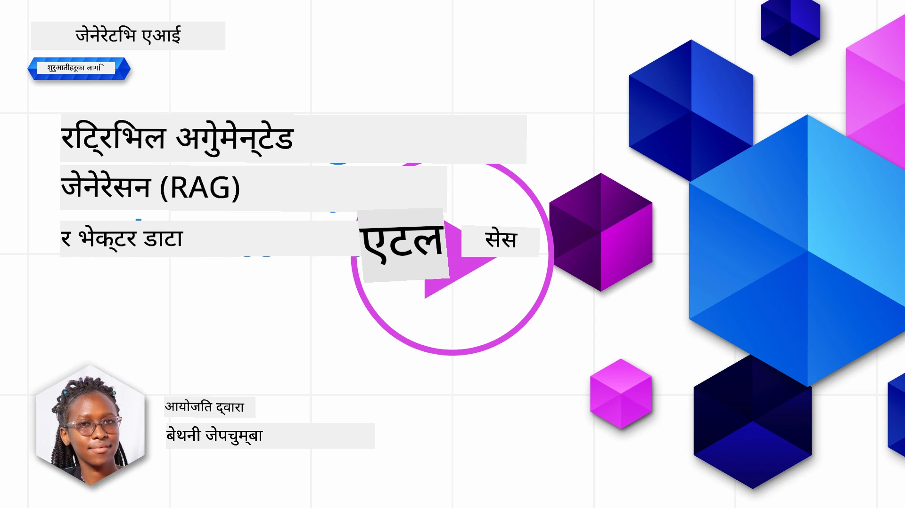
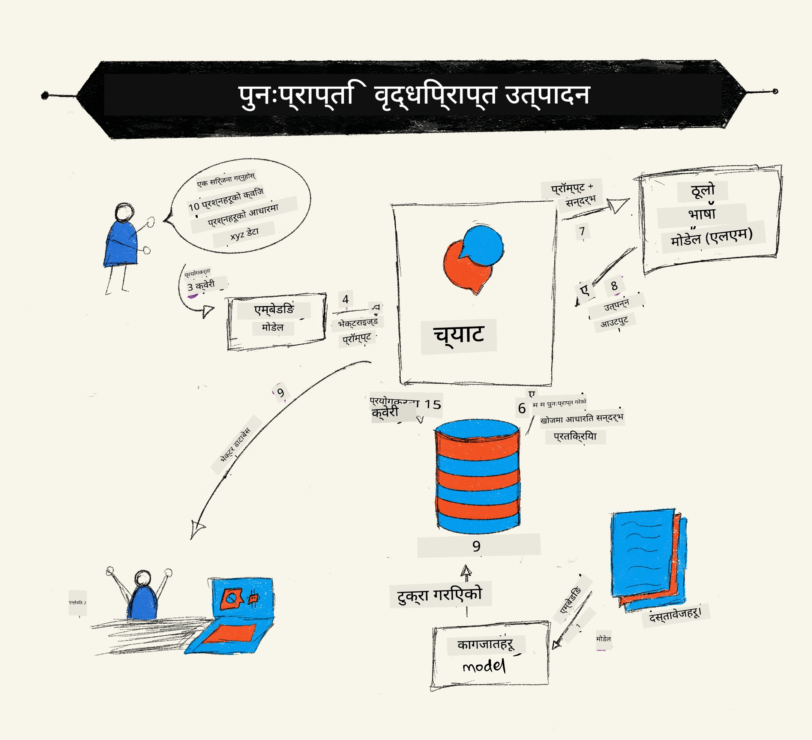
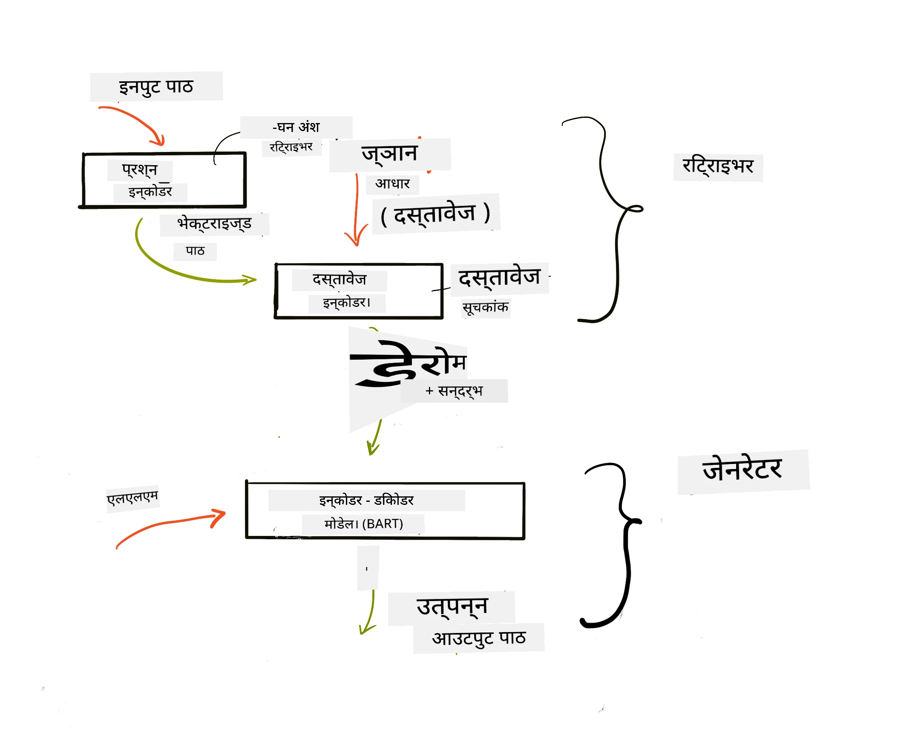
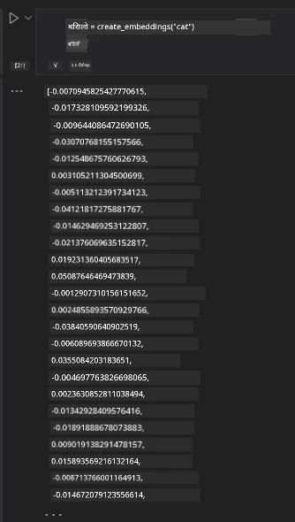

# पुनःप्राप्ति वृद्धि उत्पादन (RAG) र भेक्टर डेटाबेसहरू

[](https://youtu.be/4l8zhHUBeyI?si=BmvDmL1fnHtgQYkL)

खोज अनुप्रयोगहरू पाठमा, हामीले संक्षेपमा सिक्यौं कि आफ्नै डाटालाई कसरी ठूलो भाषा मोडल (LLM) मा समाहित गर्ने। यस पाठमा, हामीले आफ्ना डाटा LLM अनुप्रयोगमा कसरी आधारभूत गर्ने, प्रक्रियाको यांत्रिकी र डाटा भण्डारणका तरिकाहरू, जसमा एम्बेडिङ्स र पाठ सामेल छन्, अझ गहिराइमा छलफल गर्नेछौं।

> **भिडियो चाँडै आउनेछ**

## परिचय

यस पाठमा हामीले निम्न विषयहरू समेट्नेछौं:

- RAG को परिचय, यसको के हो र किन AI (कृत्रिम बुद्धिमत्ता) मा प्रयोग गरिन्छ।

- भेक्टर डेटाबेस के हुन् र हाम्रो अनुप्रयोगका लागि कसरी एउटा बनाउने बुझ्ने।

- RAG कसरी अनुप्रयोगमा समावेश गर्ने व्यवहारिक उदाहरण।

## सिकाइ लक्ष्यहरू

यो पाठ पूरा गरेपछि, तपाईं सक्षम हुनुहुनेछ:

- डाटा पुनःप्राप्ति र प्रशोधनमा RAG को महत्त्व व्याख्या गर्ने।

- RAG अनुप्रयोग सेटअप गर्ने र आफ्नो डाटालाई LLM मा आधारभूत गर्ने

- LLM अनुप्रयोगहरूमा RAG र भेक्टर डेटाबेसहरूलाई प्रभावकारी ढंगले सम्लग्न गर्ने।

## हाम्रो परिदृश्य: हाम्रो आफ्नै डाटासँग LLM हरूलाई वृद्धि गर्ने

यस पाठको लागि, हामी शिक्षा स्टार्टअपमा आफ्नै नोटहरू थप्न चाहन्छौं, जसले च्याटबटलाई विभिन्न विषयहरूमा थप जानकारी दिन्छ। हामीसँग भएका नोटहरू प्रयोग गरेर, विद्यार्थीहरू राम्रो अध्ययन गर्न र विभिन्न विषयहरू बुझ्न सक्षम हुनेछन्, जसले उनीहरूको परिक्षाको तयारीलाई सजिलो बनाउँछ। हाम्रो परिदृश्य सिर्जना गर्न हामी यसलाई प्रयोग गर्नेछौं:

- `Azure OpenAI:` हाम्रो च्याटबट बनाउन प्रयोग गर्ने LLM

- `सुरुआतीहरूको लागि AI` पाठमा नूरल नेटवर्क्स: यसमा हामीले आफ्ना LLM मा आधारभूत गर्ने डाटा

- `Azure AI Search` र `Azure Cosmos DB:` भेक्टर डेटाबेस हाम्रो डाटा भण्डारण गर्न र खोज अनुक्रमणिका बनाउन

प्रयोगकर्ताहरूले आफ्ना नोटहरूबाट अभ्यास क्विजहरू बनाउन, पुनरावृत्ति फ्ल्यास कार्डहरू बनाउन र यसलाई संक्षिप्त सारांशमा परिणत गर्न सक्षम हुनेछन्। सुरु गर्नको लागि, हेरौँ RAG के हो र कसरी काम गर्छ:

## पुनःप्राप्ति वृद्धि उत्पादन (RAG)

LLM प्रेरित च्याटबट प्रयोगकर्ताका प्रश्नहरू प्रशोधन गरेर प्रतिक्रिया उत्पादन गर्दछ। यो अन्तरक्रियात्मक हुन डिजाइन गरिएको छ र प्रयोगकर्ताहरूसँग विभिन्न विषयहरूमा संवाद गर्छ। यद्यपि, यसको प्रतिक्रियाहरू प्रदान गरिएको सन्दर्भ र यसको आधारभूत प्रशिक्षण डाटामानै सीमित छन्। उदाहरणका लागि, GPT-4 को ज्ञान कटऑफ सेप्टेम्बर 2021 हो, जसको अर्थ यसले यसपछि भएका घटनाहरूको ज्ञान राख्दैन। साथै, LLM लाई प्रशिक्षण दिन प्रयोग गरिएको डाटामा व्यक्तिगत नोट वा कम्पनीको उत्पादन म्यानुअल जस्ता गोप्य जानकारी समावेश हुँदैन।

### RAGs (पुनःप्राप्ति वृद्धि उत्पादन) कसरी काम गर्छन्



तपाईंले आफ्ना नोटहरूबाट क्विजहरू बनाउने च्याटबट तैनाथ गर्न चाहनुभयो भने, तपाईंलाई ज्ञान आधारमा जडान आवश्यक हुनेछ। यहींबाट RAG मद्दतमा आउँछ। RAGs यस प्रकार काम गर्छन्:

- **ज्ञान आधार:** पुनःप्राप्ति भन्दा पहिले, यी कागजातहरूलाई ग्रहण गरी पूर्वप्रक्रिया गर्न आवश्यक छ, सामान्यतया ठूलो कागजातलाई स-साना भागहरूमा विभाजन गरी टेक्स्ट एम्बेडिङमा परिणत गरेर डेटाबेसमा भण्डारण गरिन्छ।

- **प्रयोगकर्ता सोध:** प्रयोगकर्ताले प्रश्न सोध्छ

- **पुनःप्राप्ति:** जब प्रयोगकर्ताले प्रश्न सोध्छ, एम्बेडिङ मोडेलले हाम्रो ज्ञान आधारबाट सान्दर्भिक जानकारी प्राप्त गरेर थप सन्दर्भ दिन्छ जुन प्रॉम्प्टमा समावेश गरिन्छ।

- **वृद्धि उत्पादन:** LLM ले प्राप्त गरिएको डाटाको आधारमा आफ्नो प्रतिक्रिया सुधार गर्छ। यसले प्रतिक्रिया केवल पूर्व-प्रशिक्षित डाटामा आधारित नभई थप सान्दर्भिक जानकारीमा आधारित बनाउन अनुमति दिन्छ। प्राप्त डाटा LLM का प्रतिक्रियाहरू वृद्धिका लागि प्रयोग गरिन्छ। त्यसपछि LLM प्रयोगकर्ताको प्रश्नको उत्तर फर्काउँछ।



RAG को वास्तुकला ट्रान्सफर्मर प्रयोग गरेर कार्यान्वयन गरिएको छ, जसमा दुई भाग छन्: एक एन्कोडर र एक डिकोडर। उदाहरणका लागि, प्रयोगकर्ताले प्रश्न सोध्दा, इनपुट पाठलाई 'एन्कोड' गरी शब्दहरूको अर्थ समात्ने भेक्टरहरूमा परिणत गरिन्छ र ती भेक्टरहरूलाई 'डिकोड' गरी हाम्रो कागजात अनुक्रमणिका भित्र पठाइन्छ र प्रयोगकर्ताको प्रश्नमा आधारित नयाँ पाठ उत्पन्न गरिन्छ। LLM ले उत्पादन गर्न एन्कोडर-डिकोडर मोडल दुबै प्रयोग गर्छ।

प्रस्तावित कागजात अनुसार RAG कार्यान्वयन गर्दा दुई तरिका छन्: [Retrieval-Augmented Generation for Knowledge intensive NLP (natural language processing software) Tasks](https://arxiv.org/pdf/2005.11401.pdf?WT.mc_id=academic-105485-koreyst):

- **_RAG-Sequence_** प्राप्त गरिएको कागजातहरू प्रयोग गरेर प्रयोगकर्ताको प्रश्नको सर्वश्रेष्ठ सम्भावित उत्तर भविष्यवाणी गर्ने

- **RAG-Token** कागजातहरू प्रयोग गरेर अर्को टोकन उत्पन्न गर्ने, त्यसपछि प्रयोगकर्ताको प्रश्नको उत्तर खोज्न पुनः प्राप्त गर्ने

### किन RAGs प्रयोग गर्ने?

- **सूचनात्मक समृद्धि:** पाठ प्रतिक्रियाहरू अद्यावधिक र वर्तमान रहन्छन्। यसले डोमेन विशेष कार्यहरूमा प्रदर्शन सुधार गर्दछ किनकि आन्तरिक ज्ञान आधार पहुँच गर्दछ।

- **प्रमाणित डाटा** प्रयोग गरेर प्रयोगकर्ता प्रश्नहरूको सन्दर्भ प्रदान गर्ने भएर गलत जानकारी तयार पार्ने घटाउँछ।

- LLM लाई फाइन-ट्यून गर्नुको तुलनामा यो **लागत प्रभावकारी** हुन्छ।

## ज्ञान आधार सिर्जना गर्नु

हाम्रो अनुप्रयोग हाम्रो व्यक्तिगत डाटा आधारित छ, अर्थात्, AI For Beginners को नूरल नेटवर्क पाठ।

### भेक्टर डेटाबेसहरू

भेक्टर डेटाबेस पारम्परिक डेटाबेसभन्दा फरक हुन्छ, यो एउटा विशेष डेटाबेस हो जुन एम्बेडिङ भेक्टरहरू भण्डारण, व्यवस्थापन र खोज गर्न डिजाइन गरिएको हो। यसले कागजातहरूको संख्यात्मक प्रतिनिधित्व भण्डारण गर्दछ। डाटालाई संख्यात्मक एम्बेडिङमा विभाजन गर्दा हाम्रो AI प्रणालीलाई यसलाई बुझ्न र प्रशोधन गर्न सजिलो हुन्छ।

हामीले आफ्ना एम्बेडिङहरू भेक्टर डेटाबेसहरूमा भण्डारण गर्छौं किनकि LLMs लाई स्वीकार गर्न सकिने टोकनहरूको संख्या सीमित हुन्छ। सम्पूर्ण एम्बेडिङलाई LLM मा पठाउन नसकिने हुँदा, हामीले तिनीहरूलाई स-साना टुक्रामा विभाजन गर्नुपर्ने हुन्छ र प्रयोगकर्ताले प्रश्न सोध्दा, सबैभन्दा मिल्दोजुल्दो एम्बेडिङहरू प्रश्नप्रति प्रॉम्प्टसहित फिर्ता गरिन्छ। टुक्रा बनाउनाले LLM मार्फत पठाइने टोकनहरूको संख्या घटाएर लागत पनि कम गर्छ।

केही लोकप्रिय भेक्टर डेटाबेसहरूमा Azure Cosmos DB, Clarifyai, Pinecone, Chromadb, ScaNN, Qdrant र DeepLake समावेश छन्। तपाईं Azure CLI प्रयोग गरेर Azure Cosmos DB मोडल निम्न आदेशले बनाउन सक्नुहुन्छ:

```bash
az login
az group create -n <resource-group-name> -l <location>
az cosmosdb create -n <cosmos-db-name> -r <resource-group-name>
az cosmosdb list-keys -n <cosmos-db-name> -g <resource-group-name>
```

### टेक्स्टबाट एम्बेडिङसम्म

हाम्रो डाटा भण्डारण गर्नुअघि, हामीले यसलाई भेक्टर एम्बेडिङमा रूपान्तरण गर्न आवश्यक छ। यदि तपाईं ठूलो कागजात वा लामो पाठहरूसँग काम गर्दै हुनुहुन्छ भने, तपाईंले तिनीहरूलाई तपाईंले अपेक्षा गर्ने प्रश्नहरूलाई आधार बनाएर टुक्रा पार्न सक्नुहुन्छ। टुक्रा बनाउन वाक्य वा अनुच्छेद स्तरमा गर्न सकिन्छ। किनभने टुक्राले वरपरका शब्दहरूबाट अर्थ निकाल्छ, तपाईंले टुक्रामा अन्य सन्दर्भ पनि थप्न सक्नुहुन्छ, उदाहरणका लागि, कागजात शीर्षक थपेर वा टुक्रा अगाडि वा पछाडि केही पाठ समावेश गरेर। तपाईं यसरी डाटा टुक्रा पार्न सक्नुहुन्छ:

```python
def split_text(text, max_length, min_length):
    words = text.split()
    chunks = []
    current_chunk = []

    for word in words:
        current_chunk.append(word)
        if len(' '.join(current_chunk)) < max_length and len(' '.join(current_chunk)) > min_length:
            chunks.append(' '.join(current_chunk))
            current_chunk = []

    # यदि अन्तिम टुक्राले न्यूनतम लम्बाई पु¥याएन भने पनि त्यसलाई थप्नुहोस्
    if current_chunk:
        chunks.append(' '.join(current_chunk))

    return chunks
```

टुक्रा बनाएपछि, हामी विभिन्न एम्बेडिङ मोडेलहरूसँग हाम्रो पाठ एम्बेड गर्न सक्छौं। केही मोडेलहरूमा word2vec, OpenAI को ada-002, Azure Computer Vision लगायत थुप्रै छन्। छनोट गर्ने मोडेल तपाईंले प्रयोग गर्ने भाषा, संकुचित सामग्रीको प्रकार (पाठ/छवि/अडियो), encode गर्न सकिने इनपुटको साइज र एम्बेडिङ आउटपुटको लम्बाइमा निर्भर गर्दछ।

OpenAI को `text-embedding-ada-002` मोडेल प्रयोग गरेर एम्बेड गरिएको टेक्स्टको उदाहरण यसप्रकार छ:


## पुनःप्राप्ति र भेक्टर खोज

प्रयोगकर्ताले प्रश्न सोध्दा, पुनःप्राप्तिले सोधिएको प्रश्नलाई क्वेरी एन्कोडर प्रयोग गरी भेक्टरमा परिणत गर्छ, त्यसपछि हाम्रो कागजात खोज अनुक्रमणिका भित्र सम्बन्धित भेक्टरहरू खोज्छ जुन इनपुटसँग सम्बन्धित हुन्छन्। समाप्त भएपछि, यो इनपुट भेक्टर र कागजात भेक्टर दुवैलाई टेक्स्टमा परिणत गरी LLM लाई पठाउँछ।

### पुनःप्राप्ति

पुनःप्राप्ति तब हुन्छ जब सिस्टमले छिटो खोज गर्न प्रयास गर्छ अनुक्रमणिका भित्र ती कागजातहरू जसले खोज मापदण्ड पूरा गर्छन्। पुनःप्राप्तिको लक्ष्य यस्ता कागजातहरू प्राप्त गर्नु हो जुन सन्दर्भ दिन र LLM लाई तपाईंको डाटामा आधारित बनाउन प्रयोग गरिन्छ।

हाम्रो डेटाबेस भित्र खोज गर्ने केही तरिकाहरू छन् जस्तै:

- **कीवर्ड खोज** - पाठ खोजहरूका लागि प्रयोग गरिन्छ

- **भेक्टर खोज** - एम्बेडिङ मोडेलहरू प्रयोग गरेर कागजातलाई पाठबाट भेक्टर प्रतिनिधित्वमा रूपान्तरण गर्छ, जसले अर्थ अनुसारको खोज (**semantic search**) अनुमति दिन्छ। पुनःप्राप्ति त्यस्ता कागजातहरू सोध्दा गरिन्छ जसका भेक्टर प्रतिनिधित्व प्रयोगकर्ताको प्रश्नसँग सबैभन्दा नजिक हुन्छन्।

- **हाइब्रिड** - कीवर्ड र भेक्टर खोजको संयोजन।

पुनःप्राप्तिमा चुनौती तब आउँछ जब डेटाबेसमा सोधिएको प्रश्नसँग मिल्दोजुल्दो कुनै प्रतिक्रिया हुँदैन, त्यस अवस्थाम प्रणालीले सबैभन्दा राम्रो जानकारी फर्काउँछ, यद्यपि तपाईंले सान्दर्भिकताको अधिकतम दूरी सेट गर्ने वा कीवर्ड र भेक्टर खोज दुवै समावेश गर्ने हाइब्रिड खोज प्रयोग गर्न सक्नुहुन्छ। यस पाठमा हामी हाइब्रिड खोज प्रयोग गर्नेछौँ, जसले भेक्टर र कीवर्ड दुवै खोजलाई संयोजन गर्छ। हामी हाम्रो डाटालाई एउटा डाटाफ्रेममा टुक्राहरू र एम्बेडिङ्स सहित संग्रह गर्नेछौं।

### भेक्टर समानता

पुनःप्राप्तिले ज्ञान डेटाबेसभित्र नजिक रहेका एम्बेडिङहरू खोज्छ, सबैभन्दा नजिकको छिमेकी, किनभने ती समान टेक्स्ट हुन्। परिदृश्यमा, प्रयोगकर्ताले सोधेको प्रश्न पहिला एम्बेड हुन्छ र त्यसपछि मिल्दोजुल्दा एम्बेडिङहरूसँग मेल खाइन्छ। फरक-फरक भेक्टरहरू कति समान छन् भनेर मापन गर्न सामान्यतया प्रयोग हुने उपाय हो कोसाइन समानता, जुन दुई भेक्टरहरूको बीचको कोणमा आधारित हुन्छ।

हामी मिल्दोजुल्दो मापनका लागि अर्को विकल्पहरू जस्तै यूक्लिडियन दूरी (भेक्टरको पनि बिन्दुहरूबीचको सिधा रेखा) र डट उत्पादन (दुई भेक्टरका सान्दर्भिक तत्त्वहरूको उत्पादनहरूको योग) प्रयोग गर्न सक्छौं।

### खोज अनुक्रमणिका

पुनःप्राप्ति गर्दा, हामीले हाम्रो ज्ञान आधारको लागि खोज अनुक्रमणिका निर्माण गर्नुपर्छ। अनुक्रमणिकाले हाम्रा एम्बेडिङहरू स्टोर गर्छ र ठूलो डेटाबेस भित्र पनि सबैभन्दा समान टुक्रा छिटो फिर्ता गर्न सक्छ। हामी स्थानीय रूपमा हाम्रो अनुक्रमणिका निम्न प्रयोग गरेर बनाउन सक्छौँ:

```python
from sklearn.neighbors import NearestNeighbors

embeddings = flattened_df['embeddings'].to_list()

# खोज अनुक्रमणिका सिर्जना गर्नुहोस्
nbrs = NearestNeighbors(n_neighbors=5, algorithm='ball_tree').fit(embeddings)

# अनुक्रमणिका सोध्नका लागि, तपाईं kneighbors विधि प्रयोग गर्न सक्नुहुन्छ
distances, indices = nbrs.kneighbors(embeddings)
```

### पुनः क्रमबद्ध गर्ने

एकपटक तपाईंले डेटाबेस क्वेरी गरेपछि, परिणामहरू सबैभन्दा सान्दर्भिकदेखि क्रमबद्ध गर्नुपर्ने हुन सक्छ। पुनः क्रमबद्ध गर्ने LLM ले मेशिन लर्निङ प्रयोग गरी खोज परिणामहरूको सान्दर्भितालाई सुधार गर्छ। Azure AI Search मा, पुनः क्रमबद्ध गर्नु स्वचालित रूपमा सेमेन्टिक रिर्याङ्कर मार्फत गरिन्छ। नजिकका छिमेकीहरू प्रयोग गरी पुनः क्रमबद्ध गर्ने उदाहरण यसप्रकार छ:

```python
# सबैभन्दा मिल्दो कागजातहरू फेला पार्नुहोस्
distances, indices = nbrs.kneighbors([query_vector])

index = []
# सबैभन्दा मिल्दो कागजातहरू मुद्रण गर्नुहोस्
for i in range(3):
    index = indices[0][i]
    for index in indices[0]:
        print(flattened_df['chunks'].iloc[index])
        print(flattened_df['path'].iloc[index])
        print(flattened_df['distances'].iloc[index])
    else:
        print(f"Index {index} not found in DataFrame")
```

## सबै कुरालाई एउटैमा ल्याउँदै

अन्तिम चरण हो हाम्रो LLM लाई मिसाएर हामीले आधारभूत डाटामा आधारित प्रतिक्रियाहरू प्राप्त गर्न सक्ने। यसलाई हामी यसरी कार्यान्वयन गर्न सक्छौं:

```python
user_input = "what is a perceptron?"

def chatbot(user_input):
    # प्रश्नलाई क्वेरी भेक्टरमा रूपान्तरण गर्नुहोस्
    query_vector = create_embeddings(user_input)

    # सबैभन्दा समान कागजातहरू फेला पार्नुहोस्
    distances, indices = nbrs.kneighbors([query_vector])

    # सन्दर्भ प्रदान गर्न कागजातहरूलाई क्वेरीमा थप्नुहोस्
    history = []
    for index in indices[0]:
        history.append(flattened_df['chunks'].iloc[index])

    # इतिहास र प्रयोगकर्ता इनपुटलाई संयोजन गर्नुहोस्
    history.append(user_input)

    # सन्देश वस्तु सिर्जना गर्नुहोस्
    messages=[
        {"role": "system", "content": "You are an AI assistant that helps with AI questions."},
        {"role": "user", "content": "\n\n".join(history) }
    ]

    # प्रतिक्रिया उत्पादन गर्न Responses API प्रयोग गर्नुहोस्
    response = client.responses.create(
        model="gpt-4o-mini",
        temperature=0.7,
        max_output_tokens=800,
        input=messages,
        store=False,
    )

    return response.output_text

chatbot(user_input)
```

## हाम्रो अनुप्रयोग मूल्याङ्कन

### मूल्याङ्कन मेट्रिक्स

- प्रदान गरिएको प्रतिक्रियाहरूको गुणस्तर जाँच्ने, जसले प्राकृतिक, प्रवाहपूर्ण र मानवीय सुनिन्छ

- डाटाको आधारित हुनु: प्रतिक्रियाले प्रदान गरिएको कागजातहरूबाट आएको हो कि छैन मूल्याङ्कन गर्ने

- सान्दर्भिकता: प्रतिक्रिया सोधिएको प्रश्नसँग मेल खान्छ र सम्बन्धित छ कि छैन मूल्याङ्कन गर्ने

- प्रवाह्यता - प्रतिक्रिया व्याकरणिक रूपमा अर्थपूर्ण छ कि छैन

## RAG (पुनःप्राप्ति वृद्धि उत्पादन) र भेक्टर डेटाबेस प्रयोग गर्ने प्रयोगहरू

धेरै विभिन्न प्रयोगहरू छन् जहाँ फंक्शन कलले तपाईंको अनुप्रयोगमा सुधार गर्न सक्छ जस्तै:

- प्रश्न र उत्तर: तपाईंको कम्पनी डाटालाई आधार बनाएर च्याट गर्ने जसलाई कर्मचारीहरूले प्रश्न सोध्न प्रयोग गर्न सक्छन्।

- सिफारिस प्रणालीहरू: जहाँ तपाईं यस्तो प्रणाली बनाउन सक्नुहुन्छ जसले सबैभन्दा मिल्दोजुल्दो मानहरू मेल खान्छ जस्तै चलचित्रहरू, रेस्टुरेन्ट र धेरै अन्य।

- च्याटबट सेवा: तपाईं च्याट इतिहास भण्डारण गर्न सक्नुहुन्छ र प्रयोगकर्ता डाटामा आधारित कुराकानी अनुकूलित गर्न सक्नुहुन्छ।

- भेक्टर एम्बेडिङमा आधारित छवि खोज, छवि पहिचान र विषमतालाई पत्ता लगाउन प्रयोगी।

## सारांश

हामीले RAG का आधारभूत क्षेत्रहरू समेट्यौं, अनुप्रयोगमा हाम्रो डाटा थप्न, प्रयोगकर्ता सोध र आउटपुटमा। RAG को सिर्जना सजिलो बनाउन तपाईंले Semanti Kernel, Langchain वा Autogen जस्ता फ्रेमवर्कहरू प्रयोग गर्न सक्नुहुन्छ।

## गृहकार्य

पुनःप्राप्ति वृद्धि उत्पादन (RAG) को तपाईको सिकाइ जारी राख्न तपाईंले बनाउन सक्नुहुन्छ:

- तपाईंले रोजेको फ्रेमवर्क प्रयोग गरेर अनुप्रयोगको फ्रन्ट-एन्ड निर्माण गर्नुहोस्

- LangChain वा Semantic Kernel मध्ये एउटा फ्रेमवर्क प्रयोग गरेर आफ्नो अनुप्रयोग पुनःसिर्जना गर्नुहोस्।

तपाईंलाई पाठ पूरा गरेकोमा बधाई 👏।

## सिकाइ यहाँ समाप्त हुँदैन, यात्रालाई जारी राख्नुहोस्

यो पाठ पूरा गरेपछि, हाम्रो [जनरेटिभ AI सिकाइ संग्रह](https://aka.ms/genai-collection?WT.mc_id=academic-105485-koreyst) हेर्नुहोस् र आफ्नो जनरेटिभ AI ज्ञानलाई अझ स्तरवृद्धि गर्नुहोस्!

---

<!-- CO-OP TRANSLATOR DISCLAIMER START -->
**अस्वीकरण**:
यो दस्तावेज़ AI अनुवाद सेवा [Co-op Translator](https://github.com/Azure/co-op-translator) प्रयोग गरेर अनुवाद गरिएको हो। हामी सही हुन प्रयास गर्छौं, तर कृपया जानकार हुनुस् कि स्वचालित अनुवादमा त्रुटिहरू वा अशुद्धताहरू हुन सक्छन्। मूल दस्तावेज़ यसको मूल भाषामा आधिकारिक स्रोत मानिनुपर्छ। महत्वपूर्ण जानकारीका लागि व्यावसायिक मानव अनुवाद सिफारिस गरिन्छ। यस अनुवादको प्रयोगबाट उत्पन्न कुनै पनि गलत बुझाइ वा त्रुटिको लागि हामी जिम्मेवार छैनौं।
<!-- CO-OP TRANSLATOR DISCLAIMER END -->