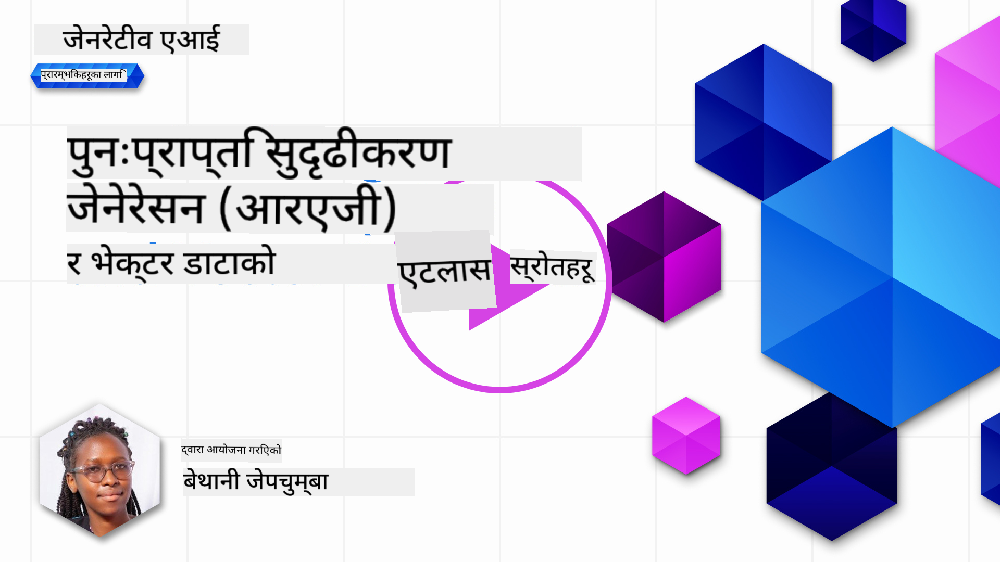
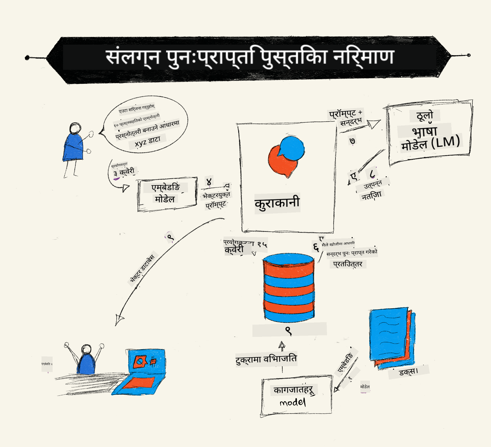
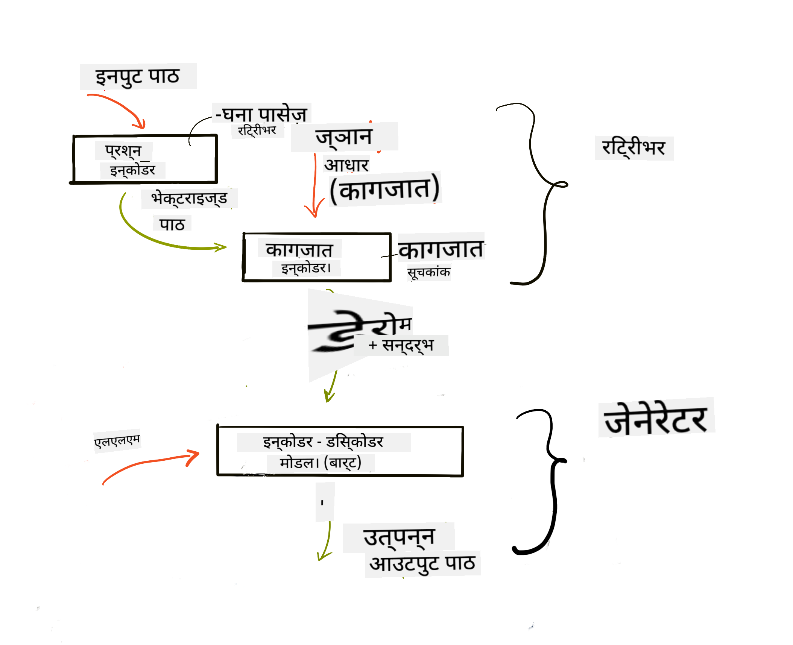
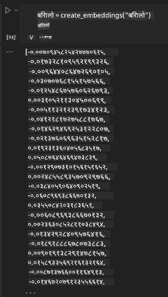

<!--
CO_OP_TRANSLATOR_METADATA:
{
  "original_hash": "e2861bbca91c0567ef32bc77fe054f9e",
  "translation_date": "2025-06-25T22:26:13+00:00",
  "source_file": "15-rag-and-vector-databases/README.md",
  "language_code": "ne"
}
-->
# पुनःप्राप्ति सुदृढीकरण पीढी (RAG) र भेक्टर डाटाबेस

[](https://aka.ms/gen-ai-lesson15-gh?WT.mc_id=academic-105485-koreyst)

खोज अनुप्रयोग पाठमा, हामीले संक्षेपमा सिक्यौं कि कसरी आफ्ना डेटा ठूला भाषा मोडेलहरू (LLMs) मा समाहित गर्ने। यस पाठमा, हामी तपाईंको LLM अनुप्रयोगमा डेटा आधारभूत बनाउने अवधारणाहरू, प्रक्रियाको यान्त्रिकी र डेटा भण्डारण गर्ने विधिहरूमा थप चर्चा गर्नेछौं, जसमा इम्बेडिङ र पाठ दुवै समावेश छन्।

> **भिडियो चाँडै आउँदैछ**

## परिचय

यस पाठमा हामी निम्न विषयहरू समेट्नेछौं:

- RAG को परिचय, यो के हो र किन AI (कृत्रिम बुद्धिमत्ता) मा प्रयोग गरिन्छ।

- भेक्टर डाटाबेस के हो बुझ्ने र हाम्रो अनुप्रयोगको लागि एउटा बनाउने।

- अनुप्रयोगमा RAG समाहित गर्ने व्यावहारिक उदाहरण।

## सिक्ने लक्ष्यहरू

यस पाठ पूरा गरेपछि, तपाईं सक्षम हुनुहुनेछ:

- डेटा पुनःप्राप्ति र प्रशोधनमा RAG को महत्व व्याख्या गर्नुहोस्।

- RAG अनुप्रयोग सेटअप गर्नुहोस् र तपाईंको डेटा LLM मा आधारभूत बनाउनुहोस्।

- LLM अनुप्रयोगहरूमा RAG र भेक्टर डाटाबेसको प्रभावकारी समाहिती।

## हाम्रो परिदृश्य: हाम्रो LLMs लाई हाम्रो आफ्नै डेटा संग सुदृढ बनाउनु

यस पाठको लागि, हामी शिक्षा स्टार्टअपमा हाम्रो आफ्नै नोटहरू थप्न चाहन्छौं, जसले च्याटबटलाई विभिन्न विषयहरूमा थप जानकारी प्राप्त गर्न अनुमति दिन्छ। हाम्रो नोटहरूको प्रयोग गरेर, सिक्नेहरूले राम्रोसँग अध्ययन गर्न र विभिन्न विषयहरू बुझ्न सक्षम हुनेछन्, जसले उनीहरूको परीक्षाको तयारी गर्न सजिलो बनाउँछ। हाम्रो परिदृश्य बनाउनका लागि, हामी प्रयोग गर्नेछौं:

- `Azure OpenAI:` हामी हाम्रो च्याटबट बनाउन प्रयोग गर्ने LLM

- `AI for beginners' lesson on Neural Networks`: यो हाम्रो LLM लाई आधारभूत बनाउने डेटा हुनेछ

- `Azure AI Search` र `Azure Cosmos DB:` भेक्टर डाटाबेस हाम्रो डेटा भण्डारण गर्न र खोज सूचकांक बनाउन

प्रयोगकर्ताहरूले आफ्नो नोटहरूबाट अभ्यास क्विजहरू बनाउन, पुनरावृत्ति फ्ल्यास कार्डहरू र संक्षिप्त सारांशहरू बनाउन सक्षम हुनेछन्। सुरु गर्न, RAG के हो र कसरी काम गर्छ हेर्नुहोस्:

## पुनःप्राप्ति सुदृढीकरण पीढी (RAG)

एक LLM शक्ति च्याटबट प्रयोगकर्ता संकेतहरू प्रशोधन गर्न र प्रतिक्रिया उत्पन्न गर्न डिजाइन गरिएको छ। यसले प्रयोगकर्ताहरूलाई विभिन्न विषयहरूमा अन्तरक्रियात्मक रूपमा संलग्न गर्दछ। तर, यसको प्रतिक्रियाहरू प्रदान गरिएको सन्दर्भ र यसको आधारभूत प्रशिक्षण डेटा सीमित हुन्छ। उदाहरणका लागि, GPT-4 को ज्ञान कटअफ सेप्टेम्बर 2021 हो, जसको अर्थ यो अवधिपछि भएका घटनाहरूको ज्ञान छैन। साथै, LLMs लाई प्रशिक्षण दिन प्रयोग गरिएको डेटा गोपनीय जानकारी जस्तै व्यक्तिगत नोटहरू वा कम्पनीको उत्पादन म्यानुअललाई बाहिर राख्छ।

### RAGs (पुनःप्राप्ति सुदृढीकरण पीढी) कसरी काम गर्छ



मानौं तपाईंले च्याटबट परिनियोजन गर्न चाहनुहुन्छ जसले तपाईंको नोटहरूबाट क्विजहरू सिर्जना गर्छ, तपाईंलाई ज्ञान आधारमा जडान आवश्यक हुनेछ। यहीँ RAG मद्दतको लागि आउँछ। RAGs निम्न प्रकारले काम गर्छ:

- **ज्ञान आधार:** पुनःप्राप्ति अघि, यी कागजातहरूलाई निगल्न र पूर्वप्रक्रिया गर्न आवश्यक हुन्छ, सामान्यतया ठूला कागजातहरूलाई साना टुक्राहरूमा विभाजन गर्ने, तिनीहरूलाई पाठ इम्बेडिङमा रूपान्तरण गर्ने र तिनीहरूलाई डाटाबेसमा भण्डारण गर्ने।

- **प्रयोगकर्ता प्रश्न:** प्रयोगकर्ताले प्रश्न सोध्छ

- **पुनःप्राप्ति:** जब प्रयोगकर्ताले प्रश्न सोध्छ, इम्बेडिङ मोडेलले हाम्रो ज्ञान आधारबाट सान्दर्भिक जानकारी पुनःप्राप्ति गर्दछ जसले संकेतमा समाहित हुने थप सन्दर्भ प्रदान गर्छ।

- **सुदृढीकरण पीढी:** LLM ले पुनःप्राप्ति गरिएको डेटा आधारमा आफ्नो प्रतिक्रिया सुदृढ बनाउँछ। यसले उत्पन्न गरिएको प्रतिक्रियालाई केवल पूर्व-प्रशिक्षित डेटा मात्र नभई थप सन्दर्भबाट सान्दर्भिक जानकारीमा आधारित बनाउँछ। पुनःप्राप्ति गरिएको डेटा LLM को प्रतिक्रियाहरूलाई सुदृढ गर्न प्रयोग गरिन्छ। त्यसपछि LLM ले प्रयोगकर्ताको प्रश्नको उत्तर फर्काउँछ।



RAGs को वास्तुकला ट्रान्सफर्मरहरू प्रयोग गरेर कार्यान्वयन गरिन्छ जसमा दुई भागहरू हुन्छन्: एक एनकोडर र एक डिकोडर। उदाहरणका लागि, जब प्रयोगकर्ताले प्रश्न सोध्छ, इनपुट पाठ 'एनकोड गरिएको' शब्दहरूको अर्थ समात्ने भेक्टरहरूमा रूपान्तरण गरिन्छ र भेक्टरहरू 'डिकोड गरिएको' हाम्रो कागजात सूचकांकमा र प्रयोगकर्ता प्रश्नको आधारमा नयाँ पाठ उत्पन्न गर्दछ। LLM ले आउटपुट उत्पन्न गर्न एनकोडर-डिकोडर मोडेल दुवै प्रयोग गर्दछ।

प्रस्तावित कागजात अनुसार RAG कार्यान्वयन गर्दा दुई दृष्टिकोणहरू: [ज्ञान-गहन NLP (प्राकृतिक भाषा प्रशोधन सफ्टवेयर) कार्यहरूको लागि पुनःप्राप्ति-सुदृढीकरण पीढी](https://arxiv.org/pdf/2005.11401.pdf?WT.mc_id=academic-105485-koreyst) हुन्:

- **_RAG-Sequence_** प्रयोगकर्ता प्रश्नको लागि उत्तम सम्भावित उत्तरको भविष्यवाणी गर्न पुनःप्राप्ति गरिएका कागजातहरू प्रयोग गर्दै

- **RAG-Token** कागजातहरू प्रयोग गरेर अर्को टोकन उत्पन्न गर्ने, त्यसपछि प्रयोगकर्ता प्रश्नको उत्तर दिन तिनीहरूलाई पुनःप्राप्ति गर्ने

### किन तपाईं RAGs प्रयोग गर्नुहुन्छ?

- **सूचना समृद्धि:** पाठ प्रतिक्रियाहरू अद्यावधिक र वर्तमान सुनिश्चित गर्दछ। यसले आन्तरिक ज्ञान आधारमा पहुँच गरेर डोमेन विशिष्ट कार्यहरूमा प्रदर्शन सुदृढ बनाउँछ।

- ज्ञान आधारमा **प्रमाणित डेटा** प्रयोग गरेर प्रयोगकर्ता प्रश्नहरूलाई सन्दर्भ प्रदान गरेर निर्माण कम गर्दछ।

- यो **लागत प्रभावकारी** छ किनभने तिनीहरू LLM लाई फाइन-ट्यूनिङको तुलनामा आर्थिक हुन्छन्।

## ज्ञान आधार सिर्जना गर्दै

हाम्रो अनुप्रयोग हाम्रो व्यक्तिगत डेटा अर्थात्, AI को लागि शुरुआती पाठ्यक्रममा न्युरल नेटवर्क पाठमा आधारित छ।

### भेक्टर डाटाबेस

एक भेक्टर डाटाबेस, परम्परागत डाटाबेसको विपरीत, इम्बेडेड भेक्टरहरू भण्डारण, व्यवस्थापन र खोज गर्न डिजाइन गरिएको विशेष डाटाबेस हो। यसले कागजातहरूको संख्यात्मक प्रतिनिधित्वहरू भण्डारण गर्छ। डेटा संख्यात्मक इम्बेडिङमा विभाजन गर्दा हाम्रो AI प्रणालीलाई डेटा बुझ्न र प्रशोधन गर्न सजिलो बनाउँछ।

हामी भेक्टर डाटाबेसहरूमा हाम्रो इम्बेडिङहरू भण्डारण गर्छौं किनभने LLMs ले इनपुटको रूपमा स्वीकार गर्ने टोकनहरूको संख्या सीमित हुन्छ। तपाईं LLM लाई सम्पूर्ण इम्बेडिङ पास गर्न सक्नुहुन्न, हामीलाई तिनीहरूलाई टुक्राहरूमा विभाजन गर्न आवश्यक छ र जब प्रयोगकर्ताले प्रश्न सोध्छ, प्रश्नसँग सबैभन्दा मिल्दोजुल्दो इम्बेडिङ संकेतसँगै फर्काइनेछ। टुक्रा बनाउँदा LLM मार्फत पास गरिएका टोकनहरूको संख्या कम हुन्छ।

केही लोकप्रिय भेक्टर डाटाबेसहरूमा Azure Cosmos DB, Clarifyai, Pinecone, Chromadb, ScaNN, Qdrant र DeepLake समावेश छन्। तपाईं निम्न आदेश प्रयोग गरेर Azure CLI प्रयोग गरेर Azure Cosmos DB मोडेल बनाउन सक्नुहुन्छ:

```bash
az login
az group create -n <resource-group-name> -l <location>
az cosmosdb create -n <cosmos-db-name> -r <resource-group-name>
az cosmosdb list-keys -n <cosmos-db-name> -g <resource-group-name>
```

### पाठबाट इम्बेडिङमा

हाम्रो डेटा भण्डारण गर्नु अघि, हामीलाई यसलाई डाटाबेसमा भण्डारण गर्नु अघि भेक्टर इम्बेडिङमा रूपान्तरण गर्न आवश्यक छ। यदि तपाईं ठूला कागजातहरू वा लामो पाठहरूसँग काम गर्दै हुनुहुन्छ भने, तपाईंले अपेक्षित प्रश्नहरूमा आधारित टुक्रा बनाउन सक्नुहुन्छ। टुक्रा बनाउँदा वाक्य स्तरमा वा अनुच्छेद स्तरमा गर्न सकिन्छ। टुक्रा बनाउँदा शब्दहरूको वरपरको अर्थ निकाल्छ, तपाईं टुक्रामा केही अन्य सन्दर्भ थप्न सक्नुहुन्छ, उदाहरणका लागि, कागजात शीर्षक थपेर वा टुक्रा अघि वा पछि केही पाठ समावेश गरेर। तपाईं डेटा यसरी टुक्रा बनाउन सक्नुहुन्छ:

```python
def split_text(text, max_length, min_length):
    words = text.split()
    chunks = []
    current_chunk = []

    for word in words:
        current_chunk.append(word)
        if len(' '.join(current_chunk)) < max_length and len(' '.join(current_chunk)) > min_length:
            chunks.append(' '.join(current_chunk))
            current_chunk = []

    # If the last chunk didn't reach the minimum length, add it anyway
    if current_chunk:
        chunks.append(' '.join(current_chunk))

    return chunks
```

एकपटक टुक्रा बनाइसकेपछि, हामी विभिन्न इम्बेडिङ मोडेलहरू प्रयोग गरेर हाम्रो पाठ इम्बेड गर्न सक्छौं। केही मोडेलहरू जुन तपाईं प्रयोग गर्न सक्नुहुन्छ: word2vec, OpenAI द्वारा ada-002, Azure Computer Vision र धेरै अन्य। प्रयोग गर्ने मोडेल चयन गर्नु भाषाहरू जुन तपाईं प्रयोग गर्दै हुनुहुन्छ, इन्कोड गरिएको सामग्रीको प्रकार (पाठ/छवि/अडियो), यो इन्कोड गर्न सक्ने इनपुटको आकार र इम्बेडिङ आउटपुटको लम्बाइमा निर्भर हुनेछ।

OpenAI को `text-embedding-ada-002` मोडेल प्रयोग गरेर इम्बेड गरिएको पाठको एक उदाहरण हो:


## पुनःप्राप्ति र भेक्टर खोज

जब प्रयोगकर्ताले प्रश्न सोध्छ, पुनःप्राप्ति गर्नेले क्वेरी एनकोडर प्रयोग गरेर यसलाई भेक्टरमा रूपान्तरण गर्छ, त्यसपछि यसले इनपुटसँग सम्बन्धित कागजातमा सान्दर्भिक भेक्टरहरूको लागि हाम्रो कागजात खोज सूचकांक मार्फत खोज्छ। एकपटक गरिसकेपछि, यसले इनपुट भेक्टर र कागजात भेक्टर दुवैलाई पाठमा रूपान्तरण गर्छ र यसलाई LLM मार्फत पास गर्छ।

### पुनःप्राप्ति

पुनःप्राप्ति तब हुन्छ जब प्रणालीले खोज मापदण्डलाई सन्तुष्ट पार्ने कागजातहरूलाई छिटो फेला पार्न प्रयास गर्छ। पुनःप्राप्ति गर्नेको लक्ष्य कागजातहरू प्राप्त गर्नु हो जसले सन्दर्भ प्रदान गर्नेछ र तपाईंको डेटा मा LLM लाई आधारभूत बनाउनेछ।

हाम्रो डाटाबेस भित्र खोज गर्न विभिन्न तरिकाहरू छन् जस्तै:

- **किवर्ड खोज** - पाठ खोजहरूको लागि प्रयोग गरिन्छ

- **अर्थ खोज** - शब्दहरूको अर्थ प्रयोग गर्दछ

- **भेक्टर खोज** - इम्बेडिङ मोडेलहरू प्रयोग गरेर कागजातहरूलाई पाठबाट भेक्टर प्रतिनिधित्वमा रूपान्तरण गर्दछ। पुनःप्राप्ति प्रयोगकर्ता प्रश्नको नजिकको भेक्टर प्रतिनिधित्व भएका कागजातहरूलाई क्वेरी गरेर गरिनेछ।

- **हाइब्रिड** - किवर्ड र भेक्टर खोज दुवैको संयोजन।

पुनःप्राप्तिमा चुनौती तब आउँछ जब डेटाबेसमा क्वेरीको लागि कुनै समान प्रतिक्रिया छैन, प्रणालीले त्यसपछि उनीहरूले प्राप्त गर्न सक्ने सबैभन्दा राम्रो जानकारी फर्काउनेछ, यद्यपि, तपाईंले सान्दर्भिकताको लागि अधिकतम दूरी सेटअप गर्ने जस्ता रणनीतिहरू प्रयोग गर्न सक्नुहुन्छ वा किवर्ड र भेक्टर खोज दुवैको संयोजन गर्ने हाइब्रिड खोज प्रयोग गर्न सक्नुहुन्छ। यस पाठमा हामी हाइब्रिड खोज प्रयोग गर्नेछौं, भेक्टर र किवर्ड खोज दुवैको संयोजन। हामी हाम्रो डेटा टुक्राहरू साथै इम्बेडिङहरू समावेश गर्ने स्तम्भहरू भएको डाटा फ्रेममा भण्डारण गर्नेछौं।

### भेक्टर समानता

पुनःप्राप्ति गर्नेले ज्ञान डाटाबेस मार्फत एकसाथ नजिक भएका इम्बेडिङहरूको खोजी गर्नेछ, सबैभन्दा नजिकको छिमेकी, किनभने तिनीहरू समान पाठहरू हुन्। परिदृश्यमा प्रयोगकर्ताले क्वेरी सोध्छ, यो पहिले इम्बेड गरिएको हुन्छ र त्यसपछि समान इम्बेडिङहरूसँग मिलान गरिन्छ। सामान्य मापन जुन विभिन्न भेक्टरहरू कति समान छन् भनेर पत्ता लगाउन प्रयोग गरिन्छ त्यो कोसाइन समानता हो जुन दुई भेक्टरहरू बीचको कोणमा आधारित हुन्छ।

हामी समानता मापन गर्न अन्य विकल्पहरू प्रयोग गर्न सक्छौं जस्तै भेक्टरको अन्त्य बिन्दुहरू बीचको सीधा रेखा युक्लिडियन दूरी र दुई भेक्टरहरूको सम्बन्धित तत्वहरूको उत्पादनको योग मापन गर्ने डट उत्पाद।

### खोज सूचकांक

पुनःप्राप्ति गर्दा, हामीलाई खोज गर्नु अघि हाम्रो ज्ञान आधारको लागि खोज सूचकांक निर्माण गर्न आवश्यक हुनेछ। सूचकांकले हाम्रो इम्बेडिङहरू भण्डारण गर्नेछ र ठूलो डाटाबेसमा पनि सबैभन्दा समान टुक्राहरू छिटो पुनःप्राप्ति गर्न सक्नेछ। हामी स्थानीय रूपमा हाम्रो सूचकांक निम्न प्रयोग गरेर निर्माण गर्न सक्छौं:

```python
from sklearn.neighbors import NearestNeighbors

embeddings = flattened_df['embeddings'].to_list()

# Create the search index
nbrs = NearestNeighbors(n_neighbors=5, algorithm='ball_tree').fit(embeddings)

# To query the index, you can use the kneighbors method
distances, indices = nbrs.kneighbors(embeddings)
```

### पुनःक्रमबद्धता

एकपटक तपाईंले डाटाबेस क्वेरी गरेपछि, तपाईंले परिणामहरू सबैभन्दा सान्दर्भिकबाट क्रमबद्ध गर्न आवश्यक हुन सक्छ। पुनःक्रमबद्धता LLM ले मेशिन लर्निङलाई प्रयोग गरेर खोज परिणामहरूको सान्दर्भिकता सुधार गर्न सबैभन्दा सान्दर्भिकबाट क्रमबद्ध गर्छ। Azure AI खोज प्रयोग गर्दा, पुनःक्रमबद्धता स्वचालित रूपमा तपाईंको लागि गरिन्छ अर्थ पुनःक्रमबद्धकर्ताको प्रयोग गरेर। नजिकको छिमेकीहरूको प्रयोग गरेर पुनःक्रमबद्धता कसरी काम गर्छ भन्ने उदाहरण:

```python
# Find the most similar documents
distances, indices = nbrs.kneighbors([query_vector])

index = []
# Print the most similar documents
for i in range(3):
    index = indices[0][i]
    for index in indices[0]:
        print(flattened_df['chunks'].iloc[index])
        print(flattened_df['path'].iloc[index])
        print(flattened_df['distances'].iloc[index])
    else:
        print(f"Index {index} not found in DataFrame")
```

## यसलाई सबै सँगै ल्याउँदै

अन्तिम चरण हाम्रो LLM लाई मिश्रणमा थप्नु हो ताकि हामीलाई हाम्रो डेटा मा आधारित प्रतिक्रियाहरू प्राप्त गर्न सकिन्छ। हामी यसलाई निम्न प्रकारले कार्यान्वयन गर्न सक्छौं:

```python
user_input = "what is a perceptron?"

def chatbot(user_input):
    # Convert the question to a query vector
    query_vector = create_embeddings(user_input)

    # Find the most similar documents
    distances, indices = nbrs.kneighbors([query_vector])

    # add documents to query  to provide context
    history = []
    for index in indices[0]:
        history.append(flattened_df['chunks'].iloc[index])

    # combine the history and the user input
    history.append(user_input)

    # create a message object
    messages=[
        {"role": "system", "content": "You are an AI assistant that helps with AI questions."},
        {"role": "user", "content": history[-1]}
    ]

    # use chat completion to generate a response
    response = openai.chat.completions.create(
        model="gpt-4",
        temperature=0.7,
        max_tokens=800,
        messages=messages
    )

    return response.choices[0].message

chatbot(user_input)
```

## हाम्रो अनुप्रयोगको मूल्याङ्कन गर्दै

### मूल्याङ्कन मेट्रिक्स

- प्रतिक्रियाको गुणस्तर सुनिश्चित गर्दै कि यो प्राकृतिक, प्रवाही र मानव-जस्तो सुनिन्छ

- डेटा को आधारभूतता: प्रतिक्रिया आपूर्ति गरिएका कागजातहरूबाट आएको हो कि छैन मूल्याङ्कन गर्दै

- सान्दर्भिकता: प्रतिक्रिया मिल्छ र सोधिएको प्रश्नसँग सम्बन्धित छ कि छैन मूल्याङ्कन गर्दै

- प्रवाह - प्रतिक्रिया व्याकरणको दृष्टिले अर्थपूर्ण छ कि छैन

## RAG (पुनःप्राप्ति सुदृढीकरण पीढी) र भेक्टर डाटाबेस प्रयोग गर्ने प्रयोग केसहरू

फङ्क्सन कलहरूले तपाईंको अनुप्रयोग सुधार गर्न सक्ने धेरै विभिन्न प्रयोग केसहरू छन् जस्तै:

- प्रश्न र उत्तर: तपाईंको कम्पनी डेटा च्याटमा आधारभूत बनाउने जसलाई कर्मचारीहरूले प्रश्न सोध्न प्रयोग गर्न सक्छन्।

- सिफारिश प्रणाली: जहाँ तपाईं प्रणाली बनाउन सक्नुहुन्छ जसले सबैभन्दा मिल्दोजुल्दो मानहरू मिलाउँछ जस्तै फिल्महरू, रेस्टुरेन्टहरू र धेरै अन्य।

- च्याटबट सेवाहरू: तपाईंले च्याट इतिहास भण्डारण गर्न सक्नुहुन्छ र प्रयोगकर्ता डेटा आधारमा संवादलाई व्यक्तिगत बनाउन सक्नुहुन्छ।

- भेक्टर इम्बेडिङमा आधारित छवि खोज, छवि पहिचान र असामान्यता पत्ता लगाउँदा उपयोगी।

## सारांश

हामीले RAG को आधारभूत क्षेत्रहरू कभर गरेका छौं हाम्रो अनुप्रयोगमा डेटा थप्ने, प्रयोगकर्ता प्रश्न र आउटपुट। RAG सिर्जना गर्नलाई सरल बनाउन, तपाईं Semanti Kernel, Langchain वा Autogen जस्ता फ्रेमवर्कहरू प्रयोग गर्न सक्नुहुन्छ।

## असाइनमेन्ट

पुनःप्राप्ति सुदृढीकरण पीढी (RAG) को आफ्नो सिकाइ जारी राख्न तपाईं निम्न निर्माण गर्न सक्नुहुन्छ:

- तपाईंको रोजाइको फ्रेमवर्क प्रयोग गरेर अनुप्रयोगको फ्रन्ट-एन्ड निर्माण गर्नुहोस्।

- फ्रेमवर्क प्रयोग गर्नुहोस्, LangChain वा Semantic Kernel, र तपाईंको अनुप्रयोग पुनः निर्माण गर्नुहोस्।

पाठ पूरा गर्नुभएकोमा बधाई छ 👏।

## सिकाइ यहाँ रोकिँदैन, यात्रा जारी राख्नुहोस्

यस पाठ पूरा गरेपछि, हाम्रो [उत्पादक AI सिकाइ संग्रह](https://aka.ms/genai-collection?WT.mc_id=academic-105485-koreyst) हेर्नुहोस् ताकि तपाईंको उत्पादक AI ज्ञान स्तरवृद्धि गर्न जारी राख्न सक्नुहोस्!

**अस्वीकरण**:  
यो दस्तावेज AI अनुवाद सेवा [Co-op Translator](https://github.com/Azure/co-op-translator) प्रयोग गरी अनुवाद गरिएको छ। हामी शुद्धताका लागि प्रयासरत भए तापनि, कृपया जानकार रहनुहोस् कि स्वचालित अनुवादहरूमा त्रुटिहरू वा अशुद्धताहरू हुन सक्छन्। यसको मौलिक भाषामा रहेको मूल दस्तावेजलाई आधिकारिक स्रोत मानिनु पर्छ। महत्वपूर्ण जानकारीका लागि, व्यावसायिक मानव अनुवाद सिफारिस गरिन्छ। यस अनुवादको प्रयोगबाट उत्पन्न हुने कुनै पनि गलतफहमी वा गलत व्याख्याका लागि हामी जिम्मेवार हुने छैनौं।