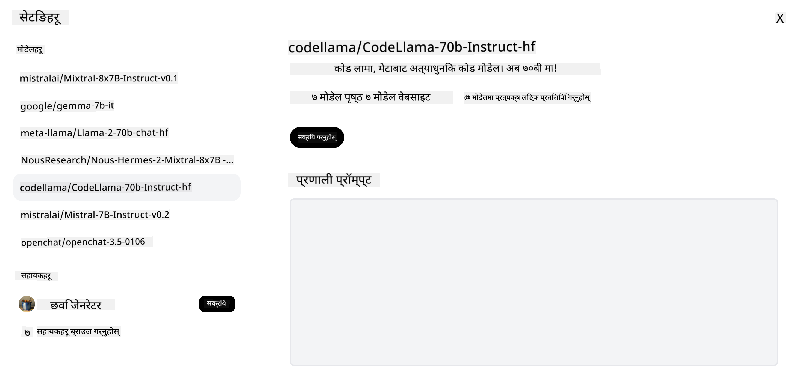

<!--
CO_OP_TRANSLATOR_METADATA:
{
  "original_hash": "85b754d4dc980f270f264d17116d9a5f",
  "translation_date": "2025-12-19T14:14:59+00:00",
  "source_file": "16-open-source-models/README.md",
  "language_code": "ne"
}
-->

## परिचय

खुला स्रोत LLMs को संसार रोमाञ्चक र निरन्तर विकासशील छ। यो पाठले खुला स्रोत मोडेलहरूको गहिरो अवलोकन प्रदान गर्ने लक्ष्य राख्दछ। यदि तपाईंलाई थाहा पाउन मन छ कि कसरी स्वामित्व मोडेलहरू खुला स्रोत मोडेलहरूसँग तुलना गर्छन् भने, ["विभिन्न LLMs अन्वेषण र तुलना गर्ने" पाठ](../02-exploring-and-comparing-different-llms/README.md?WT.mc_id=academic-105485-koreyst) मा जानुहोस्। यो पाठले फाइन-ट्यूनिङको विषय पनि समेट्नेछ तर थप विस्तृत व्याख्या ["फाइन-ट्यूनिङ LLMs" पाठ](../18-fine-tuning/README.md?WT.mc_id=academic-105485-koreyst) मा पाइन्छ।

## सिकाइका लक्ष्यहरू

- खुला स्रोत मोडेलहरूको बुझाइ प्राप्त गर्नुहोस्
- खुला स्रोत मोडेलहरूसँग काम गर्दा हुने फाइदाहरू बुझ्नुहोस्
- Hugging Face र Azure AI Studio मा उपलब्ध खुला मोडेलहरूको अन्वेषण गर्नुहोस्

## खुला स्रोत मोडेलहरू के हुन्?

खुला स्रोत सफ्टवेयरले विभिन्न क्षेत्रहरूमा प्रविधिको विकासमा महत्वपूर्ण भूमिका खेलेको छ। Open Source Initiative (OSI) ले [सफ्टवेयरका लागि १० मापदण्डहरू](https://web.archive.org/web/20241126001143/https://opensource.org/osd?WT.mc_id=academic-105485-koreyst) परिभाषित गरेको छ जुन खुला स्रोतको रूपमा वर्गीकृत गर्न सकिन्छ। स्रोत कोड OSI द्वारा अनुमोदित लाइसेन्स अन्तर्गत खुला रूपमा साझा हुनुपर्छ।

LLMs को विकास सफ्टवेयर विकाससँग समान तत्वहरू भए तापनि प्रक्रिया बिल्कुलै उस्तै छैन। यसले LLMs को सन्दर्भमा खुला स्रोतको परिभाषामा समुदायमा धेरै छलफल ल्याएको छ। परम्परागत खुला स्रोत परिभाषासँग मेल खाने मोडेलको लागि निम्न जानकारी सार्वजनिक रूपमा उपलब्ध हुनुपर्छ:

- मोडेल प्रशिक्षणमा प्रयोग भएका डेटासेटहरू।
- प्रशिक्षणको भागको रूपमा पूर्ण मोडेल तौलहरू।
- मूल्याङ्कन कोड।
- फाइन-ट्यूनिङ कोड।
- पूर्ण मोडेल तौल र प्रशिक्षण मेट्रिक्स।

हाल यो मापदण्डसँग मेल खाने केही मोडेलहरू मात्र छन्। [Allen Institute for Artificial Intelligence (AllenAI) द्वारा सिर्जना गरिएको OLMo मोडेल](https://huggingface.co/allenai/OLMo-7B?WT.mc_id=academic-105485-koreyst) यस श्रेणीमा पर्छ।

यस पाठका लागि, हामी मोडेलहरूलाई "खुला मोडेलहरू" भनेर उल्लेख गर्नेछौं किनभने लेखनको समयमा तिनीहरू माथि उल्लिखित मापदण्डसँग मेल नखान सक्छन्।

## खुला मोडेलहरूको फाइदाहरू

**अत्यन्त अनुकूलनयोग्य** - खुला मोडेलहरू विस्तृत प्रशिक्षण जानकारीसहित रिलिज गरिएका हुनाले, अनुसन्धानकर्ता र विकासकर्ताहरू मोडेलका आन्तरिक भागहरू परिमार्जन गर्न सक्छन्। यसले विशिष्ट कार्य वा अध्ययन क्षेत्रका लागि फाइन-ट्यून गरिएको अत्यन्त विशेषीकृत मोडेलहरू सिर्जना गर्न सक्षम बनाउँछ। यसको केही उदाहरणहरू कोड उत्पादन, गणितीय अपरेसनहरू र जीवविज्ञान हुन्।

**लागत** - यी मोडेलहरू प्रयोग र तैनाथ गर्दा प्रति टोकन लागत स्वामित्व मोडेलहरू भन्दा कम हुन्छ। जेनेरेटिभ AI अनुप्रयोगहरू निर्माण गर्दा, तपाईंको प्रयोग केसमा यी मोडेलहरूसँग काम गर्दा प्रदर्शन र मूल्यको तुलना गर्नु उपयुक्त हुन्छ।

स्रोत: Artificial Analysis

**लचिलोपन** - खुला मोडेलहरूसँग काम गर्दा तपाईं विभिन्न मोडेलहरू प्रयोग गर्न वा तिनीहरूलाई संयोजन गर्न लचिलो हुन सक्नुहुन्छ। यसको उदाहरण [HuggingChat सहायकहरू](https://huggingface.co/chat?WT.mc_id=academic-105485-koreyst) हुन् जहाँ प्रयोगकर्ताले सिधै प्रयोगकर्ता इन्टरफेसमा प्रयोग हुने मोडेल चयन गर्न सक्छ:

## विभिन्न खुला मोडेलहरूको अन्वेषण

### Llama 2

[LLama2](https://huggingface.co/meta-llama?WT.mc_id=academic-105485-koreyst), Meta द्वारा विकास गरिएको, च्याट आधारित अनुप्रयोगहरूका लागि अनुकूलित खुला मोडेल हो। यसको फाइन-ट्यूनिङ विधिले ठूलो मात्रामा संवाद र मानव प्रतिक्रिया समावेश गरेको छ। यस विधिले मोडेललाई मानव अपेक्षासँग मेल खाने परिणामहरू उत्पादन गर्न सक्षम बनाउँछ जसले प्रयोगकर्तालाई राम्रो अनुभव प्रदान गर्दछ।

Llama का फाइन-ट्यून गरिएको केही संस्करणहरूमा [Japanese Llama](https://huggingface.co/elyza/ELYZA-japanese-Llama-2-7b?WT.mc_id=academic-105485-koreyst) समावेश छ, जुन जापानी भाषामा विशेषज्ञता राख्छ र [Llama Pro](https://huggingface.co/TencentARC/LLaMA-Pro-8B?WT.mc_id=academic-105485-koreyst), जुन आधार मोडेलको सुधारिएको संस्करण हो।

### Mistral

[Mistral](https://huggingface.co/mistralai?WT.mc_id=academic-105485-koreyst) उच्च प्रदर्शन र दक्षतामा केन्द्रित खुला मोडेल हो। यसले Mixture-of-Experts विधि प्रयोग गर्दछ जसले विशेषज्ञ मोडेलहरूको समूहलाई एक प्रणालीमा संयोजन गर्छ जहाँ इनपुट अनुसार निश्चित मोडेलहरू चयन गरिन्छ। यसले गणना अधिक प्रभावकारी बनाउँछ किनभने मोडेलहरू केवल तिनीहरू विशेषज्ञता राख्ने इनपुटहरूमा मात्र काम गर्छन्।

Mistral का फाइन-ट्यून गरिएको केही संस्करणहरूमा [BioMistral](https://huggingface.co/BioMistral/BioMistral-7B?text=Mon+nom+est+Thomas+et+mon+principal?WT.mc_id=academic-105485-koreyst) समावेश छ, जुन चिकित्सा क्षेत्रमा केन्द्रित छ र [OpenMath Mistral](https://huggingface.co/nvidia/OpenMath-Mistral-7B-v0.1-hf?WT.mc_id=academic-105485-koreyst), जुन गणितीय गणना गर्दछ।

### Falcon

[Falcon](https://huggingface.co/tiiuae?WT.mc_id=academic-105485-koreyst) Technology Innovation Institute (**TII**) द्वारा सिर्जना गरिएको LLM हो। Falcon-40B लाई ४० अर्ब प्यारामिटरहरूमा प्रशिक्षण दिइएको छ जुन कम कम्प्युट बजेटमा GPT-3 भन्दा राम्रो प्रदर्शन देखाएको छ। यसको कारण FlashAttention एल्गोरिदम र मल्टिक्वेरी ध्यान प्रयोग हो जसले इन्फरेन्स समयमा मेमोरी आवश्यकताहरू घटाउँछ। यसले Falcon-40B लाई च्याट अनुप्रयोगहरूका लागि उपयुक्त बनाउँछ।

Falcon का फाइन-ट्यून गरिएको केही संस्करणहरूमा [OpenAssistant](https://huggingface.co/OpenAssistant/falcon-40b-sft-top1-560?WT.mc_id=academic-105485-koreyst) समावेश छ, जुन खुला मोडेलहरूमा आधारित सहायक हो र [GPT4ALL](https://huggingface.co/nomic-ai/gpt4all-falcon?WT.mc_id=academic-105485-koreyst), जुन आधार मोडेल भन्दा उच्च प्रदर्शन प्रदान गर्दछ।

## कसरी छनोट गर्ने

खुला मोडेल छनोट गर्ने एक मात्र उत्तर छैन। सुरु गर्नको लागि Azure AI Studio को कार्यद्वारा फिल्टर सुविधा प्रयोग गर्नु राम्रो हुन्छ। यसले तपाईंलाई मोडेलले कुन प्रकारका कार्यहरूका लागि प्रशिक्षण पाएको छ बुझ्न मद्दत गर्नेछ। Hugging Face ले पनि LLM लिडरबोर्ड राख्छ जुन निश्चित मेट्रिक्समा आधारित उत्कृष्ट प्रदर्शन गर्ने मोडेलहरू देखाउँछ।

विभिन्न प्रकारका LLMs तुलना गर्दा, [Artificial Analysis](https://artificialanalysis.ai/?WT.mc_id=academic-105485-koreyst) अर्को उत्कृष्ट स्रोत हो:

स्रोत: Artificial Analysis

विशिष्ट प्रयोग केसमा काम गर्दा, सोही क्षेत्रमा केन्द्रित फाइन-ट्यून गरिएको संस्करणहरू खोज्नु प्रभावकारी हुन सक्छ। तपाईं र तपाईंका प्रयोगकर्ताहरूको अपेक्षाअनुसार कसरी प्रदर्शन गर्छन् भनेर हेर्न विभिन्न खुला मोडेलहरूसँग प्रयोग गर्नु अर्को राम्रो अभ्यास हो।

## अर्को कदमहरू

खुला मोडेलहरूको सबैभन्दा राम्रो पक्ष भनेको तपाईं छिटो काम सुरु गर्न सक्नुहुन्छ। [Azure AI Foundry Model Catalog](https://ai.azure.com?WT.mc_id=academic-105485-koreyst) हेर्नुहोस्, जसले यहाँ छलफल गरिएका मोडेलहरूसँग सम्बन्धित Hugging Face संग्रह समावेश गर्दछ।

## सिकाइ यहाँ रोकिँदैन, यात्रा जारी राख्नुहोस्

यो पाठ पूरा गरेपछि, हाम्रो [Generative AI Learning संग्रह](https://aka.ms/genai-collection?WT.mc_id=academic-105485-koreyst) हेर्नुहोस् र तपाईंको जेनेरेटिभ AI ज्ञानलाई अझ उचाइमा पुर्‍याउनुहोस्!

---

<!-- CO-OP TRANSLATOR DISCLAIMER START -->
**अस्वीकरण**:
यो दस्तावेज AI अनुवाद सेवा [Co-op Translator](https://github.com/Azure/co-op-translator) प्रयोग गरी अनुवाद गरिएको हो। हामी शुद्धताका लागि प्रयासरत छौं, तर कृपया ध्यान दिनुहोस् कि स्वचालित अनुवादमा त्रुटि वा अशुद्धता हुन सक्छ। मूल दस्तावेज यसको मूल भाषामा नै अधिकारिक स्रोत मानिनु पर्छ। महत्वपूर्ण जानकारीका लागि व्यावसायिक मानव अनुवाद सिफारिस गरिन्छ। यस अनुवादको प्रयोगबाट उत्पन्न कुनै पनि गलतफहमी वा गलत व्याख्याका लागि हामी जिम्मेवार छैनौं।
<!-- CO-OP TRANSLATOR DISCLAIMER END -->