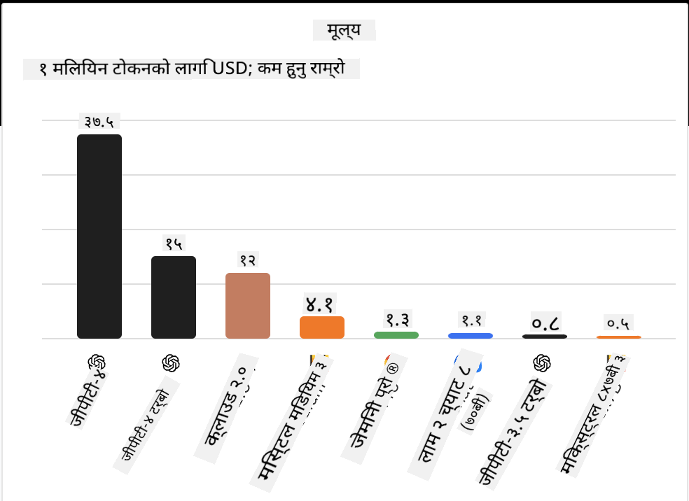
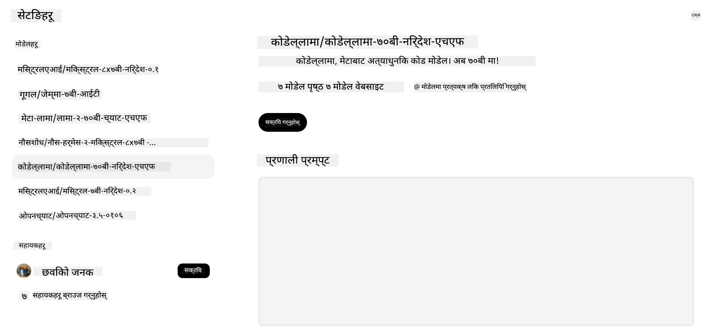

<!--
CO_OP_TRANSLATOR_METADATA:
{
  "original_hash": "0bba96e53ab841d99db731892a51fab8",
  "translation_date": "2025-05-20T06:52:14+00:00",
  "source_file": "16-open-source-models/README.md",
  "language_code": "ne"
}
-->

## परिचय

ओपन-सोर्स LLMs को विश्व रोमाञ्चक र निरन्तर परिवर्तनशील छ। यो पाठले ओपन-सोर्स मोडेलहरूको गहन अध्ययन प्रदान गर्ने लक्ष्य राख्छ। यदि तपाईंलाई स्वामित्व मोडेलहरू र ओपन-सोर्स मोडेलहरू बीचको तुलना गर्न जानकारी चाहिएको छ भने ["विभिन्न LLMs को अन्वेषण र तुलना" पाठ](../02-exploring-and-comparing-different-llms/README.md?WT.mc_id=academic-105485-koreyst) मा जानुहोस्। यो पाठले फाइन-ट्यूनिङको विषयलाई पनि समेट्छ तर थप विस्तृत व्याख्या ["LLMs को फाइन-ट्यूनिङ" पाठ](../18-fine-tuning/README.md?WT.mc_id=academic-105485-koreyst) मा पाइन्छ।

## अध्ययन लक्ष्यहरू

- ओपन-सोर्स मोडेलहरूको बुझाइ प्राप्त गर्नुहोस्
- ओपन-सोर्स मोडेलहरूसँग काम गर्दा हुने फाइदाहरू बुझ्नुहोस्
- Hugging Face र Azure AI Studio मा उपलब्ध खुला मोडेलहरूको अन्वेषण गर्नुहोस्

## ओपन-सोर्स मोडेलहरू के हुन्?

ओपन-सोर्स सफ्टवेयरले विभिन्न क्षेत्रमा प्रविधिको वृद्धिमा महत्त्वपूर्ण भूमिका खेलेको छ। ओपन सोर्स इनिसिएटिभ (OSI) ले सफ्टवेयरलाई ओपन-सोर्सका रूपमा वर्गीकृत गर्न [१० मापदण्डहरू](https://web.archive.org/web/20241126001143/https://opensource.org/osd?WT.mc_id=academic-105485-koreyst) परिभाषित गरेको छ। स्रोत कोड OSI द्वारा अनुमोदित लाइसेन्स अन्तर्गत खुल्ला रूपमा साझेदारी हुनुपर्छ।

LLMs को विकासमा सफ्टवेयर विकाससँग मिल्दोजुल्दो तत्वहरू छन्, तर प्रक्रिया एकदमै उस्तै छैन। यसले LLMs को सन्दर्भमा ओपन-सोर्सको परिभाषामा समुदायमा धेरै छलफल ल्याएको छ। मोडेललाई पारम्परिक ओपन-सोर्स परिभाषासँग मेल खाने बनाउन निम्न जानकारी सार्वजनिक रूपमा उपलब्ध हुनुपर्छ:

- मोडेललाई तालिम दिन प्रयोग गरिएका डेटासेटहरू।
- प्रशिक्षणको भागको रूपमा पूर्ण मोडेल वजनहरू।
- मूल्यांकन कोड।
- फाइन-ट्यूनिङ कोड।
- पूर्ण मोडेल वजनहरू र प्रशिक्षण मेट्रिक्स।

हाल यस मापदण्डसँग मेल खाने केही मोडेलहरू मात्र छन्। [Allen Institute for Artificial Intelligence (AllenAI) द्वारा सिर्जित OLMo मोडेल](https://huggingface.co/allenai/OLMo-7B?WT.mc_id=academic-105485-koreyst) यस श्रेणीमा पर्छ।

यो पाठको लागि, हामी लेख्दाखेरि यी मापदण्डसँग मेल नखान सक्ने भएकाले मोडेलहरूलाई "खुला मोडेलहरू" भनेर सम्बोधन गर्नेछौं।

## खुला मोडेलहरूको फाइदा

**अत्यधिक अनुकूलन योग्य** - खुला मोडेलहरू विस्तृत प्रशिक्षण जानकारीसँग रिलिज गरिन्छन्, जसले अनुसन्धानकर्ताहरू र विकासकर्ताहरूलाई मोडेलको आन्तरिक संरचनालाई परिमार्जन गर्न सक्षम बनाउँछ। यसले विशेष कार्य वा अध्ययनको क्षेत्रमा अत्यधिक विशिष्ट मोडेलहरू सिर्जना गर्न सक्षम बनाउँछ। केही उदाहरणहरू कोड उत्पन्न, गणितीय कार्यहरू र जीवविज्ञान हुन्।

**लागत** - यी मोडेलहरू प्रयोग र तैनाथ गर्दा प्रति टोकनको लागत स्वामित्व मोडेलहरूको भन्दा कम हुन्छ। जेनेरेटिभ AI अनुप्रयोगहरू बनाउँदा, तपाईंको प्रयोग केसमा यी मोडेलहरूसँग काम गर्दा प्रदर्शन बनाम मूल्यलाई विचार गर्नु पर्छ।

 स्रोत: कृत्रिम विश्लेषण

**लचिलोपन** - खुला मोडेलहरूसँग काम गर्दा तपाईंलाई विभिन्न मोडेलहरू प्रयोग गर्न वा तिनीहरूलाई संयोजन गर्न लचिलो बनाउँछ। यसको एक उदाहरण [HuggingChat Assistants](https://huggingface.co/chat?WT.mc_id=academic-105485-koreyst) हो जहाँ प्रयोगकर्ताले प्रयोग भइरहेको मोडेललाई प्रयोगकर्ता इन्टरफेसमा सीधै चयन गर्न सक्छ:

## विभिन्न खुला मोडेलहरूको अन्वेषण

### Llama 2

[LLama2](https://huggingface.co/meta-llama?WT.mc_id=academic-105485-koreyst), Meta द्वारा विकसित गरिएको, च्याट आधारित अनुप्रयोगहरूको लागि अनुकूलित खुला मोडेल हो। यो यसको फाइन-ट्यूनिङ विधिको कारण हो, जसमा ठूलो मात्रामा संवाद र मानव प्रतिक्रिया समावेश थियो। यस विधिले मोडेललाई मानव अपेक्षासँग मेल खाने बढी परिणामहरू उत्पन्न गर्न सक्षम बनाउँछ, जसले राम्रो प्रयोगकर्ता अनुभव प्रदान गर्दछ।

Llama का फाइन-ट्यून गरिएका संस्करणहरूको केही उदाहरणहरूमा [Japanese Llama](https://huggingface.co/elyza/ELYZA-japanese-Llama-2-7b?WT.mc_id=academic-105485-koreyst), जुन जापानीमा विशेष छ, र [Llama Pro](https://huggingface.co/TencentARC/LLaMA-Pro-8B?WT.mc_id=academic-105485-koreyst), जुन आधार मोडेलको सुधार गरिएको संस्करण हो।

### Mistral

[Mistral](https://huggingface.co/mistralai?WT.mc_id=academic-105485-koreyst) उच्च प्रदर्शन र दक्षतामा केन्द्रित खुला मोडेल हो। यसले Mixture-of-Experts दृष्टिकोण प्रयोग गर्छ जसले विशेषज्ञ मोडेलहरूको समूहलाई एक प्रणालीमा संयोजन गर्छ जहाँ इनपुटको आधारमा निश्चित मोडेलहरू चयन गरिन्छ। यसले गणनालाई थप प्रभावकारी बनाउँछ किनकि मोडेलहरूले मात्र उनीहरू विशेषज्ञ भएका इनपुटहरूलाई सम्बोधन गर्छन्।

Mistral का फाइन-ट्यून गरिएका संस्करणहरूको केही उदाहरणहरूमा [BioMistral](https://huggingface.co/BioMistral/BioMistral-7B?text=Mon+nom+est+Thomas+et+mon+principal?WT.mc_id=academic-105485-koreyst), जुन चिकित्सा क्षेत्रमा केन्द्रित छ, र [OpenMath Mistral](https://huggingface.co/nvidia/OpenMath-Mistral-7B-v0.1-hf?WT.mc_id=academic-105485-koreyst), जुन गणितीय गणना गर्दछ।

### Falcon

[Falcon](https://huggingface.co/tiiuae?WT.mc_id=academic-105485-koreyst) प्रविधि नवप्रवर्तन संस्थान (TII) द्वारा सिर्जित LLM हो। Falcon-40B लाई ४० अर्ब प्यारामिटरहरूमा तालिम दिइएको थियो, जसले कम कम्प्युट बजेटमा GPT-3 भन्दा राम्रो प्रदर्शन गरेको देखाइएको छ। यो यसको FlashAttention एल्गोरिदम र बहु-प्रश्न ध्यानको प्रयोगको कारण हो जसले यसलाई अनुमान समयमा स्मृति आवश्यकताहरूलाई कटौती गर्न सक्षम बनाउँछ। यस कम अनुमान समयको साथ, Falcon-40B च्याट अनुप्रयोगहरूको लागि उपयुक्त छ।

Falcon का फाइन-ट्यून गरिएका संस्करणहरूको केही उदाहरणहरूमा [OpenAssistant](https://huggingface.co/OpenAssistant/falcon-40b-sft-top1-560?WT.mc_id=academic-105485-koreyst), खुला मोडेलहरूमा आधारित सहायक र [GPT4ALL](https://huggingface.co/nomic-ai/gpt4all-falcon?WT.mc_id=academic-105485-koreyst), जसले आधार मोडेल भन्दा उच्च प्रदर्शन प्रदान गर्दछ।

## कसरी छनोट गर्ने

खुला मोडेल चयन गर्ने कुनै एक मात्र उत्तर छैन। सुरु गर्नको लागि राम्रो स्थान Azure AI Studio को कार्य द्वारा फिल्टर गर्ने सुविधा प्रयोग गर्नु हो। यसले मोडेललाई कुन प्रकारका कार्यहरूको लागि तालिम दिइएको छ भनेर बुझ्न मद्दत गर्नेछ। Hugging Face ले LLM Leaderboard पनि राख्छ, जसले तपाईंलाई निश्चित मेट्रिक्सको आधारमा सबैभन्दा राम्रो प्रदर्शन गर्ने मोडेलहरू देखाउँछ।

विभिन्न प्रकारका LLMs लाई तुलना गर्न खोज्दा, [Artificial Analysis](https://artificialanalysis.ai/?WT.mc_id=academic-105485-koreyst) अर्को उत्कृष्ट स्रोत हो:

 स्रोत: कृत्रिम विश्लेषण

विशिष्ट प्रयोग केसमा काम गर्दा, त्यही क्षेत्रमा केन्द्रित फाइन-ट्यून गरिएका संस्करणहरूको खोजी प्रभावकारी हुन सक्छ। तपाईँ र तपाईँका प्रयोगकर्ताहरूको अपेक्षाहरू अनुसार तिनीहरूले कसरी प्रदर्शन गर्छन् भनेर हेर्नका लागि धेरै खुला मोडेलहरूमा प्रयोग गर्नु अर्को राम्रो अभ्यास हो।

## अर्को कदमहरू

खुला मोडेलहरूको सबैभन्दा राम्रो पक्ष यो हो कि तपाईं तीसँग छिट्टै काम गर्न सुरु गर्न सक्नुहुन्छ। [Azure AI Studio मोडेल क्याटलग](https://ai.azure.com?WT.mc_id=academic-105485-koreyst) हेर्नुहोस्, जसमा यहाँ छलफल गरिएका मोडेलहरूको विशेष Hugging Face संग्रह छ।

## अध्ययन यहाँ रोकिँदैन, यात्रा जारी राख्नुहोस्

यो पाठ पूरा गरेपछि, हाम्रो [Generative AI Learning संग्रह](https://aka.ms/genai-collection?WT.mc_id=academic-105485-koreyst) हेर्नुहोस् ताकि तपाईँको Generative AI ज्ञानलाई अझ उचाइमा लैजान सक्नुहोस्!

**अस्वीकरण**:  
यो दस्तावेज़ AI अनुवाद सेवा [Co-op Translator](https://github.com/Azure/co-op-translator) प्रयोग गरेर अनुवाद गरिएको हो। हामी सटीकताको लागि प्रयास गर्छौं, कृपया सचेत रहनुहोस् कि स्वचालित अनुवादमा त्रुटिहरू वा अशुद्धताहरू हुन सक्छन्। यसको मूल भाषामा रहेको दस्तावेज़लाई आधिकारिक स्रोत मानिनु पर्छ। महत्वपूर्ण जानकारीको लागि, व्यावसायिक मानव अनुवाद सिफारिस गरिन्छ। यस अनुवादको प्रयोगबाट उत्पन्न हुने कुनै पनि गलतफहमी वा गलत व्याख्याको लागि हामी जिम्मेवार छैनौं।