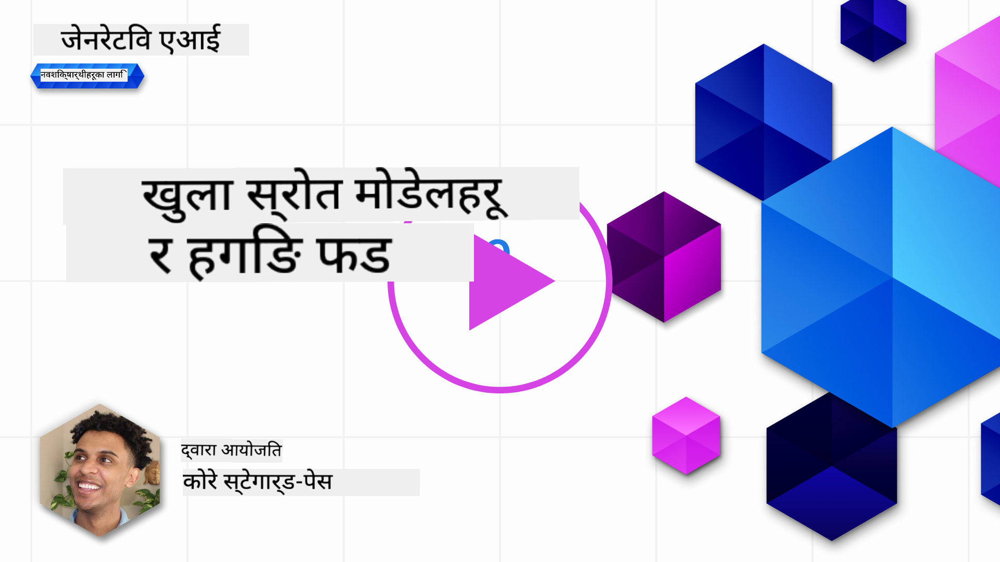
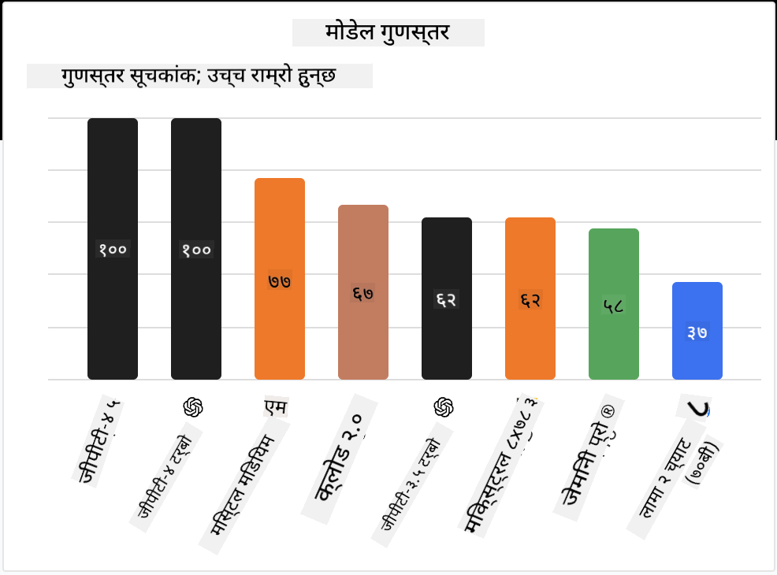

<!--
CO_OP_TRANSLATOR_METADATA:
{
  "original_hash": "a2a83aac52158c23161046cbd13faa2b",
  "translation_date": "2025-10-17T14:01:26+00:00",
  "source_file": "16-open-source-models/README.md",
  "language_code": "ne"
}
-->

## परिचय

ओपन सोर्स LLMs को संसार रोमाञ्चक र निरन्तर परिवर्तनशील छ। यो पाठले ओपन सोर्स मोडेलहरूको गहिरो अध्ययन प्रदान गर्ने लक्ष्य राख्छ। यदि तपाईंलाई स्वामित्व मोडेलहरू र ओपन सोर्स मोडेलहरूको तुलना गर्ने जानकारी चाहिन्छ भने ["विभिन्न LLMs अन्वेषण र तुलना गर्ने पाठ"](../02-exploring-and-comparing-different-llms/README.md?WT.mc_id=academic-105485-koreyst) मा जानुहोस्। यो पाठले फाइन-ट्युनिङको विषयलाई पनि समेट्नेछ तर विस्तृत व्याख्या ["LLMs फाइन-ट्युनिङ गर्ने पाठ"](../18-fine-tuning/README.md?WT.mc_id=academic-105485-koreyst) मा पाइन्छ।

## सिकाइका लक्ष्यहरू

- ओपन सोर्स मोडेलहरूको समझ प्राप्त गर्नुहोस्
- ओपन सोर्स मोडेलहरूसँग काम गर्दा हुने फाइदाहरू बुझ्नुहोस्
- Hugging Face र Azure AI Studio मा उपलब्ध ओपन मोडेलहरूको अन्वेषण गर्नुहोस्

## ओपन सोर्स मोडेलहरू के हुन्?

ओपन सोर्स सफ्टवेयरले विभिन्न क्षेत्रहरूमा प्रविधिको विकासमा महत्त्वपूर्ण भूमिका खेलेको छ। ओपन सोर्स इनिसिएटिभ (OSI) ले [सफ्टवेयरलाई ओपन सोर्सको रूपमा वर्गीकृत गर्न १० मापदण्डहरू](https://web.archive.org/web/20241126001143/https://opensource.org/osd?WT.mc_id=academic-105485-koreyst) परिभाषित गरेको छ। स्रोत कोड OSI द्वारा अनुमोदित लाइसेन्स अन्तर्गत खुला रूपमा साझा गर्नुपर्छ।

LLMs को विकासमा सफ्टवेयर विकाससँग समान तत्वहरू छन्, तर प्रक्रिया पूर्ण रूपमा उस्तै छैन। यसले LLMs को सन्दर्भमा ओपन सोर्सको परिभाषामा समुदायमा धेरै छलफल ल्याएको छ। परम्परागत ओपन सोर्सको परिभाषासँग मेल खाने मोडेलका लागि निम्न जानकारी सार्वजनिक रूपमा उपलब्ध हुनुपर्छ:

- मोडेललाई प्रशिक्षण दिन प्रयोग गरिएका डेटासेटहरू।
- पूर्ण मोडेल वेट्स प्रशिक्षणको भागको रूपमा।
- मूल्यांकन कोड।
- फाइन-ट्युनिङ कोड।
- पूर्ण मोडेल वेट्स र प्रशिक्षण मेट्रिक्स।

हालका समयमा यी मापदण्डहरू पूरा गर्ने मोडेलहरू थोरै मात्र छन्। [Allen Institute for Artificial Intelligence (AllenAI) द्वारा सिर्जित OLMo मोडेल](https://huggingface.co/allenai/OLMo-7B?WT.mc_id=academic-105485-koreyst) यस श्रेणीमा फिट हुन्छ।

यस पाठको लागि, हामी मोडेलहरूलाई "ओपन मोडेलहरू" भनेर उल्लेख गर्नेछौं किनकि लेख्ने समयमा तिनीहरूले माथिका मापदण्डहरू पूरा नगर्न सक्छन्।

## ओपन मोडेलहरूको फाइदाहरू

**अत्यधिक अनुकूलनयोग्य** - ओपन मोडेलहरू विस्तृत प्रशिक्षण जानकारीसहित जारी गरिन्छन्, जसले अनुसन्धानकर्ता र विकासकर्ताहरूलाई मोडेलको आन्तरिक संरचनामा परिवर्तन गर्न सक्षम बनाउँछ। यसले विशिष्ट कार्य वा अध्ययनको क्षेत्रमा अत्यधिक विशेषज्ञ मोडेलहरू सिर्जना गर्न सक्षम बनाउँछ। यसको केही उदाहरणहरू कोड जेनेरेशन, गणितीय अपरेशनहरू र जीवविज्ञान हुन्।

**खर्च** - यी मोडेलहरू प्रयोग र तैनाती गर्दा प्रति टोकन लागत स्वामित्व मोडेलहरूको तुलनामा कम हुन्छ। जेनेरेटिभ AI एप्लिकेसनहरू निर्माण गर्दा, प्रदर्शन बनाम मूल्यलाई ध्यानमा राख्दै आफ्नो प्रयोग केसमा काम गर्दा विचार गर्नुपर्छ।

स्रोत: Artificial Analysis

**लचिलोपन** - ओपन मोडेलहरूसँग काम गर्दा विभिन्न मोडेलहरू प्रयोग गर्ने वा तिनीहरूलाई संयोजन गर्ने मामिलामा लचिलो हुन सकिन्छ। यसको एक उदाहरण [HuggingChat Assistants](https://huggingface.co/chat?WT.mc_id=academic-105485-koreyst) हो, जहाँ प्रयोगकर्ताले प्रयोग भइरहेको मोडेललाई सिधै प्रयोगकर्ता इन्टरफेसमा चयन गर्न सक्छ:

## विभिन्न ओपन मोडेलहरूको अन्वेषण

### Llama 2

[LLama2](https://huggingface.co/meta-llama?WT.mc_id=academic-105485-koreyst), Meta द्वारा विकसित, च्याट आधारित एप्लिकेसनहरूको लागि अनुकूलित ओपन मोडेल हो। यसको फाइन-ट्युनिङ विधि, जसमा ठूलो मात्रामा संवाद र मानव प्रतिक्रिया समावेश गरिएको थियो, यसले मोडेललाई मानव अपेक्षासँग मेल खाने परिणामहरू उत्पादन गर्न सक्षम बनाउँछ जसले राम्रो प्रयोगकर्ता अनुभव प्रदान गर्दछ।

Llama को फाइन-ट्युन गरिएको संस्करणहरूको केही उदाहरणहरूमा [Japanese Llama](https://huggingface.co/elyza/ELYZA-japanese-Llama-2-7b?WT.mc_id=academic-105485-koreyst), जसले जापानीमा विशेषज्ञता राख्छ, र [Llama Pro](https://huggingface.co/TencentARC/LLaMA-Pro-8B?WT.mc_id=academic-105485-koreyst), जुन आधार मोडेलको उन्नत संस्करण हो।

### Mistral

[Mistral](https://huggingface.co/mistralai?WT.mc_id=academic-105485-koreyst) उच्च प्रदर्शन र दक्षतामा केन्द्रित ओपन मोडेल हो। यसले Mixture-of-Experts दृष्टिकोण प्रयोग गर्दछ जसले विशेषज्ञ मोडेलहरूको समूहलाई एक प्रणालीमा संयोजन गर्दछ जहाँ इनपुटको आधारमा निश्चित मोडेलहरू चयन गरिन्छ। यसले गणनालाई अधिक प्रभावकारी बनाउँछ किनकि मोडेलहरू केवल तिनीहरू विशेषज्ञ भएका इनपुटहरूलाई सम्बोधन गरिरहेका छन्।

Mistral को फाइन-ट्युन गरिएको संस्करणहरूको केही उदाहरणहरूमा [BioMistral](https://huggingface.co/BioMistral/BioMistral-7B?text=Mon+nom+est+Thomas+et+mon+principal?WT.mc_id=academic-105485-koreyst), जसले चिकित्सा क्षेत्रमा ध्यान केन्द्रित गर्दछ, र [OpenMath Mistral](https://huggingface.co/nvidia/OpenMath-Mistral-7B-v0.1-hf?WT.mc_id=academic-105485-koreyst), जसले गणितीय गणना गर्दछ।

### Falcon

[Falcon](https://huggingface.co/tiiuae?WT.mc_id=academic-105485-koreyst) टेक्नोलोजी इनोभेसन इन्स्टिच्युट (**TII**) द्वारा सिर्जित LLM हो। Falcon-40B लाई ४० अर्ब प्यारामिटरहरूमा प्रशिक्षण दिइएको थियो जसले GPT-3 भन्दा कम कम्प्युट बजेटमा राम्रो प्रदर्शन गरेको देखाइएको छ। यसको कारण FlashAttention एल्गोरिदम र मल्टिक्वेरी ध्यानको प्रयोग हो जसले इनफरेन्स समयमा मेमोरी आवश्यकताहरू घटाउन सक्षम बनाउँछ। यस घटाइएको इनफरेन्स समयको साथ, Falcon-40B च्याट एप्लिकेसनहरूको लागि उपयुक्त छ।

Falcon को फाइन-ट्युन गरिएको संस्करणहरूको केही उदाहरणहरूमा [OpenAssistant](https://huggingface.co/OpenAssistant/falcon-40b-sft-top1-560?WT.mc_id=academic-105485-koreyst), ओपन मोडेलहरूमा आधारित सहायक, र [GPT4ALL](https://huggingface.co/nomic-ai/gpt4all-falcon?WT.mc_id=academic-105485-koreyst), जसले आधार मोडेलभन्दा उच्च प्रदर्शन प्रदान गर्दछ।

## कसरी चयन गर्ने

ओपन मोडेल चयन गर्नको लागि कुनै एक उत्तर छैन। Azure AI Studio को टास्कद्वारा फिल्टर गर्ने सुविधा प्रयोग गरेर सुरु गर्नु राम्रो ठाउँ हो। यसले तपाईंलाई मोडेलले कुन प्रकारका कार्यहरूको लागि प्रशिक्षण लिएको छ भन्ने बुझ्न मद्दत गर्दछ। Hugging Face ले LLM लिडरबोर्ड पनि राख्छ जसले तपाईंलाई निश्चित मेट्रिक्सको आधारमा उत्कृष्ट प्रदर्शन गर्ने मोडेलहरू देखाउँछ।

विभिन्न प्रकारका LLMs बीच तुलना गर्न खोज्दा, [Artificial Analysis](https://artificialanalysis.ai/?WT.mc_id=academic-105485-koreyst) अर्को उत्कृष्ट स्रोत हो:

स्रोत: Artificial Analysis

विशिष्ट प्रयोग केसमा काम गर्दा, त्यही क्षेत्रमा केन्द्रित फाइन-ट्युन गरिएको संस्करणहरूको खोजी प्रभावकारी हुन सक्छ। तपाईं र तपाईंका प्रयोगकर्ताहरूको अपेक्षाअनुसार मोडेलहरू कसरी प्रदर्शन गर्छन् भनेर हेर्न धेरै ओपन मोडेलहरूसँग प्रयोग गर्नु अर्को राम्रो अभ्यास हो।

## अर्को कदम

ओपन मोडेलहरूको सबैभन्दा राम्रो पक्ष भनेको तपाईं तिनीहरूसँग छिट्टै काम गर्न सुरु गर्न सक्नुहुन्छ। [Azure AI Foundry Model Catalog](https://ai.azure.com?WT.mc_id=academic-105485-koreyst) हेर्नुहोस्, जसमा यहाँ छलफल गरिएका मोडेलहरूको विशेष Hugging Face संग्रह छ।

## सिकाइ यहाँ रोकिँदैन, यात्रा जारी राख्नुहोस्

यो पाठ पूरा गरेपछि, हाम्रो [Generative AI Learning collection](https://aka.ms/genai-collection?WT.mc_id=academic-105485-koreyst) हेर्नुहोस् र आफ्नो जेनेरेटिभ AI ज्ञानलाई अझ स्तरवृद्धि गर्नुहोस्!

---

**अस्वीकरण**:  
यो दस्तावेज AI अनुवाद सेवा [Co-op Translator](https://github.com/Azure/co-op-translator) प्रयोग गरेर अनुवाद गरिएको छ। हामी शुद्धताको लागि प्रयास गर्छौं, तर कृपया ध्यान दिनुहोस् कि स्वचालित अनुवादहरूमा त्रुटिहरू वा अशुद्धताहरू हुन सक्छ। यसको मूल भाषा मा रहेको मूल दस्तावेजलाई आधिकारिक स्रोत मानिनुपर्छ। महत्वपूर्ण जानकारीको लागि, व्यावसायिक मानव अनुवाद सिफारिस गरिन्छ। यस अनुवादको प्रयोगबाट उत्पन्न हुने कुनै पनि गलतफहमी वा गलत व्याख्याको लागि हामी जिम्मेवार हुनेछैनौं।