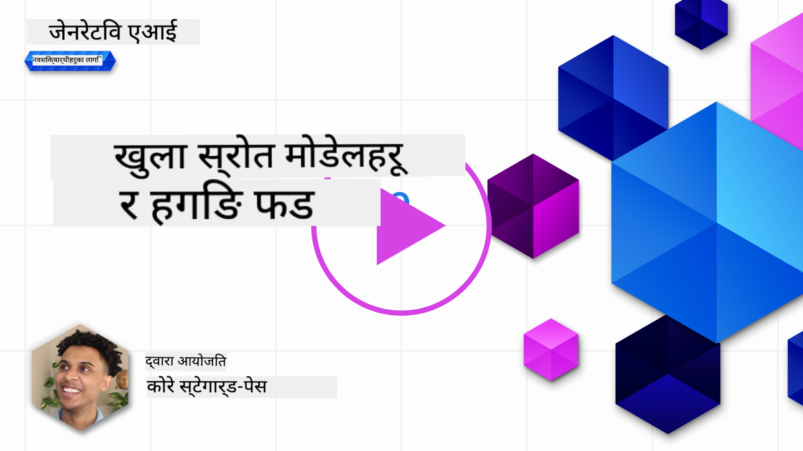
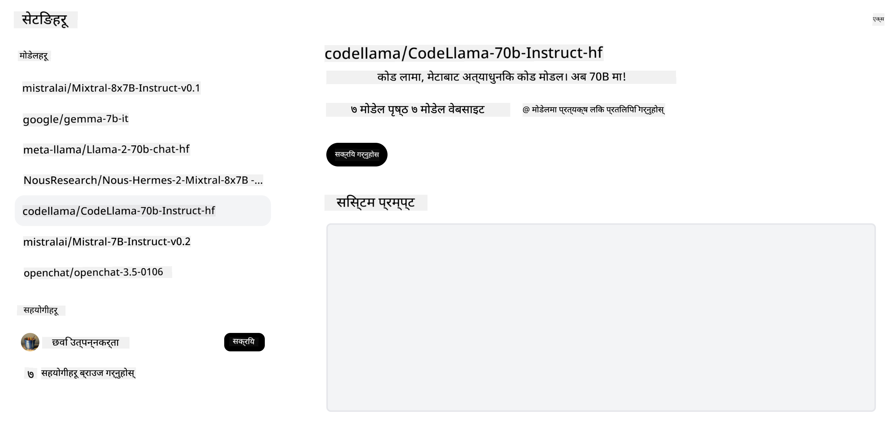
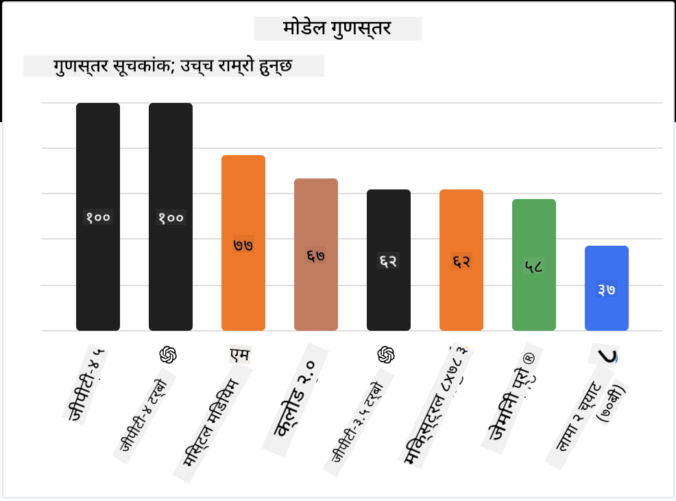

<!--
CO_OP_TRANSLATOR_METADATA:
{
  "original_hash": "0bba96e53ab841d99db731892a51fab8",
  "translation_date": "2025-06-25T23:53:35+00:00",
  "source_file": "16-open-source-models/README.md",
  "language_code": "ne"
}
-->

## परिचय

खुला स्रोत LLM को संसार रोमाञ्चक र निरन्तर परिवर्तनशील छ। यो पाठले खुला स्रोत मोडेलहरूको गहिरो दृष्टिकोण प्रदान गर्न लक्ष्य राख्छ। यदि तपाईँलाई स्वामित्वयुक्त मोडेलहरू खुला स्रोत मोडेलहरूसँग कसरी तुलना गरिन्छ भन्ने जानकारी चाहिन्छ भने ["विभिन्न LLM अन्वेषण र तुलना गर्ने पाठ"](../02-exploring-and-comparing-different-llms/README.md?WT.mc_id=academic-105485-koreyst) मा जानुहोस्। यो पाठले फाइन-ट्युनिङको विषय पनि समेट्नेछ तर थप विस्तृत व्याख्या ["फाइन-ट्युनिङ LLMs" पाठ](../18-fine-tuning/README.md?WT.mc_id=academic-105485-koreyst) मा भेट्न सकिन्छ।

## अध्ययन लक्ष्यहरू

- खुला स्रोत मोडेलहरूको बुझाइ प्राप्त गर्नुहोस्
- खुला स्रोत मोडेलहरूसँग काम गर्दा फाइदाहरू बुझ्नुहोस्
- Hugging Face र Azure AI Studio मा उपलब्ध खुला मोडेलहरूको अन्वेषण गर्नुहोस्

## खुला स्रोत मोडेलहरू के हुन्?

खुला स्रोत सफ्टवेयरले विभिन्न क्षेत्रहरूमा प्रविधिको वृद्धिमा महत्वपूर्ण भूमिका खेलेको छ। ओपन सोर्स इनिसिएटिभ (OSI) ले सफ्टवेयरलाई खुला स्रोतको रूपमा वर्गीकृत गर्न [१० मापदण्डहरू](https://web.archive.org/web/20241126001143/https://opensource.org/osd?WT.mc_id=academic-105485-koreyst) परिभाषित गरेको छ। स्रोत कोड OSI द्वारा अनुमोदित लाइसेन्स अन्तर्गत खुल्ला रूपमा साझा गरिनु पर्छ।

LLM को विकासमा सफ्टवेयर विकाससँग समान तत्वहरू भए तापनि प्रक्रिया ठ्याक्कै एउटै छैन। यसले LLM को सन्दर्भमा खुला स्रोतको परिभाषामा समुदायमा धेरै छलफल ल्याएको छ। मोडेललाई परम्परागत खुला स्रोत परिभाषासँग मेल खाने बनाउन निम्न जानकारी सार्वजनिक रूपमा उपलब्ध हुनुपर्छ:

- मोडेललाई प्रशिक्षण दिन प्रयोग गरिएका डेटासेटहरू।
- पूर्ण मोडेल वजनहरू प्रशिक्षणको भागको रूपमा।
- मूल्याङ्कन कोड।
- फाइन-ट्युनिङ कोड।
- पूर्ण मोडेल वजनहरू र प्रशिक्षण मेट्रिक्स।

हालसालै मात्र केही मोडेलहरू यस मापदण्डसँग मेल खान्छन्। [Allen Institute for Artificial Intelligence (AllenAI) द्वारा सिर्जना गरिएको OLMo मोडेल](https://huggingface.co/allenai/OLMo-7B?WT.mc_id=academic-105485-koreyst) यस श्रेणीमा फिट हुन्छ।

यस पाठको लागि, हामी लेख्ने समयमा उपरोक्त मापदण्डसँग मेल नखान सक्छन् भनेर अगाडि बढ्दै मोडेलहरूलाई "खुला मोडेल" भनेर सन्दर्भ गर्नेछौं।

## खुला मोडेलहरूको फाइदा

**अत्यधिक अनुकूलन योग्य** - खुला मोडेलहरू विस्तृत प्रशिक्षण जानकारीसहित जारी गरिएका छन्, अनुसन्धानकर्ता र विकासकर्ताहरूले मोडेलको आन्तरिक संरचनामा परिवर्तन गर्न सक्छन्। यसले अत्यधिक विशेष मोडेलहरूको सिर्जना गर्न सक्षम बनाउँछ जुन विशेष कार्य वा अध्ययनको क्षेत्रमा फाइन-ट्युन गरिएको छ। यसका केही उदाहरणहरू कोड उत्पादन, गणितीय कार्यहरू र जीवविज्ञान हुन्।

**लागत** - यी मोडेलहरू प्रयोग र तैनाथ गर्दा प्रति टोकन लागत स्वामित्वयुक्त मोडेलहरूको भन्दा कम हुन्छ। जेनेरेटिभ AI अनुप्रयोगहरू निर्माण गर्दा, प्रदर्शन बनाम मूल्यलाई ध्यानमा राखेर यी मोडेलहरूसँग काम गर्दा ध्यान दिनुपर्छ।

स्रोत: कृत्रिम विश्लेषण

**लचिलोपन** - खुला मोडेलहरूसँग काम गर्दा विभिन्न मोडेलहरू प्रयोग गर्ने वा तिनीहरूलाई संयोजन गर्ने मामलामा लचिलो बन्न सक्षम बनाउँछ। यसको एउटा उदाहरण [HuggingChat सहायकहरू](https://huggingface.co/chat?WT.mc_id=academic-105485-koreyst) हो जहाँ प्रयोगकर्ताले प्रयोग गरिरहेको मोडेललाई सीधा प्रयोगकर्ता इन्टरफेसमा चयन गर्न सक्छ:

## विभिन्न खुला मोडेलहरूको अन्वेषण

### Llama 2

[LLama2](https://huggingface.co/meta-llama?WT.mc_id=academic-105485-koreyst), Meta द्वारा विकसित गरिएको एक खुला मोडेल हो जुन च्याट आधारित अनुप्रयोगहरूको लागि अनुकूलित गरिएको छ। यसको फाइन-ट्युनिङ विधिको कारणले गर्दा, जसमा धेरै मात्रामा संवाद र मानव प्रतिक्रिया समावेश गरिएको थियो। यस विधिले मोडेलले मानव अपेक्षासँग मेल खाने थप परिणामहरू उत्पादन गर्दछ जसले राम्रो प्रयोगकर्ता अनुभव प्रदान गर्दछ।

Llama का केही फाइन-ट्युन गरिएको संस्करणहरूमा [Japanese Llama](https://huggingface.co/elyza/ELYZA-japanese-Llama-2-7b?WT.mc_id=academic-105485-koreyst) समावेश छ, जुन जापानीमा विशेष छ र [Llama Pro](https://huggingface.co/TencentARC/LLaMA-Pro-8B?WT.mc_id=academic-105485-koreyst), जुन आधार मोडेलको सुधारिएको संस्करण हो।

### Mistral

[Mistral](https://huggingface.co/mistralai?WT.mc_id=academic-105485-koreyst) एक खुला मोडेल हो जसमा उच्च प्रदर्शन र दक्षतामा बलियो ध्यान दिइएको छ। यसले विशेषज्ञ मोडेलहरूको समूहलाई एक प्रणालीमा संयोजन गर्ने Mixture-of-Experts दृष्टिकोण प्रयोग गर्दछ जहाँ इनपुटको आधारमा निश्चित मोडेलहरू चयन गरिन्छ। यसले गणना अधिक प्रभावकारी बनाउँछ किनभने मोडेलहरूले उनीहरू विशेषज्ञ भएको इनपुटहरू मात्र सम्बोधन गरिरहेका छन्।

Mistral का केही फाइन-ट्युन गरिएको संस्करणहरूमा [BioMistral](https://huggingface.co/BioMistral/BioMistral-7B?text=Mon+nom+est+Thomas+et+mon+principal?WT.mc_id=academic-105485-koreyst) समावेश छ, जुन चिकित्सा क्षेत्रमा केन्द्रित छ र [OpenMath Mistral](https://huggingface.co/nvidia/OpenMath-Mistral-7B-v0.1-hf?WT.mc_id=academic-105485-koreyst), जुन गणितीय गणना गर्दछ।

### Falcon

[Falcon](https://huggingface.co/tiiuae?WT.mc_id=academic-105485-koreyst) एक LLM हो जुन प्रौद्योगिकी नवप्रवर्तन संस्थान (**TII**) द्वारा सिर्जना गरिएको हो। Falcon-40B लाई 40 अर्ब मापदण्डमा प्रशिक्षण दिइएको थियो जसले GPT-3 भन्दा कम गणना बजेटमा राम्रो प्रदर्शन गरेको देखाइएको छ। यसको कारण FlashAttention एल्गोरिदम र मल्टीक्वेरी ध्यानको प्रयोग हो जसले यसलाई पूर्वानुमान समयमा मेमोरी आवश्यकताहरूलाई कम गर्न सक्षम बनाउँछ। यस कम पूर्वानुमान समयको साथ, Falcon-40B च्याट अनुप्रयोगहरूको लागि उपयुक्त छ।

Falcon का केही फाइन-ट्युन गरिएको संस्करणहरूमा [OpenAssistant](https://huggingface.co/OpenAssistant/falcon-40b-sft-top1-560?WT.mc_id=academic-105485-koreyst) समावेश छ, जुन खुला मोडेलहरूमा आधारित सहायक हो र [GPT4ALL](https://huggingface.co/nomic-ai/gpt4all-falcon?WT.mc_id=academic-105485-koreyst), जुन आधार मोडेलको भन्दा उच्च प्रदर्शन प्रदान गर्दछ।

## कसरी छनोट गर्ने

खुला मोडेल छनोट गर्ने कुनै एक मात्र उत्तर छैन। सुरु गर्ने राम्रो स्थान Azure AI Studio को कार्यद्वारा फिल्टर गर्ने सुविधा प्रयोग गर्नु हो। यसले मोडेललाई कुन प्रकारका कार्यहरूको लागि प्रशिक्षण दिइएको छ भन्ने बुझ्न मद्दत गर्नेछ। Hugging Face ले पनि एक LLM लीडरबोर्डलाई मर्मत गर्छ जसले निश्चित मेट्रिक्सको आधारमा उत्कृष्ट प्रदर्शन गर्ने मोडेलहरू देखाउँछ।

विभिन्न प्रकारका LLM हरूमा तुलना गर्न खोज्दा, [Artificial Analysis](https://artificialanalysis.ai/?WT.mc_id=academic-105485-koreyst) अर्को उत्कृष्ट स्रोत हो:

स्रोत: कृत्रिम विश्लेषण

यदि विशिष्ट प्रयोग केसमा काम गर्दै हुनुहुन्छ भने, उही क्षेत्रमा केन्द्रित फाइन-ट्युन गरिएको संस्करणहरूको खोजी गर्नु प्रभावकारी हुन सक्छ। खुला मोडेलहरूमा धेरै प्रयोग गरेर तिनीहरूले तपाईं र तपाईंका प्रयोगकर्ताहरूको अपेक्षाहरू अनुसार कसरी प्रदर्शन गर्छन् भनेर हेर्नु अर्को राम्रो अभ्यास हो।

## अर्को कदम

खुला मोडेलहरूको बारेमा सबैभन्दा राम्रो भाग यो हो कि तपाईं तिनीहरूसँग काम गर्न चाँडै सुरु गर्न सक्नुहुन्छ। [Azure AI Studio मोडेल क्याटलग](https://ai.azure.com?WT.mc_id=academic-105485-koreyst) जाँच गर्नुहोस्, जसमा हामीले यहाँ छलफल गरेका मोडेलहरूको विशेष Hugging Face संग्रह छ।

## अध्ययन यहाँ रोकिँदैन, यात्रा जारी राख्नुहोस्

यो पाठ पूरा गरेपछि, हाम्रो [Generative AI Learning संग्रह](https://aka.ms/genai-collection?WT.mc_id=academic-105485-koreyst) जाँच गर्नुहोस् ताकि तपाईंको Generative AI ज्ञानलाई स्तरवृद्धि गर्न जारी राख्न सक्नुहुन्छ!

**अस्वीकरण**:  
यो दस्तावेज एआई अनुवाद सेवा [Co-op Translator](https://github.com/Azure/co-op-translator) प्रयोग गरी अनुवाद गरिएको छ। हामी शुद्धताको लागि प्रयास गर्छौं, कृपया ध्यान दिनुहोस् कि स्वचालित अनुवादमा त्रुटिहरू वा असत्यताहरू हुन सक्छन्। यसको मौलिक भाषामा रहेको मूल दस्तावेजलाई आधिकारिक स्रोत मानिनु पर्छ। महत्वपूर्ण जानकारीको लागि, पेशेवर मानव अनुवाद सिफारिस गरिन्छ। यस अनुवादको प्रयोगबाट उत्पन्न हुने कुनै पनि गलतफहमी वा गलत व्याख्या प्रति हामी जिम्मेवार छैनौं।