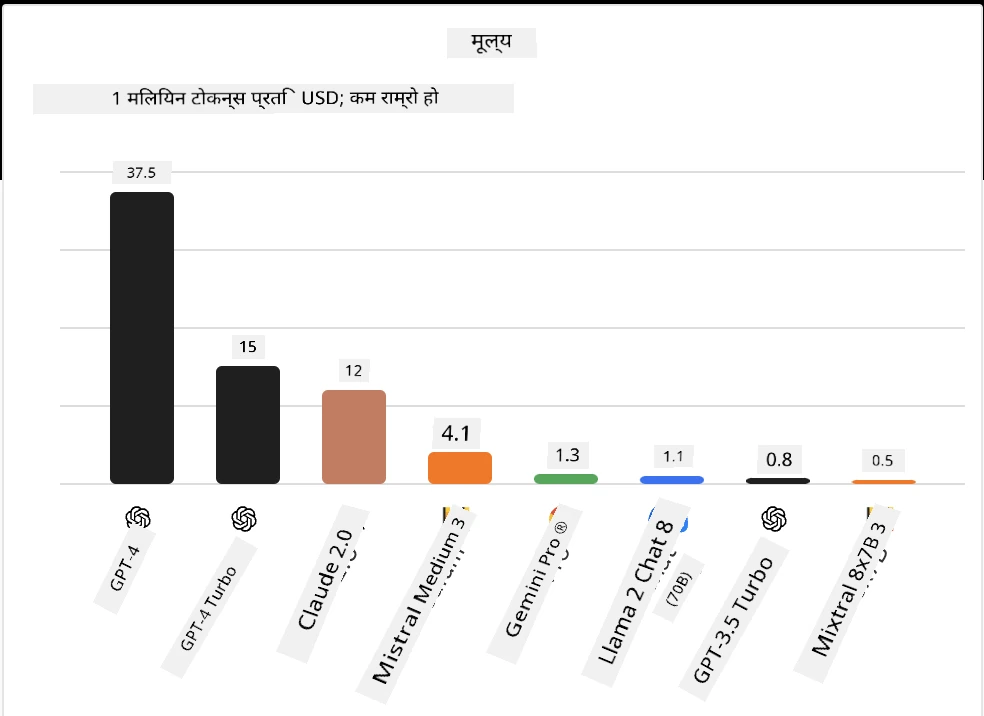
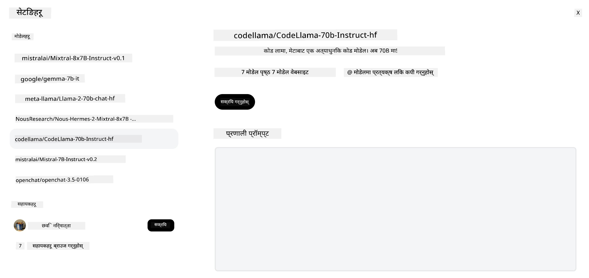
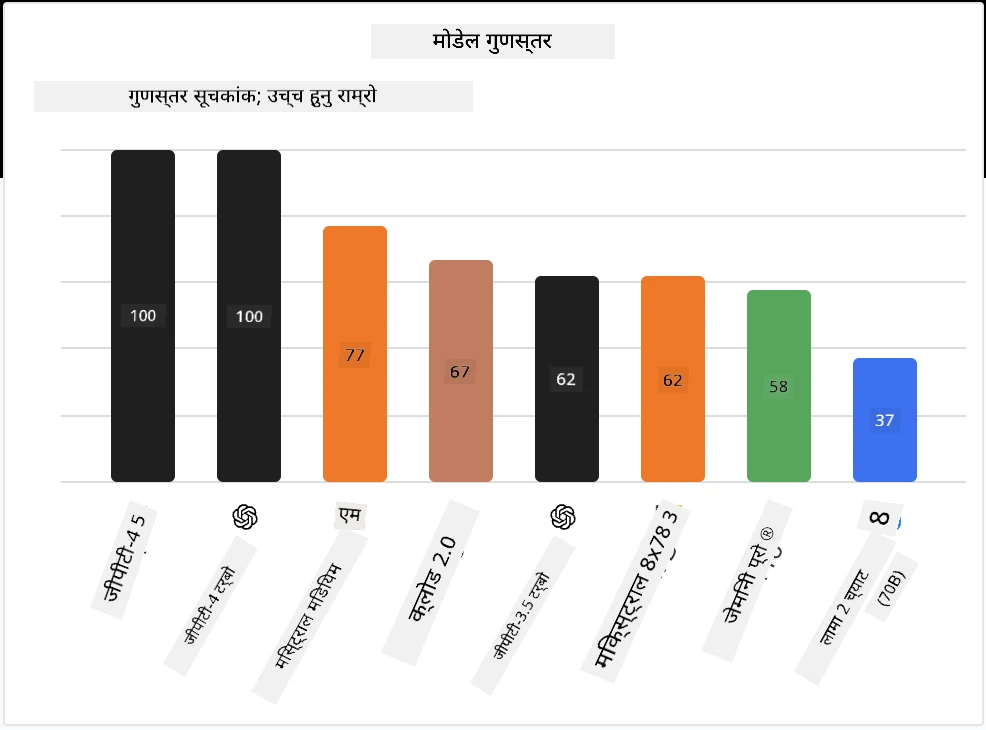

## परिचय

खुला स्रोत LLMs को संसार रोचक र निरन्तर विकसित हुँदैछ। यो पाठले खुला स्रोत मोडलहरूमा एक गहिरो दृष्टि प्रदान गर्ने लक्ष्य राख्दछ। यदि तपाईंलाई जानकारी चाहिएको छ कि कसरी व्यावसायिक मोडलहरू खुला स्रोत मोडलहरूसँग तुलना गर्छन् भने, ["विभिन्न LLMs को अन्वेषण र तुलना" पाठ](../02-exploring-and-comparing-different-llms/README.md?WT.mc_id=academic-105485-koreyst) जानुहोस्। यो पाठले fine-tuning को विषय पनि समेट्नेछ तर विस्तृत व्याख्या ["Fine-Tuning LLMs" पाठ](../18-fine-tuning/README.md?WT.mc_id=academic-105485-koreyst) मा फेला पार्न सकिन्छ।

## सिक्ने लक्ष्यहरू

- खुला स्रोत मोडलहरू बुझ्ने
- खुला स्रोत मोडलहरूसँग काम गर्दा पाइने फाइदाहरू बुझ्ने
- Hugging Face र Microsoft Foundry मोडल सूचीमा उपलब्ध खुला मोडलहरू अन्वेषण गर्ने

## खुला स्रोत मोडलहरू के हुन्?

खुला स्रोत सफ्टवेयरले विभिन्न क्षेत्रमा प्रविधिको विकासमा महत्वपूर्ण भूमिका खेलेको छ। Open Source Initiative (OSI) ले [सफ्टवेयरका लागि १० मापदण्डहरू](https://web.archive.org/web/20241126001143/https://opensource.org/osd?WT.mc_id=academic-105485-koreyst) परिभाषित गरेको छ ताकि सफ्टवेयरलाई खुला स्रोतको रुपमा वर्गीकृत गर्न सकियोस्। स्रोत कोड OSI द्वारा अनुमोदित लाइसेन्स अन्तर्गत खुला रूपमा साझा गर्नुपर्छ।

LLMs को विकास सफ्टवेयर विकाससँग केहि समान अंशहरू भए पनि प्रक्रिया बिल्कुल त्यस्तै छैन। यसले LLMs को सन्दर्भमा खुला स्रोतको परिभाषामा समुदायमा धेरै छलफल ल्याएको छ। एक मोडल परम्परागत खुला स्रोत परिभाषासँग मेल खाने हुनको लागि तलका जानकारीहरू सार्वजनिक हुनु आवश्यक छ:

- मोडल प्रशिक्षणका लागि प्रयोग भएका डेटासेटहरू।
- प्रशिक्षणको एक भागको रूपमा पूर्ण मोडल वेटहरू।
- मुल्यांकन कोड।
- fine-tuning कोड।
- पूर्ण मोडल वेटहरू र प्रशिक्षण मेट्रिक्सहरू।

हाल यी मापदण्डहरू पूरा गर्ने केही मोडलहरू मात्र छन्। [Allen Institute for Artificial Intelligence (AllenAI) ले बनाएको OLMo मोडल](https://huggingface.co/allenai/OLMo-7B?WT.mc_id=academic-105485-koreyst) यस्तो मोडल हो।

यस पाठका लागि, हामी मोडलहरूलाई "खुला मोडलहरू" भनेर उल्लेख गर्नेछौं किनकि तिनीहरू लेख्ने समयमा माथि उल्लिखित मापदण्डहरू अनुसार मेल नखान सक्छन्।

## खुला मोडलहरूको फाइदाहरू

**अत्यन्तै अनुकूलनीय** - खुला मोडलहरू विस्तृत प्रशिक्षण जानकारीका साथ रिलिज हुने भएकाले, अनुसन्धानकर्ता र विकासकर्ताले मोडलको भित्री भागहरू परिमार्जन गर्न सक्छन्। यसले विशेष कार्य वा अध्ययन क्षेत्रमा केन्द्रित सुक्ष्म मोडलहरूको निर्माण सम्भव बनाउँछ। उदाहरणहरूमा कोड निर्माण, गणितिय कार्यहरू र जीवविज्ञान समावेश छन्।

**लागत** - यी मोडलहरूको प्रयोग र वितरणमा प्रति टोकन लागत व्यावसायिक मोडलहरूको तुलनामा कम हुन्छ। Generative AI अनुप्रयोगहरू बनाउँदा, तपाईँको प्रयोग केसमा यी मोडलहरूसँग काम गर्दा प्रदर्शन र मूल्यको अनुपात हेर्नु आवश्यक छ।

स्रोत: Artificial Analysis

**लचिलोपन** - खुला मोडलहरूसँग काम गर्दा तपाईंलाई फरक मोडलहरू प्रयोग गर्न वा संयोजन गर्न लचिलोपन प्राप्त हुन्छ। यसको उदाहरण [HuggingChat सहायकहरू](https://huggingface.co/chat?WT.mc_id=academic-105485-koreyst) हो जहाँ प्रयोगकर्ताले इन्टरफेसबाटै मोडल चयन गर्न सक्छन्:

## विभिन्न खुला मोडलहरूको अन्वेषण

### Llama 2

[LLama2](https://huggingface.co/meta-llama?WT.mc_id=academic-105485-koreyst), मेटाले विकास गरेको, चैट आधारित अनुप्रयोगहरूका लागि अनुकूलित खुला मोडल हो। यसको fine-tuning विधिले धेरै संवाद र मानव प्रतिक्रियाहरू समावेश गरेको छ। यस विधिले मोडललाई मानव अपेक्षासँग मेल खाने नतिजाहरू उत्पादन गर्न सहयोग गर्दछ जुन प्रयोगकर्ताको अनुभव सुधार गर्दछ।

Llama का fine-tuned संस्करणहरूका उदाहरणहरूमा जापानी भाषामा विशेषज्ञता राख्ने [Japanese Llama](https://huggingface.co/elyza/ELYZA-japanese-Llama-2-7b?WT.mc_id=academic-105485-koreyst) र आधारभूत मोडलको अङ्गीकृत संस्करण [Llama Pro](https://huggingface.co/TencentARC/LLaMA-Pro-8B?WT.mc_id=academic-105485-koreyst) छन्।

### Mistral

[Mistral](https://huggingface.co/mistralai?WT.mc_id=academic-105485-koreyst) एक खुला मोडल हो जसले उच्च प्रदर्शन र दक्षतामा बल दिइरहेको छ। यसले विशेषज्ञहरूको समूहलाई संयोजन गर्ने Mixture-of-Experts दृष्टिकोण प्रयोग गर्दछ जहाँ इनपुटको आधारमा निश्चित मोडलहरू चयन गरेर प्रयोग गरिन्छ। यसले हिसाब-किताबलाई प्रभावकारी बनाउँछ किनकी मोडलहरूले मात्र उनीहरूको विशेषज्ञता भएको इनपुटहरूलाई सम्बोधन गर्छन्।

Mistral को fine-tuned संस्करणहरूको उदाहरणहरूमा चिकित्सा क्षेत्रमा केन्द्रित [BioMistral](https://huggingface.co/BioMistral/BioMistral-7B?text=Mon+nom+est+Thomas+et+mon+principal?WT.mc_id=academic-105485-koreyst) र गणितीय गणनामा काम गर्ने [OpenMath Mistral](https://huggingface.co/nvidia/OpenMath-Mistral-7B-v0.1-hf?WT.mc_id=academic-105485-koreyst) रहेका छन्।

### Falcon

[Falcon](https://huggingface.co/tiiuae?WT.mc_id=academic-105485-koreyst) टेक्नोलोजी इनोभेसन इन्स्टिच्युट (**TII**) द्वारा बनाइएको LLM हो। Falcon-40B ४० अरब प्यारामिटरहरूमा तालिम गरिएको छ जुन GPT-3 भन्दा कम कम्प्युटेशन बजेटमा राम्रो प्रदर्शन गर्छ भन्ने देखाइएको छ। FlashAttention एल्गोरिदम र मल्टिक्वेरी अटेंशनको प्रयोगले यसलाई इन्फेरेन्स समयमा मेमोरी आवश्यकताहरू कम गर्न सक्षम बनाउँछ। यस घटाइएको इन्फेरेन्स समयसहित Falcon-40B चैट अनुप्रयोगहरूको लागि उपयुक्त छ।

Falcon का fine-tuned संस्करणहरूको उदाहरणहरूमा खुला मोडलहरूको आधारमा बनाइएको सहायक [OpenAssistant](https://huggingface.co/OpenAssistant/falcon-40b-sft-top1-560?WT.mc_id=academic-105485-koreyst) र आधारभूत मोडलभन्दा बढी प्रदर्शन गर्ने [GPT4ALL](https://huggingface.co/nomic-ai/gpt4all-falcon?WT.mc_id=academic-105485-koreyst) छन्।

## कसरी छनोट गर्ने

एउटा खुला मोडल चयन गर्ने निश्चित उत्तर छैन। राम्रो सुरुवात Microsoft Foundry मोडल क्याटलगको कार्य द्वारा फिल्टर सेटिङ प्रयोग गरेर गर्न सकिन्छ। यसले मोडलले के कस्ता प्रकारका कार्यहरूका लागि तालिम प्राप्त गरेको छ बुझ्न मद्दत गर्छ। Hugging Face ले पनि LLM लिडरबोर्ड राखेको छ जुन निश्चित मेट्रिक्सको आधारमा सबैभन्दा राम्रो प्रदर्शन गर्ने मोडलहरू देखाउँछ।

विभिन्न प्रकारका LLMs को तुलना गर्दा, [Artificial Analysis](https://artificialanalysis.ai/?WT.mc_id=academic-105485-koreyst) अर्को राम्रो स्रोत हो:

स्रोत: Artificial Analysis

यदि कुनै विशेष प्रयोग केसमा काम गर्दै हुनुहुन्छ भने, सोही क्षेत्रमा केन्द्रित fine-tuned संस्करण खोज्न प्रभावकारी हुन्छ। तपाईं र तपाईंका प्रयोगकर्ताहरूको अपेक्षाअनुसार कसरी प्रदर्शन गर्छन् भनेर धेरै खुला मोडलहरूसँग परिक्षण गर्नु अर्को राम्रो अभ्यास हो।

## आगामी कदमहरू

खुला मोडलहरूसँग काम गर्न सुरु गर्नु धेरै छिटो गर्न सकिन्छ जुन सबैभन्दा राम्रो कुरा हो। [Microsoft Foundry मोडल सूची](https://ai.azure.com?WT.mc_id=academic-105485-koreyst) मा हेर्नुहोस् जसले यहाँ छलफल गरिएका मोडलहरूसँग सम्बन्धित Hugging Face संग्रह विशेषता दिन्छ।

## सिकाइ यहाँ समाप्त हुँदैन, यात्रा जारी राख्नुहोस्

यो पाठ पुरा गरेपछि, हाम्रो [Generative AI सिकाइ संग्रह](https://aka.ms/genai-collection?WT.mc_id=academic-105485-koreyst) मा जानुहोस् र आफ्नो Generative AI ज्ञान बढाउनुहोस्!

---

<!-- CO-OP TRANSLATOR DISCLAIMER START -->
**अस्वीकरण**:
यो दस्तावेज़ AI अनुवाद सेवा [Co-op Translator](https://github.com/Azure/co-op-translator) प्रयोग गरेर अनुवाद गरिएको हो। हामी सही हुन प्रयास गर्छौं, तर कृपया जानकार हुनुस् कि स्वचालित अनुवादमा त्रुटिहरू वा अशुद्धताहरू हुन सक्छन्। मूल दस्तावेज़ यसको मूल भाषामा आधिकारिक स्रोत मानिनुपर्छ। महत्वपूर्ण जानकारीका लागि व्यावसायिक मानव अनुवाद सिफारिस गरिन्छ। यस अनुवादको प्रयोगबाट उत्पन्न कुनै पनि गलत बुझाइ वा त्रुटिको लागि हामी जिम्मेवार छैनौं।
<!-- CO-OP TRANSLATOR DISCLAIMER END -->