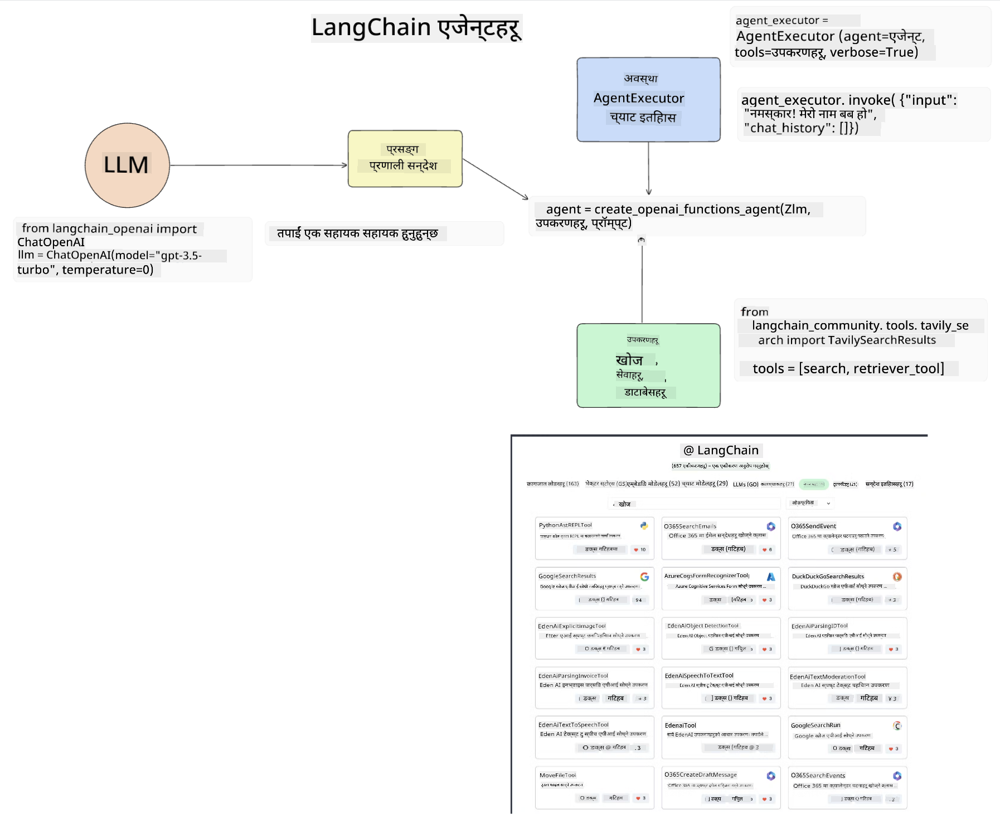
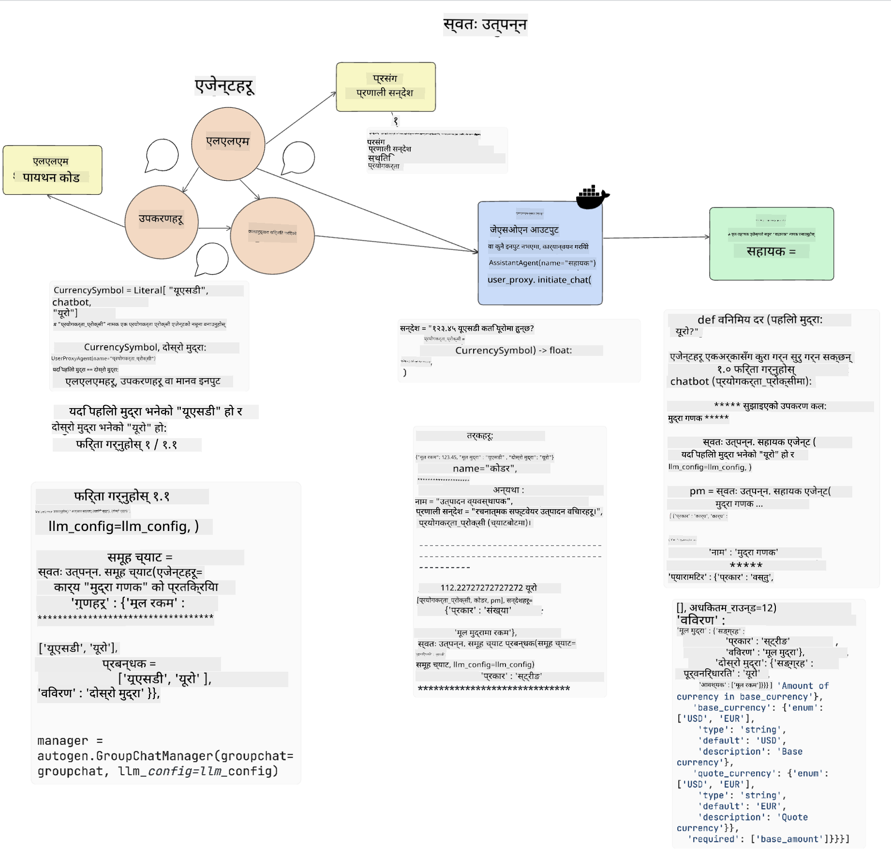
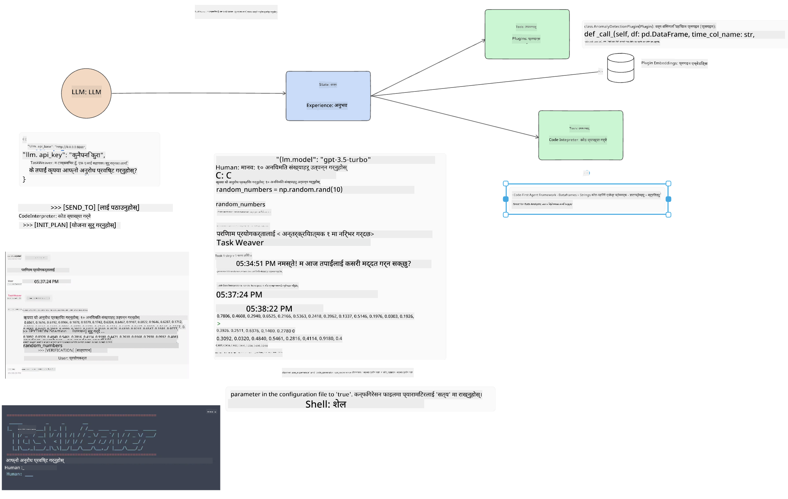
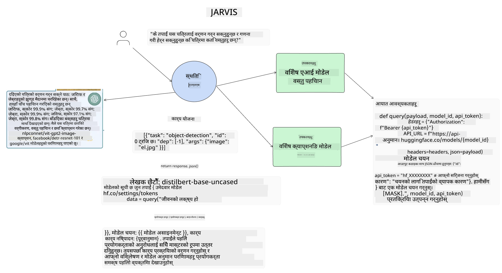

<!--
CO_OP_TRANSLATOR_METADATA:
{
  "original_hash": "11f03c81f190d9cbafd0f977dcbede6c",
  "translation_date": "2025-05-20T07:18:57+00:00",
  "source_file": "17-ai-agents/README.md",
  "language_code": "ne"
}
-->
[](https://aka.ms/gen-ai-lesson17-gh?WT.mc_id=academic-105485-koreyst)

## परिचय

AI एजेन्टहरू जेनेरेटिभ AI मा रोमाञ्चक विकासको प्रतिनिधित्व गर्छन्, जसले ठूलो भाषा मोडेलहरू (LLMs) लाई सहायकबाट कार्य गर्न सक्षम एजेन्टहरूमा विकास गर्न सक्षम बनाउँछ। AI एजेन्ट फ्रेमवर्कहरूले विकासकर्ताहरूलाई LLMs लाई उपकरण र राज्य व्यवस्थापनको पहुँच दिने अनुप्रयोगहरू बनाउन सक्षम बनाउँछन्। यी फ्रेमवर्कहरूले दृश्यता पनि बढाउँछन्, जसले प्रयोगकर्ताहरू र विकासकर्ताहरूलाई LLMs द्वारा योजना बनाइएका कार्यहरू अनुगमन गर्न अनुमति दिन्छ, जसले अनुभव व्यवस्थापन सुधार गर्दछ।

यो पाठले निम्न क्षेत्रहरू समेट्नेछ:

- AI एजेन्ट के हो भन्ने बुझ्ने - वास्तवमा AI एजेन्ट के हो?
- चार फरक AI एजेन्ट फ्रेमवर्कहरूको अन्वेषण गर्ने - के चीजहरूले तिनीहरूलाई अद्वितीय बनाउँछ?
- यी AI एजेन्टहरूलाई विभिन्न प्रयोग केसहरूमा लागू गर्ने - हामीले कहिले AI एजेन्टहरू प्रयोग गर्नुपर्छ?

## सिकाइका लक्ष्यहरू

यो पाठ लिएपछि, तपाईं सक्षम हुनुहुनेछ:

- AI एजेन्टहरू के हुन् र तिनीहरूलाई कसरी प्रयोग गर्न सकिन्छ भनेर व्याख्या गर्नुहोस्।
- केही लोकप्रिय AI एजेन्ट फ्रेमवर्कहरू बीचको भिन्नता बुझ्नुहोस्, र तिनीहरू कसरी फरक छन्।
- AI एजेन्टहरू कसरी काम गर्छन् बुझ्नुहोस् ताकि तिनीहरूलाई प्रयोग गरेर अनुप्रयोगहरू निर्माण गर्न सक्नुहोस्।

## AI एजेन्टहरू के हुन्?

AI एजेन्टहरू जेनेरेटिभ AI को दुनियाँमा एकदम रोमाञ्चक क्षेत्र हो। यो उत्साहसँग कहिलेकाहीं शब्दहरूको भ्रम र तिनीहरूको प्रयोग पनि आउँछ। चीजहरू सरल र AI एजेन्टहरूलाई सन्दर्भ गर्ने धेरै उपकरणहरू समावेश गर्नका लागि, हामी यो परिभाषा प्रयोग गर्नेछौं:

AI एजेन्टहरूले ठूलो भाषा मोडेलहरू (LLMs) लाई **राज्य** र **उपकरणहरू** को पहुँच दिएर कार्यहरू प्रदर्शन गर्न अनुमति दिन्छ।


यी शब्दहरूको परिभाषा गरौं:

**ठूलो भाषा मोडेलहरू** - यी यस कोर्समा सन्दर्भ गरिएका मोडेलहरू हुन् जस्तै GPT-3.5, GPT-4, Llama-2, आदि।

**राज्य** - यसले LLM काम गरिरहेको सन्दर्भलाई जनाउँछ। LLM ले यसको विगतका कार्यहरूको सन्दर्भ र वर्तमान सन्दर्भ प्रयोग गर्दछ, यसको पछिल्ला कार्यहरूको निर्णय लिनको लागि मार्गदर्शन गर्दछ। AI एजेन्ट फ्रेमवर्कहरूले विकासकर्ताहरूलाई यो सन्दर्भ सजिलैसँग कायम राख्न अनुमति दिन्छ।

**उपकरणहरू** - प्रयोगकर्ताले अनुरोध गरेको कार्य पूरा गर्न र LLM ले योजना बनाएको कार्य पूरा गर्न, LLM लाई उपकरणहरूको पहुँच चाहिन्छ। उपकरणहरूको केही उदाहरणहरू डाटाबेस, API, बाह्य अनुप्रयोग वा अरू LLM पनि हुन सक्छन्!

यी परिभाषाहरूले तपाईंलाई अगाडि बढ्नका लागि राम्रो आधार दिने आशा गर्दछौं, जब हामी हेर्छौं कि तिनीहरू कसरी कार्यान्वयन गरिएका छन्। अब केही फरक AI एजेन्ट फ्रेमवर्कहरूको अन्वेषण गरौं:

## LangChain एजेन्टहरू

[LangChain एजेन्टहरू](https://python.langchain.com/docs/how_to/#agents?WT.mc_id=academic-105485-koreyst) माथि दिइएको परिभाषाहरूको कार्यान्वयन हो।

**राज्य** व्यवस्थापन गर्न, यसले `AgentExecutor` नामक एक बिल्ट-इन फंक्शन प्रयोग गर्दछ। यसले परिभाषित `agent` र यसलाई उपलब्ध गराइएका `tools` स्वीकार गर्दछ।

`Agent Executor` ले च्याटको इतिहास पनि भण्डारण गर्छ ताकि च्याटको सन्दर्भ प्रदान गर्न सकिन्छ।



LangChain ले एक [उपकरणहरूको सूची](https://integrations.langchain.com/tools?WT.mc_id=academic-105485-koreyst) प्रस्ताव गर्दछ जुन तपाईंको अनुप्रयोगमा आयात गर्न सकिन्छ जहाँ LLM ले पहुँच पाउन सक्छ। यी समुदाय र LangChain टोली द्वारा बनाइएका हुन्।

तपाईं त्यसपछि यी उपकरणहरू परिभाषित गर्न सक्नुहुन्छ र तिनीहरूलाई `Agent Executor` मा पास गर्न सक्नुहुन्छ।

दृश्यता अर्को महत्त्वपूर्ण पक्ष हो जब AI एजेन्टहरूको कुरा गरिन्छ। अनुप्रयोग विकासकर्ताहरूलाई LLM कुन उपकरण प्रयोग गर्दैछ र किन बुझ्न महत्त्वपूर्ण छ। त्यसका लागि, LangChain को टोलीले LangSmith विकास गरेको छ।

## AutoGen

हामीले छलफल गर्ने अर्को AI एजेन्ट फ्रेमवर्क [AutoGen](https://microsoft.github.io/autogen/?WT.mc_id=academic-105485-koreyst) हो। AutoGen को मुख्य फोकस संवादहरू हो। एजेन्टहरू दुबै **संवादात्मक** र **अनुकूलन योग्य** छन्।

**संवादात्मक -** LLM ले अर्को LLM संग वार्तालाप सुरु गर्न र जारी राख्न सक्छ ताकि कार्य पूरा गर्न सकियोस्। यो `AssistantAgents` सिर्जना गरेर र तिनीहरूलाई विशेष प्रणाली सन्देश दिने गरी गरिन्छ।

```python

autogen.AssistantAgent( name="Coder", llm_config=llm_config, ) pm = autogen.AssistantAgent( name="Product_manager", system_message="Creative in software product ideas.", llm_config=llm_config, )

```

**अनुकूलन योग्य** - एजेन्टहरूलाई केवल LLM मात्र होइन, प्रयोगकर्ता वा उपकरणको रूपमा पनि परिभाषित गर्न सकिन्छ। एक विकासकर्ताको रूपमा, तपाईं `UserProxyAgent` परिभाषित गर्न सक्नुहुन्छ जसले कार्य पूरा गर्न प्रतिक्रिया प्राप्त गर्न प्रयोगकर्तासँग अन्तरक्रिया गर्ने जिम्मेवारी लिन्छ। यो प्रतिक्रिया कार्यको कार्यान्वयन जारी राख्न वा रोक्नको लागि प्रयोग गर्न सकिन्छ।

```python
user_proxy = UserProxyAgent(name="user_proxy")
```

### राज्य र उपकरणहरू

राज्य परिवर्तन र व्यवस्थापन गर्न, सहायक एजेन्टले कार्य पूरा गर्न पायथन कोड उत्पन्न गर्दछ।

प्रक्रियाको उदाहरण यहाँ छ:



#### प्रणाली सन्देशसहित LLM परिभाषित गरिएको

```python
system_message="For weather related tasks, only use the functions you have been provided with. Reply TERMINATE when the task is done."
```

यो प्रणाली सन्देशले यो विशेष LLM लाई यसको कार्यका लागि कुन कार्यहरू प्रासंगिक छन् भनेर निर्देश गर्दछ। सम्झनुहोस्, AutoGen संग तपाईंले विभिन्न प्रणाली सन्देशसहित विभिन्न AssistantAgents परिभाषित गर्न सक्नुहुन्छ।

#### प्रयोगकर्ताद्वारा च्याट सुरु गरिएको

```python
user_proxy.initiate_chat( chatbot, message="I am planning a trip to NYC next week, can you help me pick out what to wear? ", )

```

यो प्रयोगकर्ता_प्रोक्सी (मानव) बाट आएको सन्देशले एजेन्टलाई उसले कार्यान्वयन गर्नुपर्ने सम्भावित कार्यहरूको अन्वेषण गर्न प्रक्रिया सुरु गर्नेछ।

#### कार्यान्वयन गरियो

```bash
chatbot (to user_proxy):

***** Suggested tool Call: get_weather ***** Arguments: {"location":"New York City, NY","time_periond:"7","temperature_unit":"Celsius"} ******************************************************** --------------------------------------------------------------------------------

>>>>>>>> EXECUTING FUNCTION get_weather... user_proxy (to chatbot): ***** Response from calling function "get_weather" ***** 112.22727272727272 EUR ****************************************************************

```

एक पटक प्रारम्भिक च्याट प्रशोधन भएपछि, एजेन्टले कल गर्न सुझाव गरिएको उपकरण पठाउँछ। यस अवस्थामा, यो `get_weather`. Depending on your configuration, this function can be automatically executed and read by the Agent or can be executed based on user input.

You can find a list of [AutoGen code samples](https://microsoft.github.io/autogen/docs/Examples/?WT.mc_id=academic-105485-koreyst) to further explore how to get started building.

## Taskweaver

The next agent framework we will explore is [Taskweaver](https://microsoft.github.io/TaskWeaver/?WT.mc_id=academic-105485-koreyst). It is known as a "code-first" agent because instead of working strictly with `strings` , it can work with DataFrames in Python. This becomes extremely useful for data analysis and generation tasks. This can be things like creating graphs and charts or generating random numbers.

### State and Tools

To manage the state of the conversation, TaskWeaver uses the concept of a `Planner`. The `Planner` is a LLM that takes the request from the users and maps out the tasks that need to be completed to fulfill this request.

To complete the tasks the `Planner` is exposed to the collection of tools called `Plugins` नामक कार्य हो। यी पायथन कक्षाहरू वा सामान्य कोड व्याख्याता हुन सक्छन्। यी प्लगइनहरू एम्बेडिङको रूपमा भण्डारण गरिन्छ ताकि LLM ले सही प्लगइनको खोजी राम्रोसँग गर्न सकियोस्।



यहाँ एक प्लगइनको उदाहरण छ जुन विसंगति पत्ता लगाउनको लागि प्रयोग हुन्छ:

```python
class AnomalyDetectionPlugin(Plugin): def __call__(self, df: pd.DataFrame, time_col_name: str, value_col_name: str):
```

कोड कार्यान्वयन गर्नु अघि प्रमाणित गरिन्छ। Taskweaver मा सन्दर्भ व्यवस्थापन गर्न अर्को सुविधा `अनुभव`. Experience allows for the context of a conversation to be stored over to the long term in a YAML file. This can be configured so that the LLM improves over time on certain tasks given that it is exposed to prior conversations.

## JARVIS

The last agent framework we will explore is [JARVIS](https://github.com/microsoft/JARVIS?tab=readme-ov-file?WT.mc_id=academic-105485-koreyst). What makes JARVIS unique is that it uses an LLM to manage the `state` र `tools` अन्य AI मोडेलहरू हुन्। प्रत्येक AI मोडेल विशेष मोडेलहरू हुन् जसले वस्तु पत्ता लगाउने, प्रतिलिपि बनाउने वा छवि क्याप्शनिङ जस्ता विशेष कार्यहरू प्रदर्शन गर्छन्।



LLM, सामान्य उद्देश्य मोडेल भएकोले, प्रयोगकर्ताबाट अनुरोध प्राप्त गर्दछ र विशेष कार्य र कार्य पूरा गर्न आवश्यक कुनै पनि तर्क/डेटा पहिचान गर्दछ।

```python
[{"task": "object-detection", "id": 0, "dep": [-1], "args": {"image": "e1.jpg" }}]
```

LLM त्यसपछि अनुरोधलाई विशेष AI मोडेलले व्याख्या गर्न सक्ने तरिकामा ढाँचा बनाउँछ, जस्तै JSON। एक पटक AI मोडेलले कार्यको आधारमा यसको भविष्यवाणी फिर्ता गरेको छ, LLM ले प्रतिक्रिया प्राप्त गर्दछ।

यदि कार्य पूरा गर्न धेरै मोडेलहरू आवश्यक छ भने, यसले प्रयोगकर्तालाई प्रतिक्रिया उत्पन्न गर्न अघि ती मोडेलहरूको प्रतिक्रियालाई पनि व्याख्या गर्नेछ।

तलको उदाहरणले देखाउँछ कि जब एक प्रयोगकर्ताले तस्वीरमा वस्तुहरूको वर्णन र गणना अनुरोध गर्दा यो कसरी काम गर्नेछ:

## असाइनमेन्ट

AI एजेन्टहरूको तपाईंको सिकाइ जारी राख्न तपाईं AutoGen संग निर्माण गर्न सक्नुहुन्छ:

- शिक्षा स्टार्टअपको विभिन्न विभागहरूसँग व्यापार बैठकको नक्कल गर्ने अनुप्रयोग।
- विभिन्न व्यक्ति र प्राथमिकताहरू बुझ्न LLMs लाई मार्गदर्शन गर्ने प्रणाली सन्देशहरू सिर्जना गर्नुहोस्, र प्रयोगकर्तालाई नयाँ उत्पादन विचार प्रस्तुत गर्न सक्षम बनाउनुहोस्।
- LLM ले त्यसपछि प्रत्येक विभागबाट पछ्याउने प्रश्नहरू उत्पन्न गर्नुपर्छ ताकि प्रस्तुति र उत्पादन विचारलाई परिष्कृत र सुधार गर्न सकियोस्।

## सिकाइ यहाँ रोकिँदैन, यात्रा जारी राख्नुहोस्

यो पाठ पूरा गरेपछि, हाम्रो [जेनेरेटिभ AI सिकाइ संग्रह](https://aka.ms/genai-collection?WT.mc_id=academic-105485-koreyst) जाँच गर्नुहोस् ताकि तपाईंको जेनेरेटिभ AI ज्ञानलाई स्तरवृद्धि गर्न जारी राख्न सक्नुहुन्छ!

**अस्वीकरण**:  
यो दस्तावेज़ AI अनुवाद सेवा [Co-op Translator](https://github.com/Azure/co-op-translator) प्रयोग गरेर अनुवाद गरिएको छ। हामी सटीकताको लागि प्रयास गरिरहेका छौं, कृपया सचेत रहनुहोस् कि स्वचालित अनुवादहरूमा त्रुटिहरू वा अशुद्धताहरू हुन सक्छन्। यसको मातृभाषामा रहेको मूल दस्तावेजलाई आधिकारिक स्रोत मानिनुपर्छ। महत्वपूर्ण जानकारीको लागि, व्यावसायिक मानव अनुवाद सिफारिस गरिन्छ। यस अनुवादको प्रयोगबाट उत्पन्न कुनै पनि गलतफहमी वा गलत व्याख्याको लागि हामी जिम्मेवार छैनौं।