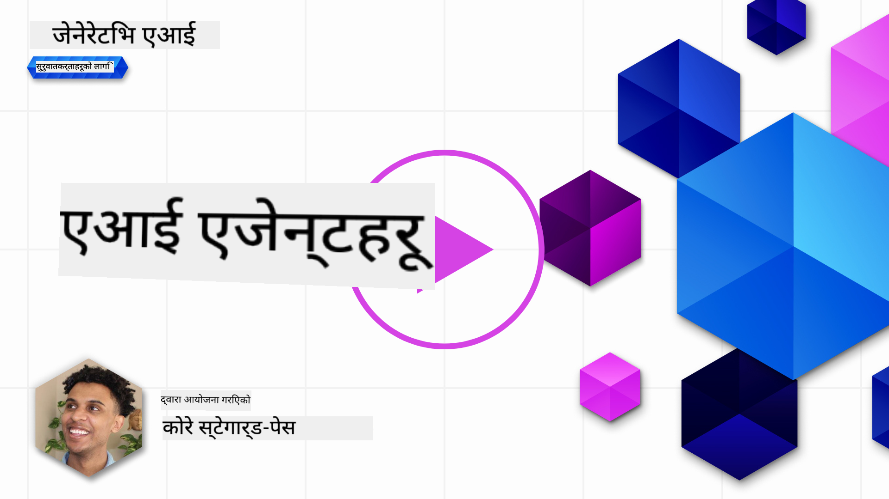
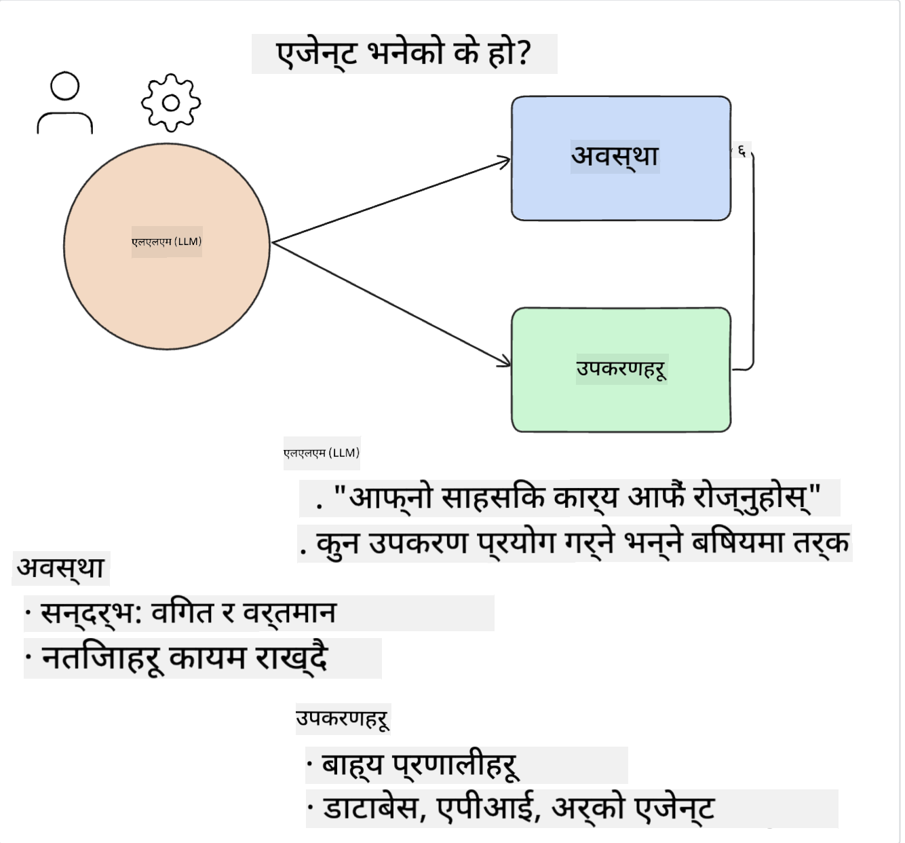
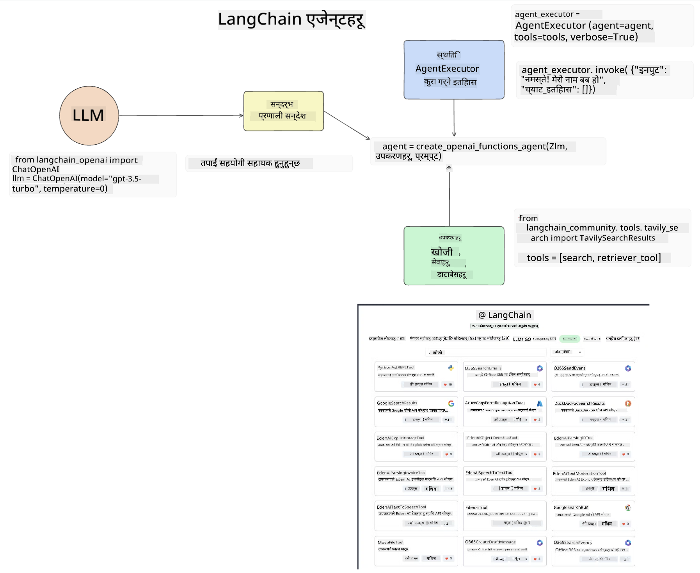
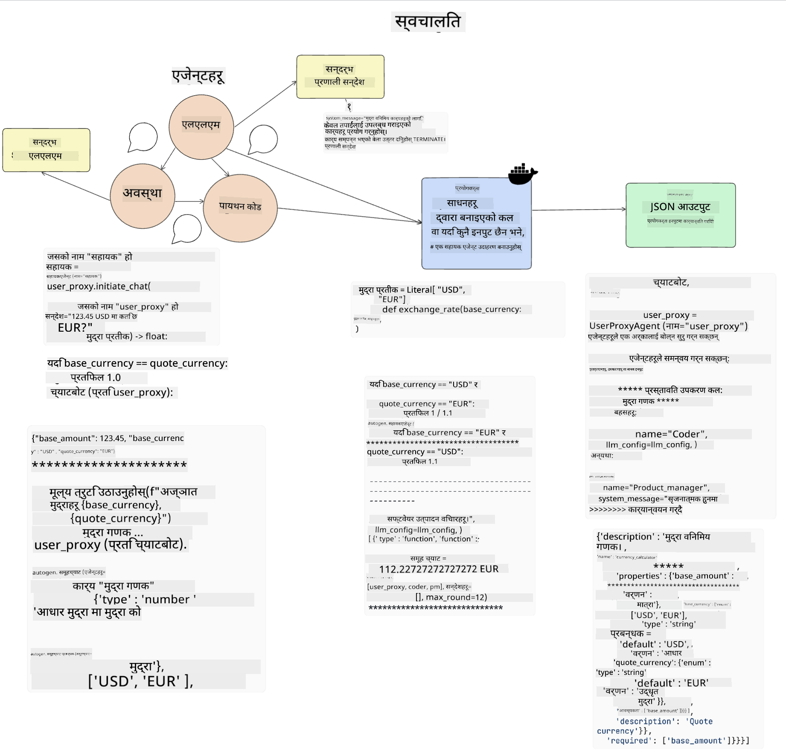
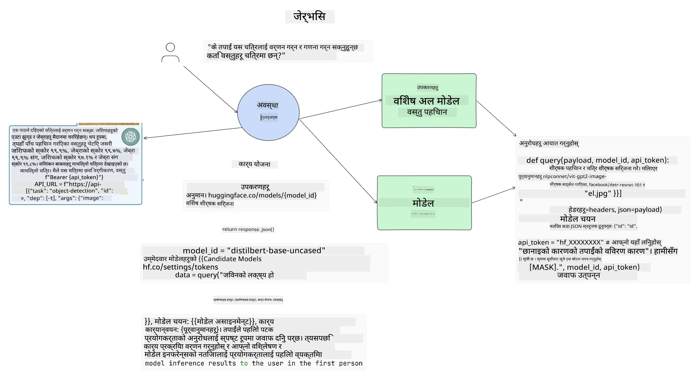

<!--
CO_OP_TRANSLATOR_METADATA:
{
  "original_hash": "11f03c81f190d9cbafd0f977dcbede6c",
  "translation_date": "2025-06-26T00:14:27+00:00",
  "source_file": "17-ai-agents/README.md",
  "language_code": "ne"
}
-->
[](https://aka.ms/gen-ai-lesson17-gh?WT.mc_id=academic-105485-koreyst)

## परिचय

एआई एजेन्टहरू जनरेटिभ एआईमा रोमाञ्चक विकासको प्रतिनिधित्व गर्छन्, जसले ठूलो भाषा मोडेलहरू (एलएलएमहरू) लाई सहायकहरूबाट कार्यहरू लिन सक्षम एजेन्टहरूमा रूपान्तरण गर्न सक्षम बनाउँछ। एआई एजेन्ट फ्रेमवर्कहरूले विकासकर्ताहरूलाई अनुप्रयोगहरू सिर्जना गर्न सक्षम बनाउँछ जसले एलएलएमहरूलाई उपकरणहरू र राज्य व्यवस्थापनमा पहुँच दिन्छ। यी फ्रेमवर्कहरूले दृश्यतालाई पनि बढाउँछन्, जसले प्रयोगकर्ताहरू र विकासकर्ताहरूलाई एलएलएमहरूद्वारा योजना बनाइएका कार्यहरू अनुगमन गर्न अनुमति दिन्छ, जसले अनुभव व्यवस्थापन सुधार गर्दछ।

पाठले निम्न क्षेत्रहरू समेट्नेछ:

- एआई एजेन्ट के हो भन्ने बुझ्नुहोस् - एआई एजेन्ट वास्तवमा के हो?
- चार विभिन्न एआई एजेन्ट फ्रेमवर्कहरूको अन्वेषण गर्नुहोस् - केले तिनीहरूलाई अद्वितीय बनाउँछ?
- यी एआई एजेन्टहरूलाई विभिन्न प्रयोग केसहरूमा लागू गर्नुहोस् - हामीले कहिले एआई एजेन्टहरू प्रयोग गर्नुपर्छ?

## सिकाइ लक्ष्यहरू

यस पाठ लिएपछि, तपाईं सक्षम हुनुहुनेछ:

- एआई एजेन्टहरू के हुन् र तिनीहरूलाई कसरी प्रयोग गर्न सकिन्छ भनेर वर्णन गर्नुहोस्।
- केहि लोकप्रिय एआई एजेन्ट फ्रेमवर्कहरू बीचको भिन्नता बुझ्नुहोस्, र तिनीहरू कसरी फरक छन्।
- एआई एजेन्टहरू कसरी कार्य गर्दछ भन्ने बुझ्न अनुप्रयोगहरू निर्माण गर्न सक्षम हुनुहोस्।

## एआई एजेन्टहरू के हुन्?

एआई एजेन्टहरू जनरेटिभ एआईको संसारमा धेरै रोमाञ्चक क्षेत्र हो। यस उत्साहसँग कहिलेकाहीं शब्दहरूको भ्रम र तिनीहरूको अनुप्रयोग आउँछ। अधिकांश उपकरणहरूलाई समावेश गर्न र सरल राख्नका लागि जसले एआई एजेन्टहरूलाई जनाउँछ, हामी यो परिभाषा प्रयोग गर्न गइरहेका छौं:

एआई एजेन्टहरूले ठूलो भाषा मोडेलहरू (एलएलएमहरू) लाई **राज्य** र **उपकरणहरू** मा पहुँच दिएर कार्यहरू प्रदर्शन गर्न अनुमति दिन्छ।



यी शब्दहरू परिभाषित गरौं:

**ठूलो भाषा मोडेलहरू** - यी यस पाठक्रममा सन्दर्भित मोडेलहरू हुन् जस्तै GPT-3.5, GPT-4, Llama-2, आदि।

**राज्य** - यसले सन्दर्भलाई जनाउँछ जुन एलएलएम काम गरिरहेको छ। एलएलएमले यसको विगतका कार्यहरूको सन्दर्भ र वर्तमान सन्दर्भ प्रयोग गर्दछ, जसले यसको निर्णय-निर्माणलाई पछिल्ला कार्यहरूको लागि मार्गदर्शन गर्दछ। एआई एजेन्ट फ्रेमवर्कहरूले विकासकर्ताहरूलाई यो सन्दर्भ सजिलैसँग कायम राख्न अनुमति दिन्छ।

**उपकरणहरू** - प्रयोगकर्ताले अनुरोध गरेको कार्य पूरा गर्न र एलएलएमले योजना बनाएको कार्य पूरा गर्न, एलएलएमलाई उपकरणहरूमा पहुँच चाहिन्छ। उपकरणहरूको केहि उदाहरणहरू डेटाबेस, एपीआई, बाह्य अनुप्रयोग वा अर्को एलएलएम पनि हुन सक्छ!

यी परिभाषाहरूले तपाईंलाई तिनीहरू कसरी कार्यान्वयन गरिन्छन् भनेर हेर्दा अगाडि बढ्न राम्रो आधार दिनेछ। केही फरक एआई एजेन्ट फ्रेमवर्कहरूको अन्वेषण गरौं:

## LangChain Agents

[LangChain Agents](https://python.langchain.com/docs/how_to/#agents?WT.mc_id=academic-105485-koreyst) हाम्रो माथि प्रदान गरिएको परिभाषाको कार्यान्वयन हो।

**राज्य** व्यवस्थापन गर्न, यसले `AgentExecutor` नामक बिल्ट-इन कार्यलाई प्रयोग गर्दछ। यसले परिभाषित `agent` र उपलब्ध `tools` स्वीकार्छ।

`Agent Executor` ले च्याटको सन्दर्भ प्रदान गर्न च्याट इतिहासलाई पनि भण्डारण गर्दछ।



LangChain ले [उपकरणहरूको सूची](https://integrations.langchain.com/tools?WT.mc_id=academic-105485-koreyst) प्रस्ताव गर्दछ जसलाई तपाईंको अनुप्रयोगमा आयात गर्न सकिन्छ जसमा एलएलएमले पहुँच प्राप्त गर्न सक्छ। यी समुदाय र LangChain टोली द्वारा बनाइएका हुन्।

तपाईंले यी उपकरणहरूलाई परिभाषित गर्न र तिनीहरूलाई `Agent Executor` मा पास गर्न सक्नुहुन्छ।

दृश्यता एआई एजेन्टहरूको कुरा गर्दा अर्को महत्त्वपूर्ण पक्ष हो। अनुप्रयोग विकासकर्ताहरूलाई कुन उपकरण एलएलएम प्रयोग गरिरहेको छ र किन बुझ्न महत्त्वपूर्ण छ। त्यसका लागि, LangChain को टोलीले LangSmith विकास गरेको छ।

## AutoGen

हामीले छलफल गर्ने अर्को एआई एजेन्ट फ्रेमवर्क [AutoGen](https://microsoft.github.io/autogen/?WT.mc_id=academic-105485-koreyst) हो। AutoGen को मुख्य फोकस वार्तालापहरूमा छ। एजेन्टहरू दुवै **वार्तालापयोग्य** र **अनुकूलनयोग्य** छन्।

**वार्तालापयोग्य -** एलएलएमहरूले अर्को एलएलएमसँग वार्तालाप सुरु र जारी राख्न सक्छन् कार्य पूरा गर्न। यो `AssistantAgents` सिर्जना गरेर र तिनीहरूलाई विशिष्ट प्रणाली सन्देश दिने द्वारा गरिन्छ।

```python

autogen.AssistantAgent( name="Coder", llm_config=llm_config, ) pm = autogen.AssistantAgent( name="Product_manager", system_message="Creative in software product ideas.", llm_config=llm_config, )

```

**अनुकूलनयोग्य** - एजेन्टहरू एलएलएमहरू मात्र नभई प्रयोगकर्ता वा उपकरणको रूपमा पनि परिभाषित गर्न सकिन्छ। एक विकासकर्ताको रूपमा, तपाईंले `UserProxyAgent` परिभाषित गर्न सक्नुहुन्छ जुन कार्य पूरा गर्न प्रतिक्रिया लागि प्रयोगकर्तासँग अन्तरक्रिया गर्न जिम्मेवार छ। यो प्रतिक्रिया कार्यको कार्यान्वयन जारी राख्न वा रोक्न सकिन्छ।

```python
user_proxy = UserProxyAgent(name="user_proxy")
```

### राज्य र उपकरणहरू

राज्य परिवर्तन र व्यवस्थापन गर्न, सहायक एजेन्टले कार्य पूरा गर्न पायथन कोड उत्पन्न गर्दछ।

यहाँ प्रक्रियाको एक उदाहरण छ:



#### प्रणाली सन्देशसँग परिभाषित एलएलएम

```python
system_message="For weather related tasks, only use the functions you have been provided with. Reply TERMINATE when the task is done."
```

यस प्रणाली सन्देशले यस विशेष एलएलएमलाई यसको कार्यका लागि सान्दर्भिक कार्यहरूमा निर्देशन दिन्छ। सम्झनुहोस्, AutoGen संग तपाईंले विभिन्न प्रणाली सन्देशहरू भएका धेरै परिभाषित सहायक एजेन्टहरू हुन सक्नुहुन्छ।

#### प्रयोगकर्ताद्वारा च्याट सुरु गरियो

```python
user_proxy.initiate_chat( chatbot, message="I am planning a trip to NYC next week, can you help me pick out what to wear? ", )

```

यो प्रयोगकर्ता_प्रोक्सी (मानव) बाटको सन्देशले एजेन्टलाई यो कार्यान्वयन गर्नुपर्ने सम्भावित कार्यहरू अन्वेषण गर्न प्रक्रियाको सुरुवात गर्नेछ।

#### कार्यान्वयन गरियो

```bash
chatbot (to user_proxy):

***** Suggested tool Call: get_weather ***** Arguments: {"location":"New York City, NY","time_periond:"7","temperature_unit":"Celsius"} ******************************************************** --------------------------------------------------------------------------------

>>>>>>>> EXECUTING FUNCTION get_weather... user_proxy (to chatbot): ***** Response from calling function "get_weather" ***** 112.22727272727272 EUR ****************************************************************

```

एक पटक प्रारम्भिक च्याट प्रशोधन भएपछि, एजेन्टले कल गर्नको लागि सुझाव गरिएको उपकरण पठाउँछ। यस अवस्थामा, यो `get_weather`. Depending on your configuration, this function can be automatically executed and read by the Agent or can be executed based on user input.

You can find a list of [AutoGen code samples](https://microsoft.github.io/autogen/docs/Examples/?WT.mc_id=academic-105485-koreyst) to further explore how to get started building.

## Taskweaver

The next agent framework we will explore is [Taskweaver](https://microsoft.github.io/TaskWeaver/?WT.mc_id=academic-105485-koreyst). It is known as a "code-first" agent because instead of working strictly with `strings` , it can work with DataFrames in Python. This becomes extremely useful for data analysis and generation tasks. This can be things like creating graphs and charts or generating random numbers.

### State and Tools

To manage the state of the conversation, TaskWeaver uses the concept of a `Planner`. The `Planner` is a LLM that takes the request from the users and maps out the tasks that need to be completed to fulfill this request.

To complete the tasks the `Planner` is exposed to the collection of tools called `Plugins` नामक कार्य हो। यी पायथन कक्षाहरू वा सामान्य कोड इन्टरप्रेटर हुन सक्छ। यी प्लगइनहरूलाई एम्बेडिङको रूपमा भण्डारण गरिन्छ ताकि एलएलएमले सही प्लगइनको लागि राम्रोसँग खोजी गर्न सक्छ।


यहाँ अनियमितता पत्ता लगाउने व्यवस्थापन गर्नको लागि प्लगइनको एक उदाहरण छ:

```python
class AnomalyDetectionPlugin(Plugin): def __call__(self, df: pd.DataFrame, time_col_name: str, value_col_name: str):
```

कोड कार्यान्वयन गर्नु अघि प्रमाणित गरिन्छ। Taskweaver मा सन्दर्भ व्यवस्थापन गर्न अर्को सुविधा `experience`. Experience allows for the context of a conversation to be stored over to the long term in a YAML file. This can be configured so that the LLM improves over time on certain tasks given that it is exposed to prior conversations.

## JARVIS

The last agent framework we will explore is [JARVIS](https://github.com/microsoft/JARVIS?tab=readme-ov-file?WT.mc_id=academic-105485-koreyst). What makes JARVIS unique is that it uses an LLM to manage the `state` को वार्तालाप र `tools` अन्य एआई मोडेलहरू हुन्। प्रत्येक एआई मोडेलहरू विशेष मोडेलहरू हुन् जुन वस्तु पत्ता लगाउने, ट्रान्सक्रिप्शन वा छवि क्याप्शनिङ जस्ता निश्चित कार्यहरू प्रदर्शन गर्दछ।



एलएलएम, सामान्य उद्देश्य मोडेल भएकाले, प्रयोगकर्ताबाट अनुरोध प्राप्त गर्दछ र विशेष कार्य र कार्य पूरा गर्न आवश्यक कुनै पनि तर्क/डाटालाई पहिचान गर्दछ।

```python
[{"task": "object-detection", "id": 0, "dep": [-1], "args": {"image": "e1.jpg" }}]
```

एलएलएमले त्यसपछि अनुरोधलाई विशेष एआई मोडेलले व्याख्या गर्न सक्ने ढाँचामा स्वरूपित गर्दछ, जस्तै JSON। एक पटक एआई मोडेलले कार्यको आधारमा आफ्नो भविष्यवाणी फर्काएपछि, एलएलएमले प्रतिक्रिया प्राप्त गर्दछ।

यदि कार्य पूरा गर्न धेरै मोडेलहरू आवश्यक छन् भने, यसले ती मोडेलहरूबाट प्रतिक्रिया व्याख्या गर्नेछ र तिनीहरूलाई प्रयोगकर्तालाई प्रतिक्रिया उत्पन्न गर्न अघि ल्याउनेछ।

तलको उदाहरणले प्रयोगकर्ताले चित्रमा वस्तुहरूको विवरण र गणना अनुरोध गर्दा यो कसरी काम गर्नेछ भनेर देखाउँछ:

## असाइनमेन्ट

एआई एजेन्टहरूको तपाईंको सिकाइलाई जारी राख्न तपाईं AutoGen संग निर्माण गर्न सक्नुहुन्छ:

- एउटा अनुप्रयोग जसले शिक्षा स्टार्टअपको विभिन्न विभागहरूसँग व्यापार बैठकलाई अनुकरण गर्दछ।
- एलएलएमहरूलाई विभिन्न व्यक्तित्वहरू र प्राथमिकताहरू बुझ्न निर्देशन दिने प्रणाली सन्देशहरू सिर्जना गर्नुहोस्, र प्रयोगकर्तालाई नयाँ उत्पादन विचार प्रस्तुत गर्न सक्षम बनाउनुहोस्।
- त्यसपछि एलएलएमले प्रत्येक विभागबाट पिच र उत्पादन विचारलाई सुधार गर्न र सुधार गर्न फलोअप प्रश्नहरू उत्पन्न गर्नुपर्छ।

## सिकाइ यहाँ रोकिन्न, यात्रा जारी राख्नुहोस्

यो पाठ पूरा गरेपछि, हाम्रो [जनरेटिभ एआई सिकाइ संग्रह](https://aka.ms/genai-collection?WT.mc_id=academic-105485-koreyst) हेर्नुहोस् जनरेटिभ एआई ज्ञानको स्तरलाई निरन्तर बढाउन!

**अस्वीकरण**:  
यो दस्तावेज AI अनुवाद सेवा [Co-op Translator](https://github.com/Azure/co-op-translator) प्रयोग गरेर अनुवाद गरिएको छ। हामी शुद्धताको लागि प्रयास गर्छौं, तर कृपया सचेत रहनुहोस् कि स्वचालित अनुवादहरूमा त्रुटिहरू वा अशुद्धताहरू हुन सक्छन्। यसको मूल भाषामा रहेको दस्तावेजलाई प्राधिकृत स्रोत मानिनुपर्छ। महत्वपूर्ण जानकारीको लागि, व्यावसायिक मानव अनुवाद सिफारिस गरिन्छ। यस अनुवादको प्रयोगबाट उत्पन्न हुने कुनै पनि गलतफहमी वा गलत व्याख्याको लागि हामी जिम्मेवार हुने छैनौं।