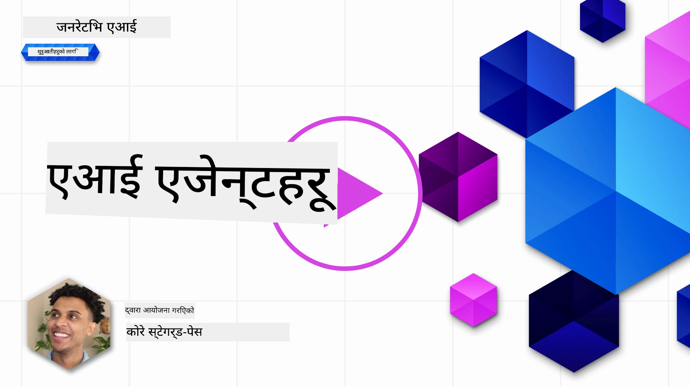
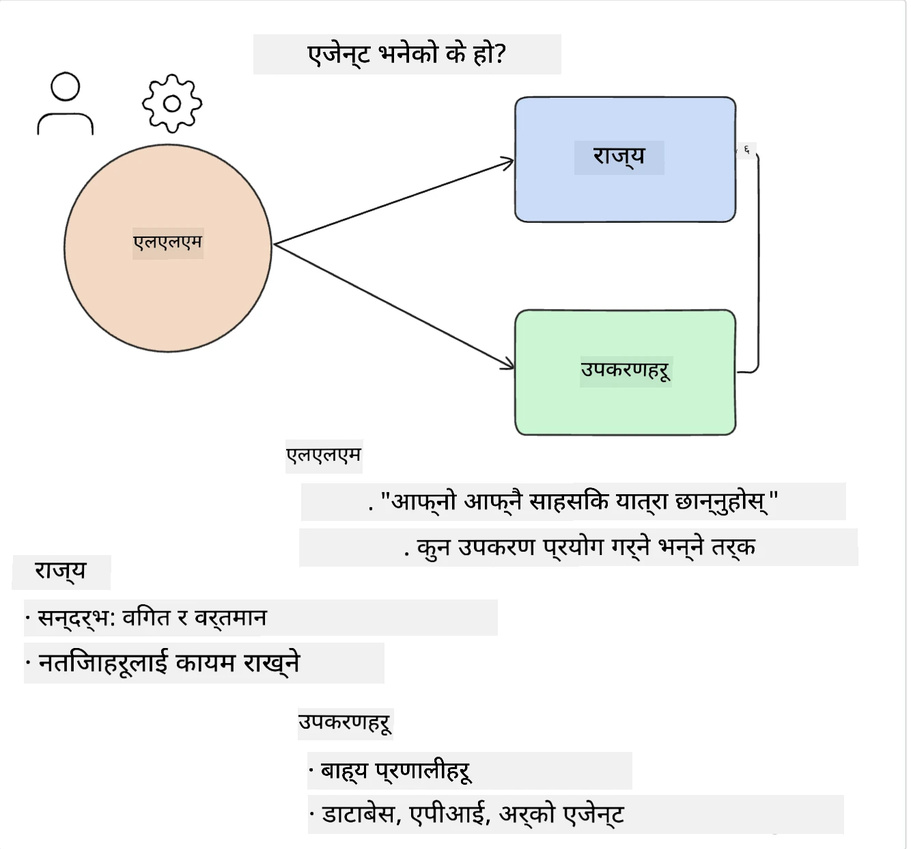
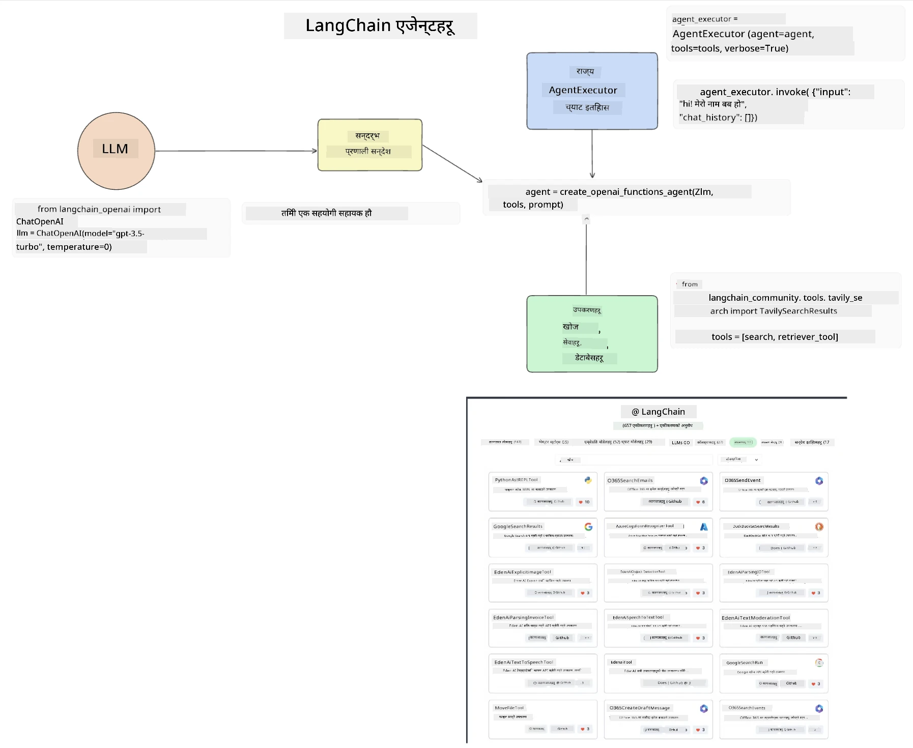
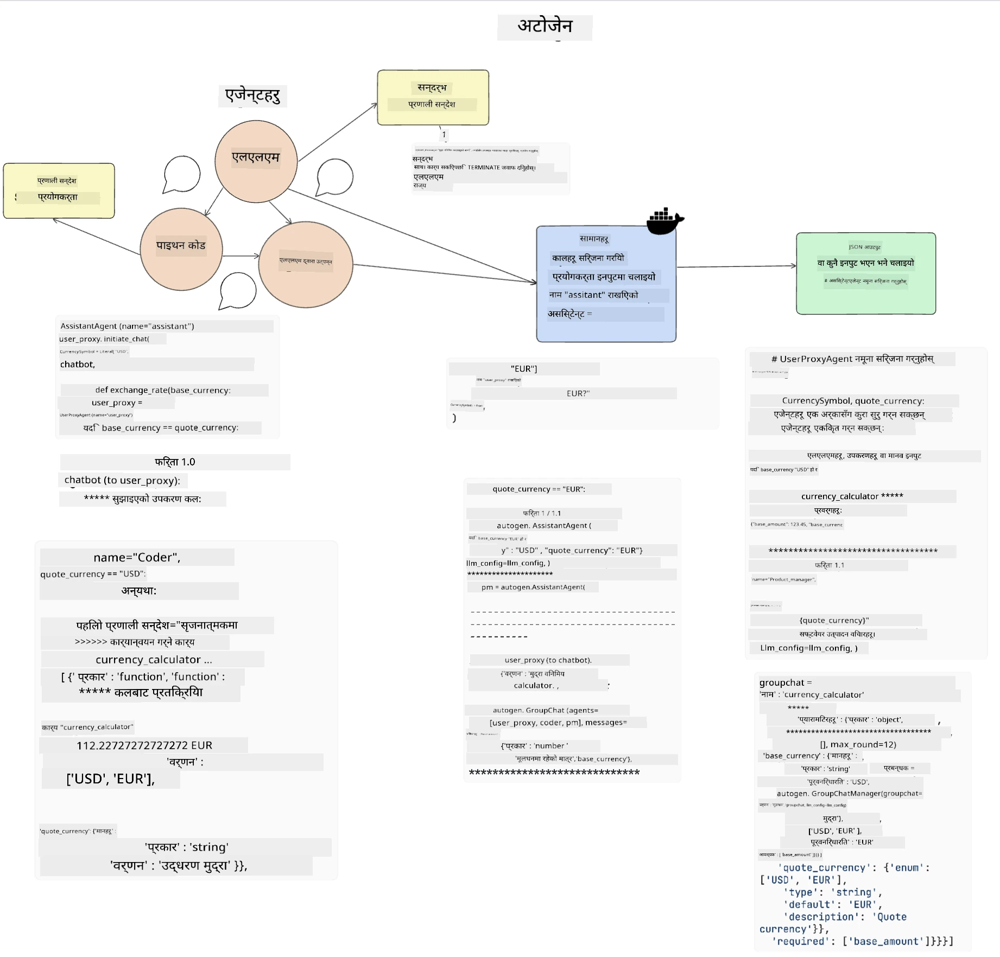
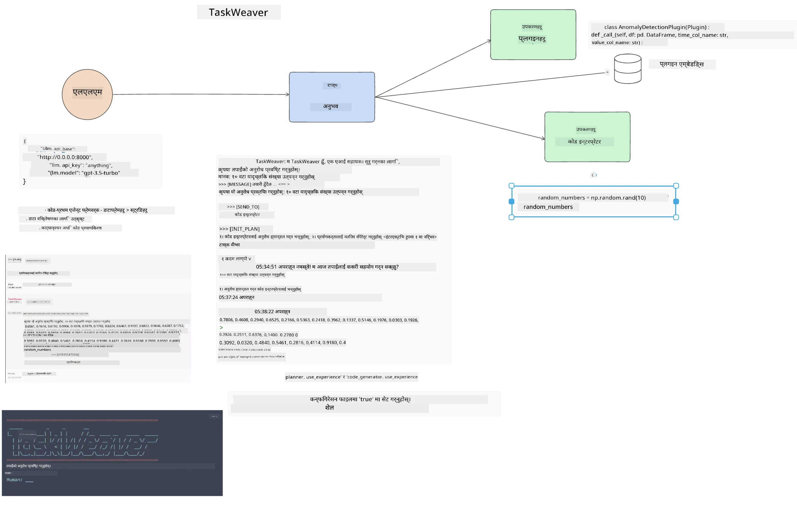
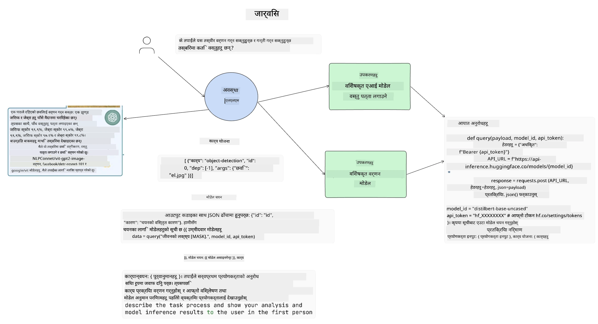

[](https://youtu.be/yAXVW-lUINc?si=bOtW9nL6jc3XJgOM)

## परिचय

AI एजेन्टहरू जेनेरेटिभ AI मा एक रोमाञ्चक विकास प्रतिनिधित्व गर्छन्, जसले ठूलो भाषा मोडेलहरू (LLMs) लाई सहायकहरूबाट कार्यहरू लिन सक्ने एजेन्टहरूमा विकास गर्न सक्षम पार्छ। AI एजेन्ट फ्रेमवर्कहरूले विकासकर्ताहरूलाई LLMs लाई उपकरणहरू र राज्य व्यवस्थापनमा पहुँच दिने अनुप्रयोगहरू सिर्जना गर्न सक्षम बनाउँछन्। यी फ्रेमवर्कहरूले दृश्यता पनि बढाउँछन्, जसले प्रयोगकर्ता र विकासकर्ताहरूलाई LLMs द्वारा योजना गरिएको कार्यहरू निगरानी गर्न मद्दत पुर्‍याउँछ, यसरी अनुभव व्यवस्थापन सुधारिन्छ।

पाठले निम्न क्षेत्रहरू समेट्नेछ:

- AI एजेन्ट भनेको के हो बुझ्ने - AI एजेन्ट के हो ठीक त्यसै?
- चार फरक AI एजेन्ट फ्रेमवर्कहरू अन्वेषण गर्ने - के ती फरक बनाउन्छ?
- यी AI एजेन्टहरूलाई विभिन्न प्रयोग केसहरूमा लागू गर्ने - कहिले AI एजेन्टहरू प्रयोग गर्ने?

## सिकाइ लक्ष्यहरू

यस पाठ पछि तपाईले सक्षम हुनुहुनेछ:

- AI एजेन्टहरू के हो र तिनीहरू कसरी प्रयोग गर्न सकिन्छ व्याख्या गर्न।
- केही लोकप्रिय AI एजेन्ट फ्रेमवर्कहरू बीचको भिन्नताहरू बुझ्न, र तिनीहरू कसरी फरक छन्।
- AI एजेन्टहरू कसरी कार्य गर्छन् बुझ्न ताकि तिनीहरूबाट अनुप्रयोगहरू विकास गर्न सकियोस्।

## AI एजेन्टहरू के हुन्?

AI एजेन्टहरू जेनेरेटिभ AI को संसारमा धेरै रोमाञ्चक क्षेत्र हुन्। यस रोमाञ्चकसंग कहिलेकाहीं पद र तिनीहरूको प्रयोगमा भ्रम हुन्छ। सरल र अधिकांश उपकरणहरू समावेश गर्ने गरि, जुन AI एजेन्टहरू भन्छन्, हामी यस परिभाषा प्रयोग गर्नेछौं:

AI एजेन्टहरूले ठूलो भाषा मोडेलहरू (LLMs) लाई कार्यहरू गर्न अनुमति दिन्छन् जसले तिनीहरूलाई **राज्य** र **उपकरणहरू** मा पहुँच दिन्छ।



यी शब्दहरू परिभाषित गरौं:

**ठूला भाषा मोडेलहरू** - यी मोडेलहरू यस पाठ्यक्रमभरि उल्लेख गरिएका जस्तो GPT-3.5, GPT-4, Llama-2, आदि हुन्।

**राज्य** - यसले LLM काम गरिरहेको सन्दर्भलाई जनाउँछ। LLM ले आफ्नो विगत कार्यहरूको सन्दर्भ र वर्तमान सन्दर्भ प्रयोग गरी आगामी कार्यहरूको निर्णय-प्रक्रियालाई निर्देशित गर्छ। AI एजेन्ट फ्रेमवर्कहरूले विकासकर्ताहरूलाई यो सन्दर्भ सजिलै कायम गर्न अनुमति दिन्छ।

**उपकरणहरू** - प्रयोगकर्ताले अनुरोध गरेको र LLM ले योजना बनाएको कार्य पूरा गर्न LLM लाई उपकरणहरूमा पहुँच आवश्यक पर्छ। उपकरणका उदाहरणहरू हुन् डेटाबेस, API, बाह्य अनुप्रयोग वा अर्को LLM पनि हुन सक्छ!

यी परिभाषाहरूले तपाईलाई अघि बढ्दा थोरै राम्रो आधार दिने आशा छ। अब केही फरक AI एजेन्ट फ्रेमवर्कहरू अन्वेषण गरौं:

## LangChain एजेन्टहरू

[LangChain एजेन्टहरू](https://python.langchain.com/docs/how_to/#agents?WT.mc_id=academic-105485-koreyst) माथि दिएका परिभाषाहरूको कार्यान्वयन हो।

**राज्य** व्यवस्थापन गर्न, यसले `AgentExecutor` भनिने बिल्ट-इन फंक्शन प्रयोग गर्छ। यसले परिभाषित `agent` र उपलब्ध `tools` लाई स्वीकार्छ।

`Agent Executor` ले पनि कुराकानी इतिहास संग्रह गर्छ जसले कुराकानीको सन्दर्भ प्रदान गर्छ।



LangChain ले [उपकरणहरूको सूची](https://integrations.langchain.com/tools?WT.mc_id=academic-105485-koreyst) प्रदान गर्दछ जुन तपाईको अनुप्रयोगमा आयात गर्न सकिन्छ जहाँ LLM ले पहुँच पाउछ। यी समुदाय र LangChain टोलीले बनाएका हुन्।

तपाईं यी उपकरणहरू परिभाषित गरेर `Agent Executor` लाई दिन सक्नुहुन्छ।

दृश्यता पनि AI एजेन्टहरूमा कुरा गर्दा महत्वपूर्ण पक्ष हो। अनुप्रयोग विकासकर्ताहरूले बुझ्नुपर्छ LLM कुन उपकरण प्रयोग गर्दैछ र किन। त्यसका लागि LangChain टोलीले LangSmith विकास गरेको छ।

## AutoGen

अर्को AI एजेन्ट फ्रेमवर्क हो [AutoGen](https://microsoft.github.io/autogen/?WT.mc_id=academic-105485-koreyst)। AutoGen को मुख्य केन्द्रबिन्दु संवादहरू हुन्। एजेन्टहरू **संवादयोग्य** र **अनुकूलनयोग्य** दुवै हुन्छन्।

**संवादयोग्य -** LLM हरू अर्को LLM सँग संवाद सुरु र जारी राख्न सक्छन् कुनै कार्य पूरा गर्न। यो `AssistantAgents` बनाइ र तिनीहरूलाई विशेष प्रणाली सन्देश दिने मार्फत गरिन्छ।

```python

autogen.AssistantAgent( name="Coder", llm_config=llm_config, ) pm = autogen.AssistantAgent( name="Product_manager", system_message="Creative in software product ideas.", llm_config=llm_config, )

```

**अनुकूलनयोग्य** - एजेन्टहरू केवल LLM मात्र नभएर प्रयोगकर्ता वा उपकरण पनि हुन सक्दछन्। विकासकर्ता रूपमा, तपाईं `UserProxyAgent` परिभाषित गर्न सक्नुहुन्छ जुन प्रयोगकर्तासँग अन्तरक्रिया गरेर प्रतिक्रिया लिन्छ कार्य पूरा गर्न। यो प्रतिक्रिया कार्य निरन्तरता दिन वा रोक्न सक्छ।

```python
user_proxy = UserProxyAgent(name="user_proxy")
```

### राज्य र उपकरणहरू

राज्य परिवर्तन र व्यवस्थापन गर्न, सहायक एजेन्टले Python कोड उत्पादन गर्छ कार्य पूरा गर्न।

प्रक्रियाको उदाहरण यस प्रकार छ:



#### प्रणाली सन्देश सहित परिभाषित LLM

```python
system_message="For weather related tasks, only use the functions you have been provided with. Reply TERMINATE when the task is done."
```

यस प्रणाली सन्देशले विशिष्ट LLM लाई कुन कार्यहरू यसको कार्यसँग सम्बन्धित छन् निर्देशन दिन्छ। याद गर्नुहोस्, AutoGen मा तपाईंले विभिन्न प्रणाली सन्देशसहित_multiple AssistantAgents_ परिभाषित गर्न सक्नुहुन्छ।

#### प्रयोगकर्ताद्वारा सुरु गरिएको कुराकानी

```python
user_proxy.initiate_chat( chatbot, message="I am planning a trip to NYC next week, can you help me pick out what to wear? ", )

```

प्रयोगकर्ता_proxy (मानव) बाट आएको यो सन्देशले एजेन्टलाई सम्भावित कार्यहरू अन्वेषण गर्न सुरु गर्छ जुन उसले सम्पन्न गर्नु पर्छ।

#### कार्य सञ्चालन गरिन्छ

```bash
chatbot (to user_proxy):

***** Suggested tool Call: get_weather ***** Arguments: {"location":"New York City, NY","time_periond:"7","temperature_unit":"Celsius"} ******************************************************** --------------------------------------------------------------------------------

>>>>>>>> EXECUTING FUNCTION get_weather... user_proxy (to chatbot): ***** Response from calling function "get_weather" ***** 112.22727272727272 EUR ****************************************************************

```

प्रारम्भिक कुराकानी प्रक्रिया पछि, एजेन्टले सुझाव गरिएको उपकरण कल गर्न पठाउँछ। यस अवस्थामा, यो `get_weather` नामक कार्य हो। तपाईंको कन्फिगरेसन अनुसार, यो कार्य स्वचालित रूपमा चलाइन्छ र एजेन्टले पढ्न सक्छ वा प्रयोगकर्ताको इनपुट अनुसार चलाउन सकिन्छ।

थप अन्वेषण गर्न [AutoGen कोड नमूनाहरू](https://microsoft.github.io/autogen/docs/Examples/?WT.mc_id=academic-105485-koreyst) हेर्न सक्नुहुन्छ।

## Taskweaver

अर्को एजेन्ट फ्रेमवर्क हो [Taskweaver](https://microsoft.github.io/TaskWeaver/?WT.mc_id=academic-105485-koreyst)। यो "कोड-प्रथम" एजेन्टको रूपमा चिनिन्छ किनभने यो कठोर रूपमा `strings` सँग मात्र काम गर्ने होइन, Python मा DataFrames सँग पनि काम गर्न सक्छ। यो डाटा विश्लेषण र उत्पादन कार्यका लागि अत्यन्त उपयोगी हुन्छ। जस्तो कि ग्राफहरू र चार्टहरू सिर्जना गर्न वा र्यान्डम नम्बरहरू उत्पादन गर्न।

### राज्य र उपकरणहरू

कुराकानीको राज्य व्यवस्थापन गर्न TaskWeaver ले `Planner` को अवधारणा प्रयोग गर्छ। `Planner` LLM हो जुन प्रयोगकर्ताबाट अनुरोध लिन्छ र पूर्ति गर्न आवश्यक कार्यहरू नक्सांकन गर्छ।

कार्यहरू पूरा गर्न `Planner` लाई `Plugins` भनिने उपकरणहरूको संग्रह उपलब्ध गराइन्छ। यी Python कक्षाहरू वा सामान्य कोड इन्टरप्रेटर हुन सक्छन्। यी प्लगइनहरू embeddings रूपमा संग्रहित गरिन्छन् ता कि LLM ले सही प्लगइन खोज्न सजिलो होस्।



यहाँ anomaly detection को प्लगइनको उदाहरण छ:

```python
class AnomalyDetectionPlugin(Plugin): def __call__(self, df: pd.DataFrame, time_col_name: str, value_col_name: str):
```

कडि चलाउनु अघि सत्यापन गरिन्छ। Taskweaver मा अर्को सन्दर्भ व्यवस्थापन सुविधा हो `experience`। अनुभवले कुराकानीको सन्दर्भलाई लामो अवधि यामल फाइलमा भण्डारण गर्न अनुमति दिन्छ। यसलाई कन्फिगर गर्न सकिन्छ ताकि LLM पूर्व कुराकानीहरूमा आधारित केही कार्यहरूमा समयसँग सुधार गर्न सकून्।

## JARVIS

अन्तिम एजेन्ट फ्रेमवर्क हो [JARVIS](https://github.com/microsoft/JARVIS?tab=readme-ov-file&WT.mc_id=academic-105485-koreyst)। JARVIS लाई विशिष्ट बनाउने कुरा हो कि यसले कुराकानीको `राज्य` व्यवस्थापन गर्न LLM प्रयोग गर्छ र `tools` अन्य AI मोडेलहरू हुन्छन्। प्रत्येक AI मोडेल विशिष्ट कार्यहरू जस्तै वस्तु पहिचान, ट्रान्स्क्रिप्शन वा छवि क्याप्शनमा विशेषज्ञता प्राप्त मोडेलहरू हुन्।



LLM, एउटा सामान्य प्रयोजन मोडेल, प्रयोगकर्ताबाट अनुरोध प्राप्त गर्छ र विशिष्ट कार्य र कुनै पनि बहस/डेटा पहिचान गर्छ जुन कार्य पूरा गर्न आवश्यक छ।

```python
[{"task": "object-detection", "id": 0, "dep": [-1], "args": {"image": "e1.jpg" }}]
```

LLM त्यसपछि अनुरोधलाई यस्तो तरिकाले स्वरूपित गर्छ जुन विशिष्ट AI मोडेलले व्याख्या गर्न सक्छ, जस्तै JSON। एक पल्ट AI मोडेलले आफ्नो पूर्वानुमान फर्काएपछि, LLM प्रतिक्रिया प्राप्त गर्छ।

यदि कार्य पूरा गर्न धेरै मोडेलहरू आवश्यक छन् भने, यसले ती मोडेलहरूको प्रतिक्रिया व्याख्या गरेर तिनीहरूलाई एकसाथ ल्याएर प्रयोगकर्तालाई प्रतिक्रिया जनाउँछ।

तलको उदाहरण देखाउँछ प्रयोगकर्ताले तस्वीरमा वस्तुहरूको विवरण र गणना माग्दा यो कसरी काम गर्छ:

## असाइनमेंट

AI एजेन्टहरूको सिकाइ जारी राख्न तपाईं AutoGen प्रयोग गरेर निर्माण गर्न सक्नुहुन्छ:

- एक अनुप्रयोग जुन शिक्षण स्टार्टअपका विभिन्न विभागहरूसँग व्यापारीक बैठक सिमुलेट गर्छ।
- प्रणाली सन्देशहरू सिर्जना गर्न जसले LLMs लाई विभिन्न व्यक्तित्व र प्राथमिकताहरू बुझ्न मार्गदर्शन दिन्छ, र प्रयोगकर्तालाई नयाँ उत्पादन विचार पिच गर्न सक्षम बनाउँछ।
- त्यसपछि LLM ले हरेक विभागबाट फलो-अप प्रश्नहरू उत्पन्न गर्नुपर्नेछ जसले पिच र उत्पादन विचारलाई सुधार र परिष्कृत गर्दछ।

## सिकाइ यहाँ रोकिँदैन, यात्रा जारी राख्नुहोस्

यस पाठ पूरा गरेपछि, हाम्रो [जेनेरेटिभ AI सिकाइ संग्रह](https://aka.ms/genai-collection?WT.mc_id=academic-105485-koreyst) मा जानुहोस् र तपाईंको जेनेरेटिभ AI ज्ञानलाई अझ उच्च तहमा पुर्याउनुहोस्!

---

<!-- CO-OP TRANSLATOR DISCLAIMER START -->
**अस्वीकरण**:
यो दस्तावेज AI अनुवाद सेवा [Co-op Translator](https://github.com/Azure/co-op-translator) प्रयोग गरी अनुवाद गरिएको हो। हामी शुद्धताको लागि प्रयास गर्दछौं भने पनि स्वचालित अनुवादमा त्रुटि वा अशुद्धिहरू हुन सक्छन्। मूल दस्तावेज यसको मूल भाषामा आधिकारिक स्रोतको रूपमा लिईनु पर्छ। महत्वपूर्ण जानकारीको लागि व्यावसायिक मानव अनुवाद सिफारिस गरिन्छ। यस अनुवादको प्रयोगबाट उत्पन्न हुने कुनै पनि गलतफहमी वा गलत व्याख्याहरूको लागि हामी जिम्मेवार छैनौं।
<!-- CO-OP TRANSLATOR DISCLAIMER END -->