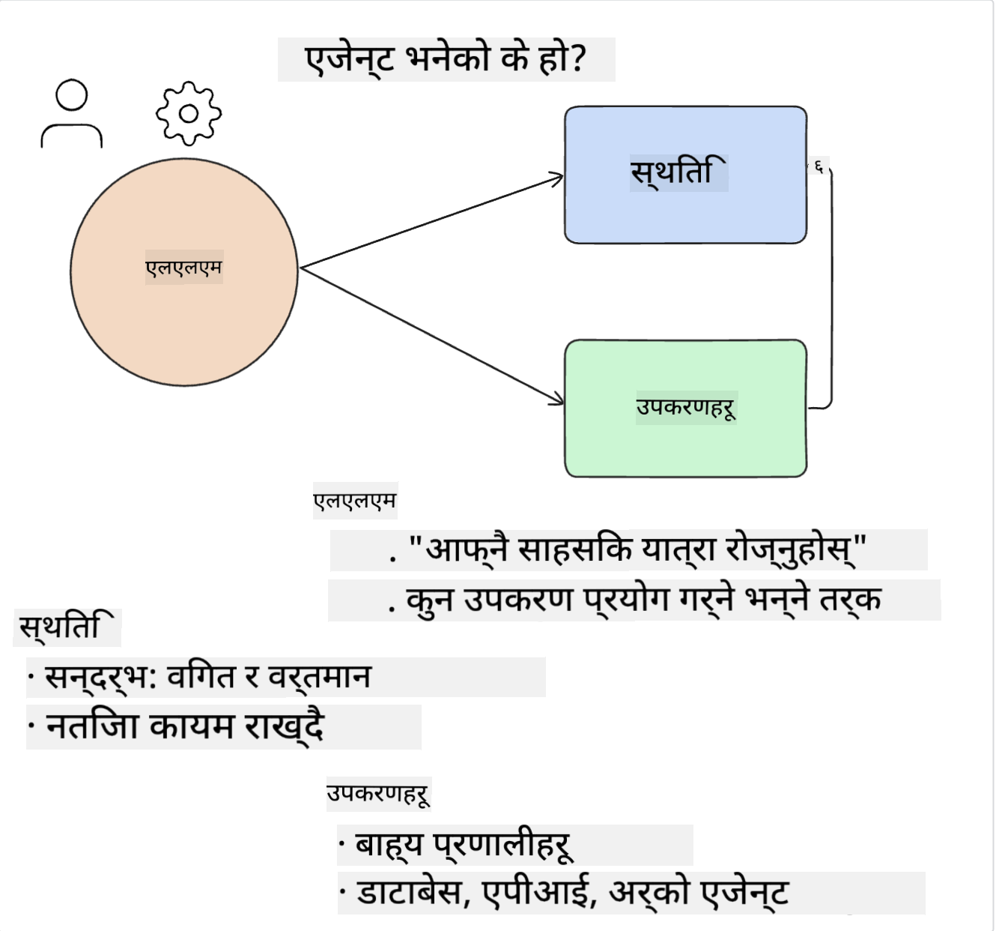
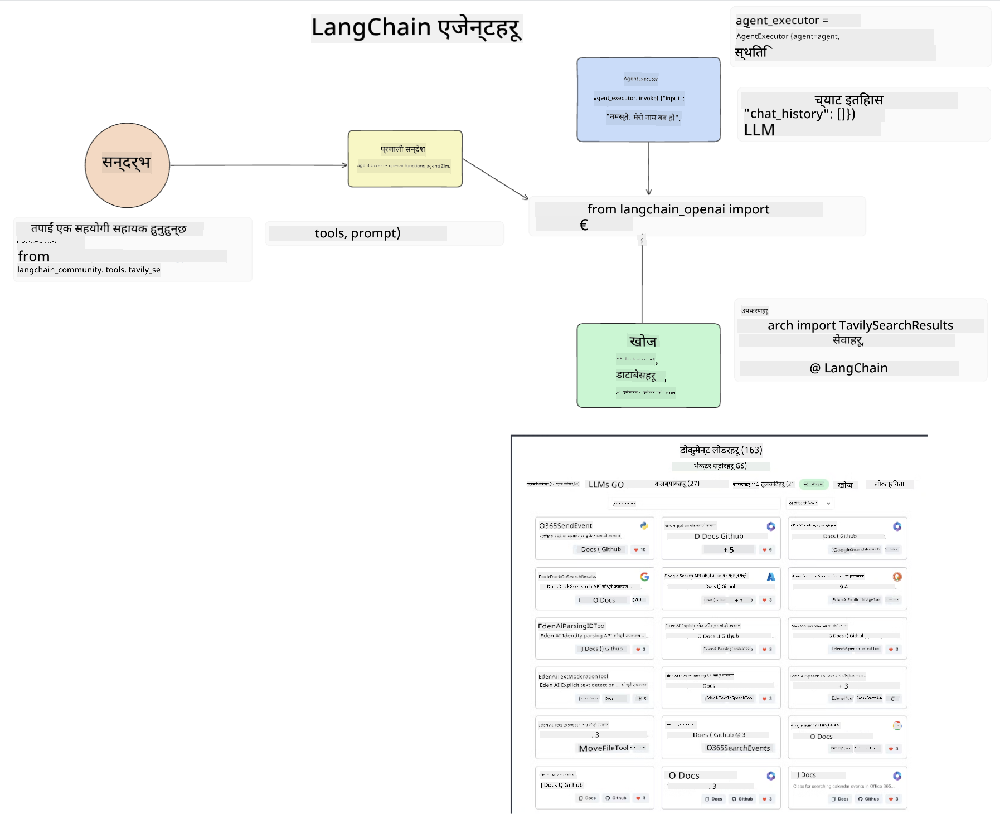

<!--
CO_OP_TRANSLATOR_METADATA:
{
  "original_hash": "11f03c81f190d9cbafd0f977dcbede6c",
  "translation_date": "2025-07-09T17:22:54+00:00",
  "source_file": "17-ai-agents/README.md",
  "language_code": "ne"
}
-->
[](https://aka.ms/gen-ai-lesson17-gh?WT.mc_id=academic-105485-koreyst)

## परिचय

AI एजेन्टहरू जेनेरेटिभ AI मा एक रोमाञ्चक विकास हुन्, जसले ठूलो भाषा मोडेलहरू (LLMs) लाई सहायकबाट कार्यहरू गर्न सक्षम एजेन्टहरूमा रूपान्तरण गर्न सक्षम बनाउँछन्। AI एजेन्ट फ्रेमवर्कहरूले विकासकर्ताहरूलाई LLMs लाई उपकरणहरू र अवस्था व्यवस्थापनमा पहुँच दिन सक्षम एप्लिकेसनहरू बनाउन मद्दत गर्छन्। यी फ्रेमवर्कहरूले दृश्यता पनि बढाउँछन्, जसले प्रयोगकर्ता र विकासकर्ताहरूलाई LLMs द्वारा योजना बनाइएका कार्यहरू अनुगमन गर्न अनुमति दिन्छ, जसले अनुभव व्यवस्थापन सुधार गर्छ।

यस पाठले निम्न क्षेत्रहरू समेट्नेछ:

- AI एजेन्ट के हो बुझ्ने - AI एजेन्ट के हो वास्तवमा?
- चार विभिन्न AI एजेन्ट फ्रेमवर्कहरूको अन्वेषण - तिनीहरूलाई के फरक बनाउँछ?
- यी AI एजेन्टहरूलाई विभिन्न प्रयोग केसहरूमा लागू गर्ने - कहिले AI एजेन्टहरू प्रयोग गर्ने?

## सिकाइका लक्ष्यहरू

यस पाठपछि, तपाईं सक्षम हुनुहुनेछ:

- AI एजेन्टहरू के हुन् र तिनीहरूलाई कसरी प्रयोग गर्न सकिन्छ भन्ने व्याख्या गर्न।
- केही लोकप्रिय AI एजेन्ट फ्रेमवर्कहरू बीचको भिन्नता बुझ्न र तिनीहरू कसरी फरक छन् थाहा पाउन।
- AI एजेन्टहरू कसरी काम गर्छन् बुझेर तिनीहरूसँग एप्लिकेसनहरू निर्माण गर्न।

## AI एजेन्टहरू के हुन्?

AI एजेन्टहरू जेनेरेटिभ AI को संसारमा एक अत्यन्त रोमाञ्चक क्षेत्र हो। यस रोमाञ्चकता संग कहिलेकाहीं शब्दहरू र तिनीहरूको प्रयोगमा भ्रम पनि आउँछ। सबैभन्दा सरल र समावेशी तरिकाले, हामी AI एजेन्टहरूलाई यसरी परिभाषित गर्नेछौं:

AI एजेन्टहरूले ठूलो भाषा मोडेलहरू (LLMs) लाई **अवस्था** र **उपकरणहरू** मा पहुँच दिई कार्यहरू गर्न सक्षम बनाउँछन्।



यी शब्दहरूलाई परिभाषित गरौं:

**ठूलो भाषा मोडेलहरू** - यी मोडेलहरू हुन् जुन यस कोर्समा उल्लेख गरिएका छन् जस्तै GPT-3.5, GPT-4, Llama-2 आदि।

**अवस्था** - यसले LLM काम गरिरहेको सन्दर्भलाई जनाउँछ। LLM ले आफ्नो विगतका कार्यहरू र वर्तमान सन्दर्भको आधारमा निर्णय लिन्छ। AI एजेन्ट फ्रेमवर्कहरूले विकासकर्ताहरूलाई यो सन्दर्भ सजिलै व्यवस्थापन गर्न मद्दत गर्छ।

**उपकरणहरू** - प्रयोगकर्ताले अनुरोध गरेको र LLM ले योजना बनाएको कार्य पूरा गर्न LLM लाई उपकरणहरूमा पहुँच आवश्यक हुन्छ। उपकरणका उदाहरणहरूमा डेटाबेस, API, बाह्य एप्लिकेसन वा अर्को LLM पनि हुन सक्छ!

यी परिभाषाहरूले तपाईंलाई अगाडि बढ्दा राम्रो आधार दिनेछन् जब हामी तिनीहरूलाई कसरी कार्यान्वयन गरिन्छ हेर्नेछौं। अब केही फरक AI एजेन्ट फ्रेमवर्कहरू अन्वेषण गरौं:

## LangChain एजेन्टहरू

[LangChain एजेन्टहरू](https://python.langchain.com/docs/how_to/#agents?WT.mc_id=academic-105485-koreyst) माथि दिइएका परिभाषाहरूको कार्यान्वयन हो।

**अवस्था** व्यवस्थापन गर्न, यसले `AgentExecutor` नामक बिल्ट-इन फङ्सन प्रयोग गर्छ। यसले परिभाषित `agent` र उपलब्ध `tools` लाई स्वीकार्छ।

`AgentExecutor` ले च्याट इतिहास पनि भण्डारण गर्छ जसले च्याटको सन्दर्भ प्रदान गर्छ।



LangChain ले [उपकरणहरूको सूची](https://integrations.langchain.com/tools?WT.mc_id=academic-105485-koreyst) प्रदान गर्छ जुन तपाईंको एप्लिकेसनमा आयात गर्न सकिन्छ र जसमा LLM ले पहुँच पाउन सक्छ। यी उपकरणहरू समुदाय र LangChain टिमले बनाएका हुन्।

तपाईं यी उपकरणहरू परिभाषित गरेर `AgentExecutor` लाई पास गर्न सक्नुहुन्छ।

AI एजेन्टहरूको कुरा गर्दा दृश्यता अर्को महत्वपूर्ण पक्ष हो। एप्लिकेसन विकासकर्ताहरूलाई बुझ्न आवश्यक छ कि LLM कुन उपकरण प्रयोग गर्दैछ र किन। त्यसका लागि LangChain टिमले LangSmith विकास गरेको छ।

## AutoGen

अर्को AI एजेन्ट फ्रेमवर्क हो [AutoGen](https://microsoft.github.io/autogen/?WT.mc_id=academic-105485-koreyst)। AutoGen को मुख्य फोकस संवादहरूमा छ। एजेन्टहरू दुवै **संवादयोग्य** र **अनुकूलनयोग्य** छन्।

**संवादयोग्य -** LLMs ले अर्को LLM सँग संवाद सुरु र जारी राखेर कार्य पूरा गर्न सक्छन्। यो `AssistantAgents` सिर्जना गरेर र तिनीहरूलाई विशेष सिस्टम सन्देश दिएर गरिन्छ।

```python

autogen.AssistantAgent( name="Coder", llm_config=llm_config, ) pm = autogen.AssistantAgent( name="Product_manager", system_message="Creative in software product ideas.", llm_config=llm_config, )

```

**अनुकूलनयोग्य** - एजेन्टहरू केवल LLM मात्र नभई प्रयोगकर्ता वा उपकरण पनि हुन सक्छन्। विकासकर्ताको रूपमा, तपाईं `UserProxyAgent` परिभाषित गर्न सक्नुहुन्छ जुन प्रयोगकर्तासँग अन्तरक्रिया गरेर कार्य पूरा गर्न प्रतिक्रिया सङ्कलन गर्छ। यो प्रतिक्रिया कार्य जारी राख्न वा रोक्न प्रयोग गर्न सकिन्छ।

```python
user_proxy = UserProxyAgent(name="user_proxy")
```

### अवस्था र उपकरणहरू

अवस्था परिवर्तन र व्यवस्थापन गर्न, सहायक एजेन्टले कार्य पूरा गर्न Python कोड उत्पन्न गर्छ।

प्रक्रियाको उदाहरण यहाँ छ:


#### LLM लाई सिस्टम सन्देशसँग परिभाषित गरिएको

```python
system_message="For weather related tasks, only use the functions you have been provided with. Reply TERMINATE when the task is done."
```

यो सिस्टम सन्देशले विशेष LLM लाई कुन फङ्सनहरू यसको कार्यका लागि सान्दर्भिक छन् निर्देशन दिन्छ। AutoGen मा तपाईंले विभिन्न सिस्टम सन्देशहरू सहित धेरै AssistantAgents परिभाषित गर्न सक्नुहुन्छ।

#### प्रयोगकर्ताद्वारा च्याट सुरु गरिन्छ

```python
user_proxy.initiate_chat( chatbot, message="I am planning a trip to NYC next week, can you help me pick out what to wear? ", )

```

यो सन्देश user_proxy (मानव) बाट आउँछ र एजेन्टलाई सम्भावित फङ्सनहरू अन्वेषण गर्न प्रक्रिया सुरु गराउँछ।

#### फङ्सन कार्यान्वयन गरिन्छ

```bash
chatbot (to user_proxy):

***** Suggested tool Call: get_weather ***** Arguments: {"location":"New York City, NY","time_periond:"7","temperature_unit":"Celsius"} ******************************************************** --------------------------------------------------------------------------------

>>>>>>>> EXECUTING FUNCTION get_weather... user_proxy (to chatbot): ***** Response from calling function "get_weather" ***** 112.22727272727272 EUR ****************************************************************

```

प्रारम्भिक च्याट प्रक्रिया भएपछि, एजेन्टले कल गर्न सुझाव दिएको उपकरण पठाउँछ। यस अवस्थामा, `get_weather` नामक फङ्सन हो। तपाईंको कन्फिगरेसन अनुसार, यो फङ्सन स्वचालित रूपमा कार्यान्वयन हुन सक्छ वा प्रयोगकर्ताको इनपुटमा आधारित हुन सक्छ।

थप अन्वेषणका लागि [AutoGen कोड नमूनाहरू](https://microsoft.github.io/autogen/docs/Examples/?WT.mc_id=academic-105485-koreyst) हेर्न सक्नुहुन्छ।

## Taskweaver

अर्को एजेन्ट फ्रेमवर्क हो [Taskweaver](https://microsoft.github.io/TaskWeaver/?WT.mc_id=academic-105485-koreyst)। यसलाई "कोड-प्रथम" एजेन्ट भनिन्छ किनभने यो केवल `strings` सँग मात्र होइन, Python मा DataFrames सँग पनि काम गर्न सक्छ। यो डेटा विश्लेषण र उत्पादन कार्यहरूका लागि अत्यन्त उपयोगी हुन्छ। जस्तै ग्राफ र चार्टहरू सिर्जना गर्ने वा यादृच्छिक संख्या उत्पादन गर्ने।

### अवस्था र उपकरणहरू

संवादको अवस्था व्यवस्थापन गर्न, TaskWeaver ले `Planner` को अवधारणा प्रयोग गर्छ। `Planner` एक LLM हो जसले प्रयोगकर्ताबाट अनुरोध लिन्छ र पूरा गर्नुपर्ने कार्यहरू नक्साङ्कन गर्छ।

कार्यहरू पूरा गर्न `Planner` लाई `Plugins` नामक उपकरणहरूको संग्रहमा पहुँच दिइन्छ। यी Python क्लासहरू वा सामान्य कोड इन्टरप्रेटर हुन सक्छन्। यी प्लगइनहरू एम्बेडिङ्सको रूपमा भण्डारण गरिन्छन् जसले LLM लाई सही प्लगइन खोज्न मद्दत गर्छ।


यहाँ anomaly detection को लागि प्लगइनको उदाहरण छ:

```python
class AnomalyDetectionPlugin(Plugin): def __call__(self, df: pd.DataFrame, time_col_name: str, value_col_name: str):
```

कोड कार्यान्वयन अघि प्रमाणित गरिन्छ। Taskweaver मा सन्दर्भ व्यवस्थापनको अर्को सुविधा हो `experience`। Experience ले संवादको सन्दर्भलाई लामो समयसम्म YAML फाइलमा भण्डारण गर्न अनुमति दिन्छ। यसलाई कन्फिगर गरेर LLM लाई विगतका संवादहरूमा आधारित कार्यहरूमा समयसँग सुधार गर्न सकिन्छ।

## JARVIS

अन्तिम एजेन्ट फ्रेमवर्क हो [JARVIS](https://github.com/microsoft/JARVIS?tab=readme-ov-file?WT.mc_id=academic-105485-koreyst)। JARVIS को विशेषता हो कि यसले संवादको `state` व्यवस्थापन गर्न LLM प्रयोग गर्छ र `tools` अन्य AI मोडेलहरू हुन्छन्। प्रत्येक AI मोडेल विशेष कार्यहरू जस्तै वस्तु पहिचान, ट्रान्सक्रिप्सन वा छवि क्याप्शनिङ गर्छ।


LLM, एक सामान्य उद्देश्य मोडेल भएर, प्रयोगकर्ताबाट अनुरोध प्राप्त गर्छ र विशिष्ट कार्य र आवश्यक तर्क/डेटा पहिचान गर्छ।

```python
[{"task": "object-detection", "id": 0, "dep": [-1], "args": {"image": "e1.jpg" }}]
```

LLM ले अनुरोधलाई विशेष AI मोडेलले बुझ्ने तरिकामा जस्तै JSON मा रूपान्तरण गर्छ। AI मोडेलले कार्यको आधारमा भविष्यवाणी फर्काएपछि, LLM ले जवाफ प्राप्त गर्छ।

यदि कार्य पूरा गर्न धेरै मोडेलहरू आवश्यक भए, LLM ले ती मोडेलहरूको जवाफ पनि व्याख्या गरेर प्रयोगकर्तालाई जवाफ तयार पार्छ।

तलको उदाहरणले देखाउँछ जब प्रयोगकर्ताले तस्वीरमा वस्तुहरूको विवरण र संख्या माग्छ:

## असाइनमेन्ट

AI एजेन्टहरूको सिकाइ जारी राख्न तपाईं AutoGen सँग निम्न निर्माण गर्न सक्नुहुन्छ:

- शिक्षा स्टार्टअपका विभिन्न विभागहरूसँग व्यवसाय बैठकको अनुकरण गर्ने एप्लिकेसन।
- LLMs लाई विभिन्न व्यक्तित्व र प्राथमिकताहरू बुझ्न मार्गदर्शन गर्ने सिस्टम सन्देशहरू सिर्जना गर्ने, र प्रयोगकर्तालाई नयाँ उत्पादन विचार प्रस्तुत गर्न सक्षम बनाउने।
- त्यसपछि LLM ले प्रत्येक विभागबाट फलो-अप प्रश्नहरू उत्पन्न गर्ने जसले प्रस्तुति र उत्पादन विचारलाई सुधार गर्ने।

## सिकाइ यहाँ रोकिँदैन, यात्रा जारी राख्नुहोस्

यस पाठ पूरा गरेपछि, हाम्रो [जेनेरेटिभ AI सिकाइ संग्रह](https://aka.ms/genai-collection?WT.mc_id=academic-105485-koreyst) हेर्नुहोस् र आफ्नो जेनेरेटिभ AI ज्ञानलाई अझ उचाइमा पुर्‍याउनुहोस्!

**अस्वीकरण**:  
यो दस्तावेज AI अनुवाद सेवा [Co-op Translator](https://github.com/Azure/co-op-translator) प्रयोग गरी अनुवाद गरिएको हो। हामी शुद्धताका लागि प्रयासरत छौं भने पनि, कृपया ध्यान दिनुहोस् कि स्वचालित अनुवादमा त्रुटि वा अशुद्धता हुन सक्छ। मूल दस्तावेज यसको मूल भाषामा नै अधिकारिक स्रोत मानिनुपर्छ। महत्वपूर्ण जानकारीका लागि व्यावसायिक मानव अनुवाद सिफारिस गरिन्छ। यस अनुवादको प्रयोगबाट उत्पन्न कुनै पनि गलतफहमी वा गलत व्याख्याका लागि हामी जिम्मेवार छैनौं।