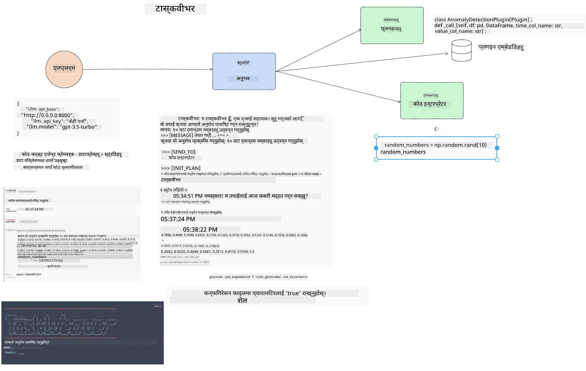

<!--
CO_OP_TRANSLATOR_METADATA:
{
  "original_hash": "8e8d1f6a63da606af7176a87ff8e92b6",
  "translation_date": "2025-10-17T14:01:52+00:00",
  "source_file": "17-ai-agents/README.md",
  "language_code": "ne"
}
-->
[](https://youtu.be/yAXVW-lUINc?si=bOtW9nL6jc3XJgOM)

## परिचय

एआई एजेन्टहरू जेनेरेटिभ एआईमा एक रोमाञ्चक विकासको प्रतिनिधित्व गर्छन्, जसले ठूलो भाषा मोडेलहरू (LLMs) लाई सहायकबाट कार्य गर्न सक्षम एजेन्टहरूमा रूपान्तरण गर्न अनुमति दिन्छ। एआई एजेन्ट फ्रेमवर्कहरूले विकासकर्ताहरूलाई LLMs लाई उपकरणहरू र राज्य व्यवस्थापनमा पहुँच दिने एप्लिकेसनहरू सिर्जना गर्न सक्षम बनाउँछन्। यी फ्रेमवर्कहरूले दृश्यता पनि सुधार गर्छन्, जसले प्रयोगकर्ताहरू र विकासकर्ताहरूलाई LLMs द्वारा योजना बनाइएका कार्यहरू अनुगमन गर्न अनुमति दिन्छ, यसरी अनुभव व्यवस्थापन सुधार गर्दछ।

पाठले निम्न क्षेत्रहरू समेट्नेछ:

- एआई एजेन्ट के हो भन्ने बुझ्ने - एआई एजेन्ट वास्तवमा के हो?
- चार फरक एआई एजेन्ट फ्रेमवर्कहरू अन्वेषण गर्ने - तिनीहरूलाई के विशेष बनाउँछ?
- यी एआई एजेन्टहरूलाई विभिन्न प्रयोग केसहरूमा लागू गर्ने - हामीले एआई एजेन्टहरू कहिले प्रयोग गर्नुपर्छ?

## सिक्ने लक्ष्यहरू

यो पाठ लिएपछि, तपाईं सक्षम हुनुहुनेछ:

- एआई एजेन्टहरू के हुन् र तिनीहरू कसरी प्रयोग गर्न सकिन्छ भन्ने व्याख्या गर्न।
- केही लोकप्रिय एआई एजेन्ट फ्रेमवर्कहरू बीचको भिन्नता बुझ्न, र तिनीहरू कसरी फरक छन्।
- एआई एजेन्टहरू कसरी काम गर्छन् भन्ने बुझ्न ताकि तिनीहरूसँग एप्लिकेसनहरू निर्माण गर्न सकियोस्।

## एआई एजेन्टहरू के हुन्?

एआई एजेन्टहरू जेनेरेटिभ एआईको संसारमा एकदमै रोमाञ्चक क्षेत्र हुन्। यस उत्साहसँग कहिलेकाहीं शब्दहरूको भ्रम र तिनीहरूको प्रयोग पनि आउँछ। चीजहरू सरल र अधिकांश उपकरणहरूलाई समावेशी राख्नको लागि, जसले एआई एजेन्टहरूलाई सन्दर्भित गर्दछ, हामी यो परिभाषा प्रयोग गर्नेछौं:

एआई एजेन्टहरूले ठूलो भाषा मोडेलहरू (LLMs) लाई **राज्य** र **उपकरणहरू** मा पहुँच दिएर कार्यहरू प्रदर्शन गर्न अनुमति दिन्छ।


आउनुहोस् यी शब्दहरूको परिभाषा गरौं:

**ठूलो भाषा मोडेलहरू** - यी मोडेलहरू यस पाठक्रममा उल्लेख गरिएका छन् जस्तै GPT-3.5, GPT-4, Llama-2, आदि।

**राज्य** - यसले LLM काम गरिरहेको सन्दर्भलाई जनाउँछ। LLM ले यसको अघिल्लो कार्यहरूको सन्दर्भ र वर्तमान सन्दर्भ प्रयोग गर्दछ, जसले यसको निर्णय-प्रक्रियालाई मार्गदर्शन गर्दछ। एआई एजेन्ट फ्रेमवर्कहरूले विकासकर्ताहरूलाई यो सन्दर्भ सजिलोसँग कायम राख्न अनुमति दिन्छ।

**उपकरणहरू** - प्रयोगकर्ताले अनुरोध गरेको कार्य पूरा गर्न र LLM ले योजना बनाएको कार्य पूरा गर्न, LLM लाई उपकरणहरूमा पहुँच आवश्यक छ। उपकरणहरूको केही उदाहरणहरू डेटाबेस, API, बाह्य एप्लिकेसन वा अर्को LLM पनि हुन सक्छ!

यी परिभाषाहरूले तपाईंलाई अगाडि बढ्न राम्रो आधार दिने आशा छ जब हामी तिनीहरू कसरी कार्यान्वयन गरिन्छन् भन्ने हेर्छौं। आउनुहोस् केही फरक एआई एजेन्ट फ्रेमवर्कहरू अन्वेषण गरौं:

## LangChain एजेन्टहरू

[LangChain एजेन्टहरू](https://python.langchain.com/docs/how_to/#agents?WT.mc_id=academic-105485-koreyst) माथि दिइएको परिभाषाको कार्यान्वयन हो।

**राज्य** व्यवस्थापन गर्न, यसले `AgentExecutor` नामक एक बिल्ट-इन फङ्सन प्रयोग गर्दछ। यसले परिभाषित `agent` र यसलाई उपलब्ध `tools` स्वीकार गर्दछ।

`Agent Executor` ले च्याट इतिहास पनि भण्डारण गर्दछ ताकि च्याटको सन्दर्भ प्रदान गर्न सकियोस्।


LangChain ले [उपकरणहरूको सूची](https://integrations.langchain.com/tools?WT.mc_id=academic-105485-koreyst) प्रदान गर्दछ जुन तपाईंको एप्लिकेसनमा आयात गर्न सकिन्छ जहाँ LLM ले पहुँच प्राप्त गर्न सक्छ। यी समुदाय र LangChain टोलीद्वारा बनाइएका छन्।

तपाईंले यी उपकरणहरू परिभाषित गर्न सक्नुहुन्छ र तिनीहरूलाई `Agent Executor` मा पास गर्न सक्नुहुन्छ।

दृश्यता एआई एजेन्टहरूको कुरा गर्दा अर्को महत्त्वपूर्ण पक्ष हो। एप्लिकेसन विकासकर्ताहरूले LLM कुन उपकरण प्रयोग गरिरहेको छ र किन भन्ने कुरा बुझ्न महत्त्वपूर्ण छ। त्यसका लागि, LangChain टोलीले LangSmith विकास गरेको छ।

## AutoGen

हामीले छलफल गर्ने अर्को एआई एजेन्ट फ्रेमवर्क [AutoGen](https://microsoft.github.io/autogen/?WT.mc_id=academic-105485-koreyst) हो। AutoGen को मुख्य ध्यान संवादहरूमा छ। एजेन्टहरू **संवादात्मक** र **अनुकूलन योग्य** छन्।

**संवादात्मक -** LLM ले अर्को LLM सँग संवाद सुरु गर्न र जारी राख्न सक्छ ताकि कार्य पूरा गर्न सकियोस्। यो `AssistantAgents` सिर्जना गरेर र तिनीहरूलाई विशिष्ट प्रणाली सन्देश दिने गरेर गरिन्छ।

```python

autogen.AssistantAgent( name="Coder", llm_config=llm_config, ) pm = autogen.AssistantAgent( name="Product_manager", system_message="Creative in software product ideas.", llm_config=llm_config, )

```

**अनुकूलन योग्य** - एजेन्टहरू केवल LLMs को रूपमा मात्र नभई प्रयोगकर्ता वा उपकरणको रूपमा पनि परिभाषित गर्न सकिन्छ। विकासकर्ताको रूपमा, तपाईंले `UserProxyAgent` परिभाषित गर्न सक्नुहुन्छ जसले कार्य पूरा गर्न प्रतिक्रिया प्राप्त गर्न प्रयोगकर्तासँग अन्तरक्रिया गर्न जिम्मेवार हुन्छ। यो प्रतिक्रिया कार्यको कार्यान्वयन जारी राख्न वा रोक्न सकिन्छ।

```python
user_proxy = UserProxyAgent(name="user_proxy")
```

### राज्य र उपकरणहरू

राज्य परिवर्तन गर्न र व्यवस्थापन गर्न, सहायक एजेन्टले कार्य पूरा गर्न Python कोड उत्पन्न गर्दछ।

यहाँ प्रक्रियाको एक उदाहरण छ:


#### प्रणाली सन्देशको साथ परिभाषित LLM

```python
system_message="For weather related tasks, only use the functions you have been provided with. Reply TERMINATE when the task is done."
```

यो प्रणाली सन्देशले यो विशिष्ट LLM लाई यसको कार्यको लागि कुन फङ्सनहरू सान्दर्भिक छन् भनेर निर्देशन दिन्छ। सम्झनुहोस्, AutoGen सँग तपाईंले विभिन्न प्रणाली सन्देशहरू सहित धेरै परिभाषित AssistantAgents हुन सक्छ।

#### प्रयोगकर्ताद्वारा च्याट सुरु गरिन्छ

```python
user_proxy.initiate_chat( chatbot, message="I am planning a trip to NYC next week, can you help me pick out what to wear? ", )

```

यो प्रयोगकर्ता प्रोक्सी (मानव) बाट आएको सन्देशले एजेन्टलाई कार्यान्वयन गर्नुपर्ने सम्भावित फङ्सनहरू अन्वेषण गर्न प्रक्रिया सुरु गर्नेछ।

#### फङ्सन कार्यान्वयन गरिन्छ

```bash
chatbot (to user_proxy):

***** Suggested tool Call: get_weather ***** Arguments: {"location":"New York City, NY","time_periond:"7","temperature_unit":"Celsius"} ******************************************************** --------------------------------------------------------------------------------

>>>>>>>> EXECUTING FUNCTION get_weather... user_proxy (to chatbot): ***** Response from calling function "get_weather" ***** 112.22727272727272 EUR ****************************************************************

```

प्रारम्भिक च्याट प्रक्रिया भएपछि, एजेन्टले कल गर्न सुझाव दिएको उपकरण पठाउनेछ। यस अवस्थामा, यो `get_weather` नामक फङ्सन हो। तपाईंको कन्फिगरेसनमा निर्भर गर्दै, यो फङ्सन स्वतः कार्यान्वयन गर्न सकिन्छ र एजेन्टद्वारा पढ्न सकिन्छ वा प्रयोगकर्ताको इनपुटको आधारमा कार्यान्वयन गर्न सकिन्छ।

AutoGen कोड नमूनाहरूको सूची [यहाँ](https://microsoft.github.io/autogen/docs/Examples/?WT.mc_id=academic-105485-koreyst) पाउन सकिन्छ ताकि निर्माण सुरु गर्न थप अन्वेषण गर्न सकियोस्।

## Taskweaver

हामीले अन्वेषण गर्ने अर्को एजेन्ट फ्रेमवर्क [Taskweaver](https://microsoft.github.io/TaskWeaver/?WT.mc_id=academic-105485-koreyst) हो। यो "कोड-प्रथम" एजेन्टको रूपमा चिनिन्छ किनभने `strings` सँग कडा रूपमा काम गर्नको सट्टा, यसले Python मा DataFrames सँग काम गर्न सक्छ। यो डेटा विश्लेषण र जेनेरेशन कार्यहरूको लागि अत्यन्त उपयोगी हुन्छ। यसले ग्राफ र चार्टहरू सिर्जना गर्ने वा र्यान्डम नम्बरहरू उत्पन्न गर्ने जस्ता कार्यहरू समावेश गर्न सक्छ।

### राज्य र उपकरणहरू

वार्तालापको राज्य व्यवस्थापन गर्न, Taskweaver ले `Planner` को अवधारणा प्रयोग गर्दछ। `Planner` एक LLM हो जसले प्रयोगकर्ताहरूबाट अनुरोध लिन्छ र यो अनुरोध पूरा गर्न आवश्यक कार्यहरू म्याप गर्दछ।

कार्यहरू पूरा गर्न `Planner` उपकरणहरूको संग्रह `Plugins` मा एक्सपोज हुन्छ। यो Python कक्षाहरू वा सामान्य कोड इन्टरप्रिटर हुन सक्छ। यी प्लगइनहरू embeddings को रूपमा भण्डारण गरिन्छ ताकि LLM ले सही प्लगइनको लागि राम्रो खोज गर्न सकियोस्।



यहाँ एनोमली डिटेक्शन ह्यान्डल गर्नको लागि प्लगइनको एक उदाहरण छ:

```python
class AnomalyDetectionPlugin(Plugin): def __call__(self, df: pd.DataFrame, time_col_name: str, value_col_name: str):
```

कोड कार्यान्वयन गर्नु अघि प्रमाणित गरिन्छ। Taskweaver मा सन्दर्भ व्यवस्थापन गर्न अर्को सुविधा `experience` हो। अनुभवले वार्तालापको सन्दर्भलाई लामो समयसम्म YAML फाइलमा भण्डारण गर्न अनुमति दिन्छ। यसलाई कन्फिगर गर्न सकिन्छ ताकि LLM निश्चित कार्यहरूमा सुधार होस् किनभने यसले अघिल्लो वार्तालापहरूमा एक्सपोज हुन्छ।

## JARVIS

हामीले अन्वेषण गर्ने अन्तिम एजेन्ट फ्रेमवर्क [JARVIS](https://github.com/microsoft/JARVIS?tab=readme-ov-file?WT.mc_id=academic-105485-koreyst) हो। JARVIS लाई अद्वितीय बनाउने कुरा यो हो कि यसले वार्तालापको `state` व्यवस्थापन गर्न LLM प्रयोग गर्दछ र `tools` अन्य एआई मोडेलहरू हुन्। प्रत्येक एआई मोडेलहरू विशेष मोडेलहरू हुन् जसले वस्तु पहिचान, ट्रान्सक्रिप्शन वा छवि क्याप्शनिङ जस्ता निश्चित कार्यहरू प्रदर्शन गर्छन्।


LLM, एक सामान्य उद्देश्य मोडेल भएकोले, प्रयोगकर्ताबाट अनुरोध प्राप्त गर्दछ र विशिष्ट कार्य र कार्य पूरा गर्न आवश्यक कुनै पनि तर्क/डेटा पहिचान गर्दछ।

```python
[{"task": "object-detection", "id": 0, "dep": [-1], "args": {"image": "e1.jpg" }}]
```

LLM ले अनुरोधलाई विशेष एआई मोडेलले व्याख्या गर्न सक्ने ढाँचामा, जस्तै JSON, रूपान्तरण गर्दछ। एकपटक एआई मोडेलले कार्यको आधारमा भविष्यवाणी फर्काएपछि, LLM ले प्रतिक्रिया प्राप्त गर्दछ।

यदि कार्य पूरा गर्न धेरै मोडेलहरू आवश्यक छन् भने, यसले ती मोडेलहरूबाट प्रतिक्रिया व्याख्या गर्नेछ र प्रयोगकर्तालाई प्रतिक्रिया उत्पन्न गर्न अघि तिनीहरूलाई एकसाथ ल्याउनेछ।

तलको उदाहरणले देखाउँछ कि जब प्रयोगकर्ताले तस्वीरमा वस्तुहरूको विवरण र गणना अनुरोध गरिरहेको छ तब यो कसरी काम गर्नेछ:

## असाइनमेन्ट

एआई एजेन्टहरूको सिकाइ जारी राख्न तपाईं AutoGen प्रयोग गरेर निर्माण गर्न सक्नुहुन्छ:

- एउटा एप्लिकेसन जसले शिक्षा स्टार्टअपको विभिन्न विभागहरूसँग व्यापार बैठकको अनुकरण गर्दछ।
- प्रणाली सन्देशहरू सिर्जना गर्नुहोस् जसले LLMs लाई विभिन्न व्यक्तित्वहरू र प्राथमिकताहरू बुझ्न मार्गदर्शन गर्दछ, र प्रयोगकर्तालाई नयाँ उत्पादन विचार प्रस्तुत गर्न सक्षम बनाउँछ।
- त्यसपछि LLM ले प्रत्येक विभागबाट पिच र उत्पादन विचारलाई परिष्कृत गर्न र सुधार गर्न अनुवर्ती प्रश्नहरू उत्पन्न गर्नुपर्छ।

## सिकाइ यहाँ रोकिँदैन, यात्रा जारी राख्नुहोस्

यो पाठ पूरा गरेपछि, हाम्रो [जेनेरेटिभ एआई सिकाइ संग्रह](https://aka.ms/genai-collection?WT.mc_id=academic-105485-koreyst) हेर्नुहोस् ताकि तपाईंको जेनेरेटिभ एआई ज्ञानलाई अझ स्तरवृद्धि गर्न सकियोस्!

---

**अस्वीकरण**:  
यो दस्तावेज AI अनुवाद सेवा [Co-op Translator](https://github.com/Azure/co-op-translator) प्रयोग गरेर अनुवाद गरिएको छ। हामी शुद्धताको लागि प्रयास गर्छौं, तर कृपया ध्यान दिनुहोस् कि स्वचालित अनुवादमा त्रुटिहरू वा अशुद्धताहरू हुन सक्छ। यसको मूल भाषा मा रहेको मूल दस्तावेजलाई आधिकारिक स्रोत मानिनुपर्छ। महत्वपूर्ण जानकारीको लागि, व्यावसायिक मानव अनुवाद सिफारिस गरिन्छ। यस अनुवादको प्रयोगबाट उत्पन्न हुने कुनै पनि गलतफहमी वा गलत व्याख्याको लागि हामी जिम्मेवार हुने छैनौं।