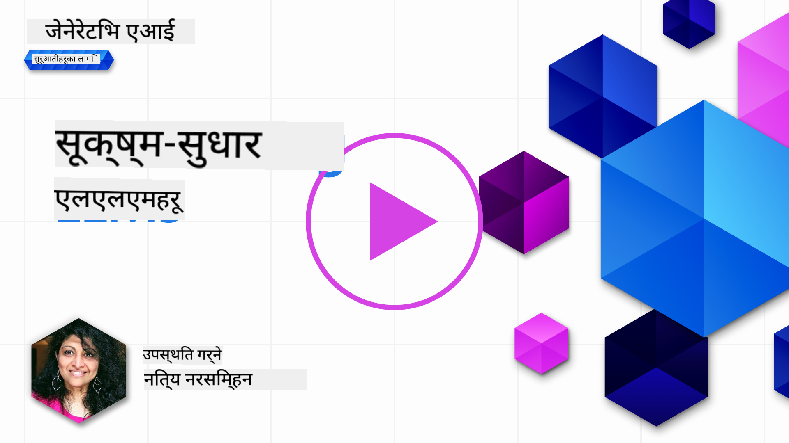
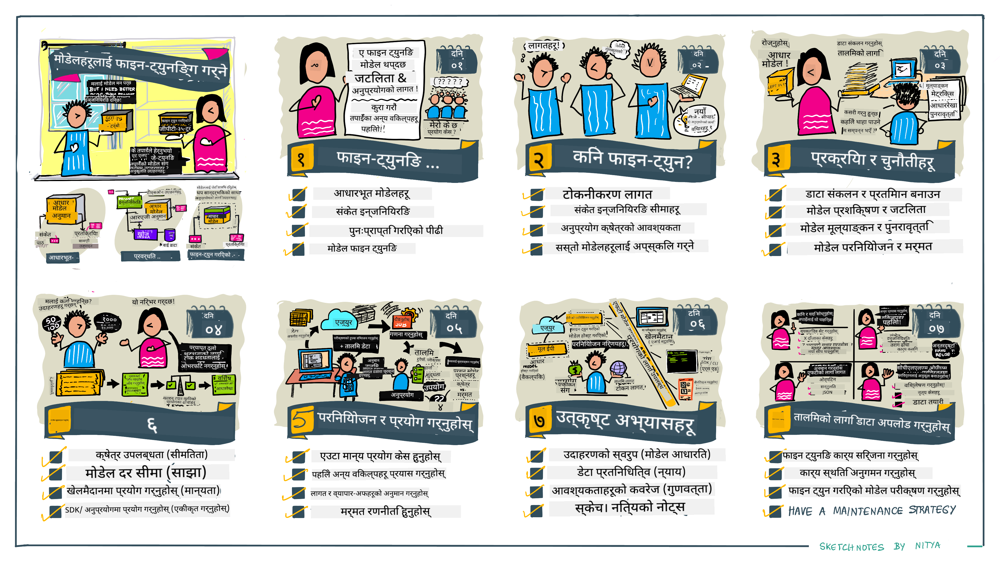

<!--
CO_OP_TRANSLATOR_METADATA:
{
  "original_hash": "68664f7e754a892ae1d8d5e2b7bd2081",
  "translation_date": "2025-05-20T07:43:25+00:00",
  "source_file": "18-fine-tuning/README.md",
  "language_code": "ne"
}
-->

# तपाईंको LLM लाई फाइन-ट्यून गर्दै

ठूलो भाषा मोडेलहरू प्रयोग गरेर जेनेरेटिभ AI अनुप्रयोगहरू निर्माण गर्दा नयाँ चुनौतीहरू आउँछन्। एउटा मुख्य समस्या भनेको मोडेलले कुनै निश्चित प्रयोगकर्ता अनुरोधका लागि उत्पन्न गरेको सामग्रीको गुणस्तर (शुद्धता र सान्दर्भिकता) सुनिश्चित गर्नु हो। अघिल्ला पाठहरूमा, हामीले _मोडेलको इनपुटलाई परिवर्तन गरेर_ समस्या समाधान गर्न खोज्ने प्रविधिहरू जस्तै प्रम्प्ट इन्जिनियरिङ र रिट्रिभल-अगमेन्टेड जेनेरेसनको बारेमा छलफल गर्यौं।

आजको पाठमा, हामी तेस्रो प्रविधि, **फाइन-ट्यूनिङ**को बारेमा छलफल गर्छौं, जसले थप डाटा प्रयोग गरेर _मोडेललाई पुनःप्रशिक्षण_ गरेर चुनौतीको समाधान गर्न खोज्छ। विवरणमा जानौं।

## सिकाइ उद्देश्यहरू

यस पाठले पूर्व-प्रशिक्षित भाषा मोडेलहरूको लागि फाइन-ट्यूनिङको अवधारणा प्रस्तुत गर्दछ, यस दृष्टिकोणका फाइदा र चुनौतीहरू अन्वेषण गर्दछ, र तपाईंको जेनेरेटिभ AI मोडेलहरूको प्रदर्शन सुधार गर्न फाइन-ट्यूनिङ कहिले र कसरी प्रयोग गर्ने भनेर मार्गदर्शन प्रदान गर्दछ।

यस पाठको अन्त्यसम्म, तपाईंले निम्न प्रश्नहरूको उत्तर दिन सक्षम हुनुपर्दछ:

- भाषा मोडेलहरूको लागि फाइन-ट्यूनिङ के हो?
- फाइन-ट्यूनिङ कहिले र किन उपयोगी हुन्छ?
- म कसरी पूर्व-प्रशिक्षित मोडेललाई फाइन-ट्यून गर्न सक्छु?
- फाइन-ट्यूनिङका सीमाहरू के हुन्?

तपाईं तयार हुनुहुन्छ? सुरु गरौं।

## चित्रित गाइड

हामीले के कभर गर्नेछौं भन्ने ठूलो चित्र हेर्न चाहनुहुन्छ? यो चित्रित गाइड हेर्नुहोस् जसले यस पाठको लागि सिकाइ यात्रा वर्णन गर्दछ - फाइन-ट्यूनिङको कोर अवधारणाहरू र प्रेरणा सिक्नेदेखि लिएर फाइन-ट्यूनिङ कार्य सम्पन्न गर्नको लागि प्रक्रिया र उत्तम अभ्यासहरू बुझ्नेसम्म। यो अन्वेषणको लागि एक आकर्षक विषय हो, त्यसैले तपाईंको आत्म-निर्देशित सिकाइ यात्रालाई समर्थन गर्न थप लिङ्कहरूको लागि [स्रोतहरू](./RESOURCES.md?WT.mc_id=academic-105485-koreyst) पृष्ठ हेर्न नबिर्सनुहोस्!

## भाषा मोडेलहरूको लागि फाइन-ट्यूनिङ के हो?

परिभाषा अनुसार, ठूला भाषा मोडेलहरू इन्टरनेट लगायत विभिन्न स्रोतहरूबाट प्राप्त ठूलो मात्रामा पाठमा _पूर्व-प्रशिक्षित_ हुन्छन्। जस्तै हामीले अघिल्ला पाठहरूमा सिकेका छौं, हामीलाई प्रयोगकर्ताका प्रश्नहरूको (प्रम्प्टहरूको) उत्तरको गुणस्तर सुधार गर्न _प्रम्प्ट इन्जिनियरिङ_ र _रिट्रिभल-अगमेन्टेड जेनेरेसन_ जस्ता प्रविधिहरू आवश्यक छ।

प्रम्प्ट-इन्जिनियरिङको लोकप्रिय प्रविधि मोडेललाई उत्तरमा के अपेक्षा गरिएको छ भन्ने थप मार्गदर्शन प्रदान गर्ने (स्पष्ट मार्गदर्शन) वा _केही उदाहरणहरू दिने_ (अप्रत्यक्ष मार्गदर्शन) समावेश गर्दछ। यसलाई _फ्यू-शट लर्निङ_ भनिन्छ तर यसका दुई सीमाहरू छन्:

- मोडेल टोकन सीमा तपाईंले दिन सक्ने उदाहरणहरूको संख्या सीमित गर्न सक्छ, र प्रभावकारिता सीमित गर्न सक्छ।
- मोडेल टोकन लागतले प्रत्येक प्रम्प्टमा उदाहरणहरू थप्न महँगो बनाउन सक्छ, र लचिलोपन सीमित गर्न सक्छ।

फाइन-ट्यूनिङ मेशिन लर्निङ प्रणालीहरूमा सामान्य अभ्यास हो जहाँ हामीले पूर्व-प्रशिक्षित मोडेललाई लिई नयाँ डाटासँग पुनःप्रशिक्षण गरेर विशेष कार्यमा यसको प्रदर्शन सुधार गर्दछौं। भाषा मोडेलहरूको सन्दर्भमा, हामीले पूर्व-प्रशिक्षित मोडेललाई _दिएको कार्य वा अनुप्रयोग डोमेनको लागि क्युरेट गरिएको उदाहरणहरूको सेट_सँग फाइन-ट्यून गर्न सक्छौं जसले त्यस विशेष कार्य वा डोमेनका लागि बढी शुद्ध र सान्दर्भिक **कस्टम मोडेल** सिर्जना गर्न सक्छ। फाइन-ट्यूनिङको एक साइड-फाइदा भनेको यसले फ्यू-शट लर्निङको लागि आवश्यक उदाहरणहरूको संख्या घटाउन सक्छ - टोकनको प्रयोग र सम्बन्धित लागत घटाउँदै।

## कहिले र किन मोडेलहरूलाई फाइन-ट्यून गर्नुपर्छ?

_यो_ सन्दर्भमा, जब हामी फाइन-ट्यूनिङको कुरा गर्छौं, हामी **सुपरभाइज्ड** फाइन-ट्यूनिङको कुरा गर्दैछौं जहाँ पुनःप्रशिक्षण **नयाँ डाटा थपेर** गरिन्छ जुन मूल प्रशिक्षण डेटासेटको हिस्सा थिएन। यो अनसुपरभाइज्ड फाइन-ट्यूनिङ दृष्टिकोणबाट फरक छ जहाँ मोडेललाई मूल डाटामा पुनःप्रशिक्षण गरिन्छ, तर विभिन्न हाइपरप्यारामिटरहरूसँग।

स्मरणीय कुरा के हो भने फाइन-ट्यूनिङ एक उन्नत प्रविधि हो जसले अपेक्षित परिणामहरू प्राप्त गर्न निश्चित स्तरको विशेषज्ञता आवश्यक पर्छ। यदि गलत गरियो भने, यसले अपेक्षित सुधारहरू प्रदान नगर्न सक्छ, र तपाईंको लक्षित डोमेनको लागि मोडेलको प्रदर्शनलाई पनि घटाउन सक्छ।

त्यसैले, तपाईंले भाषा मोडेलहरूलाई कसरी फाइन-ट्यून गर्ने भन्ने सिक्नुभन्दा पहिले, तपाईंले किन यो मार्ग अपनाउनु पर्छ, र फाइन-ट्यूनिङ प्रक्रिया कहिले सुरु गर्ने भनेर जान्नु आवश्यक छ। यी प्रश्नहरू सोधेर सुरु गर्नुहोस्:

- **प्रयोग केस**: तपाईंको फाइन-ट्यूनिङको _प्रयोग केस_ के हो? तपाईंले हालको पूर्व-प्रशिक्षित मोडेलको कुन पक्ष सुधार गर्न चाहनुहुन्छ?
- **वैकल्पिकहरू**: तपाईंले इच्छित परिणामहरू प्राप्त गर्न _अन्य प्रविधिहरू_ प्रयास गर्नुभएको छ? तिनीहरूलाई तुलना गर्नको लागि आधाररेखा बनाउन प्रयोग गर्नुहोस्।
  - प्रम्प्ट इन्जिनियरिङ: प्रासंगिक प्रम्प्ट प्रतिक्रियाहरूका उदाहरणहरू सहित फ्यू-शट प्रम्प्टिङ जस्ता प्रविधिहरू प्रयास गर्नुहोस्। प्रतिक्रियाहरूको गुणस्तर मूल्याङ्कन गर्नुहोस्।
  - रिट्रिभल अगमेन्टेड जेनेरेसन: तपाईंको डाटाको खोजी गरेर पुनःप्राप्त गरिएको क्वेरी परिणामहरूसँग प्रम्प्टहरू बढाउने प्रयास गर्नुहोस्। प्रतिक्रियाहरूको गुणस्तर मूल्याङ्कन गर्नुहोस्।
- **लागतहरू**: तपाईंले फाइन-ट्यूनिङको लागि लागतहरू पहिचान गर्नुभएको छ?
  - ट्युनिङ क्षमता - के पूर्व-प्रशिक्षित मोडेल फाइन-ट्यूनिङको लागि उपलब्ध छ?
  - प्रयास - प्रशिक्षण डाटा तयार पार्न, मोडेलको मूल्याङ्कन र परिष्कृत गर्न।
  - कम्प्युट - फाइन-ट्यूनिङ काम चलाउन, र फाइन-ट्यून गरिएको मोडेललाई तैनाथ गर्न
  - डाटा - फाइन-ट्यूनिङको प्रभावका लागि पर्याप्त गुणस्तरीय उदाहरणहरूको पहुँच
- **फाइदाहरू**: तपाईंले फाइन-ट्यूनिङको फाइदाहरू पुष्टि गर्नुभएको छ?
  - गुणस्तर - के फाइन-ट्यून गरिएको मोडेलले आधाररेखालाई उछिन्यो?
  - लागत - के यसले प्रम्प्टहरूलाई सरल बनाएर टोकनको प्रयोग घटाउँछ?
  - विस्तारशीलता - के तपाईंले नयाँ डोमेनहरूको लागि आधार मोडेललाई पुनःप्रयोग गर्न सक्नुहुन्छ?

यी प्रश्नहरूको उत्तर दिएर, तपाईंले तपाईंको प्रयोग केसको लागि फाइन-ट्यूनिङ सही दृष्टिकोण हो कि होइन भन्ने निर्णय गर्न सक्षम हुनुहुन्छ। आदर्श रूपमा, दृष्टिकोण केवल लागतहरू भन्दा फाइदाहरू बढी भएमा मात्र मान्य हुन्छ। एकपटक तपाईंले अगाडि बढ्ने निर्णय गर्नुभयो भने, यो पूर्व-प्रशिक्षित मोडेललाई कसरी फाइन-ट्यून गर्न सकिन्छ भनेर सोच्न समय हो।

निर्णय-प्रक्रियामा थप अन्तर्दृष्टि चाहनुहुन्छ? [फाइन-ट्यून गर्न कि नगर्न](https://www.youtube.com/watch?v=0Jo-z-MFxJs) हेर्नुहोस्

## हामी कसरी पूर्व-प्रशिक्षित मोडेललाई फाइन-ट्यून गर्न सक्छौं?

पूर्व-प्रशिक्षित मोडेललाई फाइन-ट्यून गर्न, तपाईंलाई आवश्यक छ:

- फाइन-ट्यून गर्नको लागि एक पूर्व-प्रशिक्षित मोडेल
- फाइन-ट्यूनिङको लागि प्रयोग गर्नको लागि एक डेटासेट
- फाइन-ट्यूनिङ काम चलाउनको लागि एक प्रशिक्षण वातावरण
- फाइन-ट्यून गरिएको मोडेललाई तैनाथ गर्नको लागि एक होस्टिङ वातावरण

## फाइन-ट्यूनिङमा कार्यान्वयन

निम्न स्रोतहरूले चयन गरिएको मोडेल र क्युरेट गरिएको डेटासेट प्रयोग गरेर वास्तविक उदाहरण मार्फत तपाईंलाई मार्गदर्शन गर्न चरण-दर-चरण ट्युटोरियलहरू प्रदान गर्दछ। यी ट्युटोरियलहरू मार्फत काम गर्न, तपाईंलाई विशेष प्रदायकमा खाता आवश्यक छ, साथै सम्बन्धित मोडेल र डेटासेटहरूको पहुँच पनि आवश्यक छ।

| प्रदायक      | ट्युटोरियल                                                                                                                                                                       | विवरण                                                                                                                                                                                                                                                                                                                                                                                                                         |
| ------------ | -------------------------------------------------------------------------------------------------------------------------------------------------------------------------------- | ------------------------------------------------------------------------------------------------------------------------------------------------------------------------------------------------------------------------------------------------------------------------------------------------------------------------------------------------------------------------------------------------------------------------------- |
| OpenAI       | [च्याट मोडेलहरू कसरी फाइन-ट्यून गर्ने](https://github.com/openai/openai-cookbook/blob/main/examples/How_to_finetune_chat_models.ipynb?WT.mc_id=academic-105485-koreyst)                | प्रशिक्षण डाटा तयार पारेर, फाइन-ट्यूनिङ काम चलाएर, र अनुमानको लागि फाइन-ट्यून गरिएको मोडेल प्रयोग गरेर विशेष डोमेन ("रेसिपी सहायक") को लागि `gpt-35-turbo` फाइन-ट्यून गर्न सिक्नुहोस्।                                                                                                                                                                                                                                               |
| Azure OpenAI | [GPT 3.5 टर्बो फाइन-ट्यूनिङ ट्युटोरियल](https://learn.microsoft.com/azure/ai-services/openai/tutorials/fine-tune?tabs=python-new%2Ccommand-line?WT.mc_id=academic-105485-koreyst) | प्रशिक्षण डाटा सिर्जना र अपलोड गर्न कदमहरू लिई फाइन-ट्यूनिङ काम चलाएर **Azure मा** `gpt-35-turbo-0613` मोडेल फाइन-ट्यून गर्न सिक्नुहोस्। नयाँ मोडेल तैनाथ गर्नुहोस् र प्रयोग गर्नुहोस्।                                                                                                                                                                                                                                          |
| Hugging Face | [Hugging Face सँग LLMs लाई फाइन-ट्यूनिङ](https://www.philschmid.de/fine-tune-llms-in-2024-with-trl?WT.mc_id=academic-105485-koreyst)                                               | यो ब्लग पोष्टले Hugging Face मा खुला [datasets](https://huggingface.co/docs/datasets/index?WT.mc_id=academic-105485-koreyst) को साथ [transformers](https://huggingface.co/docs/transformers/index?WT.mc_id=academic-105485-koreyst) लाइब्रेरी र [Transformer Reinforcement Learning (TRL)](https://huggingface.co/docs/trl/index?WT.mc_id=academic-105485-koreyst) प्रयोग गरेर _खुला LLM_ (जस्तै: `CodeLlama 7B`) फाइन-ट्यूनिङ गर्दैछ। |
|              |                                                                                                                                                                                    |                                                                                                                                                                                                                                                                                                                                                                                                                               |
| 🤗 AutoTrain | [AutoTrain सँग LLMs लाई फाइन-ट्यूनिङ](https://github.com/huggingface/autotrain-advanced/?WT.mc_id=academic-105485-koreyst)                                                         | AutoTrain (वा AutoTrain Advanced) Hugging Face द्वारा विकसित एक पायथन लाइब्रेरी हो जसले LLM फाइन-ट्यूनिङ सहित धेरै विभिन्न कार्यहरूको लागि फाइनट्यूनिङलाई अनुमति दिन्छ। AutoTrain एउटा नो-कोड समाधान हो र फाइनट्यूनिङ तपाईंको आफ्नै क्लाउडमा, Hugging Face Spaces मा वा स्थानीय रूपमा गर्न सकिन्छ। यसले वेब-आधारित GUI, CLI र yaml कन्फिग फाइलहरू मार्फत प्रशिक्षणलाई समर्थन गर्दछ।                                                                                 |
|              |                                                                                                                                                                                    |                                                                                                                                                                                                                                                                                                                                                                                                                               |

## असाइनमेन्ट

माथिका ट्युटोरियलहरू मध्ये एउटा चयन गर्नुहोस् र तिनीहरू मार्फत जानुहोस्। _हामीले यस रिपोमा केवल सन्दर्भका लागि यी ट्युटोरियलहरूको संस्करणलाई Jupyter नोटबुकहरूमा पुन: सिर्जना गर्न सक्छौं। कृपया नवीनतम संस्करणहरू प्राप्त गर्न मूल स्रोतहरू प्रत्यक्ष रूपमा प्रयोग गर्नुहोस्_।

## राम्रो काम! तपाईंको सिकाइ जारी राख्नुहोस्।

यस पाठ पूरा गरेपछि, हाम्रो [जेनेरेटिभ AI सिकाइ सङ्ग्रह](https://aka.ms/genai-collection?WT.mc_id=academic-105485-koreyst) हेर्नुहोस् र तपाईंको जेनेरेटिभ AI ज्ञानलाई स्तरवृद्धि गर्न जारी राख्नुहोस्!

बधाई छ!! तपाईंले यस पाठ्यक्रमको v2 श्रृङ्खलाको अन्तिम पाठ पूरा गर्नुभएको छ! सिक्न र निर्माण गर्न रोक्नुहोस्। \*\*यस विषयको लागि थप सुझावहरूको सूचीको लागि [स्रोतहरू](RESOURCES.md?WT.mc_id=academic-105485-koreyst) पृष्ठ जाँच गर्नुहोस्।

हाम्रो v1 श्रृङ्खलाका पाठहरू पनि थप असाइनमेन्ट र अवधारणाहरूको साथ अद्यावधिक गरिएको छ। त्यसैले तपाईंको ज्ञानलाई ताजा गर्न एक मिनेट लिनुहोस् - र कृपया [तपाईंका प्रश्नहरू र प्रतिक्रियाहरू](https://github.com/microsoft/generative-ai-for-beginners/issues?WT.mc_id=academic-105485-koreyst) साझा गर्नुहोस् ताकि हामी यी पाठहरूलाई समुदायको लागि सुधार गर्न मद्दत गर्न सकौं।

**अस्वीकरण**:  
यो दस्तावेज AI अनुवाद सेवा [Co-op Translator](https://github.com/Azure/co-op-translator) प्रयोग गरेर अनुवाद गरिएको छ। हामी शुद्धताको लागि प्रयास गर्दाछौं, कृपया ध्यान दिनुहोस् कि स्वचालित अनुवादहरूमा त्रुटिहरू वा अशुद्धताहरू हुन सक्छ। यसको मूल भाषा मा रहेको दस्तावेजलाई आधिकारिक स्रोत मानिनु पर्दछ। महत्वपूर्ण जानकारीको लागि, पेशेवर मानव अनुवाद सिफारिस गरिन्छ। यस अनुवादको प्रयोगबाट उत्पन्न हुने कुनै पनि गलतफहमी वा गलत व्याख्या को लागि हामी जिम्मेवार छैनौं।