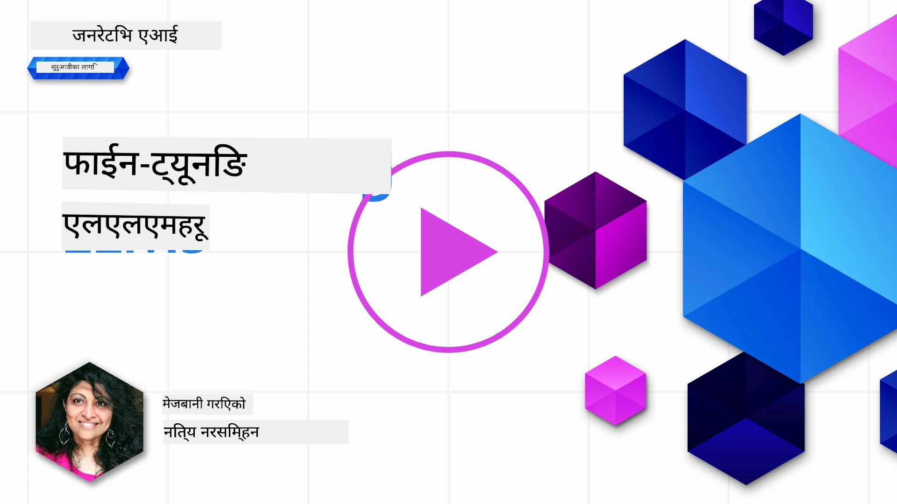
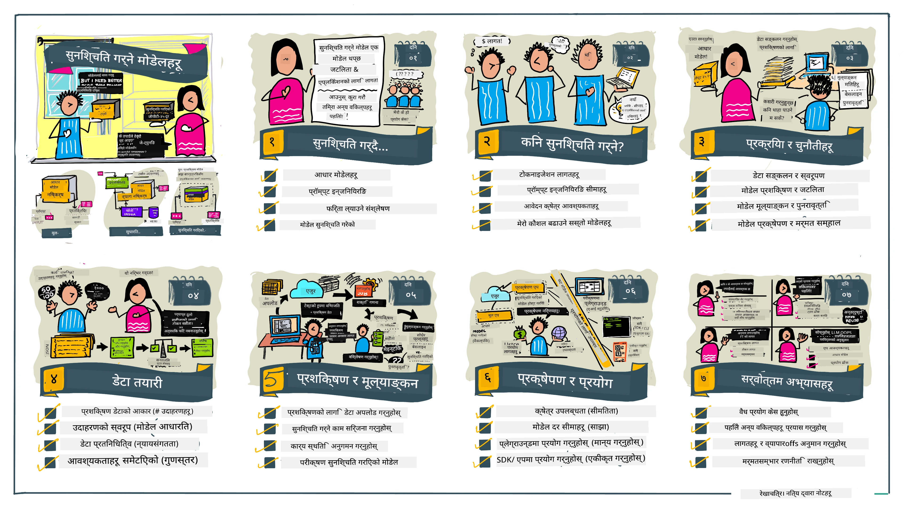

# तपाईंको LLM लाई फाइन-ट्युनिंग

ठूला भाषा मोडेलहरू प्रयोग गरेर जेनेरेटिभ एआई अनुप्रयोगहरू बनाउने क्रममा नयाँ चुनौतीहरू आउँछन्। मुख्य समस्या भनेको दिइएको प्रयोगकर्ता अनुरोधको लागि मोडेलले उत्पादन गरेको सामग्रीमा प्रतिक्रियाको गुणस्तर (सटीकता र सान्दर्भिकता) सुनिश्चित गर्नु हो। पहिलेका पाठहरूमा, हामीले प्रम्प्ट इञ्जिनियरिङ र रिट्रिभल-अग्मेन्टेड जेनेरेशनजस्ता प्रविधिहरू छलफल गर्यौँ जसले _अवस्थित मोडेलको प्रम्प्ट इनपुट परिवर्तन गरेर_ समस्यालाई समाधान गर्ने प्रयास गर्छन्।

आजको पाठमा, हामी तेस्रो प्रविधि, **फाइन-ट्युनिङ** बारे कुरा गर्छौँ, जसले _थप डाटासँग मोडेललाई पुन: प्रशिक्षण गरेर_ चुनौतीलाई समाधान गर्ने प्रयास गर्दछ। आउनुहोस्, विवरणहरूमा जाऔं।

## सिकाइ उद्देश्यहरू

यस पाठले पूर्व-प्रशिक्षित भाषा मोडेलहरूको फाइन-ट्युनिंग अवधारणा परिचय गराउँछ, यस दृष्टिकोणका लाभ र चुनौतीहरू अन्वेषण गर्छ, र तपाईंको जेनेरेटिभ एआई मोडेलहरूको प्रदर्शन सुधार्न फाइन-ट्युनिंग कहिले र कसरी प्रयोग गर्ने भन्ने बारे मार्गदर्शन प्रदान गर्छ।

यो पाठको अन्त्यमा, तपाईंले निम्न प्रश्नहरूको उत्तर दिन सक्नु पर्छ:

- भाषा मोडेलहरूको फाइन-ट्युनिंग के हो?
- कहिले, र किन, फाइन-ट्युनिङ उपयोगी छ?
- म पूर्व-प्रशिक्षित मोडेललाई कसरी फाइन-ट्युनिङ गर्न सक्छु?
- फाइन-ट्युनिङका सीमाहरू के-के हुन्?

तयार? शुरू गरौं।

## चित्रण गरिएको मार्गदर्शक

हामीले के समेट्नेछौं भनी ठुलो तस्बिर थाहा पाउन चाहनुहुन्छ? यो चित्रण गरिएको मार्गदर्शक हेर्नुहोस् जसले यस पाठको लागि सिकाइ यात्रालाई वर्णन गर्दछ - फाइन-ट्युनिङका मुख्य अवधारणाहरू र प्रेरणाबाट शुरू गरेर प्रक्रिया बुझ्न र फाइन-ट्युनिङ कार्य सम्पन्न गर्ने उत्तम अभ्यासहरू बारे। यो एक्सप्लोरेशनको लागि रोचक विषय हो, त्यसैले आफ्नै सिकाइ यात्रालाई समर्थन गर्न थप लिंकहरूको लागि [संसाधनहरू](./RESOURCES.md?WT.mc_id=academic-105485-koreyst) पृष्ठ अवश्य हेर्नुहोस्!

## भाषा मोडेलहरूको लागि फाइन-ट्युनिङ के हो?

परिभाषा अनुसार, ठूलो भाषा मोडेलहरू विभिन्न स्रोतहरूबाट, इन्टरनेटसमेत, ठूला मात्रामा पाठमा _पूर्व-प्रशिक्षित_ हुन्छन्। हामीले पहिलेका पाठहरूमा सिकेझैं, मोडेलको प्रयोगकर्ताको प्रश्न ("प्रम्प्ट") प्रति प्रतिक्रियाको गुणस्तर सुधार गर्न हामीलाई _प्रम्प्ट इञ्जिनियरिङ_ र _रिट्रिभल-अग्मेन्टेड जेनेरेशन_ जस्ता प्रविधिहरू आवश्यक पर्छ।

सामान्य प्रम्प्ट-इञ्जिनियरिङ प्रविधिमा मोडेललाई थप निर्देशन दिने समावेश हुन्छ जुन यसको प्रतिक्रियामा के अपेक्षित छ भनेर स्पष्ट (निर्देशन) वा केही उदाहरणहरू दिइरहने (अप्रत्यक्ष निर्देशन) गरी। यसलाई _फ्यु-शट लर्निङ_ भनिन्छ तर यसमा दुई सीमितताहरू छन्:

- मोडेल टोकन सीमाहरूले तपाईंले दिन सक्ने उदाहरणहरूको सङ्ख्या सीमित गर्न सक्छ र प्रभावकारितामा सिमितता ल्याउन सक्छ।
- मोडेल टोकन लागतले हरेक प्रम्प्टमा उदाहरण थप्न महँगो बनाउन सक्छ र लचकता सीमित गर्छ।

फाइन-ट्युनिङ मेसिन लर्निङ प्रणालीहरूमा प्राय: प्रयोग गरिएको अभ्यास हो जहाँ हामी पूर्व-प्रशिक्षित मोडेललाई नयाँ डाटासँग पुनः प्रशिक्षण गर्छौँ ताकि विशेष कार्यमा यसको प्रदर्शन सुधार होस्। भाषा मोडेलहरूको सन्दर्भमा, हामी पूर्व-प्रशिक्षित मोडेललाई _दिईएको कार्य वा अनुप्रयोग क्षेत्रमा क्युरेटेड उदाहरणहरूको सेटसहित फाइन-ट्युनिङ गरेर_ एक **पसन्द मोडेल** सिर्जना गर्न सक्छौँ जुन त्यो विशेष कार्य वा क्षेत्रको लागि बढी सटीक र सान्दर्भिक हुन सक्छ। फाइन-ट्युनिङको एक पक्षीय लाभ भनेको यसले फ्यु-शट लर्निङका लागि आवश्यक उदाहरणहरूको सङ्ख्या पनि घटाउन सक्छ - जसले टोकन प्रयोग र सम्बन्धित लागतहरू कम गर्दछ।

## कहिले र किन हामीले मोडेलहरू फाइन-ट्युनिङ गर्नुपर्छ?

यस सन्दर्भमा, जब हामी फाइन-ट्युनिङको कुरा गर्छौं, हामी **सुपरभाइज्ड** फाइन-ट्युनिङ बुझाउँछौं जहाँ पुनः प्रशिक्षण **नयाँ डेटा थपेर** गरिन्छ जुन मूल प्रशिक्षण डाटासेटको हिस्सा थिएन। यो आफू डाटामा होइन तर फरक हाइपरप्यारामिटरहरूसँग मोडेल पुनः प्रशिक्षण गर्ने अनसुपरभाइज्ड फाइन-ट्युनिङ विधिबाट भिन्न हुन्छ।

महत्वपूर्ण कुरा याद राख्नुहोस् कि फाइन-ट्युनिङ एक उच्च स्तरीय प्रविधि हो जसलाई इच्छित नतिजा हासिल गर्न निश्चित स्तरको विशेषज्ञता आवश्यक पर्छ। यदि गलत गरेमा, यसले अपेक्षित सुधारहरू नदिन सक्छ, र तपाईँको लक्षित क्षेत्रको लागि मोडेलको प्रदर्शनमा गिरावट ल्याउन सक्छ।

त्यसैले, भाषा मोडेलहरूलाई "कसरी" फाइन-ट्युनिङ गर्ने सिक्नु अघि, तपाईंले थाहा पाउनु पर्छ "किन" यो मार्ग अवलम्बन गर्ने र "कहिले" फाइन-ट्युनिङ प्रक्रिया सुरु गर्ने। आफूलाई यी प्रश्नहरू सोध्नुस्:

- **प्रयोग केस**: तपाईंको फाइन-ट्युनिङको _प्रयोग केस_ के हो? हालको पूर्व-प्रशिक्षित मोडेलको कुन पाटोलाई तपाईं सुधार गर्न चाहनुहुन्छ?
- **वैकल्पिकहरू**: तपाईंले चाहना अनुसार परिणाम प्राप्त गर्न _अन्य प्रविधिहरू_ प्रयास गर्नुभएको छ? तिनीहरूलाई तुलना गर्न आधार रेखा बनाउन प्रयोग गर्नुहोस्।
  - प्रम्प्ट इञ्जिनियरिङ: सान्दर्भिक प्रम्प्ट प्रतिक्रियाहरूका उदाहरणहरू सहित फ्यु-शट प्रम्प्टिङ प्रयास गर्नुहोस्। प्रतिक्रियाको गुणस्तर मूल्यांकन गर्नुहोस्।
  - रिट्रिभल अग्मेन्टेड जेनेरेशन: आफ्नो डाटाबाट खोजी गरेर प्राप्त क्वेरी परिणामले प्रम्प्ट थप्नुहोस्। प्रतिक्रियाको गुणस्तर मूल्यांकन गर्नुहोस्।
- **लागतहरू**: तपाईंले फाइन-ट्युनिङका लागि लागतहरू पहिचान गर्नुभएको छ?
  - ट्युनबिलिटी - के पूर्व-प्रशिक्षित मोडेल फाइन-ट्युनिङको लागि उपलब्ध छ?
  - प्रयास - प्रशिक्षण डेटा तयार पार्न, मोडेलको मूल्याङ्कन र सुधार्नको लागि।
  - कम्प्युट - फाइन-ट्युनिङ कार्यहरू चलाउन र फाइन-ट्युन गरिएको मोडेल तैनाथ गर्न।
  - डेटा - फाइन-ट्युनिङ प्रभावका लागि पर्याप्त गुणस्तरीय उदाहरणहरूको पहुँच।
- **लाभहरू**: तपाईंले फाइन-ट्युनिङका लाभहरू पुष्टि गर्नुभएको छ?
  - गुणस्तर - के फाइन-ट्युन गरिएको मोडेलले आधार रेखालाई पार ग¥यो?
  - लागत - के यसले प्रम्प्टहरू सरल बनाएर टोकन प्रयोग घटाउँछ?
  - विस्तारशीलता - के तपाईं आधार मोडेललाई नयाँ क्षेत्रहरूका लागि पुन: उपयोग गर्न सक्नुहुन्छ?

यी प्रश्नहरूको उत्तर दिँदा, तपाईंले यो निर्णय गर्न सक्नु हुनेछ कि फाइन-ट्युनिङ तपाईंको प्रयोग केसका लागि सही उपाय हो कि होइन। आदर्श रूपमा, यो उपाय लाभले लागतलाई भन्दा बढी भए मात्र मान्य हुन्छ। निर्णय गरेपछि अब सोच्नुपर्ने हुन्छ कि पूर्व-प्रशिक्षित मोडेललाई _कसरी_ फाइन-ट्युन गर्न सकिन्छ।

निर्णय गर्ने प्रक्रियामा थप दृष्टिकोणहरू चाहानुहुन्छ? [To fine-tune or not to fine-tune](https://www.youtube.com/watch?v=0Jo-z-MFxJs) भिडियो हेर्नुहोस्।

## हामी पूर्व-प्रशिक्षित मोडेललाई कसरी फाइन-ट्युन गर्न सक्छौं?

पूर्व-प्रशिक्षित मोडेललाई फाइन-ट्युन गर्न तपाईंलाई चाहिन्छ:

- फाइन-ट्युन गर्नको लागि पूर्व-प्रशिक्षित मोडेल
- फाइन-ट्युनिङका लागि डेटासेट
- फाइन-ट्युनिङ कार्य चलाउन प्रशिक्षण वातावरण
- फाइन-ट्युन गरिएको मोडेल तैनाथ गर्न होस्टिङ वातावरण

## फाइन-ट्युनिङ कार्यमा

तलका स्रोतहरूले तपाईंलाई चयनित मोडेल र क्युरेट गरिएको डेटासेट प्रयोग गरी वास्तविक उदाहरणमा कदम-दर-कदम ट्यूटोरियलहरू प्रदान गर्छन्। यी ट्यूटोरियलहरू अघि बढाउन तपाईंलाई सम्बद्ध प्रदायकसँग खाता र सम्बन्धित मोडेल तथा डेटासेटहरूको पहुँच आवश्यक हुन्छ।

| प्रदायक     | ट्यूटोरियल                                                                                                                                                                       | विवरण                                                                                                                                                                                                                                                                                                                                                                                                                        |
| ------------ | ------------------------------------------------------------------------------------------------------------------------------------------------------------------------------ | ---------------------------------------------------------------------------------------------------------------------------------------------------------------------------------------------------------------------------------------------------------------------------------------------------------------------------------------------------------------------------------------------------------------------------------- |
| OpenAI       | [च्याट मोडेलहरू कसरी फाइन-ट्युन गर्ने](https://github.com/openai/openai-cookbook/blob/main/examples/How_to_finetune_chat_models.ipynb?WT.mc_id=academic-105485-koreyst)                | `gpt-35-turbo` लाई विशिष्ट क्षेत्र ("रेसिपी सहायक") का लागि प्रशिक्षण डेटा तयार पारेर, फाइन-ट्युनिङ कार्य चलाएर र फाइन-ट्युन गरिएको मोडेल प्रयोग गरेर इन्फरेन्स गर्ने तरिका सिक्नुहोस्।                                                                                                                                                                                                                                              |
| Azure OpenAI | [GPT 3.5 Turbo फाइन-ट्युनिङ ट्यूटोरियल](https://learn.microsoft.com/azure/ai-services/openai/tutorials/fine-tune?tabs=python-new%2Ccommand-line?WT.mc_id=academic-105485-koreyst) | Azure मा `gpt-35-turbo-0613` मोडेल फाइन-ट्युन गर्नका लागि प्रशिक्षण डेटा सिर्जना तथा अपलोड गर्ने, फाइन-ट्युनिङ कार्य चलाउने, नयाँ मोडेल तैनाथ गर्ने र प्रयोग गर्ने कदमहरू सिक्नुहोस्।                                                                                                                                                                                                                                                                 |
| Hugging Face | [Hugging Face सँग LLMs को फाइन-ट्युनिङ](https://www.philschmid.de/fine-tune-llms-in-2024-with-trl?WT.mc_id=academic-105485-koreyst)                                               | यस ब्लग पोष्टले तपाईंलाई एक _खुल्ला LLM_ (जस्तै: `CodeLlama 7B`) लाई [transformers](https://huggingface.co/docs/transformers/index?WT.mc_id=academic-105485-koreyst) पुस्तकालय र [Transformer Reinforcement Learning (TRL)](https://huggingface.co/docs/trl/index?WT.mc_id=academic-105485-koreyst) प्रयोग गरी Hugging Face मा खुल्ला [डेटासेटहरू](https://huggingface.co/docs/datasets/index?WT.mc_id=academic-105485-koreyst) सँग कसरी फाइन-ट्युनिङ गर्ने बारे जान्छ। |
|              |                                                                                                                                                                                |                                                                                                                                                                                                                                                                                                                                                                                                                                    |
| 🤗 AutoTrain | [AutoTrain सँग LLMs को फाइन-ट्युनिङ](https://github.com/huggingface/autotrain-advanced/?WT.mc_id=academic-105485-koreyst)                                                         | AutoTrain (वा AutoTrain Advanced) Hugging Face द्वारा विकसित पायथन पुस्तकालय हो जसले ल्लपुर विभिन्न कार्यहरूको फाइन-ट्युनिङ गर्न अनुमति दिन्छ। AutoTrain नोकड समाधान हो र फाइन-ट्युनिङ आफ्नो क्लाउडमा, Hugging Face Spaces मा वा स्थानीय रूपमा गर्न सकिन्छ। यसले वेब-आधारित GUI, CLI र यामल कन्फिग फाइलमार्फत प्रशिक्षणलाई समर्थन गर्छ।                                                                               |
|              |                                                                                                                                                                                |                                                                                                                                                                                                                                                                                                                                                                                                                                    |
| 🦥 Unsloth | [Unsloth सँग LLMs को फाइन-ट्युनिङ](https://github.com/unslothai/unsloth)                                                         | Unsloth एक खुला स्रोत फ्रेमवर्क हो जसले LLM फाइन-ट्युनिङ र रिइन्फोर्समेन्ट लर्निङ (RL) लाई समर्थन गर्दछ। Unsloth स्थानीय प्रशिक्षण, मूल्याङ्कन र तैनाथीकरणलाई तयार-प(dis) [notebooks](https://github.com/unslothai/notebooks) मार्फत सजिलो बनाउँछ। यसले टेक्स्ट-टु-स्पीच (TTS), BERT र मल्टिमोडल मोडेलहरूलाई पनि समर्थन गर्दछ। सुरु गर्न, तिनीहरूको चरण-दर-चरण [LLM फाइन-ट्युनिङ मार्गदर्शक](https://docs.unsloth.ai/get-started/fine-tuning-llms-guide) पढ्नुहोस्।                                                                          |
|              |                                                                                                                                                                                |                                                                                                                                                                                                                                                                                                                                                                                                                                    |
## असाइनमेन्ट

माथिका ट्यूटोरियलहरू मध्ये एउटा छान्नुहोस् र त्यसलाई पूरा गर्नुहोस्। _हामी यी ट्यूटोरियलहरूको एक संस्करण यो रिपोजिटोरीमा Jupyter Notebooks मा सन्दर्भको लागि पुनः सिर्जना गर्न सक्छौं। कृपया ताजा संस्करणहरूका लागि मूल स्रोतहरू प्रत्यक्ष रूपमा प्रयोग गर्नुहोस्_।

## धेरै राम्रो! सिकाइ जारी राख्नुहोस्।

यो पाठ पूरा भएपछि, हाम्रो [जेनेरेटिभ एआई सीख गर्ने सङ्ग्रह](https://aka.ms/genai-collection?WT.mc_id=academic-105485-koreyst) मा हेर्नुहोस् र आफ्नो जेनेरेटिभ एआई ज्ञानलाई निरन्तर उन्नति गर्नुहोस्!

बधाई छ!! तपाईंले यस कोर्सको v2 श्रृंखलाबाट अन्तिम पाठ पूरा गर्नुभयो! सिक्न र निर्माण गर्न रोक्नुहोस् नभन्नुहोस्। \*\*केवल यस विषयका लागि थप सुझावहरूको सूचीको लागि [संसाधनहरू](RESOURCES.md?WT.mc_id=academic-105485-koreyst) पृष्ठ अवश्य हेर्नुहोस्।

हाम्रो v1 श्रृंखलाका पाठहरू पनि थप असाइनमेन्टहरू र अवधारणाहरूको साथ अपडेट गरिएको छ। त्यसैले आफ्नो ज्ञान ताजा पार्न केही समय निकाल्नुहोस् - र कृपया [तपाईंका प्रश्न र प्रतिक्रियाहरू साझा गर्नुहोस्](https://github.com/microsoft/generative-ai-for-beginners/issues?WT.mc_id=academic-105485-koreyst) ताकि हामीले समुदायका लागि यी पाठहरू सुधार गर्न सकौँ।

---

<!-- CO-OP TRANSLATOR DISCLAIMER START -->
**अस्वीकरण**:
यो दस्तावेज AI अनुवाद सेवा [Co-op Translator](https://github.com/Azure/co-op-translator) प्रयोग गरी अनुवाद गरिएको हो। हामी शुद्धताका लागि प्रयासरत छौं, तर कृपया ध्यान दिनुहोस् कि स्वचालित अनुवादमा त्रुटि वा अशुद्धता हुन सक्छ। मूल दस्तावेज यसको मूल भाषामा प्राधिकृत स्रोतको रूपमा मानिनुपर्छ। महत्वपूर्ण जानकारीका लागि व्यावसायिक मानवीय अनुवाद सिफारिस गरिन्छ। यस अनुवादको प्रयोगबाट उत्पन्न हुने कुनै पनि गलतफहमी वा गलत व्याख्याका लागि हामी जिम्मेवार छैनौं।
<!-- CO-OP TRANSLATOR DISCLAIMER END -->