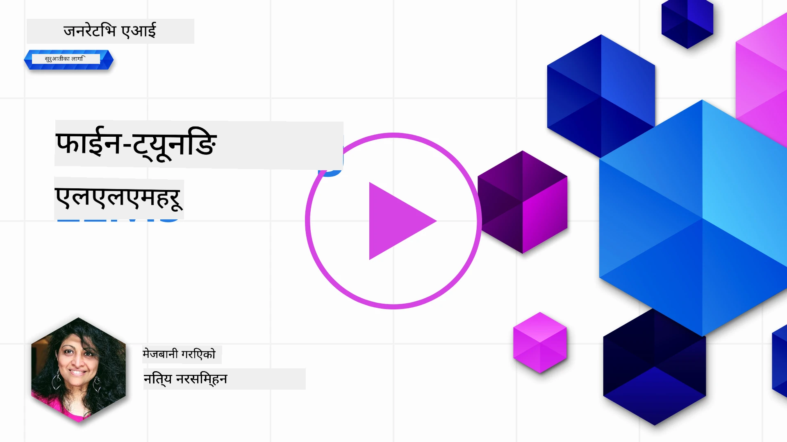
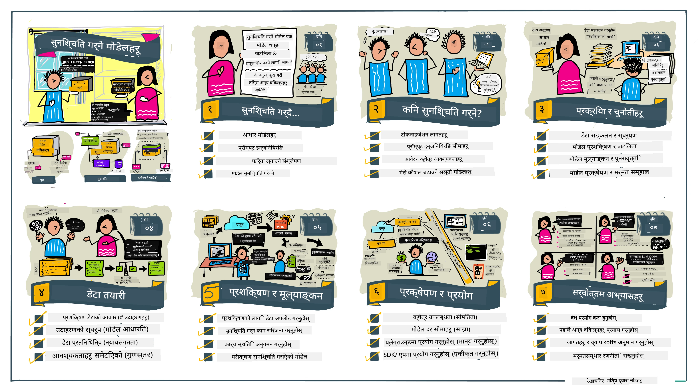

# तपाईंको LLM लाई फाइन-ट्यूनिङ

ठूला भाषा मोडेलहरूलाई जेनेरेटिभ AI अनुप्रयोगहरू बनाउन प्रयोग गर्दा नयाँ चुनौतीहरू सामना गर्नुपर्छ। मुख्य समस्या भनेको मोडेलले कुनै प्रयोगकर्ता अनुरोधका लागि उत्पन्न गर्ने सामग्रीमा जवाफको गुणस्तर (सटीकता र सान्दर्भिकता) सुनिश्चित गर्नु हो। पहिलेका पाठहरूमा, हामीले प्रॉम्प्ट इन्जिनियरिङ्ग र पुनःप्राप्ति-समृद्ध सृजनशीलता जस्ता प्रविधिहरूको चर्चा गरेका थियौं, जसले _अस्तित्वमा रहेका मोडेलमा प्रॉम्प्ट इनपुटलाई परिमार्जन गरेर_ समस्या समाधान गर्ने प्रयास गर्छन्।

आजको पाठमा, हामी तेस्रो प्रविधि, **फाइन-ट्यूनिङ** मा छलफल गर्नेछौं, जसले _थप डाटा प्रयोग गरेर मोडेललाई आफैंलाई पुन:प्रशिक्षण गरेर_ चुनौती समाधान गर्ने प्रयास गर्छ। विवरणमा जाने गरौं।

## सिकाइका उद्देश्यहरू

यो पाठले पूर्व-प्रशिक्षित भाषा मोडेलहरूका लागि फाइन-ट्यूनिङको अवधारणा प्रस्तुत गर्दछ, यस दृष्टिकोणका लाभ र चुनौतीहरू अन्वेषण गर्दछ, र तपाईंका जेनेरेटिभ AI मोडेलहरूको कार्यक्षमता सुधार गर्न फाइन-ट्यूनिङ कहिले र कसरी प्रयोग गर्ने भन्ने बारे मार्गनिर्देशन प्रदान गर्दछ।

यो पाठ सकिएपछि, तपाईंले तलका प्रश्नहरूको उत्तर दिन सक्षम हुनु पर्नेछ:

- भाषा मोडेलहरूका लागि फाइन-ट्यूनिङ के हो?
- फाइन-ट्यूनिङ कहिले र किन उपयोगी हुन्छ?
- म पूर्व-प्रशिक्षित मोडेललाई कसरी फाइन-ट्यून गर्न सक्छु?
- फाइन-ट्यूनिङका के-के सीमाहरू छन्?

तयार हुनु भयो? सुरु गरौं।

## चित्रण गरिएको मार्गदर्शन

अघिल्लो डुबुल्की मार्नु अघि हामीले समेट्ने विषयहरूको ठूला चित्रहरू पहिल्याउन चाहनुहुन्छ? यस चित्रण गरिएको मार्गदर्शनलाई हेरौँ जसले फाइन-ट्यूनिङको मूल अवधारणा र प्रेरणादेखि प्रक्रिया र उत्तम अभ्यासहरू बुझ्नमा मद्दत गर्छ। यो खोजको लागि मनमोहक विषय हो, त्यसैले आफ्नो स्व-निर्देशित सिकाइ यात्राका लागि थप लिंकहरू पाउन [Sources](./RESOURCES.md?WT.mc_id=academic-105485-koreyst) पृष्ठ हेर्न नबिर्सनुहोस्!

## भाषा मोडेलहरूको लागि फाइन-ट्यूनिङ के हो?

परिभाषाअनुसार, ठूलो भाषा मोडेलहरू इन्टरनेट लगायत विभिन्न स्रोतहरूबाट ठूलो मात्रामा पाठमा _पूर्व-प्रशिक्षित_ हुन्छन्। पूर्वका पाठहरूमा हामीले सिक्यौं कि मोडेलको प्रयोगकर्ताको प्रश्नहरू ("प्रॉम्प्टहरू") प्रति जवाफको गुणस्तर सुधार्न _प्रॉम्प्ट इन्जिनियरिङ्ग_ र _पुनःप्राप्ति-समृद्ध सृजनशीलता_ जस्ता प्रविधिहरू आवश्यक हुन्छन्।

एक लोकप्रिय प्रॉम्प्ट-इन्जिनियरिङ्ग प्रविधि भनेको मोडेललाई थप निर्देशनहरू दिएर जवाफका लागि के अपेक्षा गरिएको छ भन्ने स्पष्ट पार्नु हो, वा केही उदाहरणहरू (अप्रत्यक्ष निर्देशन) दिनु हो। यसलाई _थोरै-शट सिकाइ_ भनिन्छ तर यसका दुई सीमाहरू छन्:

- मोडेल टोकन सिमाहरूले तपाईंले दिन सक्ने उदाहरणहरूको संख्या सीमित गर्न सक्छ, जसले प्रभावकारितामा असर गर्छ।
- मोडेल टोकन लागतले प्रत्येक प्रॉम्प्टमा उदाहरण थप्नु महँगो बनाउन सक्छ र लचिलोपन सीमित गर्न सक्छ।

फाइन-ट्यूनिङ भनेको मेसिन लर्निङ सिस्टमहरूमा सामान्य अभ्यास हो जहाँ हामी पूर्व-प्रशिक्षित मोडेल लिएर नयाँ डाटाले पुन:प्रशिक्षण गर्छौं ताकि विशिष्ट कार्यमा यसको प्रदर्शन सुधार होस्। भाषा मोडेलको सन्दर्भमा, हामी पूर्व-प्रशिक्षित मोडेललाई _विशेष कार्य वा अनुप्रयोग डोमेनका लागि छनोट गरिएका उदाहरणहरूको सेटसँग_ फाइन-ट्यून्ग गरेर **अनुकूलित मोडेल** बनाउन सक्छौं जुन त्यो कार्य वा डोमेनका लागि अधिक सटीक र सान्दर्भिक हुन सक्छ। फाइन-ट्यूनिङको एक पक्षीय लाभ भनेको यसले थोरै-शट सिकाइमा आवश्यक उदाहरणहरूको संख्या पनि घटाउन सक्छ - जसले टोकन प्रयोग र लागत कम गर्छ।

## मोडेलहरू कहिले र किन फाइन-ट्यून गर्ने?

_यस_ सन्दर्भमा, फाइन-ट्यूनिङ भन्नाले हामी **निगरानी गरिएको** फाइन-ट्यूनिङलाई जनाउँदैछौं जहाँ पुन:प्रशिक्षण **नयाँ डाटा थपेर** गरिन्छ जुन मूल प्रशिक्षण डाटासेटको भाग थिएन। यो मूल डाटामा भिन्न हाइपरप्यारामिटरहरू प्रयोग गरेर मोडेललाई पुन:प्रशिक्षण गर्ने निगरानीरहित फाइन-ट्यूनिङबाट भिन्न छ।

महत्वपूर्ण कुरा के हो भने, फाइन-ट्यूनिङ उन्नत प्रविधि हो जसका लागि इच्छित परिणामहरू प्राप्त गर्न निश्चित स्तरको विशेषज्ञता आवश्यक पर्छ। यदि गलत तरिकाले गरियो भने, अपेक्षित सुधार नआउन सक्छ र तपाईंको लक्षित डोमेनको लागि मोडेलको प्रदर्शनमा पनि गिरावट आउन सक्छ।

त्यसैले, "कसरी" फाइन-ट्यून गर्ने सिक्नु अघि, तपाईंले जान्नुपर्छ "किन" यो मार्ग लिनुपर्छ र "कहिले" फाइन-ट्यूनिङ प्रक्रिया सुरू गर्नुपर्छ। आफूलाई यी प्रश्नहरू सोध्नुहोस्:

- **प्रयोग केस**: तपाईंको फाइन-ट्यूनिङको _प्रयोग केस_ के हो? वर्तमान पूर्व-प्रशिक्षित मोडेलको कुन पक्षमा सुधार गर्न चाहनुहुन्छ?
- **वैकल्पिकहरू**: के तपाईंले पहिला नै इच्छित परिणामका लागि _अन्य प्रविधिहरू_ प्रयास गर्नुभएको छ? यी प्रयोग गरेर तुलना गर्न आधार तयार गर्नुहोस्।
  - प्रॉम्प्ट इन्जिनियरिङ्ग: सम्बन्धित प्रॉम्प्ट जवाफका उदाहरणसहित थोरै-शट प्रॉम्प्टिङ प्रयास गर्नुहोस्। जवाफको गुणस्तर मूल्यांकन गर्नुहोस्।
  - पुनःप्राप्ति समृद्ध सृजनशीलता: तपाईंको डाटाबाट प्राप्त क्वेरी परिणामसहित प्रॉम्प्टहरूमा वृद्धि गर्नुहोस्। जवाफको गुणस्तर मूल्यांकन गर्नुहोस्।
- **लागतहरू**: के तपाईंले फाइन-ट्यूनिङका लागतहरूको पहिचान गर्नुभएको छ?
  - ट्यून गर्ने योग्यता - के पूर्व-प्रशिक्षित मोडेल फाइन-ट्यूनिङका लागि उपलब्ध छ?
  - प्रयास - प्रशिक्षण डेटा तयार पार्ने, मोडेल मूल्यांकन र सुधार गर्ने
  - कम्प्युट - फाइन-ट्यूनिङ जॉबहरू चलाउने र फाइन-ट्यून गरिएको मोडेल तैनाथ गर्ने
  - डाटा - फाइन-ट्यूनिङ प्रभावका लागि पर्याप्त गुणस्तरीय उदाहरणहरूको पहुँच
- **लाभहरू**: के तपाईंले फाइन-ट्यूनिङका लाभहरू पुष्टि गर्नुभएको छ?
  - गुणस्तर - के फाइन-ट्यून गरिएको मोडेलले आधारभूत मोडेललाई पार गर्‍यो?
  - लागत - के यसले प्रॉम्प्टलाई सरल बनाउँदै टोकन प्रयोग घटाउँछ?
  - विस्तारयोग्यता - के तपाईं आधारभूत मोडेललाई नयाँ डोमेन्समा पुन: प्रयोग गर्न सक्नुहुन्छ?

यी प्रश्नहरूको उत्तर दिएर, तपाईं आफ्नो प्रयोग केसका लागि फाइन-ट्यूनिङ सही विधि हो कि होइन निर्णय गर्न सक्नुहुनेछ। आदर्श रूपमा, यो विधि तब मात्र मान्य हुन्छ जब लाभहरूले लागतभन्दा बढी हुन्छन्। निर्णय गरेपछि, अब सोच्ने भाषा मोडेललाई _कसरी_ फाइन-ट्यून गर्ने भन्ने कुरा हो।

निर्णय प्रक्रियामा थप बुझाइ चाहनुहुन्छ? [To fine-tune or not to fine-tune](https://www.youtube.com/watch?v=0Jo-z-MFxJs) हेर्नुहोस्

## हामी कसरी पूर्व-प्रशिक्षित मोडेल फाइन-ट्यून गर्न सक्छौं?

पूर्व-प्रशिक्षित मोडेल फाइन-ट्यून गर्न, तपाईंलाई चाहिन्छ:

- फाइन-ट्यून गर्न पूर्व-प्रशिक्षित मोडेल
- फाइन-ट्यूनिङका लागि डाटासेट
- फाइन-ट्यूनिङ जॉब चलाउन प्रशिक्षण वातावरण
- फाइन-ट्यून गरिएको मोडेल तैनाथ गर्न होस्टिङ वातावरण

## कार्यमा फाइन-ट्यूनिङ

तलका स्रोतहरूले एउटा चयनित मोडेल र छनोट गरिएका डाटासेट प्रयोग गरेर वास्तविक उदाहरणमा चरण-दर-चरण ट्युटोरियल प्रदान गर्छन्। यी ट्युटोरियलहरूमा काम गर्न, तपाईंलाई त्यस्तो प्रदायकमा खाता र सम्बद्ध मोडेल तथा डाटासेटहरूको पहुँच आवश्यक छ।

| प्रदायक       | ट्युटोरियल                                                                                                                                                                  | व्याख्या                                                                                                                                                                                                                                                                                                                                                                                                                        |
| ------------- | --------------------------------------------------------------------------------------------------------------------------------------------------------------------------- | ---------------------------------------------------------------------------------------------------------------------------------------------------------------------------------------------------------------------------------------------------------------------------------------------------------------------------------------------------------------------------------------------------------------------------------- |
| OpenAI        | [च्याट मोडेलहरू कसरी फाइन-ट्यून गर्ने](https://github.com/openai/openai-cookbook/blob/main/examples/How_to_finetune_chat_models.ipynb?WT.mc_id=academic-105485-koreyst)          | एक विशेष डोमेन ("रेसिपी सहायक") का लागि `gpt-35-turbo` लाई फाइन-ट्यून गर्ने तरिका सिक्नुहोस् जसमा प्रशिक्षण डेटा तयार पार्ने, फाइन-ट्यूनिङ जॉब चलाउने, र फाइन-ट्यून गरिएको मोडेललाई पूर्वानुमानका लागि प्रयोग गर्ने समावेश छ।                                                                                                                                                                                                                       |
| Azure OpenAI  | [GPT 3.5 Turbo फाइन-ट्यूनिङ ट्युटोरियल](https://learn.microsoft.com/azure/ai-services/openai/tutorials/fine-tune?tabs=python-new%2Ccommand-line&WT.mc_id=academic-105485-koreyst) | Azure मा `gpt-35-turbo-0613` मोडेललाई फाइन-ट्यून गर्ने तरिका सिक्नुहोस् जसमा प्रशिक्षण डेटा सिर्जना र अपलोड गर्ने कदमहरू, फाइन-ट्यूनिङ जॉब चलाउने, नयाँ मोडेल तैनाथ गर्ने र प्रयोग गर्ने मौका पाउनुहुन्छ।                                                                                                                                                                                                                                                 |
| Hugging Face  | [Hugging Face सँग LLMs फाइन-ट्यूनिङ](https://www.philschmid.de/fine-tune-llms-in-2024-with-trl?WT.mc_id=academic-105485-koreyst)                                             | यो ब्लग पोष्टले खुला LLM (जस्तै `CodeLlama 7B`) लाई [transformers](https://huggingface.co/docs/transformers/index?WT.mc_id=academic-105485-koreyst) पुस्तकालय र [Transformer Reinforcement Learning (TRL)](https://huggingface.co/docs/trl/index?WT.mc_id=academic-105485-koreyst) प्रयोग गरेर Hugging Face मा खुला [datasets](https://huggingface.co/docs/datasets/index?WT.mc_id=academic-105485-koreyst) सँग कसरी फाइन-ट्यून गर्ने देखाउँछ।             |
|               |                                                                                                                                                                             |                                                                                                                                                                                                                                                                                                                                                                                                                                  |
| 🤗 AutoTrain  | [AutoTrain सँग LLMs फाइन-ट्यूनिङ](https://github.com/huggingface/autotrain-advanced/?WT.mc_id=academic-105485-koreyst)                                                        | AutoTrain (वा AutoTrain Advanced) Hugging Face द्वारा विकास गरिएको एक python पुस्तकालय हो जसले धेरै कार्यहरूको लागि, त्यसमा LLM फाइन-ट्यूनिङ पनि, अनुमति दिन्छ। AutoTrain नो-कोड समाधान हो र फाइन-ट्यूनिङ तपाईंको आफ्नै क्लाउड, Hugging Face Spaces, वा स्थानीय रूपमा गर्न सकिन्छ। यसले वेब-आधारित GUI, CLI र yaml कन्फिग फाइलहरू मार्फत प्रशिक्षण समर्थन गर्छ।                                                                                                       |
|               |                                                                                                                                                                             |                                                                                                                                                                                                                                                                                                                                                                                                                                  |
| 🦥 Unsloth    | [Unsloth सँग LLMs फाइन-ट्यूनिङ](https://github.com/unslothai/unsloth)                                                                                                      | Unsloth खुला स्रोत संरचना हो जसले LLM फाइन-ट्यूनिङ र सुदृढीकरण सिकाइ (RL) समर्थन गर्दछ। Unsloth ले स्थानीय प्रशिक्षण, मूल्यांकन र तैनाथीकरणलाई सजिलो बनाउँछ, प्रयोग गर्न सहज [notebooks](https://github.com/unslothai/notebooks) सहित। यसले पाठ-देखि-स्वर (TTS), BERT र बहुमाध्यम मोडेलहरूलाई पनि समर्थन गर्दछ। सुरु गर्नको लागि, उनीहरूको चरण-दर-चरण [Fine-tuning LLMs Guide](https://docs.unsloth.ai/get-started/fine-tuning-llms-guide) पढ्नुहोस्।                              |
|               |                                                                                                                                                                             |                                                                                                                                                                                                                                                                                                                                                                                                                                  |
## कार्य

माथि दिइएका ट्युटोरियलहरू मध्ये एउटा छान्नुहोस् र त्यसलाई पालना गर्नुहोस्। _हामी यी ट्युटोरियलहरूका संस्करणहरू Jupyter Notebooks मा रेफरेन्सका लागि दोहोर्‍याउन सक्छौं। कृपया सबैभन्दा नयाँ संस्करणहरूका लागि मूल स्रोतहरू सिधै प्रयोग गर्नुहोस्_।

## उत्कृष्ट कार्य! तपाईंको सिकाइ जारी राख्नुहोस्।

यो पाठ सकिसकेपछि, हाम्रो [जेनेरेटिभ AI सिकाइ सङ्ग्रह](https://aka.ms/genai-collection?WT.mc_id=academic-105485-koreyst) हेर्नुहोस् र आफ्नो जेनेरेटिभ AI ज्ञानलाई उचाइमा पुर्‍याउनुहोस्!

बधाई छ!! तपाईंले यस कोर्सको v2 श्रृंखलाको अन्तिम पाठ पूरा गर्नुभयो! सिक्न र निर्माण गर्न रोक्नु हुँदैन। \*\*[RESOURCES](RESOURCES.md?WT.mc_id=academic-105485-koreyst) पृष्ठमा यो विषयका लागि अतिरिक्त सुझावहरूको सूची हेर्नुहोस्।

हाम्रो v1 श्रृंखलाका पाठहरू पनि थप कार्य र अवधारणाहरू सहित अपडेट गरिएका छन्। त्यसैले एक मिनेट लिएर आफ्नो ज्ञान ताजा गर्नुहोस् - र कृपया [तपाईंका प्रश्नहरू र प्रतिक्रिया](https://github.com/microsoft/generative-ai-for-beginners/issues?WT.mc_id=academic-105485-koreyst) साझा गर्नुहोस् जसले समुदायका लागि यी पाठहरू सुधार गर्न मद्दत पुर्याउँछ।

---

<!-- CO-OP TRANSLATOR DISCLAIMER START -->
**अस्वीकरण**:
यो दस्तावेज AI अनुवाद सेवा [Co-op Translator](https://github.com/Azure/co-op-translator) प्रयोग गरी अनुवाद गरिएको हो। हामी शुद्धताको प्रयास गर्छौं, तर कृपया ध्यान दिनुहोस् कि स्वचालित अनुवादमा त्रुटि वा अशुद्धता हुन सक्छ। मूल भाषामा रहेको दस्तावेजलाई आधिकारिक स्रोतको रूपमा मानिनु पर्दछ। महत्वपूर्ण जानकारीका लागि पेशेवर मानव अनुवाद सिफारिस गरिन्छ। यस अनुवादनको प्रयोगबाट हुने कुनै पनि गलतफहमी वा गलत व्याख्याका लागि हामी जिम्मेवार हुने छैनौं।
<!-- CO-OP TRANSLATOR DISCLAIMER END -->