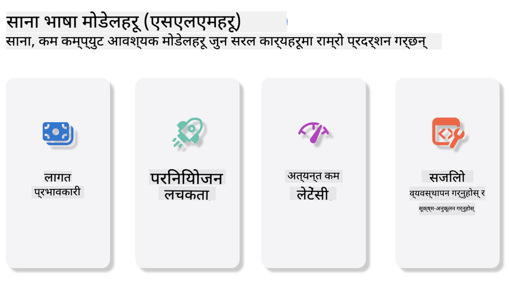
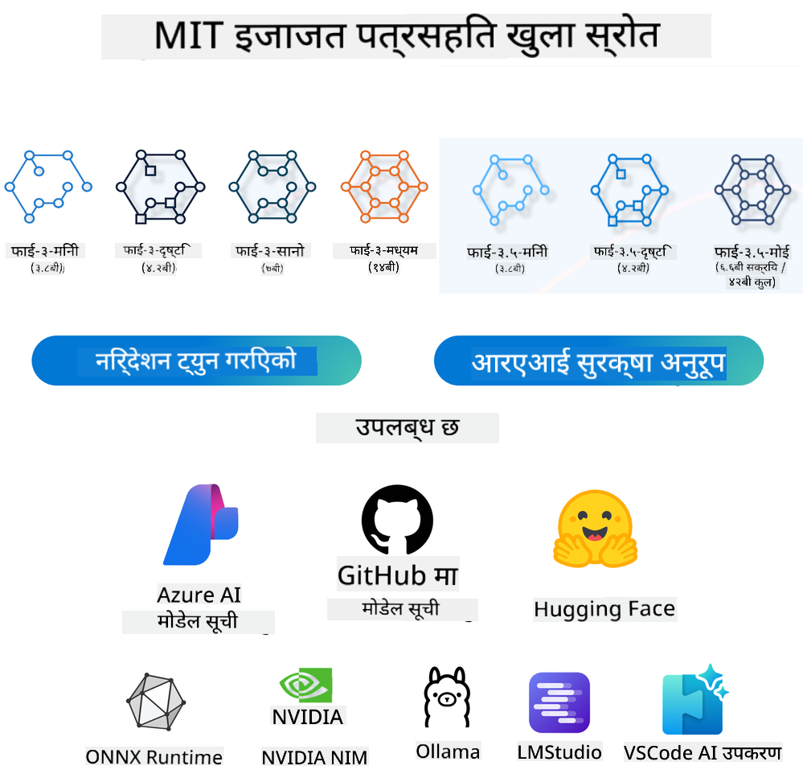
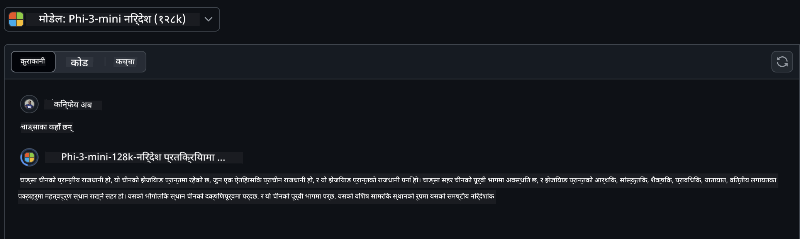
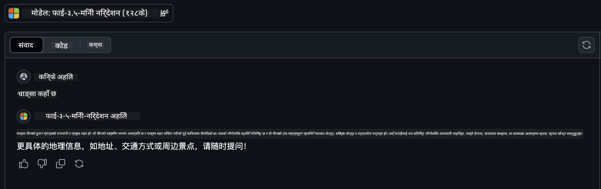

<!--
CO_OP_TRANSLATOR_METADATA:
{
  "original_hash": "124ad36cfe96f74038811b6e2bb93e9d",
  "translation_date": "2025-05-20T09:34:41+00:00",
  "source_file": "19-slm/README.md",
  "language_code": "ne"
}
-->
# सानो भाषा मोडेलहरूको परिचय जेनरेटिभ एआईका लागि प्रारम्भिकहरूको लागि जेनरेटिभ एआई कृत्रिम बुद्धिमत्ताको एक आकर्षक क्षेत्र हो जसले नयाँ सामग्री उत्पन्न गर्न सक्षम प्रणालीहरू निर्माण गर्नमा ध्यान केन्द्रित गर्दछ। यो सामग्री पाठ र छविबाट संगीत र पूरै भर्चुअल वातावरणसम्मको दायरा हुन सक्छ। जेनरेटिभ एआईको सबैभन्दा रोमाञ्चक अनुप्रयोगहरू मध्ये एक भाषा मोडेलहरूको क्षेत्रमा छ। ## साना भाषा मोडेलहरू के हुन्? एक सानो भाषा मोडेल (SLM) ठूलो भाषा मोडेल (LLM) को एक स्केल गरिएको संस्करणलाई प्रतिनिधित्व गर्दछ, जसले LLMहरूको धेरै वास्तुकलात्मक सिद्धान्तहरू र प्रविधिहरूको उपयोग गर्दछ, जबकि उल्लेखनीय रूपमा घटाइएको कम्प्युटेशनल फुटप्रिन्ट प्रदर्शन गर्दछ। SLMहरू मानव-जस्तो पाठ उत्पन्न गर्न डिजाइन गरिएको भाषा मोडेलहरूको एक उपसमूह हुन्। तिनीहरूको ठूलो समकक्षहरू, जस्तै GPT-4 भन्दा फरक, SLMहरू थप कम्प्याक्ट र कुशल छन्, जसले तिनीहरूलाई सीमित कम्प्युटेशनल स्रोतहरू भएका अनुप्रयोगहरूको लागि आदर्श बनाउँछ। तिनीहरूको सानो आकारको बावजुद, तिनीहरूले अझै पनि विभिन्न कार्यहरू गर्न सक्छन्। सामान्यतया, SLMहरू LLMहरूलाई कम्प्रेस वा डिस्टिल गरेर निर्माण गरिन्छ, मूल मोडेलको कार्यक्षमता र भाषिक क्षमताको एक महत्वपूर्ण अंश कायम राख्नको लागि। मोडेल आकारमा यो कमीले समग्र जटिलता घटाउँछ, SLMहरूलाई मेमोरी प्रयोग र कम्प्युटेशनल आवश्यकताहरूको सन्दर्भमा थप कुशल बनाउँछ। यी अप्टिमाइजेसनहरूको बावजुद, SLMहरूले अझै पनि प्राकृतिक भाषा प्रशोधन (NLP) कार्यहरूको विस्तृत दायरा प्रदर्शन गर्न सक्छन्: - पाठ उत्पन्न गर्ने: सुसंगत र सन्दर्भगत रूपमा सम्बन्धित वाक्य वा परिच्छेदहरू सिर्जना गर्ने। - पाठ पूरा गर्ने: दिइएको संकेतको आधारमा वाक्यहरूको पूर्वानुमान र पूरा गर्ने। - अनुवाद: एक भाषाबाट अर्को भाषामा पाठ रूपान्तरण गर्ने। - संक्षेपण: लामो पाठको टुक्राहरूलाई छोटो, थप पाच्य संक्षेपहरूमा संक्षेपण गर्ने। यद्यपि तिनीहरूको ठूलो समकक्षहरूको तुलनामा प्रदर्शन वा बुझाइको गहिराइमा केही सम्झौताहरूका साथ। ## साना भाषा मोडेलहरू कसरी काम गर्छन्? SLMहरू विशाल मात्रामा पाठ डेटा मा प्रशिक्षित हुन्छन्। प्रशिक्षणको क्रममा, तिनीहरूले भाषाको ढाँचाहरू र संरचनाहरू सिक्छन्, जसले तिनीहरूलाई व्याकरणात्मक रूपमा सही र सन्दर्भगत रूपमा उपयुक्त पाठ उत्पन्न गर्न सक्षम बनाउँछ। प्रशिक्षण प्रक्रियामा समावेश छ: - डेटा सङ्कलन: विभिन्न स्रोतहरूबाट पाठको ठूला डेटासेटहरू सङ्कलन गर्ने। - पूर्वप्रशोधन: प्रशिक्षणको लागि उपयुक्त बनाउन डेटा सफा र व्यवस्थित गर्ने। - प्रशिक्षण: मोडेललाई पाठ बुझ्न र उत्पन्न गर्न सिकाउन मेशिन लर्निङ एल्गोरिदम प्रयोग गर्ने। - फाइन-ट्यूनिङ: विशिष्ट कार्यहरूमा यसको प्रदर्शन सुधार गर्न मोडेललाई समायोजन गर्ने। SLMहरूको विकास स्रोत-सीमित वातावरणहरूमा तैनात गर्न सकिने मोडेलहरूको बढ्दो आवश्यकतासँग मेल खान्छ, जस्तै मोबाइल उपकरणहरू वा किनारा कम्प्युटिङ प्लेटफर्महरू, जहाँ पूर्ण-स्केल LLMहरू भारी स्रोत मागहरूको कारणले अव्यावहारिक हुन सक्छन्। दक्षतामा ध्यान केन्द्रित गरेर, SLMहरूले पहुँचयोग्यतासँग प्रदर्शनलाई सन्तुलनमा राख्छन्, विभिन्न डोमेनहरूमा व्यापक अनुप्रयोग सक्षम बनाउँछन्।  ## सिक्ने उद्देश्यहरू यस पाठमा, हामी SLMको ज्ञानलाई परिचय गराउने आशा गर्दछौं र यसलाई माइक्रोसफ्ट फाई-3सँग संयोजन गरेर पाठ सामग्री, दृष्टि र MoEमा विभिन्न परिदृश्यहरू सिक्न। यस पाठको अन्त्यमा, तपाईंले निम्न प्रश्नहरूको उत्तर दिन सक्षम हुनुपर्छ: - SLM के हो - SLM र LLMको बीचको फरक के हो - माइक्रोसफ्ट फाई-3/3.5 परिवार के हो - माइक्रोसफ्ट फाई-3/3.5 परिवारलाई कसरी अनुमान गर्ने तयार? सुरु गरौं। ## ठूला भाषा मोडेलहरू (LLM) र साना भाषा मोडेलहरू (SLM) बीचका भिन्नताहरू दुवै LLMहरू र SLMहरू सम्भाव्य मेशिन लर्निङका आधारभूत सिद्धान्तहरूमा निर्माण गरिएका छन्, तिनीहरूको वास्तुकलात्मक डिजाइन, प्रशिक्षण विधिहरू, डेटा उत्पन्न गर्ने प्रक्रियाहरू, र मोडेल मूल्याङ्कन प्रविधिहरूमा समान दृष्टिकोणहरू अनुसरण गर्दै। यद्यपि, यी दुई प्रकारका मोडेलहरूलाई केहि प्रमुख कारकहरूले फरक पार्छ। ## साना भाषा मोडेलहरूको अनुप्रयोगहरू SLMहरूको अनुप्रयोगहरूको विस्तृत दायरा छ, जसमा समावेश छन्: - च्याटबोटहरू: ग्राहक समर्थन प्रदान गर्ने र प्रयोगकर्ताहरूसँग कुराकानीपूर्ण रूपमा संलग्न हुने। - सामग्री सिर्जना: लेखकहरूलाई विचार उत्पन्न गरेर वा पूरै लेखहरू ड्राफ्ट गरेर सहायता गर्ने। - शिक्षा: विद्यार्थीहरूलाई लेखन कार्यहरूमा सहयोग गर्ने वा नयाँ भाषाहरू सिक्न मद्दत गर्ने। - पहुँचयोग्यता: अपाङ्गता भएका व्यक्तिहरूका लागि उपकरणहरू सिर्जना गर्ने, जस्तै पाठ-देखि-भाषण प्रणालीहरू। **आकार** LLMहरू र SLMहरू बीचको प्राथमिक भिन्नता मोडेलहरूको स्केलमा निहित छ। LLMहरू, जस्तै ChatGPT (GPT-4), लगभग 1.76 ट्रिलियन प्यारामिटरहरू समावेश गर्न सक्छन्, जबकि खुला-स्रोत SLMहरू जस्तै Mistral 7B लगभग 7 अर्ब प्यारामिटरहरू सहित डिजाइन गरिएका छन्। यो असमानता मुख्य रूपमा मोडेल वास्तुकला र प्रशिक्षण प्रक्रियाहरूमा भिन्नताको कारण हो। उदाहरणका लागि, ChatGPTले एक एन्कोडर-डिकोडर फ्रेमवर्क भित्र एक स्व-ध्यान मेकानिजमलाई रोजगार दिन्छ, जबकि Mistral 7Bले स्लाइडिङ विन्डो ध्यान प्रयोग गर्दछ, जसले डिकोडर-मात्र मोडेल भित्र थप कुशल प्रशिक्षण सक्षम बनाउँछ। यस वास्तुकलात्मक भिन्नताले यी मोडेलहरूको जटिलता र प्रदर्शनमा गहन प्रभाव पार्छ। **बुझाइ** SLMहरू सामान्यतया विशिष्ट डोमेनहरूमा प्रदर्शनको लागि अनुकूलित गरिन्छन्, जसले तिनीहरूलाई अत्यधिक विशेष बनाउँछ तर बहु ज्ञानका क्षेत्रहरूमा व्यापक सन्दर्भीय बुझाइ प्रदान गर्नको लागि सम्भवतः सीमित बनाउँछ। यसको विपरीत, LLMहरूले थप व्यापक स्तरमा मानव-जस्तो बुद्धिमत्ताको अनुकरण गर्ने लक्ष्य राख्छन्। विशाल, विविध डेटासेटहरूमा प्रशिक्षित, LLMहरू विभिन्न डोमेनहरूमा राम्रो प्रदर्शन गर्न डिजाइन गरिएका छन्, थप बहुमुखी प्रतिभा र अनुकूलता प्रदान गर्दै। फलस्वरूप, LLMहरू प्राकृतिक भाषा प्रशोधन र प्रोग्रामिङ जस्ता डाउनस्ट्रीम कार्यहरूको विस्तृत दायरा लागि थप उपयुक्त छन्। **कम्प्युटिङ** LLMहरूको प्रशिक्षण र तैनाती स्रोत-गहन प्रक्रियाहरू हुन्, प्रायः ठूलो GPU क्लस्टरहरू सहित महत्त्वपूर्ण कम्प्युटेशनल पूर्वाधारको आवश्यकता पर्दछ। उदाहरणका लागि, स्क्र्याचबाट ChatGPT जस्तो मोडेल प्रशिक्षण गर्न हजारौं GPUहरू लामो अवधिहरूमा आवश्यक हुन सक्छ। यसको विपरीत, साना प्यारामिटर गणनाहरू भएका SLMहरू कम्प्युटेशनल स्रोतहरूको सन्दर्भमा थप पहुँचयोग्य छन्। Mistral 7B जस्ता मोडेलहरूलाई मध्यम GPU क्षमताहरूले सुसज्जित स्थानीय मेसिनहरूमा प्रशिक्षित र चलाउन सकिन्छ, यद्यपि प्रशिक्षणले अझै धेरै GPUहरूमा केही घण्टा माग गर्दछ। **पूर्वाग्रह** पूर्वाग्रह LLMहरूमा ज्ञात समस्या हो, मुख्य रूपमा प्रशिक्षण डेटाको प्रकृतिको कारण। यी मोडेलहरूले प्रायः इन्टरनेटबाट कच्चा, खुला उपलब्ध डेटामा निर्भर गर्दछ, जसले निश्चित समूहहरूको प्रतिनिधित्व गर्न वा गलत रूपमा प्रतिनिधित्व गर्न सक्छ, गलत लेबलिङ प्रस्तुत गर्न सक्छ, वा बोली, भौगोलिक भिन्नताहरू, र व्याकरणीय नियमहरूद्वारा प्रभावित भाषिक पूर्वाग्रहहरू प्रतिबिम्बित गर्न सक्छ। थप रूपमा, LLM वास्तुकलाहरूको जटिलताले अनपेक्षित रूपमा पूर्वाग्रहलाई बढाउन सक्छ, जसले सावधानीपूर्वक फाइन-ट्यूनिङ बिना ध्यान नदिई जान सक्छ। अर्कोतर्फ, SLMहरू, थप सीमित, डोमेन-विशिष्ट डेटासेटहरूमा प्रशिक्षित हुँदा, यस्ता पूर्वाग्रहहरूको लागि स्वाभाविक रूपमा कम संवेदनशील हुन्छन्, यद्यपि तिनीहरू तिनीहरूबाट प्रतिरक्षित छैनन्। **अनुमान** SLMहरूको घटाइएको आकारले तिनीहरूलाई अनुमानको गति सन्दर्भमा उल्लेखनीय लाभ प्रदान गर्दछ, जसले तिनीहरूलाई व्यापक समानान्तर प्रसंस्करणको आवश्यकता बिना स्थानीय हार्डवेयरमा आउटपुटहरू कुशलतापूर्वक उत्पन्न गर्न अनुमति दिन्छ। यसको विपरीत, LLMहरू, तिनीहरूको आकार र जटिलताको कारणले, स्वीकार्य अनुमान समयहरू प्राप्त गर्न महत्त्वपूर्ण समानान्तर कम्प्युटेशनल स्रोतहरूको आवश्यकता पर्दछ। धेरै समानान्तर प्रयोगकर्ताहरूको उपस्थिति LLMहरूको प्रतिक्रिया समयलाई अझ बढी ढिलो बनाउँछ, विशेष गरी जब मापनमा तैनात गरिन्छ। संक्षेपमा, जबकि दुवै LLMहरू र SLMहरू मेशिन लर्निङमा आधारभूत आधार साझा गर्छन्, तिनीहरू मोडेल आकार, स्रोत आवश्यकताहरू, सन्दर्भीय बुझाइ, पूर्वाग्रहको संवेदनशीलता, र अनुमानको गति सन्दर्भमा महत्त्वपूर्ण रूपमा फरक छन्। यी भिन्नताहरू तिनीहरूको सम्बन्धित उपयुक्तता विभिन्न प्रयोग केसहरूको लागि प्रतिबिम्बित गर्दछ, LLMहरू थप बहुमुखी तर स्रोत-गहन हुँदा, र SLMहरू कम कम्प्युटेशनल मागहरूसँग डोमेन-विशिष्ट दक्षता प्रदान गर्दै। ***नोट: यस अध्यायमा, हामी माइक्रोसफ्ट फाई-3 / 3.5 लाई उदाहरणको रूपमा प्रयोग गरेर SLMलाई परिचय गर्नेछौं।*** ## फाई-3 / फाई-3.5 परिवारलाई परिचय गराउनुहोस् फाई-3 / 3.5 परिवार मुख्य रूपमा पाठ, दृष्टि, र एजेन्ट (MoE) अनुप्रयोग परिदृश्यहरूलाई लक्षित गर्दछ: ### फाई-3 / 3.5 निर्देश मुख्य रूपमा पाठ उत्पन्न गर्ने, च्याट पूरा गर्ने, र सामग्री जानकारी निकाल्ने, आदि। **फाई-3-मिनी** 3.8B भाषा मोडेल माइक्रोसफ्ट अजुर एआई स्टुडियो, हगिङ फेस, र ओलामा मा उपलब्ध छ। फाई-3 मोडेलहरू प्रमुख बेंचमार्कहरूमा समान र ठूलो आकारका भाषा मोडेलहरूलाई उल्लेखनीय रूपमा मात दिन्छन् (नीचे बेंचमार्क संख्याहरू हेर्नुहोस्, उच्च संख्याहरू राम्रो हुन्छ)। फाई-3-मिनीले यसको आकारको दोब्बर मोडेलहरूलाई मात दिन्छ, जबकि फाई-3-सानो र फाई-3-मध्यमले GPT-3.5 सहित ठूलो मोडेलहरूलाई मात दिन्छ। **फाई-3-सानो र मध्यम** केवल 7B प्यारामिटरहरूसँग, फाई-3-सानोले GPT-3.5Tलाई भाषा, तर्क, कोडिङ, र गणित बेंचमार्कहरूको विविधतामा मात दिन्छ। 14B प्यारामिटरहरूसँग फाई-3-मध्यमले यो प्रवृत्तिलाई जारी राख्छ र जेमिनी 1.0 प्रोलाई मात दिन्छ। **फाई-3.5-मिनी** हामी यसलाई फाई-3-मिनीको अपग्रेडको रूपमा सोच्न सक्छौं। जबकि प्यारामिटरहरू अपरिवर्तित रहन्छन्, यसले बहुभाषा समर्थनको क्षमता सुधार गर्दछ (20+ भाषाहरू समर्थन गर्दछ: अरबी, चिनियाँ, चेक, डेनिश, डच, अंग्रेजी, फिनिश, फ्रेन्च, जर्मन, हिब्रू, हंगेरी, इटालियन, जापानी, कोरियन, नर्वेजियन, पोलिश, पोर्चुगिज, रूसी, स्पेनिश, स्विडिश, थाई, टर्किश, युक्रेनी) ​​र लामो सन्दर्भको लागि बलियो समर्थन थप्छ। 3.8B प्यारामिटरहरूसँग फाई-3.5-मिनी समान आकारका भाषा मोडेलहरूलाई मात दिन्छ र यसको आकारको दोब्बर मोडेलहरूसँग समान स्तरमा छ। ### फाई-3 / 3.5 दृष्टि हामी फाई-3/3.5को निर्देश मोडेललाई फाईको बुझाइको क्षमता भनेर सोच्न सक्छौं, र दृष्टि फाईलाई संसार बुझ्न आँखा दिन्छ। **फाई-3-दृष्टि** केवल 4.2B प्यारामिटरहरूसँग फाई-3-दृष्टिले यो प्रवृत्तिलाई जारी राख्छ र सामान्य दृश्य तर्क कार्यहरू, OCR, र तालिका र चित्र समझ कार्यहरूमा क्लाउड-3 हाइकु र जेमिनी 1.0 प्रो V जस्ता ठूलो मोडेलहरूलाई मात दिन्छ। **फाई-3.5-दृष्टि** फाई-3.5-दृष्टि पनि फाई-3-दृष्टिको अपग्रेड हो, बहु छविहरूको लागि समर्थन थप्दै। तपाईं यसलाई दृष्टिमा सुधारको रूपमा सोच्न सक्नुहुन्छ, तपाईंले चित्रहरू मात्र देख्न सक्नुहुन्छ, तर भिडियोहरू पनि। फाई-3.5-दृष्टिले OCR, तालिका र चार्ट समझ कार्यहरूमा क्लाउड-3.5 सोनेट र जेमिनी 1.5 फ्ल्यास जस्ता ठूलो मोडेलहरूलाई मात दिन्छ र सामान्य दृश्य ज्ञान तर्क कार्यहरूमा समान स्तरमा छ। बहु-फ्रेम इनपुट समर्थन गर्दछ, अर्थात्, धेरै इनपुट छविहरूमा तर्क प्रदर्शन गर्नुहोस्। ### फाई-3.5-MoE ***विशेषज्ञहरूको मिश्रण (MoE)*** मोडेलहरूलाई धेरै कम कम्प्युटेसनको साथ पूर्वप्रशिक्षण गर्न सक्षम बनाउँछ, जसको अर्थ तपाईंले एक घना मोडेलको रूपमा समान कम्प्युटेसन बजेटको साथ मोडेल वा डेटासेट आकारलाई नाटकीय रूपमा बढाउन सक्नुहुन्छ। विशेष रूपमा, एक MoE मोडेलले पूर्वप्रशिक्षणको क्रममा यसको घना समकक्षको समान गुणस्तरलाई धेरै छिटो प्राप्त गर्नुपर्छ। फाई-3.5-MoE 16x3.8B विशेषज्ञ मोड्युलहरू समावेश गर्दछ। केवल 6.6B सक्रिय प्यारामिटरहरूसँग फाई-3.5-MoEले धेरै ठूलो मोडेलहरू जस्तै तर्क, भाषा बुझाइ, र गणितको समान स्तर प्राप्त गर्दछ। हामी विभिन्न परिदृश्यहरूमा आधारित फाई-3/3.5 परिवार मोडेल प्रयोग गर्न सक्छौं। LLMको विपरीत, तपाईं फाई-3/3.5-मिनी वा फाई-3/3.5-दृष्टि किनारा उपकरणहरूमा तैनात गर्न सक्नुहुन्छ। ## फाई-3/3.5 परिवार मोडेलहरू कसरी प्रयोग गर्ने हामी विभिन्न परिदृश्यहरूमा फाई-3/3.5 प्रयोग गर्न आशा गर्दछौं। त्यसपछि, हामी विभिन्न परिदृश्यहरूमा आधारित फाई-3/3.5 प्रयोग गर्नेछौं।  ### अनुमानको भिन्नता क्लाउडको API **GitHub मोडेलहरू** GitHub
मोडलहरू सबैभन्दा प्रत्यक्ष तरिका हो। तपाईंले GitHub मोडलहरू मार्फत छिटो Phi-3/3.5-Instruct मोडल पहुँच गर्न सक्नुहुन्छ। Azure AI Inference SDK / OpenAI SDK सँग मिलेर, तपाईंले कोड मार्फत API पहुँच गर्न सक्नुहुन्छ र Phi-3/3.5-Instruct कल पूरा गर्न सक्नुहुन्छ। तपाईंले Playground मार्फत विभिन्न प्रभावहरू पनि परीक्षण गर्न सक्नुहुन्छ। - डेमो: चिनियाँ परिदृश्यहरूमा Phi-3-mini र Phi-3.5-mini को प्रभावहरूको तुलना   **Azure AI Studio** वा यदि हामीले दृष्टि र MoE मोडलहरू प्रयोग गर्न चाहन्छौं भने, तपाईंले Azure AI Studio प्रयोग गरेर कल पूरा गर्न सक्नुहुन्छ। यदि तपाईं इच्छुक हुनुहुन्छ भने, तपाईंले Phi-3 कुकबुक पढ्न सक्नुहुन्छ र Azure AI Studio मार्फत Phi-3/3.5 Instruct, Vision, MoE कसरी कल गर्ने सिक्न सक्नुहुन्छ [यो लिङ्कमा क्लिक गर्नुहोस्](https://github.com/microsoft/Phi-3CookBook/blob/main/md/02.QuickStart/AzureAIStudio_QuickStart.md?WT.mc_id=academic-105485-koreyst) **NVIDIA NIM** Azure र GitHub द्वारा प्रदान गरिएका क्लाउड-आधारित मोडल क्याटलग समाधानहरूको अतिरिक्त, तपाईंले [Nivida NIM](https://developer.nvidia.com/nim?WT.mc_id=academic-105485-koreyst) प्रयोग गरेर सम्बन्धित कलहरू पूरा गर्न सक्नुहुन्छ। तपाईंले NIVIDA NIM मा Phi-3/3.5 परिवारको API कलहरू पूरा गर्न सक्नुहुन्छ। NVIDIA NIM (NVIDIA Inference Microservices) एक सेटको त्वरित अनुमान माइक्रोसर्भिसहरू हो जसले विकासकर्ताहरूलाई विभिन्न वातावरणहरूमा, जस्तै क्लाउडहरू, डेटा केन्द्रहरू, र कार्यस्थलहरूमा AI मोडलहरू कुशलतापूर्वक तैनात गर्न मद्दत गर्दछ। यहाँ NVIDIA NIM का केही प्रमुख विशेषताहरू छन्: - **तैनातीको सजिलो:** NIM ले एकल आदेशको साथ AI मोडलहरूको तैनातीलाई अनुमति दिन्छ, यसलाई विद्यमान कार्यप्रवाहहरूमा एकीकृत गर्न सजिलो बनाउँछ। - **अनुकूलित प्रदर्शन:** यसले कम विलम्बता र उच्च थ्रूपुट सुनिश्चित गर्न NVIDIA का पूर्व-अनुकूलित अनुमान इन्जिनहरू, जस्तै TensorRT र TensorRT-LLM प्रयोग गर्दछ। - **स्केलेबिलिटी:** NIM ले Kubernetes मा स्वचालित स्केलिङ समर्थन गर्दछ, जसले यसलाई भिन्न कार्यभारहरू प्रभावकारी रूपमा ह्यान्डल गर्न सक्षम बनाउँछ। - **सुरक्षा र नियन्त्रण:** संस्थाहरूले आफ्नै प्रबन्धित पूर्वाधारमा NIM माइक्रोसर्भिसहरू स्व-होस्ट गरेर आफ्ना डेटा र अनुप्रयोगहरूमा नियन्त्रण कायम राख्न सक्छन्। - **मानक APIहरू:** NIM ले उद्योग-मानक APIहरू प्रदान गर्दछ, जसले च्याटबोटहरू, AI सहायकहरू, र अन्य जस्ता AI अनुप्रयोगहरू निर्माण र एकीकृत गर्न सजिलो बनाउँछ। NIM NVIDIA AI Enterprise को भाग हो, जसले AI मोडलहरूको तैनाती र सञ्चालनलाई सरल बनाउन लक्ष्य राख्छ, सुनिश्चित गर्दै कि तिनीहरूले NVIDIA GPU मा कुशलतापूर्वक चल्छन्। - डेमो: Nividia NIM प्रयोग गरेर Phi-3.5-Vision-API कल गर्दै [[यो लिङ्कमा क्लिक गर्नुहोस्](../../../19-slm/python/Phi-3-Vision-Nividia-NIM.ipynb)] ### स्थानीय वातावरणमा Phi-3/3.5 को अनुमान Phi-3 वा GPT-3 जस्ता कुनै पनि भाषा मोडलको सन्दर्भमा अनुमानले यसले प्राप्त गरेको इनपुटको आधारमा प्रतिक्रियाहरू वा भविष्यवाणीहरू उत्पन्न गर्ने प्रक्रियालाई जनाउँछ। जब तपाईंले Phi-3 लाई संकेत वा प्रश्न प्रदान गर्नुहुन्छ, यसले यसको प्रशिक्षित न्युरल नेटवर्कलाई सबैभन्दा सम्भावित र प्रासंगिक प्रतिक्रिया अनुमान गर्न प्रयोग गर्दछ, यसलाई प्रशिक्षित गरिएको डाटामा ढाँचा र सम्बन्धहरूको विश्लेषण गरेर। **Hugging Face Transformer** Hugging Face Transformers एक शक्तिशाली पुस्तकालय हो जसले प्राकृतिक भाषा प्रशोधन (NLP) र अन्य मेशिन लर्निङ कार्यहरूको लागि डिजाइन गरिएको हो। यहाँ यसको बारेमा केहि प्रमुख बुँदाहरू छन्: 1. **पूर्व-प्रशिक्षित मोडलहरू**: यसले पाठ वर्गीकरण, नामित इकाई पहिचान, प्रश्न उत्तर, सारांश, अनुवाद, र पाठ उत्पादन जस्ता विभिन्न कार्यहरूको लागि प्रयोग गर्न सकिने हजारौं पूर्व-प्रशिक्षित मोडलहरू प्रदान गर्दछ। 2. **फ्रेमवर्क अन्तरक्रियाशीलता**: पुस्तकालयले PyTorch, TensorFlow, र JAX सहित धेरै गहिरो शिक्षण फ्रेमवर्कहरूलाई समर्थन गर्दछ। यसले तपाईंलाई एक फ्रेमवर्कमा मोडल प्रशिक्षण गर्न र अर्कोमा प्रयोग गर्न अनुमति दिन्छ। 3. **बहु-मोडल क्षमताहरू**: NLP को अलावा, Hugging Face Transformers ले कम्प्युटर भिजन (उदाहरणका लागि, छवि वर्गीकरण, वस्तु पत्ता लगाउने) र अडियो प्रशोधन (उदाहरणका लागि, भाषण पहिचान, अडियो वर्गीकरण) मा कार्यहरू पनि समर्थन गर्दछ। 4. **प्रयोगको सजिलो:** पुस्तकालयले मोडलहरू सजिलै डाउनलोड र फाइन-ट्यून गर्न API र उपकरणहरू प्रदान गर्दछ, जसले यसलाई दुवै शुरुआती र विशेषज्ञहरूको लागि पहुँचयोग्य बनाउँछ। 5. **समुदाय र स्रोतहरू:** Hugging Face को एक जीवन्त समुदाय र व्यापक दस्तावेज, ट्युटोरियलहरू, र गाइडहरू छन् जसले प्रयोगकर्ताहरूलाई सुरु गर्न र पुस्तकालयको अधिकतम लाभ लिन मद्दत गर्दछ। [आधिकारिक दस्तावेज](https://huggingface.co/docs/transformers/index?WT.mc_id=academic-105485-koreyst) वा उनीहरूको [GitHub रिपोजिटरी](https://github.com/huggingface/transformers?WT.mc_id=academic-105485-koreyst)। यो सबैभन्दा सामान्यतया प्रयोग गरिएको विधि हो, तर यसलाई GPU त्वरक पनि आवश्यक छ। आखिर, दृष्टि र MoE जस्ता दृश्यहरूले धेरै गणनाहरू आवश्यक छन्, यदि तिनीहरू क्वान्टाइज नगरेमा CPU मा धेरै सीमित हुनेछन्। - डेमो: Phi-3.5-Instuct कल गर्न Transformer प्रयोग गर्दै [यो लिङ्कमा क्लिक गर्नुहोस्](../../../19-slm/python/phi35-instruct-demo.ipynb) - डेमो: Phi-3.5-Vision कल गर्न Transformer प्रयोग गर्दै[यो लिङ्कमा क्लिक गर्नुहोस्](../../../19-slm/python/phi35-vision-demo.ipynb) - डेमो: Phi-3.5-MoE कल गर्न Transformer प्रयोग गर्दै[यो लिङ्कमा क्लिक गर्नुहोस्](../../../19-slm/python/phi35_moe_demo.ipynb) **Ollama** [Ollama](https://ollama.com/?WT.mc_id=academic-105485-koreyst) एक प्लेटफर्म हो जसले ठूलो भाषा मोडलहरू (LLMs) तपाईंको मेसिनमा स्थानीय रूपमा चलाउन सजिलो बनाउँछ। यसले Llama 3.1, Phi 3, Mistral, र Gemma 2 लगायत विभिन्न मोडलहरूलाई समर्थन गर्दछ। प्लेटफर्मले मोडल तौल, कन्फिगरेसन, र डाटालाई एकल प्याकेजमा बाँधेर प्रक्रियालाई सरल बनाउँछ, जसले प्रयोगकर्ताहरूलाई आफ्नै मोडलहरू अनुकूलन गर्न र सिर्जना गर्न थप पहुँचयोग्य बनाउँछ। Ollama macOS, Linux, र Windows को लागि उपलब्ध छ। यदि तपाईं क्लाउड सेवाहरूमा निर्भर नगरी LLMs संग प्रयोग गर्न वा तैनात गर्न खोज्दै हुनुहुन्छ भने यो एक महान उपकरण हो। Ollama सबैभन्दा प्रत्यक्ष तरिका हो, तपाईंले केवल निम्न कथन कार्यान्वयन गर्न आवश्यक छ। ```bash

ollama run phi3.5

``` **ONNX Runtime for GenAI** [ONNX Runtime](https://github.com/microsoft/onnxruntime-genai?WT.mc_id=academic-105485-koreyst) एक क्रस-प्लेटफर्म अनुमान र प्रशिक्षण मेशिन-लर्निङ त्वरक हो। ONNX Runtime for Generative AI (GENAI) एक शक्तिशाली उपकरण हो जसले तपाईंलाई विभिन्न प्लेटफर्महरूमा उत्पन्न AI मोडलहरू कुशलतापूर्वक चलाउन मद्दत गर्दछ। ## ONNX Runtime के हो? ONNX Runtime एक खुला-स्रोत परियोजना हो जसले मेशिन लर्निङ मोडलहरूको उच्च-प्रदर्शन अनुमान सक्षम गर्दछ। यसले Open Neural Network Exchange (ONNX) ढाँचामा मोडलहरूलाई समर्थन गर्दछ, जुन मेशिन लर्निङ मोडलहरूको प्रतिनिधित्व गर्ने मानक हो।ONNX Runtime अनुमानले छिटो ग्राहक अनुभवहरू सक्षम गर्न र लागतहरू घटाउन सक्छ, PyTorch र TensorFlow/Keras जस्ता गहिरो शिक्षण फ्रेमवर्कहरूबाट मोडलहरू साथै scikit-learn, LightGBM, XGBoost, आदि जस्ता शास्त्रीय मेशिन लर्निङ पुस्तकालयहरूलाई समर्थन गर्दै। ONNX Runtime विभिन्न हार्डवेयर, ड्राइभरहरू, र अपरेटिङ सिस्टमहरूसँग उपयुक्त छ, र लागू हुने ठाउँमा हार्डवेयर त्वरकहरूलाई प्रयोग गरेर ग्राफ अनुकूलन र रूपान्तरणहरूको साथ इष्टतम प्रदर्शन प्रदान गर्दछ ## उत्पन्न AI के हो? उत्पन्न AI ले नयाँ सामग्री, जस्तै पाठ, छविहरू, वा संगीत उत्पन्न गर्न सक्ने AI प्रणालीहरूलाई जनाउँछ, तिनीहरूले प्रशिक्षित डाटामा आधारित। उदाहरणहरूमा GPT-3 जस्ता भाषा मोडलहरू र स्थिर विसारणा जस्ता छवि उत्पादन मोडलहरू समावेश छन्। ONNX Runtime for GenAI पुस्तकालयले ONNX मोडलहरूको लागि उत्पन्न AI लूप प्रदान गर्दछ, जसमा ONNX Runtime सँग अनुमान, logits प्रशोधन, खोज र नमूना, र KV क्यास व्यवस्थापन समावेश छ। ## GENAI का लागि ONNX Runtime GENAI का लागि ONNX Runtime ले उत्पन्न AI मोडलहरूको समर्थन गर्न ONNX Runtime को क्षमताहरू विस्तार गर्दछ। यहाँ केहि प्रमुख विशेषताहरू छन्: - **विस्तृत प्लेटफर्म समर्थन:** यसले Windows, Linux, macOS, Android, र iOS सहित विभिन्न प्लेटफर्महरूमा काम गर्दछ। - **मोडल समर्थन:** यसले LLaMA, GPT-Neo, BLOOM, र थप जस्ता धेरै लोकप्रिय उत्पन्न AI मोडलहरूलाई समर्थन गर्दछ। - **प्रदर्शन अनुकूलन:** यसमा NVIDIA GPU, AMD GPU, र थप2 जस्ता विभिन्न हार्डवेयर त्वरकहरूको लागि अनुकूलनहरू समावेश छन्। - **प्रयोगको सजिलो:** यसले अनुप्रयोगहरूमा सजिलै एकीकृत गर्न API प्रदान गर्दछ, जसले तपाईंलाई न्यूनतम कोडको साथ पाठ, छविहरू, र अन्य सामग्री उत्पन्न गर्न अनुमति दिन्छ - प्रयोगकर्ताहरूले उच्च स्तरको generate() विधि कल गर्न सक्छन्, वा लूपमा मोडलको प्रत्येक पुनरावृत्ति चलाउन सक्छन्, एक पटकमा एक टोकन उत्पन्न गर्दै, र वैकल्पिक रूपमा लूप भित्र उत्पन्न मापदण्डहरू अद्यावधिक गर्दै। - ONNX Runtime सँग पनि टोकन अनुक्रम उत्पन्न गर्न लोभी/बिम खोज र TopP, TopK नमूनाको लागि समर्थन छ र पुनरावृत्ति सजाय जस्ता निर्मित logits प्रशोधन। तपाईंले सजिलै अनुकूलन स्कोरिङ पनि थप्न सक्नुहुन्छ। ## सुरु गर्दै GENAI का लागि ONNX Runtime सँग सुरु गर्न, तपाईंले यी चरणहरू पालना गर्न सक्नुहुन्छ: ### ONNX Runtime स्थापना गर्नुहोस्: ```Python
pip install onnxruntime
``` ### उत्पन्न AI एक्सटेन्सनहरू स्थापना गर्नुहोस्: ```Python
pip install onnxruntime-genai
``` ### मोडल चलाउनुहोस्: यहाँ Python मा एउटा साधारण उदाहरण छ: ```Python
import onnxruntime_genai as og

model = og.Model('path_to_your_model.onnx')

tokenizer = og.Tokenizer(model)

input_text = "Hello, how are you?"

input_tokens = tokenizer.encode(input_text)

output_tokens = model.generate(input_tokens)

output_text = tokenizer.decode(output_tokens)

print(output_text) 
``` ### डेमो: GENAI को लागि ONNX Runtime प्रयोग गरेर Phi-3.5-Vision कल गर्दै ```python

import onnxruntime_genai as og

model_path = './Your Phi-3.5-vision-instruct ONNX Path'

img_path = './Your Image Path'

model = og.Model(model_path)

processor = model.create_multimodal_processor()

tokenizer_stream = processor.create_stream()

text = "Your Prompt"

prompt = "<|user|>\n"

prompt += "<|image_1|>\n"

prompt += f"{text}<|end|>\n"

prompt += "<|assistant|>\n"

image = og.Images.open(img_path)

inputs = processor(prompt, images=image)

params = og.GeneratorParams(model)

params.set_inputs(inputs)

params.set_search_options(max_length=3072)

generator = og.Generator(model, params)

while not generator.is_done():

    generator.compute_logits()
    
    generator.generate_next_token()

    new_token = generator.get_next_tokens()[0]
    
    code += tokenizer_stream.decode(new_token)
    
    print(tokenizer_stream.decode(new_token), end='', flush=True)

``` **अन्यहरू** ONNX Runtime र Ollama सन्दर्भ विधिहरूको अतिरिक्त, हामीले विभिन्न निर्माताहरू द्वारा प्रदान गरिएका मोडल सन्दर्भ विधिहरूको आधारमा मात्रात्मक मोडलहरूको सन्दर्भ पनि पूरा गर्न सक्छौं। जस्तै Apple MLX फ्रेमवर्क Apple Metal सँग, Qualcomm QNN NPU सँग, Intel OpenVINO CPU/GPU सँग, आदि। तपाईंले [Phi-3 कुकबुक](https://github.com/microsoft/phi-3cookbook?WT.mc_id=academic-105485-koreyst) बाट थप सामग्री पनि प्राप्त गर्न सक्नुहुन्छ ## थप हामीले Phi-3/3.5 परिवारको आधारभूत कुरा सिक्यौं, तर SLM को बारेमा थप जान्नको लागि हामीलाई थप ज्ञान आवश्यक छ। तपाईंले Phi-3 कुकबुकमा उत्तरहरू पाउन सक्नुहुन्छ। यदि तपाईंले थप जान्न चाहनुहुन्छ भने, कृपया [Phi-3 कुकबुक](https://github.com/microsoft/phi-3cookbook?WT.mc_id=academic-105485-koreyst) भ्रमण गर्नुहोस्।

**अस्वीकरण**:  
यो कागजात AI अनुवाद सेवा [Co-op Translator](https://github.com/Azure/co-op-translator) प्रयोग गरी अनुवाद गरिएको हो। यद्यपि हामी शुद्धताका लागि प्रयास गर्छौं, कृपया सचेत रहनुहोस् कि स्वचालित अनुवादमा त्रुटि वा असंगतिहरू हुन सक्छ। यसको मूल भाषामा रहेको कागजातलाई प्राधिकृत स्रोत मान्नुपर्छ। महत्वपूर्ण जानकारीको लागि, व्यावसायिक मानव अनुवाद सिफारिस गरिन्छ। यस अनुवादको प्रयोगबाट उत्पन्न कुनै पनि गलतफहमी वा गलत व्याख्या सम्बन्धमा हामी जिम्मेवार हुनेछैनौं।