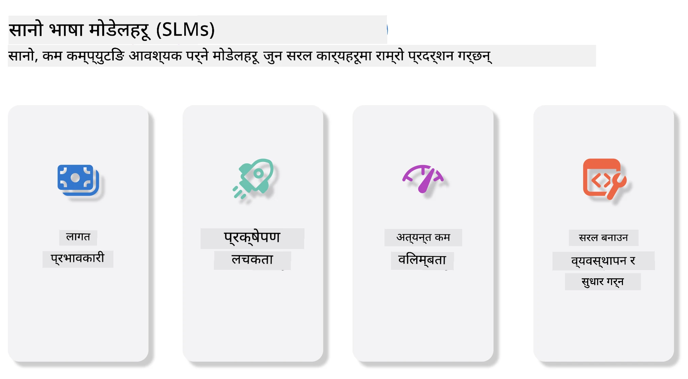
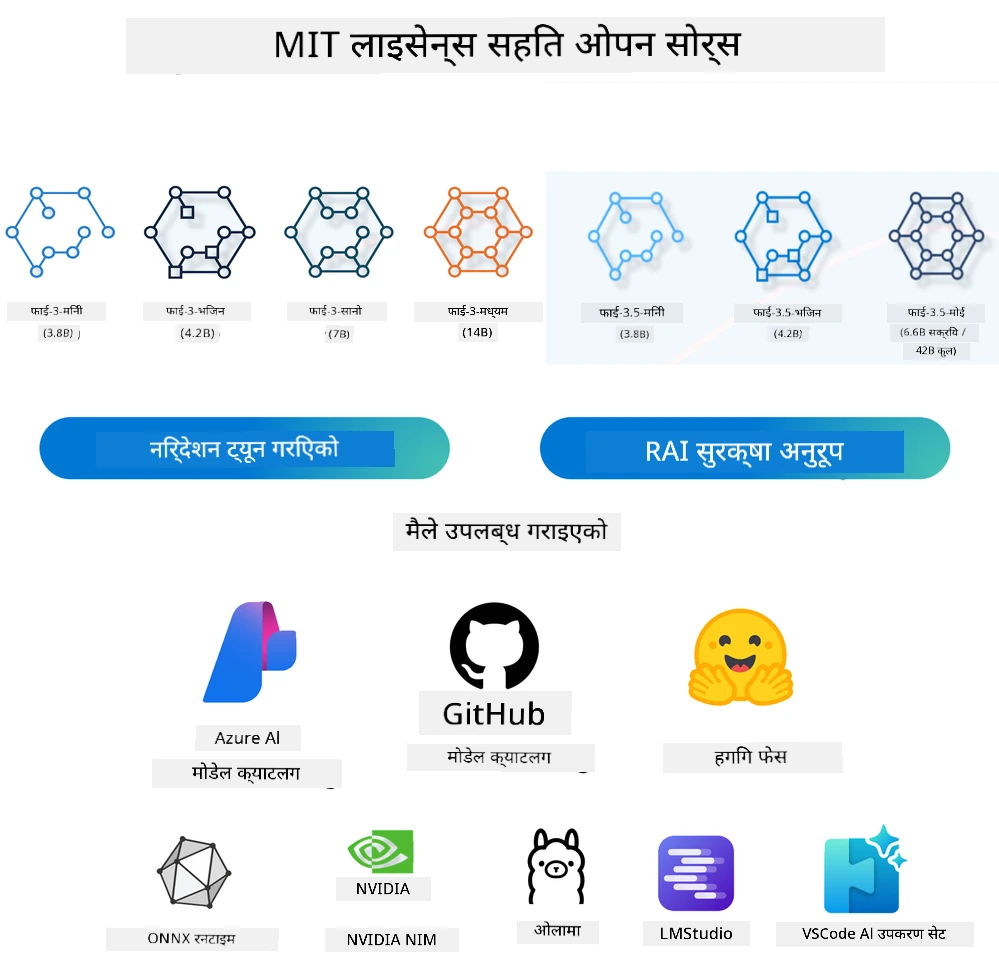
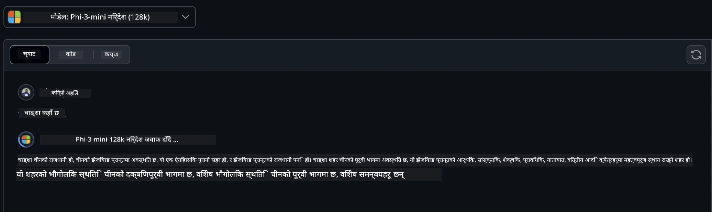
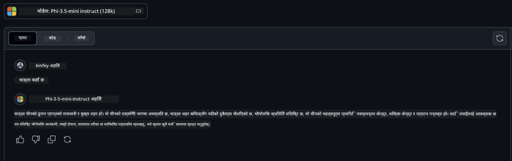

# सुरूवातिका लागि सानो भाषा मोडेलहरूको परिचय जेनेरेटिभ एआईका लागि
जेनेरेटिभ एआई कृत्रिम बुद्धिमत्ताको एक रोचक क्षेत्र हो जुन नयाँ सामग्री सिर्जना गर्न सक्षम प्रणालीहरू बनाउन केन्द्रित छ। यो सामग्री टेक्स्ट र तस्बिरदेखि लिएर संगीत र यहाँसम्म कि सम्पूर्ण भर्चुअल वातावरणहरु सम्म फरक-फरक प्रकारको हुन सक्छ। जेनेरेटिभ एआईको सबैभन्दा रोमाञ्चक प्रयोगहरू मध्ये एक भाषा मोडेलहरूको क्षेत्रमा हुन्छ।

## सानो भाषा मोडेलहरू के हुन्?

सानो भाषा मोडेल (SLM) ठूलो भाषा मोडेल (LLM) को तुलनामा एक सानो संस्करण हो, जसले LLM का धेरै वास्तुकला सिद्धान्तहरू र प्रविधिहरूलाई प्रयोग गर्छ, तर ठूलो मात्रामा कम्प्युटेशनल पदचिह्न घटाउँछ।

SLM हरू मानव-जस्तै टेक्स्ट उत्पन्न गर्न डिजाइन गरिएका भाषा मोडेलहरूको एक उपसमुच्चय हुन्। GPT-4 जस्ता ठूलो मोडेलहरूको विपरीत, SLM हरू कम्प्याक्ट र कुशल हुन्छन्, जसले तिनीहरूलाई सीमित कम्प्युटेशनल स्रोत भएका अनुप्रयोगहरूका लागि आदर्श बनाउँछ। सानो आकार भए तापनि, तिनीहरूले विभिन्न कार्यहरू सम्पन्न गर्न सक्छन्। प्राय: SLM हरू LLM हरूलाई कम्प्रेस वा डिस्टिल गरेर निर्माण गरिन्छन्, जसबाट मूल मोडेलको कार्यक्षमता र भाषिक क्षमता ठूलो अंशमा कायम रहन्छ। मोडेलको सानो आकारले कुल जटिलता कम गर्दछ, जसले SLM हरूलाई स्मृति उपयोग र कम्प्युटेशनल आवश्यकताहरूको हिसाबले अझ कुशल बनाउँछ। यी अनुकूलनहरूका बाबजुद, SLM हरूले धेरै प्राकृतिक भाषा प्रशोधन (NLP) कार्यहरू सम्पन्न गर्न सक्छन्:

- टेक्स्ट जेनेरेसन: सुसंगत र सन्दर्भअनुरूप वाक्य वा अनुच्छेदहरू सिर्जना गर्ने।
- टेक्स्ट पूरा गर्ने: दिइएको प्राँप्ट अनुसार वाक्यहरू भविष्यवाणी र पूरा गर्ने।
- अनुवाद: एक भाषाबाट अर्को भाषामा टेक्स्ट रूपान्तरण गर्ने।
- सारांश बनाउने: लामो टेक्स्टलाई छोटो, सजिलै बुझिने सारांसमा संक्षेप गर्ने।

केही प्रदर्शन वा समझदारीको गहिराइमा सानो मोडेलहरूको केही Trade-offs भए तापनि।

## सानो भाषा मोडेलहरू कसरी काम गर्छन्?
SLM हरू विशाल मात्रामा टेक्स्ट डाटा मा प्रशिक्षण गरिन्छन्। प्रशिक्षणको क्रममा, तिनीहरूले भाषाका ढाँचा र संरचनाहरू सिक्छन्, जसले तिनीहरूलाई व्याकरणिक रूपमा सही र सन्दर्भ अनुसार उपयुक्त टेक्स्ट उत्पन्न गर्न सक्षम बनाउँछ। प्रशिक्षण प्रक्रियामा समावेश छ:

- डाटा सङ्कलन: विभिन्न स्रोतहरूबाट ठूलो मात्रामा टेक्स्ट डाटासेटहरू सङ्कलन गर्ने।
- पूर्व प्रशोधन: प्रशिक्षणमा उपयुक्त हुन डाटालाई सफा र व्यवस्थित गर्ने।
- प्रशिक्षण: मोडेललाई टेक्स्ट बुझ्न र उत्पन्न गर्न सिकाउन मेसिन लर्निङ एल्गोरिदम प्रयोग गर्ने।
- फाइन-ट्युनिङ: विशेष कार्यहरूमा प्रदर्शन सुधार गर्न मोडेल समायोजन गर्ने।

SLM को विकास स्रोत-सिमित वातावरणहरू जस्तै मोबाइल उपकरण वा एज कम्प्युटिङ प्लेटफर्महरूमा तैनाथ गर्न अनुकूल छ, जहाँ पूर्ण-स्केल LLM हरू भारी स्रोत आवश्यकताका कारण व्यवहार्य नहुन सक्छन्। दक्षतालाई ध्यानमा राख्दै, SLM हरूले प्रदर्शन र पहुँचयोग्यताको सन्तुलन राख्छन् जसले विभिन्न कार्यक्षेत्रमा विस्तार गर्न सक्षम बनाउँछ।



## सिकाइका उद्देश्यहरू

यस पाठमा हामी SLM को ज्ञान परिचय गराउने र यसलाई Microsoft Phi-3 सँग जोडेर टेक्स्ट सामग्री, दर्शन र MoE मा विभिन्न परिदृश्यहरू सिक्ने योजना बनाएका छौं।

यो पाठ पूरा भएपछि, तपाईंले यी प्रश्नहरूको जवाफ दिन सक्षम हुनु हुनेछ:

- SLM के हो?
- SLM र LLM बीच के फरक छ?
- Microsoft Phi-3/3.5 परिवार के हो?
- Microsoft Phi-3/3.5 परिवारसँग कसरी इन्फरन्स चलाउने?

तयार हुनुहुन्छ? सुरु गरौं।

## ठूलो भाषा मोडेल (LLM) र सानो भाषा मोडेल (SLM) बीचको भेद

दुवै LLM र SLM मेसिन लर्निङका आधारभूत सिद्धान्तहरूमा आधारित छन् र आर्किटेक्चरल डिजाइन, प्रशिक्षण विधिहरू, डाटा उत्पादन प्रक्रिया र मोडेल मूल्यांकन प्रविधिहरूमा समान दृष्टिकोण अपनाउँछन्। तथापि, केही मुख्य कुराहरूले यी दुई मोडेल प्रकारहरूलाई फरक पार्छ।

## सानो भाषा मोडेलहरूको प्रयोगहरू

SLM हरूको प्रयोग क्षेत्रहरू समावेश छन्:

- च्याटबोटहरू: ग्राहक समर्थन प्रदान गर्ने र प्रयोगकर्तासँग संवादात्मक तरिकाले संलग्न हुने।
- सामग्री सिर्जना: लेखकहरूलाई विचार उत्पन्न गर्न वा सम्पूर्ण लेखका मस्यौदाहरू तयार गर्न सहयोग गर्ने।
- शिक्षा: विद्यार्थीहरूलाई लेखन कार्यहरूमा वा नयाँ भाषा सिक्न मद्दत गर्ने।
- पहुँचयोग्यता: अपाङ्गता भएका व्यक्तिहरूका लागि उपकरणहरू जस्तै टेक्स्ट-टु-स्पीच प्रणालीहरू सिर्जना गर्ने।

**आकार**

LLM र SLM बीचको मुख्य भेद मोडेलको आकारमा हुन्छ। LLM हरू, जस्तै ChatGPT (GPT-4), अनुमानित १.७६ ट्रिलियन प्यारामिटरहरू मिलाएर बन्न सक्छन्, जबकि खुला स्रोत SLM जस्तै Mistral 7B मा करिब ७ अर्ब प्यारामिटर मात्र हुन्छ। यो भिन्नता मुख्य रूपमा मोडेल आर्किटेक्चर र प्रशिक्षण प्रक्रियाहरूमा हुन्छ। उदाहरणका लागि, ChatGPT ले इन्कोडर-डिकोडर फ्रेमवर्क भित्र सेल्फ-अटेन्सन मेकानिज्म प्रयोग गर्छ, जबकि Mistral 7B ले स्लाइडिङ विन्डो अटेन्सन प्रयोग गर्छ, जसले डिकोडर-ओनली मोडेल भित्र कुशल प्रशिक्षण सक्षम पार्छ। यस आर्किटेक्चरल भिन्नताले यो मोडेलहरूको जटिलता र प्रदर्शनमा गहिरो प्रभाव पार्छ।

**समझदारी**

SLM हरू प्राय: विशिष्ट क्षेत्रहरूमा प्रदर्शनका लागि अधिकतम अनुकूलित हुन्छन्, जसले तिनीहरूलाई अत्यन्त विशेषज्ञ बनाउँछ तर बहुक्षेत्रीय व्यापक सन्दर्भ बुझाइमा सीमित हुन सक्छ। विपरीत, LLM हरू मानव-जस्ता बुद्धिमत्ताको अनुकरण गर्ने उद्देश्य राख्छन्। विशाल, विविध डाटासेटहरूमा प्रशिक्षण गरिएका LLM हरू फरक-फरक क्षेत्रहरूमा राम्रो प्रदर्शन गर्न डिजाइन गरिएका छन्, जसले तिनीहरूलाई ज्यादा बहुमुखी र अनुकूलनीय बनाउँछ। परिणामस्वरूप, LLM हरू धेरै प्रकारका कमाण्ड कार्यहरू, जस्तै NLP र प्रोग्रामिङका लागि उपयुक्त हुन्छन्।

**कम्प्युटिङ**

LLM को प्रशिक्षण र तैनाती स्रोत-गहन प्रक्रिया हो, धेरै पटक ठूलो कम्प्युटेशनल पूर्वाधार, जस्तै ठूलो GPU क्लस्टरहरू आवश्यक पर्छ। उदाहरणका लागि, ChatGPT जस्तो मोडेल पूर्ण रूपमा नयाँबाट प्रशिक्षण गर्न हजारौं GPUs र लामो समय लाग्न सक्छ। विपरीत, सानो प्यारामिटर हुने SLM हरू कम्प्युटेशनल स्रोत अभिगममा सजिलै उपलब्ध हुन्छन्। Mistral 7B जस्ता मोडेलहरू मध्यम GPU क्षमताका स्थानीय मेसिनहरूमा प्रशिक्षण र सञ्चालन गर्न सकिन्छ, यद्यपि प्रशिक्षण अझै पनि घण्टौं गल्ती गर्न सक्छ।

**पूर्वाग्रह**

LLM हरूमा पूर्वाग्रह कुनै अपरिहार्य समस्या हो, मुख्यत: प्रशिक्षण डाटाको प्रकृतिका कारण। यी मोडेलहरूले प्रायः इन्टरनेटबाट खुलेर उपलब्ध कच्चा डाटा प्रयोग गर्छन्, जसले कतिपय समूहहरूलाई कम प्रतिनिधित्व गर्न सक्छ, गलत लेबलिंग गर्न सक्छ वा बोली, भौगोलिक भिन्नता, र व्याकरण नियमहरूद्वारा प्रभावित भाषिक पूर्वाग्रहहरू देखाउन सक्छ। साथै, LLM को जटिल वास्तुकलाले पूर्वाग्रहलाई अनजानेमा बिगार्न सक्छ, जुन सावधानीपूर्वक फाइन-ट्युनिङ बिना देखिदैन। अर्कोतर्फ, सानो भाषाका मोडेलहरू सिमित, क्षेत्र-विशेष डाटासेटमा प्रशिक्षण भएकाले तिनीहरू त्यस्ता पूर्वाग्रहमा तुलनात्मक रूपमा कम संवेदनशील हुन्छन्, यद्यपि पूर्ण रूपमा अछूता भने होइनन्।

**इन्फरन्स**

SLM हरूको सानो आकारले तिनीहरूलाई इन्फरन्स गतिमा ठूलो लाभ प्राप्त गराउँछ, जसले तिनीहरूलाई स्थानीय हार्डवेयरमा प्रभावकारी रूपमा आउटपुट उत्पादन गर्न सक्षम बनाउँछ र व्यापक समानान्तर प्रशोधन आवश्यक पर्दैन। LLM हरू भने तिनीहरूको आकार र जटिलताको कारण स्वीकार्य इन्फरन्स समय प्राप्त गर्न ठूलो समानान्तर कम्प्युटेशनल स्रोत आवश्यक पर्न सक्छ। धेरै एकैचोटि प्रयोगकर्ताहरू हुँदा LLM हरूको प्रतिक्रियाको समय अझ बढ्छ, विशेष गरी ठूलो स्तरमा तैनाथ गर्दा।

संक्षेपमा, LLM र SLM दुवै मेसिन लर्निङमा आधारित भए पनि मोडेलको आकार, स्रोत आवश्यकताहरू, सन्दर्भ बुझाइ, पूर्वाग्रहमा संवेदनशीलता, र इन्फरन्सगतिमा महत्वपूर्ण भिन्नताहरू छन्। यी भेदहरूले उनीहरूको अलग-अलग प्रयोगका लागि उपयुक्तता दर्शाउँछन्, LLM हरू अधिक बहुमुखी तर स्रोत-भारी, र SLM हरू बढी क्षेत्र-विशिष्ट दक्षता र कम कम्प्युटेशनल मागका साथ।

***नोट: यस पाठमा हामी Microsoft Phi-3 / 3.5 को उदाहरण प्रयोग गरेर SLM परिचय गराउनेछौं।***

## Phi-3 / Phi-3.5 परिवारको परिचय

Phi-3 / 3.5 परिवार मुख्य रूपमा पाठ, दर्शन, र एजेन्ट (MoE) अनुप्रयोग परिदृश्यहरूलाई लक्षित गर्छ:

### Phi-3 / 3.5 निर्देशन

मुख्य रूपमा टेक्स्ट जेनेरेसन, च्याट पूरा गर्ने, र सामग्री सूचना निष्कर्षणका लागि।

**Phi-3-मिनी**

३.८ अर्ब प्यारामिटर भएको यो भाषा मोडेल Microsoft Azure AI Studio, Hugging Face, र Ollama मा उपलब्ध छ। Phi-3 मोडेलहरूले साना र ठूला दुवै आकारका भाषा मोडेलहरुलाई प्रमुख बेंचमार्कहरुमा उल्लेखनीय प्रदर्शन देखाउँछन् (तलको बेंचमार्क नम्बरहरू हेर्नुहोस्, उच्च नम्बर राम्रो हुन्छ)। Phi-3-मिनी आफैंको आकारको दोगुना भन्दा ठूलो मोडेलहरूलाई पछाडि पार्छ, जबकि Phi-3-सानो र Phi-3-मीडियमले GPT-3.5 झैं ठूला मोडेललाई पनि पछि पार्छन्।

**Phi-3-सानो र मीडियम**

सिर्फ ७ अर्ब प्यारामिटर सहित, Phi-3-सानो विभिन्न भाषा, तर्क, कोडिङ, र गणित बेंचमार्कहरूमा GPT-3.5T भन्दा अघि छ।

१४ अर्ब प्यारामिटर भएको Phi-3-मीडियमले यो प्रवृत्ति जारी राख्दै Gemini 1.0 Pro लाई पछि पार्छ।

**Phi-3.5-मिनी**

यसलाई Phi-3-मिनीको उन्नत संस्करण मान्न सकिन्छ। प्यारामिटरहरू भनेको समान छन्, तर यसले बहुभाषी समर्थन वृद्धि गरेको छ (२०+ भाषाहरू समर्थन गर्दछ: अरबी, चिनियाँ, चेक, डेनिश, डच, अंग्रेजी, फिनिस, फ्रेन्च, जर्मन, हिब्रु, हंगेरीयन, इटालियन, जापानी, कोरियन, नर्वेजियन, पोलिस, पोर्चुगिज, रसियन, स्प्यानिश, स्वीडिश, थाई, टर्किश, युक्रेनी) र लामो सन्दर्भलाई थप बलियो समर्थन थपेको छ।

३.८ अर्ब प्यारामिटरको Phi-3.5-मिनीले आफूभन्दा उस्तै आकारका भाषा मोडेलहरूलाई पछि पार्दछ र दुई गुणा ठूलो मोडेलहरूसँग बराबरी गराउँछ।

### Phi-3 / 3.5 दर्शन

Phi-3/3.5 को निर्देशन मोडेललाई Phi को बुझाइ क्षमताको रूपमा र दर्शनलाई Phi को आँखा जसले संसार बुझ्न मद्दत गर्छ भनेर सोचे। 

**Phi-3-दर्शन**

४.२ अर्ब मात्र प्यारामिटरको साथ Phi-3-दर्शनले यो प्रवृत्ति जारी राख्छ र सामान्य दृश्य तर्क कार्यहरू, OCR, तालिका र आरेख बुझाइमा Claude-3 Haiku र Gemini 1.0 Pro जस्ता ठूला मोडेलहरूलाई पछि पार्दछ।

**Phi-3.5-दर्शन**

Phi-3.5-दर्शन Phi-3-दर्शनको उन्नति हो, जसले बहु-तस्बिर समर्थन थप्छ। तपाईं यसलाई दर्शनमा सुधारको रूपमा सोच्न सक्नुहुन्छ, जहाँ तपाईँले तस्बिर मात्र देख्नु हुँदैन, भिडियोहरू पनि देख्न सक्नुहुन्छ।

Phi-3.5-दर्शनले ठूला मोडेलहरू जस्तै Claude-3.5 Sonnet र Gemini 1.5 Flash लाई OCR, तालिका, चार्ट बुझाइ कार्यहरूमा पछि पार्दछ र सामान्य दृश्य ज्ञान तर्क कार्यहरूमा बराबरी गर्छ। बहु-फ्रेम इनपुट समर्थन गर्दछ, अर्थात् धेरै इनपुट तस्बिरहरूमा तर्क प्रदर्शन गर्न सक्छ।

### Phi-3.5-MoE

***Mixture of Experts (MoE)*** ले मोडेलहरू कम कम्प्युट प्रयोग गरेर प्री-ट्रेन गर्न सक्षम पार्छ, जसको अर्थ तपाईं एकै कम्प्युट बजेटमा मोडेल वा डाटासेट आकार ठूलो मात्रामा विस्तार गर्न सक्नुहुन्छ। विशेष गरी, MoE मोडेलले आफ्नो डेंस समकक्षको तुलनामा सिकाइ क्रममा धेरै छिटो समान गुणस्तर हासिल गर्न सक्छ।

Phi-3.5-MoE मा १६x३.८ अर्ब विशेषज्ञ मोड्युलहरू समावेश छन्। केवल ६.६ अर्ब सक्रिय प्यारामिटरहरू भएको Phi-3.5-MoE ले ठूलो मोडेलहरूको तुलनामा समान स्तरको तर्क, भाषा बुझाइ, र गणित प्रदर्शन गर्दछ।

हामी विभिन्न परिदृश्यहरूमा आधारित Phi-3/3.5 परिवारका मोडेलहरू प्रयोग गर्न सक्छौं। LLM जसरि नभई, Phi-3/3.5-मिनी वा Phi-3/3.5-दर्शन एज उपकरणहरूमा तैनाथ गर्न सकिन्छ।

## Phi-3/3.5 परिवारका मोडेलहरू कसरी प्रयोग गर्ने

हामी Phi-3/3.5 लाई विभिन्न परिदृश्यमा प्रयोग गर्ने आशा गर्दछौं। अब हामी अलग-अलग परिदृश्यहरूमा आधारित Phi-3/3.5 प्रयोग गर्नेछौं।



### क्लाउड API मार्फत इन्फरन्स

**GitHub मोडेलहरू**

GitHub मोडेलहरू सबैभन्दा प्रत्यक्ष तरीका हो। तपाईंले छिटो Phi-3/3.5-इन्स्ट्रक्ट मोडेल GitHub मोडेलहरू मार्फत पहुँच गर्न सक्नुहुन्छ। Azure AI Inference SDK / OpenAI SDK सँग संयोजन गरेर तपाईं कोड मार्फत API पहुँच गरी Phi-3/3.5-इन्स्ट्रक्ट कल पूरा गर्न सक्नुहुन्छ। तपाईं फरक-फरक प्रभावहरू परीक्षण गर्न Playground पनि प्रयोग गर्न सक्नुहुन्छ।

- डेमो: चिनियाँ परिदृश्यहरूमा Phi-3-मिनी र Phi-3.5-मिनीको प्रभाव तुलना





**Azure AI Studio**

वा यदि हामी दर्शन र MoE मोडेलहरू प्रयोग गर्न चाहन्छौं भने, Azure AI Studio प्रयोग गरेर कल गर्न सकिन्छ। यदि तपाईं इच्छुक हुनुहुन्छ भने, Phi-3 कुकबुक पढ्न सक्नुहुन्छ जसले Azure AI Studio मार्फत Phi-3/3.5 इन्स्ट्रक्ट, दर्शन, MoE कसरी कल गर्ने सिकाउँछ [यो लिंक क्लिक गर्नुहोस्](https://github.com/microsoft/Phi-3CookBook/blob/main/md/02.QuickStart/AzureAIStudio_QuickStart.md?WT.mc_id=academic-105485-koreyst)

**NVIDIA NIM**

Azure र GitHub द्वारा प्रदान गरिएको क्लाउड-आधारित Model Catalog समाधानहरू बाहेक, तपाईं [NVIDIA NIM](https://developer.nvidia.com/nim?WT.mc_id=academic-105485-koreyst) प्रयोग गरेर सम्बन्धित कलहरू पूरा गर्न सक्नुहुन्छ। तपाईं NVIDIA NIM मार्फत Phi-3/3.5 परिवारका API कलहरू सम्पन्न गर्न सक्नुहुन्छ। NVIDIA NIM (NVIDIA Inference Microservices) एक सेट छ, जुन तीव्र इन्फरन्स माइक्रोसर्भिसहरू प्रदान गर्दछ र विकासकर्ताहरूलाई विभिन्न वातावरणहरूमा प्रभावकारी रूपमा AI मोडेलहरू तैनाथ गर्न मद्दत गर्छ, जस्तै क्लाउड, डेटा सेन्टर र वर्कस्टेशनहरू।

यहाँ NVIDIA NIM का केही मुख्य विशेषताहरू छन्:
- **परिनियोजन सहजता:** NIM ले एउटै कमाण्डमार्फत AI मोडेलहरूको परिनियोजन गर्न अनुमति दिन्छ, जसले यसलाई विद्यमान कार्यप्रवाहहरूमा एकीकृत गर्न सजिलो बनाउँछ।
- **सर्वोत्कृष्ट प्रदर्शन:** यसले NVIDIA का पूर्व-अनुकूलित इनफररेन्स इन्जिनहरू जस्तै TensorRT र TensorRT-LLM को उपयोग गरेर कम विलम्बता र उच्च थ्रुपुट सुनिश्चित गर्छ।
- **स्केलेबिलिटी:** NIM ले Kubernetes मा अटोस्केलिङ समर्थन गर्छ, जसले विभिन्न कामभारहरू प्रभावकारी रूपमा व्यवस्थापन गर्न सक्षम बनाउँछ।
- **सुरक्षा र नियन्त्रण:** संगठनहरूले आफ्नै व्यवस्थापन गरिएको पूर्वाधारमा NIM माइक्रोसर्भिसहरू स्व-होस्ट गरेर आफ्ना डाटा र अनुप्रयोगहरूमा नियन्त्रण कायम राख्न सक्छन्।
- **मानक APIs:** NIM ले उद्योग-मानक APIs प्रदान गर्छ, जसले चैटबोटहरू, AI सहायकहरू र अन्य AI अनुप्रयोगहरू बनाउन र एकीकृत गर्न सजिलो बनाउँछ।

NIM NVIDIA AI Enterprise को हिस्सा हो, जसले AI मोडेलहरूको परिनियोजन र सञ्चालनलाई सरल बनाउने लक्ष्य राख्छ, र पक्का गर्छ कि ती NVIDIA GPU हरूमा प्रभावकारी रूपमा चल्छन्।

- डेमो: NVIDIA NIM प्रयोग गरेर Phi-3.5-Vision-API कल गर्ने [[Click this link](./python/Phi-3-Vision-Nividia-NIM.ipynb?WT.mc_id=academic-105485-koreyst)]


### Phi-3/3.5 स्थानीय रूपमा चलाउनु
Phi-3 वा GPT-3 जस्ता कुनै पनि भाषा मोडेलसँग सम्बन्धित इनफररेन्स भनेको प्राप्त इनपुटको आधारमा प्रतिक्रिया वा पूर्वानुमानहरू उत्पन्न गर्ने प्रक्रिया हो। जब तपाईं Phi-3 लाई कुनै प्रम्प्ट वा प्रश्न दिनुहुन्छ, यसले आफ्नो प्रशिक्षित न्यूरल नेटवर्क प्रयोग गरेर सबैभन्दा सम्भावित र सम्बन्धित प्रतिक्रिया अनुमान लगाउँछ जुन यसले प्रशिक्षण डेटा भित्रका ढाँचाहरू र सम्बन्धहरू विश्लेषण गरेर गर्छ।

**Hugging Face Transformer**
Hugging Face Transformers एक शक्तिशाली पुस्तकालय हो जुन प्राकृतिक भाषा प्रशोधन (NLP) र अन्य मेसिन लर्निङ कार्यहरूका लागि डिजाइन गरिएको हो। यहाँ यसबारे केहि मुख्य बुँदाहरू छन्:

1. **पूर्व-प्रशिक्षित मोडेलहरू:** यसले हजारौं पूर्व-प्रशिक्षित मोडेलहरू प्रदान गर्छ जुन पाठ वर्गीकरण, नामित अस्तित्व मान्यता, प्रश्नोत्तर, संक्षेपण, अनुवाद र पाठ उत्पादन जस्ता विभिन्न कार्यहरूमा उपयोग गर्न सकिन्छ।

2. **फ्रेमवर्क अन्तरक्रियाशीलता:** यो पुस्तकालयले PyTorch, TensorFlow, र JAX लगायत विभिन्न गहिरा सिकाइ फ्रेमवर्कहरूलाई समर्थन गर्छ। यसले तपाईंलाई एउटा फ्रेमवर्कमा मोडेल प्रशिक्षण गरेर अर्कोमा प्रयोग गर्न अनुमति दिन्छ।

3. **बहु-मोडालिटी क्षमता:** NLP भन्दा बाहेक, Hugging Face Transformers ले कम्प्युटर भिजन (जस्तै, छवि वर्गीकरण, वस्तु पत्ता लगाउने) र अडियो प्रशोधन (जस्तै, भाषण मान्यता, अडियो वर्गीकरण) कार्यहरू पनि समर्थन गर्छ।

4. **प्रयोग गर्न सजिलो:** यस पुस्तकालयले मोडेलहरू सजिलै डाउनलोड र फाइन-ट्युन गर्न APIs र उपकरणहरू प्रदान गर्दछ, जसले सुरुकर्ताहरू र विशेषज्ञ दुवैका लागि पहुँच योग्य बनाउँछ।

5. **समुदाय र स्रोतहरू:** Hugging Face सँग एउटा सक्रिय समुदाय छ र प्रयोगकर्ताहरूलाई सहयोग गर्न विस्तृत डकुमेन्टेसन, ट्यूटोरियल र मार्गदर्शकहरू उपलब्ध छन्।
[अधिकृत डकुमेन्टेसन](https://huggingface.co/docs/transformers/index?WT.mc_id=academic-105485-koreyst) वा तिनीहरूको [GitHub रिपोजिटरी](https://github.com/huggingface/transformers?WT.mc_id=academic-105485-koreyst)।

यो सबैभन्दा सामान्य प्रयोग भएको विधि हो, तर यसले GPU एक्सेलेरेशन पनि आवश्यक पर्छ। किनभने Vision र MoE जस्ता परिदृश्यहरूमा धेरै गणनाहरू आवश्यक छन्, जुन CPU मा क्वान्टाइज्ड नभएको खण्डमा धेरै स्लो हुनेछ।

- डेमो: Transformer प्रयोग गरेर Phi-3.5-Instruct कल गर्ने [Click this link](./python/phi35-instruct-demo.ipynb?WT.mc_id=academic-105485-koreyst)

- डेमो: Transformer प्रयोग गरेर Phi-3.5-Vision कल गर्ने [Click this link](./python/phi35-vision-demo.ipynb?WT.mc_id=academic-105485-koreyst)

- डेमो: Transformer प्रयोग गरेर Phi-3.5-MoE कल गर्ने [Click this link](./python/phi35_moe_demo.ipynb?WT.mc_id=academic-105485-koreyst)

**Ollama**
[Ollama](https://ollama.com/?WT.mc_id=academic-105485-koreyst) एक प्लेटफर्म हो जसले तपाईंको मेसिनमा ठूलो भाषा मोडेलहरू (LLMs) सजिलै चलाउन डिजाइन गरिएको छ। यसले Llama 3.1, Phi 3, Mistral, र Gemma 2 जस्ता विभिन्न मोडेलहरू समर्थन गर्छ। प्लेटफर्मले मोडेल तौलहरू, कन्फिगरेसन, र डाटालाई एउटै प्याकेजमा बाँधेर प्रक्रिया सरल बनाउँछ, जसले प्रयोगकर्ताहरूलाई आफ्नै मोडेलहरू अनुकूलन र निर्माण गर्न सजिलो बनाउँछ। Ollama macOS, Linux, र Windows मा उपलब्ध छ। यदि तपाईं क्लाउड सेवाहरूमा निर्भर नहुँदै LLM हरू प्रयोग गर्न वा परिक्षण गर्न चाहनुहुन्छ भने यो उत्कृष्ट उपकरण हो। Ollama सबैभन्दा प्रत्यक्ष तरीका हो, तपाईंले तलको कमाण्ड मात्र संचालन गर्नुपर्नेछ।

```bash

ollama run phi3.5

```


**ONNX Runtime for GenAI**

[ONNX Runtime](https://github.com/microsoft/onnxruntime-genai?WT.mc_id=academic-105485-koreyst) एक क्रस-प्लेटफर्म इनफररेन्स र ट्रेनिङ मेसिन लर्निङ एक्सेलेरेटर हो। ONNX Runtime for Generative AI (GENAI) तपाईंलाई विभिन्न प्लेटफर्महरूमा जनरेटिभ AI मोडेलहरू प्रभावकारी रूपमा चलाउन मद्दत गर्ने शक्तिशाली उपकरण हो।

## ONNX Runtime के हो?
ONNX Runtime एक खुला-स्रोत परियोजना हो जसले मेसिन लर्निङ मोडेलहरूको उच्च प्रदर्शन इनफररेन्स सक्षम बनाउँछ। यसले Open Neural Network Exchange (ONNX) ढाँचामा रहेका मोडेलहरूलाई समर्थन गर्छ, जुन मेसिन लर्निङ मोडेलहरू प्रतिनिधित्व गर्ने मानक हो। ONNX Runtime इनफररेन्सले कम्प्युटर प्रयोगकर्ताहरूलाई छिटो अनुभवहरू र कम लागतहरू प्रदान गर्न सक्छ, र PyTorch र TensorFlow/Keras जस्ता गहिरो सिकाइ फ्रेमवर्कहरूका मोडेलहरूसँगै scikit-learn, LightGBM, XGBoost जस्ता क्लासिकल मेसिन लर्निङ पुस्तकालयहरूलाई पनि समर्थन गर्छ। ONNX Runtime विभिन्न हार्डवेयर, ड्राइभरहरू, र अपरेटिङ सिस्टमहरूसँग अनुकूल छ, र जहाँ सम्भव हार्डवेयर एक्सेलेरेटरहरूको उपयोगसँगै ग्राफ अनुकूलन र रुपान्तरणहरू गरेर उत्कृष्ट प्रदर्शन प्रदान गर्छ।

## जनरेटिभ AI के हो?
जनरेटिभ AI ती AI प्रणालीहरू हुन् जसले नयाँ सामग्रीहरू उत्पादन गर्न सक्छन्, जस्तै पाठ, छवि, वा संगीत, तिनीहरूले प्रशिक्षण पाएको डेटा आधारमा। उदाहरणहरूमा GPT-3 जस्ता भाषा मोडेलहरू र Stable Diffusion जस्ता छवि उत्पादन मोडेलहरू पर्दछन्। ONNX Runtime for GenAI पुस्तकालयले ONNX मोडेलहरूको लागि जनरेटिभ AI लूप प्रदान गर्छ, जसमा ONNX Runtime सँग इनफररेन्स, logits प्रशोधन, खोज र नमूनाकरण, र KV क्यास व्यवस्थापन समावेश छन्।

## ONNX Runtime for GENAI
ONNX Runtime for GENAI ले ONNX Runtime को क्षमता विस्तार गरी जनरेटिभ AI मोडेलहरू समर्थन गर्छ। यहाँ केहि मुख्य विशेषताहरू छन्:

- **व्यापक प्लेटफर्म समर्थन:** यो विभिन्न प्लेटफर्महरूमा काम गर्छ, जस्तै Windows, Linux, macOS, Android, र iOS।
- **मोडेल समर्थन:** यसले LLaMA, GPT-Neo, BLOOM लगायत धेरै लोकप्रिय जनरेटिभ AI मोडेलहरू समर्थन गर्छ।
- **प्रदर्शन अनुकूलन:** यसमा NVIDIA GPU, AMD GPU र अन्य हार्डवेयर एक्सेलेरेटरहरुको लागि अनुकूलनहरू समावेश छन्।
- **प्रयोगमा सजिलो:** यसले अनुप्रयोगहरूमा सजिलै एकीकृत गर्न APIs प्रदान गर्छ, जसले न्यूनतम कोड प्रयोग गरेर पाठ, छवि, र अन्य सामग्रीहरू उत्पादन गर्न दिन्छ।
- प्रयोगकर्ताहरूले generate() नामक उच्च स्तरको विधि कल गर्न सक्छन्, वा मोडेलको प्रत्येक पुनरावृत्ति लूपमा चलाएर एक पटकमा एक टोकन उत्पादन गर्न सक्छन् र आवश्यकता अनुसार लूप भित्र उत्पादन प्यारामिटरहरू अद्यावधिक गर्न सक्छन्।
- ONNX Runtime मा greedy/beam search र TopP, TopK नमूनाकरण समर्थन पनि छ जसले टोकन अनुक्रमहरू उत्पादन गर्छ र पुनरावृत्ति दण्डजस्ता logits प्रशोधनहरू पूर्व-निर्मित रूपमा समावेश छन्। तपाईंले सजिलै कस्टम स्कोरिङ पनि थप्न सक्नुहुन्छ।

## सुरु कसरी गर्ने
ONNX Runtime for GENAI सँग सुरु गर्न तपाईं यी कदमहरू अनुसरण गर्न सक्नुहुन्छ:

### ONNX Runtime इन्स्टल गर्नुहोस्:
```Python
pip install onnxruntime
```
### जनरेटिभ AI एक्सटेन्सनहरू इन्स्टल गर्नुहोस्:
```Python
pip install onnxruntime-genai
```

### मोडेल चलाउनुहोस्: यहाँ Python मा एउटा सरल उदाहरण छ:
```Python
import onnxruntime_genai as og

model = og.Model('path_to_your_model.onnx')

tokenizer = og.Tokenizer(model)

input_text = "Hello, how are you?"

input_tokens = tokenizer.encode(input_text)

output_tokens = model.generate(input_tokens)

output_text = tokenizer.decode(output_tokens)

print(output_text) 
```
### डेमो: ONNX Runtime GenAI प्रयोग गरेर Phi-3.5-Vision कल गर्ने


```python

import onnxruntime_genai as og

model_path = './Your Phi-3.5-vision-instruct ONNX Path'

img_path = './Your Image Path'

model = og.Model(model_path)

processor = model.create_multimodal_processor()

tokenizer_stream = processor.create_stream()

text = "Your Prompt"

prompt = "<|user|>\n"

prompt += "<|image_1|>\n"

prompt += f"{text}<|end|>\n"

prompt += "<|assistant|>\n"

image = og.Images.open(img_path)

inputs = processor(prompt, images=image)

params = og.GeneratorParams(model)

params.set_inputs(inputs)

params.set_search_options(max_length=3072)

generator = og.Generator(model, params)

while not generator.is_done():

    generator.compute_logits()
    
    generator.generate_next_token()

    new_token = generator.get_next_tokens()[0]
    
    output = tokenizer_stream.decode(new_token)
    
    print(tokenizer_stream.decode(new_token), end='', flush=True)

```


**अन्य**

ONNX Runtime र Ollama सन्दर्भ विधिहरू बाहेक, हामी विभिन्न निर्माताहरूले प्रदान गरेका मोडेल सन्दर्भ विधिहरूको आधारमा मात्रात्मक मोडेलहरूको सन्दर्भ पनि पूरा गर्न सक्दछौं। जस्तै Apple MLX फ्रेमवर्क Apple Metal सहित, Qualcomm QNN NPU सहित, Intel OpenVINO CPU/GPU सहित, आदि। तपाईं थप सामग्री [Phi-3 Cookbook](https://github.com/microsoft/phi-3cookbook?WT.mc_id=academic-105485-koreyst) बाट पनि प्राप्त गर्न सक्नुहुन्छ।

## थप

हामीले Phi-3/3.5 परिवारका आधारभूत कुरा सिकिसकेका छौं, तर SLM अधिक जान्न हामीलाई थप ज्ञान आवश्यक छ। तपाईंलाई उत्तरहरू Phi-3 Cookbook मा फेला पार्न सकिन्छ। थप जान्न चाहनुहुन्छ भने, कृपया [Phi-3 Cookbook](https://github.com/microsoft/phi-3cookbook?WT.mc_id=academic-105485-koreyst) भ्रमण गर्नुहोस्।

---

<!-- CO-OP TRANSLATOR DISCLAIMER START -->
**अस्वीकरण**:
यो दस्तावेज [Co-op Translator](https://github.com/Azure/co-op-translator) द्वारा AI अनुवाद सेवाको प्रयोग गरेर अनुवाद गरिएको हो। हामी शुद्धताको प्रयास गरे तापनि, कृत्रिम अनुवादमा त्रुटि वा असठिकता हुनसक्छ। मूल दस्तावेज यसको स्वदेशी भाषामा प्रामाणिक स्रोतको रूपमा मानिनुपर्छ। महत्वपूर्ण जानकारीको लागि व्यावसायिक मान्छेले गरिएको अनुवाद सिफारिस गरिन्छ। यस अनुवादको प्रयोगबाट उत्पन्न कुनै पनि गलतफहमी वा गलत व्याख्यामा हामी जिम्मेवार छैनौं।
<!-- CO-OP TRANSLATOR DISCLAIMER END -->