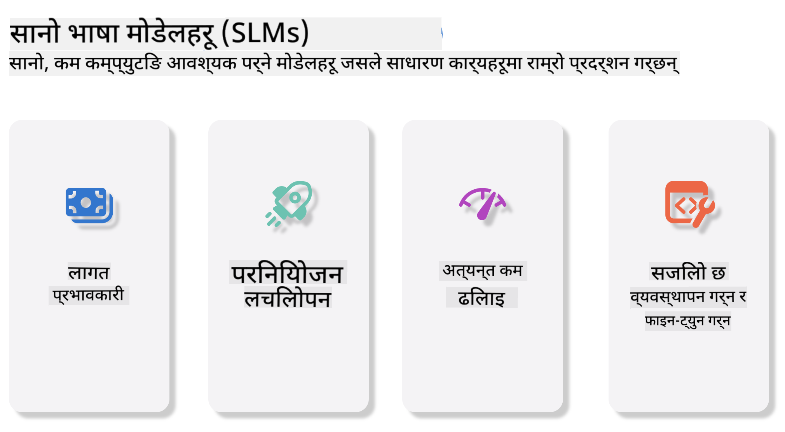
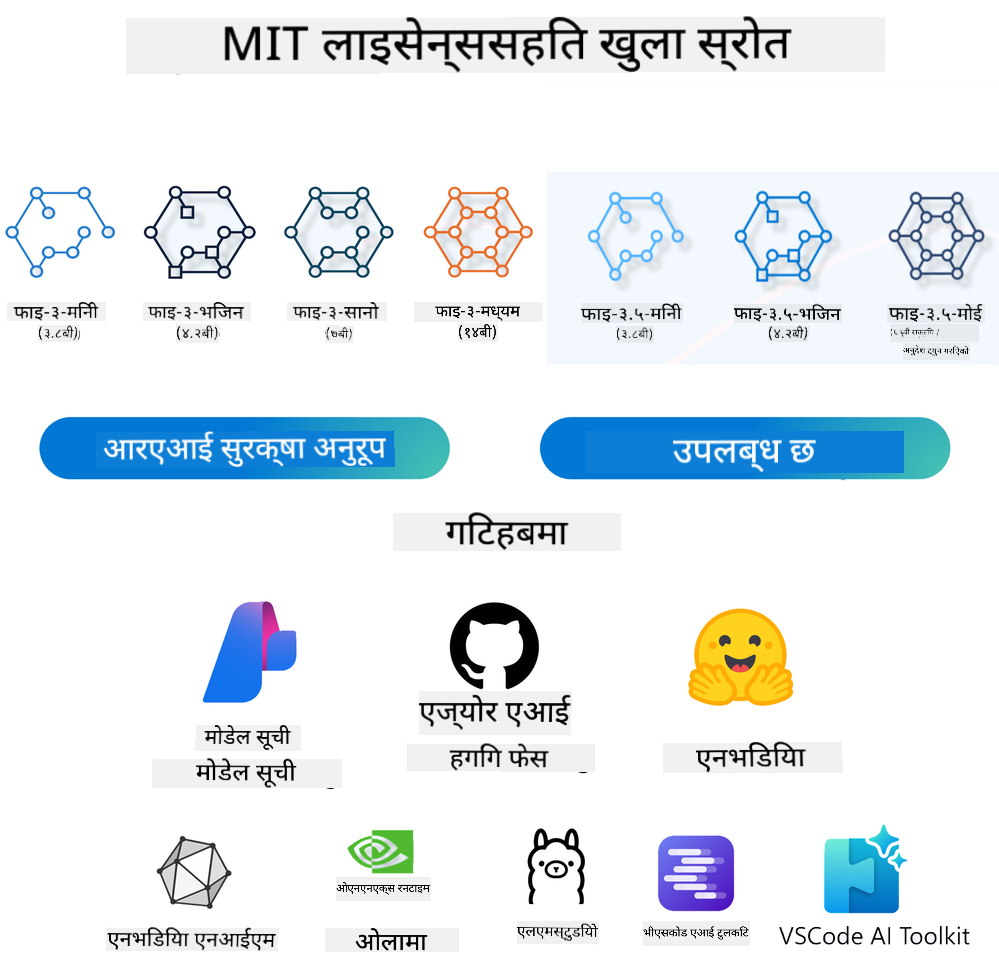

<!--
CO_OP_TRANSLATOR_METADATA:
{
  "original_hash": "124ad36cfe96f74038811b6e2bb93e9d",
  "translation_date": "2025-07-09T18:27:06+00:00",
  "source_file": "19-slm/README.md",
  "language_code": "ne"
}
-->
# शुरुवात: साना भाषा मोडेलहरू (SLMs) र जेनेरेटिभ AI का लागि परिचय

जेनेरेटिभ AI कृत्रिम बुद्धिमत्ताको एउटा रोचक क्षेत्र हो जसले नयाँ सामग्री सिर्जना गर्न सक्षम प्रणालीहरू विकासमा केन्द्रित छ। यो सामग्रीमा पाठ, तस्बिर, संगीत र यहाँसम्म कि सम्पूर्ण भर्चुअल वातावरणहरू पनि समावेश हुन सक्छ। जेनेरेटिभ AI को सबैभन्दा रोमाञ्चक प्रयोगहरू मध्ये एक भाषा मोडेलहरूको क्षेत्रमा छ।

## साना भाषा मोडेलहरू के हुन्?

साना भाषा मोडेल (SLM) ठूलो भाषा मोडेल (LLM) को सानो संस्करण हो, जसले LLM का धेरै वास्तुकला सिद्धान्त र प्रविधिहरू प्रयोग गर्छ, तर कम्प्युटेशनल भार निकै कम हुन्छ।

SLM हरू मानव-जस्तै पाठ सिर्जना गर्न डिजाइन गरिएका भाषा मोडेलहरूको उपसमूह हुन्। GPT-4 जस्ता ठूला मोडेलहरू भन्दा फरक, SLM हरू साना र कुशल हुन्छन्, जसले सीमित कम्प्युटेशनल स्रोत भएका अनुप्रयोगहरूका लागि उपयुक्त बनाउँछ। सानो आकार भए तापनि, यी मोडेलहरूले विभिन्न कार्यहरू गर्न सक्छन्। सामान्यतया, SLM हरू LLM हरूलाई कम्प्रेस वा डिस्टिल गरेर बनाइन्छ, जसले मूल मोडेलको धेरै कार्यक्षमता र भाषिक क्षमता कायम राख्न प्रयास गर्छ। मोडेलको आकार घटाउँदा जटिलता कम हुन्छ र स्मृति तथा कम्प्युटेशनल आवश्यकतामा सुधार आउँछ। यी अनुकूलनहरूका बाबजुद, SLM हरूले निम्न NLP कार्यहरू गर्न सक्छन्:

- पाठ सिर्जना: सुसंगत र सन्दर्भअनुकूल वाक्य वा अनुच्छेदहरू बनाउने।
- पाठ पूर्ति: दिइएको संकेत अनुसार वाक्यहरू अनुमान र पूरा गर्ने।
- अनुवाद: एक भाषाबाट अर्को भाषामा पाठ रूपान्तरण गर्ने।
- सारांश: लामो पाठलाई छोटो र बुझ्न सजिलो सारांशमा परिणत गर्ने।

थोरै प्रदर्शन वा बुझाइमा केही सिमितताहरू हुन सक्छन् ठूला मोडेलहरूको तुलनामा।

## साना भाषा मोडेलहरू कसरी काम गर्छन्?

SLM हरू ठूलो मात्रामा पाठ डाटामा तालिम दिइन्छ। तालिमको क्रममा, तिनीहरूले भाषाका ढाँचा र संरचनाहरू सिक्छन् जसले व्याकरणिक रूपमा सही र सन्दर्भअनुकूल पाठ सिर्जना गर्न सक्षम बनाउँछ। तालिम प्रक्रिया समावेश गर्दछ:

- डाटा सङ्कलन: विभिन्न स्रोतबाट ठूलो पाठ डाटासेट सङ्कलन गर्ने।
- पूर्वप्रक्रिया: डाटालाई सफा र व्यवस्थित गरी तालिमका लागि उपयुक्त बनाउने।
- तालिम: मेसिन लर्निङ एल्गोरिदम प्रयोग गरी मोडेललाई पाठ बुझ्न र सिर्जना गर्न सिकाउने।
- फाइन-ट्यूनिङ: विशिष्ट कार्यहरूमा प्रदर्शन सुधार गर्न मोडेल समायोजन गर्ने।

SLM को विकास स्रोत सीमित वातावरणहरू, जस्तै मोबाइल उपकरण वा एज कम्प्युटिङ प्लेटफर्महरूमा प्रयोगका लागि उपयुक्त मोडेलहरूको आवश्यकतालाई सम्बोधन गर्छ, जहाँ पूर्ण आकारका LLM हरू भारी स्रोत मागका कारण व्यवहारिक नहुन सक्छन्। दक्षतामा केन्द्रित भएर, SLM हरू प्रदर्शन र पहुँचयोग्यतालाई सन्तुलन गर्छन्, जसले विभिन्न क्षेत्रहरूमा व्यापक प्रयोग सम्भव बनाउँछ।



## सिकाइका उद्देश्यहरू

यस पाठमा, हामी SLM को ज्ञान परिचय गराउने र Microsoft Phi-3 सँग जोडेर पाठ सामग्री, दृष्टि र MoE का विभिन्न परिदृश्यहरू सिक्ने प्रयास गर्नेछौं।

यस पाठको अन्त्यसम्म, तपाईंले निम्न प्रश्नहरूको उत्तर दिन सक्नुहुनेछ:

- SLM के हो?
- SLM र LLM बीच के फरक छ?
- Microsoft Phi-3/3.5 परिवार के हो?
- Microsoft Phi-3/3.5 परिवारलाई कसरी इन्फरेन्स गर्ने?

तयार हुनुहुन्छ? सुरु गरौं।

## ठूलो भाषा मोडेल (LLMs) र साना भाषा मोडेल (SLMs) बीचको भिन्नता

दुवै LLM र SLM मेसिन लर्निङका आधारभूत सिद्धान्तहरूमा आधारित छन्, र तिनीहरूको वास्तुकला डिजाइन, तालिम विधि, डाटा उत्पादन प्रक्रिया, र मोडेल मूल्याङ्कन प्रविधिहरूमा समान दृष्टिकोण अपनाउँछन्। तर, यी दुई मोडेल प्रकारहरू बीच केही मुख्य भिन्नताहरू छन्।

## साना भाषा मोडेलहरूको प्रयोग

SLM हरूका विभिन्न प्रयोगहरू छन्, जस्तै:

- च्याटबोटहरू: ग्राहक सहायता प्रदान गर्ने र प्रयोगकर्तासँग संवाद गर्ने।
- सामग्री सिर्जना: लेखकहरूलाई विचार उत्पन्न गर्न वा सम्पूर्ण लेख तयार गर्न सहयोग गर्ने।
- शिक्षा: विद्यार्थीहरूलाई लेखन कार्य वा नयाँ भाषा सिक्न मद्दत गर्ने।
- पहुँचयोग्यता: अपाङ्गता भएका व्यक्तिहरूका लागि पाठ-देखि-स्वर प्रणाली जस्ता उपकरणहरू बनाउने।

**आकार**

LLM र SLM बीचको मुख्य भिन्नता मोडेलको आकारमा हुन्छ। LLM हरू, जस्तै ChatGPT (GPT-4), अनुमानित 1.76 ट्रिलियन प्यारामिटरहरू समावेश गर्न सक्छन्, जबकि खुला स्रोत SLM हरू जस्तै Mistral 7B मा करिब 7 अर्ब प्यारामिटर मात्र हुन्छ। यो भिन्नता मुख्य रूपमा मोडेल वास्तुकला र तालिम प्रक्रियामा आधारित छ। उदाहरणका लागि, ChatGPT ले एन्कोडर-डिकोडर संरचनामा सेल्फ-अटेन्सन मेकानिजम प्रयोग गर्छ भने Mistral 7B ले स्लाइडिङ विन्डो अटेन्सन प्रयोग गर्छ, जसले डिकोडर-ओनली मोडेलमा कुशल तालिम सम्भव बनाउँछ। यस वास्तुकला भिन्नताले मोडेलको जटिलता र प्रदर्शनमा गहिरो प्रभाव पार्छ।

**बुझाइ**

SLM हरू प्रायः विशिष्ट क्षेत्रहरूमा प्रदर्शनका लागि अनुकूलित हुन्छन्, जसले तिनीहरूलाई धेरै विशेषज्ञ बनाउँछ तर व्यापक सन्दर्भ बुझाइमा सीमित बनाउँछ। यसको विपरीत, LLM हरू मानव-जस्तै बुद्धिमत्ता अनुकरण गर्न व्यापक स्तरमा तालिम दिइन्छ। विशाल र विविध डाटासेटमा तालिम पाएका LLM हरू विभिन्न क्षेत्रहरूमा राम्रो प्रदर्शन गर्न सक्षम हुन्छन्, जसले तिनीहरूलाई बहुमुखी र अनुकूलनीय बनाउँछ। त्यसैले, LLM हरू प्राकृतिक भाषा प्रशोधन र प्रोग्रामिङ जस्ता फराकिला कार्यहरूका लागि उपयुक्त हुन्छन्।

**कम्प्युटिङ**

LLM हरूको तालिम र परिनियोजन स्रोत-गहन प्रक्रिया हो, जसले ठूलो कम्प्युटेशनल पूर्वाधार, जस्तै ठूलो GPU क्लस्टरहरू आवश्यक पर्छ। उदाहरणका लागि, ChatGPT जस्तो मोडेललाई शून्यबाट तालिम दिन हजारौं GPU हरू लामो समयसम्म आवश्यक पर्छ। यसको विपरीत, SLM हरू साना प्यारामिटर सङ्ख्याका कारण कम्प्युटेशनल स्रोतमा सजिलै पहुँचयोग्य हुन्छन्। Mistral 7B जस्ता मोडेलहरू मध्यम GPU क्षमतासहित स्थानीय मेसिनमा तालिम र सञ्चालन गर्न सकिन्छ, यद्यपि तालिमका लागि पनि धेरै घण्टा र धेरै GPU आवश्यक पर्छ।

**पूर्वाग्रह**

LLM हरूमा पूर्वाग्रह एक परिचित समस्या हो, जुन मुख्य रूपमा तालिम डाटाको प्रकृतिका कारण हुन्छ। यी मोडेलहरूले प्रायः इन्टरनेटबाट प्राप्त कच्चा खुला डाटा प्रयोग गर्छन्, जसले केही समूहहरूको कम प्रतिनिधित्व, गलत लेबलिङ, वा भाषिक पूर्वाग्रहहरू (जस्तै बोली, भौगोलिक भिन्नता, व्याकरण नियमहरू) समावेश गर्न सक्छ। थप रूपमा, LLM को जटिल वास्तुकलाले पूर्वाग्रहलाई अनजानेमा बढाउन सक्छ, जुन सावधानीपूर्वक फाइन-ट्यूनिङ बिना देखिँदैन। अर्कोतर्फ, SLM हरू सिमित र क्षेत्र-विशेष डाटासेटमा तालिम दिइने भएकाले यस्ता पूर्वाग्रहहरूमा कम संवेदनशील हुन्छन्, तर पूर्ण रूपमा मुक्त भने होइनन्।

**इन्फरेन्स**

SLM हरूको सानो आकारले तिनीहरूलाई इन्फरेन्स गति मा ठूलो फाइदा दिन्छ, जसले स्थानीय हार्डवेयरमा छिटो आउटपुट उत्पादन गर्न सक्षम बनाउँछ, व्यापक समानान्तर प्रसंस्करण आवश्यक नपर्ने। LLM हरूको आकार र जटिलताका कारण, तिनीहरूलाई स्वीकार्य इन्फरेन्स समयका लागि ठूलो समानान्तर कम्प्युटेशनल स्रोत आवश्यक पर्छ। धेरै प्रयोगकर्ताहरू एकै समयमा प्रयोग गर्दा LLM हरूको प्रतिक्रिया समय अझै ढिलो हुन्छ, विशेष गरी ठूलो परिमाणमा परिनियोजन गर्दा।

सारांशमा, LLM र SLM दुवै मेसिन लर्निङमा आधारित भए तापनि, मोडेल आकार, स्रोत आवश्यकताहरू, सन्दर्भ बुझाइ, पूर्वाग्रह संवेदनशीलता, र इन्फरेन्स गतिमा महत्वपूर्ण भिन्नता हुन्छ। यी भिन्नताहरूले तिनीहरूको फरक प्रयोग क्षेत्रहरूमा उपयुक्तता निर्धारण गर्छन्, जहाँ LLM हरू बहुमुखी तर स्रोत-गहन हुन्छन् भने SLM हरू क्षेत्र-विशेष दक्षता र कम कम्प्युटेशनल माग प्रदान गर्छन्।

***Note：यस अध्यायमा, हामी Microsoft Phi-3 / 3.5 लाई उदाहरणको रूपमा प्रयोग गरी SLM परिचय गराउनेछौं।***

## Phi-3 / Phi-3.5 परिवार परिचय

Phi-3 / 3.5 परिवार मुख्य रूपमा पाठ, दृष्टि, र एजेन्ट (MoE) अनुप्रयोग परिदृश्यहरूमा लक्षित छ:

### Phi-3 / 3.5 Instruct

मुख्य रूपमा पाठ सिर्जना, च्याट पूर्ति, र सामग्री सूचना निष्कर्षणका लागि।

**Phi-3-mini**

3.8B प्यारामिटर भएको भाषा मोडेल Microsoft Azure AI Studio, Hugging Face, र Ollama मा उपलब्ध छ। Phi-3 मोडेलहरूले समान वा ठूलो आकारका भाषा मोडेलहरूलाई प्रमुख बेंचमार्कहरूमा उल्लेखनीय रूपमा पछि पार्छन् (तलका बेंचमार्क नम्बरहरू हेर्नुहोस्, उच्च अंक राम्रो हो)। Phi-3-mini ले आफ्नै आकारको दुई गुणा मोडेलहरूलाई पछि पार्छ, जबकि Phi-3-small र Phi-3-medium ले GPT-3.5 सहित ठूला मोडेलहरूलाई पछि पार्छन्।

**Phi-3-small & medium**

सिर्फ 7B प्यारामिटरका साथ, Phi-3-small ले GPT-3.5T लाई भाषा, तर्क, कोडिङ, र गणितका विभिन्न बेंचमार्कहरूमा पराजित गर्छ।

Phi-3-medium, जसमा 14B प्यारामिटर छन्, यो प्रवृत्तिलाई जारी राख्छ र Gemini 1.0 Pro लाई पछि पार्छ।

**Phi-3.5-mini**

यसलाई Phi-3-mini को अपग्रेडको रूपमा सोच्न सकिन्छ। प्यारामिटरहरू उस्तै भए तापनि, यसले बहुभाषी समर्थन सुधार गरेको छ (20+ भाषाहरू समर्थन: अरबी, चिनियाँ, चेक, डेनिश, डच, अंग्रेजी, फिनिश, फ्रेन्च, जर्मन, हिब्रू, हंगेरीयन, इटालियन, जापानी, कोरियन, नर्वेजियन, पोलिश, पोर्चुगिज, रसियन, स्पेनिश, स्विडिश, थाई, टर्किश, युक्रेनी) र लामो सन्दर्भलाई बलियो समर्थन थपेको छ।

3.8B प्यारामिटर भएको Phi-3.5-mini ले समान आकारका भाषा मोडेलहरूलाई पछि पार्छ र दुई गुणा आकारका मोडेलहरूसँग बराबरी गर्छ।

### Phi-3 / 3.5 Vision

Phi-3/3.5 को Instruct मोडेललाई Phi को बुझाइ क्षमता भनेर सोच्न सकिन्छ, र Vision ले Phi लाई संसार बुझ्न आँखा दिन्छ।

**Phi-3-Vision**

4.2B प्यारामिटर भएको Phi-3-vision ले यो प्रवृत्तिलाई जारी राख्छ र Claude-3 Haiku र Gemini 1.0 Pro V जस्ता ठूला मोडेलहरूलाई सामान्य दृश्य तर्क, OCR, तालिका र आरेख बुझाइ कार्यहरूमा पछि पार्छ।

**Phi-3.5-Vision**

Phi-3.5-Vision पनि Phi-3-Vision को अपग्रेड हो, जसले बहु तस्बिर समर्थन थपेको छ। यसलाई दृष्टिमा सुधारको रूपमा सोच्न सकिन्छ, जसले तस्बिर मात्र होइन, भिडियो पनि हेर्न सक्छ।

Phi-3.5-vision ले Claude-3.5 Sonnet र Gemini 1.5 Flash जस्ता ठूला मोडेलहरूलाई OCR, तालिका र चार्ट बुझाइ कार्यहरूमा पछि पार्छ र सामान्य दृश्य ज्ञान तर्क कार्यहरूमा बराबरी गर्छ। बहु-फ्रेम इनपुट समर्थन गर्दछ, अर्थात् धेरै इनपुट तस्बिरहरूमा तर्क गर्न सक्षम।

### Phi-3.5-MoE

***Mixture of Experts (MoE)*** मोडेलहरूलाई कम कम्प्युटेसनमा पूर्वतालिम गर्न सक्षम बनाउँछ, जसले घना मोडेलको तुलनामा समान कम्प्युटेसन बजेटमा मोडेल वा डाटासेट आकारलाई ठूलो मात्रामा बढाउन सकिन्छ। विशेष गरी, MoE मोडेलले पूर्वतालिमको क्रममा आफ्नो घना समकक्षको जस्तै गुणस्तर छिटो प्राप्त गर्न सक्छ।

Phi-3.5-MoE मा 16x3.8B विशेषज्ञ मोड्युलहरू छन्। केवल 6.6B सक्रिय प्यारामिटरहरू भएको Phi-3.5-MoE ले ठूलो मोडेलहरू जस्तै तर्क, भाषा बुझाइ, र गणितमा समान स्तर प्राप्त गर्छ।

हामी विभिन्न परिदृश्यहरूमा Phi-3/3.5 परिवार मोडेल प्रयोग गर्न सक्छौं। LLM भन्दा फरक, तपाईं Phi-3/3.5-mini वा Phi-3/3.5-Vision लाई एज उपकरणहरूमा परिनियोजन गर्न सक्नुहुन्छ।

## Phi-3/3.5 परिवार मोडेलहरू कसरी प्रयोग गर्ने

हामी Phi-3/3.5 लाई विभिन्न परिदृश्यहरूमा प्रयोग गर्ने आशा गर्छौं। अब, हामी विभिन्न परिदृश्यहरूमा आधारित Phi-3/3.5 प्रयोग गर्नेछौं।



### क्लाउड API मार्फत इन्फरेन्स फरक

**GitHub मोडेलहरू**

GitHub मोडेलहरू सबैभन्दा प्रत्यक्ष तरिका हो। तपाईं छिटो Phi-3/3.5-Instruct मोडेल GitHub मोडेलहरू मार्फत पहुँच गर्न सक्नुहुन्छ। Azure AI Inference SDK / OpenAI SDK सँग जोडेर, तपाईं कोडमार्फत API पहुँच गरी Phi-3/3.5-Instruct कल पूरा गर्न सक्नुहुन्छ। तपाईं Playground मार्फत विभिन्न प्रभावहरू पनि परीक्षण गर्न सक्नुहुन्छ।

- डेमो: चिनियाँ परिदृश्यहरूमा Phi-3-mini र Phi-3.5-mini को प्रभाव तुलना


**Azure AI Studio**

यदि तपाईं दृष्टि र MoE मोडेलहरू प्रयोग गर्न चाहनुहुन्छ भने, Azure AI Studio प्रयोग गरेर कल पूरा गर्न सक्नुहुन्छ। इच्छुक भएमा, Phi-3 कुकबुक पढेर Azure AI Studio मार्फत Phi-3/3.5 Instruct, Vision, MoE कसरी कल गर्ने जान्न सक्नुहुन्छ [यो लिंकमा क्लिक गर्नुहोस्](https://github.com/microsoft/Phi-3CookBook/blob/main/md/02.QuickStart/AzureAIStudio_QuickStart.md?WT.mc_id=academic-105485-koreyst)

**NVIDIA NIM**

Azure र GitHub द्वारा प्रदान गरिएका क्लाउड-आधारित मोडेल क्याटलग समाधानहरू बाहेक, तपाईं [NVIDIA NIM](https://developer.nvidia.com/nim?WT.mc_id=academic-105485-koreyst) पनि प्रयोग गरेर सम्बन्धित कलहरू पूरा गर्न सक्नुहुन्छ। NVIDIA NIM (NVIDIA Inference Microservices) विभिन्न वातावरणहरूमा, जस्तै क्लाउड, डाटा सेन्टर, र वर्कस्टेशनहरूमा AI मोडेलहरू कुशलतापूर्वक परिनियोजन गर्न डिजाइन गरिएको छ।

NVIDIA NIM का केही मुख्य विशेषताहरू:

- **परिनियोजन सजिलो:** NIM ले एक कमाण्डमा AI मोडेलहरू परिनियोजन गर्न अनुमति दिन्छ, जसले विद्यमान कार्यप्रवाहमा सजिलै एकीकरण गर्न मद्दत गर्छ।
- **अधिकतम प्रदर्शन:** यसले NVIDIA का पूर्व-अप्टिमाइज्ड इन्फरेन्स इन्जिनहरू, जस्तै TensorRT र TensorRT-LLM, प्रयोग गरेर कम विलम्बता र उच्च थ्रुपुट सुनिश्चित गर्छ।
- **स्केलेबिलिटी:** NIM ले Kubernetes मा अटोस्केलिङ समर्थन गर्दछ, जसले फरक-फरक कार्यभारहरू प्रभावकारी रूपमा व्यवस्थापन गर्न सक्षम बनाउँछ।
- **सुरक्षा र नियन्त्रण:** संस्थाहरूले आफ्नै व्यवस्थापन गरिएको पूर्वाधारमा NIM माइक्रोसर्भिसहरू स्व-होस्ट गरेर आफ्नो डेटा र अनुप्रयोगहरूमा नियन्त्रण कायम राख्न सक्छन्।
- **मानक API हरू:** NIM ले उद्योग-मानक API हरू प्रदान गर्दछ, जसले च्याटबोट, AI सहायकहरू जस्ता AI अनुप्रयोगहरू निर्माण र एकीकृत गर्न सजिलो बनाउँछ।

NIM NVIDIA AI Enterprise को हिस्सा हो, जसले AI मोडेलहरूको परिनियोजन र सञ्चालनलाई सरल बनाउने लक्ष्य राख्छ, र NVIDIA GPU हरूमा ती मोडेलहरू प्रभावकारी रूपमा चलाउन सुनिश्चित गर्छ।

- डेमो: Nvidia NIM प्रयोग गरेर Phi-3.5-Vision-API कल गर्ने [[यो लिंकमा क्लिक गर्नुहोस्](../../../19-slm/python/Phi-3-Vision-Nividia-NIM.ipynb)]


### स्थानीय वातावरणमा Phi-3/3.5 को इन्फरेन्स
Phi-3 वा GPT-3 जस्ता कुनै पनि भाषा मोडेलसँग सम्बन्धित इन्फरेन्स भनेको प्राप्त इनपुटको आधारमा प्रतिक्रिया वा पूर्वानुमान उत्पन्न गर्ने प्रक्रिया हो। जब तपाईं Phi-3 लाई कुनै प्रॉम्प्ट वा प्रश्न दिनुहुन्छ, यो आफ्नो प्रशिक्षित न्यूरल नेटवर्क प्रयोग गरेर सबैभन्दा सम्भावित र सान्दर्भिक प्रतिक्रिया अनुमान लगाउँछ, जसले प्रशिक्षण डेटा भित्रका ढाँचा र सम्बन्धहरू विश्लेषण गर्छ।

**Hugging Face Transformer**  
Hugging Face Transformers एक शक्तिशाली पुस्तकालय हो जुन प्राकृतिक भाषा प्रशोधन (NLP) र अन्य मेसिन लर्निङ कार्यहरूका लागि डिजाइन गरिएको हो। यसका केही मुख्य बुँदाहरू यसप्रकार छन्:

1. **पूर्व-प्रशिक्षित मोडेलहरू:** यसले हजारौं पूर्व-प्रशिक्षित मोडेलहरू प्रदान गर्दछ जुन पाठ वर्गीकरण, नामित इकाई पहिचान, प्रश्न उत्तर, सारांश, अनुवाद, र पाठ उत्पादन जस्ता विभिन्न कार्यहरूका लागि प्रयोग गर्न सकिन्छ।

2. **फ्रेमवर्क अन्तरक्रियाशीलता:** यो पुस्तकालयले PyTorch, TensorFlow, र JAX जस्ता धेरै गहिरो सिकाइ फ्रेमवर्कहरूलाई समर्थन गर्दछ। यसले तपाईंलाई एउटा फ्रेमवर्कमा मोडेल प्रशिक्षण गरेर अर्को फ्रेमवर्कमा प्रयोग गर्न अनुमति दिन्छ।

3. **बहु-मोडल क्षमता:** NLP बाहेक, Hugging Face Transformers ले कम्प्युटर भिजन (जस्तै, छवि वर्गीकरण, वस्तु पहिचान) र अडियो प्रशोधन (जस्तै, भाषण पहिचान, अडियो वर्गीकरण) कार्यहरू पनि समर्थन गर्दछ।

4. **प्रयोगमा सजिलो:** यसले मोडेलहरू सजिलै डाउनलोड र फाइन-ट्यून गर्न API र उपकरणहरू प्रदान गर्दछ, जसले शुरुवाती र विशेषज्ञ दुवैका लागि पहुँचयोग्य बनाउँछ।

5. **समुदाय र स्रोतहरू:** Hugging Face को सक्रिय समुदाय छ र विस्तृत कागजात, ट्युटोरियल, र मार्गदर्शनहरू उपलब्ध छन् जसले प्रयोगकर्ताहरूलाई सुरु गर्न र पुस्तकालयको अधिकतम उपयोग गर्न मद्दत गर्छ।  
[अधिकारिक कागजात](https://huggingface.co/docs/transformers/index?WT.mc_id=academic-105485-koreyst) वा तिनीहरूको [GitHub रिपोजिटरी](https://github.com/huggingface/transformers?WT.mc_id=academic-105485-koreyst) हेर्न सक्नुहुन्छ।

यो सबैभन्दा सामान्य प्रयोग हुने विधि हो, तर यसले GPU एक्सेलेरेसन आवश्यक पर्छ। अन्ततः, Vision र MoE जस्ता परिदृश्यहरूमा धेरै गणना आवश्यक पर्छ, जुन CPU मा क्वान्टाइज नगरेसम्म धेरै सीमित हुनेछ।

- डेमो: Transformer प्रयोग गरेर Phi-3.5-Instuct कल गर्ने [यो लिंकमा क्लिक गर्नुहोस्](../../../19-slm/python/phi35-instruct-demo.ipynb)

- डेमो: Transformer प्रयोग गरेर Phi-3.5-Vision कल गर्ने [यो लिंकमा क्लिक गर्नुहोस्](../../../19-slm/python/phi35-vision-demo.ipynb)

- डेमो: Transformer प्रयोग गरेर Phi-3.5-MoE कल गर्ने [यो लिंकमा क्लिक गर्नुहोस्](../../../19-slm/python/phi35_moe_demo.ipynb)

**Ollama**  
[Ollama](https://ollama.com/?WT.mc_id=academic-105485-koreyst) एउटा प्लेटफर्म हो जसले तपाईंको मेसिनमा ठूलो भाषा मोडेलहरू (LLMs) स्थानीय रूपमा चलाउन सजिलो बनाउँछ। यसले Llama 3.1, Phi 3, Mistral, र Gemma 2 लगायत विभिन्न मोडेलहरूलाई समर्थन गर्दछ। यो प्लेटफर्म मोडेल वजन, कन्फिगरेसन, र डाटालाई एकै प्याकेजमा बाँधेर प्रक्रिया सरल बनाउँछ, जसले प्रयोगकर्ताहरूलाई आफ्नै मोडेलहरू अनुकूलन र सिर्जना गर्न सजिलो बनाउँछ। Ollama macOS, Linux, र Windows मा उपलब्ध छ। यदि तपाईं क्लाउड सेवामा निर्भर नहुने गरी LLMs सँग प्रयोग वा परिनियोजन गर्न चाहनुहुन्छ भने यो उत्कृष्ट उपकरण हो। Ollama सबैभन्दा प्रत्यक्ष तरिका हो, तपाईंले तलको कथन मात्र चलाउनु पर्छ।

```bash

ollama run phi3.5

```


**ONNX Runtime for GenAI**

[ONNX Runtime](https://github.com/microsoft/onnxruntime-genai?WT.mc_id=academic-105485-koreyst) एक क्रस-प्लेटफर्म इन्फरेन्स र प्रशिक्षण मेसिन लर्निङ एक्सेलेरेटर हो। ONNX Runtime for Generative AI (GENAI) एक शक्तिशाली उपकरण हो जसले विभिन्न प्लेटफर्महरूमा जनरेटिभ AI मोडेलहरूलाई प्रभावकारी रूपमा चलाउन मद्दत गर्छ।

## ONNX Runtime के हो?  
ONNX Runtime एक खुला स्रोत परियोजना हो जसले मेसिन लर्निङ मोडेलहरूको उच्च प्रदर्शन इन्फरेन्स सक्षम बनाउँछ। यसले Open Neural Network Exchange (ONNX) ढाँचामा मोडेलहरूलाई समर्थन गर्दछ, जुन मेसिन लर्निङ मोडेलहरू प्रतिनिधित्व गर्ने मानक हो। ONNX Runtime इन्फरेन्सले ग्राहक अनुभवलाई छिटो बनाउन र लागत घटाउन मद्दत गर्छ, र PyTorch, TensorFlow/Keras जस्ता गहिरो सिकाइ फ्रेमवर्कहरूका साथै scikit-learn, LightGBM, XGBoost जस्ता पारंपरिक मेसिन लर्निङ पुस्तकालयहरूबाट मोडेलहरूलाई समर्थन गर्दछ। ONNX Runtime विभिन्न हार्डवेयर, ड्राइभर, र अपरेटिङ सिस्टमहरूसँग अनुकूल छ, र हार्डवेयर एक्सेलेरेटरहरू प्रयोग गरेर ग्राफ अप्टिमाइजेसन र ट्रान्सफर्महरू मार्फत उत्कृष्ट प्रदर्शन प्रदान गर्छ।

## जनरेटिभ AI के हो?  
जनरेटिभ AI भनेको ती AI प्रणालीहरू हुन् जसले नयाँ सामग्री जस्तै पाठ, छवि, वा संगीत उत्पन्न गर्न सक्छन्, जुन तिनीहरूले प्रशिक्षण डेटा अनुसार सिकेका हुन्छन्। उदाहरणका लागि GPT-3 जस्ता भाषा मोडेलहरू र Stable Diffusion जस्ता छवि उत्पादन मोडेलहरू। ONNX Runtime for GenAI पुस्तकालयले ONNX मोडेलहरूको लागि जनरेटिभ AI लूप प्रदान गर्छ, जसमा ONNX Runtime इन्फरेन्स, logits प्रशोधन, खोज र नमूना चयन, र KV क्यास व्यवस्थापन समावेश छन्।

## ONNX Runtime for GENAI  
ONNX Runtime for GENAI ले ONNX Runtime को क्षमता विस्तार गरी जनरेटिभ AI मोडेलहरूलाई समर्थन गर्दछ। यहाँ केहि मुख्य विशेषताहरू छन्:

- **व्यापक प्लेटफर्म समर्थन:** यो Windows, Linux, macOS, Android, र iOS लगायत विभिन्न प्लेटफर्महरूमा काम गर्छ।
- **मोडेल समर्थन:** यसले LLaMA, GPT-Neo, BLOOM लगायत धेरै लोकप्रिय जनरेटिभ AI मोडेलहरूलाई समर्थन गर्दछ।
- **प्रदर्शन अनुकूलन:** यसमा NVIDIA GPU, AMD GPU लगायत विभिन्न हार्डवेयर एक्सेलेरेटरहरूको लागि अनुकूलनहरू समावेश छन्।
- **प्रयोगमा सजिलो:** यसले अनुप्रयोगहरूमा सजिलै एकीकृत गर्न API हरू प्रदान गर्दछ, जसले न्यूनतम कोडमा पाठ, छवि, र अन्य सामग्री उत्पन्न गर्न अनुमति दिन्छ।
- प्रयोगकर्ताहरूले उच्च स्तरको generate() मेथड कल गर्न सक्छन्, वा मोडेलको प्रत्येक पुनरावृत्ति लूपमा चलाएर एक पटकमा एक टोकन उत्पन्न गर्न सक्छन्, र आवश्यक परे लूप भित्र उत्पादन प्यारामिटरहरू अपडेट गर्न सक्छन्।
- ONNX Runtime ले greedy/beam खोज र TopP, TopK नमूना चयनलाई समर्थन गर्दछ जसले टोकन अनुक्रमहरू उत्पन्न गर्छ र पुनरावृत्ति दण्डजस्ता logits प्रशोधनहरू पनि समावेश गर्दछ। तपाईं सजिलै कस्टम स्कोरिङ पनि थप्न सक्नुहुन्छ।

## सुरु कसरी गर्ने  
ONNX Runtime for GENAI सुरु गर्न, तपाईंले यी चरणहरू पालना गर्न सक्नुहुन्छ:

### ONNX Runtime स्थापना गर्नुहोस्:  
```Python
pip install onnxruntime
```  
### जनरेटिभ AI एक्सटेन्सनहरू स्थापना गर्नुहोस्:  
```Python
pip install onnxruntime-genai
```

### मोडेल चलाउनुहोस्: यहाँ Python मा एउटा सरल उदाहरण छ:  
```Python
import onnxruntime_genai as og

model = og.Model('path_to_your_model.onnx')

tokenizer = og.Tokenizer(model)

input_text = "Hello, how are you?"

input_tokens = tokenizer.encode(input_text)

output_tokens = model.generate(input_tokens)

output_text = tokenizer.decode(output_tokens)

print(output_text) 
```  
### डेमो: ONNX Runtime GenAI प्रयोग गरेर Phi-3.5-Vision कल गर्ने

```python

import onnxruntime_genai as og

model_path = './Your Phi-3.5-vision-instruct ONNX Path'

img_path = './Your Image Path'

model = og.Model(model_path)

processor = model.create_multimodal_processor()

tokenizer_stream = processor.create_stream()

text = "Your Prompt"

prompt = "<|user|>\n"

prompt += "<|image_1|>\n"

prompt += f"{text}<|end|>\n"

prompt += "<|assistant|>\n"

image = og.Images.open(img_path)

inputs = processor(prompt, images=image)

params = og.GeneratorParams(model)

params.set_inputs(inputs)

params.set_search_options(max_length=3072)

generator = og.Generator(model, params)

while not generator.is_done():

    generator.compute_logits()
    
    generator.generate_next_token()

    new_token = generator.get_next_tokens()[0]
    
    code += tokenizer_stream.decode(new_token)
    
    print(tokenizer_stream.decode(new_token), end='', flush=True)

```


**अन्य**

ONNX Runtime र Ollama सन्दर्भ विधिहरू बाहेक, हामी विभिन्न निर्माताहरूले प्रदान गरेका मोडेल सन्दर्भ विधिहरूमा आधारित मात्रात्मक मोडेलहरूको सन्दर्भ पनि पूरा गर्न सक्छौं। जस्तै Apple MLX फ्रेमवर्क Apple Metal सँग, Qualcomm QNN NPU सँग, Intel OpenVINO CPU/GPU सँग, आदि। तपाईं थप सामग्री [Phi-3 Cookbook](https://github.com/microsoft/phi-3cookbook?WT.mc_id=academic-105485-koreyst) बाट पनि प्राप्त गर्न सक्नुहुन्छ।

## थप

हामीले Phi-3/3.5 परिवारका आधारभूत कुरा सिकिसकेका छौं, तर SLM बारे थप जान्नका लागि थप ज्ञान आवश्यक छ। तपाईंले जवाफहरू Phi-3 Cookbook मा पाउन सक्नुहुन्छ। यदि तपाईं थप जान्न चाहनुहुन्छ भने, कृपया [Phi-3 Cookbook](https://github.com/microsoft/phi-3cookbook?WT.mc_id=academic-105485-koreyst) भ्रमण गर्नुहोस्।

**अस्वीकरण**:  
यो दस्तावेज AI अनुवाद सेवा [Co-op Translator](https://github.com/Azure/co-op-translator) प्रयोग गरी अनुवाद गरिएको हो। हामी शुद्धताका लागि प्रयासरत छौं, तर कृपया ध्यान दिनुहोस् कि स्वचालित अनुवादमा त्रुटि वा अशुद्धता हुन सक्छ। मूल दस्तावेज यसको मूल भाषामा नै अधिकारिक स्रोत मानिनुपर्छ। महत्वपूर्ण जानकारीका लागि व्यावसायिक मानव अनुवाद सिफारिस गरिन्छ। यस अनुवादको प्रयोगबाट उत्पन्न कुनै पनि गलतफहमी वा गलत व्याख्याका लागि हामी जिम्मेवार छैनौं।