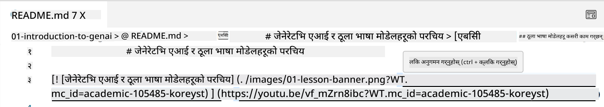
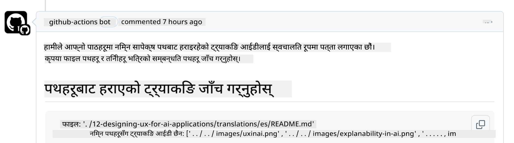
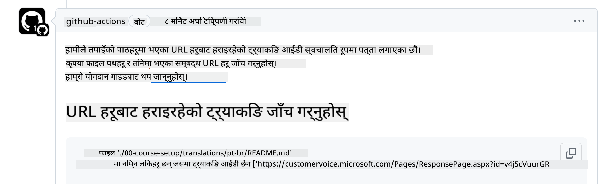
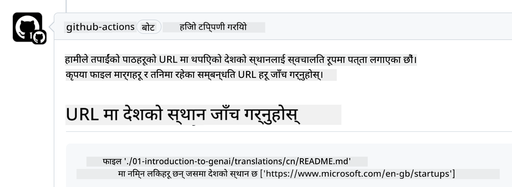

<!--
CO_OP_TRANSLATOR_METADATA:
{
  "original_hash": "57c41f2af71001a2cff9d8eb797cb843",
  "translation_date": "2025-05-19T11:13:18+00:00",
  "source_file": "CONTRIBUTING.md",
  "language_code": "ne"
}
-->
# योगदान

यो परियोजनाले योगदान र सुझावलाई स्वागत गर्दछ। अधिकांश योगदानहरूमा तपाईंसँग यो अधिकार छ भनी घोषणा गर्ने एक योगदानकर्ता लाइसेन्स सम्झौता (CLA) मा सहमत हुनु आवश्यक छ, र वास्तवमै, हामीलाई तपाईंकै योगदान प्रयोग गर्ने अधिकार दिनुहोस्। विस्तृत जानकारीको लागि, <https://cla.microsoft.com> मा जानुहोस्।

> महत्त्वपूर्ण: यस रिपोजिटरीमा पाठ अनुवाद गर्दा, कृपया मेसिन अनुवाद प्रयोग नगर्नुहोस्। हामी अनुवादलाई समुदाय मार्फत प्रमाणित गर्नेछौं, त्यसैले मात्र तपाईंले राम्रोसँग बोल्न सक्ने भाषामा अनुवादको लागि स्वयंसेवा गर्नुहोस्।

जब तपाईंले एक पुल अनुरोध पेश गर्नुहुन्छ, CLA-बोटले स्वचालित रूपमा तपाईंलाई CLA प्रदान गर्न आवश्यक छ कि छैन भनेर निर्धारण गर्नेछ र PR लाई उपयुक्त रूपमा सजाउनेछ (जस्तै, लेबल, टिप्पणी)। बोटले दिएको निर्देशनहरू मात्र पालना गर्नुहोस्। तपाईंले यो हाम्रो CLA प्रयोग गर्ने सबै रिपोजिटरीहरूमा मात्र एक पटक गर्न आवश्यक छ।

## आचार संहिता

यो परियोजनाले [Microsoft Open Source Code of Conduct](https://opensource.microsoft.com/codeofconduct/?WT.mc_id=academic-105485-koreyst) अपनाएको छ। थप जानकारीको लागि [Code of Conduct FAQ](https://opensource.microsoft.com/codeofconduct/faq/?WT.mc_id=academic-105485-koreyst) पढ्नुहोस् वा [opencode@microsoft.com](mailto:opencode@microsoft.com) मा थप प्रश्न वा टिप्पणीहरूका लागि सम्पर्क गर्नुहोस्।

## प्रश्न वा समस्या?

कृपया सामान्य समर्थन प्रश्नहरूको लागि GitHub समस्याहरू नखोल्नुहोस् किनकि GitHub सूचीलाई सुविधा अनुरोध र बग रिपोर्टहरूको लागि प्रयोग गर्नुपर्छ। यसरी हामी कोडबाट वास्तविक समस्याहरू वा बगहरू सजिलैसँग ट्र्याक गर्न सक्छौं र सामान्य छलफललाई वास्तविक कोडबाट अलग राख्न सक्छौं।

## टाइपो, समस्या, बगहरू र योगदानहरू

जब तपाईं कुनै पनि परिवर्तनहरू Generative AI for Beginners रिपोजिटरीमा पेश गर्नुहुन्छ, कृपया यी सिफारिसहरू पालना गर्नुहोस्।

* आफ्नो परिवर्तनहरू गर्नु अघि सधैं रिपोजिटरीलाई आफ्नो खातामा फोर्क गर्नुहोस्
* एकै पटकमा धेरै परिवर्तनहरूलाई एक पुल अनुरोधमा नजोड्नुहोस्। उदाहरणका लागि, कुनै पनि बग फिक्स र दस्तावेज अपडेटहरू छुट्टाछुट्टै PRs प्रयोग गरेर पेश गर्नुहोस्
* यदि तपाईंको पुल अनुरोधले मर्ज विवादहरू देखाउँछ भने, कृपया आफ्नो स्थानीय मुख्यलाई मुख्य रिपोजिटरीमा रहेको कुराको ऐना बनाउन सुनिश्चित गर्नुहोस्
* यदि तपाईं अनुवाद पेश गर्दै हुनुहुन्छ भने, कृपया सबै अनुवादित फाइलहरूको लागि एक PR सिर्जना गर्नुहोस् किनकि हामी सामग्रीको आंशिक अनुवाद स्वीकार गर्दैनौं
* यदि तपाईं टाइपो वा दस्तावेज फिक्स पेश गर्दै हुनुहुन्छ भने, उपयुक्त ठाउँमा एकल PR मा परिवर्तनहरू संयोजन गर्न सक्नुहुन्छ

## लेखनको लागि सामान्य मार्गदर्शन

- सुनिश्चित गर्नुहोस् कि तपाईंका सबै URLs वर्ग कोष्ठकमा राखिएका छन् र त्यसपछि कुनै अतिरिक्त स्थान बिना वा भित्र कोष्ठकमा राखिएका छन् ``।
- सुनिश्चित गर्नुहोस् कि कुनै पनि सापेक्ष लिंक (अर्थात् रिपोजिटरीमा अन्य फाइलहरू र फोल्डरहरूमा लिंकहरू) `./` बाट सुरु हुन्छ, जुन वर्तमान कार्य निर्देशिकामा अवस्थित फाइल वा फोल्डरलाई जनाउँछ वा `../` जुन अभिभावक कार्य निर्देशिकामा अवस्थित फाइल वा फोल्डरलाई जनाउँछ।
- सुनिश्चित गर्नुहोस् कि कुनै पनि सापेक्ष लिंक (अर्थात् रिपोजिटरीमा अन्य फाइलहरू र फोल्डरहरूमा लिंकहरू) मा ट्र्याकिङ आईडी (अर्थात् `?` वा `&` त्यसपछि `wt.mc_id=` वा `WT.mc_id=`) अन्त्यमा छ।
- सुनिश्चित गर्नुहोस् कि _github.com, microsoft.com, visualstudio.com, aka.ms, र azure.com_ का निम्न डोमेनहरूबाट कुनै पनि URL मा ट्र्याकिङ आईडी (अर्थात् `?` वा `&` त्यसपछि `wt.mc_id=` वा `WT.mc_id=`) अन्त्यमा छ।
- सुनिश्चित गर्नुहोस् कि तपाईंका लिंकहरूमा देश विशेष स्थान छैन (अर्थात् `/en-us/` वा `/en/`)।
- सुनिश्चित गर्नुहोस् कि सबै छविहरू `./images` फोल्डरमा भण्डारण गरिएका छन्।
- सुनिश्चित गर्नुहोस् कि छविहरूमा वर्णनात्मक नामहरू छन् जसमा अंग्रेजी अक्षरहरू, सङ्ख्याहरू, र ड्यासहरू छन्।

## GitHub कार्यप्रवाहहरू

जब तपाईं एक पुल अनुरोध पेश गर्नुहुन्छ, चार विभिन्न कार्यप्रवाहहरू पहिलाका नियमहरूलाई मान्य गर्न ट्रिगर हुनेछ। कार्यप्रवाह जाँचहरू पास गर्न यहाँ सूचीबद्ध निर्देशनहरू मात्र पालना गर्नुहोस्।

- [टुटेको सापेक्ष पथहरू जाँच गर्नुहोस्](../..)
- [पथहरूमा ट्र्याकिङ छ कि छैन जाँच गर्नुहोस्](../..)
- [URLs मा ट्र्याकिङ छ कि छैन जाँच गर्नुहोस्](../..)
- [URLs मा स्थान छैन कि छैन जाँच गर्नुहोस्](../..)

### टुटेको सापेक्ष पथहरू जाँच गर्नुहोस्

यस कार्यप्रवाहले तपाईंका फाइलहरूमा कुनै पनि सापेक्ष पथ काम गर्दैछ कि छैन भनेर सुनिश्चित गर्दछ। यो रिपोजिटरी GitHub पेजहरूमा तैनाथ गरिएको छ, त्यसैले तपाईंले सबै कुरा सही ठाउँमा निर्देशित गर्न लिंकहरू टाइप गर्दा धेरै सावधान हुन आवश्यक छ।

तपाईंका लिंकहरू सहीसँग काम गरिरहेका छन् भनेर सुनिश्चित गर्नको लागि, VS कोड प्रयोग गरेर जाँच गर्नुहोस्।

उदाहरणका लागि, जब तपाईं कुनै पनि लिंकमा होभर गर्नुहुन्छ, तपाईंलाई **ctrl + click** दबाएर लिंक पछ्याउन संकेत गरिनेछ।

यदि तपाईंले कुनै लिंकमा क्लिक गर्नुभयो र यो स्थानीय रूपमा काम गरिरहेको छैन भने, पक्कै पनि यसले कार्यप्रवाहलाई ट्रिगर गर्नेछ र GitHub मा काम गर्नेछैन।

यस समस्यालाई समाधान गर्न, VS कोडको मद्दतले लिंक टाइप गर्न प्रयास गर्नुहोस्।

जब तपाईं `./` वा `../` टाइप गर्नुहुन्छ, VS कोडले तपाईंले टाइप गरेको अनुसार उपलब्ध विकल्पहरूबाट छनोट गर्न संकेत गर्नेछ।

इच्छित फाइल वा फोल्डरमा क्लिक गरेर पथ पछ्याउनुहोस् र तपाईंको पथ टुटेको छैन भनेर सुनिश्चित गर्नुहोस्।

एकपटक तपाईंले सही सापेक्ष पथ थप्नुभयो भने, परिवर्तनहरू सुरक्षित गर्नुहोस् र पुश गर्नुहोस्, कार्यप्रवाह फेरि तपाईंका परिवर्तनहरू प्रमाणित गर्न ट्रिगर हुनेछ। यदि तपाईं जाँच पास गर्नुहुन्छ भने, तपाईं तयार हुनुहुन्छ।

### पथहरूमा ट्र्याकिङ छ कि छैन जाँच गर्नुहोस्

यस कार्यप्रवाहले कुनै पनि सापेक्ष पथमा ट्र्याकिङ छ कि छैन भनेर सुनिश्चित गर्दछ। यो रिपोजिटरी GitHub पेजहरूमा तैनाथ गरिएको छ, त्यसैले हामीलाई विभिन्न फाइलहरू र फोल्डरहरू बीचको गतिविधिलाई ट्र्याक गर्न आवश्यक छ।

तपाईंका सापेक्ष पथहरूमा ट्र्याकिङ छ कि छैन भनेर सुनिश्चित गर्न, पथको अन्त्यमा निम्न पाठ `?wt.mc_id=` को लागि जाँच गर्नुहोस्। यदि यो तपाईंका सापेक्ष पथहरूमा जोडिएको छ भने, तपाईं यो जाँच पास गर्नुहुनेछ।

यदि छैन भने, तपाईंलाई निम्न त्रुटि हुन सक्छ।

यस समस्यालाई समाधान गर्न, कार्यप्रवाहले हाइलाइट गरेको फाइल पथ खोल्न प्रयास गर्नुहोस् र सापेक्ष पथहरूको अन्त्यमा ट्र्याकिङ आईडी थप्नुहोस्।

एकपटक तपाईंले ट्र्याकिङ आईडी थप्नुभयो भने, परिवर्तनहरू सुरक्षित गर्नुहोस् र पुश गर्नुहोस्, कार्यप्रवाह फेरि तपाईंका परिवर्तनहरू प्रमाणित गर्न ट्रिगर हुनेछ। यदि तपाईं जाँच पास गर्नुहुन्छ भने, तपाईं तयार हुनुहुन्छ।

### URLs मा ट्र्याकिङ छ कि छैन जाँच गर्नुहोस्

यस कार्यप्रवाहले कुनै पनि वेब URL मा ट्र्याकिङ छ कि छैन भनेर सुनिश्चित गर्दछ। यो रिपोजिटरी सबैको लागि उपलब्ध छ, त्यसैले तपाईंले कहाँबाट ट्राफिक आइरहेको छ थाहा पाउनको लागि पहुँचलाई ट्र्याक गर्न सुनिश्चित गर्नु आवश्यक छ।

तपाईंका URLs मा ट्र्याकिङ छ कि छैन भनेर सुनिश्चित गर्न, URL को अन्त्यमा निम्न पाठ `?wt.mc_id=` को लागि जाँच गर्नुहोस्। यदि यो तपाईंका URLs मा जोडिएको छ भने, तपाईं यो जाँच पास गर्नुहुनेछ।

यदि छैन भने, तपाईंलाई निम्न त्रुटि हुन सक्छ।

यस समस्यालाई समाधान गर्न, कार्यप्रवाहले हाइलाइट गरेको फाइल पथ खोल्न प्रयास गर्नुहोस् र URLs को अन्त्यमा ट्र्याकिङ आईडी थप्नुहोस्।

एकपटक तपाईंले ट्र्याकिङ आईडी थप्नुभयो भने, परिवर्तनहरू सुरक्षित गर्नुहोस् र पुश गर्नुहोस्, कार्यप्रवाह फेरि तपाईंका परिवर्तनहरू प्रमाणित गर्न ट्रिगर हुनेछ। यदि तपाईं जाँच पास गर्नुहुन्छ भने, तपाईं तयार हुनुहुन्छ।

### URLs मा स्थान छैन कि छैन जाँच गर्नुहोस्

यस कार्यप्रवाहले कुनै पनि वेब URL मा देश विशेष स्थान छैन कि छैन भनेर सुनिश्चित गर्दछ। यो रिपोजिटरी विश्वभरिका सबैको लागि उपलब्ध छ, त्यसैले तपाईंले URLs मा आफ्नो देशको स्थान समावेश नगर्न सुनिश्चित गर्नु आवश्यक छ।

तपाईंका URLs मा देशको स्थान छैन कि छैन भनेर सुनिश्चित गर्न, URL मा कहीं पनि निम्न पाठ `/en-us/` वा `/en/` वा कुनै अन्य भाषा स्थानको लागि जाँच गर्नुहोस्। यदि यो तपाईंका URLs मा छैन भने, तपाईं यो जाँच पास गर्नुहुनेछ।

यदि छैन भने, तपाईंलाई निम्न त्रुटि हुन सक्छ।

यस समस्यालाई समाधान गर्न, कार्यप्रवाहले हाइलाइट गरेको फाइल पथ खोल्न प्रयास गर्नुहोस् र URLs बाट देश स्थान हटाउनुहोस्।

एकपटक तपाईंले देश स्थान हटाउनुभयो भने, परिवर्तनहरू सुरक्षित गर्नुहोस् र पुश गर्नुहोस्, कार्यप्रवाह फेरि तपाईंका परिवर्तनहरू प्रमाणित गर्न ट्रिगर हुनेछ। यदि तपाईं जाँच पास गर्नुहुन्छ भने, तपाईं तयार हुनुहुन्छ।

बधाई छ! तपाईंको योगदानको बारेमा प्रतिक्रिया दिनेछौं।

**अस्वीकरण**:  
यो दस्तावेज़ AI अनुवाद सेवा [Co-op Translator](https://github.com/Azure/co-op-translator) प्रयोग गरेर अनुवाद गरिएको हो। हामी यथासम्भव शुद्धताको प्रयास गर्छौं, तर कृपया बुझ्नुहोस् कि स्वचालित अनुवादहरूमा त्रुटिहरू वा अशुद्धताहरू हुन सक्छन्। यसको मूल भाषामा रहेको दस्तावेज़लाई आधिकारिक स्रोतको रूपमा मान्नुपर्छ। महत्वपूर्ण जानकारीको लागि, व्यावसायिक मानव अनुवाद सिफारिस गरिन्छ। यस अनुवादको प्रयोगबाट उत्पन्न कुनै पनि गलतफहमी वा गलत व्याख्याको लागि हामी उत्तरदायी हुनेछैनौं।