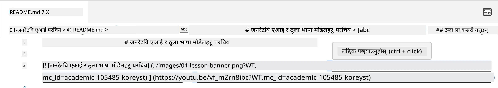
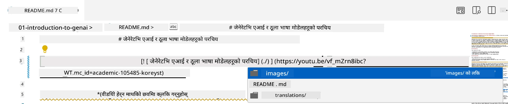
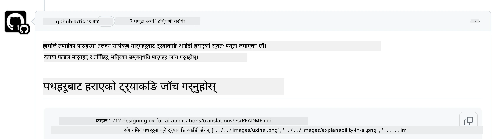
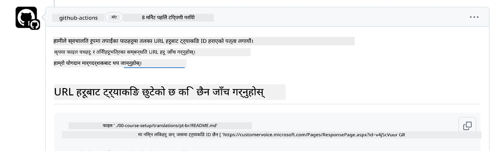
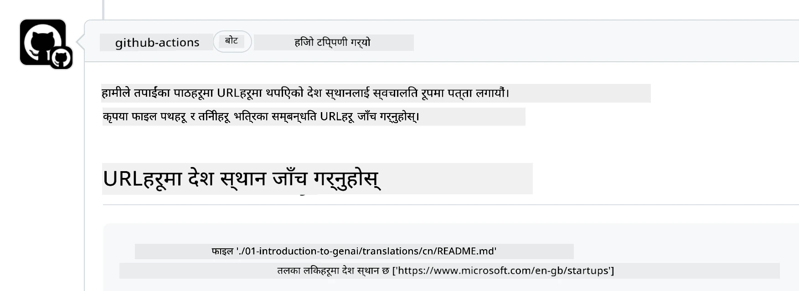

# योगदान

यस परियोजनाले योगदान र सुझावहरूलाई स्वागत गर्दछ। अधिकांश योगदानहरूको लागि तपाईंले 
एक Contributer License Agreement (CLA) मा सहमति जनाउनु आवश्यक छ जसले घोषणा गर्दछ कि तपाईंलाई 
तपाईंको योगदान प्रयोग गर्नका लागि अधिकार छ, र तपाईं साँच्चिकै हामीलाई ती अधिकारहरू दिनुहुन्छ। विवरणका लागि, 
<a href="https://cla.microsoft.com" target="_blank" rel="noopener noreferrer">https://cla.microsoft.com</a> मा जानुहोस्।

> महत्वपूर्ण: यस रिपोजिटोरीमा पाठ अनुवाद गर्दा कृपया मेसिन अनुवाद प्रयोग नगर्नुहोस्। हामी अनुवादहरूलाई समुदायमार्फत जाँच्नेछौँ, त्यसैले कृपया ति भाषाहरूमा मात्र अनुवाद स्वयंसेवा गर्नुहोस् जुनमा तपाईं प्रवीण हुनुहुन्छ।

जब तपाईं पुल रिक्वेस्ट पेश गर्नुहुन्छ, एक CLA-बटले स्वचालित रूपमा निर्धारण गर्नेछ कि तपाईंले CLA प्रदान गर्न आवश्यक छ वा छैन र PR लाई उपयुक्त रूपमा चिह्नित गर्नेछ (जस्तै, लेबल, टिप्पणी)। मात्र बटले दिएको निर्देशनहरू पालना गर्नुहोस्। हाम्रो CLA प्रयोग गर्ने सबै रिपोजिटोरीहरूमा तपाईंले यसलाई केवल एकपटक गर्नुपर्ने हुन्छ।

## आचार संहिता

यस परियोजनाले [Microsoft Open Source Code of Conduct](https://opensource.microsoft.com/codeofconduct/?WT.mc_id=academic-105485-koreyst) अपनाएको छ। 
थप जानकारीका लागि [Code of Conduct FAQ](https://opensource.microsoft.com/codeofconduct/faq/?WT.mc_id=academic-105485-koreyst) पढ्नुहोस् वा कुनै अतिरिक्त प्रश्न वा टिप्पणीका लागि [opencode@microsoft.com](mailto:opencode@microsoft.com) मा सम्पर्क गर्नुहोस्।

## प्रश्न वा समस्या?

कृपया सामान्य समर्थन प्रश्नका लागि GitHub इश्यूहरू खोल्न नदिनुहोस् किनकि GitHub सूची सुविधाहरूको अनुरोध र बिट रिपोर्टहरूका लागि प्रयोग गर्नु पर्छ। यसबाट हामीलाई वास्तविक समस्या वा बगहरू कोडबाट सजिलै ट्र्याक गर्न र सामान्य छलफललाई कोडबाट अलग राख्न मद्दत पुग्छ।

## त्रुटिहरू, समस्याहरू, बगहरू र योगदानहरू

जब तपाईं Generative AI for Beginners रिपोजिटोरीमा कुनै पनि परिवर्तनहरू पेश गर्नुहुन्छ, कृपया यी सिफारिसहरू पालना गर्नुहोस्।

* सँधै परिवर्तनहरू गर्नुअघि रिपोजिटोरीलाई आफ्नो खातामा फोर्क गर्नुहोस्
* एउटै पुल रिक्वेस्टमा धेरै परिवर्तनहरू मिसाउनु हुँदैन। उदाहरणका लागि, कुनै पनि बग फिक्स र कागजात अपडेटहरू अलग PR मा पेश गर्नुहोस्
* यदि तपाईंको पुल रिक्वेस्टले मर्ज कन्फ्लिक्ट देखाउँछ भने, तपाईंले आफ्नो स्थानीय मैनलाई मुख्य रिपोजिटोरीमा रहेको मैनको मिरर जस्तो अपडेट गर्नुहोस् र त्यसपछि मात्र परिवर्तनहरू गर्नुहोस्
* यदि तपाईं अनुवाद पेश गर्दै हुनुहुन्छ भने सबै अनुवादित फाइलका लागि एकै PR बनाउनुहोस् किनकि हामी अंशिक अनुवादहरू स्वीकार गर्दैनौं
* यदि तपाईं टाइपोस वा कागजात सुधार पेश गर्दै हुनुहुन्छ भने, उपयुक्त ठाउँहरूमा संशोधनहरू एकल PR मा मिसाउन सक्नुहुन्छ

## लेखनका लागि सामान्य सुझाव

- तपाईंका सबै URL लाई वृताकार कोष्ठकमा राखिएको र पसल चिह्नको साथ खालि ठाउँ नदिई लेखिएको सुनिश्चित गर्नुहोस् ``.
- कुनै पनि सापेक्ष लिंक (जस्तै अन्य फाइल वा फोल्डरका लागि लिंकहरू) सुरूवात `./` बाट हुनुपर्छ जुन हालको कार्यरत डिरेक्टरीमा फाइल वा फोल्डर जनाउँछ वा `../` बाट सुरु हुनुपर्छ जुन आमाबुवाको कार्यरत डिरेक्टरीमा फाइल वा फोल्डर जनाउँछ।
- कुनै पनि सापेक्ष लिंकको अन्त्यमा ट्र्याकिङ ID (जस्तै `?` वा `&` पछि `wt.mc_id=` वा `WT.mc_id=`) हुनुपर्छ।
- निम्न डोमेनहरूबाट कुनै पनि URL (_github.com, microsoft.com, visualstudio.com, aka.ms, र azure.com_) मा ट्र्याकिङ ID (जस्तै `?` वा `&` पछि `wt.mc_id=` वा `WT.mc_id=`) हुनुपर्छ।
- तपाईंका लिङ्कहरूमा देश विशेषको स्थानिय भाषा नहोस् (जस्तै `/en-us/` वा `/en/`).
- सबै छविहरू `./images` फोल्डरमा राखिएका हुनुपर्छ।
- छविहरूको नाम वर्णनात्मक होस् र नाममा अंग्रेजी अक्षर, अंक, र ड्याशहरू प्रयोग गरियोस्।

## GitHub वर्कफ्लोज़हरू

जब तपाईं पुल रिक्वेस्ट पेश गर्नुहुन्छ, चारवटा विभिन्न वर्कफ्लोहरू पहिलेका नियमहरूको पुष्टि गर्न ट्रिगर हुनेछन्। 
सिर्फ यहाँ दिइएका निर्देशनहरू पालना गरेर वर्कफ्लो जाँचहरू पास गर्नुहोस्।

- [टुटेका सापेक्ष पथहरू जाँच्नुहोस्](#टुटेका-सापेक्ष-पथहरू-जाँच्नुहोस्)
- [पथहरूमा ट्र्याकिङ छ जाँच गर्नुहोस्](#पथहरूमा-ट्र्याकिङ-छ-जाँच-गर्नुहोस्)
- [URLs मा ट्र्याकिङ छ जाँच गर्नुहोस्](#urls-मा-ट्र्याकिङ-छ-जाँच-गर्नुहोस्)
- [URLs मा स्थानिय भाषा छैन जाँच गर्नुहोस्](#urls-मा-स्थानिय-भाषा-छैन-जाँच-गर्नुहोस्)

### टुटेका सापेक्ष पथहरू जाँच्नुहोस्

यस वर्कफ्लोले तपाईंका फाइलहरूमा कुनै पनि सापेक्ष पथ काम गरिरहेको छ कि छैन सुनिश्चित गर्दछ। 
यो रिपोजिटोरी GitHub पृष्ठहरुमा तैनाथ गरिएको छ, त्यसैले लिंकहरू टाइप गर्दा धेरै सावधानी अपनाउनु पर्छ ताकि कसैलाई गलत स्थानमा नल्याओस्।

तपाईंका लिंकहरू सही छन् कि छैन VS कोड प्रयोग गरेर जाँच्न सक्नुहुन्छ।

उदाहरणका लागि, तपाईंका फाइलहरूमा कुनै लिंकमा माउस राख्दा तपाईंलाई लिंकमा जान **ctrl + click** थिच्न प्रोत्साहित गरिन्छ।

यदि तपाईं लिंकमा क्लिक गर्दा स्थानीय रूपमा काम गर्दैन भने, पक्का यो वर्कफ्लोले पनि त्रुटि दिनेछ र GitHub मा पनि काम नगर्नेछ।

यो समस्या समाधान गर्न VS कोडको सहयोगले लिंक टाइप गर्ने प्रयास गर्नुहोस्।

जब तपाईं `./` वा `../` टाइप गर्नुहुन्छ VS कोडले तपाईंले टाइप गरेको आधारमा उपलब्ध विकल्पहरूबाट छनोट गर्न प्रोत्साहित गर्नेछ।

चाहिएको फाइल वा फोल्डरमा क्लिक गरी पथ पछ्याउनुहोस् र पक्का गर्नुहोस् कि तपाईंको पथ टुटेको छैन।

सही सापेक्ष पथ थपेर, संरक्षण गरी परिवर्तनहरू पुश गरेपछि वर्कफ्लो फेरि ट्रिगर हुनेछ तपाईंका परिवर्तनहरूको पुष्टि गर्न। यदि तपाईंले चेक पास गर्नुभयो भने, अब सबै ठिक छ।

### पथहरूमा ट्र्याकिङ छ जाँच गर्नुहोस्

यस वर्कफ्लोले कुनै पनि सापेक्ष पथमा ट्र्याकिङ छ कि छैन सुनिश्चित गर्दछ। 
यो रिपोजिटोरी GitHub पृष्ठहरुमा तैनाथ गरिएको भएकाले हामीलाई विभिन्न फाइल र फोल्डरहरू बीचको चलाखी ट्र्याक गर्नु आवश्यक छ।

तपाईंका सापेक्ष पथमा `?wt.mc_id=` अन्त्यमा भएको छ कि छैन भनेर जांच गर्नुहोस्। 
यदि छ भने तपाईंले यो परीक्षण पास गर्नु हुनेछ।

यदि छैन भने, तपाईं यस प्रकारको त्रुटि देख्न सक्नुहुन्छ।

यो समस्या समाधान गर्न वर्कफ्लोले उजागर गरेको फाइल पथ खोल्नुहोस् र सापेक्ष पथको अन्त्यमा ट्र्याकिङ ID थप्नुहोस्।

ट्र्याकिङ ID थपेर, सेभ गरी परिवर्तनहरू पुश गरेपछि वर्कफ्लो पुनः ट्रिगर भएर तपाईंका परिवर्तनहरू पुष्टि गर्नेछ। पास भए तपाईं ठीक हुनुहुन्छ।

### URLs मा ट्र्याकिङ छ जाँच गर्नुहोस्

यस वर्कफ्लोले कुनै पनि वेब URL मा ट्र्याकिङ छ कि छैन सुनिश्चित गर्दछ।
यो रिपोजिटोरी सबैलाई उपलब्ध छ त्यसैले ट्राफिक कहाँबाट आइरहेको छ थाहा पाउन ट्र्याकिङ सुनिश्चित गर्नु आवश्यक छ।

तपाईंका URL मा `?wt.mc_id=` अन्त्यमा छ कि छैन जाँच गर्नुहोस्।
यदि छ भने तपाईंले यो परीक्षण पास गर्नुहुनेछ।

यदि छैन भने, निम्न त्रुटि देख्न सक्नुहुन्छ।

 ट्र्याकिङ फालिएको देखाउने GitHub टिप्पणीको स्क्रीनसट।")

यो समस्या समाधान गर्न वर्कफ्लोले उल्लेख गरेको फाइल पथ खोल्नुहोस् र URL को अन्त्यमा ट्र्याकिङ ID थप्नुहोस्।

ट्र्याकिङ ID थपेर, सेभ गरी परिवर्तनहरू पुश गरेपछि वर्कफ्लो फेरि ट्रिगर भएर पुष्टि गर्नेछ। पास भए तपाईं सबै ठिक छ।

### URLs मा स्थानिय भाषा छैन जाँच गर्नुहोस्

यस वर्कफ्लोले कुनै पनि वेब URL मा देश विशेषको स्थानिय भाषा नहोस् भन्ने सुनिश्चित गर्दछ।
यो रिपोजिटोरी सबै विश्वमा उपलब्ध छ त्यसैले तपाईंले आफ्नो देशको स्थानिय भाषा URL मा नसमावेश गर्न सुनिश्चित गर्नु आवश्यक छ।

तपाईंका URL मा `/en-us/` वा `/en/` वा अन्य कुनै पनि भाषा स्थानियता कहीं छ कि छैन जाँच गर्नुहोस्। 
यदि छैन भने तपाईं परीक्षण पास गर्नुहुनेछ।

यदि छ भने, निम्न त्रुटि देख्न सक्नुहुन्छ।

यो समस्या समाधान गर्न वर्कफ्लोले उल्लिखित फाइल पथ खोल्नुहोस् र URL बाट देश स्थानियता हटाउनुहोस्।

देश स्थानियता हटाएर, सेभ गरी परिवर्तनहरू पुश गरेपछि वर्कफ्लो फेरि ट्रिगर हुनेछ र पुष्टि गर्नेछ। पास भए तपाईं सबै ठिक छ।

बधाई छ! हामी चाँडै तपाईंको योगदान सम्बन्धी सुझाव सहित सम्पर्क गर्नेछौं।

---

<!-- CO-OP TRANSLATOR DISCLAIMER START -->
**अस्वीकरण**:
यो दस्तावेज़ AI अनुवाद सेवा [Co-op Translator](https://github.com/Azure/co-op-translator) प्रयोग गरेर अनुवाद गरिएको हो। हामी सही हुन प्रयास गर्छौं, तर कृपया जानकार हुनुस् कि स्वचालित अनुवादमा त्रुटिहरू वा अशुद्धताहरू हुन सक्छन्। मूल दस्तावेज़ यसको मूल भाषामा आधिकारिक स्रोत मानिनुपर्छ। महत्वपूर्ण जानकारीका लागि व्यावसायिक मानव अनुवाद सिफारिस गरिन्छ। यस अनुवादको प्रयोगबाट उत्पन्न कुनै पनि गलत बुझाइ वा त्रुटिको लागि हामी जिम्मेवार छैनौं।
<!-- CO-OP TRANSLATOR DISCLAIMER END -->