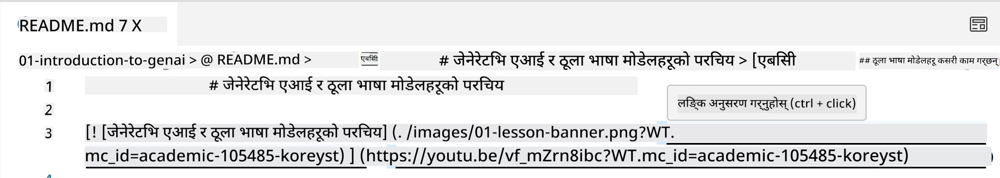
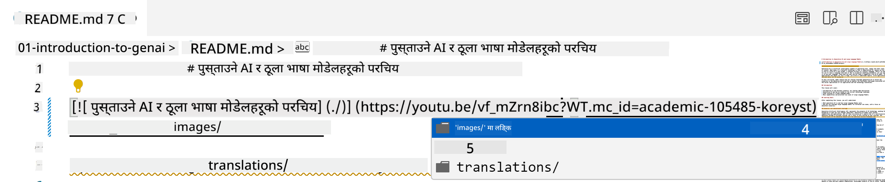
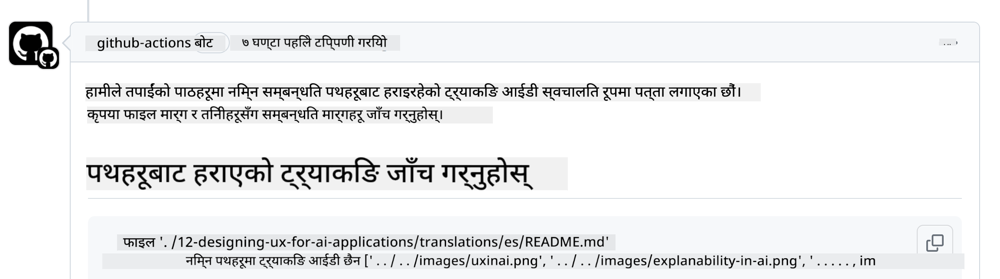
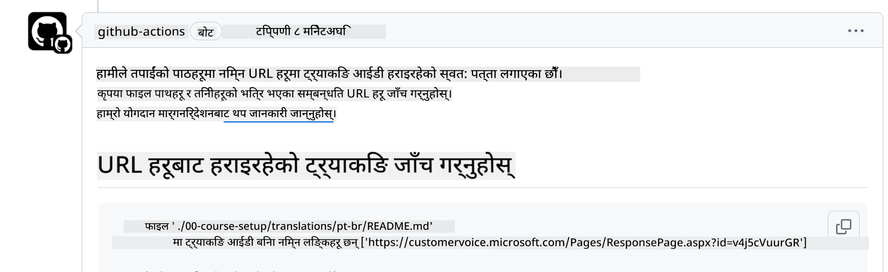
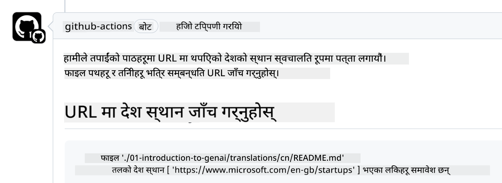

<!--
CO_OP_TRANSLATOR_METADATA:
{
  "original_hash": "57c41f2af71001a2cff9d8eb797cb843",
  "translation_date": "2025-06-25T07:06:42+00:00",
  "source_file": "CONTRIBUTING.md",
  "language_code": "ne"
}
-->
# योगदान

यस परियोजनाले योगदान र सुझावहरूलाई स्वागत गर्दछ। अधिकांश योगदानहरूले तपाईलाई एक योगदानकर्ता लाइसेन्स सम्झौता (CLA) मा सहमत हुन आवश्यक छ जसले तपाईंसँग अधिकार छ, र वास्तवमा, तपाईको योगदान प्रयोग गर्न हामीलाई अधिकार दिन्छ। थप विवरणको लागि, <https://cla.microsoft.com> मा जानुहोस्।

> महत्त्वपूर्ण: यस रिपोमा पाठ अनुवाद गर्दा, कृपया मेसिन अनुवाद प्रयोग नगर्नुहोस्। हामी अनुवादलाई समुदाय मार्फत प्रमाणित गर्नेछौं, त्यसैले कृपया तपाईँले राम्रोसँग जानेको भाषामा मात्र अनुवाद गर्न स्वयंसेवक गर्नुहोस्।

जब तपाईले पुल अनुरोध पेश गर्नुहुन्छ, CLA-बोटले स्वतः निर्धारण गर्नेछ कि तपाईलाई CLA प्रदान गर्न आवश्यक छ कि छैन र PR लाई उचित रूपमा सजाउनेछ (जस्तै, लेबल, टिप्पणी)। बोटले दिएको निर्देशनहरू मात्र पालना गर्नुहोस्। तपाईलाई हाम्रो CLA प्रयोग गर्ने सबै रिपोजिटरीहरूमा एक पटक मात्र यो गर्न आवश्यक हुनेछ।

## आचार संहिता

यस परियोजनाले [Microsoft Open Source Code of Conduct](https://opensource.microsoft.com/codeofconduct/?WT.mc_id=academic-105485-koreyst) अपनाएको छ। थप जानकारीको लागि [Code of Conduct FAQ](https://opensource.microsoft.com/codeofconduct/faq/?WT.mc_id=academic-105485-koreyst) पढ्नुहोस् वा [opencode@microsoft.com](mailto:opencode@microsoft.com) मा थप प्रश्न वा टिप्पणीहरूका लागि सम्पर्क गर्नुहोस्।

## प्रश्न वा समस्या?

कृपया साधारण समर्थन प्रश्नहरूको लागि GitHub मुद्दाहरू नखोल्नुहोस् किनकि GitHub सूची सुविधा अनुरोधहरू र बग रिपोर्टहरूको लागि प्रयोग गर्नुपर्छ। यसरी हामीले वास्तविक समस्याहरू वा कोडका बगहरूलाई सजिलैसँग ट्र्याक गर्न सक्छौं र सामान्य छलफललाई वास्तविक कोडबाट अलग राख्न सक्छौं।

## टाइपो, समस्याहरू, बगहरू र योगदानहरू

जब तपाई कुनै पनि परिवर्तनहरू Generative AI for Beginners रिपोजिटरीमा पेश गर्दै हुनुहुन्छ, कृपया यी सिफारिसहरू पालना गर्नुहोस्।

* तपाईका परिवर्तनहरू गर्नुअघि सधैं रिपोजिटरीलाई आफ्नो खातामा फोर्क गर्नुहोस्
* एकै पटक धेरै परिवर्तनहरूलाई एक पुल अनुरोधमा मिलाउनुहोस्। उदाहरणका लागि, कुनै पनि बग फिक्स र दस्तावेज अपडेटहरूलाई अलग PRs प्रयोग गरेर पेश गर्नुहोस्
* यदि तपाईको पुल अनुरोधमा मर्ज द्वन्द्वहरू देखाउँछ भने, आफ्नो स्थानीय मुख्य शाखालाई मुख्य रिपोजिटरीमा भएको कुराको ऐना बनाउन अपडेट गर्नुहोस् र त्यसपछि तपाईका परिवर्तनहरू गर्नुहोस्
* यदि तपाई अनुवाद पेश गर्दै हुनुहुन्छ भने, कृपया सबै अनुवादित फाइलहरूको लागि एक PR बनाउनुहोस् किनकि हामी सामग्रीको आंशिक अनुवाद स्वीकार गर्दैनौं
* यदि तपाई टाइपो वा दस्तावेज फिक्स पेश गर्दै हुनुहुन्छ भने, उपयुक्त ठाउँमा एकल PR मा परिवर्तनहरूलाई मिलाउन सक्नुहुन्छ

## लेखनको लागि सामान्य मार्गदर्शन

- सुनिश्चित गर्नुहोस् कि तपाईका सबै URLहरू चौकोर कोष्ठभित्र राखिएका छन् र तिनीहरू पछि कुनै अतिरिक्त स्थान बिना वा भित्रको कोष्ठकमा राखिएका छन् ``।
- सुनिश्चित गर्नुहोस् कि कुनै पनि सापेक्ष लिङ्क (अर्थात्, रिपोजिटरीमा अन्य फाइलहरू र फोल्डरहरूमा लिङ्कहरू) `./` सँग सुरु हुन्छ जुन हालको कार्य निर्देशिका वा `../` मा अवस्थित फाइल वा फोल्डरलाई जनाउँछ जुन अभिभावक कार्य निर्देशिकामा अवस्थित फाइल वा फोल्डरलाई जनाउँछ।
- सुनिश्चित गर्नुहोस् कि कुनै पनि सापेक्ष लिङ्क (अर्थात्, रिपोजिटरीमा अन्य फाइलहरू र फोल्डरहरूमा लिङ्कहरू) मा ट्र्याकिङ आईडी छ (अर्थात् `?` वा `&` त्यसपछि `wt.mc_id=` वा `WT.mc_id=`) अन्त्यमा।
- सुनिश्चित गर्नुहोस् कि निम्न डोमेनहरू _github.com, microsoft.com, visualstudio.com, aka.ms, र azure.com_ बाट कुनै पनि URL मा ट्र्याकिङ आईडी छ (अर्थात् `?` वा `&` त्यसपछि `wt.mc_id=` वा `WT.mc_id=`) अन्त्यमा।
- सुनिश्चित गर्नुहोस् कि तपाईका लिङ्कहरूमा देश विशेष स्थान छैन (अर्थात् `/en-us/` वा `/en/`)।
- सुनिश्चित गर्नुहोस् कि सबै छविहरू `./images` फोल्डरमा भण्डारण गरिएका छन्।
- सुनिश्चित गर्नुहोस् कि छविहरूमा अंग्रेजी वर्ण, नम्बरहरू, र ड्यासहरू प्रयोग गरेर वर्णनात्मक नामहरू छन्।

## GitHub कार्यप्रवाहहरू

जब तपाई पुल अनुरोध पेश गर्नुहुन्छ, चार फरक कार्यप्रवाहहरू पहिलाका नियमहरूलाई प्रमाणित गर्न ट्रिगर हुनेछ।
कार्यप्रवाह जाँचहरू पास गर्न यहाँ सूचीबद्ध निर्देशनहरू पालना गर्नुहोस्।

- [टुटेका सापेक्ष पथहरू जाँच गर्नुहोस्](../..)
- [पथहरूमा ट्र्याकिङ छ कि छैन जाँच गर्नुहोस्](../..)
- [URLहरूमा ट्र्याकिङ छ कि छैन जाँच गर्नुहोस्](../..)
- [URLहरूमा स्थान छैन कि छैन जाँच गर्नुहोस्](../..)

### टुटेका सापेक्ष पथहरू जाँच गर्नुहोस्

यो कार्यप्रवाह सुनिश्चित गर्दछ कि तपाईका फाइलहरूमा कुनै पनि सापेक्ष पथ काम गरिरहेको छ।
यो रिपोजिटरी GitHub पेजहरूमा तैनाथ गरिएको छ त्यसैले तपाईले लिंकहरू टाइप गर्दा धेरै सावधान रहनुपर्छ जसले सबै कुरा सँगै जोड्न गलत ठाउँमा कसैलाई निर्देश नगर्ने।

तपाईका लिङ्कहरू सही रूपमा काम गरिरहेका छन् भनेर सुनिश्चित गर्न, केवल VS कोड प्रयोग गरेर जाँच गर्नुहोस्।

उदाहरणका लागि, जब तपाईका फाइलहरूमा कुनै पनि लिङ्कमा माउस राख्नुहुन्छ, तपाईलाई **ctrl + click** थिचेर लिङ्क पछ्याउन संकेत गरिनेछ।

यदि तपाईले लिङ्कमा क्लिक गर्नुहुन्छ र यो स्थानीय रूपमा काम गर्दैन भने, पक्कै पनि यसले कार्यप्रवाहलाई ट्रिगर गर्नेछ र GitHub मा काम गर्ने छैन।

यस समस्यालाई समाधान गर्न, VS कोडको मद्दतले लिङ्क टाइप गर्न प्रयास गर्नुहोस्।

जब तपाई `./` वा `../` टाइप गर्नुहुन्छ, VS कोडले तपाईले टाइप गर्नुभएको अनुसार उपलब्ध विकल्पहरूबाट चयन गर्न संकेत गर्नेछ।

इच्छित फाइल वा फोल्डरमा क्लिक गरेर पथ पछ्याउनुहोस् र तपाईको पथ टुटेको छैन भनेर निश्चित हुनुहोस्।

सही सापेक्ष पथ थपेपछि, परिवर्तनहरू सुरक्षित गर्नुहोस् र पुश गर्नुहोस्, कार्यप्रवाह तपाईका परिवर्तनहरू प्रमाणित गर्न फेरि ट्रिगर हुनेछ।
यदि तपाई जाँच पास गर्नुहुन्छ भने तपाई अगाडि बढ्न सक्नुहुन्छ।

### पथहरूमा ट्र्याकिङ छ कि छैन जाँच गर्नुहोस्

यो कार्यप्रवाह सुनिश्चित गर्दछ कि कुनै पनि सापेक्ष पथमा ट्र्याकिङ छ।
यो रिपोजिटरी GitHub पेजहरूमा तैनाथ गरिएको छ त्यसैले हामीले विभिन्न फाइलहरू र फोल्डरहरू बीचको आन्दोलनलाई ट्र्याक गर्न आवश्यक छ।

तपाईका सापेक्ष पथहरूमा ट्र्याकिङ छ भनेर सुनिश्चित गर्न, केवल पथको अन्त्यमा निम्न पाठ `?wt.mc_id=` को लागि जाँच गर्नुहोस्।
यदि यो तपाईका सापेक्ष पथहरूमा थपिएको छ भने तपाईले यो जाँच पास गर्नुहुनेछ।

यदि छैन भने, तपाईले निम्न त्रुटि प्राप्त गर्न सक्नुहुन्छ।

यस समस्यालाई समाधान गर्न, कार्यप्रवाहले हाइलाइट गरेको फाइल पथ खोल्ने प्रयास गर्नुहोस् र सापेक्ष पथहरूको अन्त्यमा ट्र्याकिङ आईडी थप्नुहोस्।

ट्र्याकिङ आईडी थपेपछि, परिवर्तनहरू सुरक्षित गर्नुहोस् र पुश गर्नुहोस्, कार्यप्रवाह तपाईका परिवर्तनहरू प्रमाणित गर्न फेरि ट्रिगर हुनेछ।
यदि तपाई जाँच पास गर्नुहुन्छ भने तपाई अगाडि बढ्न सक्नुहुन्छ।

### URLहरूमा ट्र्याकिङ छ कि छैन जाँच गर्नुहोस्

यो कार्यप्रवाह सुनिश्चित गर्दछ कि कुनै पनि वेब URL मा ट्र्याकिङ छ।
यो रिपोजिटरी सबैलाई उपलब्ध छ त्यसैले तपाईले ट्र्याकिङ गर्न निश्चित गर्नुहोस् ताकि ट्राफिक कहाँबाट आएको हो थाहा पाउन सकियोस्।

तपाईका URLहरूमा ट्र्याकिङ छ भनेर सुनिश्चित गर्न, केवल URLको अन्त्यमा निम्न पाठ `?wt.mc_id=` को लागि जाँच गर्नुहोस्।
यदि यो तपाईका URLहरूमा थपिएको छ भने तपाईले यो जाँच पास गर्नुहुनेछ।

यदि छैन भने, तपाईले निम्न त्रुटि प्राप्त गर्न सक्नुहुन्छ।

यस समस्यालाई समाधान गर्न, कार्यप्रवाहले हाइलाइट गरेको फाइल पथ खोल्ने प्रयास गर्नुहोस् र URLहरूको अन्त्यमा ट्र्याकिङ आईडी थप्नुहोस्।

ट्र्याकिङ आईडी थपेपछि, परिवर्तनहरू सुरक्षित गर्नुहोस् र पुश गर्नुहोस्, कार्यप्रवाह तपाईका परिवर्तनहरू प्रमाणित गर्न फेरि ट्रिगर हुनेछ।
यदि तपाई जाँच पास गर्नुहुन्छ भने तपाई अगाडि बढ्न सक्नुहुन्छ।

### URLहरूमा स्थान छैन कि छैन जाँच गर्नुहोस्

यो कार्यप्रवाह सुनिश्चित गर्दछ कि कुनै पनि वेब URL मा देश विशेष स्थान छैन।
यो रिपोजिटरी विश्वभर उपलब्ध छ त्यसैले तपाईले URLहरूमा आफ्नो देशको स्थान समावेश नगर्न निश्चित गर्नुहोस्।

तपाईका URLहरूमा देश स्थान छैन भनेर सुनिश्चित गर्न, केवल URLमा कतै पनि निम्न पाठ `/en-us/` वा `/en/` वा कुनै अन्य भाषा स्थानको लागि जाँच गर्नुहोस्।
यदि यो तपाईका URLहरूमा उपस्थित छैन भने तपाईले यो जाँच पास गर्नुहुनेछ।

यदि छैन भने, तपाईले निम्न त्रुटि प्राप्त गर्न सक्नुहुन्छ।

यस समस्यालाई समाधान गर्न, कार्यप्रवाहले हाइलाइट गरेको फाइल पथ खोल्ने प्रयास गर्नुहोस् र URLहरूबाट देश स्थान हटाउनुहोस्।

देश स्थान हटाएपछि, परिवर्तनहरू सुरक्षित गर्नुहोस् र पुश गर्नुहोस्, कार्यप्रवाह तपाईका परिवर्तनहरू प्रमाणित गर्न फेरि ट्रिगर हुनेछ।
यदि तपाई जाँच पास गर्नुहुन्छ भने तपाई अगाडि बढ्न सक्नुहुन्छ।

बधाई छ! तपाईको योगदानको बारेमा प्रतिक्रिया सहित हामी चाँडै नै तपाईलाई जवाफ दिनेछौं।

**अस्वीकरण**:  
यो दस्तावेज AI अनुवाद सेवा [Co-op Translator](https://github.com/Azure/co-op-translator) प्रयोग गरेर अनुवाद गरिएको हो। हामी शुद्धताको लागि प्रयास गर्दछौं, कृपया जानकार रहनुहोस् कि स्वचालित अनुवादमा त्रुटिहरू वा अशुद्धताहरू हुन सक्छन्। यसको मूल भाषामा रहेको मूल दस्तावेजलाई अधिकारिक स्रोत मानिनु पर्छ। महत्वपूर्ण जानकारीको लागि, पेशेवर मानव अनुवाद सिफारिस गरिन्छ। यस अनुवादको प्रयोगबाट उत्पन्न हुने कुनै पनि गलतफहमी वा गलत व्याख्याको लागि हामी जिम्मेवार हुने छैनौं।