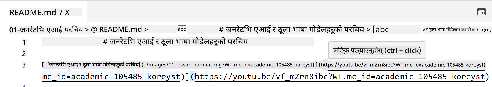
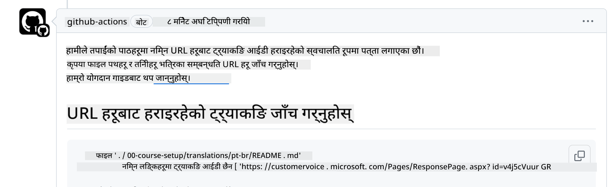
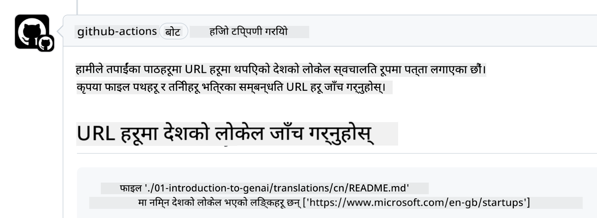

<!--
CO_OP_TRANSLATOR_METADATA:
{
  "original_hash": "57c41f2af71001a2cff9d8eb797cb843",
  "translation_date": "2025-07-09T05:52:24+00:00",
  "source_file": "CONTRIBUTING.md",
  "language_code": "ne"
}
-->
# योगदान

यो परियोजनाले योगदान र सुझावहरूलाई स्वागत गर्दछ। अधिकांश योगदानहरूका लागि तपाईंले Contributor License Agreement (CLA) मा सहमति जनाउन आवश्यक हुन्छ जसले तपाईंलाई अधिकार छ भनी घोषणा गर्दछ, र तपाईंले साँच्चिकै हामीलाई तपाईंको योगदान प्रयोग गर्ने अधिकार दिनुहुन्छ। विवरणका लागि, <https://cla.microsoft.com> मा जानुहोस्।

> महत्वपूर्ण: यस रिपोमा पाठ अनुवाद गर्दा कृपया मेसिन अनुवाद प्रयोग नगर्नुहोस्। हामी अनुवादहरू समुदायमार्फत जाँच गर्नेछौं, त्यसैले कृपया केवल ती भाषाहरूमा अनुवादका लागि स्वयंसेवा गर्नुहोस् जसमा तपाईं दक्ष हुनुहुन्छ।

जब तपाईं पुल अनुरोध पेश गर्नुहुन्छ, CLA-bot ले स्वचालित रूपमा निर्धारण गर्नेछ कि तपाईंले CLA प्रदान गर्न आवश्यक छ वा छैन र PR लाई उपयुक्त रूपमा चिन्हित गर्नेछ (जस्तै, लेबल, टिप्पणी)। बोटले दिएको निर्देशनहरू पालना गर्नुहोस्। तपाईंले हाम्रो CLA प्रयोग गर्ने सबै रिपोजिटोरीहरूमा यो एक पटक मात्र गर्नुपर्नेछ।

## आचार संहिता

यस परियोजनाले [Microsoft Open Source Code of Conduct](https://opensource.microsoft.com/codeofconduct/?WT.mc_id=academic-105485-koreyst) अपनाएको छ। थप जानकारीका लागि [Code of Conduct FAQ](https://opensource.microsoft.com/codeofconduct/faq/?WT.mc_id=academic-105485-koreyst) पढ्नुहोस् वा कुनै थप प्रश्न वा टिप्पणीका लागि [opencode@microsoft.com](mailto:opencode@microsoft.com) मा सम्पर्क गर्नुहोस्।

## प्रश्न वा समस्या?

सामान्य समर्थन प्रश्नहरूको लागि कृपया GitHub इश्यूहरू खोल्नुहोस् नगर्नुहोस् किनभने GitHub सूची सुविधा अनुरोध र बग रिपोर्टहरूको लागि प्रयोग गर्नुपर्छ। यसरी हामी वास्तविक समस्याहरू वा बगहरूलाई सजिलै ट्र्याक गर्न सक्छौं र सामान्य छलफललाई वास्तविक कोडबाट अलग राख्न सक्छौं।

## टाइपो, समस्या, बग र योगदानहरू

जब तपाईं Generative AI for Beginners रिपोजिटोरीमा कुनै परिवर्तनहरू पेश गर्नुहुन्छ, कृपया यी सिफारिसहरू पालना गर्नुहोस्।

* सधैं आफ्नो खातामा रिपोजिटोरी फोर्क गर्नुहोस् र त्यसपछि मात्र संशोधनहरू गर्नुहोस्
* एउटै पुल अनुरोधमा धेरै परिवर्तनहरू नजोड्नुहोस्। उदाहरणका लागि, कुनै बग फिक्स र कागजात अद्यावधिकहरू अलग-अलग PR मार्फत पेश गर्नुहोस्
* यदि तपाईंको पुल अनुरोधमा मर्ज द्वन्द्वहरू देखिन्छ भने, संशोधन गर्नु अघि आफ्नो स्थानीय main लाई मुख्य रिपोजिटोरीको main को प्रतिबिम्ब बनाउन अपडेट गर्नुहोस्
* यदि तपाईं अनुवाद पेश गर्दै हुनुहुन्छ भने, सबै अनुवादित फाइलहरूको लागि एकै PR सिर्जना गर्नुहोस् किनभने हामी सामग्रीका आंशिक अनुवादहरू स्वीकार गर्दैनौं
* यदि तपाईं टाइपो वा कागजात सुधार पेश गर्दै हुनुहुन्छ भने, उपयुक्त भएमा एकल PR मा संशोधनहरू संयोजन गर्न सक्नुहुन्छ

## लेखनका लागि सामान्य मार्गदर्शन

- तपाईंका सबै URL हरूलाई वर्गाकार कोष्ठकभित्र राख्नुहोस् र त्यसपछि पेरिन्थेसिसमा राख्नुहोस्, बीचमा वा भित्र कुनै अतिरिक्त खाली ठाउँ नराख्नुहोस् ``.
- कुनै पनि सापेक्ष लिंक (जस्तै रिपोजिटोरीका अन्य फाइल र फोल्डरहरूमा लिंकहरू) ले `./` बाट सुरु हुनुपर्छ जुन हालको कार्य डाइरेक्टरीमा रहेको फाइल वा फोल्डरलाई जनाउँछ वा `../` बाट सुरु हुनुपर्छ जुन अभिभावक कार्य डाइरेक्टरीमा रहेको फाइल वा फोल्डरलाई जनाउँछ।
- कुनै पनि सापेक्ष लिंकमा ट्र्याकिङ ID (जस्तै `?` वा `&` पछि `wt.mc_id=` वा `WT.mc_id=`) अन्त्यमा हुनुपर्छ।
- तलका डोमेनहरूबाट कुनै पनि URL (_github.com, microsoft.com, visualstudio.com, aka.ms, र azure.com_) मा ट्र्याकिङ ID (जस्तै `?` वा `&` पछि `wt.mc_id=` वा `WT.mc_id=`) अन्त्यमा हुनुपर्छ।
- तपाईंका लिंकहरूमा देश विशेषको लोकल (जस्तै `/en-us/` वा `/en/`) हुनु हुँदैन।
- सबै तस्बिरहरू `./images` फोल्डरमा राख्नुहोस्।
- तस्बिरहरूको नाम अंग्रेजी अक्षर, संख्या, र ड्यासहरू प्रयोग गरेर वर्णनात्मक हुनुपर्छ।

## GitHub कार्यप्रवाहहरू

जब तपाईं पुल अनुरोध पेश गर्नुहुन्छ, चार विभिन्न कार्यप्रवाहहरू पहिलेका नियमहरूलाई मान्य गर्न ट्रिगर हुनेछन्। कार्यप्रवाह जाँचहरू पास गर्न यहाँ दिइएका निर्देशनहरू पालना गर्नुहोस्।

- [टुटेका सापेक्ष पथहरू जाँच गर्नुहोस्](../..)
- [पथहरूमा ट्र्याकिङ छ कि छैन जाँच गर्नुहोस्](../..)
- [URL हरूमा ट्र्याकिङ छ कि छैन जाँच गर्नुहोस्](../..)
- [URL हरूमा लोकल छैन कि छैन जाँच गर्नुहोस्](../..)

### टुटेका सापेक्ष पथहरू जाँच गर्नुहोस्

यो कार्यप्रवाहले तपाईंका फाइलहरूमा कुनै पनि सापेक्ष पथ काम गरिरहेको छ कि छैन सुनिश्चित गर्छ। यो रिपोजिटोरी GitHub पेजहरूमा डिप्लोय गरिएको छ त्यसैले लिंकहरू टाइप गर्दा धेरै सावधान हुनुपर्छ ताकि कसैलाई गलत ठाउँमा नपठाओस्।

तपाईंका लिंकहरू ठीकसँग काम गरिरहेको छ कि छैन सुनिश्चित गर्न VS कोड प्रयोग गरेर जाँच गर्नुहोस्।

उदाहरणका लागि, तपाईंले फाइलहरूमा कुनै लिंकमा होभर गर्दा **ctrl + click** थिचेर लिंक पछ्याउन प्रोत्साहित गरिनेछ।

यदि तपाईं लिंकमा क्लिक गर्दा स्थानीय रूपमा काम गर्दैन भने, पक्का छ यो कार्यप्रवाह ट्रिगर हुनेछ र GitHub मा पनि काम गर्ने छैन।

यो समस्या समाधान गर्न, VS कोडको मद्दतले लिंक टाइप गर्न प्रयास गर्नुहोस्।

जब तपाईं `./` वा `../` टाइप गर्नुहुन्छ, VS कोडले तपाईंले टाइप गरेको अनुसार उपलब्ध विकल्पहरूबाट छान्न प्रोत्साहित गर्नेछ।

आवश्यक फाइल वा फोल्डरमा क्लिक गरेर पथ पछ्याउनुहोस् र तपाईं निश्चित हुनुहुनेछ कि तपाईंको पथ टुटेको छैन।

सही सापेक्ष पथ थपेपछि, सेभ गरी परिवर्तनहरू पुश गर्नुहोस्, कार्यप्रवाह फेरि ट्रिगर हुनेछ र तपाईंको परिवर्तनहरू जाँच्नेछ। यदि तपाईं जाँच पास गर्नुभयो भने, तपाईं तयार हुनुहुन्छ।

### पथहरूमा ट्र्याकिङ छ कि छैन जाँच गर्नुहोस्

यो कार्यप्रवाहले कुनै पनि सापेक्ष पथमा ट्र्याकिङ छ कि छैन सुनिश्चित गर्छ। यो रिपोजिटोरी GitHub पेजहरूमा डिप्लोय गरिएको छ त्यसैले हामीलाई विभिन्न फाइल र फोल्डरहरू बीचको गतिविधि ट्र्याक गर्न आवश्यक छ।

तपाईंका सापेक्ष पथहरूमा ट्र्याकिङ छ कि छैन सुनिश्चित गर्न पथको अन्त्यमा `?wt.mc_id=` जस्तो पाठ छ कि छैन जाँच गर्नुहोस्। यदि छ भने तपाईं यो जाँच पास गर्नुहुनेछ।

यदि छैन भने, तपाईंलाई तलको त्रुटि देखिन सक्छ।

यो समस्या समाधान गर्न, कार्यप्रवाहले हाइलाइट गरेको फाइल पथ खोल्नुहोस् र सापेक्ष पथहरूको अन्त्यमा ट्र्याकिङ ID थप्नुहोस्।

ट्र्याकिङ ID थपेपछि, सेभ गरी परिवर्तनहरू पुश गर्नुहोस्, कार्यप्रवाह फेरि ट्रिगर हुनेछ र तपाईंको परिवर्तनहरू जाँच्नेछ। यदि तपाईं जाँच पास गर्नुभयो भने, तपाईं तयार हुनुहुन्छ।

### URL हरूमा ट्र्याकिङ छ कि छैन जाँच गर्नुहोस्

यो कार्यप्रवाहले कुनै पनि वेब URL मा ट्र्याकिङ छ कि छैन सुनिश्चित गर्छ। यो रिपोजिटोरी सबैका लागि उपलब्ध छ त्यसैले ट्राफिक कहाँबाट आइरहेको छ थाहा पाउन ट्र्याकिङ गर्न आवश्यक छ।

तपाईंका URL हरूमा ट्र्याकिङ छ कि छैन सुनिश्चित गर्न URL को अन्त्यमा `?wt.mc_id=` जस्तो पाठ छ कि छैन जाँच गर्नुहोस्। यदि छ भने तपाईं यो जाँच पास गर्नुहुनेछ।

यदि छैन भने, तपाईंलाई तलको त्रुटि देखिन सक्छ।

यो समस्या समाधान गर्न, कार्यप्रवाहले हाइलाइट गरेको फाइल पथ खोल्नुहोस् र URL हरूको अन्त्यमा ट्र्याकिङ ID थप्नुहोस्।

ट्र्याकिङ ID थपेपछि, सेभ गरी परिवर्तनहरू पुश गर्नुहोस्, कार्यप्रवाह फेरि ट्रिगर हुनेछ र तपाईंको परिवर्तनहरू जाँच्नेछ। यदि तपाईं जाँच पास गर्नुभयो भने, तपाईं तयार हुनुहुन्छ।

### URL हरूमा लोकल छैन कि छैन जाँच गर्नुहोस्

यो कार्यप्रवाहले कुनै पनि वेब URL मा देश विशेषको लोकल छैन कि छैन सुनिश्चित गर्छ। यो रिपोजिटोरी विश्वभर सबैका लागि उपलब्ध छ त्यसैले तपाईंको देशको लोकल URL मा समावेश नगर्नुहोस्।

तपाईंका URL हरूमा देश लोकल छैन कि छैन सुनिश्चित गर्न URL मा `/en-us/` वा `/en/` वा कुनै अन्य भाषा लोकल छ कि छैन जाँच गर्नुहोस्। यदि छैन भने तपाईं यो जाँच पास गर्नुहुनेछ।

यदि छ भने, तपाईंलाई तलको त्रुटि देखिन सक्छ।

यो समस्या समाधान गर्न, कार्यप्रवाहले हाइलाइट गरेको फाइल पथ खोल्नुहोस् र URL बाट देश लोकल हटाउनुहोस्।

देश लोकल हटाएपछि, सेभ गरी परिवर्तनहरू पुश गर्नुहोस्, कार्यप्रवाह फेरि ट्रिगर हुनेछ र तपाईंको परिवर्तनहरू जाँच्नेछ। यदि तपाईं जाँच पास गर्नुभयो भने, तपाईं तयार हुनुहुन्छ।

बधाई छ! हामी तपाईंको योगदानबारे प्रतिक्रिया दिन सकेसम्म चाँडो सम्पर्क गर्नेछौं।

**अस्वीकरण**:  
यो दस्तावेज AI अनुवाद सेवा [Co-op Translator](https://github.com/Azure/co-op-translator) प्रयोग गरी अनुवाद गरिएको हो। हामी शुद्धताका लागि प्रयासरत छौं, तर कृपया ध्यान दिनुहोस् कि स्वचालित अनुवादमा त्रुटि वा अशुद्धता हुन सक्छ। मूल दस्तावेज यसको मूल भाषामा नै अधिकारिक स्रोत मानिनुपर्छ। महत्वपूर्ण जानकारीका लागि व्यावसायिक मानव अनुवाद सिफारिस गरिन्छ। यस अनुवादको प्रयोगबाट उत्पन्न कुनै पनि गलतफहमी वा गलत व्याख्याका लागि हामी जिम्मेवार छैनौं।