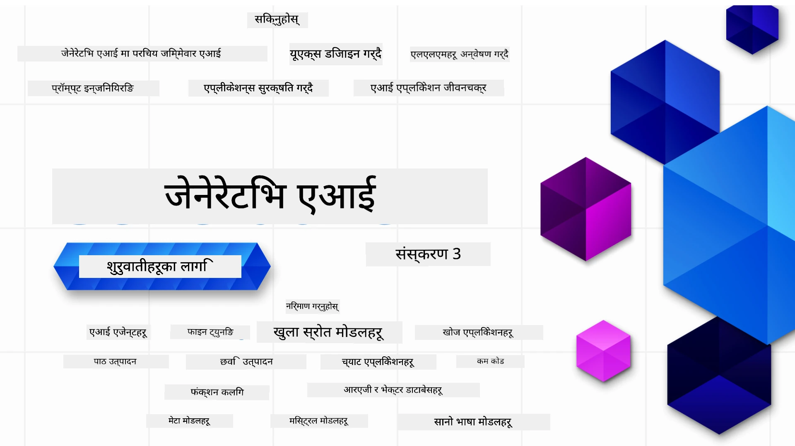

### जेनेरेटिभ एआई अनुप्रयोगहरू बनाउन थाल्न आवश्यक सबै कुरा सिकाउने २१ पाठहरू

[](https://github.com/microsoft/Generative-AI-For-Beginners/blob/master/LICENSE?WT.mc_id=academic-105485-koreyst)
[](https://GitHub.com/microsoft/Generative-AI-For-Beginners/graphs/contributors/?WT.mc_id=academic-105485-koreyst)
[](https://GitHub.com/microsoft/Generative-AI-For-Beginners/issues/?WT.mc_id=academic-105485-koreyst)
[](https://GitHub.com/microsoft/Generative-AI-For-Beginners/pulls/?WT.mc_id=academic-105485-koreyst)
[](http://makeapullrequest.com?WT.mc_id=academic-105485-koreyst)

[](https://GitHub.com/microsoft/Generative-AI-For-Beginners/watchers/?WT.mc_id=academic-105485-koreyst)
[](https://GitHub.com/microsoft/Generative-AI-For-Beginners/network/?WT.mc_id=academic-105485-koreyst)
[](https://GitHub.com/microsoft/Generative-AI-For-Beginners/stargazers/?WT.mc_id=academic-105485-koreyst)

[](https://discord.gg/nTYy5BXMWG)

### 🌐 बहुभाषी समर्थन

#### GitHub Action मार्फ़त समर्थित (स्वचालित र सँधै अद्यावधिक)

<!-- CO-OP TRANSLATOR LANGUAGES TABLE START -->
[Arabic](../ar/README.md) | [Bengali](../bn/README.md) | [Bulgarian](../bg/README.md) | [Burmese (Myanmar)](../my/README.md) | [Chinese (Simplified)](../zh-CN/README.md) | [Chinese (Traditional, Hong Kong)](../zh-HK/README.md) | [Chinese (Traditional, Macau)](../zh-MO/README.md) | [Chinese (Traditional, Taiwan)](../zh-TW/README.md) | [Croatian](../hr/README.md) | [Czech](../cs/README.md) | [Danish](../da/README.md) | [Dutch](../nl/README.md) | [Estonian](../et/README.md) | [Finnish](../fi/README.md) | [French](../fr/README.md) | [German](../de/README.md) | [Greek](../el/README.md) | [Hebrew](../he/README.md) | [Hindi](../hi/README.md) | [Hungarian](../hu/README.md) | [Indonesian](../id/README.md) | [Italian](../it/README.md) | [Japanese](../ja/README.md) | [Kannada](../kn/README.md) | [Korean](../ko/README.md) | [Lithuanian](../lt/README.md) | [Malay](../ms/README.md) | [Malayalam](../ml/README.md) | [Marathi](../mr/README.md) | [Nepali](./README.md) | [Nigerian Pidgin](../pcm/README.md) | [Norwegian](../no/README.md) | [Persian (Farsi)](../fa/README.md) | [Polish](../pl/README.md) | [Portuguese (Brazil)](../pt-BR/README.md) | [Portuguese (Portugal)](../pt-PT/README.md) | [Punjabi (Gurmukhi)](../pa/README.md) | [Romanian](../ro/README.md) | [Russian](../ru/README.md) | [Serbian (Cyrillic)](../sr/README.md) | [Slovak](../sk/README.md) | [Slovenian](../sl/README.md) | [Spanish](../es/README.md) | [Swahili](../sw/README.md) | [Swedish](../sv/README.md) | [Tagalog (Filipino)](../tl/README.md) | [Tamil](../ta/README.md) | [Telugu](../te/README.md) | [Thai](../th/README.md) | [Turkish](../tr/README.md) | [Ukrainian](../uk/README.md) | [Urdu](../ur/README.md) | [Vietnamese](../vi/README.md)

> **स्थानीय रूपमा क्लोन गर्न मन पराउनुहुन्छ?**

> यो रेपो धेरै भाषामा अनुवादहरु समावेश गर्दछ जसले डाउनलोड आकार धेरै बढाउँछ। अनुवादहरु बिना क्लोन गर्न sparse checkout प्रयोग गर्नुहोस्:
> ```bash
> git clone --filter=blob:none --sparse https://github.com/microsoft/generative-ai-for-beginners.git
> cd generative-ai-for-beginners
> git sparse-checkout set --no-cone '/*' '!translations' '!translated_images'
> ```
> यसले तपाईंलाई कोर्स पूरा गर्न आवश्यक सबै कुरा द्रुत डाउनलोड सहित दिन्छ।
<!-- CO-OP TRANSLATOR LANGUAGES TABLE END -->

# शुरुवातीहरूको लागि जेनेरेटिभ एआई (संस्करण ३) - एक कोर्स

Microsoft क्लाउड एड्भोकेट्स द्वारा प्रदान गरिएको २१-पाठहरूमा जेनेरेटिभ एआई अनुप्रयोगहरू निर्माण गर्ने आधारभूत कुरा सिक्नुहोस्।

## 🌱 सुरु गर्दै

यो कोर्समा २१ पाठहरू छन्। प्रत्येक पाठले आफ्नै विषय समेट्छ त्यसैले जुनसुकै पाठबाट शुरु गर्न सक्नुहुन्छ!

पाठहरू "Learn" लेबल भएकोले जेनेरेटिभ एआई अवधारणा सिकाउँछ वा "Build" लेबल भएकोले एक अवधारणा र **Python** तथा **TypeScript** मा कोड उदाहरणहरू उपलब्ध छन्।

.NET डेभलपर्सलाई [Generative AI for Beginners (.NET Edition)](https://github.com/microsoft/Generative-AI-for-beginners-dotnet?WT.mc_id=academic-105485-koreyst) हेर्न सल्लाह दिइन्छ!

हरेक पाठसँग "Keep Learning" खण्ड हुन्छ जहाँ थप सिकाइका उपकरणहरू दिइन्छ।

## तपाईंलाई के चाहिन्छ
### यो कोर्सको कोड चलाउनका लागि तपाईं यी मध्ये कुनै पनि प्रयोग गर्न सक्नुहुन्छ: 
 - [Azure OpenAI Service](https://aka.ms/genai-beginners/azure-open-ai?WT.mc_id=academic-105485-koreyst) - **पाठहरू:** "aoai-assignment"
 - [GitHub Marketplace Model Catalog](https://aka.ms/genai-beginners/gh-models?WT.mc_id=academic-105485-koreyst) - **पाठहरू:** "githubmodels"
 - [OpenAI API](https://aka.ms/genai-beginners/open-ai?WT.mc_id=academic-105485-koreyst) - **पाठहरू:** "oai-assignment" 
   
- Python वा TypeScript को आधारभूत ज्ञान उपयोगी छ - \*सुरुवातीहरूको लागि यी [Python](https://aka.ms/genai-beginners/python?WT.mc_id=academic-105485-koreyst) र [TypeScript](https://aka.ms/genai-beginners/typescript?WT.mc_id=academic-105485-koreyst) कोर्सहरू जाँच्नुहोस्
- आफ्नो GitHub खातामा यस सम्पूर्ण रेपो [fork](https://aka.ms/genai-beginners/github?WT.mc_id=academic-105485-koreyst) गर्न आवश्यक छ

हामीले तपाईंको विकास वातावरण सेटअप गर्न मद्दत गर्ने **[कोर्स सेटअप](./00-course-setup/README.md?WT.mc_id=academic-105485-koreyst)** पाठ तयार पारेका छौं।

यो रेपो सजिलै फेला पार्न [यो स्टार (🌟) गर्न नबिर्सनुहोस्](https://docs.github.com/en/get-started/exploring-projects-on-github/saving-repositories-with-stars?WT.mc_id=academic-105485-koreyst)।

## 🧠 डिप्लोय गर्न तयार?

अधिक उन्नत कोड नमुनाहरू खोज्दै हुनुहुन्छ भने, हाम्रो [जेनेरेटिभ एआई कोड नमूनाहरूको संग्रह](https://aka.ms/genai-beg-code?WT.mc_id=academic-105485-koreyst) हेर्नुहोस् जसमा **Python** र **TypeScript** दुवै छन्।

## 🗣️ अन्य सिक्नेहरू भेट्नुहोस्, समर्थन पाउनुहोस्

हाम्रो [आधिकारिक Azure AI Foundry Discord सर्भर](https://aka.ms/genai-discord?WT.mc_id=academic-105485-koreyst) मा सहभागी भएर अरू सिक्नेहरूसँग भेट्नुहोस् र समर्थन लिनुहोस्।

प्रश्न सोध्न वा प्रतिक्रिया दिन हाम्रो [Azure AI Foundry Developer Forum](https://aka.ms/azureaifoundry/forum) मा GitHub मार्फत सहभागी हुनुहोस्।

## 🚀 स्टार्टअप बनाउँदै हुनुहुन्छ?

आजै Azure क्रेडिटहरूसँग कसरी विकास सुरु गर्ने थाहा पाउन [Microsoft for Startups](https://www.microsoft.com/startups) भ्रमण गर्नुहोस्।

## 🙏 सहयोग गर्न चाहनुहुन्छ?

कुनै सुझाव छ वा स्पेलिङ्ग वा कोड त्रुटिहरू भेट्टाउनुभयो भने? [मुद्दा उठाउनुहोस्](https://github.com/microsoft/generative-ai-for-beginners/issues?WT.mc_id=academic-105485-koreyst) वा [पुल रिक्वेस्ट बनाउनुहोस्](https://github.com/microsoft/generative-ai-for-beginners/pulls?WT.mc_id=academic-105485-koreyst)

## 📂 प्रत्येक पाठमा समावेश छ:

- विषयको छोटो भिडियो परिचय
- README मा लेखिएको पाठ
- Azure OpenAI र OpenAI API समर्थन गर्ने Python र TypeScript कोड नमूना
- थप सिकाइका स्रोतहरूका लिङ्कहरू

## 🗃️ पाठहरू

| #   | **पाठ लिङ्क**                                                                                                                             | **विवरण**                                                                                      | **भिडियो**                                                                  | **थप सिकाइ**                                                                 |
| --- | ------------------------------------------------------------------------------------------------------------------------------------------- | ---------------------------------------------------------------------------------------------- | ---------------------------------------------------------------------------- | ---------------------------------------------------------------------------- |
| 00  | [कोर्स सेटअप](./00-course-setup/README.md?WT.mc_id=academic-105485-koreyst)                                                                | **सिक्नुहोस्:** आफ्नो विकास वातावरण कसरी सेटअप गर्ने                                        | छिट्टै भिडियो आउनेछ                                                            | [थप जानकारी](https://aka.ms/genai-collection?WT.mc_id=academic-105485-koreyst) |
| 01  | [जेनेरेटिभ एआई र LLMs परिचय](./01-introduction-to-genai/README.md?WT.mc_id=academic-105485-koreyst)                                         | **सिक्नुहोस्:** जेनेरेटिभ एआई के हो र ठूला भाषा मोडेलहरू (LLMs) कसरी काम गर्छन् बुझ्नुहोस्। | [भिडियो](https://aka.ms/gen-ai-lesson-1-gh?WT.mc_id=academic-105485-koreyst) | [थप जानकारी](https://aka.ms/genai-collection?WT.mc_id=academic-105485-koreyst) |
| 02  | [विभिन्न LLMs अन्वेषण र तुलना](./02-exploring-and-comparing-different-llms/README.md?WT.mc_id=academic-105485-koreyst)                       | **सिक्नुहोस्:** आफ्नो प्रयोगको लागि सही मोडेल कसरी रोज्ने                                   | [भिडियो](https://aka.ms/gen-ai-lesson2-gh?WT.mc_id=academic-105485-koreyst)  | [थप जानकारी](https://aka.ms/genai-collection?WT.mc_id=academic-105485-koreyst) |
| 03  | [जिम्मेवारीपूर्वक जेनेरेटिभ एआई प्रयोग](./03-using-generative-ai-responsibly/README.md?WT.mc_id=academic-105485-koreyst)                    | **सिक्नुहोस्:** जेनेरेटिभ एआई अनुप्रयोगहरू जिम्मेवारीपूर्वक कसरी बनाउने                      | [भिडियो](https://aka.ms/gen-ai-lesson3-gh?WT.mc_id=academic-105485-koreyst)  | [थप जानकारी](https://aka.ms/genai-collection?WT.mc_id=academic-105485-koreyst) |
| 04  | [प्रॉम्प्ट इन्जिनियरिङ्गका आधारभूत कुरा बुझ्न](./04-prompt-engineering-fundamentals/README.md?WT.mc_id=academic-105485-koreyst)             | **सिक्नुहोस्:** प्रत्यक्ष प्रॉम्प्ट इन्जिनियरिङ्गका उत्कृष्ट अभ्यासहरू                                           | [Video](https://aka.ms/gen-ai-lesson4-gh?WT.mc_id=academic-105485-koreyst)  | [थप जान्न](https://aka.ms/genai-collection?WT.mc_id=academic-105485-koreyst) |
| 05  | [उन्नत प्रॉम्प्टहरू सिर्जना गर्दै](./05-advanced-prompts/README.md?WT.mc_id=academic-105485-koreyst)                                                | **सिक्नुहोस्:** आफ्नो प्रॉम्प्टहरूको परिणाम सुधार्न प्रॉम्प्ट इन्जिनियरिङ्ग प्रविधिहरू कसरी लागू गर्ने              | [Video](https://aka.ms/gen-ai-lesson5-gh?WT.mc_id=academic-105485-koreyst)  | [थप जान्न](https://aka.ms/genai-collection?WT.mc_id=academic-105485-koreyst) |
| 06  | [टेक्स्ट जेनरेशन अनुप्रयोगहरू निर्माण गर्दै](./06-text-generation-apps/README.md?WT.mc_id=academic-105485-koreyst)                                | **बनाउनुहोस्:** Azure OpenAI / OpenAI API प्रयोग गरेर एउटा टेक्स्ट जेनरेशन एप                                 | [Video](https://aka.ms/gen-ai-lesson6-gh?WT.mc_id=academic-105485-koreyst)  | [थप जान्न](https://aka.ms/genai-collection?WT.mc_id=academic-105485-koreyst) |
| 07  | [च्याट एप्लिकेसनहरू निर्माण गर्दै](./07-building-chat-applications/README.md?WT.mc_id=academic-105485-koreyst)                                     | **बनाउनुहोस्:** प्रभावकारी रुपमा च्याट एप्लिकेसनहरू निर्माण र समायोजन गर्ने तरिका                             | [Video](https://aka.ms/gen-ai-lessons7-gh?WT.mc_id=academic-105485-koreyst) | [थप जान्न](https://aka.ms/genai-collection?WT.mc_id=academic-105485-koreyst) |
| 08  | [सर्च एप्लिकेसनहरू भेक्टर डेटाबेससँग निर्माण गर्दै](./08-building-search-applications/README.md?WT.mc_id=academic-105485-koreyst)                        | **बनाउनुहोस्:** डेटा खोज्न Embeddings प्रयोग गर्ने सर्च एप्लिकेसन                                           | [Video](https://aka.ms/gen-ai-lesson8-gh?WT.mc_id=academic-105485-koreyst)  | [थप जान्न](https://aka.ms/genai-collection?WT.mc_id=academic-105485-koreyst) |
| 09  | [छवि जेनरेशन एप्लिकेसनहरू निर्माण गर्दै](./09-building-image-applications/README.md?WT.mc_id=academic-105485-koreyst)                        | **बनाउनुहोस्:** एउटा छवि जेनरेशन एप्लिकेसन                                                         | [Video](https://aka.ms/gen-ai-lesson9-gh?WT.mc_id=academic-105485-koreyst)  | [थप जान्न](https://aka.ms/genai-collection?WT.mc_id=academic-105485-koreyst) |
| 10  | [लो कोड AI एप्लिकेसनहरू निर्माण गर्दै](./10-building-low-code-ai-applications/README.md?WT.mc_id=academic-105485-koreyst)                       | **बनाउनुहोस्:** लो कोड उपकरण प्रयोग गरेर जेनेरेटिभ AI एप्लिकेसन                                         | [Video](https://aka.ms/gen-ai-lesson10-gh?WT.mc_id=academic-105485-koreyst) | [थप जान्न](https://aka.ms/genai-collection?WT.mc_id=academic-105485-koreyst) |
| 11  | [फंक्शन कलिङ्गसँग बाह्य एप्लिकेसनहरू समायोजन गर्दै](./11-integrating-with-function-calling/README.md?WT.mc_id=academic-105485-koreyst) | **बनाउनुहोस्:** फंक्शन कलिङ्ग के हो र एप्लिकेसनहरूको लागि यसको प्रयोगहरू                                  | [Video](https://aka.ms/gen-ai-lesson11-gh?WT.mc_id=academic-105485-koreyst) | [थप जान्न](https://aka.ms/genai-collection?WT.mc_id=academic-105485-koreyst) |
| 12  | [AI एप्लिकेसनहरूको लागि UX डिजाइन गर्दै](./12-designing-ux-for-ai-applications/README.md?WT.mc_id=academic-105485-koreyst)                         | **सिक्नुहोस्:** जेनेरेटिभ AI एप्लिकेसनहरू विकास गर्दा UX डिजाइन सिद्धान्तहरू कसरी लागू गर्ने                 | [Video](https://aka.ms/gen-ai-lesson12-gh?WT.mc_id=academic-105485-koreyst) | [थप जान्न](https://aka.ms/genai-collection?WT.mc_id=academic-105485-koreyst) |
| 13  | [तपाईंको जेनेरेटिभ AI एप्लिकेसनहरू सुरक्षित गर्दै](./13-securing-ai-applications/README.md?WT.mc_id=academic-105485-koreyst)                         | **सिक्नुहोस्:** AI प्रणालीहरूमा हुने खतरा र जोखिमहरू र ती प्रणालीहरू सुरक्षित गर्ने तरिकाहरू                 | [Video](https://aka.ms/gen-ai-lesson13-gh?WT.mc_id=academic-105485-koreyst) | [थप जान्न](https://aka.ms/genai-collection?WT.mc_id=academic-105485-koreyst) |
| 14  | [जेनेरेटिभ AI एप्लिकेसन जीवनचक्र](./14-the-generative-ai-application-lifecycle/README.md?WT.mc_id=academic-105485-koreyst)           | **सिक्नुहोस्:** LLM जीवनचक्र र LLMOps व्यवस्थापन गर्नका लागि उपकरण र मेट्रिक्स                             | [Video](https://aka.ms/gen-ai-lesson14-gh?WT.mc_id=academic-105485-koreyst) | [थप जान्न](https://aka.ms/genai-collection?WT.mc_id=academic-105485-koreyst) |
| 15  | [Retrieval Augmented Generation (RAG) र भेक्टर डेटाबेसहरू](./15-rag-and-vector-databases/README.md?WT.mc_id=academic-105485-koreyst)        | **बनाउनुहोस्:** RAG फ्रेमवर्क प्रयोग गरेर भेक्टर डेटाबेसबाट embeddings प्राप्त गर्ने एप्लिकेसन            | [Video](https://aka.ms/gen-ai-lesson15-gh?WT.mc_id=academic-105485-koreyst) | [थप जान्न](https://aka.ms/genai-collection?WT.mc_id=academic-105485-koreyst) |
| 16  | [ओपन सोर्स मोडेलहरू र Hugging Face](./16-open-source-models/README.md?WT.mc_id=academic-105485-koreyst)                                    | **बनाउनुहोस्:** Hugging Face मा उपलब्ध खुला स्रोत मोडेलहरू प्रयोग गर्ने एप्लिकेसन                        | [Video](https://aka.ms/gen-ai-lesson16-gh?WT.mc_id=academic-105485-koreyst) | [थप जान्न](https://aka.ms/genai-collection?WT.mc_id=academic-105485-koreyst) |
| 17  | [AI एजेन्टहरू](./17-ai-agents/README.md?WT.mc_id=academic-105485-koreyst)                                                                       | **बनाउनुहोस्:** AI एजेन्ट फ्रेमवर्क प्रयोग गर्ने एप्लिकेसन                                              | [Video](https://aka.ms/gen-ai-lesson17-gh?WT.mc_id=academic-105485-koreyst) | [थप जान्न](https://aka.ms/genai-collection?WT.mc_id=academic-105485-koreyst) |
| 18  | [LLM को फाइन ट्यूनिङ](./18-fine-tuning/README.md?WT.mc_id=academic-105485-koreyst)                                                              | **सिक्नुहोस्:** LLM लाई फाइन ट्यूनिङ गर्ने के, किन र कसरी                                               | [Video](https://aka.ms/gen-ai-lesson18-gh?WT.mc_id=academic-105485-koreyst) | [थप जान्न](https://aka.ms/genai-collection?WT.mc_id=academic-105485-koreyst) |
| 19  | [SLM सँग निर्माण गर्दै](./19-slm/README.md?WT.mc_id=academic-105485-koreyst)                                                              | **सिक्नुहोस्:** साना भाषा मोडेलहरूसँग निर्माण गर्दा के फाइदा हुन्छ                                      | Video Coming Soon | [थप जान्न](https://aka.ms/genai-collection?WT.mc_id=academic-105485-koreyst) |
| 20  | [मिस्ट्रल मोडेलहरूसँग निर्माण गर्दै](./20-mistral/README.md?WT.mc_id=academic-105485-koreyst)                                                              | **सिक्नुहोस्:** मिस्ट्रल परिवारका मोडेलहरूको विशेषताहरू र फरकहरू                                      | Video Coming Soon | [थप जान्न](https://aka.ms/genai-collection?WT.mc_id=academic-105485-koreyst) |
| 21  | [मेटा मोडेलहरूसँग निर्माण गर्दै](./21-meta/README.md?WT.mc_id=academic-105485-koreyst)                                                              | **सिक्नुहोस्:** मेटा परिवारका मोडेलहरूको विशेषताहरू र फरकहरू                                        | Video Coming Soon | [थप जान्न](https://aka.ms/genai-collection?WT.mc_id=academic-105485-koreyst) |

### 🌟 विशेष धन्यवाद

[**John Aziz**](https://www.linkedin.com/in/john0isaac/) लाई सबै GitHub Actions र workflows बनाउनको लागि विशेष धन्यवाद

[**Bernhard Merkle**](https://www.linkedin.com/in/bernhard-merkle-738b73/) लाई प्रत्येक पाठमा सिक्ने र कोड अनुभव सुधार गर्न महत्वपूर्ण योगदान पुर्‍याएकोमा धन्यवाद। 

## 🎒 अन्य कोर्सहरू

हाम्रा टिमले अन्य कोर्सहरू पनि उत्पादन गर्छ! हेर्नुहोस्:

<!-- CO-OP TRANSLATOR OTHER COURSES START -->
### LangChain
[](https://aka.ms/langchain4j-for-beginners)
[](https://aka.ms/langchainjs-for-beginners?WT.mc_id=m365-94501-dwahlin)

---

### Azure / Edge / MCP / Agents
[](https://github.com/microsoft/AZD-for-beginners?WT.mc_id=academic-105485-koreyst)
[](https://github.com/microsoft/edgeai-for-beginners?WT.mc_id=academic-105485-koreyst)
[](https://github.com/microsoft/mcp-for-beginners?WT.mc_id=academic-105485-koreyst)
[](https://github.com/microsoft/ai-agents-for-beginners?WT.mc_id=academic-105485-koreyst)

---
 
### Generative AI Series
[](https://github.com/microsoft/generative-ai-for-beginners?WT.mc_id=academic-105485-koreyst)
[-9333EA?style=for-the-badge&labelColor=E5E7EB&color=9333EA)](https://github.com/microsoft/Generative-AI-for-beginners-dotnet?WT.mc_id=academic-105485-koreyst)
[-C084FC?style=for-the-badge&labelColor=E5E7EB&color=C084FC)](https://github.com/microsoft/generative-ai-for-beginners-java?WT.mc_id=academic-105485-koreyst)
[-E879F9?style=for-the-badge&labelColor=E5E7EB&color=E879F9)](https://github.com/microsoft/generative-ai-with-javascript?WT.mc_id=academic-105485-koreyst)

---
 
### Core Learning
[](https://aka.ms/ml-beginners?WT.mc_id=academic-105485-koreyst)
[](https://aka.ms/datascience-beginners?WT.mc_id=academic-105485-koreyst)
[](https://aka.ms/ai-beginners?WT.mc_id=academic-105485-koreyst)
[](https://github.com/microsoft/Security-101?WT.mc_id=academic-96948-sayoung)
[](https://aka.ms/webdev-beginners?WT.mc_id=academic-105485-koreyst)
[](https://aka.ms/iot-beginners?WT.mc_id=academic-105485-koreyst)
[](https://github.com/microsoft/xr-development-for-beginners?WT.mc_id=academic-105485-koreyst)

---
 
### Copilot शृंखला
[](https://aka.ms/GitHubCopilotAI?WT.mc_id=academic-105485-koreyst)
[](https://github.com/microsoft/mastering-github-copilot-for-dotnet-csharp-developers?WT.mc_id=academic-105485-koreyst)
[](https://github.com/microsoft/CopilotAdventures?WT.mc_id=academic-105485-koreyst)
<!-- CO-OP TRANSLATOR OTHER COURSES END -->

## सहायता प्राप्त गर्नुहोस्

यदि तपाईं अड्किनुभयो वा AI अनुप्रयोगहरू निर्माण गर्ने बारे कुनै प्रश्नहरू छन् भने। MCP सम्बन्धी छलफलहरूमा सहभागी हुनुहोस् जहाँ अन्य सिक्नेहरू र अनुभवी विकासकर्ताहरू छन्। यो एउटा सहयोगी समुदाय हो जहाँ प्रश्नहरू स्वागतयोग्य छन् र ज्ञान स्वतन्त्र रूपमा साझा गरिन्छ।

[](https://discord.gg/nTYy5BXMWG)

यदि तपाईंलाई निर्माण गर्दा उत्पादन प्रतिक्रिया वा त्रुटिहरू छन् भने भ्रमण गर्नुहोस्:

[](https://aka.ms/foundry/forum)

---

<!-- CO-OP TRANSLATOR DISCLAIMER START -->
**अस्वीकरण**:  
यो दस्तावेज़ AI अनुवाद सेवा [Co-op Translator](https://github.com/Azure/co-op-translator) को प्रयोग गरेर अनुवाद गरिएको हो। हामी सटीकताको प्रयास गर्छौं भने पनि, कृत्रिम अनुवादमा त्रुटि वा गल्तीहरू हुन सक्ने हुनाले कृपया ध्यान दिनुहोस्। मूल दस्तावेज़ यसको स्वदेशी भाषामा नै प्रामाणिक स्रोत मानिनेछ। महत्वपूर्ण जानकारीका लागि व्यावसायिक मानव अनुवाद सिफारिस गरिन्छ। यस अनुवादको प्रयोगबाट कुनै पनि भ्रम वा गलत व्याख्याप्रति हामी जिम्मेवार छैनौं।
<!-- CO-OP TRANSLATOR DISCLAIMER END -->