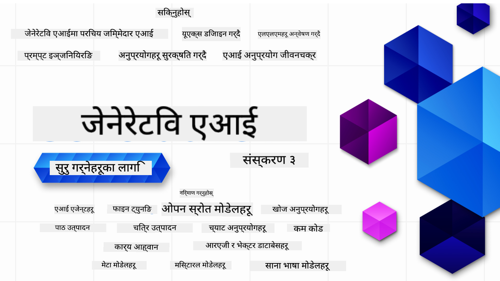

<!--
CO_OP_TRANSLATOR_METADATA:
{
  "original_hash": "c2ee25895ebbfa1a52868bb6eab686fc",
  "translation_date": "2025-05-19T11:37:57+00:00",
  "source_file": "README.md",
  "language_code": "ne"
}
-->

### 21 पाठहरू जसले तपाईंलाई जेनेरेटिभ एआई एप्लिकेशन निर्माण गर्न आवश्यक सबै कुरा सिकाउँछन्

### 🌐 बहु-भाषा समर्थन

#### GitHub Action मार्फत समर्थित (स्वचालित र सधैं अपडेटेड)
[फ्रान्सेली](../fr/README.md) | [स्पेनिश](../es/README.md) | [जर्मन](../de/README.md) | [रूसी](../ru/README.md) | [अरबी](../ar/README.md) | [फारसी (फारसी)](../fa/README.md) | [उर्दू](../ur/README.md) | [चिनियाँ (सरल)](../zh/README.md) | [चिनियाँ (पारम्परिक, मकाउ)](../mo/README.md) | [चिनियाँ (पारम्परिक, हङकङ)](../hk/README.md) | [चिनियाँ (पारम्परिक, ताइवान)](../tw/README.md) | [जापानी](../ja/README.md) | [कोरियाली](../ko/README.md) | [हिन्दी](../hi/README.md) | [बंगाली](../bn/README.md) | [मराठी](../mr/README.md) | [नेपाली](./README.md) | [पञ्जाबी (गुरमुखी)](../pa/README.md) | [पोर्तुगाली (पोर्चुगल)](../pt/README.md) | [पोर्तुगाली (ब्राजिल)](../br/README.md) | [इटालियन](../it/README.md) | [पोलिश](../pl/README.md) | [टर्किश](../tr/README.md) | [ग्रीक](../el/README.md) | [थाई](../th/README.md) | [स्वीडिश](../sv/README.md) | [डेनिश](../da/README.md) | [नर्वेली](../no/README.md) | [फिनिश](../fi/README.md) | [डच](../nl/README.md) | [हिब्रू](../he/README.md) | [भियतनामी](../vi/README.md) | [इन्डोनेसियाली](../id/README.md) | [मलय](../ms/README.md) | [टागालोग (फिलिपिनो)](../tl/README.md) | [स्वाहिली](../sw/README.md) | [हंगेरी](../hu/README.md) | [चेक](../cs/README.md) | [स्लोभाक](../sk/README.md) | [रोमानियन](../ro/README.md) | [बुल्गेरियन](../bg/README.md) | [सर्बियाली (सिरिलिक)](../sr/README.md) | [क्रोएसियन](../hr/README.md) | [स्लोभेनियाली](../sl/README.md) Please write the output from left to right.
# जेनरेटिभ एआईको लागि सुरुवात (संस्करण ३) - एक पाठ्यक्रम

माइक्रोसफ्ट क्लाउड एड्भोकेट्सद्वारा प्रस्तुत २१ पाठहरूको व्यापक पाठ्यक्रमसँग जेनरेटिभ एआई अनुप्रयोग निर्माणको आधारभूत कुराहरू सिक्नुहोस्।

## 🌱 सुरु गर्दै

यस पाठ्यक्रममा २१ पाठहरू छन्। प्रत्येक पाठले आफ्नो विषयलाई समेटेको हुन्छ, त्यसैले तपाईं जहाँबाट चाहनुहुन्छ त्यहाँबाट सुरु गर्न सक्नुहुन्छ!

पाठहरूलाई "सिक्ने" पाठहरू, जसले जेनरेटिभ एआईको अवधारणालाई व्याख्या गर्छ, वा "बनाउने" पाठहरू, जसले अवधारणालाई व्याख्या गर्छ र **Python** र **TypeScript** मा सम्भव भएसम्म कोड उदाहरणहरू दिन्छ, भनेर चिन्हित गरिएको छ।

.NET विकासकर्ताहरूको लागि [जेनरेटिभ एआईको लागि सुरुवात (.NET संस्करण)](https://github.com/microsoft/Generative-AI-for-beginners-dotnet?WT.mc_id=academic-105485-koreyst) हेर्नुहोस्!

प्रत्येक पाठमा थप सिकाइ उपकरणहरूसँग "सिकिरहनुहोस्" खण्ड पनि समावेश छ।

## तपाईंलाई के चाहिन्छ
### यस पाठ्यक्रमको कोड चलाउनका लागि तपाईंले प्रयोग गर्न सक्नुहुन्छ:
- [Azure OpenAI सेवा](https://aka.ms/genai-beginners/azure-open-ai?WT.mc_id=academic-105485-koreyst) - **पाठहरू:** "aoai-assignment"
- [GitHub Marketplace मोडेल क्याटलग](https://aka.ms/genai-beginners/gh-models?WT.mc_id=academic-105485-koreyst) - **पाठहरू:** "githubmodels"
- [OpenAI API](https://aka.ms/genai-beginners/open-ai?WT.mc_id=academic-105485-koreyst) - **पाठहरू:** "oai-assignment"

- Python वा TypeScript को आधारभूत ज्ञान सहयोगी हुन्छ - \*पूर्ण नयाँ सिक्नेहरूका लागि यी [Python](https://aka.ms/genai-beginners/python?WT.mc_id=academic-105485-koreyst) र [TypeScript](https://aka.ms/genai-beginners/typescript?WT.mc_id=academic-105485-koreyst) पाठ्यक्रमहरू हेर्नुहोस्
- तपाईंको आफ्नै GitHub खातामा [यो सम्पूर्ण रिपो फोर्क गर्न](https://aka.ms/genai-beginners/github?WT.mc_id=academic-105485-koreyst) GitHub खाता

हामीले तपाईंको विकास वातावरण सेटअप गर्न सहयोग गर्नको लागि **[पाठ्यक्रम सेटअप](./00-course-setup/README.md?WT.mc_id=academic-105485-koreyst)** पाठ सिर्जना गरेका छौं।

पछि सजिलै भेट्नको लागि [यो रिपोलाई तारांकित (🌟) गर्न नबिर्सनुहोस्](https://docs.github.com/en/get-started/exploring-projects-on-github/saving-repositories-with-stars?WT.mc_id=academic-105485-koreyst)।

## 🧠 तैनाथ गर्न तयार?

यदि तपाईं थप उन्नत कोड नमूनाहरू खोज्दै हुनुहुन्छ भने, हाम्रो [जेनरेटिभ एआई कोड नमूनाहरूको संग्रह](https://aka.ms/genai-beg-code?WT.mc_id=academic-105485-koreyst) **Python** र **TypeScript** दुबैमा हेर्नुहोस्।

## 🗣️ अन्य सिक्न चाहनेहरूसँग भेट्नुहोस्, समर्थन प्राप्त गर्नुहोस्

यस पाठ्यक्रम लिइरहेका अन्य सिक्न चाहनेहरूसँग भेट्न र नेटवर्क गर्न हाम्रो [औपचारिक Azure AI Foundry Discord सर्भर](https://aka.ms/genai-discord?WT.mc_id=academic-105485-koreyst) मा सामेल हुनुहोस्।

हाम्रो [Azure AI Foundry Developer Forum](https://aka.ms/azureaifoundry/forum) मा GitHub मा प्रश्न सोध्नुहोस् वा उत्पादन प्रतिक्रिया साझेदारी गर्नुहोस्।

## 🚀 स्टार्टअप बनाउँदै हुनुहुन्छ?

**निःशुल्क OpenAI क्रेडिटहरू** र **Azure OpenAI सेवाहरू मार्फत OpenAI मोडेलहरू पहुँच गर्न Azure क्रेडिटहरूमा $150k सम्मको** लागि [Microsoft for Startups Founders Hub](https://aka.ms/genai-foundershub?WT.mc_id=academic-105485-koreyst) मा साइन अप गर्नुहोस्।

## 🙏 सहयोग गर्न चाहनुहुन्छ?

के तपाईंसँग सुझावहरू छन् वा वर्तनी वा कोड त्रुटिहरू भेट्टाउनुभयो? [समस्या उठाउनुहोस्](https://github.com/microsoft/generative-ai-for-beginners/issues?WT.mc_id=academic-105485-koreyst) वा [पुल अनुरोध सिर्जना गर्नुहोस्](https://github.com/microsoft/generative-ai-for-beginners/pulls?WT.mc_id=academic-105485-koreyst)

## 📂 प्रत्येक पाठमा समावेश छ:

- विषयको छोटो भिडियो परिचय
- README मा अवस्थित लिखित पाठ
- Azure OpenAI र OpenAI API समर्थन गर्ने Python र TypeScript कोड नमूनाहरू
- तपाईंको सिकाइ जारी राख्न अतिरिक्त स्रोतहरूको लिङ्कहरू

## 🗃️ पाठहरू

| #   | **पाठ लिङ्क**                                                                                                                              | **वर्णन**                                                                                 | **भिडियो**                                                                   | **थप सिकाइ**                                                             |
| --- | -------------------------------------------------------------------------------------------------------------------------------------------- | ----------------------------------------------------------------------------------------------- | --------------------------------------------------------------------------- | ------------------------------------------------------------------------------ |
| 00  | [पाठ्यक्रम सेटअप](./00-course-setup/README.md?WT.mc_id=academic-105485-koreyst)                                                                 | **सिक्नुहोस्:** तपाईंको विकास वातावरण कसरी सेटअप गर्ने                                            | चाँडै आउने भिडियो                                                                 | [थप जान्नुहोस्](https://aka.ms/genai-collection?WT.mc_id=academic-105485-koreyst) |
| 01  | [जेनरेटिभ एआई र LLMs मा परिचय](./01-introduction-to-genai/README.md?WT.mc_id=academic-105485-koreyst)                              | **सिक्नुहोस्:** जेनरेटिभ एआई के हो र ठूला भाषा मोडेलहरू (LLMs) कसरी काम गर्छन्।       | [भिडियो](https://aka.ms/gen-ai-lesson-1-gh?WT.mc_id=academic-105485-koreyst) | [थप जान्नुहोस्](https://aka.ms/genai-collection?WT.mc_id=academic-105485-koreyst) |
| 02  | [विभिन्न LLMs अन्वेषण र तुलना गर्दै](./02-exploring-and-comparing-different-llms/README.md?WT.mc_id=academic-105485-koreyst)             | **सिक्नुहोस्:** तपाईंको प्रयोग केसका लागि सही मोडेल कसरी चयन गर्ने                                      | [भिडियो](https://aka.ms/gen-ai-lesson2-gh?WT.mc_id=academic-105485-koreyst)  | [थप जान्नुहोस्](https://aka.ms/genai-collection?WT.mc_id=academic-105485-koreyst) |
| 03  | [जिम्मेवारीपूर्वक जेनरेटिभ एआई प्रयोग गर्दै](./03-using-generative-ai-responsibly/README.md?WT.mc_id=academic-105485-koreyst)                           | **सिक्नुहोस्:** जिम्मेवारीपूर्वक जेनरेटिभ एआई अनुप्रयोगहरू कसरी निर्माण गर्ने                                  | [भिडियो](https://aka.ms/gen-ai-lesson3-gh?WT.mc_id=academic-105485-koreyst)  | [थप जान्नुहोस्](https://aka.ms/genai-collection?WT.mc_id=academic-105485-koreyst) |
| 04  | [प्रम्ट इन्जिनियरिङको आधारभूत कुराहरू बुझ्दै](./04-prompt-engineering-fundamentals/README.md?WT.mc_id=academic-105485-koreyst)             | **सिक्नुहोस्:** ह्यान्ड्स-अन प्रम्ट इन्जिनियरिङको सर्वोत्तम अभ्यासहरू                                           | [भिडियो](https://aka.ms/gen-ai-lesson4-gh?WT.mc_id=academic-105485-koreyst)  | [थप जान्नुहोस्](https://aka.ms/genai-collection?WT.mc_id=academic-105485-koreyst) |
| 05  | [उन्नत प्रम्प्टहरू सिर्जना गर्ने](./05-advanced-prompts/README.md?WT.mc_id=academic-105485-koreyst)                                                | **जान्नुहोस्:** प्रम्प्ट इन्जिनियरिङ प्रविधिहरू कसरी प्रयोग गर्ने जसले तपाईंको प्रम्प्टको परिणामलाई सुधार गर्छ। | [भिडियो](https://aka.ms/gen-ai-lesson5-gh?WT.mc_id=academic-105485-koreyst)  | [थप जान्नुहोस्](https://aka.ms/genai-collection?WT.mc_id=academic-105485-koreyst) |
| 06  | [पाठ उत्पन्न गर्ने एप्लिकेसनहरू बनाउने](./06-text-generation-apps/README.md?WT.mc_id=academic-105485-koreyst)                                | **निर्माण गर्नुहोस्:** Azure OpenAI / OpenAI API प्रयोग गरेर पाठ उत्पन्न गर्ने एप बनाउनुहोस्                                | [भिडियो](https://aka.ms/gen-ai-lesson6-gh?WT.mc_id=academic-105485-koreyst)  | [थप जान्नुहोस्](https://aka.ms/genai-collection?WT.mc_id=academic-105485-koreyst) |
| 07  | [च्याट एप्लिकेसनहरू बनाउने](./07-building-chat-applications/README.md?WT.mc_id=academic-105485-koreyst)                                     | **निर्माण गर्नुहोस्:** च्याट एप्लिकेसनहरूलाई प्रभावकारी रूपमा बनाउने र एकीकृत गर्ने प्रविधिहरू।               | [भिडियो](https://aka.ms/gen-ai-lessons7-gh?WT.mc_id=academic-105485-koreyst) | [थप जान्नुहोस्](https://aka.ms/genai-collection?WT.mc_id=academic-105485-koreyst) |
| 08  | [सर्च एप्लिकेसनहरू बनाउने भेक्टर डाटाबेस](./08-building-search-applications/README.md?WT.mc_id=academic-105485-koreyst)                        | **निर्माण गर्नुहोस्:** डाटा खोज गर्न Embeddings प्रयोग गर्ने सर्च एप्लिकेसन।                        | [भिडियो](https://aka.ms/gen-ai-lesson8-gh?WT.mc_id=academic-105485-koreyst)  | [थप जान्नुहोस्](https://aka.ms/genai-collection?WT.mc_id=academic-105485-koreyst) |
| 09  | [छवि उत्पन्न गर्ने एप्लिकेसनहरू बनाउने](./09-building-image-applications/README.md?WT.mc_id=academic-105485-koreyst)                        | **निर्माण गर्नुहोस्:** छवि उत्पन्न गर्ने एप्लिकेसन                                                       | [भिडियो](https://aka.ms/gen-ai-lesson9-gh?WT.mc_id=academic-105485-koreyst)  | [थप जान्नुहोस्](https://aka.ms/genai-collection?WT.mc_id=academic-105485-koreyst) |
| 10  | [कम कोड AI एप्लिकेसनहरू बनाउने](./10-building-low-code-ai-applications/README.md?WT.mc_id=academic-105485-koreyst)                       | **निर्माण गर्नुहोस्:** कम कोड उपकरणहरू प्रयोग गरेर एक जेनेरेटिभ AI एप्लिकेसन                                     | [भिडियो](https://aka.ms/gen-ai-lesson10-gh?WT.mc_id=academic-105485-koreyst) | [थप जान्नुहोस्](https://aka.ms/genai-collection?WT.mc_id=academic-105485-koreyst) |
| 11  | [बाह्य एप्लिकेसनहरूलाई फङ्क्शन कलिङसँग एकीकृत गर्ने](./11-integrating-with-function-calling/README.md?WT.mc_id=academic-105485-koreyst) | **निर्माण गर्नुहोस्:** फङ्क्शन कलिङ के हो र यसको प्रयोग केशहरू एप्लिकेसनहरूका लागि                          | [भिडियो](https://aka.ms/gen-ai-lesson11-gh?WT.mc_id=academic-105485-koreyst) | [थप जान्नुहोस्](https://aka.ms/genai-collection?WT.mc_id=academic-105485-koreyst) |
| 12  | [AI एप्लिकेसनहरूको लागि UX डिजाइन गर्ने](./12-designing-ux-for-ai-applications/README.md?WT.mc_id=academic-105485-koreyst)                         | **जान्नुहोस्:** जेनेरेटिभ AI एप्लिकेसनहरू विकास गर्दा UX डिजाइन सिद्धान्तहरू कसरी लागू गर्ने         | [भिडियो](https://aka.ms/gen-ai-lesson12-gh?WT.mc_id=academic-105485-koreyst) | [थप जान्नुहोस्](https://aka.ms/genai-collection?WT.mc_id=academic-105485-koreyst) |
| 13  | [तपाईंको जेनेरेटिभ AI एप्लिकेसनहरूलाई सुरक्षित गर्ने](./13-securing-ai-applications/README.md?WT.mc_id=academic-105485-koreyst)                         | **जान्नुहोस्:** AI प्रणालीहरूमा हुने खतराहरू र यी प्रणालीहरूलाई सुरक्षित गर्ने विधिहरू।             | [भिडियो](https://aka.ms/gen-ai-lesson13-gh?WT.mc_id=academic-105485-koreyst) | [थप जान्नुहोस्](https://aka.ms/genai-collection?WT.mc_id=academic-105485-koreyst) |
| 14  | [जेनेरेटिभ AI एप्लिकेसन जीवनचक्र](./14-the-generative-ai-application-lifecycle/README.md?WT.mc_id=academic-105485-koreyst)           | **जान्नुहोस्:** LLM जीवनचक्र र LLMOps व्यवस्थापन गर्न उपकरणहरू र मेट्रिक्सहरू                         | [भिडियो](https://aka.ms/gen-ai-lesson14-gh?WT.mc_id=academic-105485-koreyst) | [थप जान्नुहोस्](https://aka.ms/genai-collection?WT.mc_id=academic-105485-koreyst) |
| 15  | [Retrieval Augmented Generation (RAG) र भेक्टर डाटाबेस](./15-rag-and-vector-databases/README.md?WT.mc_id=academic-105485-koreyst)        | **निर्माण गर्नुहोस्:** भेक्टर डाटाबेसबाट इम्बेडिङ्स प्राप्त गर्न RAG फ्रेमवर्क प्रयोग गरी एप्लिकेशन बनाउनुहोस्  | [भिडियो](https://aka.ms/gen-ai-lesson15-gh?WT.mc_id=academic-105485-koreyst) | [थप जानकारी](https://aka.ms/genai-collection?WT.mc_id=academic-105485-koreyst) |
| 16  | [ओपन सोर्स मोडेलहरू र Hugging Face](./16-open-source-models/README.md?WT.mc_id=academic-105485-koreyst)                                    | **निर्माण गर्नुहोस्:** Hugging Face मा उपलब्ध ओपन सोर्स मोडेलहरू प्रयोग गरी एप्लिकेशन बनाउनुहोस्                    | [भिडियो](https://aka.ms/gen-ai-lesson16-gh?WT.mc_id=academic-105485-koreyst) | [थप जानकारी](https://aka.ms/genai-collection?WT.mc_id=academic-105485-koreyst) |
| 17  | [AI एजेन्टहरू](./17-ai-agents/README.md?WT.mc_id=academic-105485-koreyst)                                                                       | **निर्माण गर्नुहोस्:** AI एजेन्ट फ्रेमवर्क प्रयोग गरी एप्लिकेशन बनाउनुहोस्                                           | [भिडियो](https://aka.ms/gen-ai-lesson17-gh?WT.mc_id=academic-105485-koreyst) | [थप जानकारी](https://aka.ms/genai-collection?WT.mc_id=academic-105485-koreyst) |
| 18  | [LLMs लाई फाइन-ट्युनिङ गर्नु](./18-fine-tuning/README.md?WT.mc_id=academic-105485-koreyst)                                                              | **जान्नुहोस्:** LLMs लाई फाइन-ट्युनिङ गर्नुको के, किन र कसरी                                            | [भिडियो](https://aka.ms/gen-ai-lesson18-gh?WT.mc_id=academic-105485-koreyst) | [थप जानकारी](https://aka.ms/genai-collection?WT.mc_id=academic-105485-koreyst) |
| 19  | [SLMs को साथ निर्माण गर्नु](./19-slm/README.md?WT.mc_id=academic-105485-koreyst)                                                              | **जान्नुहोस्:** साना भाषा मोडेलहरूको साथ निर्माण गर्दा हुने फाइदाहरू                                            | चाँडै आउने भिडियो | [थप जानकारी](https://aka.ms/genai-collection?WT.mc_id=academic-105485-koreyst) |
| 20  | [Mistral मोडेलहरूको साथ निर्माण गर्नु](./20-mistral/README.md?WT.mc_id=academic-105485-koreyst)                                                              | **जान्नुहोस्:** Mistral परिवार मोडेलहरूको विशेषताहरू र भिन्नताहरू                                           | चाँडै आउने भिडियो | [थप जानकारी](https://aka.ms/genai-collection?WT.mc_id=academic-105485-koreyst) |
| 21  | [मेटा मोडेलहरूको साथ निर्माण गर्नु](./21-meta/README.md?WT.mc_id=academic-105485-koreyst)                                                              | **जान्नुहोस्:** मेटा परिवार मोडेलहरूको विशेषताहरू र भिन्नताहरू                                           | चाँडै आउने भिडियो | [थप जानकारी](https://aka.ms/genai-collection?WT.mc_id=academic-105485-koreyst) |

### 🌟 विशेष धन्यवाद

[**John Aziz**](https://www.linkedin.com/in/john0isaac/) लाई सबै GitHub Actions र workflows सिर्जना गरेकोमा विशेष धन्यवाद

[**Bernhard Merkle**](https://www.linkedin.com/in/bernhard-merkle-738b73/) लाई प्रत्येक पाठमा प्रमुख योगदान दिएर सिकाइ र कोड अनुभव सुधार गरेकोमा धन्यवाद। 

## 🎒 अन्य पाठ्यक्रमहरू

हाम्रो टोलीले अन्य पाठ्यक्रमहरू पनि उत्पादन गर्दछ! हेर्नुहोस्:

- [**नयाँ** AI एजेन्टहरूका लागि सुरु गर्नेहरू](https://github.com/microsoft/ai-agents-for-beginners?WT.mc_id=academic-105485-koreyst)
- [**नयाँ** .NET प्रयोग गरी सुरु गर्नेहरूका लागि Generative AI](https://github.com/microsoft/Generative-AI-for-beginners-dotnet?WT.mc_id=academic-105485-koreyst)
- [**नयाँ** JavaScript प्रयोग गरी सुरु गर्नेहरूका लागि Generative AI](https://aka.ms/genai-js-course?WT.mc_id=academic-105485-koreyst)
- [सुरु गर्नेहरूका लागि ML](https://aka.ms/ml-beginners?WT.mc_id=academic-105485-koreyst)
- [सुरु गर्नेहरूका लागि डेटा विज्ञान](https://aka.ms/datascience-beginners?WT.mc_id=academic-105485-koreyst)
- [सुरु गर्नेहरूका लागि AI](https://aka.ms/ai-beginners?WT.mc_id=academic-105485-koreyst)
- [सुरु गर्नेहरूका लागि साइबर सुरक्षा](https://github.com/microsoft/Security-101??WT.mc_id=academic-96948-sayoung)
- [सुरु गर्नेहरूका लागि वेब विकास](https://aka.ms/webdev-beginners?WT.mc_id=academic-105485-koreyst)
- [सुरु गर्नेहरूका लागि IoT](https://aka.ms/iot-beginners?WT.mc_id=academic-105485-koreyst)
- [सुरु गर्नेहरूका लागि XR विकास](https://github.com/microsoft/xr-development-for-beginners?WT.mc_id=academic-105485-koreyst)
- [AI जोडीदार प्रोग्रामिङका लागि GitHub Copilot को मास्टरी](https://aka.ms/GitHubCopilotAI?WT.mc_id=academic-105485-koreyst)
- [C#/.NET विकासकर्ताहरूका लागि GitHub Copilot को मास्टरी](https://github.com/microsoft/mastering-github-copilot-for-dotnet-csharp-developers?WT.mc_id=academic-105485-koreyst)
- [आफ्नै Copilot साहसिक यात्रा छनौट गर्नुहोस्](https://github.com/microsoft/CopilotAdventures?WT.mc_id=academic-105485-koreyst)

**अस्वीकरण**:  
यो दस्तावेज AI अनुवाद सेवा [Co-op Translator](https://github.com/Azure/co-op-translator) प्रयोग गरी अनुवाद गरिएको हो। हामी शुद्धताको लागि प्रयास गर्छौं, तर कृपया ध्यान दिनुहोस् कि स्वचालित अनुवादहरूले त्रुटिहरू वा अशुद्धताहरू समावेश गर्न सक्छ। यसको मूल भाषामा रहेको दस्तावेजलाई आधिकारिक स्रोत मान्नुपर्छ। महत्वपूर्ण जानकारीको लागि, व्यावसायिक मानव अनुवाद सिफारिस गरिन्छ। यस अनुवादको प्रयोगबाट उत्पन्न हुने कुनै पनि गलतफहमी वा गलत व्याख्याको लागि हामी जिम्मेवार छैनौं।