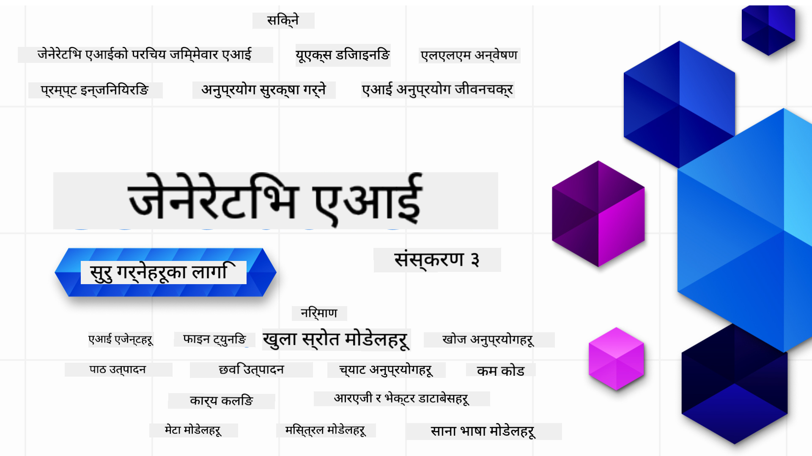

<!--
CO_OP_TRANSLATOR_METADATA:
{
  "original_hash": "6e3f4c8a4f323b8eab1cf11ded304b0f",
  "translation_date": "2025-06-25T07:49:00+00:00",
  "source_file": "README.md",
  "language_code": "ne"
}
-->

### २१ पाठहरू जसले जेनेरेटिभ एआई अनुप्रयोगहरू निर्माण गर्न सुरु गर्न आवश्यक सबै कुरा सिकाउँछ

### 🌐 बहुभाषी समर्थन

#### GitHub Action मार्फत समर्थित (स्वचालित र सधैं अद्यावधिक)

# जनरेटिभ एआईको लागि सुरुवाती (संस्करण ३) - एक पाठ्यक्रम

माइक्रोसफ्ट क्लाउड एड्भोकेट्सद्वारा प्रदान गरिएको हाम्रो २१ पाठको व्यापक पाठ्यक्रम मार्फत जनरेटिभ एआई अनुप्रयोगहरू निर्माणको आधारभूत कुरा सिक्नुहोस्।

## 🌱 सुरु गर्दै

यस पाठ्यक्रममा २१ पाठहरू छन्। प्रत्येक पाठले आफ्नो विषयलाई समेट्छ, त्यसैले तपाईले जहाँबाट चाहनुहुन्छ त्यहाँबाट सुरु गर्नुहोस्!

पाठहरू "Learn" पाठहरूको रूपमा लेबल गरिएका छन् जसले जनरेटिभ एआईको अवधारणा व्याख्या गर्छन् वा "Build" पाठहरू जसले अवधारणालाई व्याख्या गर्छन् र **Python** र **TypeScript** मा कोड उदाहरणहरू दिन्छन् जब सम्भव छ।

.NET विकासकर्ताहरूका लागि [जनरेटिभ एआईको लागि सुरुवाती (.NET संस्करण)](https://github.com/microsoft/Generative-AI-for-beginners-dotnet?WT.mc_id=academic-105485-koreyst) हेर्नुहोस्!

प्रत्येक पाठमा थप सिकाइ उपकरणहरूसँग "Keep Learning" खण्ड पनि समावेश गरिएको छ।

## तपाईलाई के चाहिन्छ
### यस पाठ्यक्रमको कोड चलाउनका लागि, तपाईले निम्न मध्ये कुनै पनि प्रयोग गर्न सक्नुहुन्छ: 
 - [Azure OpenAI सेवा](https://aka.ms/genai-beginners/azure-open-ai?WT.mc_id=academic-105485-koreyst) - **पाठहरू:** "aoai-assignment"
 - [GitHub Marketplace मोडेल क्याटलग](https://aka.ms/genai-beginners/gh-models?WT.mc_id=academic-105485-koreyst) - **पाठहरू:** "githubmodels"
 - [OpenAI API](https://aka.ms/genai-beginners/open-ai?WT.mc_id=academic-105485-koreyst) - **पाठहरू:** "oai-assignment" 

- Python वा TypeScript को आधारभूत ज्ञान उपयोगी छ - \*नवीनतम सुरुवातीहरूका लागि यी [Python](https://aka.ms/genai-beginners/python?WT.mc_id=academic-105485-koreyst) र [TypeScript](https://aka.ms/genai-beginners/typescript?WT.mc_id=academic-105485-koreyst) पाठ्यक्रमहरू हेर्नुहोस्
- तपाईको आफ्नै GitHub खातामा [यस सम्पूर्ण रिपो फोर्क गर्न](https://aka.ms/genai-beginners/github?WT.mc_id=academic-105485-koreyst) GitHub खाता

हामीले तपाईको विकास वातावरण सेटअप गर्न मद्दत गर्नका लागि **[पाठ्यक्रम सेटअप](./00-course-setup/README.md?WT.mc_id=academic-105485-koreyst)** पाठ सिर्जना गरेका छौं।

पछिपछि सजिलोसँग फेला पार्नका लागि [यस रिपोमा तार (🌟) लगाउन](https://docs.github.com/en/get-started/exploring-projects-on-github/saving-repositories-with-stars?WT.mc_id=academic-105485-koreyst) नबिर्सनुहोस्।

## 🧠 तयार छ परिनियोजन गर्न?

यदि तपाई थप उन्नत कोड नमूनाहरू खोज्दै हुनुहुन्छ भने, हाम्रो [जनरेटिभ एआई कोड नमूनाहरूको संग्रह](https://aka.ms/genai-beg-code?WT.mc_id=academic-105485-koreyst) मा **Python** र **TypeScript** मा हेर्नुहोस्।

## 🗣️ अन्य सिक्नेहरूलाई भेट्नुहोस्, समर्थन पाउनुहोस्

यस पाठ्यक्रम लिँदै गरेका अन्य सिक्नेहरूसँग भेट्न र नेटवर्क गर्नका लागि हाम्रो [औपचारिक Azure AI Foundry Discord सर्भर](https://aka.ms/genai-discord?WT.mc_id=academic-105485-koreyst) मा सामेल हुनुहोस् र समर्थन प्राप्त गर्नुहोस्।

हाम्रो [Azure AI Foundry Developer Forum](https://aka.ms/azureaifoundry/forum) मा प्रश्नहरू सोध्नुहोस् वा उत्पादन प्रतिक्रिया साझा गर्नुहोस्।

## 🚀 स्टार्टअप निर्माण गर्दै हुनुहुन्छ?

[Microsoft for Startups Founders Hub](https://aka.ms/genai-foundershub?WT.mc_id=academic-105485-koreyst) मा साइन अप गर्नुहोस् र **नि:शुल्क OpenAI क्रेडिटहरू** र **Azure OpenAI सेवाहरू मार्फत OpenAI मोडेलहरू पहुँच गर्न Azure क्रेडिटहरूमा $150k सम्म** प्राप्त गर्नुहोस्।

## 🙏 मद्दत गर्न चाहनुहुन्छ?

के तपाईसँग सुझावहरू छन् वा वर्तनी वा कोड त्रुटिहरू भेट्नुभएको छ? [समस्या उठाउनुहोस्](https://github.com/microsoft/generative-ai-for-beginners/issues?WT.mc_id=academic-105485-koreyst) वा [पुल अनुरोध सिर्जना गर्नुहोस्](https://github.com/microsoft/generative-ai-for-beginners/pulls?WT.mc_id=academic-105485-koreyst)

## 📂 प्रत्येक पाठमा समावेश छ:

- विषयको छोटो भिडियो परिचय
- README मा रहेको लेखिएको पाठ
- Azure OpenAI र OpenAI API समर्थन गर्ने Python र TypeScript कोड नमूनाहरू
- तपाईको सिकाइ जारी राख्न थप स्रोतहरूको लिङ्कहरू

## 🗃️ पाठहरू

| #   | **पाठ लिङ्क**                                                                                                                              | **विवरण**                                                                                 | **भिडियो**                                                                   | **थप सिकाइ**                                                             |
| --- | -------------------------------------------------------------------------------------------------------------------------------------------- | ----------------------------------------------------------------------------------------------- | --------------------------------------------------------------------------- | ------------------------------------------------------------------------------ |
| 00  | [पाठ्यक्रम सेटअप](./00-course-setup/README.md?WT.mc_id=academic-105485-koreyst)                                                                 | **सिक्नुहोस्:** तपाईको विकास वातावरण कसरी सेटअप गर्ने                                            | भिडियो चाँडै आउँदैछ                                                                 | [थप जान्नुहोस्](https://aka.ms/genai-collection?WT.mc_id=academic-105485-koreyst) |
| 01  | [जनरेटिभ एआई र LLMs को परिचय](./01-introduction-to-genai/README.md?WT.mc_id=academic-105485-koreyst)                              | **सिक्नुहोस्:** जनरेटिभ एआई के हो र ठूलो भाषा मोडेलहरू (LLMs) कसरी काम गर्छन्।       | [भिडियो](https://aka.ms/gen-ai-lesson-1-gh?WT.mc_id=academic-105485-koreyst) | [थप जान्नुहोस्](https://aka.ms/genai-collection?WT.mc_id=academic-105485-koreyst) |
| 02  | [विभिन्न LLMs अन्वेषण र तुलना गर्दै](./02-exploring-and-comparing-different-llms/README.md?WT.mc_id=academic-105485-koreyst)             | **सिक्नुहोस्:** तपाईको प्रयोग केसको लागि सही मोडेल कसरी चयन गर्ने                                      | [भिडियो](https://aka.ms/gen-ai-lesson2-gh?WT.mc_id=academic-105485-koreyst)  | [थप जान्नुहोस्](https://aka.ms/genai-collection?WT.mc_id=academic-105485-koreyst) |
| 03  | [जनरेटिभ एआई जिम्मेवारीपूर्वक प्रयोग गर्दै](./03-using-generative-ai-responsibly/README.md?WT.mc_id=academic-105485-koreyst)                           | **सिक्नुहोस्:** जिम्मेवारीपूर्वक जनरेटिभ एआई अनुप्रयोगहरू कसरी निर्माण गर्ने                                  | [भिडियो](https://aka.ms/gen-ai-lesson3-gh?WT.mc_id=academic-105485-koreyst)  | [थप जान्नुहोस्](https://aka.ms/genai-collection?WT.mc_id=academic-105485-koreyst) |
| 04  | [प्रम्ट इन्जिनियरिङका आधारभूत कुराहरू बुझ्दै](./04-prompt-engineering-fundamentals/README.md?WT.mc_id=academic-105485-koreyst)             | **सिक्नुहोस्:** हातमा प्रमाण इन्जिनियरिङका उत्कृष्ट अभ्यासहरू                                           | [भिडियो](https://aka.ms/gen-ai-lesson4-gh?WT.mc_id=academic-105485-koreyst)  | [थप जान्नुहोस्](https://aka.ms/genai-collection?WT.mc_id=academic-105485-koreyst) |
| 05  | [उन्नत प्रम्प्टहरू सिर्जना गर्दै](./05-advanced-prompts/README.md?WT.mc_id=academic-105485-koreyst)                                                | **जान्नुहोस्:** तपाइँको प्रम्प्टहरूको परिणाम सुधार गर्ने प्रम्प्ट इन्जिनियरिङ प्रविधिहरू कसरी लागू गर्ने। | [भिडियो](https://aka.ms/gen-ai-lesson5-gh?WT.mc_id=academic-105485-koreyst)  | [थप जान्नुहोस्](https://aka.ms/genai-collection?WT.mc_id=academic-105485-koreyst) |
| 06  | [पाठ उत्पादन अनुप्रयोगहरू निर्माण गर्दै](./06-text-generation-apps/README.md?WT.mc_id=academic-105485-koreyst)                                | **निर्माण गर्नुहोस्:** Azure OpenAI / OpenAI API प्रयोग गरेर पाठ उत्पादन अनुप्रयोग                                | [भिडियो](https://aka.ms/gen-ai-lesson6-gh?WT.mc_id=academic-105485-koreyst)  | [थप जान्नुहोस्](https://aka.ms/genai-collection?WT.mc_id=academic-105485-koreyst) |
| 07  | [च्याट अनुप्रयोगहरू निर्माण गर्दै](./07-building-chat-applications/README.md?WT.mc_id=academic-105485-koreyst)                                     | **निर्माण गर्नुहोस्:** च्याट अनुप्रयोगहरूलाई कुशलतापूर्वक निर्माण र एकीकृत गर्ने प्रविधिहरू।               | [भिडियो](https://aka.ms/gen-ai-lessons7-gh?WT.mc_id=academic-105485-koreyst) | [थप जान्नुहोस्](https://aka.ms/genai-collection?WT.mc_id=academic-105485-koreyst) |
| 08  | [खोज अनुप्रयोगहरू निर्माण गर्दै भेक्टर डाटाबेसहरू](./08-building-search-applications/README.md?WT.mc_id=academic-105485-koreyst)                        | **निर्माण गर्नुहोस्:** डाटा खोज गर्न Embeddings प्रयोग गर्ने खोज अनुप्रयोग।                        | [भिडियो](https://aka.ms/gen-ai-lesson8-gh?WT.mc_id=academic-105485-koreyst)  | [थप जान्नुहोस्](https://aka.ms/genai-collection?WT.mc_id=academic-105485-koreyst) |
| 09  | [छवि उत्पादन अनुप्रयोगहरू निर्माण गर्दै](./09-building-image-applications/README.md?WT.mc_id=academic-105485-koreyst)                        | **निर्माण गर्नुहोस्:** एक छवि उत्पादन अनुप्रयोग                                                       | [भिडियो](https://aka.ms/gen-ai-lesson9-gh?WT.mc_id=academic-105485-koreyst)  | [थप जान्नुहोस्](https://aka.ms/genai-collection?WT.mc_id=academic-105485-koreyst) |
| 10  | [लो कोड AI अनुप्रयोगहरू निर्माण गर्दै](./10-building-low-code-ai-applications/README.md?WT.mc_id=academic-105485-koreyst)                       | **निर्माण गर्नुहोस्:** लो कोड उपकरणहरू प्रयोग गरेर एक उत्पादनशील AI अनुप्रयोग                                     | [भिडियो](https://aka.ms/gen-ai-lesson10-gh?WT.mc_id=academic-105485-koreyst) | [थप जान्नुहोस्](https://aka.ms/genai-collection?WT.mc_id=academic-105485-koreyst) |
| 11  | [फंक्शन कलिङसँग बाह्य अनुप्रयोगहरू एकीकृत गर्दै](./11-integrating-with-function-calling/README.md?WT.mc_id=academic-105485-koreyst) | **निर्माण गर्नुहोस्:** फंक्शन कलिङ के हो र अनुप्रयोगहरूको लागि यसको प्रयोग केसहरू                          | [भिडियो](https://aka.ms/gen-ai-lesson11-gh?WT.mc_id=academic-105485-koreyst) | [थप जान्नुहोस्](https://aka.ms/genai-collection?WT.mc_id=academic-105485-koreyst) |
| 12  | [AI अनुप्रयोगहरूको लागि UX डिजाइन गर्दै](./12-designing-ux-for-ai-applications/README.md?WT.mc_id=academic-105485-koreyst)                         | **जान्नुहोस्:** उत्पादनशील AI अनुप्रयोगहरू विकास गर्दा UX डिजाइन सिद्धान्तहरू कसरी लागू गर्ने         | [भिडियो](https://aka.ms/gen-ai-lesson12-gh?WT.mc_id=academic-105485-koreyst) | [थप जान्नुहोस्](https://aka.ms/genai-collection?WT.mc_id=academic-105485-koreyst) |
| 13  | [तपाईंको उत्पादनशील AI अनुप्रयोगहरू सुरक्षित गर्दै](./13-securing-ai-applications/README.md?WT.mc_id=academic-105485-koreyst)                         | **जान्नुहोस्:** AI प्रणालीहरूमा खतरा र जोखिमहरू र यी प्रणालीहरूलाई सुरक्षित गर्ने विधिहरू।             | [भिडियो](https://aka.ms/gen-ai-lesson13-gh?WT.mc_id=academic-105485-koreyst) | [थप जान्नुहोस्](https://aka.ms/genai-collection?WT.mc_id=academic-105485-koreyst) |
| 14  | [उत्पादनशील AI अनुप्रयोग जीवनचक्र](./14-the-generative-ai-application-lifecycle/README.md?WT.mc_id=academic-105485-koreyst)           | **जान्नुहोस्:** LLM जीवनचक्र र LLMOps व्यवस्थापन गर्न उपकरणहरू र मेट्रिक्सहरू                         | [भिडियो](https://aka.ms/gen-ai-lesson14-gh?WT.mc_id=academic-105485-koreyst) | [थप जान्नुहोस्](https://aka.ms/genai-collection?WT.mc_id=academic-105485-koreyst) |
| 15  | [पुनः प्राप्ति वृद्धि उत्पत्ति (RAG) र भेक्टर डाटाबेसहरू](./15-rag-and-vector-databases/README.md?WT.mc_id=academic-105485-koreyst)        | **बनाउनुहोस्:** भेक्टर डाटाबेसहरूबाट एम्बेडिङ्स प्राप्त गर्न RAG फ्रेमवर्क प्रयोग गरेर एक अनुप्रयोग निर्माण गर्नुहोस्  | [भिडियो](https://aka.ms/gen-ai-lesson15-gh?WT.mc_id=academic-105485-koreyst) | [थप जानकारी](https://aka.ms/genai-collection?WT.mc_id=academic-105485-koreyst) |
| 16  | [ओपन सोर्स मोडेलहरू र हगिंग फेस](./16-open-source-models/README.md?WT.mc_id=academic-105485-koreyst)                                    | **बनाउनुहोस्:** हगिंग फेसमा उपलब्ध ओपन सोर्स मोडेलहरू प्रयोग गरेर एक अनुप्रयोग निर्माण गर्नुहोस्                    | [भिडियो](https://aka.ms/gen-ai-lesson16-gh?WT.mc_id=academic-105485-koreyst) | [थप जानकारी](https://aka.ms/genai-collection?WT.mc_id=academic-105485-koreyst) |
| 17  | [एआई एजेन्टहरू](./17-ai-agents/README.md?WT.mc_id=academic-105485-koreyst)                                                                       | **बनाउनुहोस्:** एआई एजेन्ट फ्रेमवर्क प्रयोग गरेर एक अनुप्रयोग निर्माण गर्नुहोस्                                           | [भिडियो](https://aka.ms/gen-ai-lesson17-gh?WT.mc_id=academic-105485-koreyst) | [थप जानकारी](https://aka.ms/genai-collection?WT.mc_id=academic-105485-koreyst) |
| 18  | [LLMs लाई फाइन-ट्यून गर्नुहोस्](./18-fine-tuning/README.md?WT.mc_id=academic-105485-koreyst)                                                              | **जान्नुहोस्:** LLMs लाई फाइन-ट्यून गर्ने के, किन र कसरी                                            | [भिडियो](https://aka.ms/gen-ai-lesson18-gh?WT.mc_id=academic-105485-koreyst) | [थप जानकारी](https://aka.ms/genai-collection?WT.mc_id=academic-105485-koreyst) |
| 19  | [SLMs को साथ निर्माण गर्नुहोस्](./19-slm/README.md?WT.mc_id=academic-105485-koreyst)                                                              | **जान्नुहोस्:** साना भाषा मोडेलहरूको साथ निर्माण गर्दा हुने फाइदाहरू                                            | भिडियो चाँडै आउँदैछ | [थप जानकारी](https://aka.ms/genai-collection?WT.mc_id=academic-105485-koreyst) |
| 20  | [मिस्ट्रल मोडेलहरूको साथ निर्माण गर्नुहोस्](./20-mistral/README.md?WT.mc_id=academic-105485-koreyst)                                                              | **जान्नुहोस्:** मिस्ट्रल परिवार मोडेलहरूको विशेषताहरू र भिन्नताहरू                                           | भिडियो चाँडै आउँदैछ | [थप जानकारी](https://aka.ms/genai-collection?WT.mc_id=academic-105485-koreyst) |
| 21  | [मेटा मोडेलहरूको साथ निर्माण गर्नुहोस्](./21-meta/README.md?WT.mc_id=academic-105485-koreyst)                                                              | **जान्नुहोस्:** मेटा परिवार मोडेलहरूको विशेषताहरू र भिन्नताहरू                                           | भिडियो चाँडै आउँदैछ | [थप जानकारी](https://aka.ms/genai-collection?WT.mc_id=academic-105485-koreyst) |

### 🌟 विशेष धन्यवाद

विशेष धन्यवाद [**जोहन अजीज**](https://www.linkedin.com/in/john0isaac/) लाई सबै GitHub कार्यहरू र वर्कफ्लोहरू सिर्जना गरेकोमा

[**बर्नहार्ड मर्कल**](https://www.linkedin.com/in/bernhard-merkle-738b73/) लाई प्रत्येक पाठमा प्रमुख योगदान गरेर सिक्ने र कोड अनुभव सुधार गरेकोमा। 

## 🎒 अन्य पाठ्यक्रमहरू

हाम्रो टोलीले अन्य पाठ्यक्रमहरू पनि उत्पादन गर्छ! जाँच गर्नुहोस्:

- [**नयाँ** मोडेल प्रसङ्ग प्रोटोकलको लागि सुरुवाती](https://github.com/microsoft/mcp-for-beginners?WT.mc_id=academic-105485-koreyst)
- [सुरुवातीको लागि एआई एजेन्टहरू](https://github.com/microsoft/ai-agents-for-beginners?WT.mc_id=academic-105485-koreyst)
- [सुरुवातीको लागि जेनेरेटिभ एआई .NET प्रयोग गर्दै](https://github.com/microsoft/Generative-AI-for-beginners-dotnet?WT.mc_id=academic-105485-koreyst)
- [सुरुवातीको लागि जेनेरेटिभ एआई JavaScript प्रयोग गर्दै](https://aka.ms/genai-js-course?WT.mc_id=academic-105485-koreyst)
- [सुरुवातीको लागि मेसिन लर्निङ](https://aka.ms/ml-beginners?WT.mc_id=academic-105485-koreyst)
- [सुरुवातीको लागि डाटा विज्ञान](https://aka.ms/datascience-beginners?WT.mc_id=academic-105485-koreyst)
- [सुरुवातीको लागि एआई](https://aka.ms/ai-beginners?WT.mc_id=academic-105485-koreyst)
- [सुरुवातीको लागि साइबर सुरक्षा](https://github.com/microsoft/Security-101??WT.mc_id=academic-96948-sayoung)
- [सुरुवातीको लागि वेब विकास](https://aka.ms/webdev-beginners?WT.mc_id=academic-105485-koreyst)
- [सुरुवातीको लागि IoT](https://aka.ms/iot-beginners?WT.mc_id=academic-105485-koreyst)
- [शुरुआतीहरूको लागि एक्सआर विकास](https://github.com/microsoft/xr-development-for-beginners?WT.mc_id=academic-105485-koreyst)
- [एआई जोडी प्रोग्रामिङको लागि GitHub Copilot मा दक्षता हासिल गर्नुहोस्](https://aka.ms/GitHubCopilotAI?WT.mc_id=academic-105485-koreyst)
- [C#/.NET विकासकर्ताहरूको लागि GitHub Copilot मा दक्षता हासिल गर्नुहोस्](https://github.com/microsoft/mastering-github-copilot-for-dotnet-csharp-developers?WT.mc_id=academic-105485-koreyst)
- [आफ्नो Copilot साहसिक यात्रा चयन गर्नुहोस्](https://github.com/microsoft/CopilotAdventures?WT.mc_id=academic-105485-koreyst)

**अस्वीकरण**:  
यो दस्तावेज AI अनुवाद सेवा [Co-op Translator](https://github.com/Azure/co-op-translator) प्रयोग गरेर अनुवाद गरिएको हो। हामी यथार्थताको लागि प्रयास गर्छौं, तर कृपया सचेत रहनुहोस् कि स्वचालित अनुवादमा त्रुटि वा असमानताहरू हुन सक्छन्। यसको मौलिक भाषामा रहेको मूल दस्तावेजलाई आधिकारिक स्रोत मान्नुपर्छ। महत्वपूर्ण जानकारीको लागि, व्यावसायिक मानव अनुवाद सिफारिस गरिन्छ। यस अनुवादको प्रयोगबाट उत्पन्न हुने कुनै पनि गलतफहमी वा गलत व्याख्याको लागि हामी जिम्मेवार हुनेछैनौं।