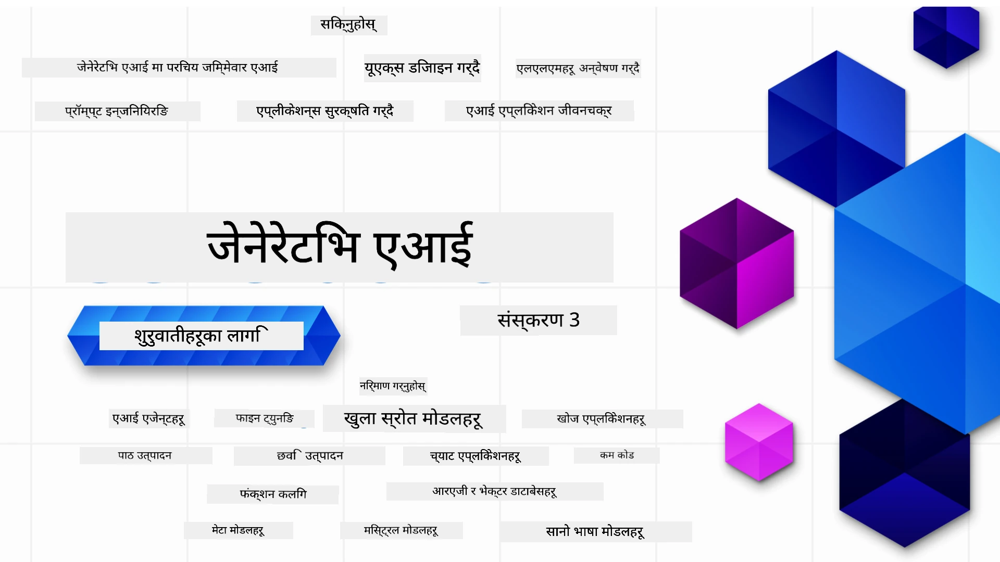

### जेनेरेटिभ AI अनुप्रयोगहरू निर्माण गर्नका लागि तपाईंले जान्नुपर्ने सबै कुरा सिकाउने २१ पाठहरू

[](https://github.com/microsoft/Generative-AI-For-Beginners/blob/master/LICENSE?WT.mc_id=academic-105485-koreyst)
[](https://GitHub.com/microsoft/Generative-AI-For-Beginners/graphs/contributors/?WT.mc_id=academic-105485-koreyst)
[](https://GitHub.com/microsoft/Generative-AI-For-Beginners/issues/?WT.mc_id=academic-105485-koreyst)
[](https://GitHub.com/microsoft/Generative-AI-For-Beginners/pulls/?WT.mc_id=academic-105485-koreyst)
[](http://makeapullrequest.com?WT.mc_id=academic-105485-koreyst)

[](https://GitHub.com/microsoft/Generative-AI-For-Beginners/watchers/?WT.mc_id=academic-105485-koreyst)
[](https://GitHub.com/microsoft/Generative-AI-For-Beginners/network/?WT.mc_id=academic-105485-koreyst)
[](https://GitHub.com/microsoft/Generative-AI-For-Beginners/stargazers/?WT.mc_id=academic-105485-koreyst)

[](https://discord.gg/nTYy5BXMWG)

### 🌐 बहुभाषी समर्थन

#### GitHub Action मार्फत समर्थित (स्वचालित र सधैं अपडेट रहने)

<!-- CO-OP TRANSLATOR LANGUAGES TABLE START -->
[अङ्ग्रेजी](../ar/README.md) | [बङ्गाली](../bn/README.md) | [बुल्गेरियन](../bg/README.md) | [बर्मेली (म्यान्मार)](../my/README.md) | [चिनी (सरलीकृत)](../zh-CN/README.md) | [चिनी (परम्परागत, हङकङ)](../zh-HK/README.md) | [चिनी (परम्परागत, मकाऊ)](../zh-MO/README.md) | [चिनी (परम्परागत, ताइवान)](../zh-TW/README.md) | [क्रोएशियन](../hr/README.md) | [चेक](../cs/README.md) | [डेनिश](../da/README.md) | [डच](../nl/README.md) | [एस्टोनियन](../et/README.md) | [फिनिस](../fi/README.md) | [फ्रेन्च](../fr/README.md) | [जर्मन](../de/README.md) | [ग्रीक](../el/README.md) | [हिब्रू](../he/README.md) | [हिन्दी](../hi/README.md) | [हंगेरीयन](../hu/README.md) | [इन्डोनेशियन](../id/README.md) | [इटालियन](../it/README.md) | [जापानी](../ja/README.md) | [कन्नड](../kn/README.md) | [खमेर](../km/README.md) | [कोरियन](../ko/README.md) | [लिथुआनियन](../lt/README.md) | [मलय](../ms/README.md) | [मलयालम](../ml/README.md) | [मराठी](../mr/README.md) | [नेपाली](./README.md) | [नाइजेरियन पिजिन](../pcm/README.md) | [नर्वेजियन](../no/README.md) | [फारसी (पर्शियन)](../fa/README.md) | [पोलीस](../pl/README.md) | [पोर्चुगिज (ब्राजिल)](../pt-BR/README.md) | [पोर्चुगिज (पोर्चुगल)](../pt-PT/README.md) | [पञ्जाबी (गुरमुखी)](../pa/README.md) | [रोमानियन](../ro/README.md) | [रशियन](../ru/README.md) | [सर्भियन (सिरिलिक)](../sr/README.md) | [स्लोभाक](../sk/README.md) | [स्लोभेनियन](../sl/README.md) | [स्पेनी](../es/README.md) | [स्वाहिली](../sw/README.md) | [स्विडिश](../sv/README.md) | [टगलोग (फलिपिनो)](../tl/README.md) | [तमिल](../ta/README.md) | [तेलुगु](../te/README.md) | [थाई](../th/README.md) | [टर्किश](../tr/README.md) | [उक्रेनियन](../uk/README.md) | [उर्दू](../ur/README.md) | [भियतनामी](../vi/README.md)

> **स्थानीय रूपमा क्लोन गर्न चाहनुहुन्छ?**
>
> यस रिपोजिटोरीमा ५० भन्दा बढी भाषाहरूका अनुवादहरू छन् जसले डाउनलोड आकार निकै बढाउँछ। अनुवादहरू बिना क्लोन गर्न, sparse checkout प्रयोग गर्नुहोस्:
>
> **Bash / macOS / Linux:**
> ```bash
> git clone --filter=blob:none --sparse https://github.com/microsoft/generative-ai-for-beginners.git
> cd generative-ai-for-beginners
> git sparse-checkout set --no-cone '/*' '!translations' '!translated_images'
> ```
>
> **CMD (Windows):**
> ```cmd
> git clone --filter=blob:none --sparse https://github.com/microsoft/generative-ai-for-beginners.git
> cd generative-ai-for-beginners
> git sparse-checkout set --no-cone "/*" "!translations" "!translated_images"
> ```
>
> यसले तपाईंलाई कोर्ष पूरा गर्न आवश्यक सबै कुरा धेरै छिटो डाउनलोडका साथ दिन्छ।
<!-- CO-OP TRANSLATOR LANGUAGES TABLE END -->

# जेनेरेटिभ AI सुरु गर्नेहरूको लागि (संस्करण ३) - एक कोर्स

Microsoft Cloud Advocates द्वारा तयार पारिएको २१ पाठहरूको व्यापक कोर्समार्फत जेनेरेटिभ AI अनुप्रयोगहरू निर्माण गर्ने आधारभूत कुराहरू सिक्नुहोस्।

## 🌱 सुरु गर्नुहोस्

यो कोर्समा २१ पाठहरू छन्। प्रत्येक पाठले आफ्नो विषयलाई समेट्छ त्यसैले जहाँ मन लाग्छ त्यहाँबाट सुरु गर्नुहोस्!

पाठहरूलाई "सिक्ने" पाठहरू जुन जेनेरेटिभ AI अवधारणा व्याख्या गर्छन् वा "बनाउने" पाठहरू जुन अवधारणा र सम्भव भएमा दुबै **Python** र **TypeScript** मा कोड उदाहरणहरू बताउँछन् भनेर लेबल गरिएको छ।

.NET विकासकर्ताहरूका लागि [Generative AI for Beginners (.NET Edition)](https://github.com/microsoft/Generative-AI-for-beginners-dotnet?WT.mc_id=academic-105485-koreyst) मा जानुहोस्!

हरेक पाठमा थप सिकाइका उपकरणहरू सहित "अझ सिकिरहनुहोस्" खण्ड पनि हुन्छ।

## तपाईंलाई के चाहिन्छ
### यो कोर्सको कोड चलाउन, तपाईंले यी मध्ये कुनै एउटालाई प्रयोग गर्नसक्नुहुन्छ:
 - [Azure OpenAI Service](https://aka.ms/genai-beginners/azure-open-ai?WT.mc_id=academic-105485-koreyst) - **पाठहरू:** "aoai-assignment"
 - [GitHub Marketplace Model Catalog](https://aka.ms/genai-beginners/gh-models?WT.mc_id=academic-105485-koreyst) - **पाठहरू:** "githubmodels"
 - [OpenAI API](https://aka.ms/genai-beginners/open-ai?WT.mc_id=academic-105485-koreyst) - **पाठहरू:** "oai-assignment" 
   
- Python वा TypeScript को आधारभूत ज्ञान उपयोगी छ - \*पूर्ण सुरु गर्नेलाई यी [Python](https://aka.ms/genai-beginners/python?WT.mc_id=academic-105485-koreyst) र [TypeScript](https://aka.ms/genai-beginners/typescript?WT.mc_id=academic-105485-koreyst) कोर्सहरू हेर्नुहोस्
- तपाईंको आफ्नै GitHub खातामा यो सम्पूर्ण रिपो [fork](https://aka.ms/genai-beginners/github?WT.mc_id=academic-105485-koreyst) गर्न GitHub खाता चाहिन्छ

हामीले तपाईंको विकास वातावरण सेटअपमा सहयोग गर्नको लागि **[कोर्स सेटअप](./00-course-setup/README.md?WT.mc_id=academic-105485-koreyst)** पाठ तयार पारेका छौं।

पछाडि सजिलै फेला पार्न यो रिपोमा [तारा (🌟)](https://docs.github.com/en/get-started/exploring-projects-on-github/saving-repositories-with-stars?WT.mc_id=academic-105485-koreyst) दिन नबिर्सनुहोस्।

## 🧠 तयार हुनुहुन्छ तिनलाई तैनाथ गर्न?

यदि तपाईं अझै उन्नत कोड नमुनाहरू खोज्दै हुनुहुन्छ भने, हाम्रो [जेनेरेटिभ AI कोड नमुनाहरूको सङ्ग्रह](https://aka.ms/genai-beg-code?WT.mc_id=academic-105485-koreyst) हेर्नुहोस् जुन दुबै **Python** र **TypeScript** मा उपलब्ध छ।

## 🗣️ अरु सिक्नेहरूसँग भेट्नुहोस्, सहयोग पाउनुहोस्

हाम्रो [राष्ट्रकीय Azure AI Foundry Discord सर्भर](https://aka.ms/genai-discord?WT.mc_id=academic-105485-koreyst) मा जोडिनुहोस् जहाँ तपाईं अरु सिक्नेहरूसँग भेटघाट गर्न र सहयोग लिन सक्नुहुन्छ।

प्रश्न सोध्न वा उत्पादन सम्बन्धी प्रतिक्रिया दिन हाम्रो [Azure AI Foundry Developer Forum](https://aka.ms/azureaifoundry/forum) मा GitHub मा सहभागी हुनुहोस्।

## 🚀 स्टार्टअप बनाउन लाग्नुभएको छ?

आजै Azure क्रेडिटबाट कसरी सुरु गर्ने जान्नका लागि [Microsoft for Startups](https://www.microsoft.com/startups) मा जानुहोस्।

## 🙏 सहयोग गर्न चाहनुहुन्छ?

के तपाईंसँग कुनै सुझाव छ वा कुनै टाइपिङ अथवा कोड गल्ती भेट्नुभएको छ? कृपया [मुद्दा उठाउनुहोस्](https://github.com/microsoft/generative-ai-for-beginners/issues?WT.mc_id=academic-105485-koreyst) वा [पुल अनुरोध सिर्जना गर्नुहोस्](https://github.com/microsoft/generative-ai-for-beginners/pulls?WT.mc_id=academic-105485-koreyst)

## 📂 प्रत्येक पाठमा समावेश छन्:

- विषयको छोटो भिडियो परिचय
- README मा रहेको लेखिएको पाठ
- Azure OpenAI र OpenAI API का लागि Python र TypeScript कोड नमुनाहरू
- तपाईंको अध्ययनलाई निरन्तरता दिन अतिरिक्त स्रोतहरूका लिंकहरू

## 🗃️ पाठहरू

| #   | **पाठको लिंक**                                                                                                                              | **विवरण**                                                                                     | **भिडियो**                                                           | **अतिरिक्त सिकाइका सामग्रीहरू**                                             |
| --- | -------------------------------------------------------------------------------------------------------------------------------------------- | --------------------------------------------------------------------------------------------- | ------------------------------------------------------------------- | ------------------------------------------------------------------------- |
| 00  | [कोर्स सेटअप](./00-course-setup/README.md?WT.mc_id=academic-105485-koreyst)                                                                   | **सिक्नुहोस्:** तपाईंको विकास वातावरण कसरी सेटअप गर्ने                                       | भिडियो चाँडै आउनेछ                                                     | [थप सिक्नुहोस्](https://aka.ms/genai-collection?WT.mc_id=academic-105485-koreyst)  |
| 01  | [जेनेरेटिभ AI र LLMs परिचय](./01-introduction-to-genai/README.md?WT.mc_id=academic-105485-koreyst)                                             | **सिक्नुहोस्:** जेनेरेटिभ AI के हो र ठूलो भाषा मोडलहरू (LLMs) कसरी काम गर्छन् बुझ्नुहोस्।     | [भिडियो](https://aka.ms/gen-ai-lesson-1-gh?WT.mc_id=academic-105485-koreyst) | [थप सिक्नुहोस्](https://aka.ms/genai-collection?WT.mc_id=academic-105485-koreyst)  |
| 02  | [विभिन्न LLMs अन्वेषण र तुलना](./02-exploring-and-comparing-different-llms/README.md?WT.mc_id=academic-105485-koreyst)                           | **सिक्नुहोस्:** तपाईंको प्रयोगका लागि सही मोडेल कसरी चयन गर्ने                               | [भिडियो](https://aka.ms/gen-ai-lesson2-gh?WT.mc_id=academic-105485-koreyst)  | [थप सिक्नुहोस्](https://aka.ms/genai-collection?WT.mc_id=academic-105485-koreyst)  |
| 03  | [जेनेरेटिभ AI दायित्वपूर्वक प्रयोग गर्ने](./03-using-generative-ai-responsibly/README.md?WT.mc_id=academic-105485-koreyst)                       | **सिक्नुहोस्:** जेनेरेटिभ AI अनुप्रयोगहरू कसरी दायित्वपूर्वक निर्माण गर्ने                   | [भिडियो](https://aka.ms/gen-ai-lesson3-gh?WT.mc_id=academic-105485-koreyst)  | [थप सिक्नुहोस्](https://aka.ms/genai-collection?WT.mc_id=academic-105485-koreyst)  |
| 04  | [प्रॉम्प्ट इन्जिनियरिङका आधारभूत कुरा बुझ्ने](./04-prompt-engineering-fundamentals/README.md?WT.mc_id=academic-105485-koreyst)             | **सिक्नुहोस्:** प्रॉम्प्ट इन्जिनियरिङका उत्कृष्ट अभ्यासहरू व्यवहारमा लागू गर्ने                                      | [भिडियो](https://aka.ms/gen-ai-lesson4-gh?WT.mc_id=academic-105485-koreyst)  | [थप जान्नुहोस्](https://aka.ms/genai-collection?WT.mc_id=academic-105485-koreyst) |
| 05  | [उन्नत प्रॉम्प्टहरू सिर्जना गर्ने](./05-advanced-prompts/README.md?WT.mc_id=academic-105485-koreyst)                                                | **सिक्नुहोस्:** प्रॉम्प्टहरूका नतिजा सुधार्न प्रॉम्प्ट इन्जिनियरिङ प्रविधिहरू कसरी लागू गर्ने                      | [भिडियो](https://aka.ms/gen-ai-lesson5-gh?WT.mc_id=academic-105485-koreyst)  | [थप जान्नुहोस्](https://aka.ms/genai-collection?WT.mc_id=academic-105485-koreyst) |
| 06  | [पाठ उत्पादन अनुप्रयोगहरू बनाउने](./06-text-generation-apps/README.md?WT.mc_id=academic-105485-koreyst)                                | **निर्माण गर्नुहोस्:** Azure OpenAI / OpenAI API प्रयोग गरी पाठ उत्पादन गर्ने एप्लीकेशन                          | [भिडियो](https://aka.ms/gen-ai-lesson6-gh?WT.mc_id=academic-105485-koreyst)  | [थप जान्नुहोस्](https://aka.ms/genai-collection?WT.mc_id=academic-105485-koreyst) |
| 07  | [च्याट एप्लीकेशनहरू बनाउने](./07-building-chat-applications/README.md?WT.mc_id=academic-105485-koreyst)                                     | **निर्माण गर्नुहोस्:** च्याट एप्लीकेशनहरू प्रभावकारी रूपमा बनाउने र एकीकृत गर्ने प्रविधिहरू                        | [भिडियो](https://aka.ms/gen-ai-lessons7-gh?WT.mc_id=academic-105485-koreyst) | [थप जान्नुहोस्](https://aka.ms/genai-collection?WT.mc_id=academic-105485-koreyst) |
| 08  | [सर्च एप्स वेक्टर डाटाबेसहरू बनाउने](./08-building-search-applications/README.md?WT.mc_id=academic-105485-koreyst)                        | **निर्माण गर्नुहोस्:** डाटा खोज्न एम्बेडिङ प्रयोग गर्ने सर्च एप्लीकेशन                                         | [भिडियो](https://aka.ms/gen-ai-lesson8-gh?WT.mc_id=academic-105485-koreyst)  | [थप जान्नुहोस्](https://aka.ms/genai-collection?WT.mc_id=academic-105485-koreyst) |
| 09  | [छवि उत्पादन एप्लीकेशनहरू बनाउने](./09-building-image-applications/README.md?WT.mc_id=academic-105485-koreyst)                        | **निर्माण गर्नुहोस्:** छवि उत्पादन एप्लीकेशन                                                                  | [भिडियो](https://aka.ms/gen-ai-lesson9-gh?WT.mc_id=academic-105485-koreyst)  | [थप जान्नुहोस्](https://aka.ms/genai-collection?WT.mc_id=academic-105485-koreyst) |
| 10  | [लो कोड AI एप्लीकेशनहरू बनाउने](./10-building-low-code-ai-applications/README.md?WT.mc_id=academic-105485-koreyst)                       | **निर्माण गर्नुहोस्:** लो कोड उपकरणहरू प्रयोग गरी जनरेटिभ AI एप्लीकेशन                                        | [भिडियो](https://aka.ms/gen-ai-lesson10-gh?WT.mc_id=academic-105485-koreyst) | [थप जान्नुहोस्](https://aka.ms/genai-collection?WT.mc_id=academic-105485-koreyst) |
| 11  | [फङ्सन कलिङसँग बाह्य एप्लीकेशनहरू एकीकृत गर्ने](./11-integrating-with-function-calling/README.md?WT.mc_id=academic-105485-koreyst) | **निर्माण गर्नुहोस्:** फङ्सन कलिङ के हो र एप्लीकेशनहरूमा यसको प्रयोग | [भिडियो](https://aka.ms/gen-ai-lesson11-gh?WT.mc_id=academic-105485-koreyst) | [थप जान्नुहोस्](https://aka.ms/genai-collection?WT.mc_id=academic-105485-koreyst) |
| 12  | [AI एप्लीकेशनहरूका लागि UX डिजाइन गर्ने](./12-designing-ux-for-ai-applications/README.md?WT.mc_id=academic-105485-koreyst)                         | **सिक्नुहोस्:** जनरेटिभ AI एप्लीकेशन विकास गर्दा UX डिजाइन सिद्घान्तहरू कसरी लागू गर्ने                            | [भिडियो](https://aka.ms/gen-ai-lesson12-gh?WT.mc_id=academic-105485-koreyst) | [थप जान्नुहोस्](https://aka.ms/genai-collection?WT.mc_id=academic-105485-koreyst) |
| 13  | [तपाईंको जनरेटिभ AI एप्लीकेशनहरू सुरक्षित गर्ने](./13-securing-ai-applications/README.md?WT.mc_id=academic-105485-koreyst)                         | **सिक्नुहोस्:** AI प्रणालीहरूलाई हुने खतराहरू र जोखिमहरू र ती प्रणालीहरूलाई सुरक्षित गर्ने उपायहरू                 | [भिडियो](https://aka.ms/gen-ai-lesson13-gh?WT.mc_id=academic-105485-koreyst) | [थप जान्नुहोस्](https://aka.ms/genai-collection?WT.mc_id=academic-105485-koreyst) |
| 14  | [जनरेटिभ AI एप्लीकेशन जीवनचक्र](./14-the-generative-ai-application-lifecycle/README.md?WT.mc_id=academic-105485-koreyst)           | **सिक्नुहोस्:** LLM जीवनचक्र र LLMOps प्रबन्धनका लागि टुलहरू र मेट्रिक्स                                   | [भिडियो](https://aka.ms/gen-ai-lesson14-gh?WT.mc_id=academic-105485-koreyst) | [थप जान्नुहोस्](https://aka.ms/genai-collection?WT.mc_id=academic-105485-koreyst) |
| 15  | [Retrieval Augmented Generation (RAG) र वेक्टर डाटाबेसहरू](./15-rag-and-vector-databases/README.md?WT.mc_id=academic-105485-koreyst)        | **निर्माण गर्नुहोस्:** वेक्टर डाटाबेसहरूबाट एम्बेडिङ पुनःप्राप्त गर्न RAG फ्रेमवर्क प्रयोग गरी एप्लीकेशन       | [भिडियो](https://aka.ms/gen-ai-lesson15-gh?WT.mc_id=academic-105485-koreyst) | [थप जान्नुहोस्](https://aka.ms/genai-collection?WT.mc_id=academic-105485-koreyst) |
| 16  | [ओपन सोर्स मोडेलहरू र Hugging Face](./16-open-source-models/README.md?WT.mc_id=academic-105485-koreyst)                                    | **निर्माण गर्नुहोस्:** Hugging Face मा उपलब्ध खुला स्रोत मोडेलहरू प्रयोग गरी एप्लीकेशन                         | [भिडियो](https://aka.ms/gen-ai-lesson16-gh?WT.mc_id=academic-105485-koreyst) | [थप जान्नुहोस्](https://aka.ms/genai-collection?WT.mc_id=academic-105485-koreyst) |
| 17  | [AI एजेन्टहरू](./17-ai-agents/README.md?WT.mc_id=academic-105485-koreyst)                                                                       | **निर्माण गर्नुहोस्:** AI एजेन्ट फ्रेमवर्क प्रयोग गरी एप्लीकेशन                                             | [भिडियो](https://aka.ms/gen-ai-lesson17-gh?WT.mc_id=academic-105485-koreyst) | [थप जान्नुहोस्](https://aka.ms/genai-collection?WT.mc_id=academic-105485-koreyst) |
| 18  | [LLM हरूलाई फाइन-ट्युनिङ गर्ने](./18-fine-tuning/README.md?WT.mc_id=academic-105485-koreyst)                                                              | **सिक्नुहोस्:** LLM हरूलाई फाइन-ट्युनिङ गर्ने के, किन र कसरी                                                   | [भिडियो](https://aka.ms/gen-ai-lesson18-gh?WT.mc_id=academic-105485-koreyst) | [थप जान्नुहोस्](https://aka.ms/genai-collection?WT.mc_id=academic-105485-koreyst) |
| 19  | [SLM हरूसँग निर्माण गर्ने](./19-slm/README.md?WT.mc_id=academic-105485-koreyst)                                                              | **सिक्नुहोस्:** साना भाषा मोडेलहरूसँग निर्माण गर्दा हुने फाइदाहरू                                             | भिडियो चाँडै आउँदैछ | [थप जान्नुहोस्](https://aka.ms/genai-collection?WT.mc_id=academic-105485-koreyst) |
| 20  | [Mistral मोडेलहरूसँग निर्माण गर्ने](./20-mistral/README.md?WT.mc_id=academic-105485-koreyst)                                                              | **सिक्नुहोस्:** Mistral परिवार मोडेलहरूको विशेषताहरू र भिन्नताहरू                                           | भिडियो चाँडै आउँदैछ | [थप जान्नुहोस्](https://aka.ms/genai-collection?WT.mc_id=academic-105485-koreyst) |
| 21  | [Meta मोडेलहरूसँग निर्माण गर्ने](./21-meta/README.md?WT.mc_id=academic-105485-koreyst)                                                              | **सिक्नुहोस्:** Meta परिवार मोडेलहरूको विशेषताहरू र भिन्नताहरू                                             | भिडियो चाँडै आउँदैछ | [थप जान्नुहोस्](https://aka.ms/genai-collection?WT.mc_id=academic-105485-koreyst) |

### 🌟 विशेष धन्यवाद

[**John Aziz**](https://www.linkedin.com/in/john0isaac/) लाई GitHub Actions र workflows बनाउने सबै कामका लागि विशेष धन्यवाद

[**Bernhard Merkle**](https://www.linkedin.com/in/bernhard-merkle-738b73/) लाई प्रत्येक पाठमा सिक्ने र कोड अनुभव सुधार गर्न मुख्य योगदान पुर्‍याउनेका लागि धन्यवाद।

## 🎒 अन्य पाठ्यक्रमहरू

हाम्रो टोलीले अन्य पाठ्यक्रमहरू पनि उत्पादन गर्दछ! हेर्नुहोस्:

<!-- CO-OP TRANSLATOR OTHER COURSES START -->
### LangChain
[](https://aka.ms/langchain4j-for-beginners)
[](https://aka.ms/langchainjs-for-beginners?WT.mc_id=m365-94501-dwahlin)
[](https://github.com/microsoft/langchain-for-beginners?WT.mc_id=m365-94501-dwahlin)
---

### Azure / Edge / MCP / Agents
[](https://github.com/microsoft/AZD-for-beginners?WT.mc_id=academic-105485-koreyst)
[](https://github.com/microsoft/edgeai-for-beginners?WT.mc_id=academic-105485-koreyst)
[](https://github.com/microsoft/mcp-for-beginners?WT.mc_id=academic-105485-koreyst)
[](https://github.com/microsoft/ai-agents-for-beginners?WT.mc_id=academic-105485-koreyst)

---
 
### Generative AI Series
[](https://github.com/microsoft/generative-ai-for-beginners?WT.mc_id=academic-105485-koreyst)
[-9333EA?style=for-the-badge&labelColor=E5E7EB&color=9333EA)](https://github.com/microsoft/Generative-AI-for-beginners-dotnet?WT.mc_id=academic-105485-koreyst)
[-C084FC?style=for-the-badge&labelColor=E5E7EB&color=C084FC)](https://github.com/microsoft/generative-ai-for-beginners-java?WT.mc_id=academic-105485-koreyst)
[-E879F9?style=for-the-badge&labelColor=E5E7EB&color=E879F9)](https://github.com/microsoft/generative-ai-with-javascript?WT.mc_id=academic-105485-koreyst)

---
 
### कोर सिकाइ
[](https://aka.ms/ml-beginners?WT.mc_id=academic-105485-koreyst)
[](https://aka.ms/datascience-beginners?WT.mc_id=academic-105485-koreyst)
[](https://aka.ms/ai-beginners?WT.mc_id=academic-105485-koreyst)
[](https://github.com/microsoft/Security-101?WT.mc_id=academic-96948-sayoung)
[](https://aka.ms/webdev-beginners?WT.mc_id=academic-105485-koreyst)
[](https://aka.ms/iot-beginners?WT.mc_id=academic-105485-koreyst)
[](https://github.com/microsoft/xr-development-for-beginners?WT.mc_id=academic-105485-koreyst)

---
 
### कोपिलट श्रृंखला
[](https://aka.ms/GitHubCopilotAI?WT.mc_id=academic-105485-koreyst)
[](https://github.com/microsoft/mastering-github-copilot-for-dotnet-csharp-developers?WT.mc_id=academic-105485-koreyst)
[](https://github.com/microsoft/CopilotAdventures?WT.mc_id=academic-105485-koreyst)
<!-- CO-OP TRANSLATOR OTHER COURSES END -->

## सहायता प्राप्त गर्दै

यदि तपाईं अड्कनुभयो वा AI एपहरू बनाउँदा कुनै पनि प्रश्न भएमा। साथी सिक्नेहरू र अनुभवी विकासकर्ताहरूलाई MCP मा छलफलहरूमा सामेल हुनुहोस्। यो एक सहायक समुदाय हो जहाँ प्रश्नहरू स्वागतयोग्य छन् र ज्ञान स्वतन्त्र रूपमा साझा गरिन्छ।

[](https://discord.gg/nTYy5BXMWG)

यदि तपाईंसँग उत्पादन प्रतिक्रिया वा त्रुटिहरू छन् भने बनाउँदा भ्रमण गर्नुहोस्:

[](https://aka.ms/foundry/forum)

---

<!-- CO-OP TRANSLATOR DISCLAIMER START -->
**अस्वीकरण**:  
यो दस्तावेज AI अनुवाद सेवा [Co-op Translator](https://github.com/Azure/co-op-translator) प्रयोग गरेर अनुवाद गरिएको हो। हामी शुद्धताको लागि प्रयास गर्छौँ, तर कृपया जान्नुहोस् कि स्वचालित अनुवादमा त्रुटिहरू वा अशुद्धिहरू हुन सक्छन्। मूल दस्तावेज यसको स्वदेशी भाषामा आधिकारिक स्रोत मानिनुपर्छ। महत्वपूर्ण जानकारीका लागि व्यावसायिक मानव अनुवाद सिफारिस गरिन्छ। यस अनुवादको प्रयोगबाट उत्पन्न हुने कुनै पनि गलतफहमी वा गलत व्याख्याहरूबारे हामी जिम्मेवार छैनौं।
<!-- CO-OP TRANSLATOR DISCLAIMER END -->