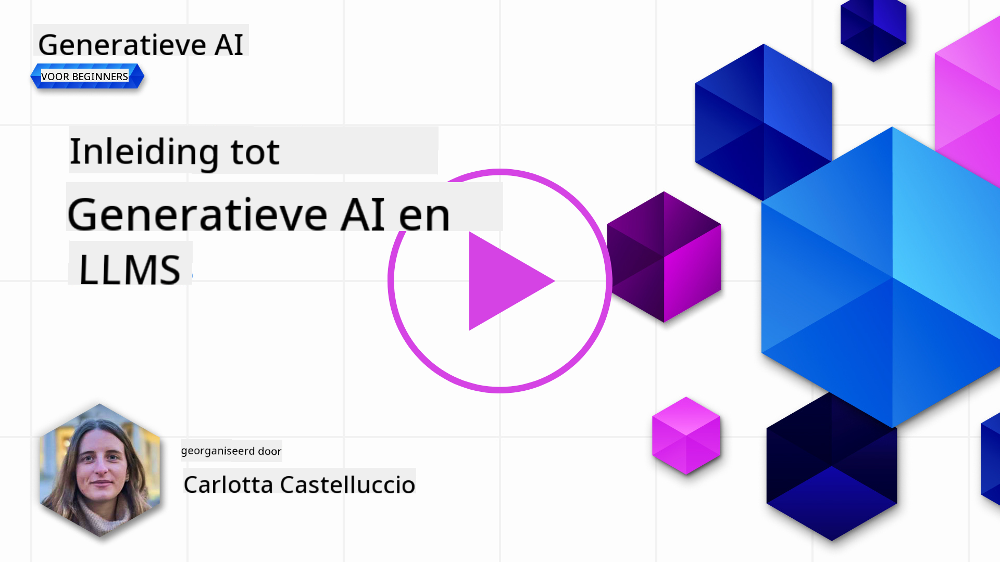
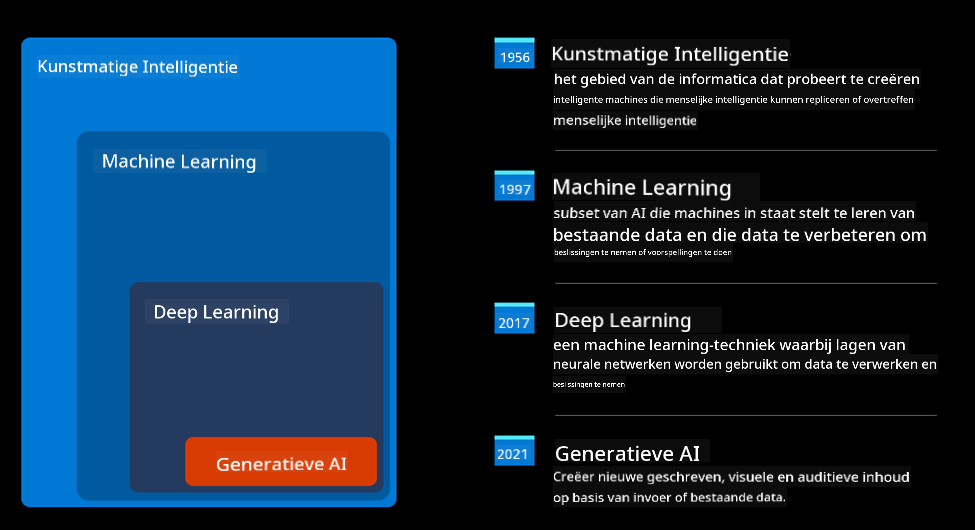
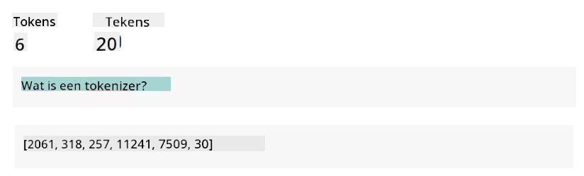
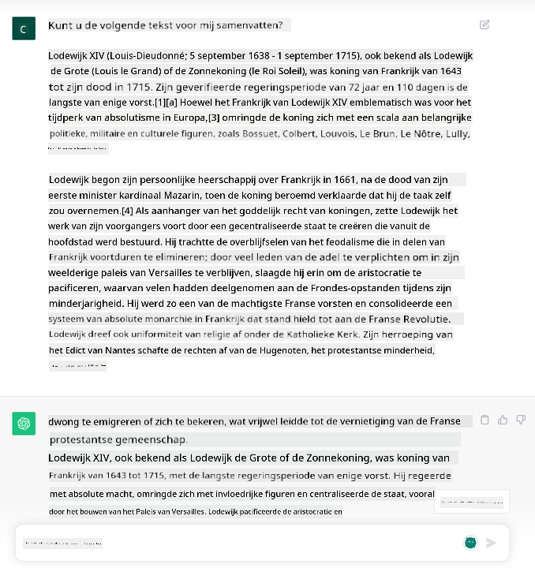
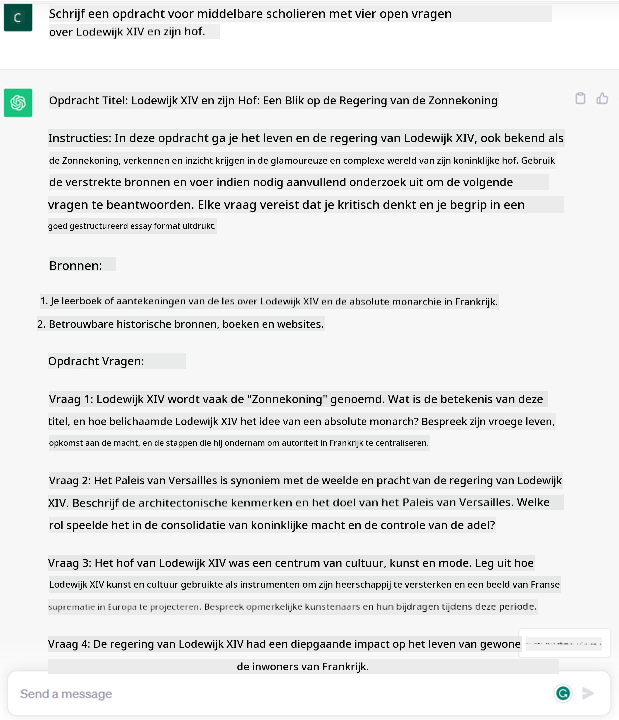
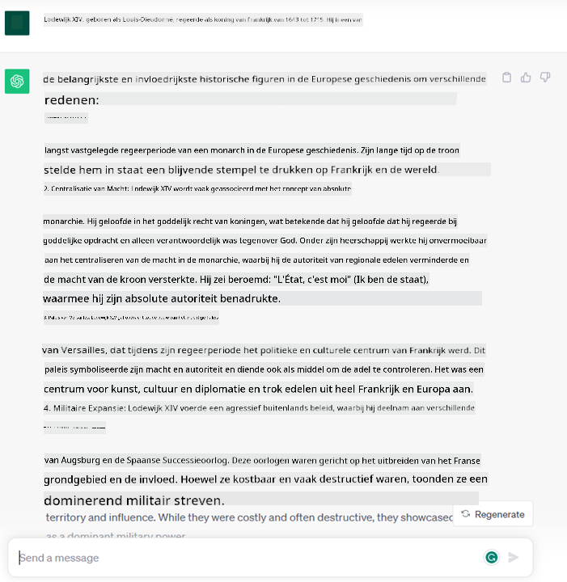
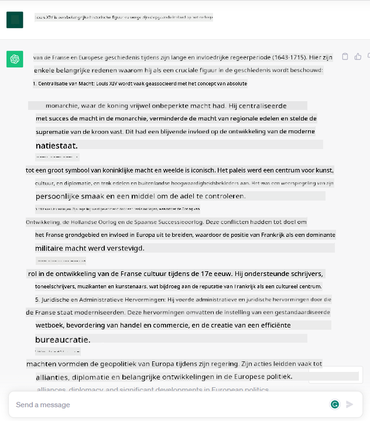
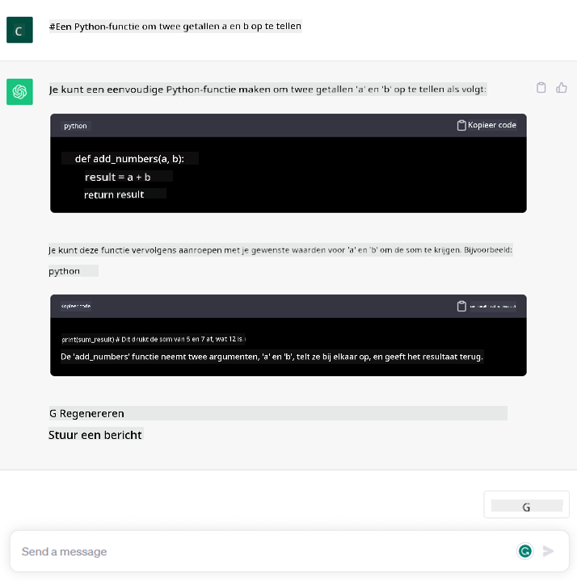

<!--
CO_OP_TRANSLATOR_METADATA:
{
  "original_hash": "f53ba0fa49164f9323043f1c6b11f2b1",
  "translation_date": "2025-06-25T09:57:40+00:00",
  "source_file": "01-introduction-to-genai/README.md",
  "language_code": "nl"
}
-->
# Introductie tot Generatieve AI en Grote Taalmodellen

_(Klik op de afbeelding hierboven om de video van deze les te bekijken)_

Generatieve AI is kunstmatige intelligentie die in staat is om tekst, afbeeldingen en andere soorten inhoud te genereren. Wat het een fantastische technologie maakt, is dat het AI democratiseert; iedereen kan het gebruiken met slechts een tekstprompt, een zin geschreven in natuurlijke taal. Je hoeft geen taal als Java of SQL te leren om iets waardevols te bereiken; alles wat je nodig hebt, is je taal gebruiken, zeggen wat je wilt en er komt een suggestie uit een AI-model. De toepassingen en impact hiervan zijn enorm; je kunt rapporten schrijven of begrijpen, applicaties maken en nog veel meer, allemaal in seconden.

In dit curriculum verkennen we hoe onze startup generatieve AI inzet om nieuwe scenario's in de onderwijswereld te ontgrendelen en hoe we omgaan met de onvermijdelijke uitdagingen die gepaard gaan met de sociale implicaties van de toepassing en de technologische beperkingen.

## Introductie

Deze les behandelt:

- Introductie tot het zakelijke scenario: ons startup-idee en missie.
- Generatieve AI en hoe we terechtkwamen in het huidige technologische landschap.
- Interne werking van een groot taalmodel.
- Hoofdcapaciteiten en praktische gebruiksscenario's van Grote Taalmodellen.

## Leerdoelen

Na het voltooien van deze les begrijp je:

- Wat generatieve AI is en hoe Grote Taalmodellen werken.
- Hoe je grote taalmodellen kunt benutten voor verschillende gebruiksscenario's, met een focus op onderwijs.

## Scenario: onze educatieve startup

Generatieve Kunstmatige Intelligentie (AI) vertegenwoordigt het toppunt van AI-technologie en verlegt de grenzen van wat ooit onmogelijk werd geacht. Generatieve AI-modellen hebben verschillende capaciteiten en toepassingen, maar voor dit curriculum verkennen we hoe het onderwijs wordt gerevolutioneerd door een fictieve startup. We zullen naar deze startup verwijzen als _onze startup_. Onze startup werkt in het onderwijsdomein met de ambitieuze missie:

> _het verbeteren van toegankelijkheid in leren, op wereldwijde schaal, het waarborgen van gelijke toegang tot onderwijs en het bieden van gepersonaliseerde leerervaringen aan elke leerling, volgens hun behoeften_.

Ons startupteam is zich ervan bewust dat we dit doel niet kunnen bereiken zonder gebruik te maken van een van de krachtigste hulpmiddelen van deze tijd - Grote Taalmodellen (LLM's).

Generatieve AI wordt verwacht de manier waarop we vandaag leren en onderwijzen te revolutioneren, met studenten die 24 uur per dag virtuele docenten tot hun beschikking hebben die grote hoeveelheden informatie en voorbeelden bieden, en docenten die innovatieve tools kunnen gebruiken om hun studenten te beoordelen en feedback te geven.

Om te beginnen, laten we enkele basisconcepten en terminologie definiëren die we gedurende het curriculum zullen gebruiken.

## Hoe hebben we Generatieve AI gekregen?

Ondanks de buitengewone _hype_ die recentelijk is ontstaan door de aankondiging van generatieve AI-modellen, is deze technologie al decennia in ontwikkeling, met de eerste onderzoeksinspanningen die teruggaan tot de jaren '60. We bevinden ons nu op een punt waarop AI menselijke cognitieve capaciteiten heeft, zoals conversatie, zoals aangetoond door bijvoorbeeld [OpenAI ChatGPT](https://openai.com/chatgpt) of [Bing Chat](https://www.microsoft.com/edge/features/bing-chat?WT.mc_id=academic-105485-koreyst), die ook een GPT-model gebruikt voor de webzoekgesprekken van Bing.

Even terugspoelen, de allereerste prototypes van AI bestonden uit typemachine-chatbots, die afhankelijk waren van een kennisbasis die was verkregen van een groep experts en in een computer was gerepresenteerd. De antwoorden in de kennisbasis werden getriggerd door trefwoorden die in de invoertekst verschenen. Echter, al snel werd duidelijk dat een dergelijke aanpak, met typemachine-chatbots, niet goed schaalde.

### Een statistische benadering van AI: Machine Learning

Een keerpunt kwam in de jaren '90, met de toepassing van een statistische benadering van tekstanalyse. Dit leidde tot de ontwikkeling van nieuwe algoritmen - bekend als machine learning - die patronen uit data kunnen leren zonder expliciet geprogrammeerd te zijn. Deze benadering stelt machines in staat om menselijke taalbegrip te simuleren: een statistisch model wordt getraind op tekst-label paren, waardoor het model onbekende invoertekst kan classificeren met een vooraf gedefinieerd label dat de intentie van het bericht vertegenwoordigt.

### Neurale netwerken en moderne virtuele assistenten

In de afgelopen jaren heeft de technologische evolutie van hardware, die grotere hoeveelheden data en complexere berekeningen aankan, onderzoek in AI aangemoedigd, wat heeft geleid tot de ontwikkeling van geavanceerde machine learning-algoritmen die bekend staan als neurale netwerken of deep learning-algoritmen.

Neurale netwerken (en in het bijzonder Recurrent Neural Networks - RNN's) hebben de verwerking van natuurlijke taal aanzienlijk verbeterd, waardoor de betekenis van tekst op een betekenisvollere manier kan worden gerepresenteerd, waarbij de context van een woord in een zin wordt gewaardeerd.

Dit is de technologie die de virtuele assistenten aandreef die in het eerste decennium van de nieuwe eeuw werden geboren, zeer bedreven in het interpreteren van menselijke taal, het identificeren van een behoefte en het uitvoeren van een actie om hieraan te voldoen - zoals antwoorden met een vooraf gedefinieerd script of het gebruiken van een dienst van derden.

### Heden, Generatieve AI

Dus zo zijn we gekomen tot de Generatieve AI van vandaag, die kan worden gezien als een subset van deep learning.

Na decennia van onderzoek op het gebied van AI heeft een nieuwe modelarchitectuur - genaamd _Transformer_ - de beperkingen van RNN's overwonnen, door veel langere tekstreeksen als invoer te kunnen ontvangen. Transformers zijn gebaseerd op het aandachtmechanisme, waardoor het model verschillende gewichten kan toekennen aan de invoer die het ontvangt, 'meer aandacht geven' waar de meest relevante informatie geconcentreerd is, ongeacht hun volgorde in de tekstreeks.

De meeste recente generatieve AI-modellen - ook bekend als Grote Taalmodellen (LLM's), aangezien ze werken met tekstuele invoer en uitvoer - zijn inderdaad gebaseerd op deze architectuur. Wat interessant is aan deze modellen - getraind op een enorme hoeveelheid niet-gelabelde data uit diverse bronnen zoals boeken, artikelen en websites - is dat ze kunnen worden aangepast aan een breed scala aan taken en grammaticaal correcte tekst kunnen genereren met een schijn van creativiteit. Dus niet alleen hebben ze de capaciteit van een machine om een invoertekst te 'begrijpen' enorm verbeterd, maar ze hebben ook hun capaciteit mogelijk gemaakt om een originele reactie in menselijke taal te genereren.

## Hoe werken grote taalmodellen?

In het volgende hoofdstuk gaan we verschillende soorten Generatieve AI-modellen verkennen, maar laten we nu eens kijken hoe grote taalmodellen werken, met een focus op OpenAI GPT (Generative Pre-trained Transformer) modellen.

- **Tokenizer, tekst naar nummers**: Grote Taalmodellen ontvangen een tekst als invoer en genereren een tekst als uitvoer. Omdat het statistische modellen zijn, werken ze echter veel beter met cijfers dan met tekstreeksen. Daarom wordt elke invoer voor het model verwerkt door een tokenizer, voordat deze door het kernmodel wordt gebruikt. Een token is een stuk tekst - bestaande uit een variabel aantal tekens, dus de hoofdtaak van de tokenizer is het splitsen van de invoer in een reeks tokens. Vervolgens wordt elk token in kaart gebracht met een tokenindex, wat de gehele cijfercodering van het oorspronkelijke tekststuk is.

- **Voorspellen van uitvoertokens**: Gegeven n tokens als invoer (met max n variërend van model tot model), kan het model één token als uitvoer voorspellen. Dit token wordt vervolgens opgenomen in de invoer van de volgende iteratie, in een uitbreidend vensterpatroon, wat een betere gebruikerservaring mogelijk maakt door één (of meerdere) zin als antwoord te krijgen. Dit verklaart waarom, als je ooit met ChatGPT hebt gespeeld, je misschien hebt gemerkt dat het soms lijkt alsof het midden in een zin stopt.

- **Selectieproces, waarschijnlijkheidsverdeling**: Het uitvoertoken wordt door het model gekozen op basis van de waarschijnlijkheid dat het optreedt na de huidige tekstreeks. Dit komt omdat het model een waarschijnlijkheidsverdeling voorspelt over alle mogelijke 'volgende tokens', berekend op basis van zijn training. Echter, niet altijd wordt het token met de hoogste waarschijnlijkheid gekozen uit de resulterende verdeling. Er wordt een mate van willekeurigheid toegevoegd aan deze keuze, zodat het model zich op een niet-deterministische manier gedraagt - we krijgen niet exact dezelfde uitvoer voor dezelfde invoer. Deze mate van willekeurigheid wordt toegevoegd om het proces van creatief denken te simuleren en kan worden afgestemd met behulp van een modelparameter genaamd temperatuur.

## Hoe kan onze startup Grote Taalmodellen benutten?

Nu we een beter begrip hebben van de interne werking van een groot taalmodel, laten we enkele praktische voorbeelden zien van de meest voorkomende taken die ze vrij goed kunnen uitvoeren, met een oog op ons zakelijke scenario. We zeiden dat de belangrijkste capaciteit van een Groot Taalmodel is _het genereren van een tekst vanaf nul, beginnend bij een tekstuele invoer, geschreven in natuurlijke taal_.

Maar wat voor soort tekstuele invoer en uitvoer?
De invoer van een groot taalmodel staat bekend als een prompt, terwijl de uitvoer bekend staat als een completion, een term die verwijst naar het mechanisme van het model om het volgende token te genereren om de huidige invoer te voltooien. We gaan dieper ingaan op wat een prompt is en hoe je deze kunt ontwerpen om het meeste uit ons model te halen. Maar voor nu, laten we zeggen dat een prompt kan bevatten:

- Een **instructie** die het type uitvoer specificeert dat we van het model verwachten. Deze instructie kan soms enkele voorbeelden of extra gegevens bevatten.

  1. Samenvatting van een artikel, boek, productrecensies en meer, samen met het extraheren van inzichten uit ongestructureerde data.
    
    
  
  2. Creatieve ideevorming en ontwerp van een artikel, essay, opdracht of meer.
      
     

- Een **vraag**, gesteld in de vorm van een gesprek met een agent.
  
  

- Een stuk **tekst om te voltooien**, wat impliciet een vraag is om schrijfondersteuning.
  
  

- Een stuk **code** samen met de vraag om het uit te leggen en te documenteren, of een opmerking die vraagt om een stuk code te genereren dat een specifieke taak uitvoert.
  
  

De bovenstaande voorbeelden zijn vrij eenvoudig en zijn niet bedoeld als een uitputtende demonstratie van de capaciteiten van Grote Taalmodellen. Ze zijn bedoeld om het potentieel van het gebruik van generatieve AI te laten zien, in het bijzonder maar niet beperkt tot educatieve contexten.

Bovendien is de output van een generatief AI-model niet perfect en kan de creativiteit van het model soms tegen hem werken, resulterend in een output die een combinatie is van woorden die de menselijke gebruiker kan interpreteren als een mystificatie van de werkelijkheid, of die beledigend kan zijn. Generatieve AI is niet intelligent - althans niet in de meer uitgebreide definitie van intelligentie, inclusief kritisch en creatief redeneren of emotionele intelligentie; het is niet deterministisch en het is niet betrouwbaar, aangezien verzinsels, zoals onjuiste verwijzingen, inhoud en verklaringen, kunnen worden gecombineerd met correcte informatie en op een overtuigende en zelfverzekerde manier kunnen worden gepresenteerd. In de volgende lessen zullen we omgaan met al deze beperkingen en zullen we zien wat we kunnen doen om ze te verminderen.

## Opdracht

Je opdracht is om meer te lezen over [generatieve AI](https://en.wikipedia.org/wiki/Generative_artificial_intelligence?WT.mc_id=academic-105485-koreyst) en te proberen een gebied te identificeren waar je vandaag generatieve AI zou toevoegen die het nog niet heeft. Hoe zou de impact anders zijn dan het "oude manier" doen, kun je iets doen wat je voorheen niet kon, of ben je sneller? Schrijf een samenvatting van 300 woorden over hoe jouw droom-AI-startup eruit zou zien en voeg koppen toe zoals "Probleem", "Hoe ik AI zou gebruiken", "Impact" en eventueel een businessplan.

Als je deze taak hebt gedaan, ben je misschien zelfs klaar om je aan te melden voor Microsoft's incubator, [Microsoft voor Startups Founders Hub](https://www.microsoft.com/startups?WT.mc_id=academic-105485-koreyst) we bieden credits voor zowel Azure, OpenAI, mentoring en nog veel meer, kijk maar eens!

## Kenniscontrole

Wat is waar over grote taalmodellen?

1. Je krijgt elke keer exact dezelfde reactie.
2. Het doet dingen perfect, geweldig in het optellen van getallen, produceert werkende code enz.
3. De reactie kan variëren ondanks het gebruik van dezelfde prompt. Het is ook geweldig om je een eerste concept van iets te geven, of het nu tekst of code is. Maar je moet de resultaten verbeteren.

A: 3, een LLM is niet-deterministisch, de reactie varieert, maar je kunt de variatie ervan beheersen via een temperatuursinstelling. Je moet ook niet verwachten dat het dingen perfect doet, het is er om het zware werk voor je te doen, wat vaak betekent dat je een goede eerste poging krijgt bij iets dat je geleidelijk moet verbeteren.

## Goed Gedaan! Ga Verder met de Reis

Na het voltooien van deze les, bekijk onze [Generatieve AI Leercollectie](https://aka.ms/genai-collection?WT.mc_id=academic-105485-koreyst) om je kennis over Generatieve AI verder te vergroten!

Ga naar Les 2, waar we gaan kijken naar hoe we [verschillende LLM-types kunnen verkennen en vergelijken](../02-exploring-and-comparing-different-llms/README.md?WT.mc_id=academic-105485-koreyst)!

**Disclaimer**:  
Dit document is vertaald met behulp van de AI-vertalingsdienst [Co-op Translator](https://github.com/Azure/co-op-translator). Hoewel we ons best doen voor nauwkeurigheid, dient u zich ervan bewust te zijn dat geautomatiseerde vertalingen fouten of onnauwkeurigheden kunnen bevatten. Het originele document in zijn oorspronkelijke taal moet als de gezaghebbende bron worden beschouwd. Voor cruciale informatie wordt professionele menselijke vertaling aanbevolen. Wij zijn niet aansprakelijk voor eventuele misverstanden of verkeerde interpretaties die voortvloeien uit het gebruik van deze vertaling.