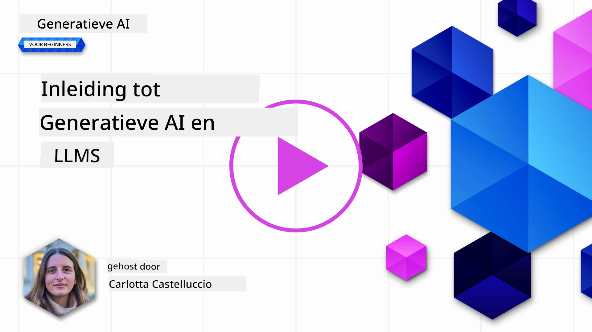
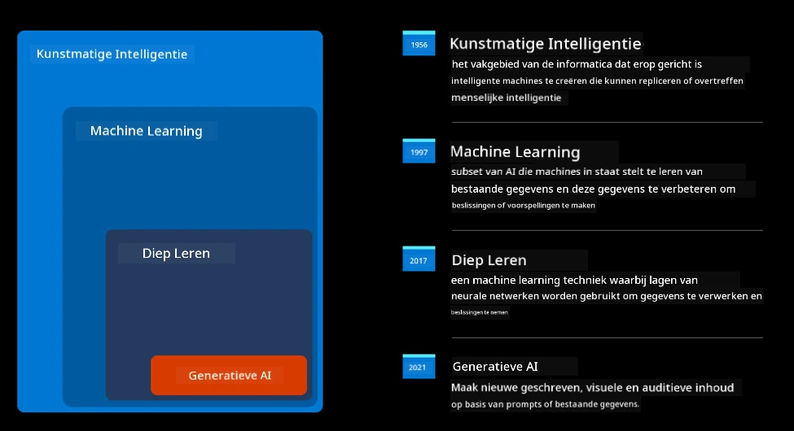
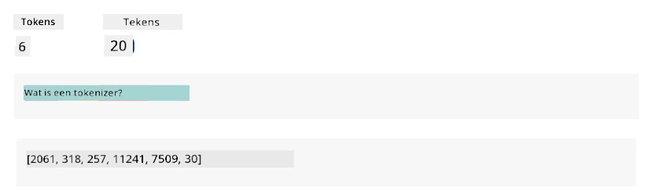
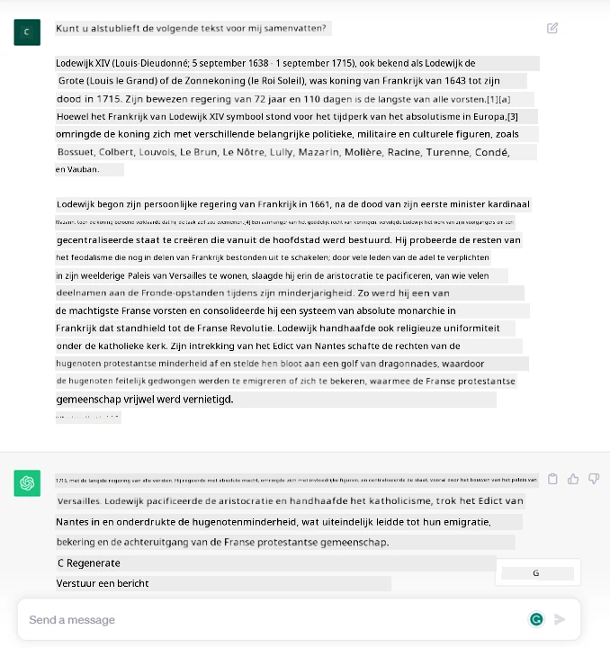
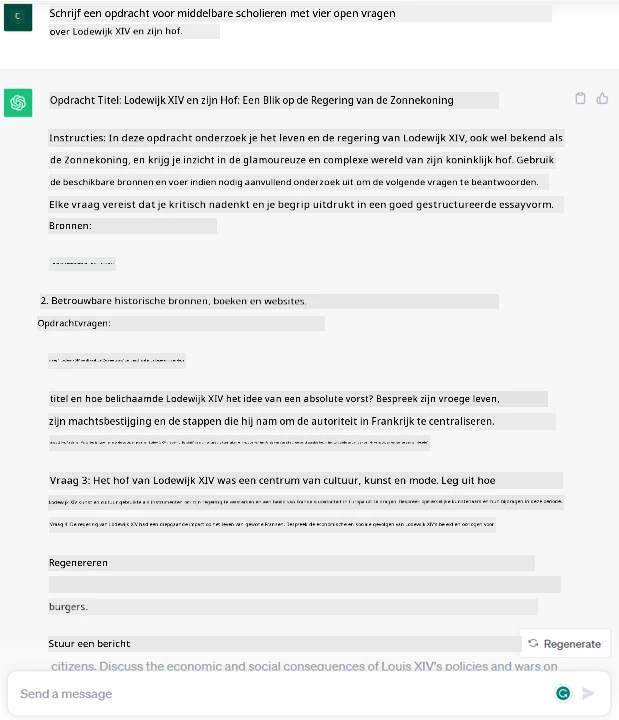
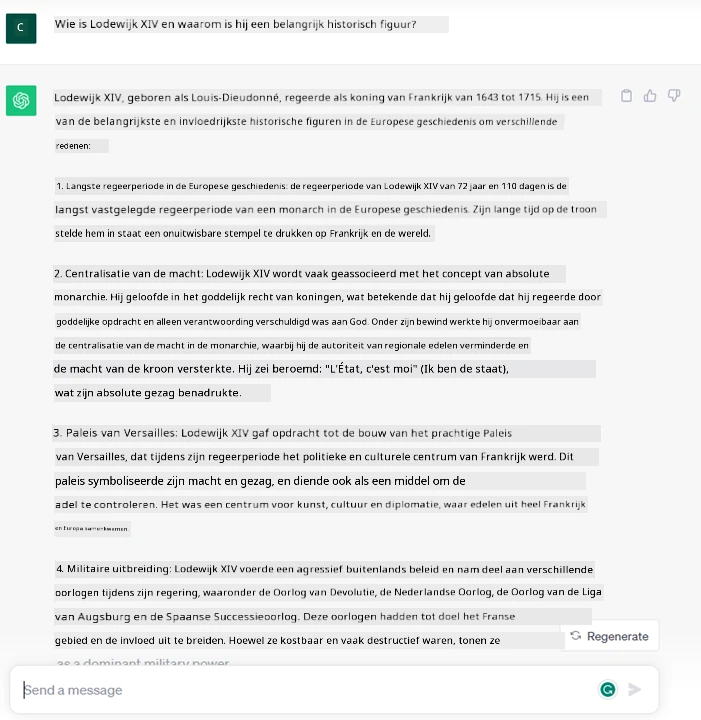
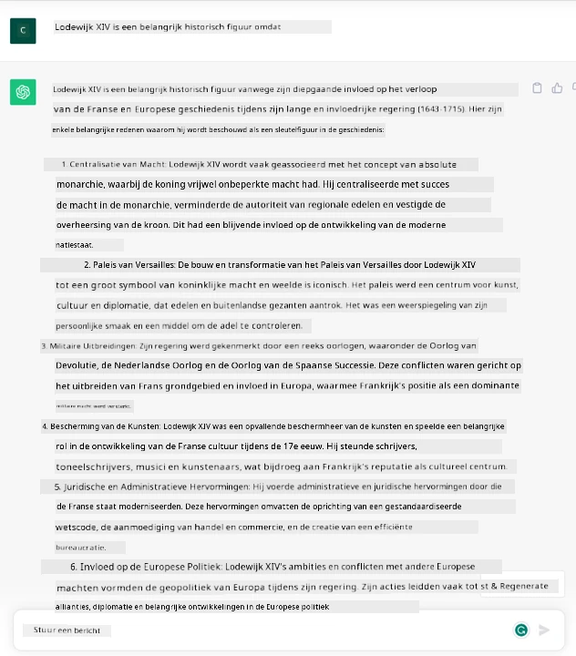
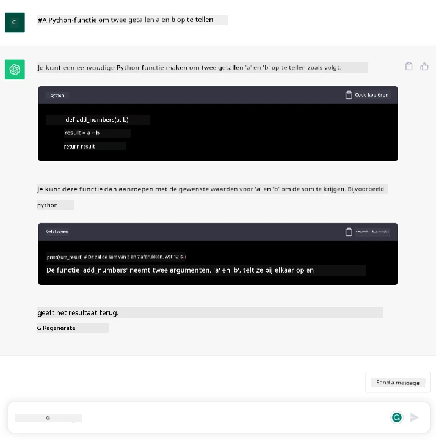

# Introductie tot Generatieve AI en Grote Taalmodellen

_(Klik op de afbeelding hierboven om de video van deze les te bekijken)_

Generatieve AI is kunstmatige intelligentie die in staat is tekst, afbeeldingen en andere soorten content te genereren. Wat het een fantastische technologie maakt, is dat het AI democratiseert; iedereen kan het gebruiken met slechts een tekstprompt, een zin geschreven in een natuurlijke taal. Je hoeft geen taal als Java of SQL te leren om iets waardevols te bereiken, alles wat je nodig hebt is je eigen taal te gebruiken, te zeggen wat je wilt en er komt een suggestie uit een AI-model. De toepassingen en impact hiervan zijn enorm, je schrijft of begrijpt rapporten, schrijft toepassingen en nog veel meer, allemaal binnen enkele seconden.

In dit curriculum verkennen we hoe onze startup generatieve AI inzet om nieuwe scenario's in de onderwijswereld te ontsluiten en hoe we de onvermijdelijke uitdagingen aanpakken die samenhangen met de maatschappelijke implicaties van de toepassing en de technologische beperkingen.

## Introductie

Deze les behandelt:

- Introductie tot het businessscenario: ons startup-idee en missie.
- Generatieve AI en hoe we tot het huidige technologielandschap zijn gekomen.
- Het innerlijke werk van een groot taalmodel.
- Belangrijkste mogelijkheden en praktische toepassingen van Grote Taalmodellen.

## Leerdoelen

Na het voltooien van deze les begrijp je:

- Wat generatieve AI is en hoe Grote Taalmodellen werken.
- Hoe je grote taalmodellen kunt inzetten voor verschillende gebruikssituaties, met een focus op onderwijsscenario's.

## Scenario: onze educatieve startup

Generatieve Kunstmatige Intelligentie (AI) vertegenwoordigt het toppunt van AI-technologie en verlegt de grenzen van wat ooit onmogelijk werd geacht. Generatieve AI-modellen hebben verschillende mogelijkheden en toepassingen, maar voor dit curriculum onderzoeken we hoe het onderwijs revolutioneert via een fictieve startup. We noemen deze startup _onze startup_. Onze startup opereert in het onderwijsdomein met de ambitieuze missie

> _de toegankelijkheid van leren wereldwijd verbeteren, zorgen voor gelijke toegang tot onderwijs en gepersonaliseerde leerervaringen bieden aan elke leerling, passend bij hun behoeften_.

Ons startteam is zich ervan bewust dat we dit doel niet kunnen bereiken zonder gebruik te maken van een van de krachtigste hulpmiddelen van moderne tijden – Grote Taalmodellen (LLM's).

Generatieve AI zal naar verwachting de manier waarop we leren en lesgeven vandaag de dag revolutioneren, waarbij studenten virtuele leraren tot hun beschikking hebben, 24 uur per dag, die enorme hoeveelheden informatie en voorbeelden bieden, en docenten innovatieve hulpmiddelen kunnen gebruiken om hun studenten te beoordelen en feedback te geven.

Laten we eerst enkele basale concepten en terminologie definiëren die we gedurende het curriculum zullen gebruiken.

## Hoe zijn we aan Generatieve AI gekomen?

Ondanks de enorme _hype_ die recentelijk is gecreëerd door de aankondiging van generatieve AI-modellen, is deze technologie decennia in ontwikkeling, met de eerste onderzoeksinspanningen die teruggaan tot de jaren '60. We zijn nu op een punt waarop AI menselijke cognitieve capaciteiten heeft, zoals conversatie, zoals bijvoorbeeld getoond door [OpenAI ChatGPT](https://openai.com/chatgpt) of [Microsoft Copilot](https://copilot.microsoft.com/?WT.mc_id=academic-105485-koreyst), die ook een GPT-model gebruikt voor zijn conversatie-gebaseerde webzoekervaring.

Teruggaand naar de oorsprong bestonden de allereerste AI-prototypes uit getypte chatbots, die afhankelijk waren van een kennisbasis geëxtraheerd uit een groep experts en vastgelegd in een computer. De antwoorden in de kennisbasis werden geactiveerd door sleutelwoorden die in de inputtekst voorkwamen.
Het werd echter al snel duidelijk dat zo’n benadering met getypte chatbots niet goed schaalde.

### Een statistische benadering van AI: Machine Learning

Een keerpunt kwam in de jaren '90, met de toepassing van een statistische benadering op tekstanalyse. Dit leidde tot de ontwikkeling van nieuwe algoritmes – bekend als machine learning – die in staat zijn patronen te leren van data zonder expliciet te zijn geprogrammeerd. Deze aanpak stelt machines in staat om menselijk taalbegrip te simuleren: een statistisch model wordt getraind op tekst-label koppelingen, waardoor het model onbekende invoertekst kan classificeren met een vooraf gedefinieerd label dat de bedoeling van de boodschap vertegenwoordigt.

### Neurale netwerken en moderne virtuele assistenten

In de afgelopen jaren heeft de technologische evolutie van hardware, die grotere hoeveelheden data en complexere berekeningen aankan, onderzoek in AI gestimuleerd, wat leidde tot de ontwikkeling van geavanceerde machine learning-algoritmes die bekend staan als neurale netwerken of deep learning-algoritmes.

Neurale netwerken (en in het bijzonder Recurrent Neural Networks – RNNs) hebben natuurlijke taalverwerking aanzienlijk verbeterd, waardoor de betekenis van tekst op een meer zinvolle manier kan worden gerepresenteerd, waarbij rekening wordt gehouden met de context van een woord in een zin.

Dit is de technologie die de virtuele assistenten aandreef die in het eerste decennium van de nieuwe eeuw werden geboren, zeer bekwaam in het interpreteren van menselijke taal, het identificeren van een behoefte en het uitvoeren van een actie om daaraan te voldoen – zoals antwoorden met een vooraf gedefinieerd script of het gebruiken van een service van een derde partij.

### Hedendaags, Generatieve AI

Zo kwamen we aan Generatieve AI van vandaag, die kan worden gezien als een subset van deep learning.

Na decennia van onderzoek in het AI-veld overtrof een nieuw modelarchitectuur – genaamd _Transformer_ – de beperkingen van RNN's, doordat het veel langere tekstreeksen als input kan verwerken. Transformers zijn gebaseerd op het attentie-mechanisme, waardoor het model verschillende gewichten kan toekennen aan de input die het ontvangt, waarbij ‘meer aandacht’ wordt besteed aan de plekken waar de meest relevante informatie geconcentreerd is, ongeacht hun volgorde in de tekstreeks.

De meeste recente generatieve AI-modellen – ook bekend als Grote Taalmodellen (LLM's), omdat ze met tekstuele invoer en uitvoer werken – zijn inderdaad gebaseerd op deze architectuur. Wat interessant is aan deze modellen – getraind op enorme hoeveelheden onbegeleide data uit diverse bronnen zoals boeken, artikelen en websites – is dat ze kunnen worden aangepast aan een breed scala aan taken en grammaticaal correcte tekst kunnen genereren met een zeker niveau van creativiteit. Dus, ze hebben niet alleen het vermogen van een machine om een invoertekst te 'begrijpen' enorm verbeterd, maar ook hun capaciteit om een originele reactie in menselijke taal te genereren.

## Hoe werken grote taalmodellen?

In het volgende hoofdstuk gaan we verschillende typen generatieve AI-modellen verkennen, maar voor nu bekijken we hoe grote taalmodellen werken, met een focus op OpenAI GPT (Generative Pre-trained Transformer) modellen.

- **Tokenizer, tekst naar cijfers**: Grote Taalmodellen ontvangen tekst als input en genereren tekst als output. Omdat het statistische modellen zijn, werken ze veel beter met cijfers dan met tekstreeksen. Daarom wordt elke invoer voor het model verwerkt door een tokenizer, vóórdat deze door het kernmodel wordt gebruikt. Een token is een tekstblok – bestaande uit een variabel aantal tekens, dus de hoofdtaak van de tokenizer is om de invoer op te splitsen in een reeks tokens. Vervolgens wordt elke token gekoppeld aan een tokenindex, de gehele getalkodering van het oorspronkelijke tekstblok.

- **Voorspellen van output tokens**: Gegeven n tokens als input (met een maximum n dat varieert van model tot model), kan het model één token voorspellen als output. Deze token wordt vervolgens opgenomen in de input van de volgende iteratie, in een uitbreidend vensterpatroon, wat zorgt voor een betere gebruikerservaring omdat je één (of meerdere) zinnen als antwoord krijgt. Dit verklaart waarom, als je ooit met ChatGPT hebt gespeeld, je soms hebt gemerkt dat het lijkt te stoppen midden in een zin.

- **Selectieproces, waarschijnlijkheidsverdeling**: De outputtoken wordt door het model gekozen op basis van de waarschijnlijkheid dat deze voorkomt na de huidige tekstreeks. Dit komt doordat het model een waarschijnlijkheidsverdeling voorspelt over alle mogelijke ‘volgende tokens’, berekend op basis van de training. Echter wordt niet altijd de token met de hoogste waarschijnlijkheid gekozen uit de resulterende verdeling. Er wordt een mate van willekeur toegevoegd aan deze keuze, zodat het model niet-deterministisch handelt – we krijgen niet elke keer exact dezelfde output voor dezelfde input. Deze mate van willekeur wordt toegevoegd om het creatieve denkproces te simuleren en kan worden aangepast met een modelparameter genaamd temperatuur.

## Hoe kan onze startup Grote Taalmodellen inzetten?

Nu we een beter begrip hebben van het innerlijke werk van een groot taalmodel, bekijken we enkele praktische voorbeelden van de meest voorkomende taken die ze behoorlijk goed kunnen uitvoeren, met het oog op ons zakelijke scenario.
We zeiden dat de belangrijkste mogelijkheid van een Groot Taalmodel is _het genereren van tekst vanaf nul, beginnend met een tekstuele invoer, geschreven in natuurlijke taal_.

Maar wat voor soort tekstuele invoer en uitvoer?
De invoer van een groot taalmodel staat bekend als een prompt, terwijl de uitvoer bekend staat als een completion, een term die verwijst naar het modelmechanisme van het genereren van de volgende token om de huidige invoer te voltooien. We gaan diep in op wat een prompt is en hoe deze zo kan worden ontworpen dat we het beste uit ons model halen. Maar voor nu zeggen we dat een prompt kan bevatten:

- Een **instructie** die het type output specificeert dat we van het model verwachten. Deze instructie kan soms enkele voorbeelden of aanvullende gegevens bevatten.

  1. Samenvatting van een artikel, boek, productrecensies en meer, samen met het extraheren van inzichten uit ongestructureerde data.
    
    
  
  2. Creatieve ideeënvorming en ontwerp van een artikel, een essay, een opdracht of meer.
      
     

- Een **vraag**, gesteld in de vorm van een gesprek met een agent.
  
  

- Een stuk **tekst om te vervolledigen**, wat impliciet een verzoek om schrijfhulp is.
  
  

- Een stuk **code** samen met het verzoek dit uit te leggen en documenteren, of een opmerking met het verzoek een stukje code te genereren dat een specifieke taak uitvoert.
  
  

De bovenstaande voorbeelden zijn vrij eenvoudig en zijn niet bedoeld als een uitputtende demonstratie van de mogelijkheden van Grote Taalmodellen. Ze zijn bedoeld om het potentieel van het gebruik van generatieve AI te tonen, met name maar niet uitsluitend in educatieve contexten.

Ook is de output van een generatief AI-model niet perfect en soms kan de creativiteit van het model tegen het model werken, resulterend in een output die een combinatie is van woorden die de menselijke gebruiker kan interpreteren als een mystificatie van de realiteit, of die beledigend kan zijn. Generatieve AI is niet intelligent – tenminste niet in de meer omvattende definitie van intelligentie, inclusief kritisch en creatief redeneren of emotionele intelligentie; het is niet deterministisch en het is niet betrouwbaar, omdat verzinsels zoals foutieve verwijzingen, inhoud en uitspraken kunnen worden gecombineerd met juiste informatie en op een overtuigende en zelfverzekerde manier worden gepresenteerd. In de volgende lessen zullen we met al deze beperkingen omgaan en zien wat we kunnen doen om ze te mitigeren.

## Opdracht

Je opdracht is om meer te lezen over [generatieve AI](https://en.wikipedia.org/wiki/Generative_artificial_intelligence?WT.mc_id=academic-105485-koreyst) en te proberen een gebied te identificeren waar je vandaag generatieve AI zou toevoegen dat het nog niet heeft. Hoe zou de impact verschillen ten opzichte van het "oude" manier, kun je iets doen wat voorheen niet mogelijk was, of ben je sneller? Schrijf een samenvatting van 300 woorden over hoe jouw droom AI-startup eruit zou zien en voeg kopjes toe zoals "Probleem", "Hoe ik AI zou gebruiken", "Impact" en optioneel een businessplan.

Als je deze taak hebt gedaan, ben je misschien zelfs klaar om te solliciteren bij Microsoft’s incubator, [Microsoft for Startups Founders Hub](https://www.microsoft.com/startups?WT.mc_id=academic-105485-koreyst) We bieden credits aan voor zowel Azure, OpenAI, mentoring en nog veel meer, bekijk het zeker!

## Kennischeck

Wat is waar over grote taalmodellen?

1. Je krijgt elke keer exact hetzelfde antwoord.
1. Het doet dingen perfect, heel goed in getallen optellen, werkende code produceren, enz.
1. Het antwoord kan variëren ondanks hetzelfde prompt te gebruiken. Het is ook erg goed in het geven van een eerste concept van iets, zij het tekst of code. Maar je moet de resultaten verbeteren.

A: 3, een LLM is niet-deterministisch, het antwoord varieert, hoewel je de variatie kunt regelen via de temperatuurinstelling. Je mag ook niet verwachten dat het dingen perfect doet, het is hier om het zware werk voor je te doen wat vaak betekent dat je een goede eerste poging krijgt die je geleidelijk moet verbeteren.

## Goed gedaan! Ga door met de reis

Na het voltooien van deze les, bekijk onze [Generative AI Learning collectie](https://aka.ms/genai-collection?WT.mc_id=academic-105485-koreyst) om je kennis over Generatieve AI verder te vergroten!

Ga naar Les 2 waar we zullen kijken hoe je [verschillende LLM-types kunt verkennen en vergelijken](../02-exploring-and-comparing-different-llms/README.md?WT.mc_id=academic-105485-koreyst)!

---

<!-- CO-OP TRANSLATOR DISCLAIMER START -->
**Disclaimer**:
Dit document is vertaald met behulp van de AI vertaaldienst [Co-op Translator](https://github.com/Azure/co-op-translator). Hoewel we streven naar nauwkeurigheid, dient u er rekening mee te houden dat geautomatiseerde vertalingen fouten of onnauwkeurigheden kunnen bevatten. Het originele document in de oorspronkelijke taal moet worden beschouwd als de gezaghebbende bron. Voor kritieke informatie wordt professionele menselijke vertaling aanbevolen. Wij zijn niet aansprakelijk voor eventuele misverstanden of verkeerde interpretaties die voortvloeien uit het gebruik van deze vertaling.
<!-- CO-OP TRANSLATOR DISCLAIMER END -->