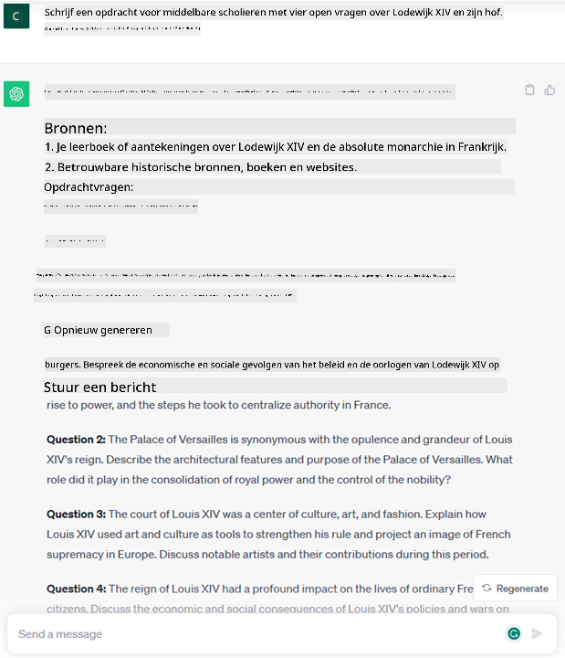
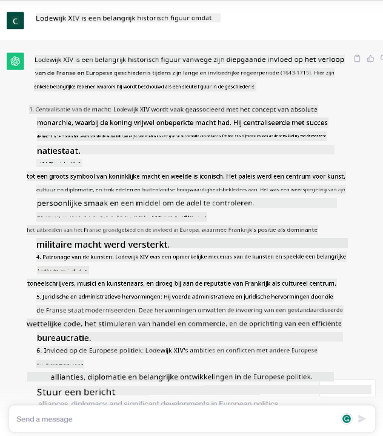

<!--
CO_OP_TRANSLATOR_METADATA:
{
  "original_hash": "bfb7901bdbece1ba3e9f35c400ca33e8",
  "translation_date": "2025-10-17T19:56:49+00:00",
  "source_file": "01-introduction-to-genai/README.md",
  "language_code": "nl"
}
-->
# Introductie tot Generatieve AI en Grote Taalmodellen

_(Klik op de afbeelding hierboven om de video van deze les te bekijken)_

Generatieve AI is kunstmatige intelligentie die in staat is om tekst, afbeeldingen en andere soorten content te genereren. Wat deze technologie zo bijzonder maakt, is dat het AI toegankelijk maakt voor iedereen. Je hebt alleen een tekstprompt nodig, een zin geschreven in natuurlijke taal. Je hoeft geen programmeertaal zoals Java of SQL te leren om iets waardevols te bereiken; je gebruikt gewoon je eigen taal, geeft aan wat je wilt, en de AI genereert een suggestie. De toepassingen en impact hiervan zijn enorm: je kunt rapporten schrijven of begrijpen, applicaties maken en nog veel meer, allemaal binnen enkele seconden.

In dit curriculum gaan we onderzoeken hoe onze startup generatieve AI inzet om nieuwe mogelijkheden in de onderwijswereld te ontsluiten en hoe we omgaan met de onvermijdelijke uitdagingen die gepaard gaan met de sociale implicaties van de toepassing en de technologische beperkingen.

## Introductie

Deze les behandelt:

- Introductie tot de zakelijke context: ons startup-idee en missie.
- Generatieve AI en hoe we zijn uitgekomen bij het huidige technologische landschap.
- De interne werking van een groot taalmodel.
- Belangrijkste mogelijkheden en praktische toepassingen van Grote Taalmodellen.

## Leerdoelen

Na het voltooien van deze les begrijp je:

- Wat generatieve AI is en hoe Grote Taalmodellen werken.
- Hoe je Grote Taalmodellen kunt inzetten voor verschillende toepassingen, met een focus op onderwijsscenario's.

## Scenario: onze educatieve startup

Generatieve Kunstmatige Intelligentie (AI) vertegenwoordigt de top van AI-technologie en verlegt de grenzen van wat ooit onmogelijk werd geacht. Generatieve AI-modellen hebben verschillende mogelijkheden en toepassingen, maar in dit curriculum gaan we onderzoeken hoe het onderwijs wordt gerevolutioneerd door een fictieve startup. We noemen deze startup _onze startup_. Onze startup werkt in de onderwijssector met de ambitieuze missie:

> _het verbeteren van toegankelijkheid in leren, wereldwijd, het waarborgen van gelijke toegang tot onderwijs en het bieden van gepersonaliseerde leerervaringen aan elke leerling, afgestemd op hun behoeften_.

Ons startupteam is zich ervan bewust dat we dit doel niet kunnen bereiken zonder gebruik te maken van een van de krachtigste tools van deze tijd – Grote Taalmodellen (LLMs).

Generatieve AI zal naar verwachting de manier waarop we vandaag leren en lesgeven revolutioneren, met studenten die 24 uur per dag virtuele leraren tot hun beschikking hebben die enorme hoeveelheden informatie en voorbeelden bieden, en leraren die innovatieve tools kunnen gebruiken om hun studenten te beoordelen en feedback te geven.

Laten we beginnen met het definiëren van enkele basisconcepten en terminologie die we in het hele curriculum zullen gebruiken.

## Hoe is Generatieve AI ontstaan?

Ondanks de buitengewone _hype_ die de laatste tijd is ontstaan door de aankondiging van generatieve AI-modellen, is deze technologie al decennia in ontwikkeling, met de eerste onderzoeksinspanningen die teruggaan tot de jaren '60. We zijn nu op een punt waar AI menselijke cognitieve capaciteiten heeft, zoals conversatie, zoals bijvoorbeeld te zien is bij [OpenAI ChatGPT](https://openai.com/chatgpt) of [Bing Chat](https://www.microsoft.com/edge/features/bing-chat?WT.mc_id=academic-105485-koreyst), die ook een GPT-model gebruikt voor Bing-gesprekken.

Even terug in de tijd: de allereerste prototypes van AI bestonden uit typemachine-chatbots, die vertrouwden op een kennisbasis die was geëxtraheerd uit een groep experts en in een computer was verwerkt. De antwoorden in de kennisbasis werden geactiveerd door trefwoorden die in de invoertekst verschenen. 
Al snel werd echter duidelijk dat een dergelijke aanpak, met typemachine-chatbots, niet goed schaalde.

### Een statistische benadering van AI: Machine Learning

Een keerpunt kwam in de jaren '90, met de toepassing van een statistische benadering van tekstanalyse. Dit leidde tot de ontwikkeling van nieuwe algoritmen – bekend als machine learning – die patronen uit gegevens konden leren zonder expliciet geprogrammeerd te zijn. Deze aanpak stelt machines in staat om menselijke taalbegrip te simuleren: een statistisch model wordt getraind op tekst-label koppelingen, waardoor het model onbekende invoertekst kan classificeren met een vooraf gedefinieerd label dat de intentie van het bericht vertegenwoordigt.

### Neurale netwerken en moderne virtuele assistenten

In de afgelopen jaren heeft de technologische evolutie van hardware, die grotere hoeveelheden gegevens en complexere berekeningen aankan, onderzoek in AI gestimuleerd, wat heeft geleid tot de ontwikkeling van geavanceerde machine learning-algoritmen, bekend als neurale netwerken of deep learning-algoritmen.

Neurale netwerken (en in het bijzonder Recurrent Neural Networks – RNNs) hebben de verwerking van natuurlijke taal aanzienlijk verbeterd, waardoor de betekenis van tekst op een meer betekenisvolle manier kan worden weergegeven, waarbij de context van een woord in een zin wordt gewaardeerd.

Dit is de technologie die de virtuele assistenten aandreef die in het eerste decennium van de nieuwe eeuw werden geboren, zeer bekwaam in het interpreteren van menselijke taal, het identificeren van een behoefte en het uitvoeren van een actie om daaraan te voldoen – zoals antwoorden met een vooraf gedefinieerd script of het gebruiken van een externe service.

### Heden, Generatieve AI

Zo zijn we gekomen tot Generatieve AI vandaag, dat kan worden gezien als een subset van deep learning.

Na decennia van onderzoek op het gebied van AI heeft een nieuwe modelarchitectuur – genaamd _Transformer_ – de beperkingen van RNNs overwonnen, doordat het veel langere tekstreeksen als invoer kan verwerken. Transformers zijn gebaseerd op het aandachtmechanisme, waardoor het model verschillende gewichten kan toekennen aan de invoer die het ontvangt, ‘meer aandacht’ kan besteden aan waar de meest relevante informatie geconcentreerd is, ongeacht hun volgorde in de tekstreeks.

De meeste recente generatieve AI-modellen – ook wel Grote Taalmodellen (LLMs) genoemd, omdat ze werken met tekstuele invoer en uitvoer – zijn inderdaad gebaseerd op deze architectuur. Wat interessant is aan deze modellen – getraind op een enorme hoeveelheid niet-gelabelde gegevens uit diverse bronnen zoals boeken, artikelen en websites – is dat ze kunnen worden aangepast aan een breed scala aan taken en grammaticaal correcte tekst kunnen genereren met een vleugje creativiteit. Ze hebben niet alleen de capaciteit van een machine om een invoertekst te ‘begrijpen’ enorm verbeterd, maar ze hebben ook hun vermogen om een originele reactie in menselijke taal te genereren mogelijk gemaakt.

## Hoe werken grote taalmodellen?

In het volgende hoofdstuk gaan we verschillende soorten generatieve AI-modellen verkennen, maar laten we nu eens kijken hoe grote taalmodellen werken, met een focus op OpenAI GPT (Generative Pre-trained Transformer) modellen.

- **Tokenizer, tekst naar cijfers**: Grote Taalmodellen ontvangen een tekst als invoer en genereren een tekst als uitvoer. Omdat het statistische modellen zijn, werken ze echter veel beter met cijfers dan met tekstreeksen. Daarom wordt elke invoer naar het model verwerkt door een tokenizer voordat het door het kernmodel wordt gebruikt. Een token is een stukje tekst – bestaande uit een variabel aantal tekens, dus de belangrijkste taak van de tokenizer is het splitsen van de invoer in een reeks tokens. Vervolgens wordt elk token gekoppeld aan een tokenindex, wat de gehele codering is van het oorspronkelijke tekstgedeelte.

- **Voorspellen van uitvoertokens**: Gegeven n tokens als invoer (met een maximale n die varieert van model tot model), kan het model één token als uitvoer voorspellen. Dit token wordt vervolgens opgenomen in de invoer van de volgende iteratie, in een uitbreidend vensterpatroon, wat een betere gebruikerservaring mogelijk maakt door één (of meerdere) zinnen als antwoord te krijgen. Dit verklaart waarom, als je ooit met ChatGPT hebt gespeeld, je misschien hebt gemerkt dat het soms lijkt te stoppen midden in een zin.

- **Selectieproces, waarschijnlijkheidsverdeling**: Het uitvoertoken wordt door het model gekozen op basis van de waarschijnlijkheid dat het voorkomt na de huidige tekstreeks. Dit komt omdat het model een waarschijnlijkheidsverdeling voorspelt over alle mogelijke ‘volgende tokens’, berekend op basis van zijn training. Echter, niet altijd wordt het token met de hoogste waarschijnlijkheid gekozen uit de resulterende verdeling. Een mate van willekeur wordt toegevoegd aan deze keuze, zodat het model zich niet-deterministisch gedraagt - we krijgen niet exact dezelfde uitvoer voor dezelfde invoer. Deze mate van willekeur wordt toegevoegd om het proces van creatief denken te simuleren en kan worden aangepast met een modelparameter genaamd temperatuur.

## Hoe kan onze startup gebruik maken van Grote Taalmodellen?

Nu we een beter begrip hebben van de interne werking van een groot taalmodel, laten we enkele praktische voorbeelden bekijken van de meest voorkomende taken die ze behoorlijk goed kunnen uitvoeren, met een focus op ons zakelijke scenario. 
We zeiden dat de belangrijkste capaciteit van een Groot Taalmodel is _het genereren van tekst vanaf nul, beginnend met een tekstuele invoer, geschreven in natuurlijke taal_.

Maar wat voor soort tekstuele invoer en uitvoer?
De invoer van een groot taalmodel staat bekend als een prompt, terwijl de uitvoer bekend staat als een completion, een term die verwijst naar het mechanisme van het model om het volgende token te genereren om de huidige invoer te voltooien. We gaan dieper ingaan op wat een prompt is en hoe je deze kunt ontwerpen om het meeste uit ons model te halen. Maar laten we nu zeggen dat een prompt kan bevatten:

- Een **instructie** die het type uitvoer specificeert dat we van het model verwachten. Deze instructie kan soms enkele voorbeelden of aanvullende gegevens bevatten.

  1. Samenvatting van een artikel, boek, productrecensies en meer, samen met het extraheren van inzichten uit ongestructureerde gegevens.
    
    
  
  2. Creatieve ideeën en ontwerpen van een artikel, essay, opdracht of meer.
      
     

- Een **vraag**, gesteld in de vorm van een gesprek met een agent.
  
  

- Een stuk **tekst om aan te vullen**, wat impliciet een verzoek is om hulp bij schrijven.
  
  

- Een stuk **code** samen met het verzoek om het uit te leggen en te documenteren, of een opmerking waarin wordt gevraagd een stuk code te genereren dat een specifieke taak uitvoert.
  
  

De bovenstaande voorbeelden zijn vrij eenvoudig en zijn niet bedoeld als een uitgebreide demonstratie van de capaciteiten van Grote Taalmodellen. Ze zijn bedoeld om het potentieel van het gebruik van generatieve AI te laten zien, in het bijzonder maar niet beperkt tot educatieve contexten.

Daarnaast is de uitvoer van een generatief AI-model niet perfect en kan de creativiteit van het model soms tegenwerken, resulterend in een uitvoer die een combinatie is van woorden die de menselijke gebruiker kan interpreteren als een verdraaiing van de werkelijkheid, of die beledigend kan zijn. Generatieve AI is niet intelligent - althans niet in de meer uitgebreide definitie van intelligentie, inclusief kritisch en creatief redeneren of emotionele intelligentie; het is niet deterministisch, en het is niet betrouwbaar, aangezien verzinsels, zoals foutieve verwijzingen, inhoud en uitspraken, kunnen worden gecombineerd met correcte informatie en op een overtuigende en zelfverzekerde manier kunnen worden gepresenteerd. In de volgende lessen zullen we omgaan met al deze beperkingen en bekijken wat we kunnen doen om ze te beperken.

## Opdracht

Je opdracht is om meer te lezen over [generatieve AI](https://en.wikipedia.org/wiki/Generative_artificial_intelligence?WT.mc_id=academic-105485-koreyst) en te proberen een gebied te identificeren waar je vandaag generatieve AI zou toevoegen dat het nog niet heeft. Hoe zou de impact anders zijn dan het "oude manier" doen, kun je iets doen wat je eerder niet kon, of ben je sneller? Schrijf een samenvatting van 300 woorden over hoe jouw droom-AI-startup eruit zou zien en voeg koppen toe zoals "Probleem", "Hoe ik AI zou gebruiken", "Impact" en eventueel een bedrijfsplan.

Als je deze taak hebt gedaan, ben je misschien zelfs klaar om je aan te melden bij Microsoft's incubator, [Microsoft for Startups Founders Hub](https://www.microsoft.com/startups?WT.mc_id=academic-105485-koreyst). We bieden credits voor zowel Azure, OpenAI, mentoring en nog veel meer, bekijk het!

## Kennischeck

Wat is waar over grote taalmodellen?

1. Je krijgt elke keer exact hetzelfde antwoord.
1. Het doet dingen perfect, goed in optellen, produceert werkende code, enz.
1. Het antwoord kan variëren ondanks het gebruik van dezelfde prompt. Het is ook geweldig om je een eerste versie van iets te geven, of het nu tekst of code is. Maar je moet de resultaten verbeteren.

A: 3, een LLM is niet-deterministisch, het antwoord varieert, maar je kunt de variatie ervan controleren via een temperatuurinstelling. Je moet ook niet verwachten dat het dingen perfect doet, het is er om het zware werk voor je te doen, wat vaak betekent dat je een goede eerste poging krijgt die je geleidelijk moet verbeteren.

## Goed gedaan! Ga verder met de reis

Na het voltooien van deze les, bekijk onze [Generative AI Learning collectie](https://aka.ms/genai-collection?WT.mc_id=academic-105485-koreyst) om je kennis over Generatieve AI verder te vergroten!
Ga naar Les 2, waar we zullen kijken hoe we [verschillende typen LLM's kunnen verkennen en vergelijken](../02-exploring-and-comparing-different-llms/README.md?WT.mc_id=academic-105485-koreyst)!

---

**Disclaimer**:  
Dit document is vertaald met behulp van de AI-vertalingsservice [Co-op Translator](https://github.com/Azure/co-op-translator). Hoewel we streven naar nauwkeurigheid, dient u zich ervan bewust te zijn dat geautomatiseerde vertalingen fouten of onnauwkeurigheden kunnen bevatten. Het originele document in de oorspronkelijke taal moet worden beschouwd als de gezaghebbende bron. Voor kritieke informatie wordt professionele menselijke vertaling aanbevolen. Wij zijn niet aansprakelijk voor misverstanden of verkeerde interpretaties die voortvloeien uit het gebruik van deze vertaling.